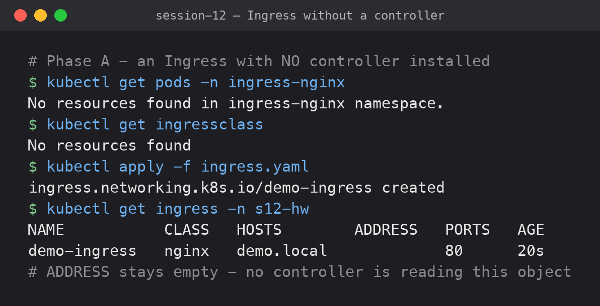
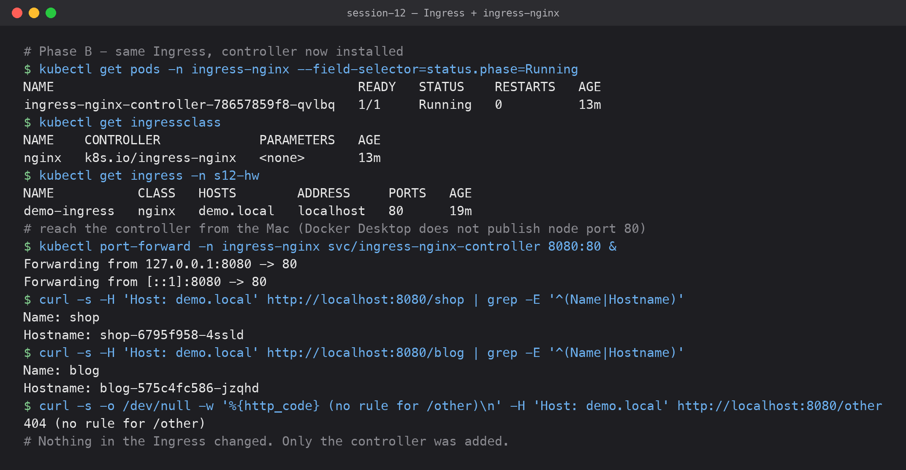
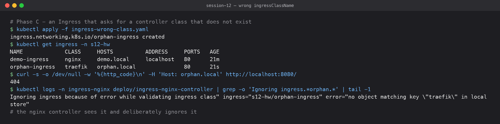

# 05 — Ingress vs Ingress Controller

**Submitted by:** Piyush Bansal
**Cluster:** Docker Desktop Kubernetes v1.36.1 (single node `desktop-control-plane`, arm64)
**Controller:** ingress-nginx v1.11.3

All output below was captured from a live run on this cluster.

## What is an Ingress?

An **Ingress** is a Kubernetes API object that holds **HTTP routing rules**: "requests for
host `demo.local` with path `/shop` go to Service `shop-svc` on port 80". It can also hold
TLS settings and controller-specific options (annotations such as rewrites).

It is only data stored in etcd. It does not open a port, run a process, or forward a
single packet.

## What is an Ingress Controller?

An **Ingress Controller** is a real program running in the cluster as pods, usually a
reverse proxy (NGINX, Traefik, HAProxy, Envoy, cloud load balancers). It:

1. watches the API server for Ingress objects of **its** IngressClass,
2. turns their rules into proxy configuration (for ingress-nginx, an `nginx.conf`),
3. receives the actual traffic and forwards it to the backend pods.

Kubernetes ships **no** controller by default. You install one.

## Difference

| | Ingress | Ingress Controller |
|---|---|---|
| What it is | API object (YAML) | Running pods (a proxy) |
| Role | *Declares* routing rules | *Implements* those rules |
| Created with | `kubectl apply -f ingress.yaml` | Helm chart / manifest / cloud addon |
| Count | Many per cluster, usually one per app | Usually one or a few per cluster |
| Handles traffic? | No | Yes |
| Linked by | `spec.ingressClassName` | `IngressClass` object it owns |

The link between them is the **IngressClass**. ingress-nginx creates an IngressClass named
`nginx`, and only processes Ingresses whose `ingressClassName` is `nginx`.

## Why both are required

The Ingress is the *what* and the controller is the *how*. The split lets every team write
the same portable `Ingress` YAML while the platform team chooses the implementation
(NGINX on-prem, AWS ALB on EKS, GCE LB on GKE) without touching the apps. Without a
controller, Ingress objects are ignored. Without Ingress objects, the controller has
nothing to route.

I demonstrated this in three phases using the same two apps ([apps.yaml](apps.yaml)):
`shop` and `blog`, both `ClusterIP` Services running `traefik/whoami` (it replies with
its own name and pod hostname).

### Phase A — Ingress with no controller



```text
$ kubectl get pods -n ingress-nginx
No resources found in ingress-nginx namespace.
$ kubectl get ingressclass
No resources found
$ kubectl apply -f ingress.yaml
ingress.networking.k8s.io/demo-ingress created
$ kubectl get ingress -n s12-hw
NAME           CLASS   HOSTS        ADDRESS   PORTS   AGE
demo-ingress   nginx   demo.local             80      20s
```

The API server accepted the Ingress, but `ADDRESS` stays empty because no controller is
reading it. There is nothing to send traffic to.

### Phase B — the same Ingress, with ingress-nginx installed



```bash
kubectl apply -f https://raw.githubusercontent.com/kubernetes/ingress-nginx/controller-v1.11.3/deploy/static/provider/kind/deploy.yaml
kubectl label node desktop-control-plane ingress-ready=true   # the kind manifest's nodeSelector needs this
```

```text
$ kubectl get pods -n ingress-nginx --field-selector=status.phase=Running
NAME                                        READY   STATUS    RESTARTS   AGE
ingress-nginx-controller-78657859f8-qvlbq   1/1     Running   0          13m
$ kubectl get ingressclass
NAME    CONTROLLER             PARAMETERS   AGE
nginx   k8s.io/ingress-nginx   <none>       13m
$ kubectl get ingress -n s12-hw
NAME           CLASS   HOSTS        ADDRESS     PORTS   AGE
demo-ingress   nginx   demo.local   localhost   80      19m
$ kubectl port-forward -n ingress-nginx svc/ingress-nginx-controller 8080:80 &
Forwarding from 127.0.0.1:8080 -> 80
Forwarding from [::1]:8080 -> 80
$ curl -s -H 'Host: demo.local' http://localhost:8080/shop | grep -E '^(Name|Hostname)'
Name: shop
Hostname: shop-6795f958-4ssld
$ curl -s -H 'Host: demo.local' http://localhost:8080/blog | grep -E '^(Name|Hostname)'
Name: blog
Hostname: blog-575c4fc586-jzqhd
$ curl -s -o /dev/null -w '%{http_code} (no rule for /other)\n' -H 'Host: demo.local' http://localhost:8080/other
404 (no rule for /other)
```

**The Ingress YAML was not changed.** Installing the controller alone made the `ADDRESS`
appear and routing start: `/shop` → shop pod, `/blog` → blog pod, anything else → 404
from the controller's default backend.

Note: Docker Desktop does not publish the node's port 80 to the Mac, so I reached the
controller with `kubectl port-forward` to its Service. Requests still go through
ingress-nginx and its routing rules.

### Phase C — an Ingress for a controller that does not exist



[ingress-wrong-class.yaml](ingress-wrong-class.yaml) asks for `ingressClassName: traefik`.

```text
$ kubectl apply -f ingress-wrong-class.yaml
ingress.networking.k8s.io/orphan-ingress created
$ kubectl get ingress -n s12-hw
NAME             CLASS     HOSTS          ADDRESS     PORTS   AGE
demo-ingress     nginx     demo.local     localhost   80      21m
orphan-ingress   traefik   orphan.local               80      21s
$ curl -s -o /dev/null -w '%{http_code}\n' -H 'Host: orphan.local' http://localhost:8080/
404
$ kubectl logs -n ingress-nginx deploy/ingress-nginx-controller | grep -o 'Ignoring ingress.*orphan.*' | tail -1
Ignoring ingress because of error while validating ingress class" ingress="s12-hw/orphan-ingress" error="no object matching key \"traefik\" in local store"
```

A controller *is* running, but not the one this Ingress asked for. ingress-nginx logs that
it is deliberately ignoring it. The class name has to match.

## Examples of Ingress Controllers

| Controller | IngressClass controller value | Typical use |
|---|---|---|
| ingress-nginx | `k8s.io/ingress-nginx` | Most common, on-prem and any cloud |
| Traefik | `traefik.io/ingress-controller` | k3s default, auto Let's Encrypt |
| HAProxy | `haproxy.org/ingress-controller` | High-throughput L7 |
| AWS Load Balancer Controller | `ingress.k8s.aws/alb` | Provisions a real AWS ALB per Ingress |
| GKE Ingress | `networking.gke.io/ingress` | Provisions a Google Cloud LB |
| Istio / Contour (Envoy) | `istio.io/ingress-controller`, `projectcontour.io/...` | Service-mesh / Envoy-based |

## What I learned

- An Ingress with no controller is valid YAML that does nothing. An empty `ADDRESS`
  column is the first sign.
- `ingressClassName` is how an Ingress picks its controller. A typo or the wrong class
  fails silently: no error on `apply`, only a log line in the controller.
- `kubectl get ingressclass` is the fastest way to see which controllers a cluster has.

## Files

| File | Purpose |
|---|---|
| [apps.yaml](apps.yaml) | Namespace, `shop` and `blog` Deployments + ClusterIP Services |
| [ingress.yaml](ingress.yaml) | Path routing `/shop`, `/blog` for host `demo.local`, class `nginx` |
| [ingress-wrong-class.yaml](ingress-wrong-class.yaml) | Ingress asking for a non-existent `traefik` class |
