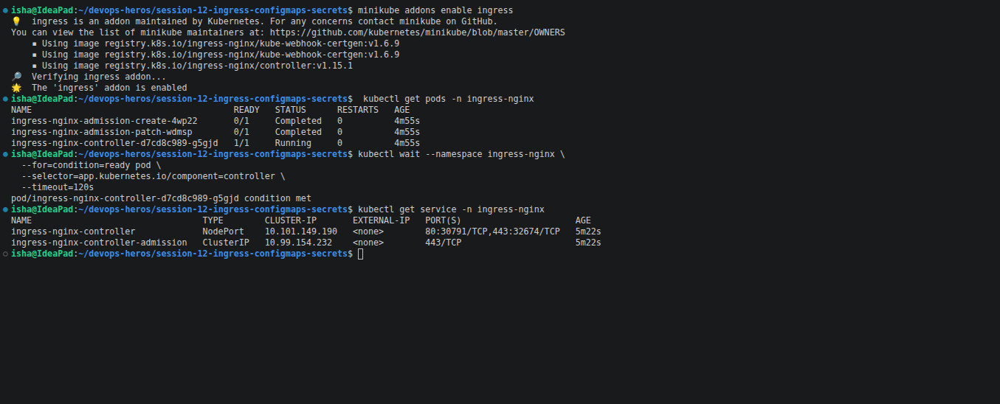
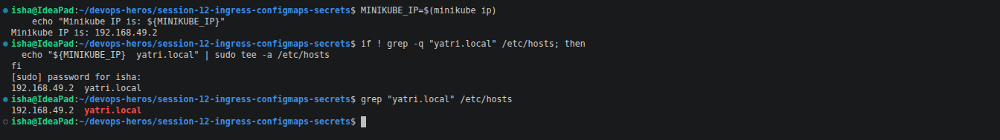
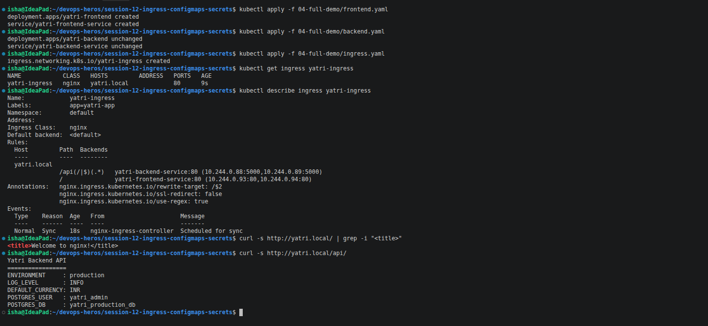
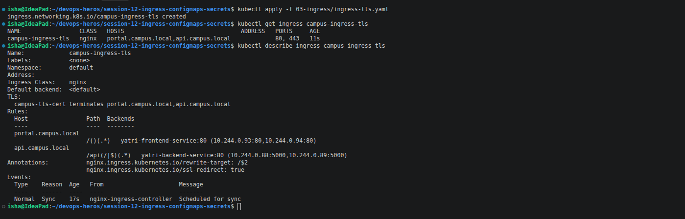
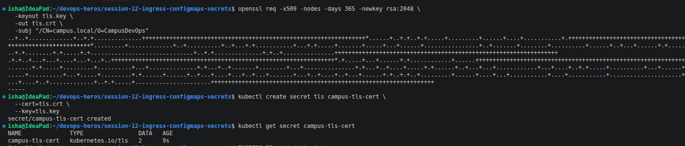
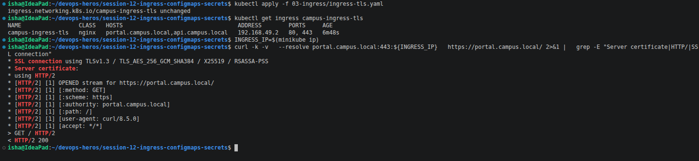
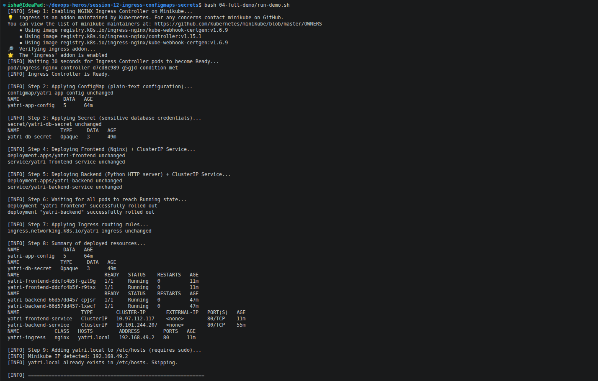
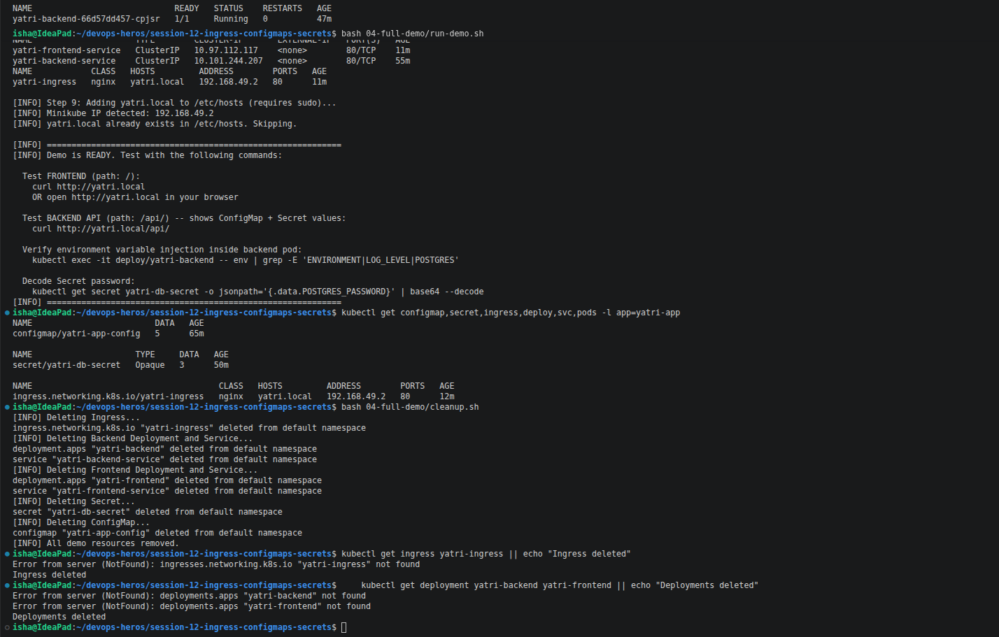

### Task 1: Non-Sensitive Configuration Decoupling via ConfigMaps

- **Short Description:** Decouple environment-specific runtime configurations (log levels, ports, currency settings) from container images by storing them in a declarative `ConfigMap`.
- **Workflow:**
    1. Review `01-configmap/app-config.yaml`.
    2. Apply the manifest to the cluster.
    3. Inspect the stored keys and verify the payload using `describe` and JSONPath queries.
- **Commands to Run:**
    
    ```bash
    kubectl apply -f 01-configmap/app-config.yaml
    kubectl get configmap yatri-app-config
    kubectl describe configmap yatri-app-config
    kubectl get configmap yatri-app-config -o jsonpath='{.data.ENVIRONMENT}' && echo ""
    kubectl get configmap yatri-app-config -o jsonpath='{.data.LOG_LEVEL}' && echo ""
    ```
    
- **Screenshot**
  

---

### Task 2: ConfigMap Live Update & Pod Immobility Verification Drill

- **Short Description:** Demonstrate that updating a `ConfigMap` does **not** retroactively update environment variables inside active running containers, and use `kubectl rollout restart` to trigger a zero-downtime rolling update.
- **Workflow:**
    1. Patch the active `yatri-app-config` ConfigMap to change `ENVIRONMENT` from `production` to `staging`.
    2. Query the running pod's environment directly using `kubectl exec` to show that the variable did not change.
    3. Perform a rolling restart on the deployment.
    4. Verify the new pod instances picked up `ENVIRONMENT=staging`.
- **Commands to Run:**
    
    ```bash
    # Step 1: Patch ConfigMap live
    kubectl patch configmap yatri-app-config --type merge -p '{"data":{"ENVIRONMENT":"staging"}}'
    
    # Step 2: Check running pod env (assuming backend pod from 04-full-demo is running)
    kubectl exec -it deploy/yatri-backend -- env | grep ENVIRONMENT
    
    # Step 3: Trigger rolling restart
    kubectl rollout restart deployment/yatri-backend
    kubectl rollout status deployment/yatri-backend
    
    # Step 4: Re-check pod env
    kubectl exec -it deploy/yatri-backend -- env | grep ENVIRONMENT
    
    # Step 5: Revert patch for subsequent labs
    kubectl patch configmap yatri-app-config --type merge -p '{"data":{"ENVIRONMENT":"production"}}'
    kubectl rollout restart deployment/yatri-backend
    ```
    
- **Screenshot**


---

### Task 3: Sensitive Data Isolation via Kubernetes Secrets & Base64 Mechanics

- **Short Description:** Implement credential isolation using an `Opaque` Kubernetes `Secret`, illustrating that Base64 is merely an encoding scheme (not encryption) that can be decoded on the CLI.
- **Workflow:**
    1. Review `02-secret/db-secret.yaml`.
    2. Apply the manifest to store database user and password credentials.
    3. Verify that `kubectl describe secret` masks the values for security.
    4. Imperatively extract and decode the password to confirm the plaintext value.
- **Commands to Run:**
    
    ```bash
    kubectl apply -f 02-secret/db-secret.yaml
    kubectl get secret yatri-db-secret
    kubectl describe secret yatri-db-secret
    kubectl get secret yatri-db-secret -o jsonpath='{.data.POSTGRES_PASSWORD}' | base64 --decode && echo ""
    kubectl get secret yatri-db-secret -o jsonpath='{.data.POSTGRES_USER}' | base64 --decode && echo ""
    ```
    
- **Screenshot**

---

### Task 4: The Trailing Newline Secret Gotcha & Authentication Failure Analysis

- **Short Description:** Analyze the common authentication bug where encoding with standard `echo` appends an invisible ASCII newline (`\n` / `0x0A`), corrupting passwords sent to backend databases.
- **Workflow:**
    1. Encode a test string with standard `echo` and inspect its hexadecimal binary representation using `xxd` or `hexdump`.
    2. Encode the test string with `echo -n` to demonstrate suppression of the newline byte.
    3. Decode both strings to document the payload corruption.
- **Commands to Run:**
    
    ```bash
    # Broken pattern: appends 0x0a (\n)
    echo "secretpassword" | xxd
    echo "secretpassword" | base64
    
    # Correct pattern: exact byte stream
    echo -n "secretpassword" | xxd
    echo -n "secretpassword" | base64
    
    # Visual comparison
    echo "Wrong (with newline): $(echo "secretpassword" | base64)"
    echo "Right (no newline):   $(echo -n "secretpassword" | base64)"
    ```
    
- **Screenshot**


---

### Task 5: Enterprise Secret Management & Pipeline Integration Analysis

- **Short Description:** Research and document how real-world enterprise architectures solve Kubernetes secret management securely without committing Base64 strings to source control.
- **Workflow:**
    1. Write an architectural summary in your `README.md` covering:
        - **The Vulnerability:** Why committing `Secret` YAMLs to Git violates DevSecOps (Git history retention, RBAC exposure, lack of rotation).
        - **External Secret Operators:** How **External Secrets Operator (ESO)** or **HashiCorp Vault Agent Injector** synchronizes credentials from AWS Secrets Manager, Azure Key Vault, or HashiCorp Vault into ephemeral Kubernetes secrets.
        - **CI/CD Integration:** How GitHub Actions secrets or Azure DevOps Variable Groups inject secrets dynamically at deploy time without storing them in manifest repositories.


### Objective

The purpose of this task is to understand how production Kubernetes environments manage sensitive credentials without committing secret values directly into application repositories.

Kubernetes `Secret` objects are designed for sensitive information such as passwords, tokens, and keys. However, Kubernetes Secret values stored in the `data` field are Base64 encoded, and Base64 is **not encryption**.

For this reason, production environments commonly use external secret-management systems and CI/CD secret stores instead of keeping actual credentials in Git repositories.

---

## 5.1 Checking the Cluster

I checked whether a secret-management operator or related CRDs were installed in the cluster using:

```bash
kubectl get crds | grep -i secret || echo "Standard native secrets in use"
```

**Result:**

```text
No resources found
Standard native secrets in use
```

This check helps determine whether the current cluster has additional secret-management operators installed or is relying on standard Kubernetes Secret resources.

### 5.2 The Vulnerability of Committing Secrets to Git

A Kubernetes Secret manifest may contain Base64-encoded values such as:

```yaml
apiVersion: v1
kind: Secret
metadata:
  name: database-secret
data:
  username: <base64-value>
  password: <base64-value>
```

Base64 encoding does not provide confidentiality. Anyone who obtains the encoded value can decode it. Kubernetes documentation explicitly warns that Base64 encoding is not an encryption mechanism.

Committing such manifests to a Git repository creates several security problems.

#### Git History Retention

Deleting a secret from the current version of a repository does not automatically remove it from previous Git commits. A credential that was accidentally committed can therefore remain accessible through repository history.

#### Repository and RBAC Exposure

Anyone who has access to the repository may potentially obtain the secret values. In Kubernetes itself, access to Secrets should also be restricted using least-privilege RBAC. Kubernetes recommends limiting which users and components can read Secrets.

#### Rotation Problems

If credentials are stored directly in application manifests, changing a password requires modifying and redeploying configuration containing the secret. This makes automated rotation more difficult and increases the number of places where credentials may exist.

#### Better Approach

The application repository should contain the reference/configuration needed to obtain a secret, rather than the actual production credential.

### 5.3 External Secrets Operator

The External Secrets Operator (ESO) provides a way to synchronize secrets from external secret-management systems into Kubernetes.

A simplified architecture is:

```text
┌──────────────────────────┐
│ AWS Secrets Manager      │
│ Azure Key Vault          │
│ HashiCorp Vault          │
└────────────┬─────────────┘
             │
             │ Retrieve secret
             ▼
┌──────────────────────────┐
│ External Secrets         │
│ Operator (ESO)           │
└────────────┬─────────────┘
             │
             │ Synchronize
             ▼
┌──────────────────────────┐
│ Kubernetes Secret        │
└────────────┬─────────────┘
             │
             │ Environment variable
             │ or volume
             ▼
┌──────────────────────────┐
│ Application Pod          │
└──────────────────────────┘
```

ESO uses resources such as SecretStore and ExternalSecret to describe where secrets should be obtained and how they should be synchronized. An ExternalSecret specifies the data to retrieve and the Kubernetes Secret that should be created or updated.

For example, the external store might contain:

```text
database/password
database/username
api/payment-key
```

The Kubernetes configuration contains the reference to those values rather than storing the actual production credentials in Git.

ESO can also periodically refresh synchronized Secrets. Its refreshPolicy and refreshInterval control how synchronization occurs.

### 5.4 HashiCorp Vault Agent Injector

Another enterprise approach is the HashiCorp Vault Agent Injector.

The architecture is:

```text
┌──────────────────────────┐
│ HashiCorp Vault          │
│ Secret Store             │
└────────────┬─────────────┘
             │
             │ Authenticate
             │ and retrieve
             ▼
┌──────────────────────────┐
│ Vault Agent Injector     │
│ Mutating Webhook         │
└────────────┬─────────────┘
             │
             │ Inject Agent
             ▼
┌──────────────────────────┐
│ Kubernetes Pod           │
│                          │
│ ┌──────────────────────┐ │
│ │ Application          │ │
│ └──────────────────────┘ │
│                          │
│ ┌──────────────────────┐ │
│ │ Vault Agent          │ │
│ └──────────────────────┘ │
│                          │
│ /vault/secrets/          │
└──────────────────────────┘
```

Vault Agent Injector is implemented as a Kubernetes mutating webhook. When a Pod contains the appropriate Vault annotations, the injector modifies the Pod to include Vault Agent containers and a shared memory volume where the retrieved secrets can be rendered.

The application can therefore consume the secret from the injected file without directly communicating with Vault.

A simplified Pod configuration might contain annotations such as:

```yaml
metadata:
  annotations:
    vault.hashicorp.com/agent-inject: "true"
    vault.hashicorp.com/role: "application-role"
    vault.hashicorp.com/agent-inject-secret-config: "secret/data/application"
```

These annotations tell the Vault Agent Injector to enable injection, select the Vault role, and specify the secret path.

### 5.5 CI/CD Secret Management

Another important part of enterprise secret management is the CI/CD pipeline.

Instead of storing production credentials inside deployment manifests, CI/CD platforms provide protected secret stores.

A simplified workflow is:

```text
Developer
    │
    ▼
Git Repository
    │
    │ No production credentials
    ▼
CI/CD Pipeline
    │
    │ Retrieve protected secret
    ▼
GitHub Actions Secrets /
Azure DevOps Variable Groups
    │
    ▼
Deployment
    │
    ▼
Kubernetes
```

The repository contains the Kubernetes manifests and application configuration, while sensitive credentials are supplied through protected CI/CD mechanisms during deployment.

This reduces the need to place actual credentials in the manifest repository.

### 5.6 Comparison

| Approach | Secret source | How Kubernetes gets the secret | Main benefit |
| --- | --- | --- | --- |
| Native Kubernetes Secret | Kubernetes | Directly through a Secret object | Simple and built into Kubernetes |
| External Secrets Operator | AWS Secrets Manager, Azure Key Vault, or Vault | ESO synchronizes an ExternalSecret into a Kubernetes Secret | Centralized external secret management |
| Vault Agent Injector | HashiCorp Vault | Vault Agent injects or renders secrets into the Pod | The application can consume Vault secrets without being Vault-aware |
| CI/CD Secret Store | GitHub Actions or Azure DevOps | The pipeline supplies credentials during deployment | Keeps credentials outside application manifests |

### 5.7 Recommended Enterprise Flow

A production-oriented architecture can therefore look like:

```text
             ┌───────────────────────────┐
             │ AWS Secrets Manager       │
             │ Azure Key Vault           │
             │ HashiCorp Vault            │
             └─────────────┬─────────────┘
                           │
                           ▼
             ┌───────────────────────────┐
             │ External Secrets Operator │
             │       or Vault Agent      │
             └─────────────┬─────────────┘
                           │
                           ▼
             ┌───────────────────────────┐
             │ Kubernetes Secret         │
             │ or injected secret volume │
             └─────────────┬─────────────┘
                           │
                           ▼
             ┌───────────────────────────┐
             │ Application Pod           │
             │ Environment / Volume      │
             └───────────────────────────┘
```

The important security principle is that production credentials should not be treated as ordinary application configuration or committed directly into source control.

Kubernetes itself also recommends encryption at rest for Secrets, least-privilege RBAC, and restricting Secret access to only the containers that need it.

    
- **Screenshot**


---

### Task 6: Combined ConfigMap and Secret Pod Injection Architecture

- **Short Description:** Deploy a backend pod that simultaneously consumes configuration from both a `ConfigMap` and a `Secret`, verifying that both sources merge cleanly into the container's environment.
- **Workflow:**
    1. Review `04-full-demo/backend.yaml` to observe `envFrom.configMapRef` and `env.valueFrom.secretKeyRef`.
    2. Deploy the backend application and its corresponding `ClusterIP` Service.
    3. Execute `env` inside the running container to verify the coexistence of both datasets.
- **Commands to Run:**
    
    ```bash
    kubectl apply -f 04-full-demo/configmap.yaml
    kubectl apply -f 04-full-demo/secret.yaml
    kubectl apply -f 04-full-demo/backend.yaml
    kubectl rollout status deployment/yatri-backend
    
    # Verify injection inside pod
    kubectl exec -it deploy/yatri-backend -- env | grep -E "ENVIRONMENT|LOG_LEVEL|POSTGRES|DEFAULT_CURRENCY"
    ```
    
- **Screenshot**


---

### Task 7: Architectural Comparative Study — Ingress Resource vs. Ingress Controller

- **Short Description:** Provide a conceptual and technical breakdown of the division of responsibilities between an `Ingress` rule manifest and an `Ingress Controller`.
- **Workflow:**
    1. Document the comparison table in your report:
        - **Ingress Resource:** Declarative Kubernetes Layer 7 API specification (contains hostnames, paths, TLS cert references, target service names). Does nothing by itself.
        - **Ingress Controller:** Active reverse proxy pod (NGINX, Traefik, HAProxy, Envoy) that runs a control loop, monitors the API Server for `Ingress` objects, dynamically generates proxy configuration (e.g., `nginx.conf`), and reloads its engine to route real network traffic.


### Objective

The purpose of this task is to understand the difference between an Ingress Resource and an Ingress Controller.

Although they work together, they have different responsibilities. The Ingress Resource defines the desired routing rules, while the Ingress Controller is the component that actually implements those rules and handles network traffic.

---

### 7.1 Ingress Resource vs. Ingress Controller

| Aspect | Ingress Resource | Ingress Controller |
|---|---|---|
| **What is it?** | Declarative Kubernetes Layer 7 API specification | Active reverse proxy/controller running inside the cluster |
| **Purpose** | Defines how external HTTP/HTTPS traffic should be routed | Implements the routing rules and handles actual network traffic |
| **Contains** | Hostnames, paths, TLS references, and target Service names | Proxy configuration and networking logic |
| **Examples** | `Ingress` YAML manifest | NGINX, Traefik, HAProxy, Envoy |
| **How it works** | Stored as a Kubernetes API object | Watches Kubernetes API resources and reacts to changes |
| **Traffic handling** | Does not directly handle traffic | Receives and routes real network traffic |
| **Configuration** | Declarative | Dynamically generates/updates proxy configuration |
| **Can it work alone?** | No | Requires routing configuration such as Ingress resources |

---

### 7.2 Ingress Resource

An Ingress Resource is a Kubernetes API object that describes Layer 7 routing rules.

For example, an Ingress can define:

- Hostnames
- URL paths
- TLS configuration
- Backend Service names
- Backend Service ports

A simplified example is:

```yaml
apiVersion: networking.k8s.io/v1
kind: Ingress
metadata:
  name: web-ingress
spec:
  rules:
    - host: example.com
      http:
        paths:
          - path: /api
            pathType: Prefix
            backend:
              service:
                name: api-service
                port:
                  number: 80
```

### 7.3 Ingress Controller

The Ingress Controller is the active component responsible for implementing the Ingress rules.

Examples include:

- NGINX Ingress Controller
- Traefik
- HAProxy
- Envoy

The controller continuously watches the Kubernetes API Server for changes to Ingress resources.

When an Ingress resource is created or modified, the controller reads its configuration and updates its reverse-proxy configuration accordingly.

A simplified flow is:

```text
                 Kubernetes API Server
                         │
                         │
                         ▼
                ┌─────────────────┐
                │ Ingress Resource│
                │                 │
                │ Host: example   │
                │ Path: /api      │
                └────────┬────────┘
                         │
                         │ Watch
                         ▼
                ┌─────────────────┐
                │ Ingress         │
                │ Controller      │
                │                 │
                │ NGINX / Traefik │
                │ / HAProxy /     │
                │ Envoy           │
                └────────┬────────┘
                         │
                         │ Routes traffic
                         ▼
                ┌─────────────────┐
                │ Kubernetes      │
                │ Service         │
                └────────┬────────┘
                         │
                         ▼
                       Pods
```

### 7.4 Division of Responsibility

The simplest way to remember the difference is:

```text
Ingress Resource
        │
        │ "What should happen?"
        ▼
Routing Rules
        │
        ▼
Ingress Controller
        │
        │ "Make it happen"
        ▼
Actual Network Traffic
```

The Ingress Resource defines the desired routing, while the Ingress Controller implements that routing.

Therefore, an Ingress Resource by itself does not provide network traffic handling.

### 7.5 Verify the Ingress API

The Kubernetes cluster was checked to verify that the Ingress API is available:

```bash
kubectl api-resources | grep -i ingress
```

Example output:

```text
ingresses    ing    networking.k8s.io/v1    true    Ingress
```

**Result:**

The output confirms that the Kubernetes API server exposes the Ingress resource through the networking.k8s.io/v1 API.
    
- **Screenshot**


---

### Task 8: NGINX Ingress Controller Activation & Lifecycle Verification

- **Short Description:** Enable and verify the NGINX Ingress Controller daemon on Minikube, validating the pod lifecycle within the `ingress-nginx` namespace.
- **Workflow:**
    1. Enable the Minikube Ingress addon.
    2. Observe the creation of the Ingress Controller deployment, pods, and admission webhooks.
    3. Wait until the controller pod reaches a healthy `Running` and `Ready` state.
- **Commands to Run:**
    
    ```bash
    minikube addons enable ingress
    kubectl get pods -n ingress-nginx
    kubectl wait --namespace ingress-nginx \
      --for=condition=ready pod \
      --selector=app.kubernetes.io/component=controller \
      --timeout=120s
    kubectl get service -n ingress-nginx
    ```
    
- **Screenshot**

---

### Task 9: Local DNS Resolution & System Hosts File Mapping

- **Short Description:** Configure host-level local DNS name resolution by binding the Minikube VM/Docker IP to the custom domain `yatri.local` in `/etc/hosts`.
- **Workflow:**
    1. Retrieve the Minikube cluster IP address.
    2. Append the hostname mapping to your local workstation's `/etc/hosts` file.
    3. Ping or query the domain locally to confirm resolution.
- **Commands to Run:**
    
    ```bash
    MINIKUBE_IP=$(minikube ip)
    echo "Minikube IP is: ${MINIKUBE_IP}"
    
    # Append to /etc/hosts if not already present
    if ! grep -q "yatri.local" /etc/hosts; then
      echo "${MINIKUBE_IP}  yatri.local" | sudo tee -a /etc/hosts
    fi
    
    # Verify entry
    grep "yatri.local" /etc/hosts
    ```
    
- **Screenshot**


---

### Task 10: Layer 7 Path-Based Routing Implementation

- **Short Description:** Implement path-based Layer 7 traffic routing using an Ingress resource, directing `/` to the frontend Nginx service and `/api/*` to the backend Python API service.
- **Workflow:**
    1. Review `04-full-demo/ingress.yaml` and verify the `rewrite-target: /$2` and regex annotations.
    2. Deploy `frontend.yaml` and apply `ingress.yaml`.
    3. Send HTTP requests to both paths and verify traffic lands on the correct microservice.
- **Commands to Run:**
    
    ```bash
    kubectl apply -f 04-full-demo/frontend.yaml
    kubectl apply -f 04-full-demo/backend.yaml
    kubectl apply -f 04-full-demo/ingress.yaml
    
    kubectl get ingress yatri-ingress
    kubectl describe ingress yatri-ingress
    
    # Test Frontend path (Root /)
    curl -s <http://yatri.local/> | grep -i "<title>"
    
    # Test Backend path (/api/)
    curl -s <http://yatri.local/api/>
    ```
    
- **Screenshot**


---

### Task 11: Virtual Host-Based Routing (Subdomain Routing)

- **Short Description:** Deploy an Ingress configuration that routes incoming requests based on virtual hostnames (`portal.campus.local` vs. `api.campus.local`) targeting the same external IP.
- **Workflow:**
    1. Inspect `03-ingress/ingress-tls.yaml` rules section (focusing on the separate `host:` declarations).
    2. Add `portal.campus.local` and `api.campus.local` to `/etc/hosts`.
    3. Use `curl -H "Host: <domain>"` or configure DNS to verify host-isolated routing.
- **Commands to Run:**
    
    ```bash
    MINIKUBE_IP=$(minikube ip)
    echo "${MINIKUBE_IP}  portal.campus.local api.campus.local" | sudo tee -a /etc/hosts
    
    # Verify routing by Host Header
    curl -s -H "Host: portal.campus.local" <http://$>{MINIKUBE_IP}/ | grep -i "<title>"
    curl -s -H "Host: api.campus.local" <http://$>{MINIKUBE_IP}/api/
    ```
    
- **Screenshot**


---

### Task 12: Hybrid Ingress Routing Architecture

- **Short Description:** Construct and validate an Ingress resource that merges both multi-tenant virtual host routing and path-based routing in a single configuration.
- **Workflow:**
    1. Review `03-ingress/ingress-tls.yaml`.
    2. Verify that `portal.campus.local` routes to the frontend on `/` while `api.campus.local` routes to the backend on `/api` and other paths.
    3. Apply and describe the resource to verify the routing table.
- **Commands to Run:**
    
    ```bash
    kubectl apply -f 03-ingress/ingress-tls.yaml
    kubectl get ingress campus-ingress-tls
    kubectl describe ingress campus-ingress-tls
    ```
    
- **Screenshot**


---

### Task 13: Ingress TLS/HTTPS Termination & Secret Binding

- **Short Description:** Configure SSL/TLS termination on an Ingress by generating a self-signed certificate, creating a `kubernetes.io/tls` secret, and serving traffic securely over HTTPS port `443`.
- **Workflow:**
    1. Generate an RSA private key and self-signed X.509 certificate using `openssl`.
    2. Create an `Opaque` TLS secret with `kubectl create secret tls`.
    3. Attach the `tls:` block in `ingress-tls.yaml`.
    4. Test secure HTTPS termination using `curl -k` on port 443.
- **Commands to Run:**
    
    ```bash
    # Step 1: Generate TLS Keypair
    openssl req -x509 -nodes -days 365 -newkey rsa:2048 \
      -keyout tls.key \
      -out tls.crt \
      -subj "/CN=campus.local/O=CampusDevOps"
    
    # Step 2: Store in Kubernetes Secret
    kubectl create secret tls campus-tls-cert --cert=tls.crt --key=tls.key
    kubectl get secret campus-tls-cert
    
    # Step 3: Apply TLS Ingress
    kubectl apply -f 03-ingress/ingress-tls.yaml
    kubectl get ingress campus-ingress-tls
    
    # Step 4: Verify HTTPS handshake over port 443
    INGRESS_IP=$(minikube ip)
    curl -k -v --resolve portal.campus.local:443:${INGRESS_IP} <https://portal.campus.local/> 2>&1 | grep -E "Server certificate|HTTP/|SSL connection"
    ```
    
- **Screenshot**


---

### Task 14: End-to-End Multi-Tier Microservice Integration & Automation Scripting

- **Short Description:** Execute the comprehensive full-lifecycle automation scripts (`run-demo.sh` and `cleanup.sh`), analyzing multi-document YAML manifests (`--`) and verifying complete infrastructure cleanup.
- **Workflow:**
    1. Inspect `04-full-demo/backend.yaml` and `04-full-demo/frontend.yaml` to analyze multi-document YAML syntax (`--`) co-locating Deployments and Services.
    2. Run `run-demo.sh` to execute the full automated build.
    3. Validate all components with a single `kubectl get` command.
    4. Run `cleanup.sh` and verify all lab resources are deleted.
- **Commands to Run:**
    
    ```bash
    # Execute full automated deployment
    bash 04-full-demo/run-demo.sh
    
    # Audit entire stack state
    kubectl get configmap,secret,ingress,deploy,svc,pods -l app=yatri-app
    
    # Execute automated teardown
    bash 04-full-demo/cleanup.sh
    
    # Confirm clean state
    kubectl get ingress yatri-ingress || echo "Ingress deleted"
    kubectl get deployment yatri-backend yatri-frontend || echo "Deployments deleted"
    ```
    
- **Screenshot**



---