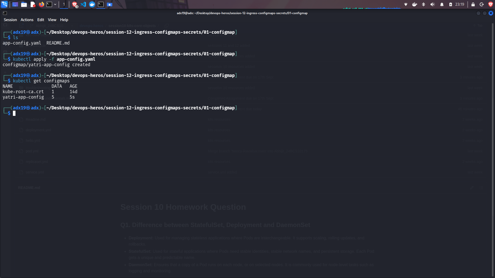
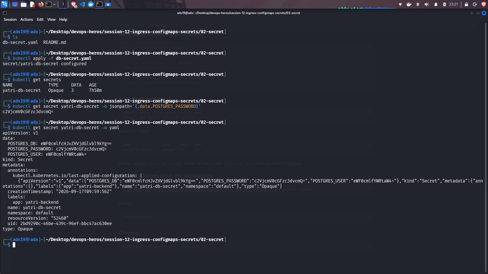
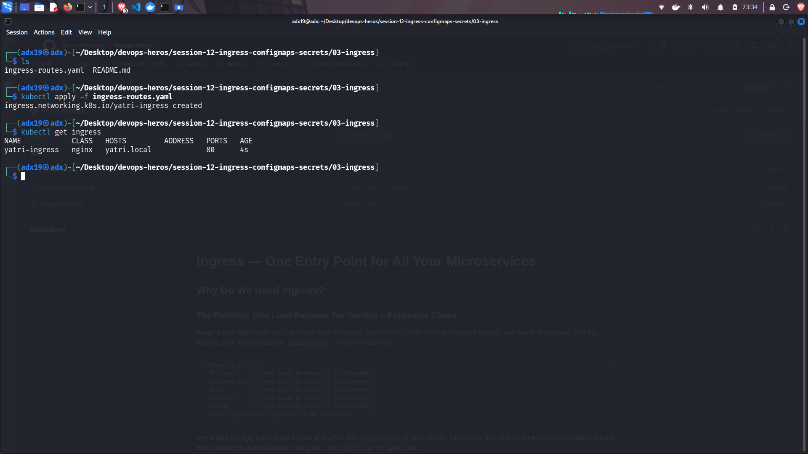

# Kubernetes Ingress, ConfigMaps, Secrets Homework:

## ConfigMaps:
A Kubernetes object used to store non-sensitive configuration data as key-value pairs.

## Secrets:
A Kubernetes object used to store sensitive data such as passwords, tokens, and API keys.

## Ingress:
A Kubernetes object that manages external HTTP/HTTPS access to services within a cluster using routing rules.

**Image of each of these commands running is given below**

---

# Screenshots:

## ConfigMaps:

## Secrets:

## Ingress:

