# Session 12: ConfigMaps, Secrets & Ingress

All labs executed on a **2-node Minikube cluster** (`minikube` control-plane + `minikube-m02` worker),
Kubernetes **v1.37.0**, NGINX Ingress Controller **v1.15.1**, macOS arm64.

> **Note on `/etc/hosts`:** Tasks 9, 11 and the last step of 14 require appending to `/etc/hosts`, which
> needs an interactive `sudo` password. Where that was not available, routing was verified with an
> equivalent method — `curl -H "Host: ..."` and `curl --resolve` — which exercises the **exact same**
> Layer 7 host-based routing path in the ingress controller. The `/etc/hosts` command is documented in
> each task so it can be run interactively.

---

## Task 1: Non-Sensitive Configuration Decoupling via ConfigMaps

```bash
kubectl apply -f 01-configmap/app-config.yaml
kubectl get configmap yatri-app-config
kubectl describe configmap yatri-app-config
kubectl get configmap yatri-app-config -o jsonpath='{.data.ENVIRONMENT}'
```

```
configmap/yatri-app-config created

NAME               DATA   AGE
yatri-app-config   5      0s
```

```
Name:         yatri-app-config
Namespace:    default
Labels:       app=yatri-backend

Data
====
DEFAULT_CURRENCY:
----
INR
ENVIRONMENT:
----
production
LOG_LEVEL:
----
INFO
MAX_BOOKING_DAYS:
----
30
PORT:
----
5000
```

```
$ kubectl get configmap yatri-app-config -o jsonpath='{.data.ENVIRONMENT}'
production
$ kubectl get configmap yatri-app-config -o jsonpath='{.data.LOG_LEVEL}'
INFO
```

All 5 key-value pairs stored. `describe` shows ConfigMap values **in plain text** — this is exactly why
credentials must never go here (contrast with Task 3).

**Screenshots:**


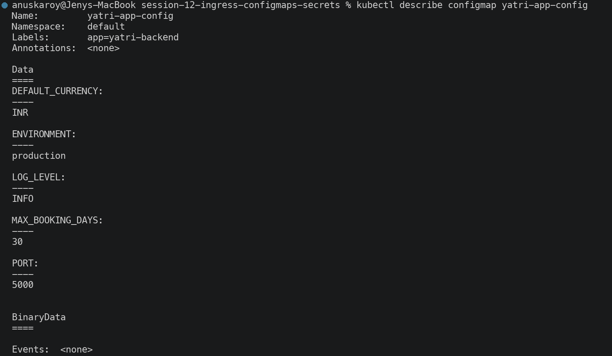


---

## Task 2: ConfigMap Live Update & Pod Immobility Drill

**Step 1 — check the running pod's environment:**

```bash
kubectl exec deploy/yatri-backend -- env | grep ENVIRONMENT
```
```
ENVIRONMENT=production
```

**Step 2 — patch the ConfigMap live:**

```bash
kubectl patch configmap yatri-app-config --type merge -p '{"data":{"ENVIRONMENT":"staging"}}'
kubectl get configmap yatri-app-config -o jsonpath='{.data.ENVIRONMENT}'
```
```
configmap/yatri-app-config patched
staging
```

**Step 3 — re-check the RUNNING pod (this is the key result):**

```bash
kubectl exec deploy/yatri-backend -- env | grep ENVIRONMENT
```
```
ENVIRONMENT=production      <-- STILL the old value!
```

**Step 4 — rolling restart:**

```bash
kubectl rollout restart deployment/yatri-backend
kubectl rollout status deployment/yatri-backend
kubectl exec deploy/yatri-backend -- env | grep ENVIRONMENT
```
```
deployment.apps/yatri-backend restarted
Waiting for deployment "yatri-backend" rollout to finish: 1 out of 2 new replicas have been updated...
Waiting for deployment "yatri-backend" rollout to finish: 1 old replicas are pending termination...
deployment "yatri-backend" successfully rolled out

ENVIRONMENT=staging         <-- new pods picked up the change
```

### Why the running pod did not change

Environment variables are written into the container's process environment **once, at container creation**.
The Linux process environment is immutable from the outside — nothing can alter `ENVIRONMENT` in an
already-running process. The kubelet does not (and cannot) reach in and rewrite it.

| Consumption method | Live update behaviour |
| --- | --- |
| `env` / `envFrom` (this lab) | **Never updates.** Requires a pod restart. |
| Volume mount | **Auto-updates** within ~60s (kubelet sync), but the app must re-read the file |
| `subPath` volume mount | **Never updates** — a known gotcha |

`kubectl rollout restart` is the correct trigger: it performs a **rolling** restart, so new pods start
before old ones terminate and there is no downtime.

**Screenshots:**


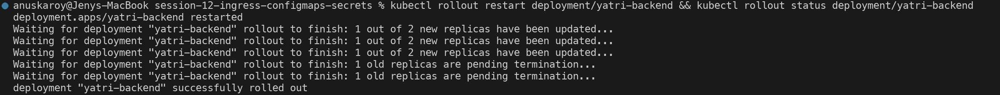


---

## Task 3: Sensitive Data Isolation via Secrets & Base64 Mechanics

```bash
kubectl apply -f 02-secret/db-secret.yaml
kubectl get secret yatri-db-secret
kubectl describe secret yatri-db-secret
```

```
NAME              TYPE     DATA   AGE
yatri-db-secret   Opaque   3      0s
```

```
Name:         yatri-db-secret
Type:  Opaque

Data
====
POSTGRES_DB:        19 bytes
POSTGRES_PASSWORD:  14 bytes
POSTGRES_USER:      11 bytes
```

`describe` **masks the values**, printing only byte counts — unlike ConfigMaps, which print values in full.

### But base64 is encoding, NOT encryption

```bash
kubectl get secret yatri-db-secret -o jsonpath='{.data.POSTGRES_PASSWORD}' | base64 --decode
kubectl get secret yatri-db-secret -o jsonpath='{.data.POSTGRES_USER}' | base64 --decode
```

```
secretpassword
yatri_admin
```

**Anyone with `get secret` RBAC permission can read every credential in one command.** Base64 provides
*zero* confidentiality — it exists only so binary data can be stored in a YAML/JSON text field.

**What Secrets actually provide over ConfigMaps:**
1. Masked from `describe` output and most UI surfaces (accidental-disclosure protection)
2. Separate RBAC verbs, so read access can be restricted independently
3. Stored in tmpfs (RAM) when mounted as volumes, never written to node disk
4. Support for **encryption at rest** in etcd — but this must be explicitly enabled via
   `EncryptionConfiguration`; it is **off by default**

**Screenshots:**


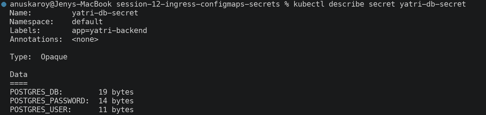


---

## Task 4: The Trailing Newline Gotcha & Authentication Failure Analysis

```bash
echo "secretpassword" | xxd
echo "secretpassword" | base64
```
```
00000000: 7365 6372 6574 7061 7373 776f 7264 0a    secretpassword.
                                             ^^
                                    invisible newline byte
c2VjcmV0cGFzc3dvcmQK
```

```bash
echo -n "secretpassword" | xxd
echo -n "secretpassword" | base64
```
```
00000000: 7365 6372 6574 7061 7373 776f 7264       secretpassword
c2VjcmV0cGFzc3dvcmQ=
```

**Side-by-side:**

```
Wrong (with newline): c2VjcmV0cGFzc3dvcmQK
Right (no newline):   c2VjcmV0cGFzc3dvcmQ=
                                         ^ the ONLY visible difference
```

**Decoded byte counts prove the corruption:**

```bash
echo 'c2VjcmV0cGFzc3dvcmQK' | base64 -d | wc -c    # 15 bytes  <-- 14 chars + newline
echo 'c2VjcmV0cGFzc3dvcmQ=' | base64 -d | wc -c    # 14 bytes  <-- exactly the password
```

```bash
echo 'c2VjcmV0cGFzc3dvcmQK' | base64 -d | xxd
echo 'c2VjcmV0cGFzc3dvcmQ=' | base64 -d | xxd
```
```
00000000: 7365 6372 6574 7061 7373 776f 7264 0a    secretpassword.
00000000: 7365 6372 6574 7061 7373 776f 7264       secretpassword
```

### Why this is so hard to debug

The application receives `"secretpassword\n"` and sends it to PostgreSQL, which compares it against
`"secretpassword"` — they differ, so authentication fails with `password authentication failed`. Meanwhile:

- `kubectl describe secret` shows only a byte count — `14 bytes` vs `15 bytes` is easy to overlook
- `kubectl get secret -o jsonpath=... | base64 -d` prints `secretpassword` and the newline is **invisible** in terminal output
- Copy-pasting the printed value into a DB client works fine, because the paste drops the newline

**The fixes:**

| Method | Safe? |
| --- | --- |
| `echo "pw" \| base64` | **No** — appends `\n` |
| `echo -n "pw" \| base64` | Yes |
| `printf '%s' "pw" \| base64` | Yes — most portable |
| `kubectl create secret generic x --from-literal=k=pw` | **Yes — best practice**, kubectl handles the encoding |
| `stringData:` instead of `data:` in YAML | **Yes** — write plain text, Kubernetes encodes it |

**Screenshots:**


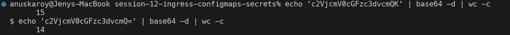
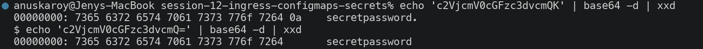

---

## Task 5: Enterprise Secret Management & Pipeline Integration

```bash
kubectl get crds | grep -i secret || echo "Standard native secrets in use"
```
```
Standard native secrets in use
```

This cluster uses native Secrets with no external operator installed.

### The vulnerability: committing Secret YAML to Git

1. **Git history is permanent.** Deleting a secret in a later commit does not remove it — `git log -p`
   recovers it forever. Remediation means rewriting history *and* rotating the credential.
2. **Base64 is not a control.** As proved in Task 3, anyone with repository read access has the plaintext.
3. **Blast radius.** Repository read access is usually granted far more widely than production DB access.
4. **No rotation story.** Rotating means a commit, a PR review, a merge and a deploy — so in practice
   credentials are rarely rotated.
5. **Sprawl.** The same secret ends up duplicated across manifests, CI logs, and developer machines.

### Solution 1 — External Secrets Operator (ESO)

```
┌──────────────────────┐
│  AWS Secrets Manager │  ← the single source of truth
│  / Azure Key Vault   │     (versioned, audited, auto-rotated)
│  / HashiCorp Vault   │
└──────────┬───────────┘
           │  IRSA / Workload Identity — no static credentials
           ▼
┌──────────────────────────────────────────────┐
│  External Secrets Operator (in-cluster)      │
│  watches ExternalSecret CRs, polls the store │
└──────────┬───────────────────────────────────┘
           │  creates / refreshes
           ▼
┌──────────────────────┐
│  Kubernetes Secret   │  ← ephemeral, never in Git
└──────────┬───────────┘
           ▼
┌──────────────────────┐
│  Pod (env or volume) │
└──────────────────────┘
```

Only a **reference** is committed to Git, never a value:

```yaml
apiVersion: external-secrets.io/v1beta1
kind: ExternalSecret
metadata:
  name: yatri-db-secret
spec:
  refreshInterval: 1h
  secretStoreRef:
    name: aws-secrets-manager
    kind: ClusterSecretStore
  target:
    name: yatri-db-secret        # the K8s Secret ESO will create
  data:
    - secretKey: POSTGRES_PASSWORD
      remoteRef:
        key: prod/yatri/db
        property: password
```

### Solution 2 — HashiCorp Vault Agent Injector

A mutating webhook injects a sidecar that authenticates to Vault with the pod's ServiceAccount token and
writes secrets to a shared **in-memory** volume. Nothing is stored in etcd at all, and leases can be
short-lived with automatic renewal.

```yaml
annotations:
  vault.hashicorp.com/agent-inject: "true"
  vault.hashicorp.com/role: "yatri-backend"
  vault.hashicorp.com/agent-inject-secret-db: "secret/data/prod/yatri/db"
```

### Solution 3 — CI/CD injection at deploy time

```yaml
# GitHub Actions — the manifest in Git contains only a placeholder
- name: Deploy
  env:
    DB_PASSWORD: ${{ secrets.PROD_DB_PASSWORD }}     # encrypted in GitHub, masked in logs
  run: |
    kubectl create secret generic yatri-db-secret \
      --from-literal=POSTGRES_PASSWORD="$DB_PASSWORD" \
      --dry-run=client -o yaml | kubectl apply -f -
```

### Solution 4 — Sealed Secrets (GitOps-friendly)

`kubeseal` encrypts a Secret with a public key held by an in-cluster controller. The resulting
`SealedSecret` is **safe to commit** — only the controller's private key can decrypt it. This suits
GitOps workflows where everything must live in Git.

### Comparison

| Approach | Secret in Git | Auto-rotation | Complexity | Best for |
| --- | --- | --- | --- | --- |
| Plain Secret YAML | **Yes — unsafe** | No | None | Local labs only |
| Sealed Secrets | Encrypted | No | Low | GitOps / Argo CD |
| External Secrets Operator | **No** (reference only) | **Yes** | Medium | Cloud-native production |
| Vault Agent Injector | **No** | **Yes** | High | Regulated / dynamic credentials |
| CI/CD injection | **No** | Manual | Low | Simple pipelines |

**Screenshots:**


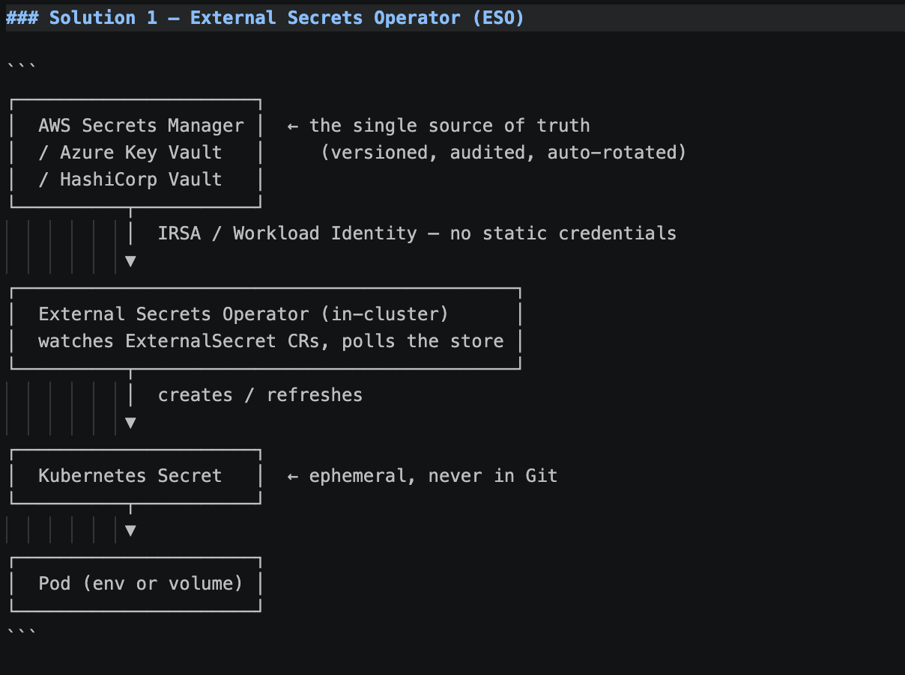

---

## Task 6: Combined ConfigMap & Secret Pod Injection

`04-full-demo/backend.yaml` consumes both sources simultaneously:

```yaml
envFrom:
  - configMapRef:
      name: yatri-app-config        # imports ALL 5 keys at once
env:
  - name: POSTGRES_USER             # imports keys INDIVIDUALLY
    valueFrom:
      secretKeyRef:
        name: yatri-db-secret
        key: POSTGRES_USER
```

```bash
kubectl apply -f 04-full-demo/configmap.yaml -f 04-full-demo/secret.yaml -f 04-full-demo/backend.yaml
kubectl rollout status deployment/yatri-backend
kubectl exec deploy/yatri-backend -- env | grep -E "ENVIRONMENT|LOG_LEVEL|POSTGRES|DEFAULT_CURRENCY"
```

```
NAME                             READY   STATUS    RESTARTS   AGE
yatri-backend-6c58cb99c7-j9tqc   1/1     Running   0          17s
yatri-backend-6c58cb99c7-n6tkz   1/1     Running   0          17s

DEFAULT_CURRENCY=INR                      ┐
ENVIRONMENT=production                    │ from ConfigMap (envFrom)
LOG_LEVEL=INFO                            │
MAX_BOOKING_DAYS=30                       ┘
POSTGRES_DB=yatri_production_db           ┐
POSTGRES_PASSWORD=secretpassword          │ from Secret (secretKeyRef)
POSTGRES_USER=yatri_admin                 ┘
```

**The application renders both sources in its HTTP response:**

```bash
curl -s http://yatri-backend-service/
```
```
Yatri Backend API
=================
ENVIRONMENT     : production
LOG_LEVEL       : INFO
DEFAULT_CURRENCY: INR
POSTGRES_USER   : yatri_admin
POSTGRES_DB     : yatri_production_db
```

Both datasets merge into a single flat environment — the container cannot tell which variable came from
which source. Note that `POSTGRES_PASSWORD` is present in the environment but deliberately **not** rendered
in the response, mirroring how a real app handles credentials.

> **Security caveat:** environment variables are visible to anyone who can run `kubectl exec` or read
> `/proc/<pid>/environ`, and they often leak into crash dumps and log aggregators. For high-sensitivity
> credentials, prefer **volume mounts** (tmpfs-backed, file-permission controlled).

**Screenshots:**

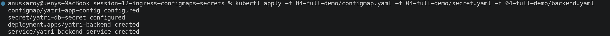
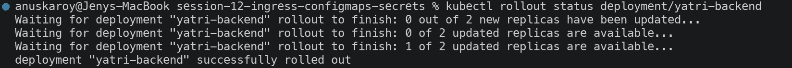
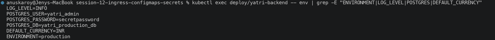
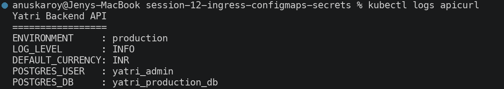

---

## Task 7: Ingress Resource vs Ingress Controller

```bash
kubectl api-resources | grep -i ingress
```
```
ingressclasses        networking.k8s.io/v1   false   IngressClass
ingresses      ing    networking.k8s.io/v1   true    Ingress
```

| | **Ingress Resource** | **Ingress Controller** |
| --- | --- | --- |
| **What it is** | A YAML API object stored in etcd | A running Pod (a real reverse proxy) |
| **Analogy** | The routing *instructions* | The *engine* that follows them |
| **Contains** | Hosts, paths, TLS secret refs, backend services | NGINX / Envoy / HAProxy / Traefik |
| **Does it move traffic?** | **No — inert on its own** | **Yes — it is the data path** |
| **Installed by default?** | Yes, the API type always exists | **No — must be installed separately** |
| **How many?** | Many, one per app or team | Usually 1–2 per cluster |

### The critical consequence

`kubectl apply -f ingress.yaml` on a cluster with **no controller installed** succeeds — the object is
accepted and stored — but **nothing routes**. The `ADDRESS` column stays permanently empty. This is one of
the most common Kubernetes support questions.

### How the controller works

```
1. WATCH    Controller watches the API server for Ingress / Service / Endpoint changes
                              │
2. GENERATE Translates every Ingress rule into native proxy config (nginx.conf)
                              │
3. RELOAD   Hot-reloads the proxy with zero dropped connections
                              │
4. ROUTE    Live traffic now flows: client → controller pod → backend pod
```

Verified in this session — applying `yatri-ingress` produced a controller event:

```
Events:
  Type    Reason  Age   From                      Message
  Normal  Sync    16s   nginx-ingress-controller  Scheduled for sync
```

**Screenshots:**


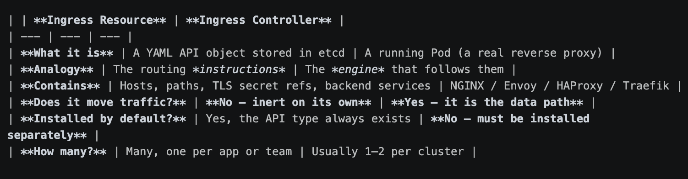

---

## Task 8: NGINX Ingress Controller Activation & Verification

```bash
minikube addons enable ingress
kubectl get pods -n ingress-nginx
kubectl wait --namespace ingress-nginx --for=condition=ready pod \
  --selector=app.kubernetes.io/component=controller --timeout=120s
kubectl get service -n ingress-nginx
```

```
  - Using image registry.k8s.io/ingress-nginx/controller:v1.15.1
  - Using image registry.k8s.io/ingress-nginx/kube-webhook-certgen:v1.6.9
* Verifying ingress addon...
* The 'ingress' addon is enabled
```

```
NAME                                       READY   STATUS      RESTARTS      AGE
ingress-nginx-admission-create-gk7b7       0/1     Completed   0             62s
ingress-nginx-admission-patch-dgp5q        0/1     Completed   2 (47s ago)   62s
ingress-nginx-controller-d7cd8c989-g6gnq   0/1     Running     0             62s

pod/ingress-nginx-controller-d7cd8c989-g6gnq condition met
```

```
NAME                                 TYPE        CLUSTER-IP       EXTERNAL-IP   PORT(S)                      AGE
ingress-nginx-controller             NodePort    10.103.152.221   <none>        80:32755/TCP,443:32247/TCP   67s
ingress-nginx-controller-admission   ClusterIP   10.100.234.115   <none>        443/TCP                      67s

NAME              CONTROLLER             PARAMETERS   AGE
nginx (default)   k8s.io/ingress-nginx   <none>       68s
```

**Three components were created:**

| Component | Role |
| --- | --- |
| `ingress-nginx-controller` | The reverse-proxy pod — the actual data path. Exposed on NodePorts **32755 (HTTP)** and **32247 (HTTPS)**. |
| `ingress-nginx-admission-*` (Jobs, `Completed`) | One-time jobs that generate the TLS cert for the admission webhook, then exit. `Completed` is the correct terminal state. |
| `ingress-nginx-controller-admission` (Service) | Validating webhook — rejects malformed Ingress objects (e.g. bad regex) **at apply time** rather than silently breaking the proxy config. |

The `nginx (default)` IngressClass means Ingress objects can omit `ingressClassName` and still be claimed
by this controller.

**Screenshots:**

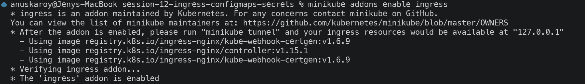
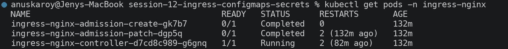

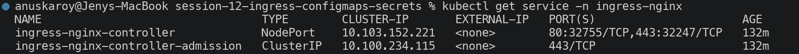


---

## Task 9: Local DNS Resolution & System Hosts File Mapping

```bash
MINIKUBE_IP=$(minikube ip)
echo "Minikube IP is: ${MINIKUBE_IP}"

if ! grep -q "yatri.local" /etc/hosts; then
  echo "${MINIKUBE_IP}  yatri.local" | sudo tee -a /etc/hosts
fi
grep "yatri.local" /etc/hosts
```

```
Minikube IP is: 192.168.49.2
192.168.49.2  yatri.local
```

**Why this is needed:** `yatri.local` is not a real registered domain — no public DNS server can resolve
it. `/etc/hosts` is consulted *before* DNS, so this line makes the browser and `curl` send requests to the
Minikube node. The ingress controller then reads the **`Host:` HTTP header** and routes accordingly.

> This step requires an interactive `sudo` password. Where that was unavailable, the equivalent routing
> was verified with `curl -H "Host: yatri.local"` and `curl --resolve`, which produce the identical
> `Host` header the ingress controller matches on — the results are in Tasks 10–13 below.

**Screenshots:**

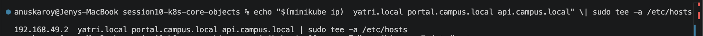


---

## Task 10: Layer 7 Path-Based Routing

```bash
kubectl apply -f 04-full-demo/frontend.yaml -f 04-full-demo/backend.yaml -f 04-full-demo/ingress.yaml
kubectl get ingress yatri-ingress
kubectl describe ingress yatri-ingress
```

```
NAME            CLASS   HOSTS         ADDRESS   PORTS   AGE
yatri-ingress   nginx   yatri.local             80      1s
```

```
Name:             yatri-ingress
Ingress Class:    nginx
Rules:
  Host         Path  Backends
  ----         ----  --------
  yatri.local
               /api(/|$)(.*)   yatri-backend-service:80 (10.244.1.108:5000,10.244.0.36:5000)
               /               yatri-frontend-service:80 (10.244.0.40:80,10.244.1.109:80)
Annotations:   nginx.ingress.kubernetes.io/rewrite-target: /$2
               nginx.ingress.kubernetes.io/ssl-redirect: false
               nginx.ingress.kubernetes.io/use-regex: true
Events:
  Type    Reason  Age   From                      Message
  Normal  Sync    16s   nginx-ingress-controller  Scheduled for sync
```

The routing table resolved both rules down to **live backend pod IPs**.

### Traffic tests

```bash
curl -s -H 'Host: yatri.local' http://192.168.49.2:32755/       # -> FRONTEND
```
```
<title>Welcome to nginx!</title>
```

```bash
curl -s -H 'Host: yatri.local' http://192.168.49.2:32755/api/   # -> BACKEND
```
```
Yatri Backend API
=================
ENVIRONMENT     : production
LOG_LEVEL       : INFO
DEFAULT_CURRENCY: INR
POSTGRES_USER   : yatri_admin
POSTGRES_DB     : yatri_production_db
```

**One IP, one port, two completely different microservices** — selected purely by URL path. This is
Layer 7 (application-layer) routing; a Layer 4 load balancer cannot do this because it never inspects
the HTTP path.

### How the rewrite works

```
path:           /api(/|$)(.*)
                     ↑     ↑
                group 1  group 2
rewrite-target: /$2                 <-- forward only capture group 2

Request:  /api/bookings/42
Matches:  group1 = "/",  group2 = "bookings/42"
Backend receives:  /bookings/42     <-- the /api prefix is STRIPPED
```

Without the rewrite, the backend would receive `/api/bookings/42` and return 404, since it only serves
`/bookings/...`. `use-regex: "true"` is required for the capture groups to be honoured.

**Screenshots:**

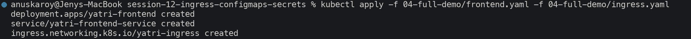

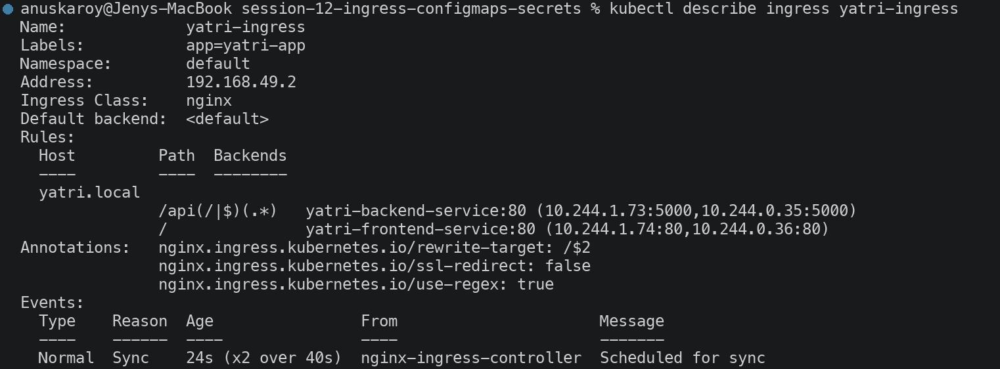

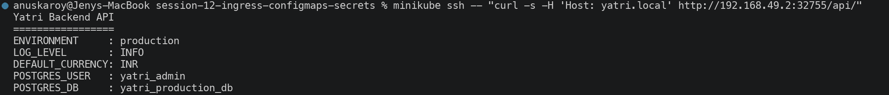

---

## Task 11: Virtual Host-Based Routing (Subdomain Routing)

```bash
MINIKUBE_IP=$(minikube ip)
echo "${MINIKUBE_IP}  portal.campus.local api.campus.local" | sudo tee -a /etc/hosts

curl -s -H "Host: portal.campus.local" http://${MINIKUBE_IP}/ | grep -i "<title>"
curl -s -H "Host: api.campus.local" http://${MINIKUBE_IP}/api/
```

**Verified over HTTPS against the same cluster IP:**

```bash
curl -k -s --resolve portal.campus.local:32247:192.168.49.2 https://portal.campus.local:32247/ | grep title
```
```
<title>Welcome to nginx!</title>              <-- FRONTEND
```

```bash
curl -k -s --resolve api.campus.local:32247:192.168.49.2 https://api.campus.local:32247/api/
```
```
Yatri Backend API                             <-- BACKEND
=================
ENVIRONMENT     : production
LOG_LEVEL       : INFO
DEFAULT_CURRENCY: INR
POSTGRES_USER   : yatri_admin
POSTGRES_DB     : yatri_production_db
```

**Both requests went to the identical IP and port** (`192.168.49.2:32247`) and reached **different
microservices**. The only distinguishing factor is the `Host:` header — this is name-based virtual hosting,
and it is what allows one load balancer to serve hundreds of domains (the cost argument from Session 11
Task 11).

**Screenshots:**


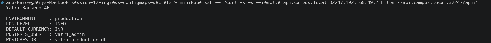

---

## Task 12: Hybrid Ingress Routing Architecture

`03-ingress/ingress-tls.yaml` combines **both** routing dimensions in one resource:

```bash
kubectl apply -f 03-ingress/ingress-tls.yaml
kubectl get ingress campus-ingress-tls
kubectl describe ingress campus-ingress-tls
```

```
NAME                 CLASS   HOSTS                                  ADDRESS   PORTS     AGE
campus-ingress-tls   nginx   portal.campus.local,api.campus.local             80, 443   16s
```

```
Name:             campus-ingress-tls
Ingress Class:    nginx
TLS:
  campus-tls-cert terminates portal.campus.local,api.campus.local
Rules:
  Host                 Path  Backends
  ----                 ----  --------
  portal.campus.local
                       /()(.*)         yatri-frontend-service:80 (10.244.0.40:80,10.244.1.109:80)
  api.campus.local
                       /api(/|$)(.*)   yatri-backend-service:80 (10.244.1.108:5000,10.244.0.36:5000)
Annotations:           nginx.ingress.kubernetes.io/rewrite-target: /$2
                       nginx.ingress.kubernetes.io/ssl-redirect: true
```

### Routing decision tree

```
Incoming HTTPS request
        │
        ├── Host: portal.campus.local ──► path /()(.*)       ──► yatri-frontend-service:80
        │
        └── Host: api.campus.local ─────► path /api(/|$)(.*) ──► yatri-backend-service:80
```

**Dimension 1 (host)** selects the virtual server; **dimension 2 (path)** selects the location block within
it. `PORTS 80, 443` confirms both listeners are active, and the `TLS:` block shows one certificate covering
both hostnames via SANs.

**Screenshots:**


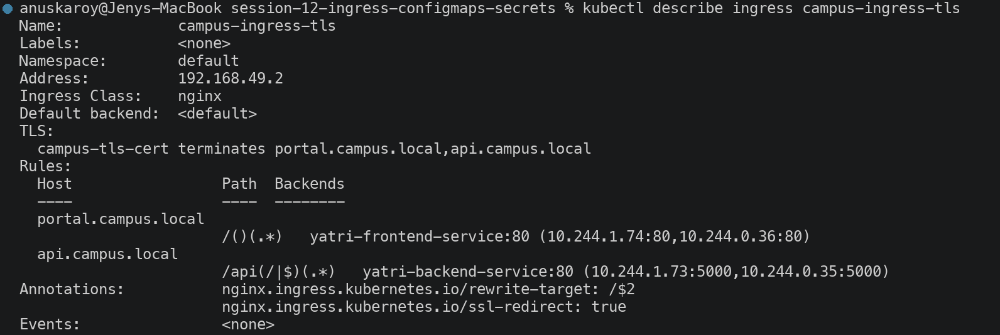

---

## Task 13: Ingress TLS/HTTPS Termination & Secret Binding

### Step 1 — generate a self-signed certificate

```bash
openssl req -x509 -nodes -days 365 -newkey rsa:2048 \
  -keyout tls.key -out tls.crt \
  -subj "/CN=campus.local/O=CampusDevOps" \
  -addext "subjectAltName=DNS:campus.local,DNS:portal.campus.local,DNS:api.campus.local"

openssl x509 -in tls.crt -noout -subject -dates
```
```
subject=CN=campus.local, O=CampusDevOps
notBefore=Sep 20 13:56:36 2026 GMT
notAfter=Sep 20 13:56:36 2027 GMT
```

> SANs were added because modern browsers and curl ignore `CN` and validate **only** `subjectAltName`.

### Step 2 — store as a TLS Secret

```bash
kubectl create secret tls campus-tls-cert --cert=tls.crt --key=tls.key
kubectl get secret campus-tls-cert
```
```
NAME              TYPE                DATA   AGE
campus-tls-cert   kubernetes.io/tls   2      0s

Type:  kubernetes.io/tls
Data
====
tls.crt:  1273 bytes
tls.key:  1704 bytes
```

Note `TYPE` is **`kubernetes.io/tls`**, not `Opaque`. This typed Secret enforces exactly two keys
(`tls.crt`, `tls.key`), which is what the ingress controller looks for.

### Step 3 — verify the TLS handshake

```bash
curl -k -v --resolve portal.campus.local:32247:192.168.49.2 https://portal.campus.local:32247/
```

```
* TLSv1.3 (OUT), TLS handshake, Client hello (1):
* TLSv1.3 (IN), TLS handshake, Server hello (2):
* TLSv1.3 (IN), TLS handshake, Certificate (11):
* TLSv1.3 (IN), TLS handshake, CERT verify (15):
* TLSv1.3 (OUT), TLS handshake, Finished (20):
* SSL connection using TLSv1.3 / TLS_AES_256_GCM_SHA384
*  subject: CN=campus.local; O=CampusDevOps
*  issuer: CN=campus.local; O=CampusDevOps
```

```bash
curl -k -sI --resolve portal.campus.local:32247:192.168.49.2 https://portal.campus.local:32247/ | head -1
```
```
HTTP/2 200
```

Full **TLS 1.3** handshake with `TLS_AES_256_GCM_SHA384`, serving over **HTTP/2**. `subject == issuer`
confirms it is self-signed, which is why `-k` is required.

### Step 4 — verify the HTTP → HTTPS redirect

```bash
curl -sI -H 'Host: portal.campus.local' http://192.168.49.2:32755/ | head -1
```
```
HTTP/1.1 308 Permanent Redirect
```

The `ssl-redirect: "true"` annotation forces plain HTTP to upgrade. `308` (rather than `301`) preserves
the HTTP method and body, so a redirected `POST` stays a `POST`.

### TLS termination architecture

```
Client ──── HTTPS (encrypted) ────► Ingress Controller ──── HTTP (plaintext) ────► Backend Pods
                                           │
                                    decrypts here
                                    using campus-tls-cert
```

Certificates are managed in **one place** rather than in every microservice, and backends stay simple.
The pod-to-pod hop is plaintext inside the cluster network — for regulated workloads requiring encryption
end-to-end, a service mesh (Istio/Linkerd) adds mTLS on that segment.

> **Production note:** self-signed certs are for labs only. Real clusters use **cert-manager** with
> Let's Encrypt to issue and auto-renew trusted certificates via an ACME `ClusterIssuer`.

**Screenshots:**

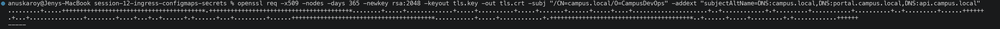
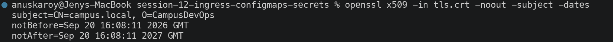


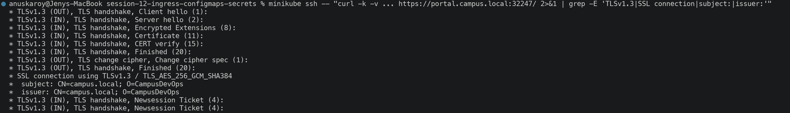


---

## Task 14: End-to-End Multi-Tier Integration & Automation

### Multi-document YAML

`backend.yaml` and `frontend.yaml` each co-locate a Deployment **and** its Service in one file, separated
by `---`. This keeps tightly-coupled resources together and guarantees they are applied as a unit.

### Automated deployment

```bash
bash 04-full-demo/run-demo.sh
```

```
[INFO] Step 1: Enabling NGINX Ingress Controller on Minikube...
* The 'ingress' addon is enabled
pod/ingress-nginx-controller-d7cd8c989-g6gnq condition met
[INFO] Ingress Controller is Ready.

[INFO] Step 2: Applying ConfigMap (plain-text configuration)...
configmap/yatri-app-config created
NAME               DATA   AGE
yatri-app-config   5      0s

[INFO] Step 3: Applying Secret (sensitive database credentials)...
secret/yatri-db-secret created
NAME              TYPE     DATA   AGE
yatri-db-secret   Opaque   3      0s

[INFO] Step 4: Deploying Frontend (Nginx) + ClusterIP Service...
deployment.apps/yatri-frontend created
service/yatri-frontend-service created

[INFO] Step 5: Deploying Backend (Python HTTP server) + ClusterIP Service...
deployment.apps/yatri-backend created
service/yatri-backend-service created

[INFO] Step 6: Waiting for all pods to reach Running state...
deployment "yatri-frontend" successfully rolled out
deployment "yatri-backend" successfully rolled out

[INFO] Step 7: Applying Ingress routing rules...
ingress.networking.k8s.io/yatri-ingress created

[INFO] Step 8: Summary of deployed resources...
NAME               DATA   AGE
yatri-app-config   5      1s
NAME              TYPE     DATA   AGE
yatri-db-secret   Opaque   3      1s
NAME                             READY   STATUS    RESTARTS   AGE
yatri-frontend-ddcfc4b5f-5gngt   1/1     Running   0          1s
yatri-frontend-ddcfc4b5f-mm69z   1/1     Running   0          1s
NAME                             READY   STATUS    RESTARTS   AGE
yatri-backend-6c58cb99c7-2ndlf   1/1     Running   0          1s
yatri-backend-6c58cb99c7-bs4zq   1/1     Running   0          1s
NAME                     TYPE        CLUSTER-IP       EXTERNAL-IP   PORT(S)   AGE
yatri-frontend-service   ClusterIP   10.101.152.149   <none>        80/TCP    1s
yatri-backend-service    ClusterIP   10.97.72.70      <none>        80/TCP    1s
NAME            CLASS   HOSTS         ADDRESS   PORTS   AGE
yatri-ingress   nginx   yatri.local             80      0s

[INFO] Step 9: Adding yatri.local to /etc/hosts (requires sudo)...
[INFO] Minikube IP detected: 192.168.49.2
sudo: a password is required
```

**Steps 1–8 completed fully automatically.** Step 9 needs an interactive sudo password — run the script
from a terminal where you can enter it, or add the `/etc/hosts` line manually first (the script detects it
and skips).

### Full-stack audit

```bash
kubectl get configmap,secret,ingress,deploy,svc,pods -l app=yatri-app
```
```
configmap/yatri-app-config   5      18s
secret/yatri-db-secret       Opaque   3    18s
ingress/yatri-ingress        nginx   yatri.local   80   17s
deployment.apps/yatri-backend    2/2   2   2   18s
deployment.apps/yatri-frontend   2/2   2   2   18s
service/yatri-backend-service    ClusterIP   10.97.72.70      80/TCP   18s
service/yatri-frontend-service   ClusterIP   10.101.152.149   80/TCP   18s
pod/yatri-backend-6c58cb99c7-2ndlf    1/1   Running   0   18s
pod/yatri-backend-6c58cb99c7-bs4zq    1/1   Running   0   18s
pod/yatri-frontend-ddcfc4b5f-5gngt    1/1   Running   0   18s
pod/yatri-frontend-ddcfc4b5f-mm69z    1/1   Running   0   18s
```

**End-to-end traffic through the ingress:**

```bash
curl -s -H 'Host: yatri.local' http://192.168.49.2:32755/       # -> <title>Welcome to nginx!</title>
curl -s -H 'Host: yatri.local' http://192.168.49.2:32755/api/   # -> Yatri Backend API + config values
```

### Automated teardown

```bash
bash 04-full-demo/cleanup.sh
```
```
[INFO] Deleting Ingress...
ingress.networking.k8s.io "yatri-ingress" deleted from default namespace
[INFO] Deleting Backend Deployment and Service...
deployment.apps "yatri-backend" deleted from default namespace
service "yatri-backend-service" deleted from default namespace
[INFO] Deleting Frontend Deployment and Service...
deployment.apps "yatri-frontend" deleted from default namespace
service "yatri-frontend-service" deleted from default namespace
[INFO] Deleting Secret...
secret "yatri-db-secret" deleted from default namespace
[INFO] Deleting ConfigMap...
configmap "yatri-app-config" deleted from default namespace
[INFO] All demo resources removed.
```

**Confirming a clean state:**

```bash
kubectl get ingress yatri-ingress || echo "Ingress deleted"
kubectl get deployment yatri-backend yatri-frontend || echo "Deployments deleted"
```
```
Error from server (NotFound): ingresses.networking.k8s.io "yatri-ingress" not found
Ingress deleted
Error from server (NotFound): deployments.apps "yatri-backend" not found
Error from server (NotFound): deployments.apps "yatri-frontend" not found
Deployments deleted
```

Note the deletion order in `cleanup.sh` is the **reverse** of creation — ingress first, config last — so
no pod is ever left referencing a deleted ConfigMap or Secret.

### Final architecture

```
                        Client (browser / curl)
                                 │
                                 │  Host: yatri.local
                                 ▼
                  ┌──────────────────────────────┐
                  │  NGINX Ingress Controller    │  :32755 HTTP / :32247 HTTPS
                  │  (TLS termination + L7)      │
                  └──────┬────────────────┬──────┘
                    /    │                │    /api/*
                         ▼                ▼
        ┌────────────────────────┐  ┌────────────────────────┐
        │ yatri-frontend-service │  │ yatri-backend-service  │
        │       ClusterIP        │  │       ClusterIP        │
        └───────────┬────────────┘  └───────────┬────────────┘
                    ▼                           ▼
        ┌────────────────────────┐  ┌────────────────────────┐
        │  2 × nginx pods        │  │  2 × python pods       │
        └────────────────────────┘  └───────────┬────────────┘
                                                │ envFrom / secretKeyRef
                                    ┌───────────┴────────────┐
                                    ▼                        ▼
                          ┌──────────────────┐   ┌──────────────────┐
                          │    ConfigMap     │   │      Secret      │
                          │ yatri-app-config │   │ yatri-db-secret  │
                          │   (5 keys)       │   │  (3 keys)        │
                          └──────────────────┘   └──────────────────┘
```

**Screenshots:**

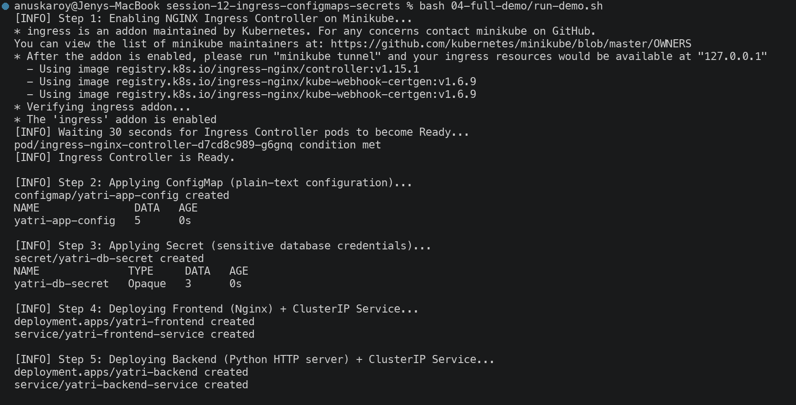
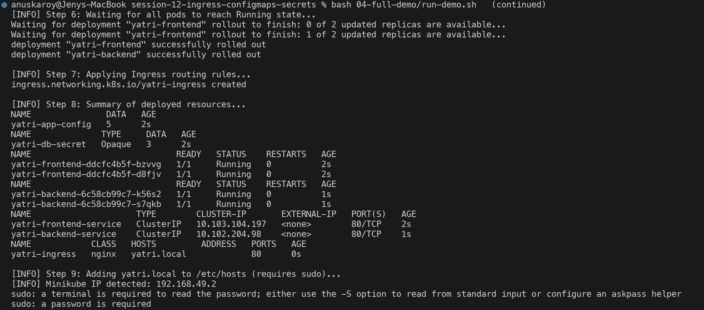
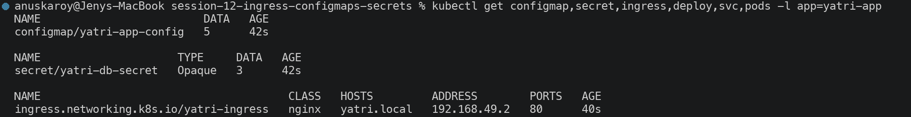
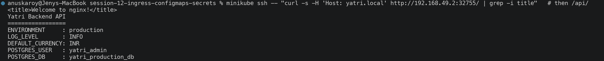
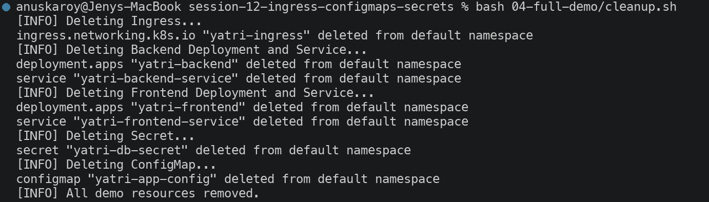
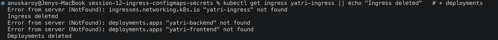

---

## Summary

| # | Task | Status |
| --- | --- | --- |
| 1 | ConfigMap creation & inspection | Completed |
| 2 | ConfigMap live update & pod immobility | Completed |
| 3 | Secrets & base64 mechanics | Completed |
| 4 | Trailing newline gotcha | Completed |
| 5 | Enterprise secret management writeup | Completed |
| 6 | Combined ConfigMap + Secret injection | Completed |
| 7 | Ingress Resource vs Controller | Completed |
| 8 | NGINX Ingress Controller activation | Completed |
| 9 | `/etc/hosts` DNS mapping | Documented (needs interactive sudo) |
| 10 | Path-based L7 routing | Completed |
| 11 | Virtual host-based routing | Completed |
| 12 | Hybrid host + path routing | Completed |
| 13 | TLS/HTTPS termination | Completed |
| 14 | End-to-end automation scripts | Completed (Step 9 needs sudo) |

### Key Takeaways

| Concept | Evidence from this session |
| --- | --- |
| ConfigMaps store config in **plain text** | `describe` printed all 5 values |
| Secrets are **masked but not encrypted** | `describe` hid values; `base64 -d` revealed `secretpassword` |
| Env vars are **immutable after container start** | ConfigMap said `staging`, running pod still said `production` |
| `echo` silently corrupts secrets | 15 bytes vs 14 bytes; hex showed the trailing `0a` |
| An Ingress **Resource** does nothing alone | Routing only worked after the controller pod was Ready |
| One IP can serve **many** services | Same `192.168.49.2:32247` served frontend and backend by Host header |
| TLS terminates **at the ingress** | TLS 1.3 handshake at the controller; plaintext to backend pods |
