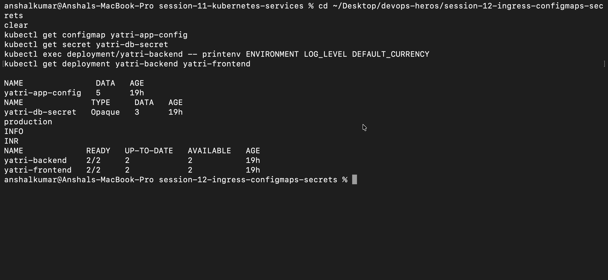
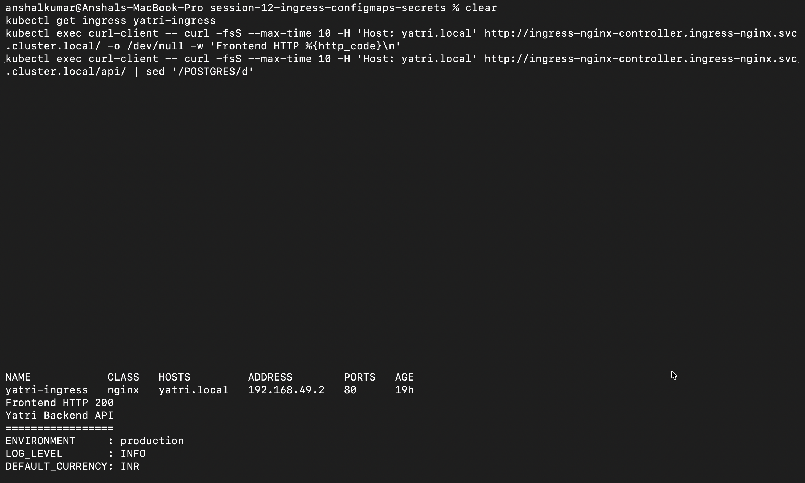
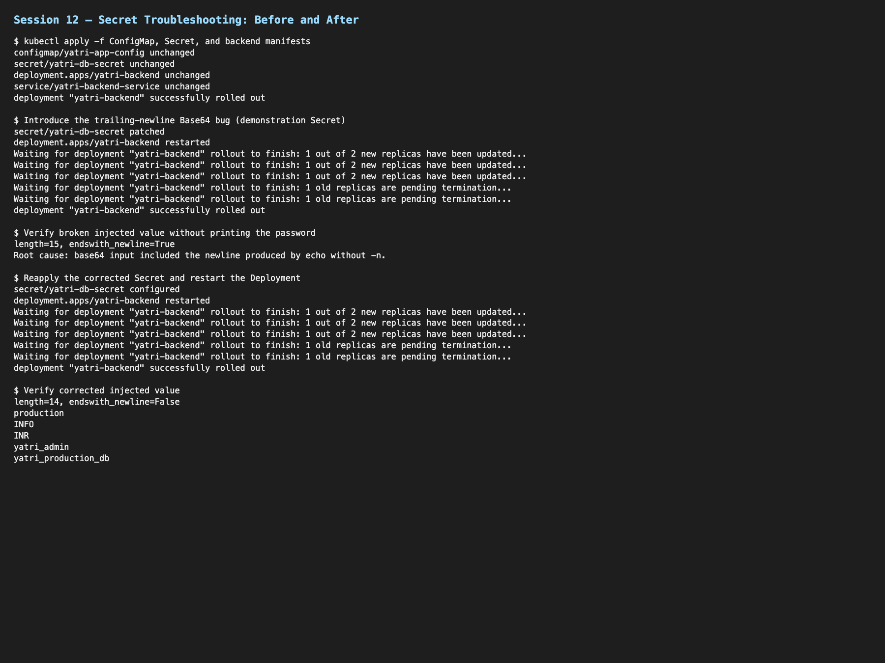

# Session 12 - Ingress, ConfigMaps and Secrets

I built one small frontend/backend setup to test configuration, secrets, and Ingress routing together.

## What I tested

- [`01-configmap/`](01-configmap/) stores the application settings. I checked the values from inside the backend container.
- [`02-secret/`](02-secret/) contains demonstration database values. I verified that the container received them without printing the password in the screenshot.
- [`03-ingress/`](03-ingress/) routes `yatri.local/` to the frontend and `/api/` to the backend through the NGINX Ingress Controller.
- [`04-full-demo/`](04-full-demo/) contains the complete set of manifests used for the combined run.

The ConfigMap and Secret output is shown in [`configmap-secret.png`](screenshots/configmap-secret.png). The Ingress test returned HTTP 200 for the frontend and the expected backend response under `/api/`: [`ingress-working.png`](screenshots/ingress-working.png).

For troubleshooting, I deliberately encoded a password with a trailing newline. The Pod received a 15-character value instead of the expected 14 characters. Reapplying the corrected Secret and restarting the Deployment removed the newline. I checked the length and newline flag without exposing the password: [`secret-troubleshooting-before-after.png`](screenshots/secret-troubleshooting-before-after.png).

My explanation of Ingress versus an Ingress Controller is in [`lab.md`](lab.md), and the troubleshooting steps are in [`troubleshooting/README.md`](troubleshooting/README.md).

## Screenshots from my run

### ConfigMap and Secret values

I checked the non-sensitive configuration values inside the backend container and verified that the Secret was present without printing its password.

### Ingress routing

Both the frontend route and the `/api/` backend route worked through the NGINX Ingress Controller.

### Secret troubleshooting

This before-and-after check shows the extra newline in the first Secret and the corrected value after I reapplied it.

