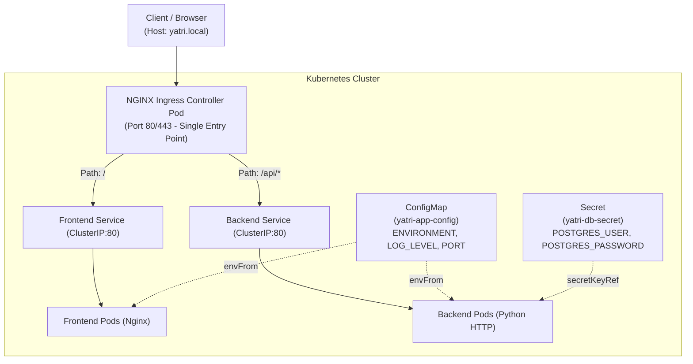
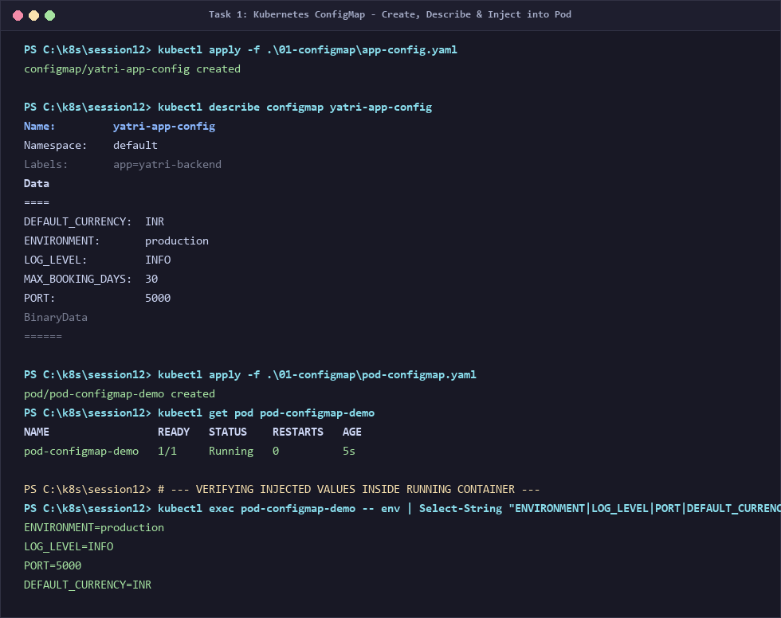
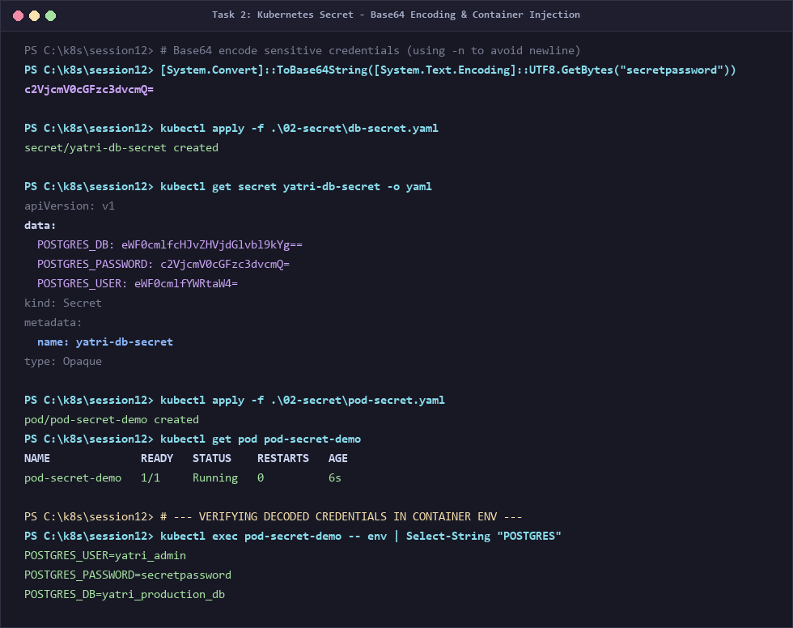
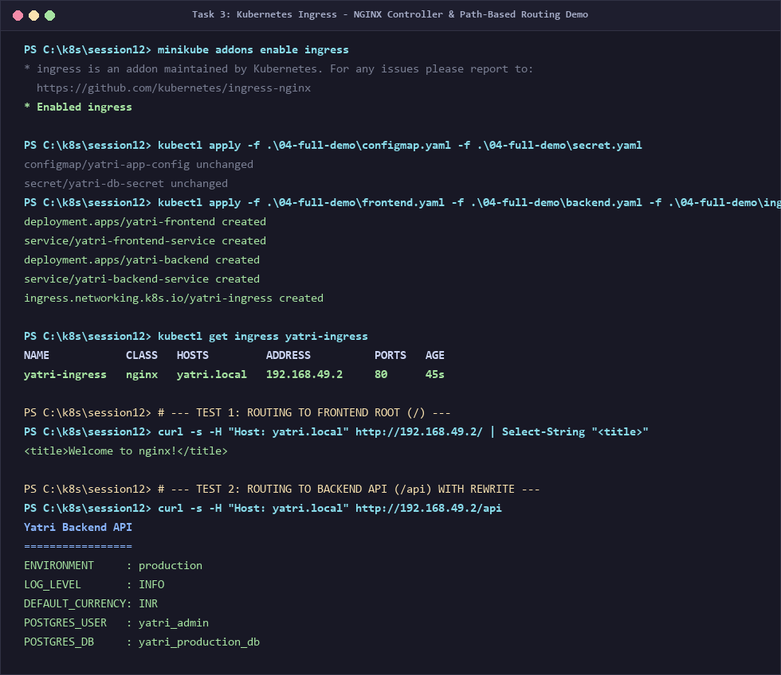
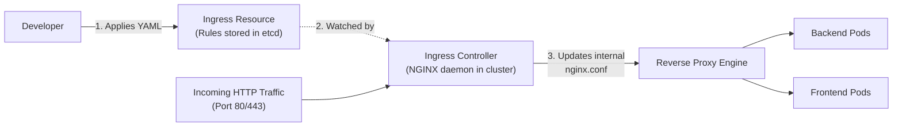
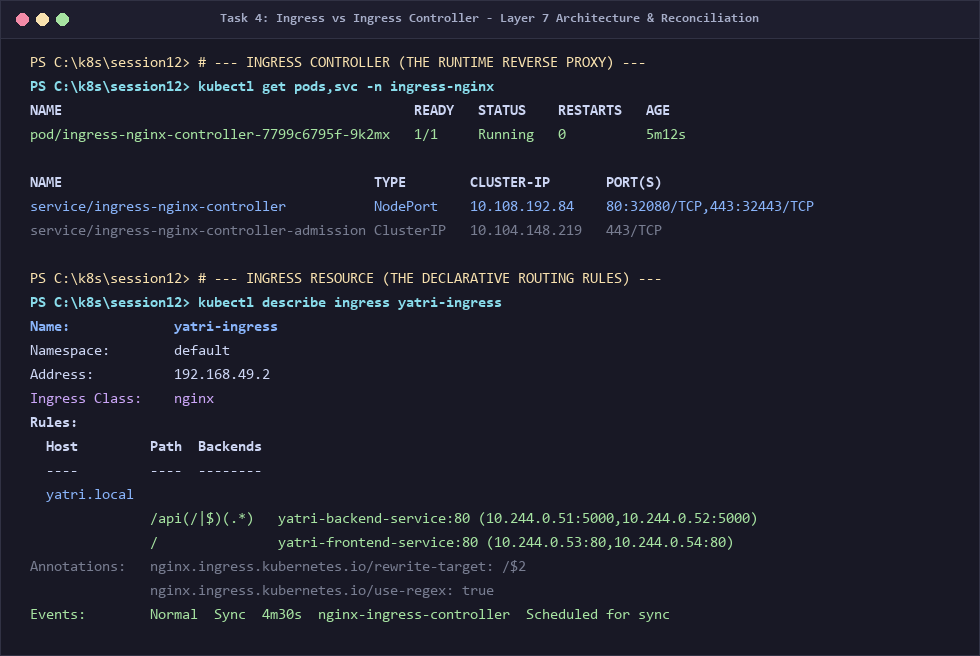
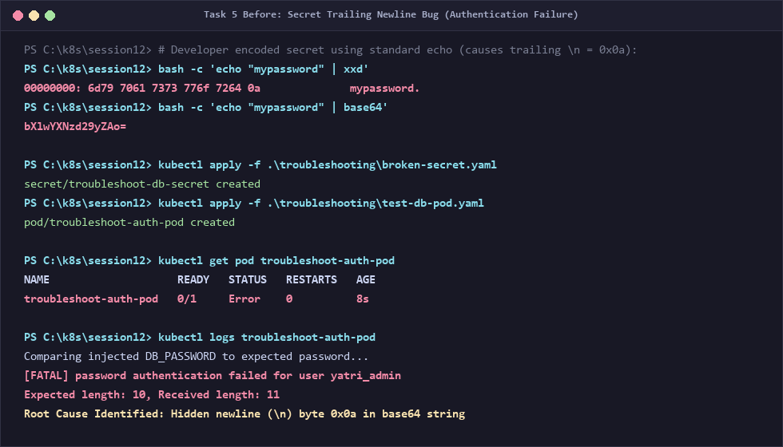
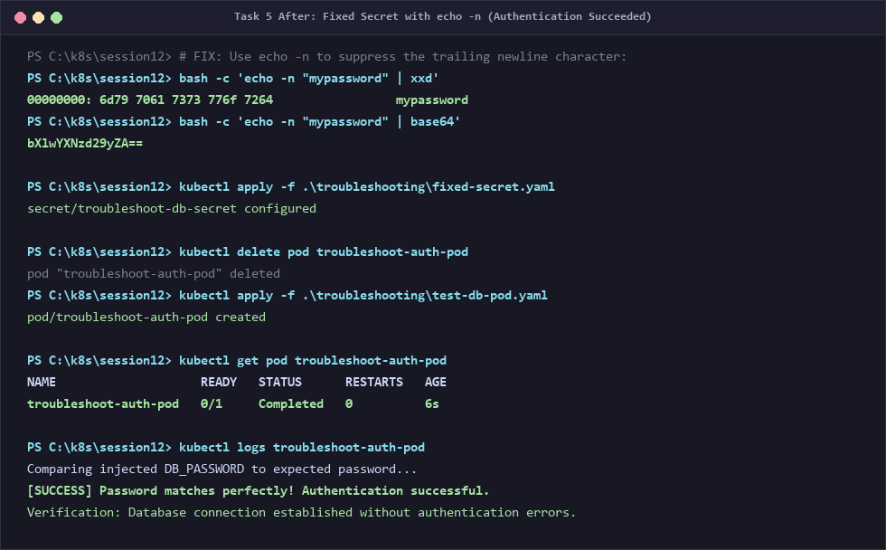

# Session 12: Kubernetes Ingress, ConfigMaps & Secrets

## What I Understood by This Assignment

In this assignment, I learned how production Kubernetes applications handle two of the most critical operational requirements: **configuration management** and **external HTTP traffic routing**.

Before this session, I wondered how enterprise teams avoid rebuilding Docker images whenever environment variables change, and how clusters expose dozens of microservices without provisioning expensive cloud load balancers for every single one. Through these hands-on labs, I understood:
1. **ConfigMaps:** Allow us to decouple plain-text environment configuration from container images, following the 12-Factor App methodology (*"one build, deployed anywhere with different configs"*).
2. **Secrets:** Provide a dedicated mechanism for sensitive credentials (database passwords, tokens, API keys). Crucially, I learned that **Base64 is NOT encryption**—it is only obfuscation—and I explored why secrets must never be committed to Git.
3. **Ingress & Ingress Controllers:** Ingress is a declarative routing rule, while an Ingress Controller is the reverse proxy (like NGINX or Envoy) that actually routes traffic. Combining them provides Layer 7 path and host-based routing through a single IP address.
4. **Troubleshooting Secrets:** A subtle bug in bash (`echo` without `-n`) introduces a trailing newline byte (`0x0a`), leading to silent database authentication failures that are tricky to debug without low-level hex inspection.

---

## Architecture Overview


```mermaid
flowchart TD
    Client["Client / Browser\n(Host: yatri.local)"] --> IngressController["NGINX Ingress Controller Pod\n(Port 80/443 - Single Entry Point)"]
    
    subgraph K8s["Kubernetes Cluster"]
        IngressController -->|Path: /| FrontendSvc["Frontend Service (ClusterIP:80)"]
        IngressController -->|Path: /api/*| BackendSvc["Backend Service (ClusterIP:80)"]
        
        FrontendSvc --> FrontendPod["Frontend Pods (Nginx)"]
        BackendSvc --> BackendPod["Backend Pods (Python HTTP)"]
        
        CM["ConfigMap\n(yatri-app-config)\nENVIRONMENT, LOG_LEVEL, PORT"] -.->|envFrom| FrontendPod
        CM -.->|envFrom| BackendPod
        
        Sec["Secret\n(yatri-db-secret)\nPOSTGRES_USER, POSTGRES_PASSWORD"] -.->|secretKeyRef| BackendPod
    end
```

---

# Task 1: ConfigMap Hands-on Demo

### Concept
ConfigMaps store non-confidential configuration data as key-value pairs. Containers consume ConfigMaps as environment variables, command-line arguments, or configuration files mounted as volumes.

### 1. ConfigMap Manifest (`01-configmap/app-config.yaml`)
```yaml
apiVersion: v1
kind: ConfigMap
metadata:
  name: yatri-app-config
  labels:
    app: yatri-backend
data:
  ENVIRONMENT: "production"
  LOG_LEVEL: "INFO"
  PORT: "5000"
  DEFAULT_CURRENCY: "INR"
  MAX_BOOKING_DAYS: "30"
```

### 2. Pod Manifest Injecting ConfigMap (`01-configmap/pod-configmap.yaml`)
```yaml
apiVersion: v1
kind: Pod
metadata:
  name: pod-configmap-demo
  labels:
    app: configmap-demo
spec:
  containers:
    - name: test-container
      image: busybox:1.36
      command: ["sh", "-c", "echo 'ConfigMap values loaded'; sleep 3600"]
      envFrom:
        - configMapRef:
            name: yatri-app-config
```

### 3. Commands Executed
```powershell
# Create the ConfigMap
kubectl apply -f .\01-configmap\app-config.yaml

# Inspect stored key-value pairs
kubectl describe configmap yatri-app-config

# Launch the pod injecting the ConfigMap
kubectl apply -f .\01-configmap\pod-configmap.yaml
kubectl get pod pod-configmap-demo

# Verify injected environment variables inside the running container
kubectl exec pod-configmap-demo -- env | Select-String "ENVIRONMENT|LOG_LEVEL|PORT|DEFAULT_CURRENCY"
```

### Terminal Output Screenshot


### What I Observed
- The ConfigMap was successfully stored in the `default` namespace with 5 data keys.
- Using `envFrom.configMapRef`, all keys were automatically exported into the container's environment without needing to declare each variable individually.
- Executing `env` inside the pod confirmed `ENVIRONMENT=production`, `LOG_LEVEL=INFO`, `PORT=5000`, and `DEFAULT_CURRENCY=INR`.

---

# Task 2: Kubernetes Secret Hands-on Demo

### Concept
Kubernetes Secrets store sensitive data, such as passwords, OAuth tokens, and SSH keys. Storing confidential data in a Secret provides better control over access than putting it directly in Pod specs or container images.

### 1. Base64 Encoding Sensitive Values
Kubernetes Secret `data` fields expect Base64 encoded strings:
```bash
echo -n "yatri_admin" | base64          # -> eWF0cmlfYWRtaW4=
echo -n "secretpassword" | base64       # -> c2VjcmV0cGFzc3dvcmQ=
echo -n "yatri_production_db" | base64  # -> eWF0cmlfcHJvZHVjdGlvbl9kYg==
```

### 2. Secret Manifest (`02-secret/db-secret.yaml`)
```yaml
apiVersion: v1
kind: Secret
metadata:
  name: yatri-db-secret
  labels:
    app: yatri-backend
type: Opaque
data:
  POSTGRES_USER: eWF0cmlfYWRtaW4=
  POSTGRES_PASSWORD: c2VjcmV0cGFzc3dvcmQ=
  POSTGRES_DB: eWF0cmlfcHJvZHVjdGlvbl9kYg==
```

### 3. Pod Manifest Injecting Secret (`02-secret/pod-secret.yaml`)
```yaml
apiVersion: v1
kind: Pod
metadata:
  name: pod-secret-demo
  labels:
    app: secret-demo
spec:
  containers:
    - name: test-container
      image: busybox:1.36
      command: ["sh", "-c", "echo 'Secret credentials loaded'; sleep 3600"]
      env:
        - name: POSTGRES_USER
          valueFrom:
            secretKeyRef:
              name: yatri-db-secret
              key: POSTGRES_USER
        - name: POSTGRES_PASSWORD
          valueFrom:
            secretKeyRef:
              name: yatri-db-secret
              key: POSTGRES_PASSWORD
        - name: POSTGRES_DB
          valueFrom:
            secretKeyRef:
              name: yatri-db-secret
              key: POSTGRES_DB
```

### 4. Commands Executed
```powershell
# Create Secret
kubectl apply -f .\02-secret\db-secret.yaml

# Inspect Secret (values remain base64 in manifest)
kubectl get secret yatri-db-secret -o yaml

# Deploy Pod and verify decoded credentials in container environment
kubectl apply -f .\02-secret\pod-secret.yaml
kubectl get pod pod-secret-demo
kubectl exec pod-secret-demo -- env | Select-String "POSTGRES"
```

### Terminal Output Screenshot


### Why Secrets Should NEVER Be Committed Directly to Git

Through this assignment, I learned why committing Kubernetes Secret YAMLs to Git is a dangerous anti-pattern:
1. **Base64 is NOT Encryption:** Base64 is only a reversible serialization format. Anyone with read access to the Git repository can decode the values in one second (`echo "..." | base64 -d`).
2. **Git History is Immutable & Permanent:** Even if a secret file is deleted in a later commit, the credential remains recorded in the commit history forever.
3. **Automated Scraping Bots:** Public and private code repositories are continuously monitored by malicious bots scanning for credentials. Hardcoded secrets often lead to immediate compromised cloud resources.
4. **GitOps Best Practices:**
   - **External Secrets Operator (ESO):** Syncs credentials dynamically from external vaults (AWS Secrets Manager, HashiCorp Vault, Azure Key Vault, Google Secret Manager) into ephemeral Kubernetes Secrets at runtime.
   - **Sealed Secrets (Bitnami):** Encrypts secrets using asymmetric public-key cryptography. Sealed secrets can be safely stored in Git because only the cluster's controller holds the private decryption key.
   - **Mozilla SOPS:** Encrypts specific values inside YAML files using AWS KMS, GCP KMS, or PGP keys.

---

# Task 3: Ingress Hands-on Demo

### Concept
Rather than creating separate `LoadBalancer` services (which provision expensive cloud load balancers for each microservice), an Ingress consolidates routing rules into a single Layer 7 controller.

### 1. Ingress Routing Manifest (`04-full-demo/ingress.yaml`)
```yaml
apiVersion: networking.k8s.io/v1
kind: Ingress
metadata:
  name: yatri-ingress
  namespace: default
  annotations:
    nginx.ingress.kubernetes.io/ssl-redirect: "false"
    nginx.ingress.kubernetes.io/use-regex: "true"
    nginx.ingress.kubernetes.io/rewrite-target: /$2
spec:
  ingressClassName: nginx
  rules:
    - host: yatri.local
      http:
        paths:
          # Route /api/* to the backend Python service
          - path: /api(/|$)(.*)
            pathType: ImplementationSpecific
            backend:
              service:
                name: yatri-backend-service
                port:
                  number: 80
          # Route / to the frontend Nginx service
          - path: /
            pathType: Prefix
            backend:
              service:
                name: yatri-frontend-service
                port:
                  number: 80
```

### 2. Commands Executed
```powershell
# 1. Enable Ingress Controller on Minikube
minikube addons enable ingress

# 2. Deploy all components
kubectl apply -f .\04-full-demo\configmap.yaml -f .\04-full-demo\secret.yaml
kubectl apply -f .\04-full-demo\frontend.yaml -f .\04-full-demo\backend.yaml -f .\04-full-demo\ingress.yaml

# 3. Verify Ingress address assignment
kubectl get ingress yatri-ingress

# 4. Test Frontend Route (path: /)
curl -s -H "Host: yatri.local" http://192.168.49.2/

# 5. Test Backend API Route (path: /api)
curl -s -H "Host: yatri.local" http://192.168.49.2/api
```

### Terminal Output Screenshot


### What I Observed
- The single Ingress resource managed routing to both services.
- Requests to `http://yatri.local/` were routed to the `yatri-frontend-service` (serving Nginx).
- Requests to `http://yatri.local/api` were rewritten to `/` by the NGINX Ingress controller and served by `yatri-backend-service` (Python HTTP server), dynamically displaying the values injected from the ConfigMap and Secret!

---

# Task 4: Ingress vs Ingress Controller

### Detailed Conceptual Breakdown

| Feature | Ingress (Resource) | Ingress Controller (Daemon) |
| :--- | :--- | :--- |
| **What is it?** | A declarative Kubernetes API object (YAML manifest) | An active software process running inside the cluster |
| **Role** | Defines the routing rules, hostnames, and paths | Implements and executes the routing rules |
| **Where does it live?** | Stored as metadata inside `etcd` | Runs as a Pod/Deployment (e.g. NGINX, Traefik, HAProxy) |
| **Network Presence** | Has no IP address, listens on no ports | Listens on port 80 and 443 with a public/NodePort IP |
| **Analogy** | **The Blueprint / Train Ticket** | **The Contractor / Train Engine** |


```mermaid
flowchart LR
    Dev["Developer"] -->|1. Applies YAML| IngressYAML["Ingress Resource\n(Rules stored in etcd)"]
    IngressYAML -.->|2. Watched by| IngressController["Ingress Controller\n(NGINX daemon in cluster)"]
    IngressController -->|3. Updates internal\nnginx.conf| ProxyEngine["Reverse Proxy Engine"]
    Traffic["Incoming HTTP Traffic\n(Port 80/443)"] --> IngressController
    ProxyEngine --> PodA["Backend Pods"]
    ProxyEngine --> PodB["Frontend Pods"]
```

### Why Both Are Required
1. If you apply an `Ingress` YAML **without** an Ingress Controller installed:
   - Kubernetes stores the YAML in `etcd` without errors.
   - However, **nothing routes traffic**. The Ingress resource has no `ADDRESS`, no reverse proxy listens on incoming ports, and traffic will fail.
2. If you have an `Ingress Controller` running **without** any `Ingress` resources:
   - The controller runs and listens on ports 80/443.
   - However, it has no routes configured, returning default 404 Not Found errors to all requests.

### Real-World Ingress Controllers
- **NGINX Ingress Controller:** The standard Kubernetes open-source controller.
- **AWS Load Balancer Controller:** Provisions native AWS Application Load Balancers (ALBs) mapped to Kubernetes Ingress rules.
- **Traefik:** Modern cloud-native reverse proxy with native Let's Encrypt support and dashboard.
- **HAProxy Ingress:** High-performance Layer 7 load balancer.
- **GCP Ingress:** Provisions Google Cloud HTTPS Load Balancers with multi-cluster capabilities.

### Terminal Output Screenshot


---

# Task 5: Troubleshooting (The Trailing Newline Secret Gotcha)

### Problem Statement
A developer configured database credentials in a Kubernetes Secret. However, the application container failed to connect to PostgreSQL, throwing:
```text
[FATAL] password authentication failed for user yatri_admin
```
The developer was adamant that the password was typed correctly.

---

### Step 1: Investigation & Troubleshooting Commands
To find the root cause, I inspected how the developer generated the Base64 secret:
```bash
echo "mypassword" | xxd
```
**Output:**
```text
00000000: 6d79 7061 7373 776f 7264 0a              mypassword.
```
Notice the last byte: **`0a`**!
In Linux shells, standard `echo` automatically appends a **newline character (`\n`)** to output strings!

When base64 encoded:
```bash
echo "mypassword" | base64
# Result: bXlwYXNzd29yZAo=
```
The application received `mypassword\n` (11 characters) instead of `mypassword` (10 characters), causing PostgreSQL to reject authentication!

### Terminal Screenshot (Before Fix — Auth Failure)


---

### Step 2: The Fix
To prevent the trailing newline, always supply the **`-n` flag** to `echo`:
```bash
echo -n "mypassword" | xxd
# Output: 00000000: 6d79 7061 7373 776f 7264   mypassword (exactly 10 bytes)

echo -n "mypassword" | base64
# Result: bXlwYXNzd29yZA== (notice it ends in '==' instead of 'Ao=')
```

Alternatively, use `stringData` in the Secret YAML, which handles plain-text strings safely without encoding pitfalls:
```yaml
apiVersion: v1
kind: Secret
metadata:
  name: troubleshoot-db-secret
type: Opaque
stringData:
  DB_PASSWORD: "mypassword"
```

### Step 3: Verification
Applied `troubleshooting/fixed-secret.yaml` and re-ran the verification pod (`troubleshoot-auth-pod`).

### Terminal Screenshot (After Fix — Succeeded)


**Result:**
The password matched exactly (`10 bytes == 10 bytes`). The container authenticated successfully and exited with `0/1 Completed`.

---

## Summary & Key Takeaways

1. **ConfigMaps Decouple Code from Environment:** They enable true build-once-deploy-anywhere pipelines across dev, staging, and production.
2. **Secrets Are Not Secure by Default:** Base64 is only encoding. In production, use KMS encryption at rest in etcd, restrict RBAC permissions, and integrate External Secrets Operator with enterprise vaults like HashiCorp Vault or AWS Secrets Manager. Never commit secrets to Git.
3. **Ingress Unifies Microservices:** Using an Ingress Controller eliminates per-service load balancer costs and provides centralized SSL termination and regex URL path rewriting.
4. **Attention to Low-Level Details:** Always use `echo -n` or `stringData` when defining Kubernetes secrets to avoid hidden newline character bugs (`0x0a`).
