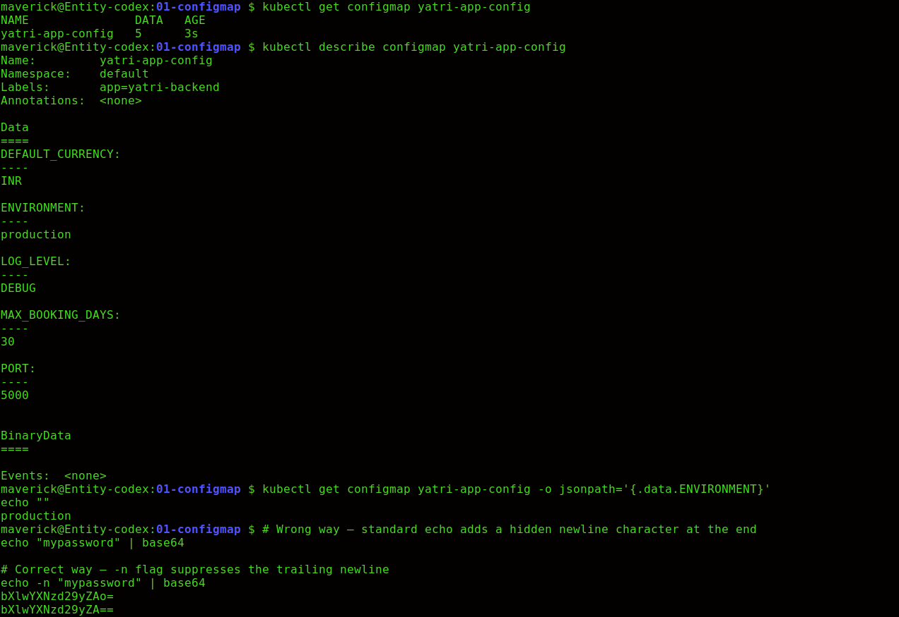
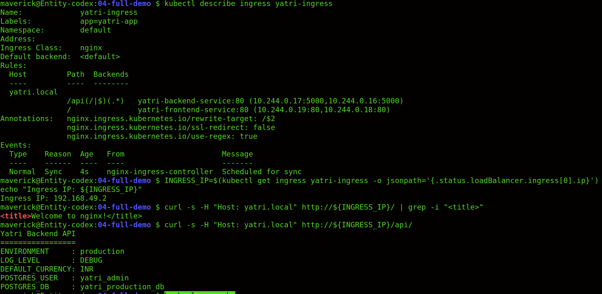
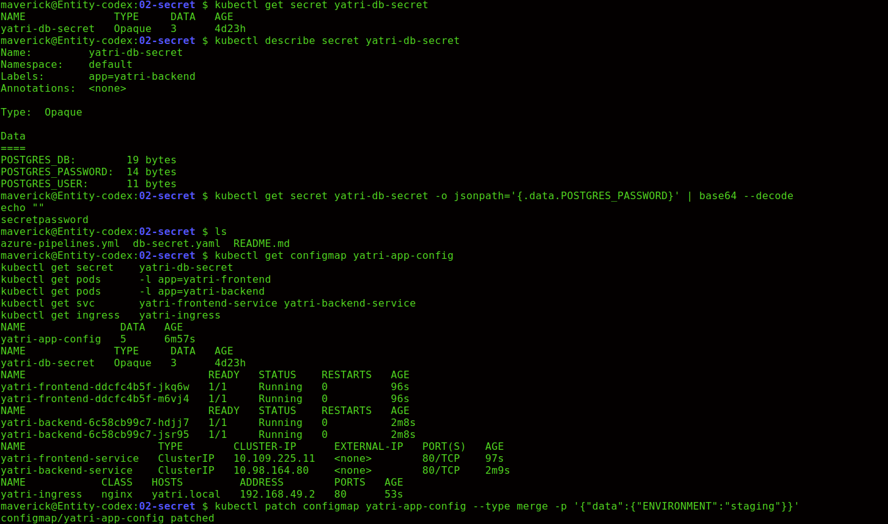
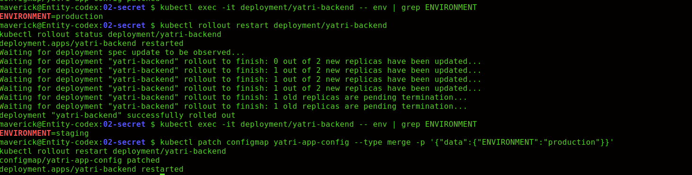

# Session 12: Kubernetes Ingress, ConfigMaps & Secrets

This session focused on understanding and implementing three important Kubernetes abstractions:

- **ConfigMaps** for non-sensitive application configuration
- **Secrets** for sensitive configuration values
- **Ingress** and the **Ingress Controller** for HTTP/HTTPS routing into Kubernetes workloads

The work was completed as a hands-on exercise, including deployment, verification, routing, and troubleshooting.

---

## Task 1: ConfigMap

### Objective

Perform a complete hands-on demonstration of Kubernetes ConfigMaps.

### What was done

- Created a Kubernetes `ConfigMap`
- Stored application configuration values such as:
  - `ENVIRONMENT`
  - `LOG_LEVEL`
  - `PORT`
  - `DEFAULT_CURRENCY`
  - `MAX_BOOKING_DAYS`
- Injected the ConfigMap into a Pod using `envFrom`
- Verified that the configuration values were available inside the running container

### Key Understanding

A ConfigMap allows configuration to be separated from the application image. The same application image can therefore be deployed with different configuration values.

For environment-variable based injection, the values become part of the container's process environment when the container starts. Updating the ConfigMap does not automatically update an already-running process environment.

---

## Task 2: Secret

### Objective

Perform a complete hands-on demonstration of Kubernetes Secrets.

### What was done

- Created a Kubernetes `Secret`
- Stored sensitive configuration values
- Injected Secret values into the application Pod
- Verified the injected values inside the container
- Investigated how Kubernetes represents Secret data

### Important Understanding

Kubernetes Secret values under the `data` field are **Base64 encoded, not encrypted by default**.

Base64 is only an encoding mechanism and can be reversed easily. It should therefore not be treated as a security mechanism.

For example:

```text
Plaintext
   ↓
Base64 encoding
   ↓
Encoded representation
```

This is different from encryption, where a cryptographic key is required to recover the original plaintext.

Secrets should also **not be committed directly to Git**, because anyone with access to the repository could potentially obtain the encoded values and decode them. Production environments should additionally consider appropriate access controls, encryption at rest, and external secret-management solutions.

---

## Task 3: Ingress

### Objective

Perform a complete Kubernetes Ingress demonstration.

### What was done

- Deployed the frontend and backend applications
- Created Kubernetes Services for the workloads
- Enabled the NGINX Ingress Controller in Minikube
- Configured an Ingress resource
- Added local host resolution for `yatri.local`
- Accessed the application through the Ingress
- Verified host-based and path-based routing

### Request Flow

The final routing model can be represented as:

```text
Host Machine
     │
     │ curl http://yatri.local
     ▼
/etc/hosts / DNS resolution
     │
     ▼
Minikube networking
     │
     ▼
NGINX Ingress Controller
     │
     │ Host + Path matching
     ▼
┌──────────────────────────────┐
│                              │
│ /                            │ /api
▼                              ▼
frontend-service          backend-service
│                              │
▼                              ▼
Frontend Pods              Backend Pods
```

The important distinction is that the **Ingress resource is configuration**, while the **Ingress Controller is the actual software/process that implements that configuration**.

---

## Task 4: Ingress vs Ingress Controller

### What is Ingress?

An **Ingress** is a Kubernetes API resource that defines HTTP/HTTPS routing rules for traffic entering the cluster.

For example, an Ingress can express rules such as:

```text
yatri.local/
        → frontend-service

yatri.local/api
        → backend-service
```

The Ingress resource itself does not act as a reverse proxy and does not process network traffic.

### What is an Ingress Controller?

An **Ingress Controller** is the software that watches Kubernetes Ingress resources and actually implements their routing behavior.

In this session, the controller was **NGINX Ingress Controller**.

Conceptually:

```text
Ingress YAML
     │
     ▼
Kubernetes API Server
     │
     ▼
NGINX Ingress Controller
     │
     ▼
NGINX
     │
     ▼
Kubernetes Services
     │
     ▼
Application Pods
```

### Difference

| Ingress | Ingress Controller |
|---|---|
| Kubernetes API resource | Actual running software |
| Defines routing rules | Implements routing rules |
| Declarative configuration | Watches and acts on configuration |
| Does not proxy traffic itself | Handles the actual HTTP/HTTPS traffic |
| Example: `yatri-ingress` | Example: NGINX Ingress Controller |

### Why are both required?

The Ingress resource describes **what should happen**.

The Ingress Controller is responsible for **making it happen**.

Without an Ingress Controller, creating an Ingress object alone does not provide a working HTTP reverse-proxy path.

---

## Task 5: Troubleshooting

The troubleshooting exercise followed a simple failure-analysis workflow:

1. **Identify the problem**
2. **Run troubleshooting commands**
3. **Find the root cause**
4. **Fix the issue**
5. **Compare before/after behavior**
6. **Capture the result with screenshots**

One of the important failures encountered during the Ingress setup was that the Ingress resource existed, but the NGINX Ingress Controller had not yet been enabled in Minikube.

This demonstrated an important distinction:

```text
Ingress resource exists
        ≠
Ingress Controller is running
```

After enabling the Minikube Ingress addon, the NGINX Ingress Controller Pod became available and the configured Ingress rules started working.

---

## Screenshots

The hands-on work was captured in the `screenshots/` directory.

### Setup

Initial Kubernetes/Ingress setup and environment:



### Ingress

Ingress configuration and routing demonstration:



### Patching

Patching-related troubleshooting/demo output:



### Rollout Patch

Rollout/patching verification:



---

## Deliverables

- [x] ConfigMap YAML
- [x] Secret YAML
- [x] Ingress YAML
- [x] Troubleshooting documentation
- [x] Screenshots
- [x] README.md

---

## Final Mental Model

The main concepts from this session can be connected as:

```text
                 External HTTP Request
                         │
                         ▼
                  Ingress Controller
                    (NGINX process)
                         │
                  Host / Path routing
                         │
          ┌──────────────┴──────────────┐
          ▼                             ▼
   Frontend Service              Backend Service
      ClusterIP                     ClusterIP
          │                             │
    EndpointSlices                EndpointSlices
          │                             │
          ▼                             ▼
    Frontend Pods                  Backend Pods
```

Configuration is kept separate from the application through:

```text
ConfigMap → non-sensitive configuration
Secret    → sensitive configuration
```

The overall principle is to understand each Kubernetes abstraction in terms of the underlying system it represents rather than treating Kubernetes YAML as magic.
