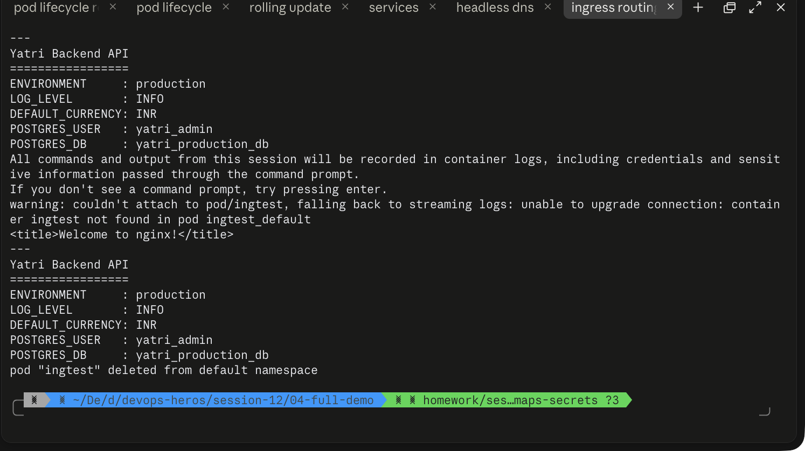

# Session 12 - Ingress, ConfigMaps & Secrets Homework

## Task 1: Ingress vs Ingress Controller

### Ingress (the object)
`Ingress` is a Kubernetes **API resource** — a plain YAML manifest describing HTTP/HTTPS routing rules: which host and path should route to which internal `Service`. On its own it does **nothing**. Creating an `Ingress` object with no controller running in the cluster just sits there as inert configuration — no traffic is ever actually routed by it.

```yaml
spec:
  ingressClassName: nginx
  rules:
    - host: yatri.local
      http:
        paths:
          - path: /api(/|$)(.*)
            backend:
              service:
                name: yatri-backend-service
```

### Ingress Controller (the implementation)
The **Ingress Controller** is the actual running component (a pod, usually a reverse proxy like NGINX, Traefik, or HAProxy) that:
1. Watches the API server for `Ingress` objects.
2. Reads their routing rules.
3. Configures itself (e.g. generates an `nginx.conf`) to actually enforce those rules.
4. Receives the real HTTP traffic and forwards it to the correct backend `Service`.

Without an Ingress Controller installed, `kubectl apply -f ingress.yaml` succeeds (the object is stored in etcd) but **no traffic is ever routed** — there's nobody listening to enforce the rule.

### The Nginx Ingress Controller specifically
`ingress-nginx` (the most common one, maintained by the Kubernetes project) is an NGINX reverse-proxy pod plus a controller process. The controller process watches `Ingress` objects and dynamically rewrites NGINX's configuration to match — path-based routing, host-based routing, rewrite rules, TLS termination, etc. On Minikube it's enabled as an addon:
```bash
minikube addons enable ingress
kubectl get pods -n ingress-nginx
```
```text
NAME                                       READY   STATUS      RESTARTS   AGE
ingress-nginx-admission-create-rnh76       0/1     Completed   0          2m5s
ingress-nginx-admission-patch-blw9c        0/1     Completed   0          2m5s
ingress-nginx-controller-d7cd8c989-cl6wm   1/1     Running     0          2m16s
```

### Key difference in one line
> **Ingress** is the *rule* (what should route where). **Ingress Controller** is the *engine* that reads that rule and actually moves the traffic. One `Ingress` object is useless without a running Ingress Controller — and one Ingress Controller can serve many `Ingress` objects across the whole cluster.

| | Ingress | Ingress Controller |
|---|---|---|
| What it is | A Kubernetes API object (YAML) | A running pod/reverse-proxy |
| Does it do anything alone? | No — just stored config | Yes — actually proxies traffic |
| How many per cluster? | Many (one per app/route set) | Usually one (or a few, HA) |
| Example | `ingress.yaml` in this repo | `ingress-nginx-controller` pod |

---

## Task 2: Run the full demo (`04-full-demo/`)

Followed [lab.md](./lab.md) end-to-end against a live minikube cluster.

### ConfigMap
```bash
kubectl apply -f 04-full-demo/configmap.yaml
kubectl get configmap yatri-app-config -o jsonpath='{.data.ENVIRONMENT}'
```
```text
production
```

### Secret — the `echo` vs `echo -n` newline bug
```bash
echo "mypassword" | base64      # bXlwYXNzd29yZAo=   <- wrong, trailing \n encoded
echo -n "mypassword" | base64   # bXlwYXNzd29yZA==   <- correct
```
```bash
kubectl apply -f 04-full-demo/secret.yaml
kubectl get secret yatri-db-secret -o jsonpath='{.data.POSTGRES_PASSWORD}' | base64 --decode
```
```text
secretpassword
```
Proves Base64 is encoding, not encryption — anyone with `kubectl get secret` access can trivially decode it. Real protection comes from RBAC restricting who can read Secrets, not from Base64 itself.

### Backend — ConfigMap + Secret injected as env vars
```bash
kubectl apply -f 04-full-demo/backend.yaml
kubectl exec -it deployment/yatri-backend -- env | grep -E "ENVIRONMENT|LOG_LEVEL|DEFAULT_CURRENCY|POSTGRES"
```
```text
DEFAULT_CURRENCY=INR
ENVIRONMENT=production
LOG_LEVEL=INFO
POSTGRES_USER=yatri_admin
POSTGRES_PASSWORD=secretpassword
POSTGRES_DB=yatri_production_db
```
`envFrom.configMapRef` pulled all 5 ConfigMap keys at once; `env[].valueFrom.secretKeyRef` pulled the 3 Secret keys individually.

### Frontend
```bash
kubectl apply -f 04-full-demo/frontend.yaml
kubectl get svc yatri-frontend-service yatri-backend-service
```
Both `ClusterIP` — confirmed neither is reachable from outside the cluster on its own, which is exactly why Ingress is needed next.

### Ingress — routing both services through one entry point
```bash
kubectl apply -f 04-full-demo/ingress.yaml
kubectl get ingress yatri-ingress
```
```text
NAME            CLASS   HOSTS         ADDRESS        PORTS   AGE
yatri-ingress   nginx   yatri.local   192.168.49.2   80      40s
```
Tested both routes from inside the cluster network (against the Ingress Controller's address, with the `Host` header set):
```bash
curl -s -H "Host: yatri.local" http://192.168.49.2/     | grep -i title
curl -s -H "Host: yatri.local" http://192.168.49.2/api/
```
```text
<title>Welcome to nginx!</title>

Yatri Backend API
=================
ENVIRONMENT     : production
LOG_LEVEL       : INFO
DEFAULT_CURRENCY: INR
POSTGRES_USER   : yatri_admin
POSTGRES_DB     : yatri_production_db
```
One IP, one Ingress Controller pod, two backend services routed by path (`/` → frontend, `/api/*` → backend).



### ConfigMap live-update behavior
```bash
kubectl patch configmap yatri-app-config --type merge -p '{"data":{"ENVIRONMENT":"staging"}}'
kubectl exec -it deployment/yatri-backend -- env | grep ENVIRONMENT
```
```text
ENVIRONMENT=production   # unchanged — env vars are set once at container start
```
```bash
kubectl rollout restart deployment/yatri-backend
kubectl exec -it deployment/yatri-backend -- env | grep ENVIRONMENT
```
```text
ENVIRONMENT=staging       # now picked up, after a fresh container start
```
Confirms: editing a ConfigMap does **not** hot-reload environment variables in already-running pods — a rolling restart is required. (Patched back to `production` and restarted again before cleanup, to leave the demo files unchanged.)

### Cleanup
```bash
bash 04-full-demo/cleanup.sh
```
```text
[INFO] Deleting Ingress...
[INFO] Deleting Backend Deployment and Service...
[INFO] Deleting Frontend Deployment and Service...
[INFO] Deleting Secret...
[INFO] Deleting ConfigMap...
[INFO] All demo resources removed.
```

---

## Resources
- [lab.md](./lab.md) — full step-by-step lab guide
- [troubleshooting/secret-base64-gotcha.md](./troubleshooting/secret-base64-gotcha.md)
- https://kubernetes.io/docs/concepts/services-networking/ingress/
- https://kubernetes.io/docs/concepts/services-networking/ingress-controllers/
- https://kubernetes.io/docs/concepts/configuration/configmap/
- https://kubernetes.io/docs/concepts/configuration/secret/
