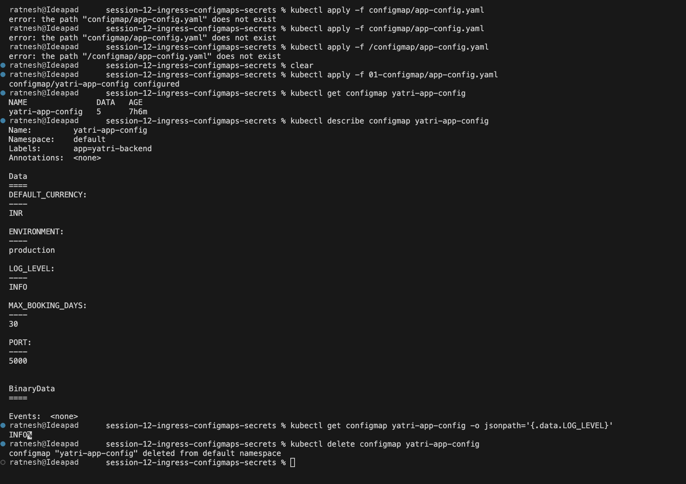
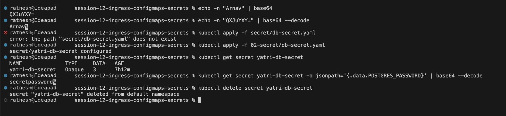
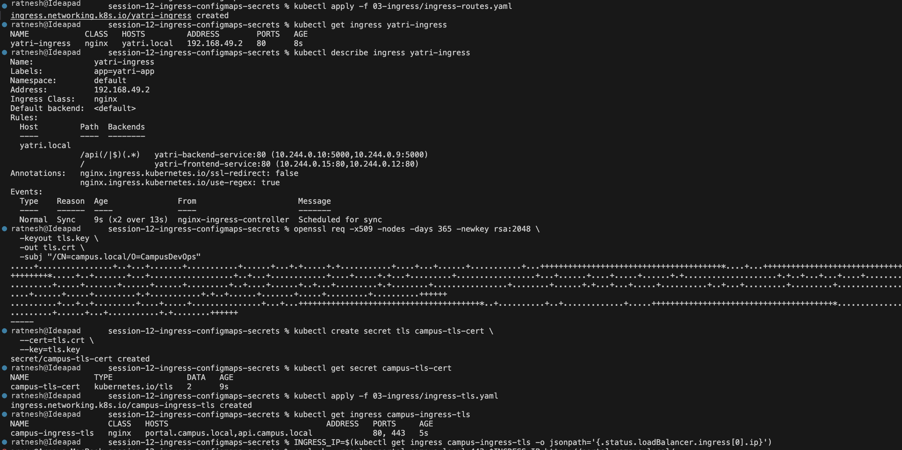
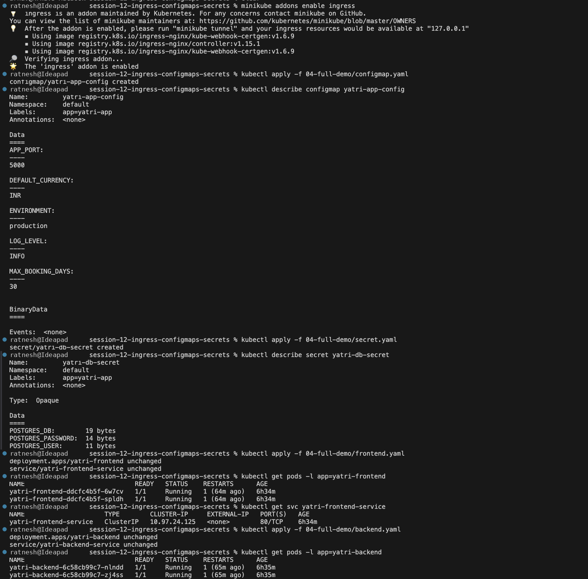
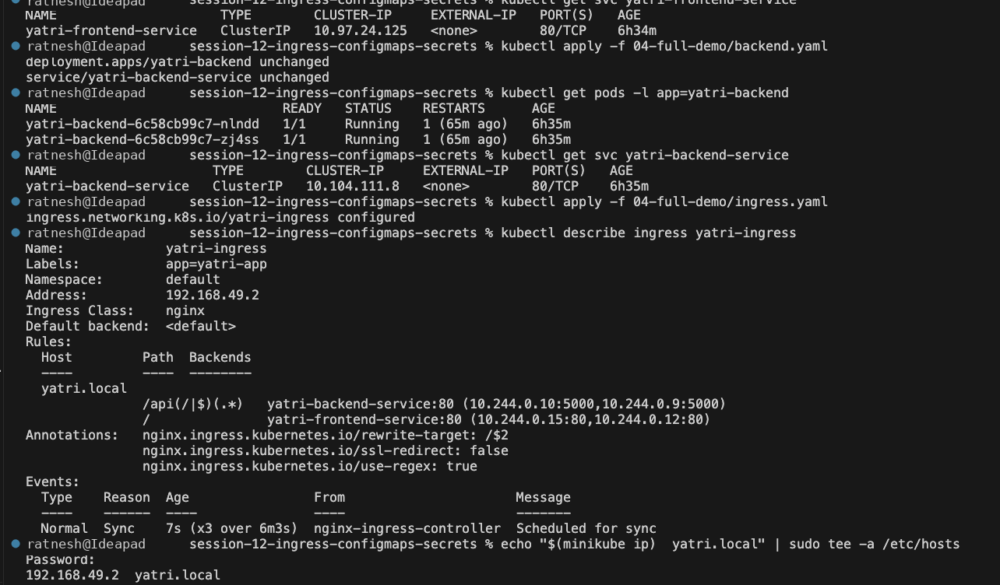

# Session 12 — Ingress, ConfigMaps and Secrets

## 1. ConfigMap

Create `yatri-app-config`, inspect its keys, read a single value with JSONPath,
and delete it.

## 2. Secret

Base64 encode/decode a value, create `yatri-db-secret`, read the stored password
back, and delete it.

## 3. Ingress

Create the host/path routing rules for `yatri.local`, then generate a self-signed
certificate and add a TLS-enabled Ingress.

## 4. Full Demo

End-to-end: enable the NGINX ingress addon, then deploy the ConfigMap, Secret,
frontend, backend and Ingress together.

**ConfigMap, Secret and frontend**

**Backend, Ingress routing and host entry**

