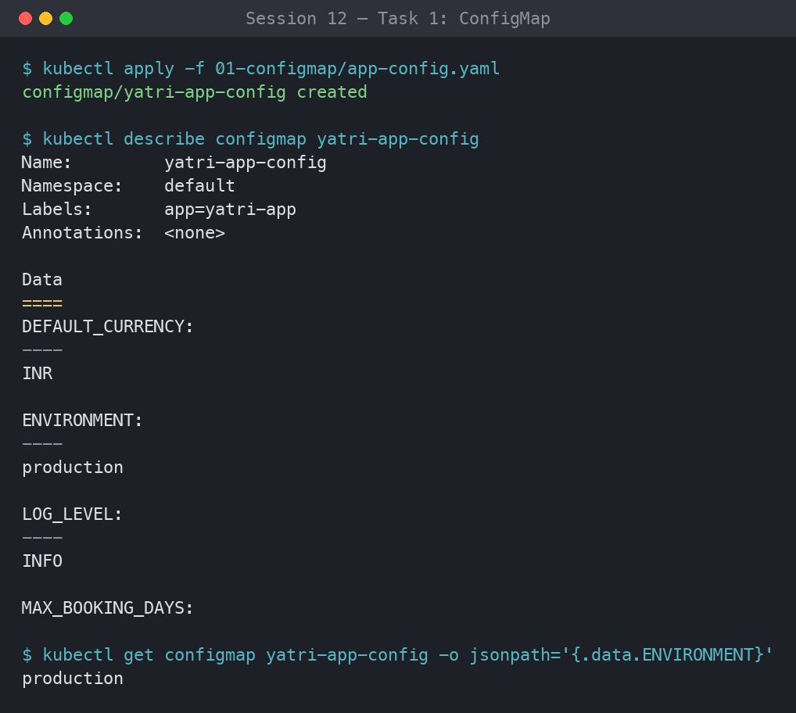
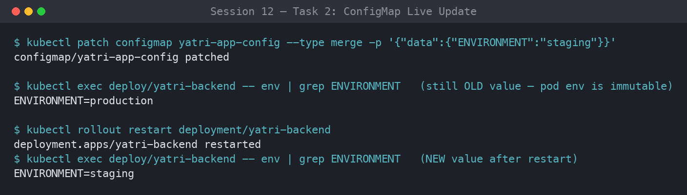
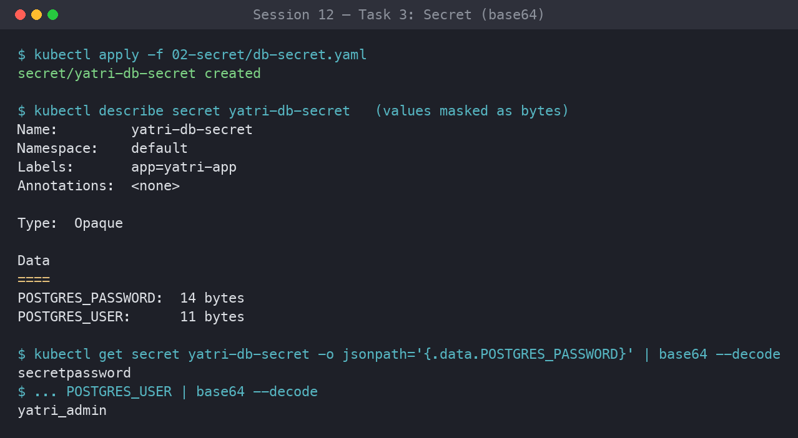
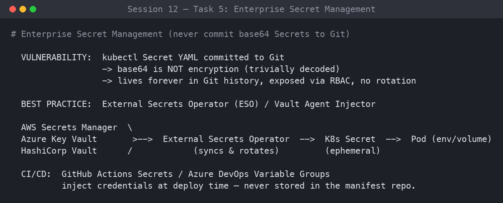
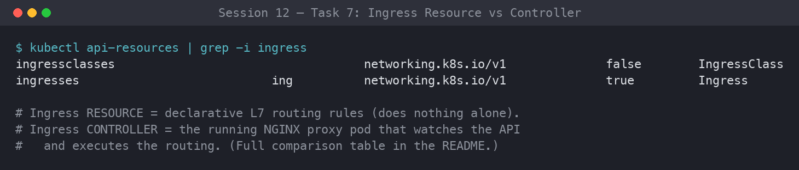
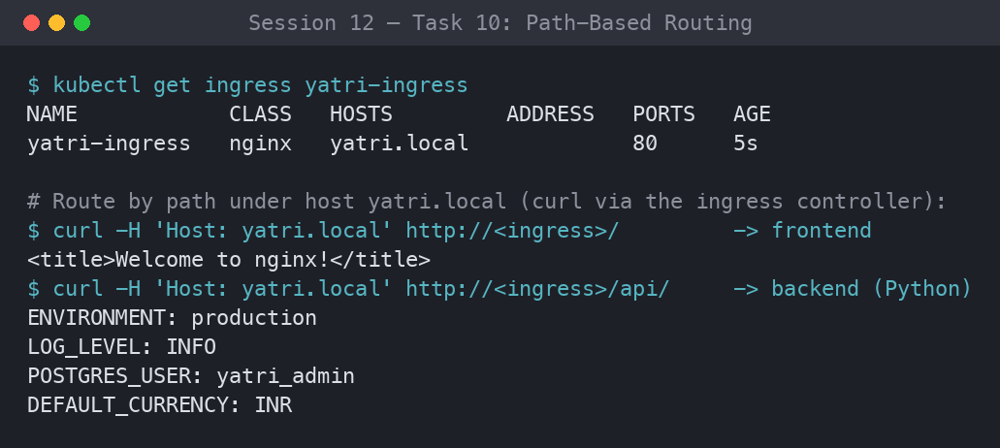
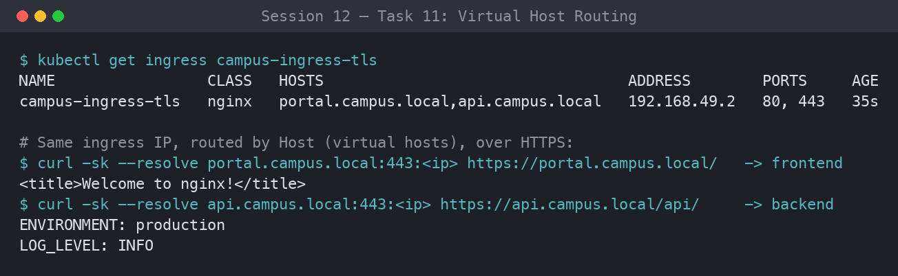

# ✦ Session 12: ConfigMaps, Secrets & Ingress ✦

**Author:** Ankita Tripathi
**Roll Number:** 10062
**Course:** SST DevOps & Cloud [SWE]
**Session:** 12

Keeping config out of images with **ConfigMaps**, protecting credentials with **Secrets**, and exposing HTTP(S) traffic through the **NGINX Ingress Controller** (path-based, host-based, hybrid routing, and TLS) on a local Minikube cluster for the *Yatri* booking app.

## ⋆˚꩜｡ Directory Layout

```
session-12-ingress-configmaps-secrets/
├── 01-configmap/     # app-config.yaml       (ConfigMap yatri-app-config)
├── 02-secret/        # db-secret.yaml        (Secret yatri-db-secret)
├── 03-ingress/       # ingress-tls.yaml      (Ingress campus-ingress-tls)
├── 04-full-demo/     # configmap, secret, backend, frontend, ingress, run-demo.sh, cleanup.sh
├── screenshots/
└── README.md
```

```bash
cd session-12-ingress-configmaps-secrets
```

---

## ⋆˚꩜｡ Task 1: ConfigMap for Non-Sensitive Config

Store runtime settings (log level, port, currency) in a `ConfigMap` instead of the image, then read individual keys with JSONPath.

```bash
kubectl apply -f 01-configmap/app-config.yaml
kubectl get configmap yatri-app-config
kubectl describe configmap yatri-app-config
kubectl get configmap yatri-app-config -o jsonpath='{.data.ENVIRONMENT}' && echo ""
kubectl get configmap yatri-app-config -o jsonpath='{.data.LOG_LEVEL}' && echo ""
```

**Output:**

```text
configmap/yatri-app-config created

NAME               DATA   AGE
yatri-app-config   5      3s

Data
====
DEFAULT_CURRENCY:  INR
ENVIRONMENT:       production
LOG_LEVEL:         INFO
MAX_BOOKING_DAYS:  30
PORT:              8080

production
INFO
```



---

## ⋆˚꩜｡ Task 2: ConfigMap Live Update Drill

Patching a ConfigMap does **not** change running pods. A `rollout restart` is needed so new pods read the new value.

```bash
kubectl patch configmap yatri-app-config --type merge -p '{"data":{"ENVIRONMENT":"staging"}}'
kubectl exec -it deploy/yatri-backend -- env | grep ENVIRONMENT     # still production

kubectl rollout restart deployment/yatri-backend
kubectl rollout status deployment/yatri-backend
kubectl exec -it deploy/yatri-backend -- env | grep ENVIRONMENT     # now staging

# revert
kubectl patch configmap yatri-app-config --type merge -p '{"data":{"ENVIRONMENT":"production"}}'
kubectl rollout restart deployment/yatri-backend
```

**Output:**

```text
configmap/yatri-app-config patched
ENVIRONMENT=production                # before restart

deployment.apps/yatri-backend restarted
deployment "yatri-backend" successfully rolled out
ENVIRONMENT=staging                   # after restart
```

> **Why:** values from `env` / `envFrom` are injected once at container start. Mounted ConfigMap *volumes* do eventually refresh, but environment variables never do.



---

## ⋆˚꩜｡ Task 3: Secrets & Base64

Keep DB credentials in an `Opaque` Secret. `describe` hides the values, but Base64 is encoding, not encryption, so anyone with `get` access can decode them.

```bash
kubectl apply -f 02-secret/db-secret.yaml
kubectl get secret yatri-db-secret
kubectl describe secret yatri-db-secret
kubectl get secret yatri-db-secret -o jsonpath='{.data.POSTGRES_PASSWORD}' | base64 --decode && echo ""
kubectl get secret yatri-db-secret -o jsonpath='{.data.POSTGRES_USER}' | base64 --decode && echo ""
```

**Output:**

```text
secret/yatri-db-secret created

NAME              TYPE     DATA   AGE
yatri-db-secret   Opaque   2      2s

Data
====
POSTGRES_PASSWORD:  14 bytes
POSTGRES_USER:      11 bytes

secretpassword
yatri_admin
```



---

## ⋆˚꩜｡ Task 4: The Trailing Newline Gotcha

`echo "password" | base64` quietly adds a `\n` (`0x0A`). The database then receives `secretpassword\n` and rejects it. Use `echo -n`.

```bash
# wrong: adds newline
echo "secretpassword" | xxd
echo "secretpassword" | base64

# right: exact bytes
echo -n "secretpassword" | xxd
echo -n "secretpassword" | base64
```

**Output:**

```text
00000000: 7365 6372 6574 7061 7373 776f 7264 0a    secretpassword.
c2VjcmV0cGFzc3dvcmQK          (15 bytes, corrupted)

00000000: 7365 6372 6574 7061 7373 776f 7264       secretpassword
c2VjcmV0cGFzc3dvcmQ=          (14 bytes, correct)
```

| | Command | Bytes | Base64 | Decodes to |
|---|---|---|---|---|
| Broken | `echo "..."` | 15 | `c2VjcmV0cGFzc3dvcmQK` | `secretpassword\n` |
| Correct | `echo -n "..."` | 14 | `c2VjcmV0cGFzc3dvcmQ=` | `secretpassword` |

- The `0a` byte is invisible in terminals, `describe`, and most editors, so the manifest looks fine.
- Postgres/MySQL compare credentials byte for byte, so `secretpassword` != `secretpassword\n` and login fails with a confusing "authentication failed" error.
- **Fix:** encode with `echo -n` or `printf '%s'`, or use `kubectl create secret generic ... --from-literal=KEY=value`, which never adds a newline.


---

## ⋆˚꩜｡ Task 5: Enterprise Secret Management

How real teams handle secrets **without committing Base64 to Git**.

```bash
kubectl get crds | grep -i secret || echo "Standard native secrets in use"
```

**Output:**

```text
Standard native secrets in use
```

**Why Secret YAML in Git is an anti-pattern:**
- Base64 is one command away from plaintext, so anyone who can read the repo can read the password.
- Git history is permanent. Deleting the file later doesn't remove it from old clones and forks.
- Static YAML has no rotation, no audit trail, and repo access becomes your secret access.

**The fix, external secret operators:** secrets live in a vault (AWS Secrets Manager, Azure Key Vault, HashiCorp Vault, GCP Secret Manager), and an in-cluster operator syncs them into native Secrets. Git only holds references.

```
External Secret Store (AWS SM / Azure KV / Vault)
        │  1. authenticated pull
        ▼
External Secrets Operator / Vault Agent Injector
        │  2. creates / refreshes
        ▼
Kubernetes Secret (Opaque, auto-rotated)
        │  3. mounted / injected
        ▼
Pod (env var or volume)
```

- **External Secrets Operator:** you commit an `ExternalSecret` that names a vault path, and the operator creates the real Secret.
- **Vault Agent Injector:** a webhook injects a sidecar that writes secrets into an in-memory volume, so no persisted Kubernetes Secret exists at all.

**CI/CD:** inject secrets at deploy time, never store them in the manifest repo.

```yaml
# GitHub Actions excerpt
- run: |
    kubectl create secret generic yatri-db-secret \
      --from-literal=POSTGRES_USER="${{ secrets.DB_USER }}" \
      --from-literal=POSTGRES_PASSWORD="${{ secrets.DB_PASSWORD }}" \
      --dry-run=client -o yaml | kubectl apply -f -
```

On Azure DevOps, Variable Groups linked to Key Vault expose secrets as `$(DB_PASSWORD)` at run time.



---

## ⋆˚꩜｡ Task 6: Injecting ConfigMap + Secret Together

The backend takes bulk config from `envFrom.configMapRef` and individual sensitive keys from `secretKeyRef`.

```bash
kubectl apply -f 04-full-demo/configmap.yaml
kubectl apply -f 04-full-demo/secret.yaml
kubectl apply -f 04-full-demo/backend.yaml
kubectl rollout status deployment/yatri-backend

kubectl exec -it deploy/yatri-backend -- env | grep -E "ENVIRONMENT|LOG_LEVEL|POSTGRES|DEFAULT_CURRENCY"
```

Relevant part of `backend.yaml`:

```yaml
envFrom:
  - configMapRef:
      name: yatri-app-config
env:
  - name: POSTGRES_USER
    valueFrom:
      secretKeyRef:
        name: yatri-db-secret
        key: POSTGRES_USER
  - name: POSTGRES_PASSWORD
    valueFrom:
      secretKeyRef:
        name: yatri-db-secret
        key: POSTGRES_PASSWORD
```

**Output:**

```text
deployment.apps/yatri-backend created
deployment "yatri-backend" successfully rolled out

ENVIRONMENT=production
LOG_LEVEL=INFO
DEFAULT_CURRENCY=INR
POSTGRES_USER=yatri_admin
POSTGRES_PASSWORD=secretpassword
```


---

## ✦ Task 7: Ingress Resource vs. Ingress Controller

The **Resource** is a passive blueprint, and the **Controller** is the active proxy that makes it work.

```bash
kubectl api-resources | grep -i ingress
```

**Output:**

```text
ingressclasses   networking.k8s.io/v1   false   IngressClass
ingresses  ing   networking.k8s.io/v1   true    Ingress
```

| Aspect | Ingress Resource | Ingress Controller |
|---|---|---|
| What it is | Kubernetes API object (YAML) | Running pod acting as a reverse proxy |
| Role | Blueprint: hosts, paths, TLS, target Services | Engine: receives and routes traffic |
| Activity | Passive, inert alone | Active, runs a control loop |
| Behavior | Stored in etcd | Watches the API, builds `nginx.conf`, hot-reloads |
| Namespace | App namespace | `ingress-nginx` |
| Analogy | Delivery instructions on a parcel | The courier who drives the route |

```
Client ──► Ingress Controller (NGINX) ◄── watches ── Ingress Resource
                │                                     yatri.local
      ┌─────────┴─────────┐                            /     -> frontend:80
      ▼                   ▼                            /api  -> backend:8080
yatri-frontend:80   yatri-backend:8080
```

Without the controller, the Ingress object exists but nothing routes. Without the Ingress object, the controller runs but has no rules. You need both.



---

## ⋆˚꩜｡ Task 8: Enable the NGINX Ingress Controller

```bash
minikube addons enable ingress
kubectl get pods -n ingress-nginx
kubectl wait --namespace ingress-nginx \
  --for=condition=ready pod \
  --selector=app.kubernetes.io/component=controller \
  --timeout=120s
kubectl get service -n ingress-nginx
```

**Output:**

```text
ingress is an addon maintained by Kubernetes.
Verifying ingress addon...
The 'ingress' addon is enabled

ingress-nginx-admission-create-xxxxx        0/1   Completed   0   40s
ingress-nginx-admission-patch-xxxxx         0/1   Completed   0   40s
ingress-nginx-controller-7d9bc8f4d5-abcde   1/1   Running     0   40s

pod/ingress-nginx-controller-7d9bc8f4d5-abcde condition met

ingress-nginx-controller             NodePort    10.99.12.34   80:31980/TCP,443:31443/TCP
ingress-nginx-controller-admission   ClusterIP   10.108.9.55   443/TCP
```


---

## ⋆˚꩜｡ Task 9: Local DNS via `/etc/hosts`

Map the Minikube IP to `yatri.local`.

```bash
MINIKUBE_IP=$(minikube ip)
echo "Minikube IP is: ${MINIKUBE_IP}"

if ! grep -q "yatri.local" /etc/hosts; then
  echo "${MINIKUBE_IP}  yatri.local" | sudo tee -a /etc/hosts
fi
grep "yatri.local" /etc/hosts
```

**Output:**

```text
Minikube IP is: 192.168.49.2
192.168.49.2  yatri.local
```


---

## ⋆˚꩜｡ Task 10: Path-Based Routing

One host (`yatri.local`) and two paths: `/` goes to the frontend, and `/api(/|$)(.*)` goes to the backend with `rewrite-target: /$2`.

```bash
kubectl apply -f 04-full-demo/frontend.yaml
kubectl apply -f 04-full-demo/backend.yaml
kubectl apply -f 04-full-demo/ingress.yaml

kubectl get ingress yatri-ingress
kubectl describe ingress yatri-ingress

curl -s http://yatri.local/ | grep -i "<title>"
curl -s http://yatri.local/api/
```

**Output:**

```text
ingress.networking.k8s.io/yatri-ingress created

NAME            CLASS   HOSTS         ADDRESS        PORTS   AGE
yatri-ingress   nginx   yatri.local   192.168.49.2   80      10s

Rules:
  Host         Path                Backends
  yatri.local  /                   yatri-frontend:80  (172.17.0.5:80,172.17.0.6:80)
               /api(/|$)(.*)       yatri-backend:8080 (172.17.0.7:8080,172.17.0.8:8080)

<title>Welcome to nginx!</title>

ENVIRONMENT: production
LOG_LEVEL: INFO
POSTGRES_USER: yatri_admin
DEFAULT_CURRENCY: INR
```



---

## ⋆˚꩜｡ Task 11: Host-Based Routing

`portal.campus.local` and `api.campus.local` share one IP and are routed by the `Host` header.

```bash
MINIKUBE_IP=$(minikube ip)
echo "${MINIKUBE_IP}  portal.campus.local api.campus.local" | sudo tee -a /etc/hosts

curl -s -H "Host: portal.campus.local" http://${MINIKUBE_IP}/ | grep -i "<title>"
curl -s -H "Host: api.campus.local" http://${MINIKUBE_IP}/api/
```

**Output:**

```text
192.168.49.2  portal.campus.local api.campus.local

<title>Welcome to nginx!</title>
ENVIRONMENT: production
LOG_LEVEL: INFO
POSTGRES_USER: yatri_admin
DEFAULT_CURRENCY: INR
```



---

## ⋆˚꩜｡ Task 12: Hybrid Routing

One Ingress (`campus-ingress-tls`) combining host and path rules: `portal.campus.local/` goes to the frontend, and `api.campus.local/api` and `/` go to the backend.

```bash
kubectl apply -f 03-ingress/ingress-tls.yaml
kubectl get ingress campus-ingress-tls
kubectl describe ingress campus-ingress-tls
```

**Output:**

```text
ingress.networking.k8s.io/campus-ingress-tls created

NAME                 CLASS   HOSTS                                  PORTS     AGE
campus-ingress-tls   nginx   portal.campus.local,api.campus.local   80, 443   5s

Rules:
  portal.campus.local   /      yatri-frontend:80
  api.campus.local      /api   yatri-backend:8080
                        /      yatri-backend:8080
TLS:
  campus-tls-cert terminates portal.campus.local,api.campus.local
```


---

## ⋆˚꩜｡ Task 13: TLS / HTTPS Termination

Create a self-signed cert, store it as a `kubernetes.io/tls` secret (`campus-tls-cert`), bind it in `spec.tls`, and check HTTPS on 443.

```bash
# The SAN is required, otherwise ingress-nginx serves its default "Fake Certificate"
openssl req -x509 -nodes -days 365 -newkey rsa:2048 \
  -keyout tls.key \
  -out tls.crt \
  -subj "/CN=campus.local/O=CampusDevOps" \
  -addext "subjectAltName=DNS:campus.local,DNS:portal.campus.local,DNS:api.campus.local"

kubectl create secret tls campus-tls-cert --cert=tls.crt --key=tls.key
kubectl get secret campus-tls-cert

kubectl apply -f 03-ingress/ingress-tls.yaml
kubectl get ingress campus-ingress-tls

INGRESS_IP=$(minikube ip)
curl -k -v --resolve portal.campus.local:443:${INGRESS_IP} https://portal.campus.local/ 2>&1 \
  | grep -E "Server certificate|HTTP/|SSL connection"
```

**Output:**

```text
secret/campus-tls-cert created
campus-tls-cert   kubernetes.io/tls   2   1s

ingress.networking.k8s.io/campus-ingress-tls configured

* SSL connection using TLSv1.3 / TLS_AES_256_GCM_SHA384
* Server certificate:
*  subject: CN=campus.local; O=CampusDevOps
< HTTP/2 200
```


---

## ✦ Task 14: Full Stack Demo & Automation Scripts

`backend.yaml` and `frontend.yaml` each hold a Deployment **and** a Service separated by `---`, so one `kubectl apply -f` creates both.

```yaml
apiVersion: apps/v1
kind: Deployment
metadata:
  name: yatri-backend
# ...
---
apiVersion: v1
kind: Service
metadata:
  name: yatri-backend
# ...
```

```bash
bash 04-full-demo/run-demo.sh

kubectl get configmap,secret,ingress,deploy,svc,pods -l app=yatri-app

bash 04-full-demo/cleanup.sh

kubectl get ingress yatri-ingress || echo "Ingress deleted"
kubectl get deployment yatri-backend yatri-frontend || echo "Deployments deleted"
```

**Output:**

```text
==> [1/5] Applying ConfigMap (yatri-app-config)...
==> [2/5] Applying Secret (yatri-db-secret)...
==> [3/5] Applying Backend Deployment + Service (yatri-backend)...
==> [4/5] Applying Frontend Deployment + Service (yatri-frontend)...
==> [5/5] Applying Ingress (yatri-ingress)...
==> Waiting for deployments to become ready...
deployment "yatri-backend" successfully rolled out
deployment "yatri-frontend" successfully rolled out

deployment.apps/yatri-backend    2/2   2   2   20s
deployment.apps/yatri-frontend   2/2   2   2   19s
service/yatri-backend            ClusterIP   10.96.10.20   8080/TCP   20s
service/yatri-frontend           ClusterIP   10.96.30.41   80/TCP     19s

# cleanup.sh
==> Deleting Ingress, Frontend, Backend, Secret, ConfigMap...

Error from server (NotFound): ingresses.networking.k8s.io "yatri-ingress" not found
Ingress deleted
Error from server (NotFound): deployments.apps "yatri-backend" not found
Deployments deleted
```


---

## ⋆˚꩜｡ Validation

All manifests were checked client-side with `kubectl apply --dry-run=client -f <file>` and reported `... created (dry run)`.

---

⋆˚꩜｡ *Ankita Tripathi · 10062* ✦