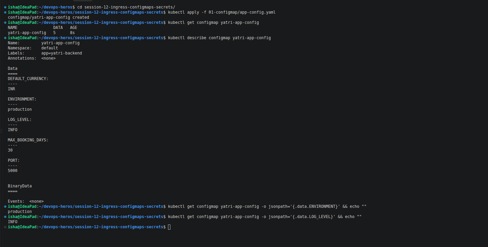
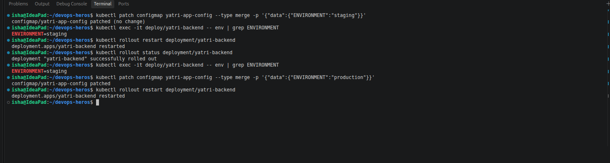
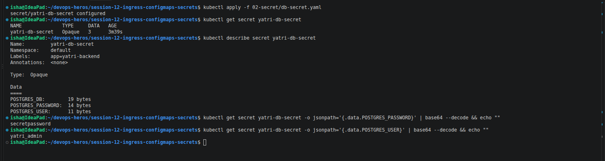
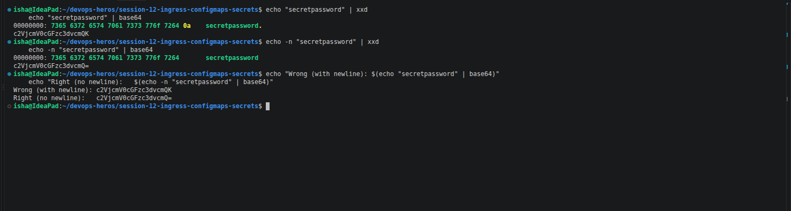
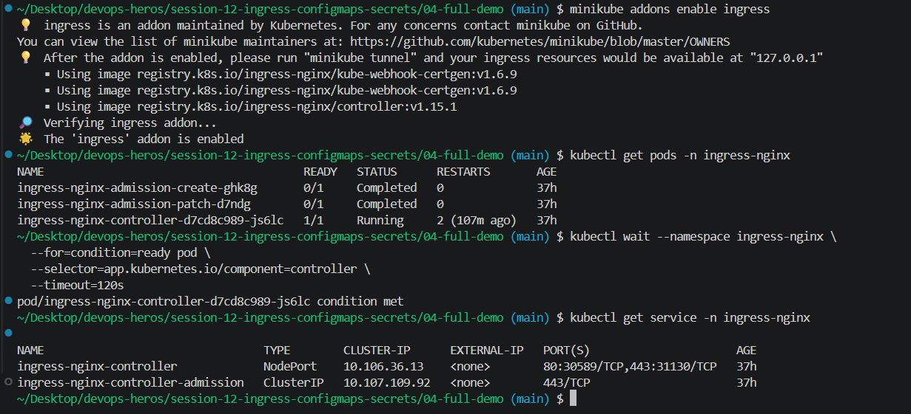

## Ingress and Ingreess controller
**Ingress** is a Kubernetes resource that contains the rules for how external HTTP/HTTPS traffic should reach different Services inside the cluster. For example, it can route `/login` to one Service and `/products` to another Service. **Ingress Controller** is the actual component that reads these Ingress rules and implements them by handling and routing the incoming traffic. In simple words, **Ingress defines the rules, while Ingress Controller applies those rules**. Ingress itself does not handle traffic; an Ingress Controller such as NGINX Ingress Controller is required for it to work.

## Troubleshooting

The issue here was that the PostgreSQL Pod was rejecting the application connection with a `password authentication failed` error even though the developer was sure that the password was correct. The actual problem was caused by the way the password was converted into Base64 before putting it inside the Kubernetes Secret. The developer used `echo "mypassword" | base64`, but normal `echo` automatically adds a newline character (`\n`) at the end of the text. We can see this by running `echo "mypassword" | xxd`, where the last value is `0a`. This `0a` represents the newline character, so the value being encoded is actually `mypassword\n` and not just `mypassword`. When this is Base64 encoded, it produces `bXlwYXNzd29yZAo=`, and the application therefore receives the password with an extra newline character. PostgreSQL treats that newline as part of the password, so `mypassword\n` does not match the actual password `mypassword`, which causes the authentication to fail. The fix is to use `echo -n "mypassword" | base64`, where the `-n` option prevents `echo` from adding the newline. This produces `bXlwYXNzd29yZA==`, which contains only the actual password. So, the important thing to remember is that when manually encoding values for Kubernetes Secrets, `echo -n` should be used to avoid accidentally adding an extra newline character that can cause authentication or configuration problems.