# Task 1: Kubernetes Volumes

**Description:** Document what I learned about `emptyDir`, `hostPath`, PersistentVolume (PV),
PersistentVolumeClaim (PVC), StorageClass and Dynamic Provisioning, with a hands-on lab for each one.
Every output block below is copied from a real run on my cluster, and each one has a matching screenshot.

## Environment

| Item | Value |
| --- | --- |
| Cluster | Single-node **Minikube v1.39.0**, profile `session13` (node name `session13`) |
| Kubernetes | **v1.37.0** |
| Container runtime | **containerd 2.3.4** |
| Driver / Host | Docker driver, macOS arm64 |
| Default StorageClass | `standard` (provisioner `k8s.io/minikube-hostpath`) |

Manifests used in this folder:

| File | What it demonstrates |
| --- | --- |
| `01-emptydir.yaml` | Two containers sharing one `emptyDir` |
| `02-hostpath.yaml` | Pod mounting a directory from the node |
| `03-static-pv-pvc.yaml` | Hand-written PV + PVC + Pod (static provisioning) |
| `04-storageclass-dynamic.yaml` | Custom StorageClass + PVC + Pod (dynamic provisioning) |

---

## Why Do We Need Volumes?

A container's filesystem is **ephemeral**. It is built from the image's read-only layers plus a thin
writable layer that belongs to that one container instance. When the container crashes and is restarted,
or the Pod is deleted, the writable layer is thrown away and everything written to it is lost.

Volumes solve two problems:

1. **Persistence**: keep data beyond the life of a container (or a Pod, or even a node).
2. **Sharing**: let several containers in the same Pod read and write the same files.

```
            Pod
 ┌───────────────────────────┐
 │  Container A  Container B │
 │      │            │       │
 │      └─────┬──────┘       │
 │            ▼              │
 │         Volume  ──────────┼──► backed by: Pod scratch space (emptyDir)
 └───────────────────────────┘               node disk (hostPath)
                                             real storage via PV/PVC (cloud disk, NFS, ...)
```

A volume is declared once under `spec.volumes` and then mounted into each container with
`volumeMounts` (the same volume can sit at a different path in each container).

The volume types covered here go from "dies with the Pod" to "lives independently of Pods":

```
emptyDir  ──►  hostPath  ──►  PersistentVolume + PersistentVolumeClaim  ──►  StorageClass (dynamic)
 Pod-scoped     Node-scoped     Cluster-scoped, decoupled from Pods           PVs created on demand
```

---

## 1. emptyDir

### What it is

An `emptyDir` is an empty directory that the kubelet creates when the Pod is scheduled onto a node.
All containers in the Pod can mount it. It lives exactly **as long as the Pod lives**:

- Survives a **container** restart (the Pod is still there).
- Removed for good when the **Pod** is deleted, evicted or rescheduled.
- Stored on the node's disk by default. `emptyDir: { medium: Memory }` uses tmpfs (RAM) instead,
  and `sizeLimit` caps how big it can grow.

**Typical uses:** scratch space, caches, sorting large data sets, and sharing files between a main
container and a sidecar (for example a log shipper or, as here, a content generator).

### Manifest (`01-emptydir.yaml`)

```yaml
spec:
  containers:
    - name: writer
      image: busybox:1.36
      command: ["/bin/sh", "-c", "while true; do date >> /shared/index.html; sleep 5; done"]
      volumeMounts:
        - name: shared
          mountPath: /shared
    - name: reader
      image: nginx:1.27
      volumeMounts:
        - name: shared
          mountPath: /usr/share/nginx/html
  volumes:
    - name: shared
      emptyDir: {}
```

The `writer` appends a timestamp every 5 seconds to `/shared/index.html`. The `reader` (nginx) mounts the
**same** volume at its web root, so it serves whatever the writer produces.

### Lab 1a: Create the Pod

```bash
kubectl apply -f 01-emptydir.yaml
kubectl wait --for=condition=Ready pod/emptydir-demo --timeout=60s
kubectl get pod emptydir-demo -o wide
```

```text
pod/emptydir-demo created
pod/emptydir-demo condition met
NAME            READY   STATUS    RESTARTS   AGE   IP           NODE        NOMINATED NODE   READINESS GATES
emptydir-demo   2/2     Running   0          1s    10.244.0.5   session13   <none>           <none>
```

`READY 2/2` confirms both containers are running inside the one Pod.

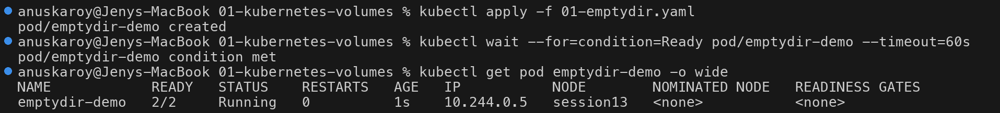

### Lab 1b: Two containers share the same directory

```bash
kubectl exec emptydir-demo -c writer -- cat /shared/index.html
kubectl exec emptydir-demo -c reader -- curl -s localhost
kubectl exec emptydir-demo -c writer -- sh -c 'echo "written by writer" > /shared/marker.txt'
kubectl exec emptydir-demo -c reader -- cat /usr/share/nginx/html/marker.txt
```

```text
$ kubectl exec emptydir-demo -c writer -- cat /shared/index.html
Wed Oct  7 13:52:28 UTC 2026
Wed Oct  7 13:52:33 UTC 2026
Wed Oct  7 13:52:38 UTC 2026
$ kubectl exec emptydir-demo -c reader -- curl -s localhost
Wed Oct  7 13:52:28 UTC 2026
Wed Oct  7 13:52:33 UTC 2026
Wed Oct  7 13:52:38 UTC 2026
$ kubectl exec emptydir-demo -c writer -- sh -c 'echo "written by writer" > /shared/marker.txt'
$ kubectl exec emptydir-demo -c reader -- cat /usr/share/nginx/html/marker.txt
written by writer
```

**What this proves:** the file the writer creates at `/shared/...` shows up instantly in the reader at
`/usr/share/nginx/html/...`. It is one directory mounted at two different paths.

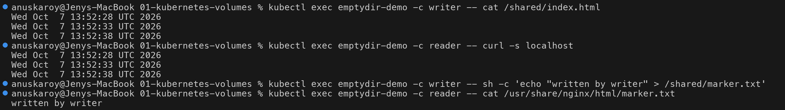

### Lab 1c: Container restart keeps the data

I stopped nginx inside the `reader` container (`nginx -s stop`). The container's main process exited,
so the kubelet restarted **only that container**. The Pod itself was not touched.

```bash
kubectl get pod emptydir-demo
kubectl get pod emptydir-demo -o jsonpath='{.status.containerStatuses[?(@.name=="reader")].lastState.terminated.reason}{"\n"}'
kubectl exec emptydir-demo -c reader -- cat /usr/share/nginx/html/marker.txt
```

```text
$ kubectl get pod emptydir-demo
NAME            READY   STATUS    RESTARTS      AGE
emptydir-demo   2/2     Running   1 (11s ago)   11s
$ kubectl get pod emptydir-demo -o jsonpath='{.status.containerStatuses[?(@.name=="reader")].lastState.terminated.reason}{"\n"}'
Completed
$ kubectl exec emptydir-demo -c reader -- cat /usr/share/nginx/html/marker.txt
written by writer
```

**What this proves:** `RESTARTS 1` and `lastState.terminated.reason: Completed` confirm the reader container
really did exit and come back as a new container instance. `marker.txt` is still there, because an
`emptyDir` belongs to the **Pod** and not to the container.

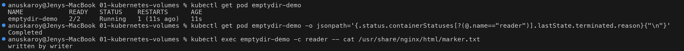

### Lab 1d: Deleting the Pod wipes the data

```bash
kubectl delete pod emptydir-demo
kubectl apply -f 01-emptydir.yaml
kubectl wait --for=condition=Ready pod/emptydir-demo --timeout=60s
kubectl exec emptydir-demo -c writer -- cat /shared/marker.txt
```

```text
pod "emptydir-demo" deleted from default namespace
pod/emptydir-demo created
pod/emptydir-demo condition met
cat: can't open '/shared/marker.txt': No such file or directory
command terminated with exit code 1
```

**What this proves:** the new Pod has the same name, but it is a new object with a new, empty `emptyDir`.
The old directory was deleted along with the old Pod.

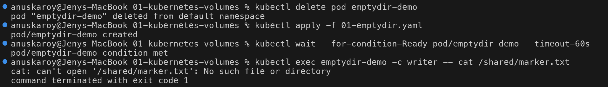

---

## 2. hostPath

### What it is

`hostPath` mounts a file or directory from the **node's own filesystem** into the Pod. The data lives
on the node, outside the Pod, so it survives Pod deletion. It is tied to **that particular node** though.

The `type` field adds a check before mounting:

| `type` | Behaviour |
| --- | --- |
| `""` (default) | No check |
| `DirectoryOrCreate` | Create the directory (mode 0755) if it does not exist (used here) |
| `Directory` | The directory must already exist |
| `FileOrCreate` / `File` | Same idea, for a single file |
| `Socket`, `CharDevice`, `BlockDevice` | Must be an existing socket or device |

### Manifest (`02-hostpath.yaml`)

```yaml
  volumes:
    - name: host-storage
      hostPath:
        path: /tmp/hostpath-data
        type: DirectoryOrCreate
```

### Lab 2a: Write from the Pod, read from the node

```bash
kubectl apply -f 02-hostpath.yaml
kubectl wait --for=condition=Ready pod/hostpath-demo --timeout=60s
kubectl exec hostpath-demo -- sh -c 'echo "saved on the node" > /data/host.txt'
minikube -p session13 ssh -- ls -l /tmp/hostpath-data
minikube -p session13 ssh -- cat /tmp/hostpath-data/host.txt
```

```text
pod/hostpath-demo created
pod/hostpath-demo condition met
total 4
-rw-r--r-- 1 root root 18 Oct  7 13:54 host.txt
saved on the node
```

**What this proves:** a file written to `/data` inside the container is really a file in
`/tmp/hostpath-data` on the Minikube node, which I read with `minikube ssh` without going through Kubernetes.
It is owned by `root` because the container ran as root. That is one reason hostPath needs care.

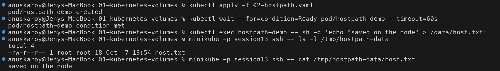

### Lab 2b: Data survives Pod deletion

```bash
kubectl delete pod hostpath-demo --now
kubectl apply -f 02-hostpath.yaml
kubectl wait --for=condition=Ready pod/hostpath-demo --timeout=60s
kubectl exec hostpath-demo -- cat /data/host.txt
```

```text
pod "hostpath-demo" deleted from default namespace
pod/hostpath-demo created
pod/hostpath-demo condition met
saved on the node
```

**What this proves:** unlike `emptyDir`, the file outlives the Pod, because Kubernetes never deletes a
hostPath directory. The new Pod landed on the same node (the only node), so it saw the same data.

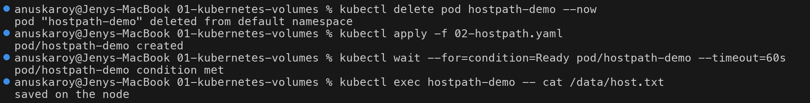

### Caveats: why hostPath is not production storage

- **Node-tied:** on a multi-node cluster a recreated Pod can be scheduled onto a **different node** and
  find an empty or different directory. The data does not follow the Pod. If the node dies, the data goes with it.
- **Security risk:** a Pod can read and write the host filesystem (for example `/var/run/docker.sock`,
  `/etc`, kubelet credentials). Many clusters block it with Pod Security Admission (`baseline` and
  `restricted` profiles disallow hostPath).
- **No capacity management:** there is no size limit and no accounting.
- **Fine for:** single-node labs (Minikube, kind), and node-level agents (DaemonSets for log collectors,
  monitoring and CNI plugins) that are meant to access the node.

---

## 3. PersistentVolume (PV) and PersistentVolumeClaim (PVC): Static Provisioning

### What they are

Kubernetes separates **providing** storage from **consuming** it:

| Object | Who creates it | Scope | What it represents |
| --- | --- | --- | --- |
| **PersistentVolume (PV)** | Cluster admin (static) or a provisioner (dynamic) | Cluster-wide (no namespace) | A real piece of storage: capacity, access modes, reclaim policy, and the backend (hostPath, NFS, EBS, CSI...) |
| **PersistentVolumeClaim (PVC)** | Developer / app | Namespaced | A **request** for storage: "I need 500Mi, ReadWriteOnce, from class X" |
| **Pod** | Developer / app | Namespaced | Refers to the PVC by name (`persistentVolumeClaim.claimName`) and never to the PV directly |

An analogy: the PV is a parking spot, the PVC is the parking ticket, and the Pod uses the ticket.
The Pod does not need to know whether the storage is a local disk, NFS or a cloud disk.

The **PV controller** in kube-controller-manager watches for unbound PVCs and binds each one to a matching PV.
"Matching" means the same `storageClassName`, compatible access modes, and capacity **greater than or equal
to** the request. The binding is **one-to-one and exclusive**: a PV can only be bound to one PVC.

With **static provisioning**, the admin creates PVs ahead of time and claims are matched against that pool.

### Manifest (`03-static-pv-pvc.yaml`)

```yaml
apiVersion: v1
kind: PersistentVolume
metadata:
  name: student-pv
spec:
  capacity:
    storage: 1Gi
  accessModes:
    - ReadWriteOnce
  persistentVolumeReclaimPolicy: Retain
  storageClassName: manual
  hostPath:
    path: /tmp/student-data
---
apiVersion: v1
kind: PersistentVolumeClaim
metadata:
  name: student-pvc
spec:
  storageClassName: manual
  accessModes:
    - ReadWriteOnce
  resources:
    requests:
      storage: 500Mi
---
# Pod storage-demo (nginx) mounts claimName: student-pvc at /data
```

**Why `storageClassName: manual`?** Minikube has a **default** StorageClass (`standard`). A PVC with
no `storageClassName` gets the default class assigned, and the default provisioner would immediately
create a **new** dynamic PV for it and ignore my hand-made PV. Putting the same made-up class name
`manual` on both the PV and the PVC makes them match each other and keeps the dynamic provisioner out.
(`storageClassName: ""` would also disable dynamic provisioning for the claim.)

### Lab 3a: Create PV, PVC and Pod; observe binding

```bash
kubectl apply -f 03-static-pv-pvc.yaml
kubectl wait --for=condition=Ready pod/storage-demo --timeout=60s
kubectl get pv student-pv
kubectl get pvc student-pvc
kubectl get pod storage-demo
```

```text
persistentvolume/student-pv created
persistentvolumeclaim/student-pvc created
pod/storage-demo created
pod/storage-demo condition met
NAME         CAPACITY   ACCESS MODES   RECLAIM POLICY   STATUS   CLAIM                 STORAGECLASS   VOLUMEATTRIBUTESCLASS   REASON   AGE
student-pv   1Gi        RWO            Retain           Bound    default/student-pvc   manual         <unset>                          9s
NAME          STATUS   VOLUME       CAPACITY   ACCESS MODES   STORAGECLASS   VOLUMEATTRIBUTESCLASS   AGE
student-pvc   Bound    student-pv   1Gi        RWO            manual         <unset>                 9s
NAME           READY   STATUS    RESTARTS   AGE
storage-demo   1/1     Running   0          9s
```

**What this proves:**

- PV and PVC are both `Bound` to each other (`CLAIM default/student-pvc` on the PV, `VOLUME student-pv` on the PVC).
- **The PVC asked for 500Mi but shows CAPACITY 1Gi.** A PVC binds to a PV that is *at least* as large
  as the request, and it gets the **whole PV**. The remaining 524Mi cannot be given to anyone else
  because binding is exclusive. Sizing static PVs close to what claims need avoids this waste.

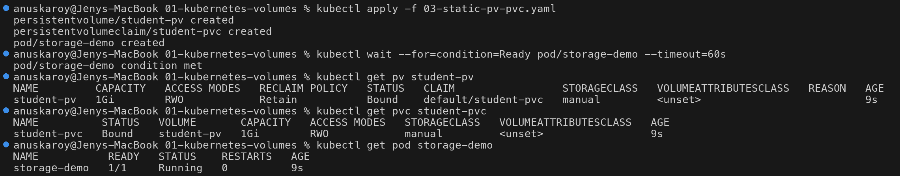

### Lab 3b: Data persists across Pod deletion

```bash
kubectl exec storage-demo -- sh -c 'echo "Kubernetes Storage" > /data/message.txt'
kubectl delete pod storage-demo
kubectl apply -f 03-static-pv-pvc.yaml
kubectl wait --for=condition=Ready pod/storage-demo --timeout=60s
kubectl exec storage-demo -- cat /data/message.txt
```

```text
pod "storage-demo" deleted from default namespace
persistentvolume/student-pv unchanged
persistentvolumeclaim/student-pvc unchanged
pod/storage-demo created
pod/storage-demo condition met
Kubernetes Storage
```

**What this proves:** the PV and PVC are `unchanged`, so only the Pod was recreated. The new Pod mounted
the same claim and found the file. The storage lifecycle is now **independent of the Pod**.

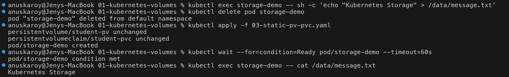

### Lab 3c: Reclaim policy `Retain`: delete the PVC, keep the data

```bash
kubectl delete pod storage-demo
kubectl delete pvc student-pvc
kubectl get pv student-pv
minikube -p session13 ssh -- cat /tmp/student-data/message.txt
```

```text
pod "storage-demo" deleted from default namespace
persistentvolumeclaim "student-pvc" deleted from default namespace
NAME         CAPACITY   ACCESS MODES   RECLAIM POLICY   STATUS     CLAIM                 STORAGECLASS   VOLUMEATTRIBUTESCLASS   REASON   AGE
student-pv   1Gi        RWO            Retain           Released   default/student-pvc   manual         <unset>                          12s
Kubernetes Storage
```

**What this proves:**

- After the claim is deleted, the PV is **not** deleted. It moves to `Released` and still records the old
  claim (`default/student-pvc`).
- The data is still on the node (`/tmp/student-data/message.txt`).
- A `Released` PV is **not** offered to new claims automatically, because it may contain the previous
  owner's data. An admin has to step in: back up or wipe the data, then either delete the PV or remove
  `spec.claimRef` (`kubectl patch pv student-pv -p '{"spec":{"claimRef":null}}'`) to make it `Available` again.

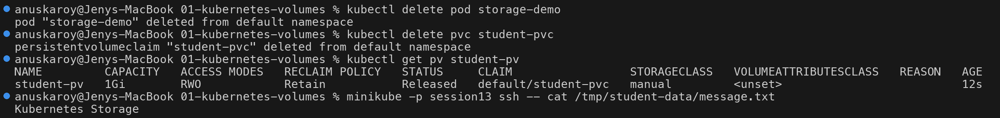

---

## 4. StorageClass

### What it is

Static provisioning does not scale. Someone has to create every PV by hand before anyone can claim it.
A **StorageClass** describes a *kind* of storage (a "tier", such as fast SSD, cheap HDD or replicated) and names a
**provisioner** that can create PVs of that kind **on demand**.

Key fields:

| Field | Meaning |
| --- | --- |
| `provisioner` | Which driver creates the volumes, for example `k8s.io/minikube-hostpath`, `ebs.csi.aws.com`, `pd.csi.storage.gke.io` |
| `parameters` | Driver-specific options (disk type, IOPS, filesystem...) |
| `reclaimPolicy` | Policy stamped on PVs it creates: `Delete` (default) or `Retain` |
| `volumeBindingMode` | `Immediate`: provision and bind as soon as the PVC is created. `WaitForFirstConsumer`: wait until a Pod using the PVC is scheduled, then provision in that Pod's node or zone (avoids "disk in zone A, Pod in zone B" problems). Recommended for topology-aware or local storage. |
| `allowVolumeExpansion` | If `true`, you can grow a bound PVC by editing `spec.resources.requests.storage` |
| Annotation `storageclass.kubernetes.io/is-default-class: "true"` | Marks the **default** class, used by any PVC that omits `storageClassName` |

### Lab 4a: What exists before my lab

```bash
kubectl get storageclass
kubectl get pv
```

```text
NAME                 PROVISIONER                RECLAIMPOLICY   VOLUMEBINDINGMODE   ALLOWVOLUMEEXPANSION   AGE
standard (default)   k8s.io/minikube-hostpath   Delete          Immediate           false                  4m17s
No resources found
```

Minikube ships one class, `standard`, marked `(default)` by the annotation above. Its provisioner is
Minikube's built-in hostPath provisioner (it creates directories under `/tmp/hostpath-provisioner/` on the node).
There are no PVs yet, so everything that follows is created by the provisioner.

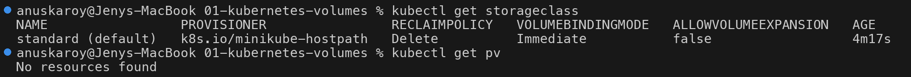

---

## 5. Dynamic Provisioning

### What it is

With **dynamic provisioning** the developer only writes a PVC that names a StorageClass. The provisioner sees
the unbound claim, creates the real storage, creates a matching PV object (named `pvc-<PVC UID>`), and
the PV controller binds them. No admin is involved and no PV YAML is written.

### Manifest (`04-storageclass-dynamic.yaml`)

```yaml
apiVersion: storage.k8s.io/v1
kind: StorageClass
metadata:
  name: fast-local
provisioner: k8s.io/minikube-hostpath
reclaimPolicy: Delete
volumeBindingMode: Immediate
---
apiVersion: v1
kind: PersistentVolumeClaim
metadata:
  name: dynamic-pvc
spec:
  storageClassName: fast-local
  accessModes:
    - ReadWriteOnce
  resources:
    requests:
      storage: 200Mi
---
# Pod dynamic-demo (busybox) mounts claimName: dynamic-pvc at /data
# and writes 'written via dynamic PV' to /data/proof.txt
```

### Lab 5a: PVC in, PV out

```bash
kubectl apply -f 04-storageclass-dynamic.yaml
kubectl wait --for=condition=Ready pod/dynamic-demo --timeout=60s
kubectl get storageclass
kubectl get pvc dynamic-pvc
kubectl get pv
kubectl exec dynamic-demo -- cat /data/proof.txt
```

```text
storageclass.storage.k8s.io/fast-local created
persistentvolumeclaim/dynamic-pvc created
pod/dynamic-demo created
pod/dynamic-demo condition met
NAME                 PROVISIONER                RECLAIMPOLICY   VOLUMEBINDINGMODE   ALLOWVOLUMEEXPANSION   AGE
fast-local           k8s.io/minikube-hostpath   Delete          Immediate           false                  0s
standard (default)   k8s.io/minikube-hostpath   Delete          Immediate           false                  4m18s
NAME          STATUS   VOLUME                                     CAPACITY   ACCESS MODES   STORAGECLASS   VOLUMEATTRIBUTESCLASS   AGE
dynamic-pvc   Bound    pvc-0d29fa77-49ba-4ac1-9930-ea36a2669e2a   200Mi      RWO            fast-local     <unset>                 0s
NAME                                       CAPACITY   ACCESS MODES   RECLAIM POLICY   STATUS   CLAIM                 STORAGECLASS   VOLUMEATTRIBUTESCLASS   REASON   AGE
pvc-0d29fa77-49ba-4ac1-9930-ea36a2669e2a   200Mi      RWO            Delete           Bound    default/dynamic-pvc   fast-local     <unset>                          0s
```

```text
written via dynamic PV
```

**What this proves:**

- I never wrote a PV, yet `kubectl get pv` (empty a moment earlier) now shows
  `pvc-0d29fa77-...`, created by the provisioner and already `Bound` to `default/dynamic-pvc`.
- Unlike the static lab, the capacity is **exactly 200Mi**. The volume was built to the size of the request,
  so nothing is wasted.
- The PV inherited `RECLAIM POLICY Delete` from the StorageClass.
- The Pod wrote to the volume and read the file back.

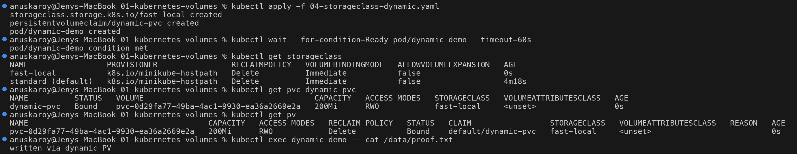

### Lab 5b: Provisioning events

```bash
kubectl describe pvc dynamic-pvc | head -5
kubectl get events --field-selector involvedObject.name=dynamic-pvc -o custom-columns=REASON:.reason,MESSAGE:.message
```

```text
Name:          dynamic-pvc
Namespace:     default
StorageClass:  fast-local
Status:        Bound
Volume:        pvc-c3bef467-4286-4a9e-9532-8c895c4b7f70
REASON                  MESSAGE
ExternalProvisioning    Waiting for a volume to be created either by the external provisioner 'k8s.io/minikube-hostpath' or manually by the system administrator. If volume creation is delayed, please verify that the provisioner is running and correctly registered.
Provisioning            External provisioner is provisioning volume for claim "default/dynamic-pvc"
ProvisioningSucceeded   Successfully provisioned volume pvc-0d29fa77-49ba-4ac1-9930-ea36a2669e2a
Provisioning            External provisioner is provisioning volume for claim "default/dynamic-pvc"
ExternalProvisioning    Waiting for a volume to be created either by the external provisioner 'k8s.io/minikube-hostpath' or manually by the system administrator. If volume creation is delayed, please verify that the provisioner is running and correctly registered.
ProvisioningSucceeded   Successfully provisioned volume pvc-c3bef467-4286-4a9e-9532-8c895c4b7f70
```

The events show the three steps of dynamic provisioning:

1. **ExternalProvisioning**: the PV controller sees that no existing PV matches and hands the claim to the
   external provisioner named in the StorageClass.
2. **Provisioning**: the provisioner (`storage-provisioner` Pod in `kube-system`) starts creating the volume.
3. **ProvisioningSucceeded**: the PV `pvc-<uid>` exists and the claim is bound.

> **Note on the two volume names:** I ran this lab twice with the same PVC name `dynamic-pvc`. Events are
> matched by object *name* and stay around for about an hour, so the list contains both runs. The first run
> got `pvc-0d29fa77-...` (deleted in Lab 5c), and the second run, which `describe` shows as the current volume,
> got `pvc-c3bef467-...`. Each new PVC has a new UID, so each one gets a new PV name.

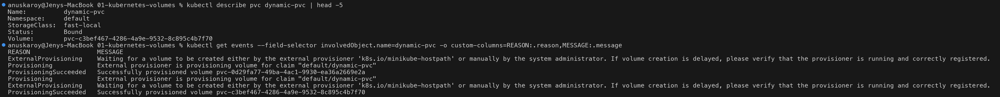

### Lab 5c: Reclaim policy `Delete`: PVC gone, PV gone

```bash
kubectl delete pod dynamic-demo --now
kubectl delete pvc dynamic-pvc
sleep 3; kubectl get pv
```

```text
pod "dynamic-demo" deleted from default namespace
persistentvolumeclaim "dynamic-pvc" deleted from default namespace
No resources found
```

**What this proves:** with `reclaimPolicy: Delete`, deleting the claim makes the provisioner delete the
PV **and the underlying storage** automatically. Compare this with Lab 3c, where `Retain` kept the PV
(`Released`) and the data.

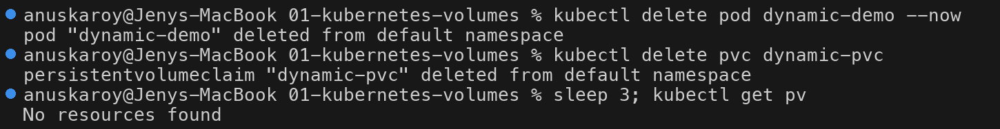

---

## Summary and Comparisons

### Volume types compared

| | emptyDir | hostPath | PV + PVC (static) | PV + PVC (dynamic) |
| --- | --- | --- | --- | --- |
| **Lifetime** | Same as the Pod | Same as the node directory (until someone deletes it) | Independent of Pods, until PV is deleted | Independent of Pods, until PVC is deleted (`Delete` policy) |
| **Scope** | One Pod | One node | Cluster (PV), namespace (PVC) | Cluster (PV), namespace (PVC) |
| **Survives container restart** | Yes (Lab 1c) | Yes | Yes | Yes |
| **Survives Pod delete** | **No** (Lab 1d) | Yes, if rescheduled to the same node (Lab 2b) | Yes (Lab 3b) | Yes |
| **Survives node failure** | No | No | Depends on backend (network/cloud disk: yes; hostPath/local: no) | Depends on backend |
| **Who sets it up** | Pod author | Pod author | Admin creates PV, dev creates PVC | Admin creates StorageClass once, dev creates PVC |
| **Typical use** | Scratch, cache, sidecar sharing | Node agents (DaemonSets), single-node labs | Pre-existing disks/NFS shares, migrated data | Default for stateful apps (databases, queues) in real clusters |

### Access modes

| Mode | Short | Meaning |
| --- | --- | --- |
| `ReadWriteOnce` | **RWO** | Read-write by **one node** (several Pods on that same node can still share it). Most block storage (EBS, PD, Azure Disk). Used in all my labs. |
| `ReadOnlyMany` | **ROX** | Read-only by many nodes |
| `ReadWriteMany` | **RWX** | Read-write by many nodes. Needs shared/file storage (NFS, CephFS, EFS, Azure Files) |
| `ReadWriteOncePod` | **RWOP** | Read-write by **exactly one Pod** in the whole cluster (CSI volumes only, GA since v1.29) |

Access modes describe what the volume *supports* and are used for matching. They are not a lock on the
data inside the filesystem. A PVC only binds to a PV that offers the requested mode.

### Reclaim policies

| Policy | On PVC deletion | Proven in | Use when |
| --- | --- | --- | --- |
| **Retain** | PV goes to `Released`, data kept; admin must clean up and reclaim by hand | Lab 3c (`STATUS Released`, file still on node) | Data is valuable; you want a human to decide (production databases) |
| **Delete** | PV object **and** backing storage deleted automatically | Lab 5c (`No resources found`) | Disposable or easily recreated data; default for dynamic classes |
| ~~Recycle~~ | (`rm -rf` then reuse) | n/a | **Deprecated**; use dynamic provisioning instead |

> You can change the policy of an existing PV, for example to protect a dynamically provisioned volume:
> `kubectl patch pv <name> -p '{"spec":{"persistentVolumeReclaimPolicy":"Retain"}}'`

### PV lifecycle

```
            create PV (static)              PVC deleted
            or provisioner (dynamic)        (policy = Retain)
                   │                              │
                   ▼                              ▼
             ┌───────────┐  PVC matches    ┌──────────┐   ┌──────────┐
             │ Available │ ──────────────► │  Bound   │──►│ Released │──► admin cleans up:
             └───────────┘                 └──────────┘   └──────────┘    delete PV, or clear claimRef
                   ▲                              │                         → Available again
                   │                              │ PVC deleted
                   └─────── claimRef cleared ─────┤ (policy = Delete)
                                                  ▼
                                         PV + storage deleted

             (Failed = automatic reclamation failed)
```

Observed in my labs: `Bound` (Lab 3a, 5a) → `Released` (Lab 3c, Retain) and `Bound` → deleted (Lab 5c, Delete).

### Static vs dynamic provisioning

```
STATIC PROVISIONING                              DYNAMIC PROVISIONING
(Lab 3: student-pv / student-pvc)                (Lab 5: fast-local / dynamic-pvc)

 Admin                                            Admin (once)
   │ writes PV YAML (1Gi, class=manual)             │ writes StorageClass (provisioner, reclaimPolicy)
   ▼                                                ▼
 ┌──────────┐                                     ┌──────────────┐
 │    PV    │ Available                           │ StorageClass │
 └────▲─────┘                                     └──────┬───────┘
      │ PV controller binds                              │ referenced by
      │ (class + mode + size ≥ request)                  │
 ┌────┴─────┐                                     ┌──────┴──────┐  provisioner   ┌──────────────┐
 │   PVC    │ 500Mi, class=manual                 │     PVC     │ ─────────────► │ PV pvc-<uid> │
 └────▲─────┘                                     └──────▲──────┘  creates PV    │ exactly 200Mi│
      │ claimName                                        │ claimName  + storage  └──────────────┘
 ┌────┴─────┐                                     ┌──────┴──────┐
 │   Pod    │                                     │     Pod     │
 └──────────┘                                     └─────────────┘

 + full control over each volume                  + self-service, no pre-created pool
 - manual work, pool must exist in advance        + volume sized exactly to the request
 - PVC gets whole PV (500Mi asked → 1Gi bound)    - needs a provisioner/CSI driver in the cluster
```

### Key takeaways

1. The container filesystem is ephemeral. Anything important must go on a volume.
2. `emptyDir` survives container restarts, not Pod deletion. It is good for sharing and scratch space.
3. `hostPath` survives Pod deletion but is tied to one node and is a security risk. Use it in labs and DaemonSets only.
4. PV/PVC separate **who provides** storage from **who uses** it. Pods only know the claim name.
5. A PVC binds to a whole PV that is at least as big as the request, and the binding is exclusive.
6. StorageClass plus a provisioner removes the manual PV step. This is how storage works in real clusters.
7. `reclaimPolicy` decides what happens to data when the claim goes away: `Retain` keeps it, `Delete` removes it.

---

## Cleanup

```bash
kubectl delete -f 01-emptydir.yaml --ignore-not-found
kubectl delete -f 02-hostpath.yaml --ignore-not-found
kubectl delete -f 03-static-pv-pvc.yaml --ignore-not-found      # PV is Retain: data stays on the node
kubectl delete -f 04-storageclass-dynamic.yaml --ignore-not-found

# hostPath / Retain data is never removed by Kubernetes - clean the node by hand
minikube -p session13 ssh -- sudo rm -rf /tmp/hostpath-data /tmp/student-data
```

## Useful Commands

```bash
kubectl get pv,pvc                          # volumes and claims with status
kubectl get storageclass                    # classes; "(default)" marks the default one
kubectl describe pvc <name>                 # binding details + provisioning events
kubectl describe pv <name>                  # backend source, claimRef, reclaim policy
kubectl get events --field-selector involvedObject.name=<pvc>
kubectl explain pv.spec                     # field docs (also: pvc.spec, storageclass)
kubectl patch pv <name> -p '{"spec":{"persistentVolumeReclaimPolicy":"Retain"}}'
kubectl patch pv <name> -p '{"spec":{"claimRef":null}}'                       # Released -> Available
kubectl patch storageclass <name> -p '{"metadata":{"annotations":{"storageclass.kubernetes.io/is-default-class":"true"}}}'
minikube -p session13 ssh -- ls -l /tmp/hostpath-provisioner/default       # where minikube's dynamic PVs live
```

## References

- Volumes: https://kubernetes.io/docs/concepts/storage/volumes/
- Ephemeral Volumes: https://kubernetes.io/docs/concepts/storage/ephemeral-volumes/
- Persistent Volumes: https://kubernetes.io/docs/concepts/storage/persistent-volumes/
- Storage Classes: https://kubernetes.io/docs/concepts/storage/storage-classes/
- Dynamic Volume Provisioning: https://kubernetes.io/docs/concepts/storage/dynamic-provisioning/
- Configure a Pod to Use a PersistentVolume: https://kubernetes.io/docs/tasks/configure-pod-container/configure-persistent-volume-storage/
- Change the Reclaim Policy of a PersistentVolume: https://kubernetes.io/docs/tasks/administer-cluster/change-pv-reclaim-policy/
- Minikube persistent volumes: https://minikube.sigs.k8s.io/docs/handbook/persistent_volumes/
