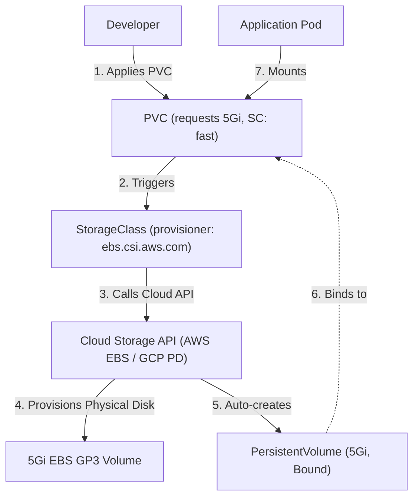

# Kubernetes Volumes: Comprehensive Storage Architecture Guide

## Overview

Kubernetes containers are ephemeral by default: if a container crashes or is restarted by kubelet, all files written inside its root filesystem are completely lost. To solve this problem for production workloads, Kubernetes provides a layered storage subsystem ranging from temporary scratch volumes to dynamically provisioned cloud block storage.

This guide documents what I learned about each volume type, their lifecycle, access modes, and real-world examples.

---

## 1. `emptyDir`

### What is `emptyDir`?
An `emptyDir` volume is created when a Pod is assigned to a node and exists as long as that Pod is running on that node. As the name says, it is initially empty. All containers in the Pod can read and write the same files in the `emptyDir` volume.

### Key Characteristics
- **Lifecycle:** Tied strictly to the **Pod lifecycle**. If the Pod is deleted or rescheduled to another node, the `emptyDir` data is permanently erased.
- **Container Survives Crashes:** If a container inside the Pod crashes, files in `emptyDir` survive the container restart.
- **Storage Medium:** By default stored on the node's disk (SSD/HDD), but can also be configured as a RAM-backed tmpfs (`medium: Memory`) for ultra-fast transient storage.

### Practical Example: Sidecar Log Processing
```yaml
apiVersion: v1
kind: Pod
metadata:
  name: emptydir-demo
spec:
  containers:
    - name: writer
      image: busybox:1.36
      command: ["sh", "-c", "while true; do echo $(date) >> /shared/log.txt; sleep 2; done"]
      volumeMounts:
        - name: shared-storage
          mountPath: /shared
    - name: reader
      image: busybox:1.36
      command: ["sh", "-c", "tail -f /shared/log.txt"]
      volumeMounts:
        - name: shared-storage
          mountPath: /shared
  volumes:
    - name: shared-storage
      emptyDir: {}
```

### When to Use:
- Scratch space for batch jobs (e.g. video transcode buffer, disk-based merge sort).
- Checkpointing long-running computations.
- Sharing data between primary app and sidecar containers in the same Pod.

---

## 2. `hostPath`

### What is `hostPath`?
A `hostPath` volume mounts a file or directory from the **host node's filesystem** directly into your Pod.

### Key Characteristics
- **Lifecycle:** Outlives the Pod on that specific node. If the Pod dies and is recreated on the *same node*, the data is still there.
- **Node-Locked:** If the Pod gets rescheduled to a *different node*, it will not see the data from the previous node.
- **Security Warning:** Presents significant security risks because a Pod can read or write host system files (e.g., Docker socket `/var/run/docker.sock` or `/etc`). Usually restricted in production via Admission Controllers (Pod Security Standards).

### Practical Example: Node System Monitoring
```yaml
apiVersion: v1
kind: Pod
metadata:
  name: hostpath-demo
spec:
  containers:
    - name: node-log-reader
      image: busybox:1.36
      command: ["sh", "-c", "ls -la /host-logs; sleep 3600"]
      volumeMounts:
        - name: system-logs
          mountPath: /host-logs
          readOnly: true
  volumes:
    - name: system-logs
      hostPath:
        path: /var/log
        type: Directory
```

### When to Use:
- DaemonSets requiring host node telemetry (e.g., Fluentd reading `/var/log` or cAdvisor).
- Developer clusters (like Minikube) where local directories are mounted into pods for quick testing.

---

## 3. PersistentVolume (PV)

### What is a PersistentVolume?
A `PersistentVolume` (PV) is a piece of storage in the cluster that has been provisioned by an administrator or dynamically provisioned using a StorageClass. It is a cluster-level resource, like a Node, with a lifecycle completely independent of any individual Pod.

### Key Attributes
- **Capacity:** Storage size (e.g. `5Gi`).
- **Access Modes:**
  - `ReadWriteOnce` (RWO): Can be mounted as read-write by a single node.
  - `ReadOnlyMany` (ROX): Can be mounted read-only by many nodes.
  - `ReadWriteMany` (RWX): Can be mounted as read-write by many nodes (NFS, AWS EFS).
  - `ReadWriteOncePod` (RWOP): Can be mounted as read-write by a single Pod.
- **PersistentVolume Reclaim Policy:**
  - `Retain`: Manual reclamation; keeps data when PVC is deleted.
  - `Delete`: Automatically deletes the storage asset when PVC is deleted.
  - `Recycle`: Basic scrub (`rm -rf /volume/*`) - deprecated.

### Practical Example: Static PV (`pv.yaml`)
```yaml
apiVersion: v1
kind: PersistentVolume
metadata:
  name: local-pv
  labels:
    type: local
spec:
  capacity:
    storage: 1Gi
  accessModes:
    - ReadWriteOnce
  persistentVolumeReclaimPolicy: Retain
  hostPath:
    path: /mnt/data
```

---

## 4. PersistentVolumeClaim (PVC)

### What is a PersistentVolumeClaim?
A `PersistentVolumeClaim` (PVC) is a request for storage by a user. It is similar to a Pod: Pods consume node CPU and memory resources; PVCs consume PV storage resources.

- A developer doesn't need to know the underlying cloud storage details (EBS volume ID, Ceph pool, or NFS IP).
- The developer only specifies: *"I need 500Mi of ReadWriteOnce storage."*
- The Kubernetes control plane matches the PVC to a suitable PV and **binds** them.

### Practical Example: PVC Manifest (`pvc.yaml`)
```yaml
apiVersion: v1
kind: PersistentVolumeClaim
metadata:
  name: task-pv-claim
spec:
  accessModes:
    - ReadWriteOnce
  resources:
    requests:
      storage: 500Mi
```

### Pod Consuming the PVC
```yaml
apiVersion: v1
kind: Pod
metadata:
  name: pv-pod
spec:
  containers:
    - name: web
      image: nginx:1.27
      volumeMounts:
        - mountPath: "/usr/share/nginx/html"
          name: task-pv-storage
  volumes:
    - name: task-pv-storage
      persistentVolumeClaim:
        claimName: task-pv-claim
```

---

## 5. StorageClass (SC)

### What is a StorageClass?
A `StorageClass` provides a way for administrators to describe the "classes" of storage they offer. Different classes might map to quality-of-service levels (e.g., `fast-ssd` vs `standard-hdd`), backup policies, or arbitrary storage policies.

### Important Fields
- **`provisioner`:** Determines what volume plugin is used for provisioning (e.g., `ebs.csi.aws.com`, `pd.csi.storage.gke.io`, `k8s.io/minikube-hostpath`).
- **`volumeBindingMode`:**
  - `Immediate`: Volume is provisioned as soon as the PVC is created.
  - `WaitForFirstConsumer`: Volume provisioning is delayed until a Pod using the PVC is scheduled. This guarantees the volume is provisioned in the same availability zone as the scheduled Pod!
- **`allowVolumeExpansion`:** Allows resizing the PVC without restarting the cluster.

### Practical Example: StorageClass (`storageclass.yaml`)
```yaml
apiVersion: storage.k8s.io/v1
kind: StorageClass
metadata:
  name: fast-storage
provisioner: k8s.io/minikube-hostpath
reclaimPolicy: Delete
volumeBindingMode: Immediate
allowVolumeExpansion: true
```

---

## 6. Dynamic Provisioning

### The Static vs Dynamic Paradigm
- **Static Provisioning (Old Way):** Cluster admins manually create 50 PVs of varying sizes. Developers submit PVCs hoping one matches. If no matching PV exists, the PVC stays in `Pending`.
- **Dynamic Provisioning (Modern Cloud-Native Way):** When a developer creates a PVC specifying a `storageClassName`, the StorageClass's CSI driver automatically contacts the cloud provider API (AWS, GCP, Azure), creates the physical disk, creates the PV object, and binds it to the PVC in seconds!



### Practical Example: Dynamic PVC (`dynamic-pvc.yaml`)
```yaml
apiVersion: v1
kind: PersistentVolumeClaim
metadata:
  name: dynamic-claim
spec:
  accessModes:
    - ReadWriteOnce
  storageClassName: fast-storage
  resources:
    requests:
      storage: 1Gi
```

When applied:
```bash
kubectl apply -f dynamic-pvc.yaml
kubectl get pvc dynamic-claim
# STATUS immediately transitions to Bound with auto-generated PV name: pvc-xxxx
```

---

## Storage Types Comparison Matrix

| Storage Type | Scope | Lifecycle | Multi-Pod Shared? | Cloud Dynamic Provisioning? | Primary Use Case |
| :--- | :--- | :--- | :--- | :--- | :--- |
| **`emptyDir`** | Pod | Dies with Pod | Only within same Pod | No | Scratch buffer, cache, sidecar log tailing |
| **`hostPath`** | Node | Survives Pod, dies with Node | Yes (on same node) | No | System agents, reading Docker/system logs |
| **`PV / PVC (Static)`** | Cluster | Independent of Pod | Depends on AccessMode | No (Manual admin setup) | Legacy on-prem setups, manual storage control |
| **`StorageClass (Dynamic)`** | Cluster / Cloud | Independent of Pod | Depends on AccessMode (RWO/RWX) | **Yes (Automatic on-demand)** | Production databases, stateful microservices |
