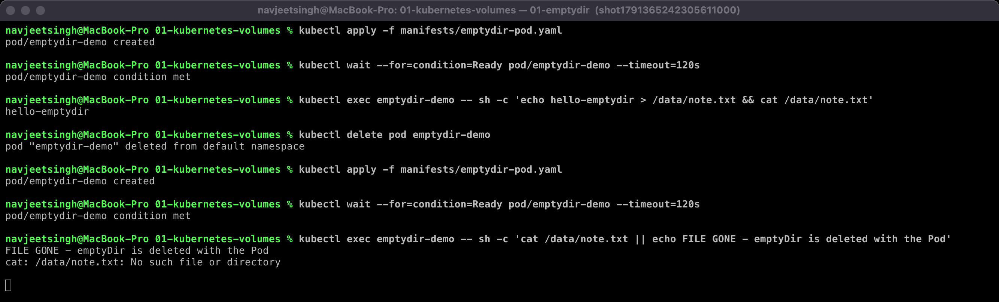
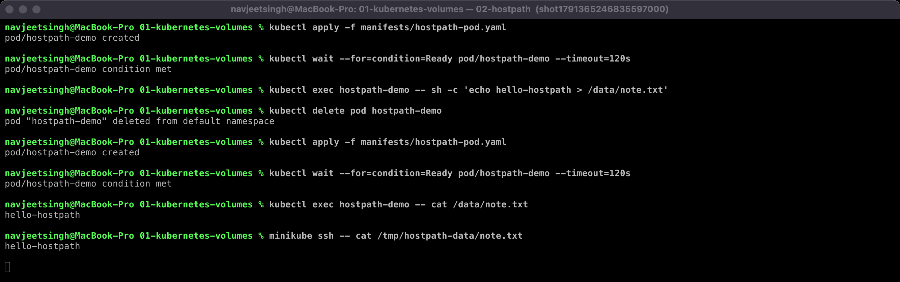
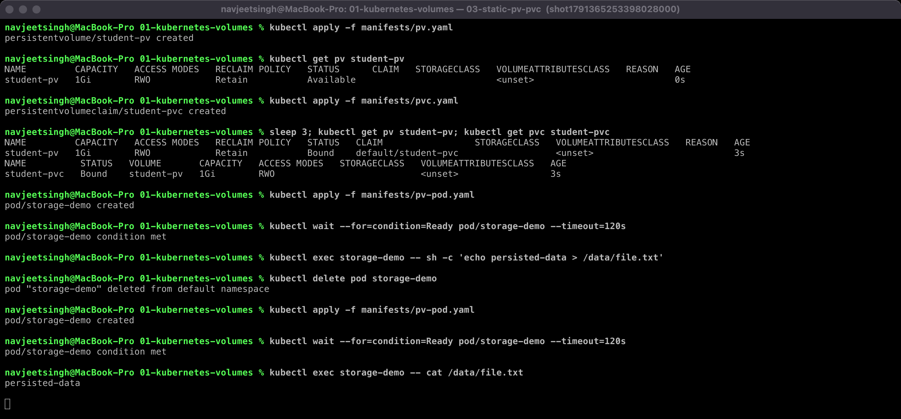
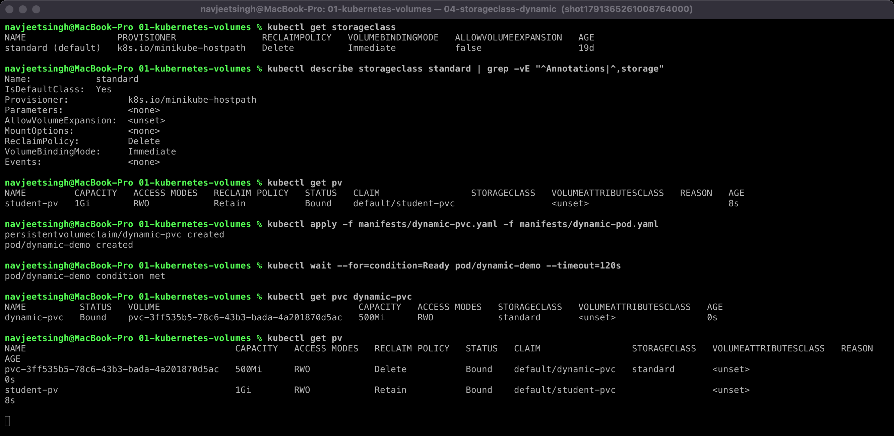

# Session 13 — Task 1: Kubernetes Volumes

Containers are ephemeral: when a container restarts, everything it wrote to its own filesystem is gone. **Volumes** give a Pod storage that lives outside the container image. Kubernetes offers several kinds, and they differ mainly in *how long the data lives*.

| Type | Lifetime of data | Where it lives | Typical use |
|---|---|---|---|
| `emptyDir` | As long as the **Pod** exists | Node disk (or RAM with `medium: Memory`) | Scratch space, cache, sharing files between containers in one Pod |
| `hostPath` | As long as the **node** keeps the directory | A directory on the node | Node agents (log collectors, monitoring), single-node labs |
| PersistentVolume (PV) | Independent of Pods — governed by `reclaimPolicy` | Cluster storage (disk, NFS, EBS, …) | Databases, uploads, anything that must survive Pod deletion |
| PersistentVolumeClaim (PVC) | A *request* for a PV, bound 1:1 | — | What the Pod actually references |
| StorageClass | — | — | Describes a "kind" of storage and the provisioner that creates PVs on demand |

All examples below were run on a local minikube cluster (Docker driver). Manifests are in [`manifests/`](manifests/). Each practical test has a real terminal screenshot in [`outputs/`](outputs/).

---

## 1. emptyDir

An `emptyDir` is created empty when the Pod is scheduled and **deleted when the Pod is removed**. It survives container restarts inside the same Pod, but not Pod deletion.

```yaml
volumes:
  - name: app-storage
    emptyDir: {}          # or: emptyDir: { medium: Memory, sizeLimit: 64Mi }
```

**Practical test** (screenshot below) — write a file, delete the Pod, recreate it:

```text
$ kubectl exec emptydir-demo -- sh -c 'echo hello-emptydir > /data/note.txt && cat /data/note.txt'
hello-emptydir
$ kubectl delete pod emptydir-demo
$ kubectl apply -f manifests/emptydir-pod.yaml
$ kubectl exec emptydir-demo -- sh -c 'cat /data/note.txt || echo FILE GONE - emptyDir is deleted with the Pod'
cat: /data/note.txt: No such file or directory
FILE GONE - emptyDir is deleted with the Pod
```



**Learned:** emptyDir is temporary, Pod-scoped storage. Good for sidecar patterns (one container writes logs, another ships them) — never for data you need to keep.

---

## 2. hostPath

`hostPath` mounts a directory from the **node's** filesystem into the Pod.

```yaml
volumes:
  - name: host-storage
    hostPath:
      path: /tmp/hostpath-data
      type: DirectoryOrCreate
```

**Practical test** (screenshot below):

```text
$ kubectl exec hostpath-demo -- sh -c 'echo hello-hostpath > /data/note.txt'
$ kubectl delete pod hostpath-demo
$ kubectl apply -f manifests/hostpath-pod.yaml
$ kubectl exec hostpath-demo -- cat /data/note.txt
hello-hostpath
$ minikube ssh -- cat /tmp/hostpath-data/note.txt     # the file is really on the node
hello-hostpath
```



**Learned:** data survives Pod deletion, but it is tied to **one node**. On a multi-node cluster a rescheduled Pod may land on another node and see an empty directory. hostPath also gives the Pod access to the node filesystem, which is a security risk — use it for node-level agents (DaemonSets), not for application data.

---

## 3. PersistentVolume + PersistentVolumeClaim (static provisioning)

Kubernetes separates storage into two objects:

- **PersistentVolume (PV)** — a piece of storage in the cluster, created by an admin (or by a provisioner). It is a cluster-scoped resource with a capacity, access modes and a reclaim policy.
- **PersistentVolumeClaim (PVC)** — a namespaced *request* from a user: "I need 500Mi, ReadWriteOnce". Kubernetes finds a matching PV and **binds** them 1:1. Pods reference the PVC, never the PV directly.

```yaml
# pv.yaml                                 # pvc.yaml
kind: PersistentVolume                     kind: PersistentVolumeClaim
spec:                                      spec:
  capacity: { storage: 1Gi }                 storageClassName: ""
  accessModes: [ReadWriteOnce]               accessModes: [ReadWriteOnce]
  persistentVolumeReclaimPolicy: Retain      resources:
  storageClassName: ""                         requests: { storage: 500Mi }
  hostPath: { path: /tmp/student-data }
```

> **Gotcha found while doing this lab:** the original `02-persistent-storage/pvc.yaml` has no `storageClassName`. On minikube that means "use the default StorageClass", so the claim gets a *new dynamically-provisioned* volume and `student-pv` stays `Available` forever. Setting `storageClassName: ""` on both PV and PVC forces static binding.

**Access modes:** `ReadWriteOnce` (RWO, one node read-write), `ReadOnlyMany` (ROX), `ReadWriteMany` (RWX, many nodes — needs NFS/EFS-type storage), `ReadWriteOncePod` (exactly one Pod).

**Reclaim policies:** `Retain` (PV and data kept after PVC deletion, admin cleans up), `Delete` (backing storage deleted with the PVC — the default for dynamic volumes).

**Practical test** (screenshot below):

```text
$ kubectl get pv student-pv
NAME         CAPACITY   ACCESS MODES   RECLAIM POLICY   STATUS      CLAIM
student-pv   1Gi        RWO            Retain           Available
$ kubectl apply -f manifests/pvc.yaml
$ kubectl get pv student-pv; kubectl get pvc student-pvc
student-pv    1Gi   RWO   Retain   Bound   default/student-pvc
student-pvc   Bound    student-pv   1Gi   RWO
$ kubectl exec storage-demo -- sh -c 'echo persisted-data > /data/file.txt'
$ kubectl delete pod storage-demo && kubectl apply -f manifests/pv-pod.yaml
$ kubectl exec storage-demo -- cat /data/file.txt
persisted-data
```



Note the PVC asked for 500Mi but got the whole 1Gi PV — binding picks a PV that is *at least* as large as the request.

---

## 4. StorageClass and dynamic provisioning

Creating PVs by hand doesn't scale. A **StorageClass** names a type of storage and the **provisioner** that can create it (`ebs.csi.aws.com` on AWS, `pd.csi.storage.gke.io` on GKE, `k8s.io/minikube-hostpath` on minikube). When a PVC references a StorageClass, the provisioner **creates a matching PV automatically** — this is *dynamic provisioning*.

```yaml
kind: PersistentVolumeClaim
spec:
  storageClassName: standard
  accessModes: [ReadWriteOnce]
  resources: { requests: { storage: 500Mi } }
```

Important StorageClass fields: `provisioner`, `parameters` (e.g. EBS `type: gp3`), `reclaimPolicy`, `volumeBindingMode` (`Immediate` vs `WaitForFirstConsumer` — the latter waits until a Pod is scheduled so the disk is created in the right zone), `allowVolumeExpansion`.

**Practical test** (screenshot below):

```text
$ kubectl get storageclass
NAME                 PROVISIONER                RECLAIMPOLICY   VOLUMEBINDINGMODE
standard (default)   k8s.io/minikube-hostpath   Delete          Immediate
$ kubectl apply -f manifests/dynamic-pvc.yaml -f manifests/dynamic-pod.yaml
$ kubectl get pvc dynamic-pvc
dynamic-pvc   Bound    pvc-3ff535b5-78c6-43b3-bada-4a201870d5ac   500Mi   RWO   standard
$ kubectl get pv
pvc-3ff535b5...   500Mi   RWO   Delete   Bound   default/dynamic-pvc   standard     <- created automatically
student-pv         1Gi     RWO   Retain   Bound   default/student-pvc               <- created by hand
```



The dynamic PV is exactly the requested size and has `Delete` reclaim policy (inherited from the StorageClass), so deleting the PVC also deletes the volume.

---

## Summary

```text
Pod ──mounts──> PVC ──binds──> PV ──backed by──> real storage
                 │                ▲
                 └─ storageClassName ─> StorageClass ─ provisioner creates PV (dynamic)
```

- Use **emptyDir** for scratch data, **hostPath** only for node agents, and **PVC + StorageClass** for application data.
- In real clusters you almost never write PVs by hand — you write PVCs and let the StorageClass provision.
- For stateful apps with one volume per replica, use a **StatefulSet** with `volumeClaimTemplates`.
