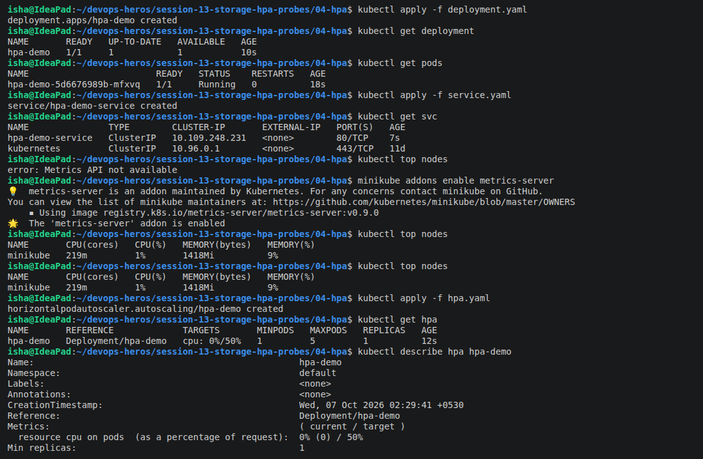
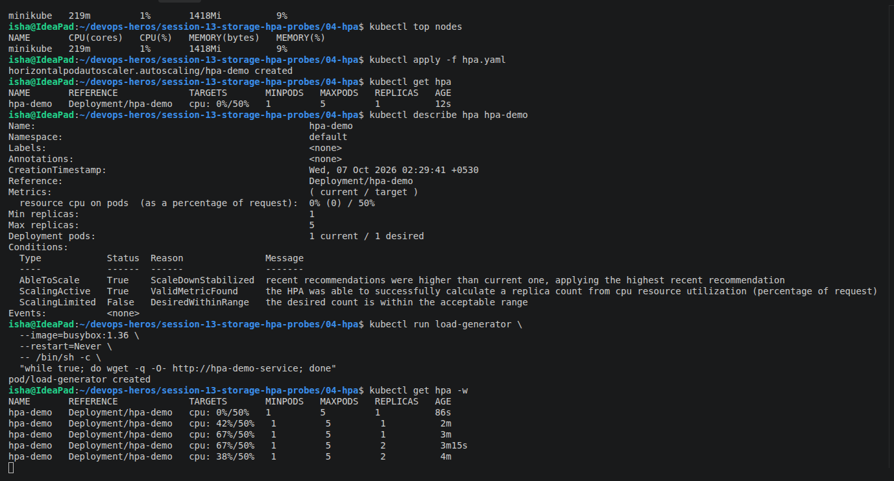
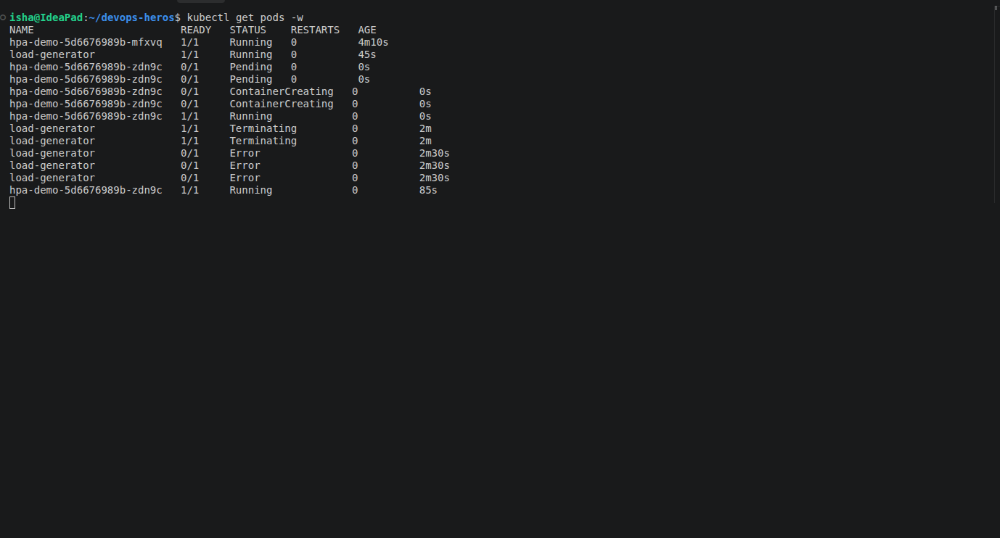
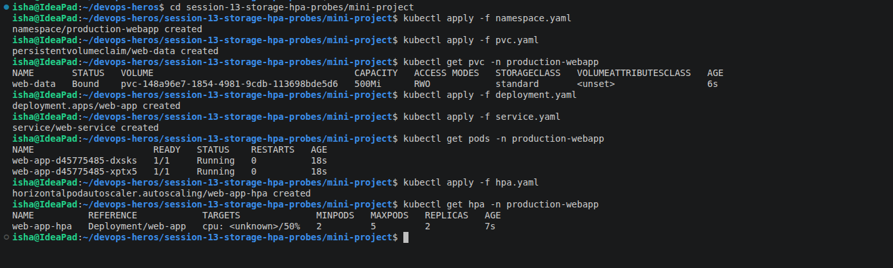
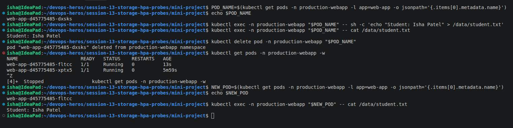
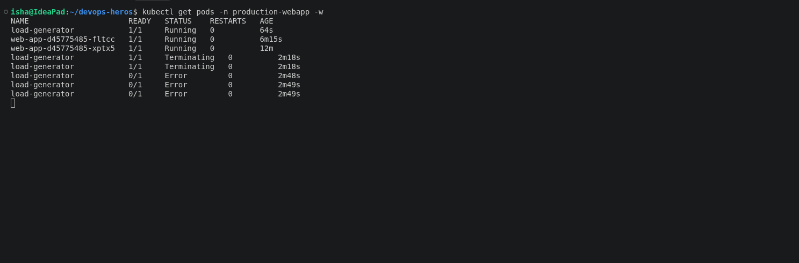
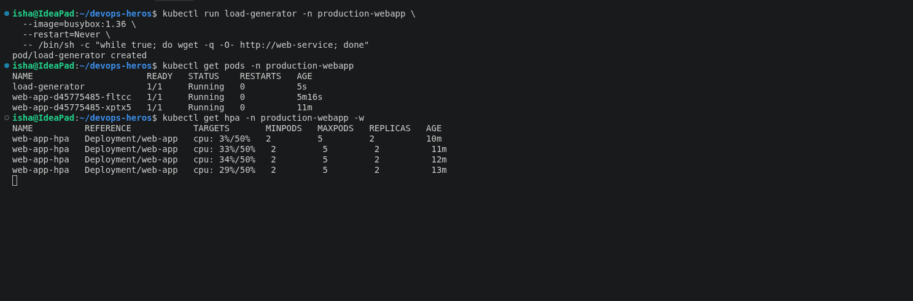
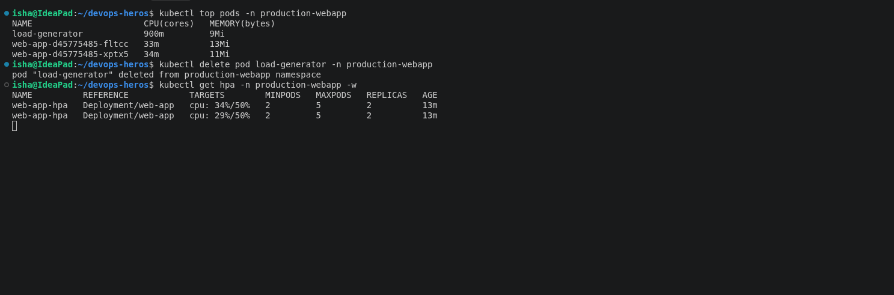

# TASK-1

## 1. Kubernetes Storage Abstractions Overview

In a containerized environment, containers are inherently transient (ephemeral). If a container crashes or is deleted, any data written to its local filesystem is lost. To address this, Kubernetes introduces several storage concepts to persist data beyond container restarts and Pod lifecycles.

```text
       ┌─────────────────────────── Kubernetes Storage ───────────────────────────┐
       │                                                                          │
 ┌─────┴─────┐                                                              ┌─────┴─────┐
 │ Ephemeral │                                                              │Persistent │
 └─────┬─────┘                                                              └─────┬─────┘
       ├─ emptyDir (Pod-bound)                                                    ├─ PersistentVolume (PV)
       └─ hostPath (Node-bound)                                                   ├─ PersistentVolumeClaim (PVC)
                                                                                  ├─ StorageClass (SC)
                                                                                  └─ Dynamic Provisioning (Automated)
```

---

## 2. Ephemeral Volume Types

### A. `emptyDir`
An `emptyDir` volume is created when a Pod is assigned to a Node, and it exists as long as that Pod is running on that node. As the name says, it is initially empty. All containers in the Pod can read and write the same files in the `emptyDir` volume, though that volume can be mounted at the same or different paths in each container.

#### Key Characteristics:
* **Ephemeral:** When a Pod is removed from a node for any reason, the data in the `emptyDir` is erased permanently. However, container crashes do **not** delete the data (since the Pod itself survives).
* **High Performance:** Often stored on the node's medium (e.g., SSD, HDD) or configured to use RAM (tmpfs) by setting `emptyDir.medium` to `"Memory"`.
* **Common Use Cases:**
  * Scratch space/temporary disk cache (e.g., sorting algorithms, build outputs).
  * Checkpointing or long-computation recovery.
  * Sidecar container data sharing (e.g., web server container serving files fetched/generated by a helper/git-sync container).

#### Practical Example (`emptydir-pod.yaml`):
```yaml
apiVersion: v1
kind: Pod
metadata:
  name: emptydir-demo
spec:
  containers:
    - name: app
      image: nginx:1.27
      volumeMounts:
        - name: app-storage
          mountPath: /data
  volumes:
    - name: app-storage
      emptyDir: {}
```

---

### B. `hostPath`
A `hostPath` volume mounts a file or directory from the host node's filesystem directly into your Pod. 

#### Key Characteristics:
* **Node-locked:** If the Pod is rescheduled to another node, it will access the directory of the new node, meaning the previous node's data is inaccessible to it.
* **Types of hostPath:**
  * `DirectoryOrCreate`: If nothing exists at the given path, an empty directory will be created with permissions set to `0755`.
  * `Directory`: A directory must exist at the given path.
  * `FileOrCreate`: If nothing exists at the given path, an empty file will be created.
  * `File`: A file must exist at the given path.
* **Security & Production Warning:** `hostPath` presents severe security risks (a Pod can access or modify node directories) and breaks cluster portability. It should **never** be used as a general-purpose persistent storage mechanism in production.
* **Common Use Cases:**
  * Running node-level agents (like Fluentd, Prometheus, or directory monitoring agents) that need access to node internals (e.g., `/var/log`).
  * Running system pods (like ingress-nginx or local development databases on single-node Minikube clusters).

#### Practical Example (`hostpath-pod.yaml`):
```yaml
apiVersion: v1
kind: Pod
metadata:
  name: hostpath-demo
spec:
  containers:
    - name: app
      image: nginx:1.27
      volumeMounts:
        - name: host-storage
          mountPath: /data
  volumes:
    - name: host-storage
      hostPath:
        path: /tmp/hostpath-data
        type: DirectoryOrCreate
```

---

## 3. Persistent Storage Abstractions

To achieve true persistence independent of both Container and Pod lifecycles, Kubernetes separates storage *provisioning* from storage *consumption* using **PersistentVolumes** and **PersistentVolumeClaims**.

```text
Physical Storage (Cloud Disk, NFS, local disk, etc.)
               │
               ▼
      PersistentVolume (PV)  <─── (Admin-provisioned or StorageClass-provisioned resource)
               ▲
               │ (Bound)
               ▼
  PersistentVolumeClaim (PVC) <─── (User request for storage)
               ▲
               │ (Mounted)
               ▼
         Pod / Container
```

### A. PersistentVolume (PV)
A **PersistentVolume (PV)** is a piece of storage in the cluster that has been provisioned by an administrator or dynamically provisioned using a StorageClass. It is a cluster-level resource (independent of any namespace) and has a lifecycle independent of any individual Pod that uses the PV.

#### Key Parameters:
1. **Capacity:** Specified in the `spec.capacity.storage` block (e.g., `1Gi`).
2. **Access Modes:**
   * `ReadWriteOnce` (`RWO`): The volume can be mounted as read-write by a single node.
   * `ReadOnlyMany` (`ROX`): The volume can be mounted read-only by many nodes.
   * `ReadWriteMany` (`RWX`): The volume can be mounted as read-write by many nodes.
   * `ReadWriteOncePod` (`RWOP`): The volume can be mounted as read-write by a single Pod (K8s v1.22+).
3. **Reclaim Policy:** What happens to the volume when its claim is deleted.
   * `Retain`: Keeps the PV and its data. Manual reclamation/deletion of data by an administrator is required before the PV can be reused.
   * `Delete`: Deletes the backing storage asset (e.g., AWS EBS volume, GCP Persistent Disk) automatically.
   * `Recycle` (Deprecated): Performs a basic scrub (`rm -rf /thevolume/*`) and makes it available again.

#### Practical Example (`pv.yaml`):
```yaml
apiVersion: v1
kind: PersistentVolume
metadata:
  name: student-pv
spec:
  capacity:
    storage: 1Gi
  accessModes:
    - ReadWriteOnce
  persistentVolumeReclaimPolicy: Retain
  hostPath:
    path: /tmp/student-data
```

---

### B. PersistentVolumeClaim (PVC)
A **PersistentVolumeClaim (PVC)** is a user's request for storage. It is a namespace-scoped resource. It is similar to a Pod: Pods consume node resources, while PVCs consume PV resources. PVCs can request specific sizes and access modes.

#### Binding Process:
* Once a PVC is created, the Kubernetes control loop looks for a matching PV (matching storage capacity, access modes, and optionally storage class name) and binds them together (**Bound** status).
* A PVC to PV binding is a **one-to-one** mapping.

#### Practical Example (`pvc.yaml`):
```yaml
apiVersion: v1
kind: PersistentVolumeClaim
metadata:
  name: student-pvc
spec:
  accessModes:
    - ReadWriteOnce
  resources:
    requests:
      storage: 500Mi
```

#### Mounting a PVC to a Pod (`pod.yaml`):
```yaml
apiVersion: v1
kind: Pod
metadata:
  name: storage-demo
spec:
  containers:
    - name: app
      image: nginx:1.27
      volumeMounts:
        - name: persistent-storage
          mountPath: /data
  volumes:
    - name: persistent-storage
      persistentVolumeClaim:
        claimName: student-pvc
```

---

## 4. StorageClass and Dynamic Provisioning

### The Bottleneck of Static Provisioning
In static provisioning, a cluster administrator must manually create PVs of various sizes and access modes ahead of time. When developers create PVCs, they bind to one of these pre-created PVs. This does not scale well for large clusters or multi-tenant environments.

### The Solution: StorageClass (SC)
A **StorageClass** provides a way for administrators to describe the "classes" of storage they offer (e.g., fast SSD storage vs. cheap HDD storage) and configure **dynamic provisioning**. 

```text
    Developer            K8s Control Plane          Cloud / Storage Provider
   (Creates PVC)          (StorageClass)             (Automatically provisions)
         │                       │                                │
         │─── Creates PVC ──────>│                                │
         │    (No PV exists)     │─── Probes StorageClass ───────>│
         │                       │    & requests a disk           │
         │                       │                                │─── Provisions physical disk
         │                       │<── Disk created ───────────────│
         │                       │                                │
         │                       │─── Creates PV and binds        │
         │                       │    it to the PVC               │
         │                       ▼                                ▼
     Pod Mounts PVC ◄────────── Bound!
```

When a developer requests storage via a PVC specifying a `storageClassName`, the cluster's dynamic provisioner automatically creates a corresponding PV and physical storage disk on the fly.

#### Key Features of StorageClass:
* **Provisioner:** Specifies the plugin used to provision PVs (e.g., `kubernetes.io/aws-ebs`, `kubernetes.io/gce-pd`, `k8s.io/minikube-hostpath`, `rancher.io/local-path`).
* **Parameters:** Key-value pairs configured for the specific storage backend (e.g., IOPS, file system type, disk type like gp2/gp3).
* **Volume Binding Mode:**
  * `Immediate`: Volume creation and binding occur immediately when the PVC is created.
  * `WaitForFirstConsumer`: Postpones volume provisioning and binding until a Pod using the PVC is created. This is crucial for topology-aware volumes (so the disk is provisioned in the same availability zone where the Pod is scheduled).

#### Practical Example: Dynamic PVC Request (`dynamic-pvc.yaml`)
If the default StorageClass or a custom StorageClass named `standard` exists, we can request storage dynamically like so:

```yaml
apiVersion: v1
kind: PersistentVolumeClaim
metadata:
  name: dynamic-pvc
spec:
  accessModes:
    - ReadWriteOnce
  storageClassName: standard
  resources:
    requests:
      storage: 500Mi
```

---
# TASK-2





# TASK-3





