# Session 13 - Task 2: HPA Hands-on (Horizontal Pod Autoscaler)

All steps executed on a **single-node Minikube v1.39.0** cluster (profile `session13`, 4 CPUs / 3000 MB),
Kubernetes **v1.37.0**, `metrics-server` **v0.9.0** addon, macOS arm64.

**Goal:** deploy an app with CPU requests, attach an HPA from `hpa.yml`, generate load, watch CPU utilization
rise, watch the HPA scale the Deployment out to its maximum, then remove the load and watch it scale back in.

| File | What it creates |
| --- | --- |
| `deployment.yaml` | Deployment `hpa-demo` (1 replica, `nginx:1.27`, CPU **request 100m** / limit 200m) + ClusterIP Service `hpa-demo-service` |
| `hpa.yml` | `autoscaling/v2` HPA `hpa-demo`: min **1**, max **5**, target **50%** average CPU utilization, scale-down stabilization window **60s** |
| `load-generator.yaml` | Deployment `load-generator` (`busybox:1.36`) running `wget` against the Service in a tight loop |

---

## How the HPA works

```
 ┌──────────────────────────────┐
 │ hpa-demo Pods (nginx)        │   CPU request = 100m per Pod
 └──────────────┬───────────────┘
                │ container CPU usage
                ▼
 ┌──────────────────────────────┐
 │ kubelet / cAdvisor (node)    │   exposes /metrics/resource
 └──────────────┬───────────────┘
                │ scraped periodically (~15s)
                ▼
 ┌──────────────────────────────┐
 │ metrics-server               │   keeps only the latest sample in memory
 └──────────────┬───────────────┘
                │ serves metrics.k8s.io (Metrics API)
                ▼
 ┌──────────────────────────────┐
 │ HPA controller               │   runs in kube-controller-manager,
 │ (control loop every 15s)     │   compares usage / request vs target 50%
 └──────────────┬───────────────┘
                │ PATCH /scale
                ▼
 ┌──────────────────────────────┐
 │ Deployment hpa-demo          │   spec.replicas 1..5
 │   -> ReplicaSet -> Pods      │
 └──────────────────────────────┘
```

**Utilization is always relative to the request:**

```
utilization = actual CPU usage / CPU request
            = 75m / 100m = 75%
```

**Replica calculation** (from the Kubernetes docs):

```
desiredReplicas = ceil( currentReplicas × currentUtilization / targetUtilization )
```

The result is clamped to `[minReplicas, maxReplicas]`, and the controller ignores changes within a 10%
tolerance of the target.

> **Why requests are mandatory:** without `resources.requests.cpu` there is no denominator, so the HPA
> cannot compute a percentage and the target stays `<unknown>` forever. That is why `deployment.yaml` sets
> `cpu: 100m`.

---

## Step 1: Verify metrics-server

```bash
kubectl get pods -n kube-system -l k8s-app=metrics-server
kubectl top nodes
```

```text
$ kubectl get pods -n kube-system -l k8s-app=metrics-server
NAME                              READY   STATUS    RESTARTS   AGE
metrics-server-768f9f6999-gczd6   1/1     Running   0          5m9s
$ kubectl top nodes
NAME        CPU(cores)   CPU(%)   MEMORY(bytes)   MEMORY(%)
session13   643m         8%       1035Mi          26%
```

`kubectl top` returning numbers proves the Metrics API (`metrics.k8s.io`) is served, which is the HPA's
only data source for CPU metrics.

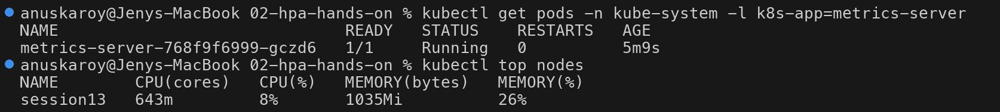

---

## Step 2: Deploy the application

```bash
kubectl apply -f deployment.yaml
kubectl rollout status deployment/hpa-demo
kubectl get deployment hpa-demo
kubectl get pods -l app=hpa-demo
kubectl get svc hpa-demo-service
```

```text
$ kubectl apply -f deployment.yaml
deployment.apps/hpa-demo created
service/hpa-demo-service created
$ kubectl rollout status deployment/hpa-demo
Waiting for deployment "hpa-demo" rollout to finish: 0 of 1 updated replicas are available...
deployment "hpa-demo" successfully rolled out
$ kubectl get deployment hpa-demo
NAME       READY   UP-TO-DATE   AVAILABLE   AGE
hpa-demo   1/1     1            1           1s
$ kubectl get pods -l app=hpa-demo
NAME                        READY   STATUS    RESTARTS   AGE
hpa-demo-5d6676989b-6mdxl   1/1     Running   0          1s
$ kubectl get svc hpa-demo-service
NAME               TYPE        CLUSTER-IP       EXTERNAL-IP   PORT(S)   AGE
hpa-demo-service   ClusterIP   10.103.230.180   <none>        80/TCP    1s
```

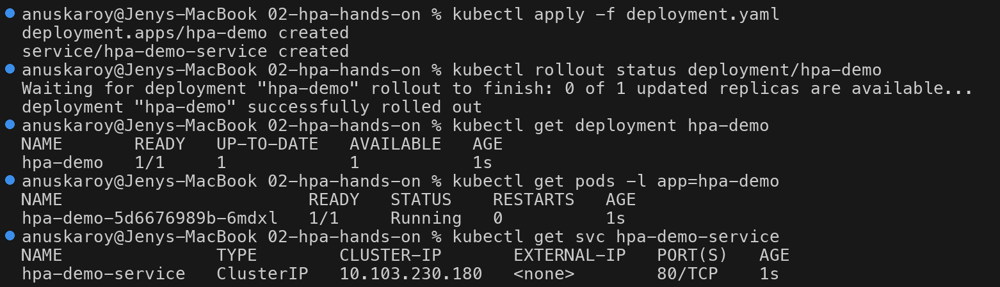

---

## Step 3: Configure the HPA

```bash
kubectl apply -f hpa.yml
kubectl get hpa
kubectl describe hpa hpa-demo
```

### First look: `cpu: <unknown>/50%`

```text
$ kubectl apply -f hpa.yml
horizontalpodautoscaler.autoscaling/hpa-demo created
$ sleep 40
$ kubectl get hpa
NAME       REFERENCE             TARGETS              MINPODS   MAXPODS   REPLICAS   AGE
hpa-demo   Deployment/hpa-demo   cpu: <unknown>/50%   1         5         1          41s
```

```text
$ kubectl describe hpa hpa-demo
...
Metrics:                                               ( current / target )
  resource cpu on pods  (as a percentage of request):  <unknown> / 50%
Min replicas:                                          1
Max replicas:                                          5
Behavior:
  Scale Up:
    Stabilization Window: 0 seconds
    Select Policy: Max
    Policies:
      - Type: Pods     Value: 4    Period: 15 seconds
      - Type: Percent  Value: 100  Period: 15 seconds
  Scale Down:
    Stabilization Window: 60 seconds
    Select Policy: Max
    Policies:
      - Type: Percent  Value: 100  Period: 15 seconds
Deployment pods:       1 current / 0 desired
Conditions:
  Type           Status  Reason                   Message
  ----           ------  ------                   -------
  AbleToScale    True    SucceededGetScale        the HPA controller was able to get the target's current scale
  ScalingActive  False   FailedGetResourceMetric  the HPA was unable to compute the replica count: failed to get cpu utilization: did not receive metrics for targeted pods (pods might be unready)
Events:
  Type     Reason                        Age                From                       Message
  ----     ------                        ----               ----                       -------
  Warning  FailedGetResourceMetric       13s (x3 over 40s)  horizontal-pod-autoscaler  failed to get cpu utilization: did not receive metrics for targeted pods (pods might be unready)
  Warning  FailedComputeMetricsReplicas  13s (x3 over 40s)  horizontal-pod-autoscaler  invalid metrics (1 invalid out of 1), first error is: failed to get cpu resource metric value: failed to get cpu utilization: did not receive metrics for targeted pods (pods might be unready)
$ kubectl top pods
NAME                        CPU(cores)   MEMORY(bytes)
hpa-demo-5d6676989b-6mdxl   0m           6Mi
```

**Why `<unknown>`:** the pod was only seconds old. metrics-server scrapes the kubelet periodically (about
every 15s, and needs a sample spanning a full window for a brand-new container), so for the first HPA
syncs there was no CPU sample for the targeted pod. The controller reports `ScalingActive=False /
FailedGetResourceMetric` and refuses to act rather than guess. This is expected and resolves on its own; it
is **not** the same as the permanent `<unknown>` caused by missing requests (see Troubleshooting).

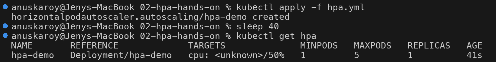
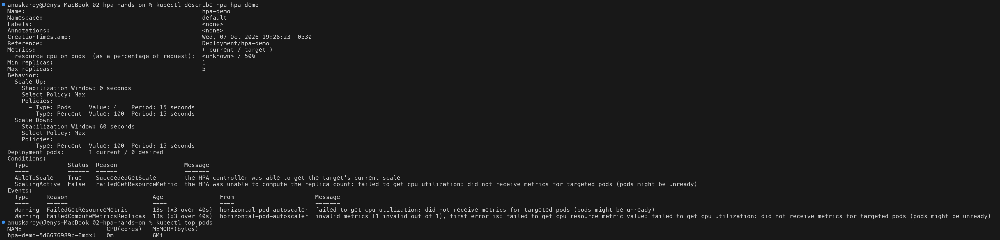

---

## Step 4: Verify the HPA

Once metrics-server had a sample for the pod, the target turned into a real number:

```text
$ kubectl get hpa
NAME       REFERENCE             TARGETS       MINPODS   MAXPODS   REPLICAS   AGE
hpa-demo   Deployment/hpa-demo   cpu: 0%/50%   1         5         1          7m48s
$ kubectl top pods
NAME                        CPU(cores)   MEMORY(bytes)
hpa-demo-5d6676989b-6mdxl   0m           7Mi
```

```text
$ kubectl describe hpa hpa-demo | sed -n '/^Metrics/,/^Max/p;/^Deployment pods/,/^Events/p'
Metrics:                                               ( current / target )
  resource cpu on pods  (as a percentage of request):  0% (0) / 50%
Min replicas:                                          1
Max replicas:                                          5
Deployment pods:       1 current / 1 desired
Conditions:
  Type            Status  Reason            Message
  ----            ------  ------            -------
  AbleToScale     True    ReadyForNewScale  recommended size matches current size
  ScalingActive   True    ValidMetricFound  the HPA was able to successfully calculate a replica count from cpu resource utilization (percentage of request)
  ScalingLimited  True    TooFewReplicas    the desired replica count is less than the minimum replica count
Events:
```

- `ScalingActive True / ValidMetricFound` - the HPA now has a usable metric.
- `ScalingLimited True / TooFewReplicas` - at 0% the formula wants 0 replicas, so `minReplicas: 1` is
  what keeps one pod alive.

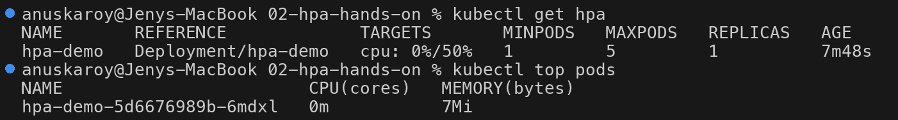
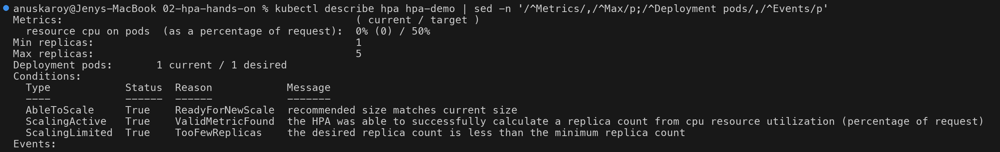

---

## Step 5: Deploy the load generator (1 replica)

```bash
kubectl apply -f load-generator.yaml
kubectl rollout status deployment/load-generator
kubectl get pods -l app=load-generator
kubectl exec deploy/load-generator -- sh -c 'echo target=$HPA_DEMO_SERVICE_SERVICE_HOST'
```

```text
$ kubectl apply -f load-generator.yaml
deployment.apps/load-generator created
$ kubectl rollout status deployment/load-generator
Waiting for deployment "load-generator" rollout to finish: 0 out of 1 new replicas have been updated...
Waiting for deployment "load-generator" rollout to finish: 0 of 1 updated replicas are available...
deployment "load-generator" successfully rolled out
$ kubectl get pods -l app=load-generator
NAME                             READY   STATUS    RESTARTS   AGE
load-generator-bd484d7c7-2vlcv   1/1     Running   0          1s
$ kubectl exec deploy/load-generator -- sh -c 'echo target=$HPA_DEMO_SERVICE_SERVICE_HOST'
target=10.103.230.180
```

The generator targets `$HPA_DEMO_SERVICE_SERVICE_HOST`, the env var Kubernetes injects into every pod for
each Service that existed when the pod started. It resolves to the Service ClusterIP `10.103.230.180`
(matches Step 2), so no DNS lookup is needed per request. See Troubleshooting for why this matters.

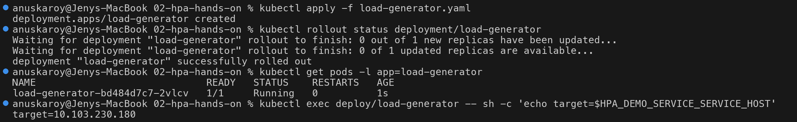

### Observe CPU utilization and the first scale-up (1 -> 2)

```text
$ kubectl get hpa
NAME       REFERENCE             TARGETS        MINPODS   MAXPODS   REPLICAS   AGE
hpa-demo   Deployment/hpa-demo   cpu: 75%/50%   1         5         2          9m6s
$ kubectl top pods
NAME                             CPU(cores)   MEMORY(bytes)
hpa-demo-5d6676989b-6mdxl        75m          9Mi
load-generator-bd484d7c7-2vlcv   832m         5Mi
$ kubectl get pods -l app=hpa-demo
NAME                        READY   STATUS    RESTARTS   AGE
hpa-demo-5d6676989b-6mdxl   1/1     Running   0          9m54s
hpa-demo-5d6676989b-d25kv   1/1     Running   0          20s
```

The single nginx pod used **75m** of its **100m** request = **75%**, above the 50% target:

```
desiredReplicas = ceil(1 × 75 / 50) = ceil(1.5) = 2
```

A second pod (`d25kv`) was created.

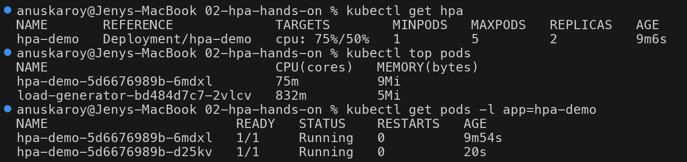

---

## Step 6: Increase the load (4 generators)

```bash
kubectl scale deployment load-generator --replicas=4
kubectl rollout status deployment/load-generator
kubectl get pods -l app=load-generator
```

```text
$ kubectl scale deployment load-generator --replicas=4
deployment.apps/load-generator scaled
$ kubectl rollout status deployment/load-generator
Waiting for deployment "load-generator" rollout to finish: 1 out of 4 new replicas have been updated...
Waiting for deployment "load-generator" rollout to finish: 1 of 4 updated replicas are available...
Waiting for deployment "load-generator" rollout to finish: 2 of 4 updated replicas are available...
Waiting for deployment "load-generator" rollout to finish: 3 of 4 updated replicas are available...
deployment "load-generator" successfully rolled out
$ kubectl get pods -l app=load-generator
NAME                             READY   STATUS    RESTARTS   AGE
load-generator-bd484d7c7-2vlcv   1/1     Running   0          87s
load-generator-bd484d7c7-kdn7g   1/1     Running   0          2s
load-generator-bd484d7c7-q8m7f   1/1     Running   0          2s
load-generator-bd484d7c7-vq9nz   1/1     Running   0          2s
```

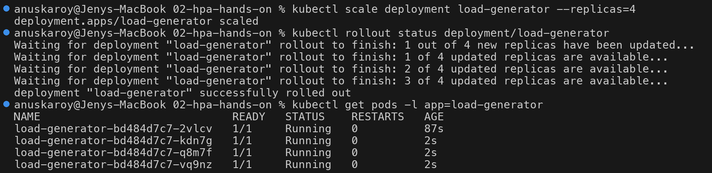

### Observe pod scaling (2 -> 5)

```text
$ kubectl get hpa
NAME       REFERENCE             TARGETS         MINPODS   MAXPODS   REPLICAS   AGE
hpa-demo   Deployment/hpa-demo   cpu: 101%/50%   1         5         5          10m
$ kubectl top pods
NAME                             CPU(cores)   MEMORY(bytes)
hpa-demo-5d6676989b-6mdxl        95m          9Mi
hpa-demo-5d6676989b-d25kv        107m         8Mi
load-generator-bd484d7c7-2vlcv   820m         6Mi
load-generator-bd484d7c7-kdn7g   649m         2Mi
load-generator-bd484d7c7-q8m7f   655m         1Mi
load-generator-bd484d7c7-vq9nz   664m         2Mi
$ kubectl get pods -l app=hpa-demo
NAME                        READY   STATUS    RESTARTS   AGE
hpa-demo-5d6676989b-226vk   1/1     Running   0          20s
hpa-demo-5d6676989b-4scw8   1/1     Running   0          20s
hpa-demo-5d6676989b-6mdxl   1/1     Running   0          10m
hpa-demo-5d6676989b-d25kv   1/1     Running   0          80s
hpa-demo-5d6676989b-hvkh5   1/1     Running   0          20s
```

With 2 pods averaging (95m + 107m) / 2 = 101m -> **101%**:

```
desiredReplicas = ceil(2 × 101 / 50) = ceil(4.04) = 5
scaleUp policy limit for one 15s period = max(2 + 4 pods, 2 × 200%) = 6   -> not the limiting factor
clamped to maxReplicas = 5
```

Three new pods (`226vk`, `4scw8`, `hvkh5`) were created in a single step.

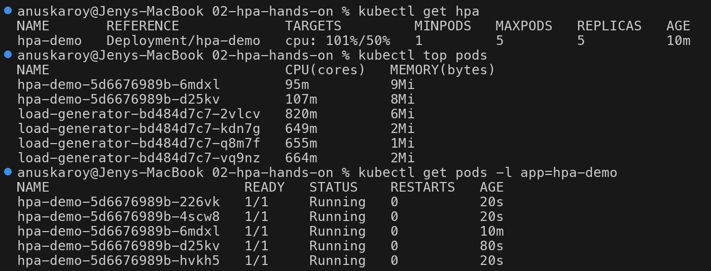

### Scaled out to the maximum

```text
$ kubectl get hpa
NAME       REFERENCE             TARGETS        MINPODS   MAXPODS   REPLICAS   AGE
hpa-demo   Deployment/hpa-demo   cpu: 87%/50%   1         5         5          11m
$ kubectl top pods
NAME                             CPU(cores)   MEMORY(bytes)
hpa-demo-5d6676989b-226vk        78m          8Mi
hpa-demo-5d6676989b-4scw8        79m          8Mi
hpa-demo-5d6676989b-6mdxl        80m          8Mi
hpa-demo-5d6676989b-d25kv        79m          8Mi
hpa-demo-5d6676989b-hvkh5        80m          7Mi
load-generator-bd484d7c7-2vlcv   687m         3Mi
load-generator-bd484d7c7-kdn7g   678m         3Mi
load-generator-bd484d7c7-q8m7f   685m         2Mi
load-generator-bd484d7c7-vq9nz   678m         3Mi
$ kubectl get pods -l app=hpa-demo -o wide
NAME                        READY   STATUS    RESTARTS   AGE     IP            NODE        NOMINATED NODE   READINESS GATES
hpa-demo-5d6676989b-226vk   1/1     Running   0          111s    10.244.0.26   session13   <none>           <none>
hpa-demo-5d6676989b-4scw8   1/1     Running   0          111s    10.244.0.27   session13   <none>           <none>
hpa-demo-5d6676989b-6mdxl   1/1     Running   0          12m     10.244.0.14   session13   <none>           <none>
hpa-demo-5d6676989b-d25kv   1/1     Running   0          2m51s   10.244.0.21   session13   <none>           <none>
hpa-demo-5d6676989b-hvkh5   1/1     Running   0          111s    10.244.0.25   session13   <none>           <none>
```

Even with 5 pods each nginx pod still sits at ~78-87% of its request (the HPA and `kubectl top` read
slightly different samples, 87% vs ~79m). The load is spread out, but utilization stays **above** the 50%
target: `ceil(5 × 87 / 50) = 9` pods would be needed, and `maxReplicas: 5` caps it. In a real cluster this
is the signal to raise `maxReplicas` or add node capacity. (All pods land on the single node `session13`,
which is also running the 4 CPU-hungry generators.)

```text
$ kubectl describe hpa hpa-demo | sed -n '/^Metrics/,/^Max/p;/^Deployment pods/,$p'
Metrics:                                               ( current / target )
  resource cpu on pods  (as a percentage of request):  87% (87m) / 50%
Min replicas:                                          1
Max replicas:                                          5
Deployment pods:       5 current / 5 desired
Conditions:
  Type            Status  Reason              Message
  ----            ------  ------              -------
  AbleToScale     True    ReadyForNewScale    recommended size matches current size
  ScalingActive   True    ValidMetricFound    the HPA was able to successfully calculate a replica count from cpu resource utilization (percentage of request)
  ScalingLimited  False   DesiredWithinRange  the desired count is within the acceptable range
  ScaledToZero    False   NotScaledToZero     the HPA controller did not scale the workload to zero
Events:
  Type     Reason                        Age                  From                       Message
  ----     ------                        ----                 ----                       -------
  Warning  FailedGetResourceMetric       11m (x3 over 11m)    horizontal-pod-autoscaler  failed to get cpu utilization: did not receive metrics for targeted pods (pods might be unready)
  Warning  FailedComputeMetricsReplicas  11m (x3 over 11m)    horizontal-pod-autoscaler  invalid metrics (1 invalid out of 1), first error is: failed to get cpu resource metric value: failed to get cpu utilization: did not receive metrics for targeted pods (pods might be unready)
  Normal   SuccessfulRescale             6m17s                horizontal-pod-autoscaler  New size: 1; reason: All metrics below target
  Normal   SuccessfulRescale             3m1s (x2 over 9m3s)  horizontal-pod-autoscaler  New size: 2; reason: cpu resource utilization (percentage of request) above target
  Normal   SuccessfulRescale             2m1s                 horizontal-pod-autoscaler  New size: 5; reason: cpu resource utilization (percentage of request) above target
```

Reading the events:

- `New size: 2 ... 3m1s` and `New size: 5 ... 2m1s` are the two scale-ups from Steps 5 and 6.
- `New size: 2 (x2 over 9m3s)` and `New size: 1 ... 6m17s` include an **earlier first attempt** that used
  the DNS-based generator. It scaled to 2, then the load collapsed and the HPA scaled back to 1 (see
  Troubleshooting).
- `ScaledToZero` is an extra condition shown by Kubernetes v1.37.

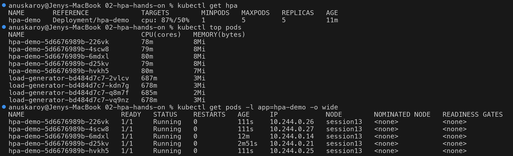
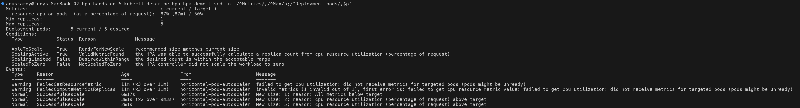

---

## Step 7: Stop the load and observe scale-down

```bash
kubectl delete deployment load-generator
kubectl get pods -l app=load-generator
```

```text
$ kubectl delete deployment load-generator
deployment.apps "load-generator" deleted from default namespace
$ kubectl get pods -l app=load-generator
NAME                             READY   STATUS        RESTARTS   AGE
load-generator-bd484d7c7-2vlcv   1/1     Terminating   0          3m58s
load-generator-bd484d7c7-kdn7g   1/1     Terminating   0          2m33s
load-generator-bd484d7c7-q8m7f   1/1     Terminating   0          2m33s
load-generator-bd484d7c7-vq9nz   1/1     Terminating   0          2m33s
```

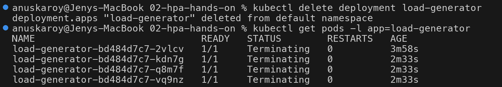

After CPU dropped to 0% the HPA waited out the **60s** stabilization window and then went straight from
5 to 1 (the default scale-down policy allows removing 100% of pods per 15s; `minReplicas: 1` is the floor):

```text
$ kubectl get hpa
NAME       REFERENCE             TARGETS       MINPODS   MAXPODS   REPLICAS   AGE
hpa-demo   Deployment/hpa-demo   cpu: 0%/50%   1         5         1          15m
$ kubectl top pods
NAME                        CPU(cores)   MEMORY(bytes)
hpa-demo-5d6676989b-6mdxl   0m           7Mi
$ kubectl get pods -l app=hpa-demo
NAME                        READY   STATUS    RESTARTS   AGE
hpa-demo-5d6676989b-6mdxl   1/1     Running   0          15m
$ kubectl describe hpa hpa-demo | sed -n '/^Events/,$p'
Events:
  Type     Reason                        Age                  From                       Message
  ----     ------                        ----                 ----                       -------
  Warning  FailedGetResourceMetric       14m (x3 over 15m)    horizontal-pod-autoscaler  failed to get cpu utilization: did not receive metrics for targeted pods (pods might be unready)
  Warning  FailedComputeMetricsReplicas  14m (x3 over 15m)    horizontal-pod-autoscaler  invalid metrics (1 invalid out of 1), first error is: failed to get cpu resource metric value: failed to get cpu utilization: did not receive metrics for targeted pods (pods might be unready)
  Normal   SuccessfulRescale             6m25s (x2 over 12m)  horizontal-pod-autoscaler  New size: 2; reason: cpu resource utilization (percentage of request) above target
  Normal   SuccessfulRescale             5m25s                horizontal-pod-autoscaler  New size: 5; reason: cpu resource utilization (percentage of request) above target
  Normal   SuccessfulRescale             38s (x2 over 9m41s)  horizontal-pod-autoscaler  New size: 1; reason: All metrics below target
```

The original pod `6mdxl` survived the whole run; the newest pods were removed first.
`New size: 1 (x2 over 9m41s)` = this scale-down plus the one from the first attempt.

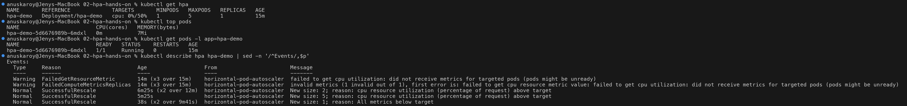

---

## Step 8: Full timeline (watch output)

`kubectl get hpa hpa-demo -w` was left running in a second terminal for the whole experiment:

```text
$ kubectl get hpa hpa-demo -w
NAME       REFERENCE             TARGETS       MINPODS   MAXPODS   REPLICAS   AGE
hpa-demo   Deployment/hpa-demo   cpu: 0%/50%   1         5         1          7m48s
hpa-demo   Deployment/hpa-demo   cpu: 0%/50%   1         5         1          8m31s
hpa-demo   Deployment/hpa-demo   cpu: 75%/50%   1         5         1          8m46s
hpa-demo   Deployment/hpa-demo   cpu: 75%/50%   1         5         2          9m1s
hpa-demo   Deployment/hpa-demo   cpu: 101%/50%   1         5         2          9m46s
hpa-demo   Deployment/hpa-demo   cpu: 101%/50%   1         5         5          10m
hpa-demo   Deployment/hpa-demo   cpu: 87%/50%    1         5         5          10m
hpa-demo   Deployment/hpa-demo   cpu: 79%/50%    1         5         5          11m
hpa-demo   Deployment/hpa-demo   cpu: 69%/50%    1         5         5          12m
hpa-demo   Deployment/hpa-demo   cpu: 0%/50%     1         5         5          13m
hpa-demo   Deployment/hpa-demo   cpu: 0%/50%     1         5         5          14m
hpa-demo   Deployment/hpa-demo   cpu: 0%/50%     1         5         1          14m
```

| HPA age | CPU (avg / target) | Replicas | What happened |
| --- | --- | --- | --- |
| 7m48s | 0% / 50% | 1 | Idle, metric valid, `minReplicas` holds 1 pod |
| 8m46s | 75% / 50% | 1 | 1 load generator running; HPA sees the spike |
| 9m1s | 75% / 50% | **2** | Scale-up: `ceil(1 × 75/50) = 2` |
| 9m46s | 101% / 50% | 2 | Load generator scaled to 4 |
| 10m | 101% / 50% | **5** | Scale-up: `ceil(2 × 101/50) = 5` (= maxReplicas) |
| 10m - 12m | 87% -> 79% -> 69% | 5 | Load spread over 5 pods, still above target, capped at max |
| 13m | 0% / 50% | 5 | Load generator deleted; stabilization window (60s) starts |
| 14m | 0% / 50% | **1** | Scale-down 5 -> 1 after the window |

Pod-level view (`kubectl get pods -l app=hpa-demo -w`, excerpt):

```text
$ kubectl get pods -l app=hpa-demo -w
NAME                        READY   STATUS    RESTARTS   AGE
hpa-demo-5d6676989b-6mdxl   1/1     Running   0          8m36s
hpa-demo-5d6676989b-d25kv   0/1     Pending   0          0s
hpa-demo-5d6676989b-d25kv   0/1     ContainerCreating   0          0s
hpa-demo-5d6676989b-d25kv   1/1     Running             0          1s
hpa-demo-5d6676989b-226vk   0/1     Pending             0          0s
hpa-demo-5d6676989b-4scw8   0/1     Pending             0          1s
hpa-demo-5d6676989b-hvkh5   0/1     Pending             0          1s
hpa-demo-5d6676989b-hvkh5   0/1     ContainerCreating   0          1s
hpa-demo-5d6676989b-226vk   0/1     ContainerCreating   0          1s
hpa-demo-5d6676989b-4scw8   0/1     ContainerCreating   0          1s
hpa-demo-5d6676989b-4scw8   1/1     Running             0          2s
hpa-demo-5d6676989b-226vk   1/1     Running             0          2s
hpa-demo-5d6676989b-hvkh5   1/1     Running             0          2s
...
hpa-demo-5d6676989b-d25kv   1/1     Terminating         0          5m47s
hpa-demo-5d6676989b-4scw8   1/1     Terminating         0          4m47s
hpa-demo-5d6676989b-226vk   1/1     Terminating         0          4m47s
hpa-demo-5d6676989b-hvkh5   1/1     Terminating         0          4m47s
...
hpa-demo-5d6676989b-226vk   0/1     Completed           0          4m48s
hpa-demo-5d6676989b-d25kv   0/1     Completed           0          5m48s
hpa-demo-5d6676989b-hvkh5   0/1     Completed           0          4m48s
hpa-demo-5d6676989b-4scw8   0/1     Completed           0          4m48s
...
```

New pods go `Pending -> ContainerCreating -> Running` in about 2s (image already cached). On scale-down
the four extra pods go `Running -> Terminating -> Completed` together, since nginx exits cleanly on
SIGTERM.

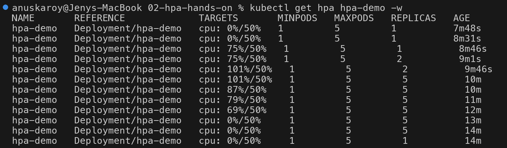
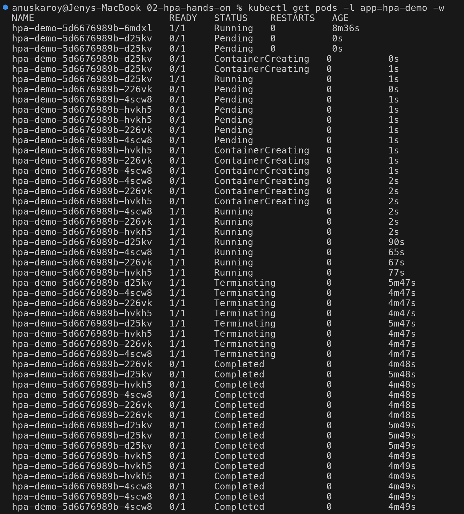

---

## Scaling behavior (`spec.behavior`)

`hpa.yml` only overrides the scale-down window; everything else is the default, as shown by
`kubectl describe hpa` in Step 3:

| Direction | Stabilization window | Policies (per 15s) | Select policy | Effect |
| --- | --- | --- | --- | --- |
| Scale up | 0s (default) | add up to **4 pods** or **100%** of current | Max | React immediately; can at least double each period (1 -> 2 -> 5 here) |
| Scale down | **60s** (set in `hpa.yml`; default is **300s**) | remove up to **100%** | Max | Use the highest recommendation of the last 60s, then drop straight to the floor |

```yaml
behavior:
  scaleDown:
    stabilizationWindowSeconds: 60   # default is 300s; shortened so scale-down is visible in the lab
```

The stabilization window prevents **flapping**: a short dip in CPU does not immediately remove pods that
would be needed again a few seconds later. 300s is a sensible production default; 60s was used only so the
scale-down could be observed during the lab.

---

## Troubleshooting

### Real issue hit in this lab: DNS flood from the load generator

The first version of the load generator used the Service DNS name:

```sh
while true; do wget -q -O- http://hpa-demo-service > /dev/null; done
```

With 1 generator it worked and the HPA scaled to 2. After scaling to 4 generators every `wget` did its own
DNS lookup in a tight loop, CoreDNS was flooded, lookups started failing and the load collapsed:

```text
$ kubectl get hpa
NAME       REFERENCE             TARGETS        MINPODS   MAXPODS   REPLICAS   AGE
hpa-demo   Deployment/hpa-demo   cpu: 15%/50%   1         5         2          4m49s
$ kubectl top pods
NAME                              CPU(cores)   MEMORY(bytes)
hpa-demo-5d6676989b-6mdxl         15m          8Mi
hpa-demo-5d6676989b-wnldr         16m          7Mi
load-generator-5bc8f9cd58-2tmqm   122m         1Mi
load-generator-5bc8f9cd58-5btt6   31m          0Mi
load-generator-5bc8f9cd58-hhk48   23m          0Mi
load-generator-5bc8f9cd58-rn75h   43m          0Mi
$ kubectl logs deploy/load-generator --tail=3
Found 4 pods, using pod/load-generator-5bc8f9cd58-2tmqm
wget: bad address 'hpa-demo-service'
wget: bad address 'hpa-demo-service'
```

More generators produced **less** load (15%) and the HPA scaled back to 1 (`New size: 1` event at 6m17s in
Step 6). **Fix:** target the Service ClusterIP through the injected env var
`$HPA_DEMO_SERVICE_SERVICE_HOST`, which skips DNS completely. The final `load-generator.yaml` uses it, and
the run above reached 101% with no errors.

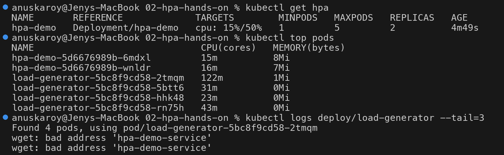

### Common problems

| Symptom | Cause | Fix |
| --- | --- | --- |
| `cpu: <unknown>/50%` for the first ~minute, `FailedGetResourceMetric: did not receive metrics for targeted pods` | Pod is brand-new; metrics-server has no sample yet | Wait one or two scrape cycles; check `kubectl top pods` |
| `<unknown>` that never goes away, `missing request for cpu` in `describe hpa` | Container has no `resources.requests.cpu`, so utilization cannot be computed | Add a CPU request to the Deployment (here `100m`) |
| `<unknown>`, `kubectl top` says `Metrics API not available` | metrics-server not installed / not ready | `minikube addons enable metrics-server -p session13`, then `kubectl get pods -n kube-system -l k8s-app=metrics-server` |
| Load generators running but CPU stays low, logs show `wget: bad address` | DNS lookup per request floods CoreDNS | Use `$<SERVICE>_SERVICE_HOST` (ClusterIP) or reduce request rate |
| Replicas stuck at max while CPU still above target | `maxReplicas` reached (`ceil(5 × 87/50) = 9` wanted here) | Raise `maxReplicas` or add capacity |
| Scale-down takes ~5 minutes | Default `scaleDown.stabilizationWindowSeconds: 300` | Expected; lower it only for demos |

---

## Useful commands

```bash
# HPA status
kubectl get hpa
kubectl get hpa hpa-demo -w
kubectl describe hpa hpa-demo

# Pods and live resource usage (needs metrics-server)
kubectl get pods
kubectl get pods -l app=hpa-demo -w
kubectl top pods
kubectl top nodes

# Load control
kubectl apply -f load-generator.yaml
kubectl scale deployment load-generator --replicas=4
kubectl delete deployment load-generator

# Events from the HPA controller
kubectl get events --field-selector involvedObject.name=hpa-demo

# Inspect the HPA spec / API
kubectl get hpa hpa-demo -o yaml
kubectl explain hpa.spec.behavior
```

---

## Cleanup

```bash
kubectl delete -f load-generator.yaml --ignore-not-found
kubectl delete -f hpa.yml
kubectl delete -f deployment.yaml
```

---

## Key takeaways

1. HPA scales **horizontally** (more pods), driven by `usage / request`; CPU requests are mandatory.
2. The chain is Pods -> kubelet/cAdvisor -> metrics-server -> Metrics API -> HPA controller (15s loop) ->
   Deployment `/scale`.
3. `desiredReplicas = ceil(current × currentUtil / targetUtil)`, clamped to `[min, max]`: observed 1 -> 2
   at 75% and 2 -> 5 at 101%.
4. Scale-up is fast by default; scale-down waits for the stabilization window (60s here, 300s default).
5. A load test can fail for reasons unrelated to the app: the DNS-based generator overwhelmed CoreDNS.

## References

- Kubernetes docs - Horizontal Pod Autoscaling: https://kubernetes.io/docs/tasks/run-application/horizontal-pod-autoscale/
- HPA walkthrough: https://kubernetes.io/docs/tasks/run-application/horizontal-pod-autoscale-walkthrough/
- Configurable scaling behavior: https://kubernetes.io/docs/tasks/run-application/horizontal-pod-autoscale/#configurable-scaling-behavior
- metrics-server: https://github.com/kubernetes-sigs/metrics-server
- Service environment variables: https://kubernetes.io/docs/concepts/services-networking/service/#environment-variables
- Instructor notes: [`../04-hpa/readme1.md`](../04-hpa/readme1.md)
