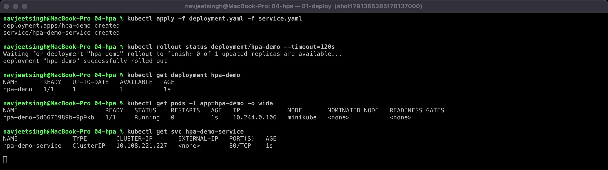
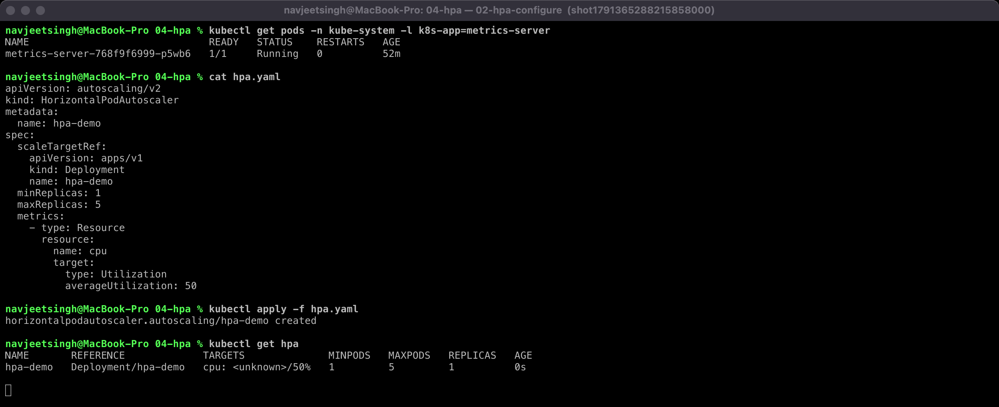
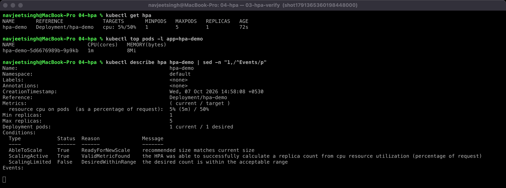
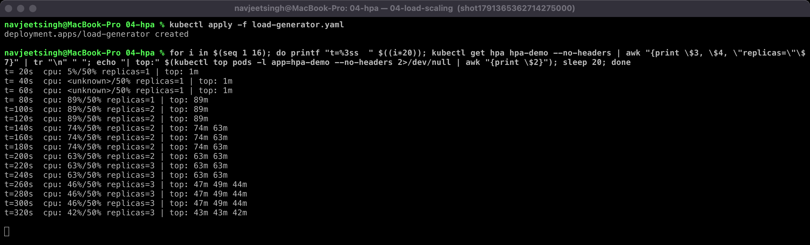
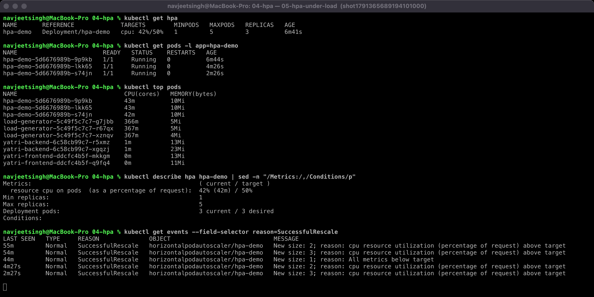
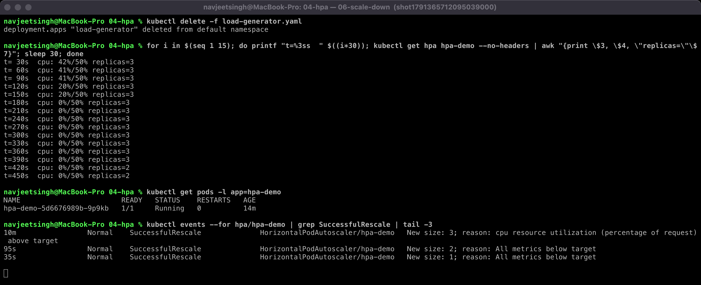

# Session 13 — Task 2: HPA Hands-on

Theory notes are in [readme1.md](readme1.md). This file records the hands-on run on minikube (Docker driver, `metrics-server` addon enabled). Every screenshot is a real terminal capture of the commands being run.

## Files

| File | Purpose |
|---|---|
| [deployment.yaml](deployment.yaml) | `hpa-demo` nginx Deployment, 1 replica, `requests.cpu: 100m`, `limits.cpu: 200m` |
| [service.yaml](service.yaml) | ClusterIP `hpa-demo-service` on port 80 |
| [hpa.yaml](hpa.yaml) | `autoscaling/v2` HPA: min 1, max 5, target **50% CPU** of request |
| [load-generator.yaml](load-generator.yaml) | 3 busybox Pods running `while true; do wget -q -O- http://hpa-demo-service; done` |

## 1. Deploy the application



## 2. Configure the HPA

metrics-server is running. The HPA targets 50% CPU of the 100m request, with 1–5 replicas.



## 3. Verify the HPA

About a minute later the HPA has a metric (`cpu: 0%/50%`) and `ScalingActive: True / ValidMetricFound`. Before that it shows `<unknown>`, because metrics-server scrapes every 15–60s.



## 4–6. Load generator → CPU rises → Pods scale

I sampled `kubectl get hpa` and `kubectl top pods` every 20s after applying the load generator:



| Time | HPA | Replicas | CPU per Pod |
|---|---|---|---|
| t=80s | 89%/50% | 1 | 89m (load arrives) |
| t=100s | 89%/50% | **2** | scale-up 1 → 2 |
| t=140s | 74%/50% | 2 | 74m, 63m |
| t=220s | 63%/50% | **3** | scale-up 2 → 3 |
| t=260s | 46%/50% | 3 | 47m, 49m, 44m (below target, stable) |

Under load:



> The `SuccessfulRescale` events list also contains events ~45–55 min old. Those come from an earlier practice run of the same `hpa-demo` object. The two from this run are `4m27s New size: 2` and `2m27s New size: 3`.

### Why 3 replicas and not 5?

The HPA formula is:

```text
desiredReplicas = ceil( currentReplicas × currentUtilization / targetUtilization )
                = ceil( 1 × 89 / 50 ) = 2      then      ceil( 2 × 63 / 50 ) = 3
```

With 3 Pods the average fell to ~42–46%, below 50%, so the HPA stopped. The load generator was the limit (each busybox Pod used ~367m CPU). More generator replicas would push it to `maxReplicas: 5`.

## 7. Stop the load → scale down



After the load generator was deleted, CPU fell to 0% by t=180s, but replicas stayed at 3 until **t≈420s** (3 → 2) and then went 2 → 1 about a minute later. Scale-**up** happens within ~20s of crossing the target; scale-**down** waits for the default `behavior.scaleDown.stabilizationWindowSeconds: 300`, which stops the HPA flapping when traffic is spiky.

## Useful commands

```bash
kubectl get hpa                 # current/target utilisation and replica count
kubectl get hpa -w              # watch it change live
kubectl get pods                # see new Pods appear/disappear
kubectl top pods                # actual CPU/memory per Pod (from metrics-server)
kubectl top nodes
kubectl describe hpa hpa-demo   # conditions + SuccessfulRescale events with the reason
```

## Takeaways

- HPA needs **metrics-server** and **`resources.requests.cpu`** — utilisation is measured *as a percentage of the request*. Without a request the target shows `<unknown>` forever.
- Scaling is reactive: ~15s metric resolution + HPA sync period (15s) means a 30–60s lag before new Pods appear.
- Scale-down is deliberately slow (5-minute stabilization) to avoid thrashing.

## Cleanup

```bash
kubectl delete -f .
```
