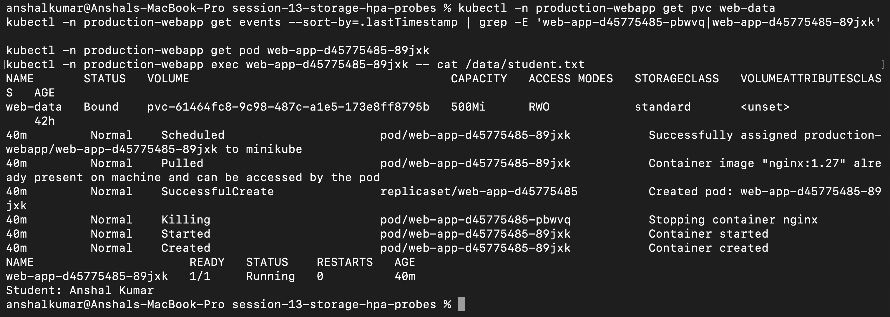
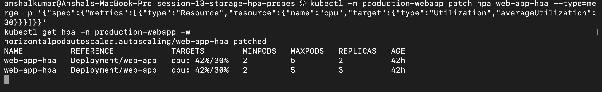
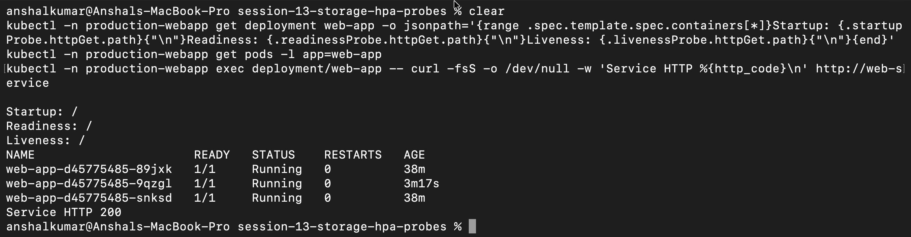

# Session 13 - Storage, HPA and Probes

I used the `production-webapp` namespace for this assignment. The mini project combines a PVC, Deployment, Service, HPA, and all three probe types.

## Storage

My notes and smaller examples for `emptyDir`, `hostPath`, PV, PVC, StorageClass, and dynamic provisioning are in [`01-kubernetes-volumes/`](01-kubernetes-volumes/). In the mini project I wrote `Student: Anshal Kumar` to the mounted PVC, deleted the Pod, waited for its replacement, and read the same file from the new Pod. That confirmed that the data belonged to the volume rather than the old container: [`pvc-persistence.png`](screenshots/pvc-persistence.png).

## HPA

The HPA files are in [`04-hpa/`](04-hpa/) and the load script is [`hpa/load_generator.sh`](hpa/load_generator.sh). I generated repeated requests, watched CPU rise above the target, and saw the Deployment increase from two replicas to three. I then removed the load generator and restored the original 50% target: [`hpa-scaling.png`](screenshots/hpa-scaling.png).

## Probes and mini project

The Deployment uses startup, readiness, and liveness HTTP probes. All three checked `/`, the Pods stayed ready without restarts, and the Service returned HTTP 200: [`probes-service.png`](screenshots/probes-service.png).

The full project and run instructions are in [`mini-project/`](mini-project/).

## Screenshots from my run

### Persistent storage

The replacement Pod could still read the student file after the original Pod was deleted.

### Horizontal scaling

The generated load raised CPU usage above the target and the HPA increased the replica count.

### Health probes and Service

The startup, readiness, and liveness probes were configured, the Pods were ready, and the Service returned HTTP 200.

