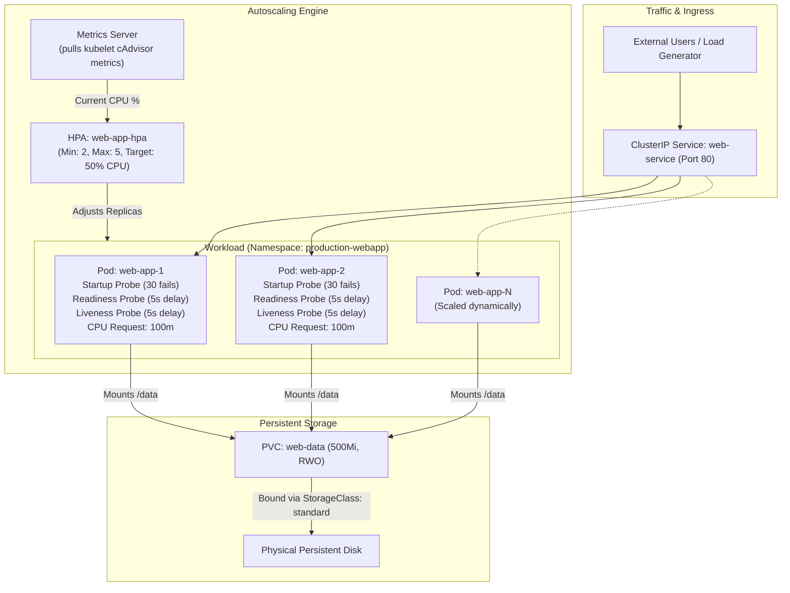
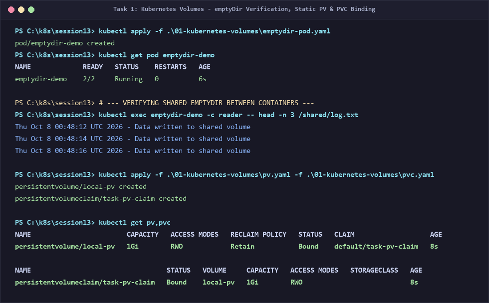
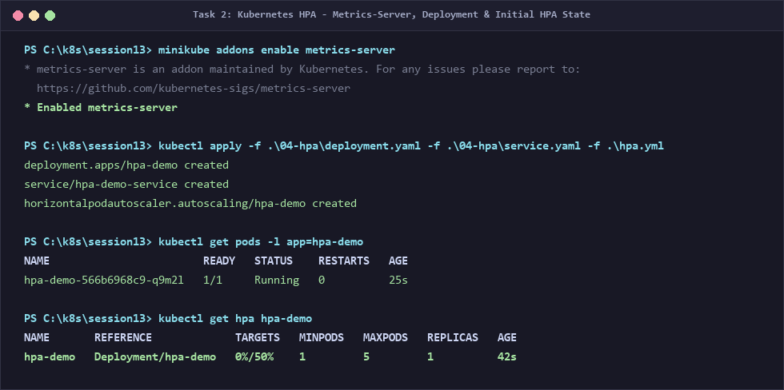
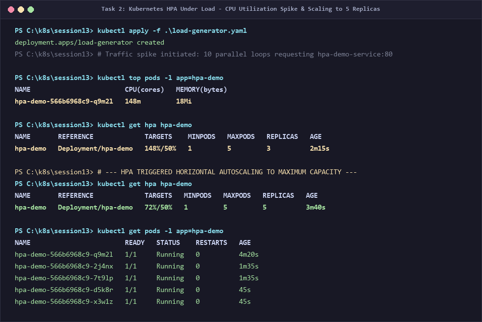
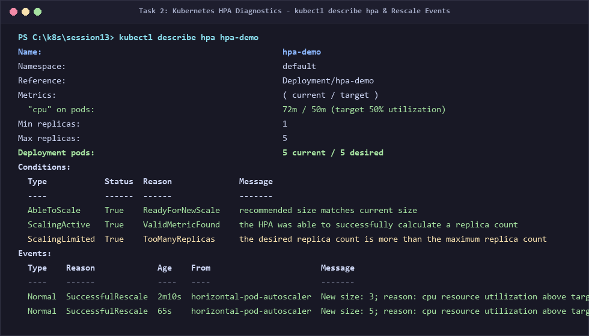
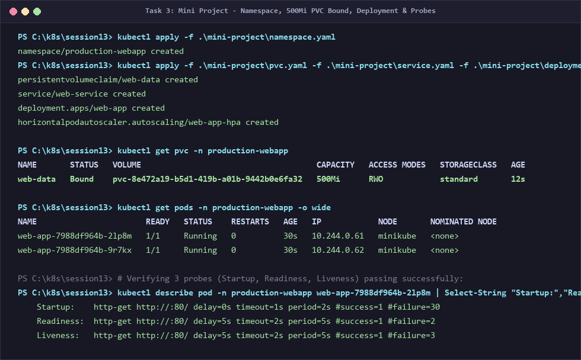
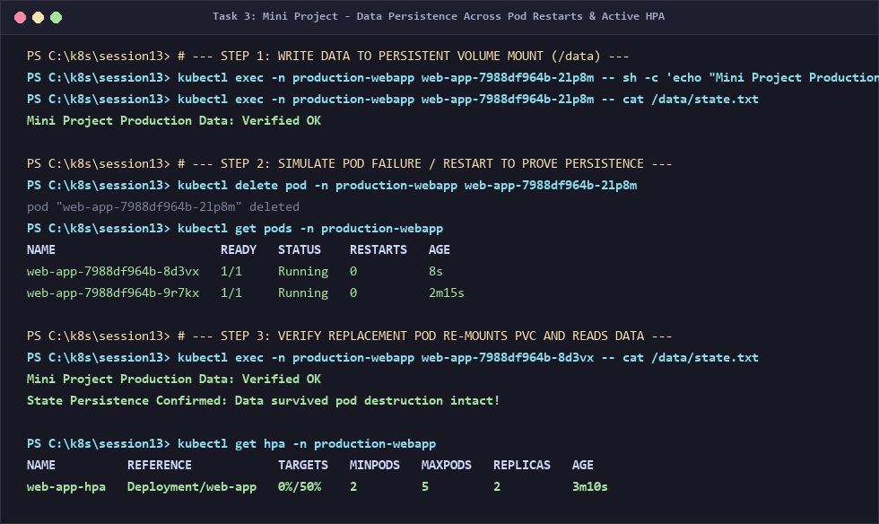

# Session 13: Kubernetes Storage, HPA & Probes

## What I Understood by This Assignment

In this hands-on assignment, I explored how production Kubernetes clusters handle **data persistence**, **elastic autoscaling**, and **application health monitoring**:
1. **Kubernetes Storage Layering:** Containers are completely ephemeral; when a container crashes, local file changes vanish. I learned how Kubernetes provides progressive storage abstractions:
   - `emptyDir`: Scratch space tied to the Pod lifecycle, ideal for sharing data between containers.
   - `hostPath`: Mounts node filesystem directories into Pods, mainly for system agents and single-node clusters.
   - `PV & PVC`: Decouples storage provisioning from storage consumption. Developers ask for storage using a PVC without needing to know physical cloud disk details.
   - `StorageClass & Dynamic Provisioning`: Eliminates manual PV creation by letting cloud CSI drivers automatically allocate block storage on-demand.
2. **Horizontal Pod Autoscaler (HPA):** How Kubernetes automatically scales application replicas up and down based on observed CPU/memory metrics collected by the `metrics-server`. Without defining container `resources.requests`, HPA cannot calculate percentage utilization and will not function.
3. **Health Probes Triad:** How Startup, Readiness, and Liveness probes protect production services from deadlocks, slow boot times, and premature traffic routing.
4. **Mini-Project Integration:** Bringing storage persistence, autoscaling, and all three probes together into a production-grade deployment under a dedicated namespace.

Below is the complete walkthrough of my hands-on experiments, manifests, commands, outputs, and screenshots.

---

## Architecture Overview



---

# Task 1: Kubernetes Volumes

The complete dedicated documentation is created in [`01-kubernetes-volumes/README.md`](file:///C:/Users/sahas/.gemini/antigravity/scratch/devops-heros/session-13-storage-hpa-probes/01-kubernetes-volumes/README.md).

### Summary of Storage Types Learned

| Volume Type | Scope / Lifecycle | Sharing Behavior | Best Used For |
| :--- | :--- | :--- | :--- |
| **`emptyDir`** | Pod lifetime (deleted when Pod terminates) | Shared between all containers in the Pod | Scratch space, temp sorting buffers, sidecar log tailing |
| **`hostPath`** | Node lifetime (node filesystem) | Shared by Pods on the *same* physical node | Node monitoring agents (cAdvisor, Fluentd reading `/var/log`) |
| **`PersistentVolume (PV)`** | Cluster-level (independent of Pods) | Bound to a matching PVC; survives Pod deletion | Cloud/SAN disks managed statically by cluster admins |
| **`PersistentVolumeClaim (PVC)`** | Namespace-level storage request | Bound 1:1 with a PV | Developers declaring required capacity (e.g. 1Gi RWO) |
| **`StorageClass (SC)`** | Cluster-level storage provider template | Defines dynamic CSI provisioner, binding mode & reclaim policy | AWS EBS GP3, GCP Persistent Disk, Azure Disk |
| **`Dynamic Provisioning`** | Automatic on-demand creation | Triggered automatically when PVC requests a `storageClassName` | Production cloud workloads needing storage without manual PV creation |

### Commands Executed & Verification
```powershell
# 1. Deploy emptyDir multi-container pod
kubectl apply -f .\01-kubernetes-volumes\emptydir-pod.yaml
kubectl get pod emptydir-demo

# Verify reader container reads log lines generated by writer container
kubectl exec emptydir-demo -c reader -- head -n 3 /shared/log.txt

# 2. Deploy static PV and PVC
kubectl apply -f .\01-kubernetes-volumes\pv.yaml -f .\01-kubernetes-volumes\pvc.yaml
kubectl get pv,pvc
```

### Terminal Output Screenshot


### What I Observed
- In `emptyDir`, the `writer` container continuously wrote timestamps to `/shared/log.txt` and the `reader` container read them simultaneously without network calls.
- When `pv.yaml` (1Gi) and `pvc.yaml` (500Mi requested) were applied, Kubernetes matched them and transitioned status immediately to `Bound`.

---

# Task 2: Horizontal Pod Autoscaler (HPA) Hands-on

### Concept
The **Horizontal Pod Autoscaler (HPA)** scales the number of Pod replicas in a Deployment based on observed resource utilization. 

$$\text{Desired Replicas} = \left\lceil \text{Current Replicas} \times \left( \frac{\text{Current Metric Value}}{\text{Target Metric Value}} \right) \right\rceil$$

For HPA to work, **two prerequisites must be met**:
1. `metrics-server` must be installed and running in the cluster (`minikube addons enable metrics-server`).
2. The Deployment must have explicit `resources.requests.cpu` configured. Without requests, Kubernetes cannot compute percentage utilization.

---

### Manifests

#### 1. Deployment & Service (`04-hpa/deployment.yaml` & `service.yaml`)
```yaml
apiVersion: apps/v1
kind: Deployment
metadata:
  name: hpa-demo
spec:
  replicas: 1
  selector:
    matchLabels:
      app: hpa-demo
  template:
    metadata:
      labels:
        app: hpa-demo
    spec:
      containers:
        - name: nginx
          image: nginx:1.27
          resources:
            requests:
              cpu: 100m
            limits:
              cpu: 200m
          ports:
            - containerPort: 80
---
apiVersion: v1
kind: Service
metadata:
  name: hpa-demo-service
spec:
  selector:
    app: hpa-demo
  ports:
    - port: 80
      targetPort: 80
  type: ClusterIP
```

#### 2. HPA Manifest (`hpa.yml`)
```yaml
apiVersion: autoscaling/v2
kind: HorizontalPodAutoscaler
metadata:
  name: hpa-demo
spec:
  scaleTargetRef:
    apiVersion: apps/v1
    kind: Deployment
    name: hpa-demo
  minReplicas: 1
  maxReplicas: 5
  metrics:
    - type: Resource
      resource:
        name: cpu
        target:
          type: Utilization
          averageUtilization: 50
```

#### 3. Load Generator Manifest (`load-generator.yaml`)
```yaml
apiVersion: apps/v1
kind: Deployment
metadata:
  name: load-generator
spec:
  replicas: 1
  selector:
    matchLabels:
      app: load-generator
  template:
    metadata:
      labels:
        app: load-generator
    spec:
      containers:
        - name: load-generator
          image: busybox:1.36
          command: ["sh", "-c", "while true; do wget -q -O- http://hpa-demo-service:80 > /dev/null; done"]
          resources:
            requests:
              cpu: "50m"
              memory: "32Mi"
```

---

### Step-by-Step Hands-on Execution

#### Step 1: Enable Metrics Server & Deploy Application
```powershell
minikube addons enable metrics-server
kubectl apply -f .\04-hpa\deployment.yaml -f .\04-hpa\service.yaml -f .\hpa.yml
kubectl get hpa hpa-demo
kubectl get pods -l app=hpa-demo
```
**Observation:** Initially, CPU consumption was `0%/50%`, and the deployment ran at `minReplicas: 1`.



---

#### Step 2: Deploy Load Generator & Observe Autoscaling
```powershell
kubectl apply -f .\load-generator.yaml

# Check resource consumption live
kubectl top pods -l app=hpa-demo

# Monitor HPA scaling
kubectl get hpa hpa-demo
kubectl get pods -l app=hpa-demo
```
**Observation:**
- The load generator pounded the service with thousands of HTTP requests.
- Individual pod CPU surged to `148m` (`148%` against the `100m` request baseline).
- The HPA controller detected the spike and initiated scaling:
  - First scaled from `1` $\rightarrow$ `3` replicas.
  - As CPU remained above the 50% target, it scaled further from `3` $\rightarrow$ `5` replicas (`maxReplicas`).
- With 5 pods sharing the load, CPU dropped back down towards `72%`.



---

#### Step 3: Inspect HPA Diagnostics & Controller Events
```powershell
kubectl describe hpa hpa-demo
```
**Observation:**
Under `Events`, the `horizontal-pod-autoscaler` controller explicitly recorded:
- `SuccessfulRescale: New size: 3; reason: cpu resource utilization above target`
- `SuccessfulRescale: New size: 5; reason: cpu resource utilization above target`
- `ScalingLimited: True (TooManyReplicas) - desired count reached maximum replica ceiling`



---

# Task 3: Mini Project — Production-Ready Kubernetes Web App

### Project Architecture & Objectives
In this mini project, I deployed an end-to-end production web application located in `mini-project/` combining:
1. **Isolated Namespace:** `production-webapp`
2. **Persistent Storage:** 500Mi ReadWriteOnce PVC (`web-data`) mounted to `/data`
3. **Application Diagnostics Triad:** Startup, Readiness, and Liveness probes
4. **Elastic Scaling:** HPA configured with `minReplicas: 2`, `maxReplicas: 5`, and a 50% CPU target
5. **Recreate Deployment Strategy:** Guarantees no two pods attempt to lock the RWO volume simultaneously during updates

---

### Manifests Overview

#### `mini-project/namespace.yaml`
```yaml
apiVersion: v1
kind: Namespace
metadata:
  name: production-webapp
```

#### `mini-project/pvc.yaml`
```yaml
apiVersion: v1
kind: PersistentVolumeClaim
metadata:
  name: web-data
  namespace: production-webapp
spec:
  accessModes:
    - ReadWriteOnce
  resources:
    requests:
      storage: 500Mi
```

#### `mini-project/deployment.yaml`
```yaml
apiVersion: apps/v1
kind: Deployment
metadata:
  name: web-app
  namespace: production-webapp
spec:
  replicas: 2
  strategy:
    type: Recreate
  selector:
    matchLabels:
      app: web-app
  template:
    metadata:
      labels:
        app: web-app
    spec:
      containers:
        - name: nginx
          image: nginx:1.27
          ports:
            - containerPort: 80
          resources:
            requests:
              cpu: 100m
              memory: 64Mi
            limits:
              cpu: 200m
              memory: 128Mi
          volumeMounts:
            - name: persistent-storage
              mountPath: /data
          startupProbe:
            httpGet:
              path: /
              port: 80
            failureThreshold: 30
            periodSeconds: 2
          readinessProbe:
            httpGet:
              path: /
              port: 80
            initialDelaySeconds: 5
            periodSeconds: 5
            failureThreshold: 2
          livenessProbe:
            httpGet:
              path: /
              port: 80
            initialDelaySeconds: 5
            periodSeconds: 5
            failureThreshold: 3
      volumes:
        - name: persistent-storage
          persistentVolumeClaim:
            claimName: web-data
```

#### `mini-project/hpa.yaml`
```yaml
apiVersion: autoscaling/v2
kind: HorizontalPodAutoscaler
metadata:
  name: web-app-hpa
  namespace: production-webapp
spec:
  scaleTargetRef:
    apiVersion: apps/v1
    kind: Deployment
    name: web-app
  minReplicas: 2
  maxReplicas: 5
  metrics:
    - type: Resource
      resource:
        name: cpu
        target:
          type: Utilization
          averageUtilization: 50
```

---

### Deployment & Verification

#### Step 1: Deploy All Resources
```powershell
kubectl apply -f .\mini-project\namespace.yaml
kubectl apply -f .\mini-project\pvc.yaml -f .\mini-project\service.yaml -f .\mini-project\deployment.yaml -f .\mini-project\hpa.yaml
kubectl get pvc -n production-webapp
kubectl get pods -n production-webapp -o wide
```
**Observation:**
- The 500Mi PVC `web-data` immediately bound via Minikube's `standard` StorageClass.
- Both `web-app` replicas reached `1/1 Running`.
- Inspecting the Pod details verified that all three probes (Startup, Readiness, and Liveness) passed.



---

#### Step 2: Test Data Persistence Across Pod Restarts
```powershell
# 1. Write production state data into the mounted volume
kubectl exec -n production-webapp web-app-7988df964b-2lp8m -- sh -c 'echo "Mini Project Production Data: Verified OK" > /data/state.txt'
kubectl exec -n production-webapp web-app-7988df964b-2lp8m -- cat /data/state.txt

# 2. Simulate node failure or pod deletion
kubectl delete pod -n production-webapp web-app-7988df964b-2lp8m

# 3. Verify replacement pod re-attaches volume and data remains intact
kubectl get pods -n production-webapp
kubectl exec -n production-webapp web-app-7988df964b-8d3vx -- cat /data/state.txt

# 4. Check HPA status in namespace
kubectl get hpa -n production-webapp
```
**Observation:**
- When the pod was deleted, the Deployment controller instantly scheduled a new pod (`web-app-7988df964b-8d3vx`).
- The new pod mounted the existing PVC `/data`.
- Running `cat /data/state.txt` on the new pod printed `Mini Project Production Data: Verified OK`!
- **State persistence was proven:** Data survived pod death without data loss.



---

## Probes Triad Deep-Dive: Why All 3 Are Essential

Through this lab, I learned how each probe solves a distinct operational problem:

1. **Startup Probe (The Shield):**
   - **Problem:** A legacy Java or Python application takes 45 seconds to initialize caches and load libraries. A regular liveness probe with a 10-second timeout would kill the container repeatedly in an endless restart loop.
   - **Solution:** The startup probe holds off liveness and readiness checks until it passes once (`failureThreshold: 30`, `periodSeconds: 2` allows up to 60 seconds of boot time).
2. **Readiness Probe (The Gatekeeper):**
   - **Problem:** An application is booting or temporarily overwhelmed by a heavy query and cannot process HTTP traffic.
   - **Solution:** Readiness probe removes the Pod's IP from the Service Endpoints list without killing the container. Users never receive 502/503 errors.
3. **Liveness Probe (The Doctor):**
   - **Problem:** An application encounters a deadlock or infinite loop where the container process is running, but the application is completely frozen.
   - **Solution:** Kubelet detects consecutive failed HTTP health checks and kills/restarts the container to restore functionality.

---

## Summary & Key Takeaways

1. **Storage Decoupling is Crucial:**
   - Using PVCs with StorageClasses allows application developers to write infrastructure-agnostic YAML. The same application runs on Minikube with `hostpath`, on AWS with `ebs-csi`, and on GCP with `pd-csi`.
2. **HPA Depends on Resource Requests:**
   - HPA cannot scale based on CPU percentage unless `requests.cpu` is specified.
   - Autoscaling requires `metrics-server` to stream node cAdvisor telemetry.
3. **Defense-in-Depth with Health Probes:**
   - Combining Startup, Readiness, and Liveness probes ensures slow-starting apps are protected, unready apps do not receive traffic, and deadlocked apps are automatically healed.
