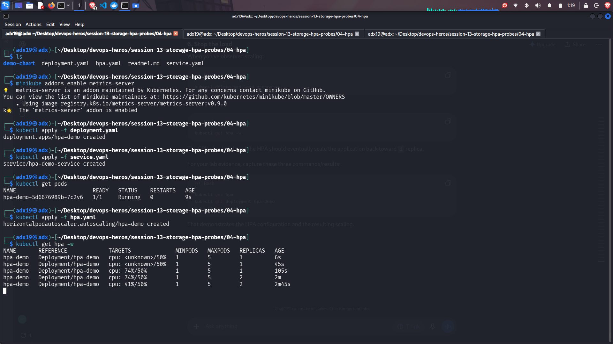
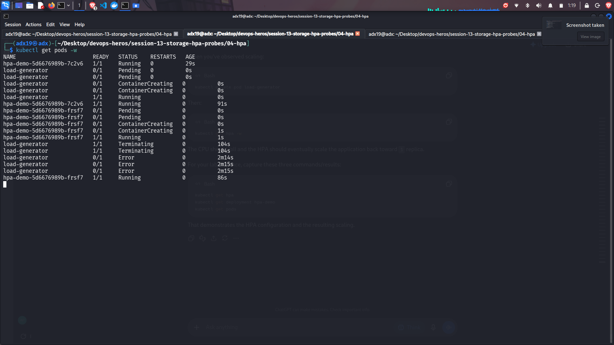
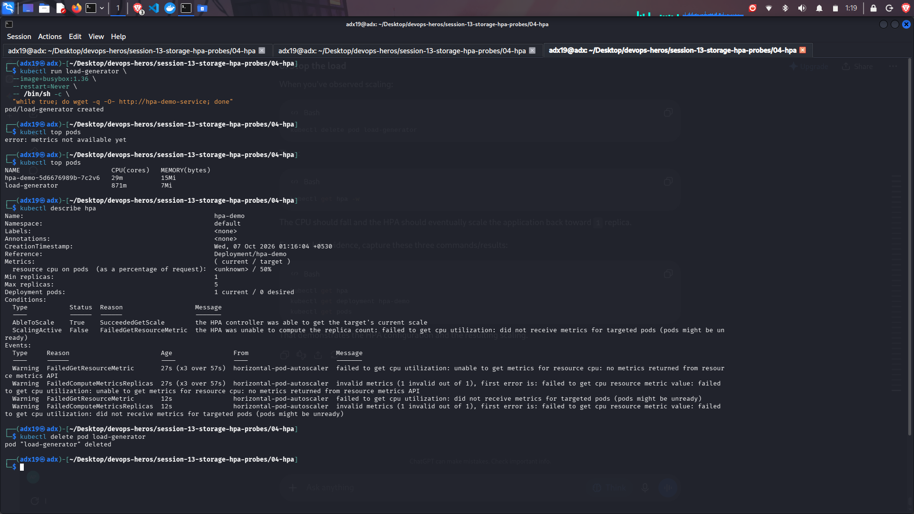

# Session 13 Assignment:

## Task 1: Volume Documentation:

****This is done inside the folder Assignment. Link to the README is given below****

[Volume Documentation](./Assignment/01-kubernetes-volumes/README.md)

---

## Task 2: hpa Practical:

### Screenshots:

---

## Task 3: Running Mini Project:

### Screenshots:

#### Task 1:

#### Task 2:

Terminal:

Browser:

#### Task 3:

