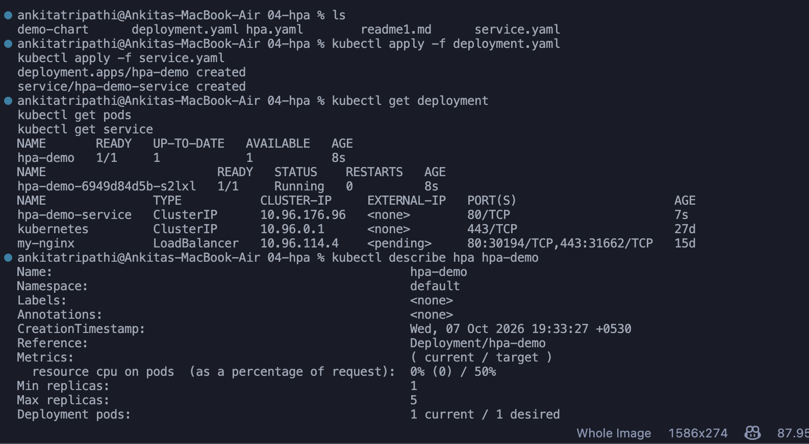
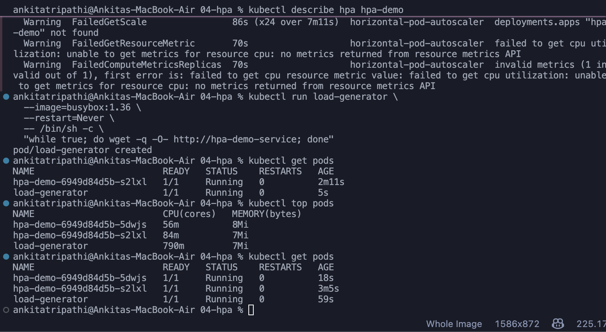
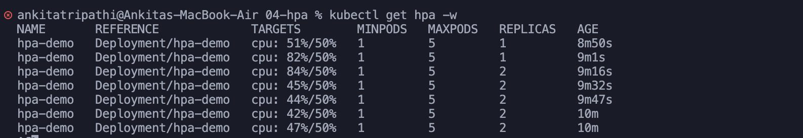

# Kubernetes Volumes

## Session 13 – Task 1: Kubernetes Volumes
**Name:** Ankita Tripathi  
**Roll Number:** 24bcs10062

### Objective

The objective of this task is to understand how Kubernetes manages storage for containers and Pods, including temporary storage, persistent storage, and dynamic storage provisioning.

This documentation covers:

1. emptyDir
2. hostPath
3. PersistentVolume (PV)
4. PersistentVolumeClaim (PVC)
5. StorageClass
6. Dynamic Provisioning

---

## 1. Introduction to Kubernetes Volumes

A Kubernetes Volume provides storage that can be accessed by containers running inside a Pod.

Normally, data written inside a container belongs to its filesystem. When the container is removed, this data may be lost.

Kubernetes Volumes provide a way to store and manage data separately from the container's filesystem.

**Why are volumes needed?**

- To store application data.
- To share files between containers in the same Pod.
- To preserve important data when Pods are deleted or recreated, using persistent storage.
- To manage application logs and other files.

**Basic Architecture:**

```text
Container
    |
    | Writes Data
    v
  Volume
    |
    v
Stored Data
```

---

## 2. emptyDir Volume

### What is emptyDir?

`emptyDir` is a temporary volume created when a Pod is assigned to a Kubernetes node.

It starts as an empty directory and can be shared between multiple containers in the same Pod.

The volume exists as long as the Pod remains assigned to that node.

If the Pod is deleted, the data stored in `emptyDir` is removed.

However, if an individual container restarts within the same Pod, the data remains available.

### Example YAML

File: `emptydir-pod.yaml`

```yaml
apiVersion: v1
kind: Pod
metadata:
  name: emptydir-demo
spec:
  containers:
    - name: nginx
      image: nginx:latest
      volumeMounts:
        - name: temporary-storage
          mountPath: /data
  volumes:
    - name: temporary-storage
      emptyDir: {}
```

### Practical Demonstration

**Step 1: Deploy the Pod**

```bash
kubectl apply -f emptydir-pod.yaml
```

**Step 2: Verify the Pod**

```bash
kubectl get pods
```

**Step 3: Create a file inside the volume**

```bash
kubectl exec -it emptydir-demo -- bash
echo "Hello Kubernetes" > /data/message.txt
cat /data/message.txt
exit
```

Expected output:

```text
Hello Kubernetes
```

**Step 4: Delete and recreate the Pod**

```bash
kubectl delete pod emptydir-demo
kubectl apply -f emptydir-pod.yaml
```

**Step 5: Check whether the file exists**

```bash
kubectl exec emptydir-demo -- cat /data/message.txt
```

Expected output:

```text
cat: /data/message.txt: No such file or directory
```

### Observation

The data stored in `emptyDir` is temporary. When the Pod is deleted and recreated, its previous data is lost.

### Use Cases

- Temporary files
- Caching
- Sharing data between containers
- Intermediate processing data

---

## 3. hostPath Volume

### What is hostPath?

A `hostPath` volume mounts a file or directory from the Kubernetes node's filesystem into a Pod.

Unlike `emptyDir`, the data is stored on the node itself.

This means data may remain available after a Pod is deleted, provided the new Pod accesses the same directory on the same node.

### Example YAML

File: `hostpath-pod.yaml`

```yaml
apiVersion: v1
kind: Pod
metadata:
  name: hostpath-demo
spec:
  containers:
    - name: nginx
      image: nginx:latest
      volumeMounts:
        - name: host-storage
          mountPath: /data
  volumes:
    - name: host-storage
      hostPath:
        path: /tmp/student-data
        type: DirectoryOrCreate
```

### Explanation

- `hostPath` specifies the directory on the Kubernetes node.
- `mountPath` specifies where that directory appears inside the container.
- `DirectoryOrCreate` creates the directory if it does not exist.

### Use Cases

- Local Kubernetes testing
- Accessing node-level files
- System monitoring
- Special node-level applications

### Limitations

- Storage is tied to a particular node.
- Data may not be available if the Pod moves to another node.
- It can introduce security risks by exposing host files to containers.
- It is generally not recommended as the default storage solution for production applications.

---

## 4. PersistentVolume (PV)

### What is a PersistentVolume?

A PersistentVolume (PV) is a storage resource available within a Kubernetes cluster.

It represents storage that can exist independently of an individual Pod.

PersistentVolumes can be created manually by an administrator or dynamically through a StorageClass.

**Simple Definition:**

PV = Storage available in the Kubernetes cluster.

### Example YAML

File: `pv.yaml`

```yaml
apiVersion: v1
kind: PersistentVolume
metadata:
  name: student-pv
spec:
  capacity:
    storage: 1Gi
  accessModes:
    - ReadWriteOnce
  persistentVolumeReclaimPolicy: Retain
  storageClassName: manual
  hostPath:
    path: /mnt/student-data
    type: DirectoryOrCreate
```

This example uses node-local storage for demonstration.

### Explanation

- `capacity`: Defines the available storage.
- `accessModes`: Defines how the volume can be accessed.
- `persistentVolumeReclaimPolicy`: Defines what happens when the volume is released.
- `storageClassName`: Identifies the storage class associated with the PV.
- `hostPath`: Defines the storage location on the node.

### Command

```bash
kubectl apply -f pv.yaml
kubectl get pv
```

Expected status before a claim binds:

```text
NAME         CAPACITY   ACCESS MODES   STATUS
student-pv   1Gi        RWO            Available
```

---

## 5. PersistentVolumeClaim (PVC)

### What is a PersistentVolumeClaim?

A PersistentVolumeClaim is a request for storage made by a user or application.

A PVC requests storage with specific requirements, such as capacity and access mode.

Kubernetes then matches the claim with a suitable PersistentVolume.

**Simple Definition:**

PVC = Request for storage.

### Architecture

```text
Pod
 |
 v
PVC (Storage Request)
 |
 v
PV (Available Storage)
 |
 v
Physical Storage
```

### Example YAML

File: `pvc.yaml`

```yaml
apiVersion: v1
kind: PersistentVolumeClaim
metadata:
  name: student-pvc
spec:
  accessModes:
    - ReadWriteOnce
  storageClassName: manual
  resources:
    requests:
      storage: 500Mi
```

### Practical Demonstration

**Step 1: Create the PersistentVolume**

```bash
kubectl apply -f pv.yaml
```

**Step 2: Create the PersistentVolumeClaim**

```bash
kubectl apply -f pvc.yaml
```

**Step 3: Verify the PVC**

```bash
kubectl get pvc
```

Expected output:

```text
NAME          STATUS   VOLUME
student-pvc   Bound    student-pv
```

The `Bound` status indicates that the PVC has been connected to a suitable PV.

### Using PVC in a Pod

File: `pod.yaml`

```yaml
apiVersion: v1
kind: Pod
metadata:
  name: storage-demo
spec:
  containers:
    - name: nginx
      image: nginx:latest
      volumeMounts:
        - name: persistent-storage
          mountPath: /data
  volumes:
    - name: persistent-storage
      persistentVolumeClaim:
        claimName: student-pvc
```

Apply:

```bash
kubectl apply -f pod.yaml
```

Create a file:

```bash
kubectl exec storage-demo -- sh -c \
  'echo "Kubernetes Storage" > /data/message.txt'
```

Delete and recreate the Pod:

```bash
kubectl delete pod storage-demo
kubectl apply -f pod.yaml
```

Verify the data:

```bash
kubectl exec storage-demo -- cat /data/message.txt
```

Expected output:

```text
Kubernetes Storage
```

### Observation

The Pod can be deleted and recreated without losing the stored data, as long as it reconnects to the same persistent storage.

In this example, the PV uses node-local storage, so the demonstration assumes access to the same node.

---

## 6. StorageClass

### What is a StorageClass?

A StorageClass defines a category of storage available in a Kubernetes cluster.

It specifies how storage should be provisioned.

StorageClasses are commonly used to automatically create PersistentVolumes when applications request storage.

### Why is StorageClass needed?

Without dynamic provisioning, administrators may need to create PersistentVolumes manually.

This becomes difficult when many applications require storage.

StorageClass helps automate the process.

### Architecture

```text
PersistentVolumeClaim
         |
         v
    StorageClass
         |
         v
     Provisioner
         |
         v
  PersistentVolume
```

### Practical Demonstration

**Step 1: Check available StorageClasses**

```bash
kubectl get storageclass
```

Example Minikube output:

```text
NAME                 PROVISIONER
standard (default)   k8s.io/minikube-hostpath
```

**Step 2: View StorageClass details**

```bash
kubectl describe storageclass standard
```

This displays information such as:

- Provisioner
- Reclaim policy
- Volume binding mode
- Default StorageClass information

### Use Cases

- Automatic storage management
- Different types of storage
- Cloud storage integration
- Simplified Kubernetes deployments

---

## 7. Dynamic Provisioning

### What is Dynamic Provisioning?

Dynamic Provisioning is the process of automatically creating a PersistentVolume when a PersistentVolumeClaim requests storage.

Instead of manually creating a PV, Kubernetes uses a StorageClass and its provisioner to create the required storage.

### Architecture

```text
Application
     |
     v
    PVC
     |
     v
StorageClass
     |
     v
Provisioner
     |
     v
PV Created Automatically
```

### Example YAML

File: `dynamic-pvc.yaml`

```yaml
apiVersion: v1
kind: PersistentVolumeClaim
metadata:
  name: dynamic-pvc
spec:
  accessModes:
    - ReadWriteOnce
  storageClassName: standard
  resources:
    requests:
      storage: 500Mi
```

### Practical Demonstration

**Step 1: Create the PVC**

```bash
kubectl apply -f dynamic-pvc.yaml
```

**Step 2: Check the PVC**

```bash
kubectl get pvc
```

Expected output:

```text
NAME          STATUS   VOLUME
dynamic-pvc   Bound    pvc-xxxxxxxx
```

**Step 3: Check PersistentVolumes**

```bash
kubectl get pv
```

A new PersistentVolume should appear after successful provisioning and binding.

### Observation

A PersistentVolume can be created automatically without manually defining a PV YAML file.

This process is called Dynamic Provisioning.

Note: The example assumes a StorageClass named `standard` and a working storage provisioner are available.

---

## 8. Kubernetes Volume Comparison

| Volume Type | Purpose | Data Persistence |
|---|---|---|
| emptyDir | Temporary Pod storage | Lost when Pod is removed |
| hostPath | Access node filesystem | Tied to the node |
| PersistentVolume | Cluster storage resource | Independent of an individual Pod |
| PersistentVolumeClaim | Request for storage | Uses storage provided by a PV |
| StorageClass | Defines storage provisioning | Depends on provisioned storage |
| Dynamic Provisioning | Automatically creates PVs | Depends on storage configuration |

---

## 9. Useful Kubernetes Commands

```bash
# Check running Pods
kubectl get pods

# Check PersistentVolumes
kubectl get pv

# Check PersistentVolumeClaims
kubectl get pvc

# Check StorageClasses
kubectl get storageclass

# Describe a PersistentVolume
kubectl describe pv student-pv

# Describe a PersistentVolumeClaim
kubectl describe pvc student-pvc

# Check Pod details
kubectl describe pod storage-demo

# Access a running container
kubectl exec -it storage-demo -- bash

# Delete a Pod
kubectl delete pod storage-demo
```

---

## 10. Key Learnings

From this task, the main concepts covered are:

1. Kubernetes Volumes provide storage to containers.
2. `emptyDir` is temporary storage linked to a Pod's lifetime.
3. `hostPath` allows containers to access storage on a Kubernetes node.
4. PersistentVolumes represent storage resources available in a cluster.
5. PersistentVolumeClaims allow applications to request storage.
6. StorageClasses define how storage is provisioned.
7. Dynamic Provisioning automatically creates storage when needed.
8. Persistent storage helps applications retain important data when Pods are recreated.

---

## 11. References

- [Kubernetes Volumes](https://kubernetes.io/docs/concepts/storage/volumes/)
- [Persistent Volumes](https://kubernetes.io/docs/concepts/storage/persistent-volumes/)
- [Storage Classes](https://kubernetes.io/docs/concepts/storage/storage-classes/)

---

**Session 13 – Task 1: Kubernetes Volumes Documentation**
# Task 2: HPA Hands-on
**Name:** Ankita Tripathi  
**Roll Number:** 24bcs10062
## Objective

The objective of this task is to configure and test the Kubernetes Horizontal Pod Autoscaler (HPA). The HPA automatically increases or decreases the number of application pods based on CPU utilization.

The HPA was configured with:

- Minimum replicas: 1
- Maximum replicas: 5
- Target CPU utilization: 50%

---

## 1. Deploy the Application and Configure HPA

The application was deployed using a Kubernetes Deployment and exposed using a ClusterIP Service.

The HPA was configured for the `hpa-demo` deployment with a target CPU utilization of 50%.

Commands used:

```bash
kubectl apply -f deployment.yaml
kubectl apply -f service.yaml
kubectl apply -f hpa.yaml

kubectl get deployment
kubectl get pods
kubectl get service
kubectl describe hpa hpa-demo
```

The application pod was successfully deployed and the HPA was configured with a minimum of 1 replica and a maximum of 5 replicas.



---

## 2. Generate Load and Observe CPU Utilization

A BusyBox pod was used as a load generator. It continuously sent HTTP requests to the `hpa-demo-service`.

Command used:

```bash
kubectl run load-generator \
  --image=busybox:1.36 \
  --restart=Never \
  -- /bin/sh -c \
  "while true; do wget -q -O- http://hpa-demo-service; done"
```

CPU utilization and running pods were observed using:

```bash
kubectl top pods
kubectl get pods
```

Under load, CPU utilization increased and Kubernetes started additional instances of the `hpa-demo` pod.



---

## 3. Observe HPA Auto-scaling

The HPA was monitored continuously using:

```bash
kubectl get hpa -w
```

Initially, the deployment had **1 replica**.

During load generation, CPU utilization increased above the configured **50% target**, reaching values such as **82% and 84%**.

As a result, the Horizontal Pod Autoscaler automatically increased the number of replicas from **1 to 2**.



---

## Useful Commands

```bash
kubectl get hpa
kubectl get pods
kubectl top pods
kubectl describe hpa hpa-demo
```

---

## Result

The Kubernetes Horizontal Pod Autoscaler was successfully configured and tested.

The experiment demonstrated that:

- The application was successfully deployed.
- HPA monitored CPU utilization.
- A load generator increased the application workload.
- CPU utilization increased beyond the 50% target.
- HPA automatically scaled the deployment from 1 pod to 2 pods.
- The scaling behavior was successfully observed using Kubernetes commands.

Therefore, the Horizontal Pod Autoscaler successfully performed automatic pod scaling based on CPU utilization.

# Task 3: Mini Project: Production-Ready Kubernetes Web App

**Name:** Ankita Tripathi  
**Roll Number:** 24bcs10062

---

## 1. Project Overview

This mini project demonstrates a production-ready Kubernetes web application using persistent storage, health probes, resource management, and Horizontal Pod Autoscaling.

The project implements:

- Persistent storage using a PersistentVolumeClaim (PVC)
- Nginx web application deployed using Kubernetes Deployment
- ClusterIP Service for application communication
- Startup, Readiness, and Liveness probes
- CPU resource requests and limits
- Horizontal Pod Autoscaler (HPA)
- Load generation using BusyBox
- CPU monitoring using Metrics Server

---

## 2. Architecture

```text
                    Service: web-service
                           |
                         Port 80
                           |
               +-----------+-----------+
               |                       |
               v                       v
          Web App Pod             Web App Pod
             Nginx                   Nginx
               |                       |
               +----------+------------+
                          |
                     /data mount
                          |
                          v
                    PVC: web-data
                    500Mi / RWO


                Horizontal Pod Autoscaler
                         |
                  Target CPU: 50%
                  Min Replicas: 2
                  Max Replicas: 5
                         |
                         v
                    Deployment
```

---

## 3. Project Structure

```text
mini-project/
├── namespace.yaml
├── pvc.yaml
├── deployment.yaml
├── service.yaml
├── hpa.yaml
├── README.md
├── 4.png
├── 5.png
├── 6.png
├── 7.png
└── 8.png
```

---

## 4. Persistent Storage

A PersistentVolumeClaim named `web-data` was created to provide persistent storage to the application.

Configuration:

- Capacity requested: **500Mi**
- Access Mode: **ReadWriteOnce (RWO)**
- Storage Class: **standard**
- Container mount path: `/data`

Commands used:

```bash
kubectl apply -f pvc.yaml
kubectl get pvc -n production-webapp
```

The PVC successfully reached the `Bound` state.


---

## 5. Application Deployment

The Nginx web application was deployed using a Kubernetes Deployment with two initial replicas.

The application was exposed internally using a ClusterIP Service named `web-service`.

Commands used:

```bash
kubectl apply -f deployment.yaml
kubectl apply -f service.yaml

kubectl get deployment,pods,service -n production-webapp
```

Both application Pods successfully reached the `Running` and `Ready` states.


---

## 6. Storage Persistence Test

To test persistent storage, student information was written to `/data/student.txt`.

```bash
POD_NAME=$(kubectl get pods -n production-webapp \
-l app=web-app \
-o jsonpath='{.items[0].metadata.name}')
```

The file was created using:

```bash
kubectl exec -n production-webapp "$POD_NAME" -- \
sh -c 'echo "Student: Ankita Tripathi - 24bcs10062" > /data/student.txt'
```

The contents were verified:

```bash
kubectl exec -n production-webapp "$POD_NAME" -- \
cat /data/student.txt
```

Output:

```text
Student: Ankita Tripathi - 24bcs10062
```

The Pod was then deleted:

```bash
kubectl delete pod -n production-webapp "$POD_NAME"
```

Kubernetes automatically created a replacement Pod.

The file stored on the persistent volume remained available after Pod recreation.


### Result

The experiment demonstrates that data stored using the PersistentVolumeClaim is not tied to the lifecycle of an individual Pod.

---

## 7. Application Health Probes

Three Kubernetes health probes were configured.

### Startup Probe

The Startup Probe determines whether the application has successfully started.

### Readiness Probe

The Readiness Probe determines whether the Pod is ready to receive traffic from the Service.

### Liveness Probe

The Liveness Probe checks whether the application remains healthy and responsive.

The probes were verified using:

```bash
kubectl describe deployment web-app -n production-webapp
```

The deployment successfully showed:

```text
Liveness
Readiness
Startup
```

The same deployment also showed the persistent `/data` volume mount using the `web-data` PVC.


---

## 8. Horizontal Pod Autoscaler

The application uses a Horizontal Pod Autoscaler configured using `hpa.yaml`.

HPA configuration:

- Minimum replicas: **2**
- Maximum replicas: **5**
- Target CPU utilization: **50%**

The HPA was deployed and verified using:

```bash
kubectl apply -f hpa.yaml
kubectl get hpa -n production-webapp
```

The HPA continuously monitors average CPU utilization of the application Pods.

---

## 9. Load Generator and HPA Monitoring

A BusyBox Pod was deployed as a load generator.

```bash
kubectl run load-generator \
  -n production-webapp \
  --image=busybox:1.36 \
  --restart=Never \
  -- /bin/sh -c \
  "while true; do wget -q -O- http://web-service; done"
```

The HPA was monitored using:

```bash
kubectl get hpa -n production-webapp -w
```

During the experiment, CPU utilization increased as follows:

```text
1%  ->  21%  ->  42%  ->  43%  ->  45%
```

The configured HPA CPU target was **50%**.

The workload therefore demonstrated that Metrics Server and HPA were successfully monitoring the application's CPU utilization. During the captured observation period, utilization approached but did not exceed the configured target for long enough to trigger additional scaling, so the deployment remained at its minimum of **2 replicas**.


---

## 10. HPA and Kubernetes Commands

Useful commands used during the experiment:

```bash
kubectl get hpa -n production-webapp

kubectl get pods -n production-webapp

kubectl top pods -n production-webapp

kubectl describe hpa web-app-hpa -n production-webapp

kubectl get pvc -n production-webapp

kubectl describe deployment web-app -n production-webapp
```

---

## 11. Mini Project Components

The implementation consists of:

### `namespace.yaml`

Creates the dedicated:

```text
production-webapp
```

namespace.

### `pvc.yaml`

Creates the `web-data` PersistentVolumeClaim with 500Mi persistent storage.

### `deployment.yaml`

Defines:

- Nginx application
- 2 initial replicas
- CPU and memory resource configuration
- `/data` persistent volume mount
- Startup Probe
- Readiness Probe
- Liveness Probe

### `service.yaml`

Creates the `web-service` ClusterIP Service on port 80.

### `hpa.yaml`

Configures Horizontal Pod Autoscaling between 2 and 5 replicas with a target CPU utilization of 50%.

---

## 12. Results

The following features were successfully implemented and verified:

- PersistentVolumeClaim successfully reached `Bound` state.
- Nginx application Pods successfully reached `Running` state.
- Persistent data remained available after Pod deletion and recreation.
- Startup Probe was successfully configured.
- Readiness Probe was successfully configured.
- Liveness Probe was successfully configured.
- CPU requests and limits were configured.
- Metrics Server successfully reported application CPU utilization.
- Horizontal Pod Autoscaler successfully monitored CPU utilization.
- BusyBox load generator successfully generated application traffic.
- CPU utilization increased significantly during load generation.

---

## 13. Conclusion

The mini project demonstrates the integration of important Kubernetes production concepts in a single application.

PersistentVolumeClaim provides durable application storage, health probes allow Kubernetes to monitor application health, resource requests provide the information required for CPU-based autoscaling, and the Horizontal Pod Autoscaler dynamically evaluates application CPU utilization.

The project successfully demonstrates persistent storage, health monitoring, resource management, load generation, metrics collection, and Horizontal Pod Autoscaler configuration in Kubernetes.