# Mini Project: Production-Ready Kubernetes Web App

## 1. Project Overview
In this hands-on capstone for Session 13, you will deploy a production-grade web application on Kubernetes combining three fundamental pillars of cloud-native infrastructure:
1. **State Persistence**: A PersistentVolumeClaim (PVC) allowing data inside `/data` to outlive Pod deletions and restarts.
2. **Elastic Scaling**: A Horizontal Pod Autoscaler (HPA) using CPU metrics to scale Pods between 2 and 5 replicas.
3. **Application Health Diagnostics**: A complete triage system configuring Startup, Readiness, and Liveness probes.

---

## 2. Architecture Diagram

```text
                           [ Service: web-service ]
                                      │ (Port 80)
                ┌─────────────────────┼─────────────────────┐
                │                     │                     │
                ▼                     ▼                     ▼
          [ Pod: web-app-1 ]    [ Pod: web-app-2 ]    [ Pod: web-app-N ]
          ├─ Startup Probe      ├─ Startup Probe      ├─ Startup Probe
          ├─ Readiness Probe    ├─ Readiness Probe    ├─ Readiness Probe
          ├─ Liveness Probe     ├─ Liveness Probe     ├─ Liveness Probe
          ├─ CPU Requests       ├─ CPU Requests       ├─ CPU Requests
          └─────────┬───────────┴──────────┬──────────┴─────────┬───────┘
                    │                      │                    │
                    └──────────────────────┼────────────────────┘
                                           │
                                           ▼
                             [ HPA: web-app-hpa (50% CPU) ]
                                           ▲
                                           │ pulls metrics
                                   [ Metrics Server ]
Pod
 │
 └── VolumeMount: /data
       │
       └── PVC: web-data (500Mi, ReadWriteOnce)
             │
             └── StorageClass: standard (k8s.io/minikube-hostpath)
                   │
                   └── Physical/Host Persistent Storage
```

---

## 3. Project Structure
```text
mini-project/
├── namespace.yaml       # Dedicated namespace: production-webapp
├── pvc.yaml             # 500Mi ReadWriteOnce storage claim
├── deployment.yaml      # 2 replicas, probes, volume mounts, resource limits
├── service.yaml         # ClusterIP service exposing port 80
├── hpa.yaml             # Autoscaler (min: 2, max: 5, target: 50% CPU)
├── load-generator.yaml  # ApacheBench (ab) load generator Deployment used for the HPA test
├── screenshots/         # Execution screenshots referenced in "Execution Results"
└── README.md            # This documentation and assignment guide
```

---

## 4. Prerequisites
- Minikube or Docker Desktop Kubernetes cluster running.
- `kubectl` CLI configured.
- Metrics Server enabled (`minikube addons enable metrics-server`).

---

## 5. Step-by-Step Deployment Guide

### Step 5.1: Create Namespace
```bash
kubectl apply -f namespace.yaml
```
Output:
```text
namespace/production-webapp created
```

### Step 5.2: Create PersistentVolumeClaim
```bash
kubectl apply -f pvc.yaml
kubectl get pvc -n production-webapp
```
Expected output:
```text
NAME       STATUS   VOLUME                                     CAPACITY   ACCESS MODES   STORAGECLASS   AGE
web-data   Bound    pvc-4b123456-789a-bcde-f012-3456789abcde   500Mi      RWO            standard       5s
```

### Step 5.3: Deploy Application & Service
```bash
kubectl apply -f deployment.yaml
kubectl apply -f service.yaml
kubectl get pods -n production-webapp
```
Expected output:
```text
NAME                       READY   STATUS    RESTARTS   AGE
web-app-7988df964b-abcde   1/1     Running   0          25s
web-app-7988df964b-fghij   1/1     Running   0          25s
```

### Step 5.4: Deploy Horizontal Pod Autoscaler
```bash
kubectl apply -f hpa.yaml
kubectl get hpa -n production-webapp
```
Expected output:
```text
NAME          REFERENCE            TARGETS   MINPODS   MAXPODS   REPLICAS   AGE
web-app-hpa   Deployment/web-app   0%/50%    2         5         2          30s
```

---

## 6. Verification Tasks

### Task 1: Verify Storage Persistence
1. Pick one of the running Pods and write your name to `/data/student.txt`:
```bash
POD_NAME=$(kubectl get pods -n production-webapp -l app=web-app -o jsonpath='{.items[0].metadata.name}')
kubectl exec -n production-webapp "$POD_NAME" -- sh -c 'echo "Student: Jane Doe" > /data/student.txt'
```

2. Confirm the file exists:
```bash
kubectl exec -n production-webapp "$POD_NAME" -- cat /data/student.txt
```
Output:
```text
Student: Jane Doe
```

3. Delete the Pod:
```bash
kubectl delete pod -n production-webapp "$POD_NAME"
```

4. Wait for the new Pod to reach `Running` state and check the file again:
```bash
NEW_POD=$(kubectl get pods -n production-webapp -l app=web-app -o jsonpath='{.items[0].metadata.name}')
kubectl exec -n production-webapp "$NEW_POD" -- cat /data/student.txt
```
Expected output:
```text
Student: Jane Doe
```
*Result: The Pod was terminated and rescheduled, but the data remained completely intact on the PersistentVolume.*

---

### Task 2: Service Verification
Forward port 80 to your local machine:
```bash
kubectl port-forward -n production-webapp svc/web-service 8080:80
```
Open a browser or curl:
```bash
curl http://localhost:8080
```
Expected output:
```html
<!DOCTYPE html>
<html>
<head>
<title>Welcome to nginx!</title>
...
```

---

### Task 3: Trigger HPA Elastic Scaling
In a separate terminal, launch a load generator to simulate traffic spike:
```bash
kubectl run load-generator -n production-webapp \
  --image=busybox:1.36 \
  --restart=Never \
  -- /bin/sh -c "while true; do wget -q -O- http://web-service; done"
```

Watch the autoscaler scale out:
```bash
kubectl get hpa -n production-webapp -w
```
Expected log over 2–3 minutes:
```text
NAME          REFERENCE            TARGETS    MINPODS   MAXPODS   REPLICAS   AGE
web-app-hpa   Deployment/web-app   0%/50%     2         5         2          1m
web-app-hpa   Deployment/web-app   110%/50%   2         5         2          2m
web-app-hpa   Deployment/web-app   95%/50%    2         5         4          3m
web-app-hpa   Deployment/web-app   45%/50%    2         5         5          4m
```

Stop load and watch scale down:
```bash
kubectl delete pod load-generator -n production-webapp
kubectl get hpa -n production-webapp -w
```
*After the 5-minute stabilization window, replicas will gradually reduce back to 2.*

---

## 7. Probe Diagnostics Reference
| Probe | Target Question | Action on Failure |
| :--- | :--- | :--- |
| **Startup Probe** | Has the process initialized? | Restarts container (disables other probes until it passes) |
| **Readiness Probe** | Can the Pod receive user traffic? | Drops Pod IP from Service Endpoints (does NOT restart) |
| **Liveness Probe** | Is the container alive and responsive? | Restarts container via Kubelet |

---

## 8. Troubleshooting Guide

### Issue 1: PVC stuck in `Pending`
- **Check**: `kubectl describe pvc web-data -n production-webapp`
- **Root Cause**: Missing default StorageClass or hostpath volume plugin disabled.
- **Fix**: Run `minikube addons enable default-storageclass` or verify StorageClass provisioner with `kubectl get sc`.

### Issue 2: HPA displays `TARGETS: <unknown>/50%`
- **Check**: `kubectl top pods -n production-webapp`
- **Root Cause**: Either Metrics Server is disabled or the container spec lacks `resources.requests.cpu`.
- **Fix**: Enable metrics addon (`minikube addons enable metrics-server`) and ensure `cpu: 100m` request is defined.

### Issue 3: CrashLoopBackOff on Application Pods
- **Check**: `kubectl describe pod <pod-name> -n production-webapp`
- **Root Cause**: Probe path misconfiguration or port mismatch in `livenessProbe`.
- **Fix**: Verify probe `httpGet.path` matches an endpoint that returns HTTP 200–399.

---

## 9. Bonus Challenges for Fast Finishers
1. **Challenge 1 (Target Tuning)**: Lower the HPA CPU threshold from `50%` to `30%` in `hpa.yaml`, reapply, and observe how much faster the workload scales out.
2. **Challenge 2 (Readiness Gating)**: Modify `readinessProbe.httpGet.path` to `/does-not-exist`. Run `kubectl get endpoints -n production-webapp web-service`. Notice that Pod status is `Running`, but `READY` is `0/1` and the endpoints list is completely empty!
3. **Challenge 3 (Liveness Restart Loop)**: Modify `livenessProbe.httpGet.path` to `/crash`. Observe the `RESTARTS` count increment every 15 seconds in `kubectl get pods -w`.

---

## Execution Results

All steps executed on a **single-node Minikube v1.39.0** cluster (profile `session13`, 4 CPUs / 3000 MB),
Kubernetes **v1.37.0**, `metrics-server` **v0.9.0** addon, macOS arm64. All output below is copied from the
real run; long outputs are excerpted with `...`.

| File | What it creates |
| --- | --- |
| `namespace.yaml` | Namespace `production-webapp` |
| `pvc.yaml` | PVC `web-data`, **500Mi**, `ReadWriteOnce`, default StorageClass (`standard`) |
| `deployment.yaml` | Deployment `web-app`, **2 replicas**, `nginx:1.27`, startup/readiness/liveness probes on `/`, CPU **request 100m** / limit 200m, memory 64Mi / 128Mi, PVC mounted at `/data` |
| `service.yaml` | ClusterIP Service `web-service` on port 80 |
| `hpa.yaml` | `autoscaling/v2` HPA `web-app-hpa`: min **2**, max **5**, target **50%** average CPU (default 300s scale-down window) |
| `load-generator.yaml` | Deployment `load-generator` (`httpd:2.4-alpine`) running ApacheBench `ab -k -c 20` against `$WEB_SERVICE_SERVICE_HOST`, CPU limit 500m |

---

### Step 1: Namespace and PVC (guide 5.1, 5.2)

```bash
kubectl apply -f namespace.yaml
kubectl apply -f pvc.yaml
kubectl get pvc -n production-webapp
kubectl get pv
```

```text
$ kubectl apply -f namespace.yaml
namespace/production-webapp created
$ kubectl apply -f pvc.yaml
persistentvolumeclaim/web-data created
$ sleep 3; kubectl get pvc -n production-webapp
NAME       STATUS   VOLUME                                     CAPACITY   ACCESS MODES   STORAGECLASS   VOLUMEATTRIBUTESCLASS   AGE
web-data   Bound    pvc-b14b8306-59ab-44a3-aa15-a62013cafff8   500Mi      RWO            standard       <unset>                 3s
$ kubectl get pv
NAME                                       CAPACITY   ACCESS MODES   RECLAIM POLICY   STATUS   CLAIM                        STORAGECLASS   VOLUMEATTRIBUTESCLASS   REASON   AGE
pvc-b14b8306-59ab-44a3-aa15-a62013cafff8   500Mi      RWO            Delete           Bound    production-webapp/web-data   standard       <unset>                          3s
```

The PVC was `Bound` within 3 seconds. No PV was written by hand: the PV
`pvc-b14b8306-...` was created by **dynamic provisioning** from the default StorageClass.

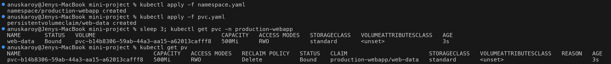

```text
$ kubectl get storageclass
NAME                 PROVISIONER                RECLAIMPOLICY   VOLUMEBINDINGMODE   ALLOWVOLUMEEXPANSION   AGE
standard (default)   k8s.io/minikube-hostpath   Delete          Immediate           false                  2m26s
$ kubectl get events -n production-webapp --field-selector involvedObject.name=web-data -o custom-columns=REASON:.reason,MESSAGE:.message | cut -c1-120
REASON                  MESSAGE
ExternalProvisioning    Waiting for a volume to be created either by the external provisioner 'k8s.io/minikube-hostpath'
Provisioning            External provisioner is provisioning volume for claim "production-webapp/web-data"
ProvisioningSucceeded   Successfully provisioned volume pvc-b14b8306-59ab-44a3-aa15-a62013cafff8
```

`standard` is the default class, provisioner `k8s.io/minikube-hostpath`, binding mode `Immediate` (so the PVC
binds before any pod uses it) and reclaim policy `Delete`. The events show the full provisioning sequence.

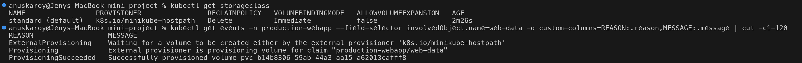

---

### Step 2: Deploy the application and Service (guide 5.3)

```bash
kubectl apply -f deployment.yaml
kubectl apply -f service.yaml
kubectl rollout status deployment/web-app -n production-webapp
kubectl get pods -n production-webapp -o wide
kubectl get svc,endpointslices -n production-webapp
```

```text
$ kubectl rollout status deployment/web-app -n production-webapp
Waiting for deployment "web-app" rollout to finish: 0 of 2 updated replicas are available...
Waiting for deployment "web-app" rollout to finish: 1 of 2 updated replicas are available...
deployment "web-app" successfully rolled out
$ kubectl get pods -n production-webapp -o wide
NAME                      READY   STATUS    RESTARTS   AGE   IP           NODE        NOMINATED NODE   READINESS GATES
web-app-d45775485-6c2zv   1/1     Running   0          10s   10.244.0.4   session13   <none>           <none>
web-app-d45775485-6rsbx   1/1     Running   0          10s   10.244.0.5   session13   <none>           <none>
$ kubectl get svc,endpointslices -n production-webapp
NAME                  TYPE        CLUSTER-IP      EXTERNAL-IP   PORT(S)   AGE
service/web-service   ClusterIP   10.105.73.217   <none>        80/TCP    9s

NAME                                               ADDRESSTYPE   PORTS   ENDPOINTS               AGE
endpointslice.discovery.k8s.io/web-service-qcjxp   IPv4          80      10.244.0.5,10.244.0.4   9s
```

Both replicas are `1/1 Running` and the Service EndpointSlice lists **both pod IPs** (`10.244.0.4`,
`10.244.0.5`), i.e. both pods passed their readiness probe and receive traffic.

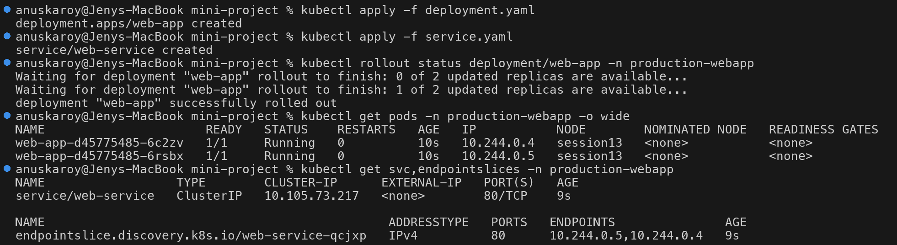

#### Probes and resources

```text
$ kubectl describe pod -n production-webapp -l app=web-app | grep -E '^Name:|Startup|Readiness|Liveness|Requests|Limits|cpu|memory|/data from' | head -11
Name:             web-app-d45775485-6c2zv
    Limits:
      cpu:     200m
      memory:  128Mi
    Requests:
      cpu:        100m
      memory:     64Mi
    Liveness:     http-get http://:80/ delay=5s timeout=2s period=5s successThreshold=1 failureThreshold=3
    Readiness:    http-get http://:80/ delay=5s timeout=2s period=5s successThreshold=1 failureThreshold=2
    Startup:      http-get http://:80/ delay=0s timeout=1s period=2s successThreshold=1 failureThreshold=30
      /data from persistent-storage (rw)
```

All three probes, the requests/limits and the `/data` mount from the PVC are applied exactly as in
`deployment.yaml`. The startup probe allows up to 30 x 2s = 60s for nginx to start before liveness takes over.

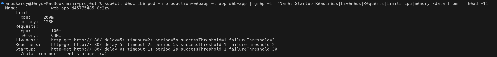

---

### Step 3: Deploy and verify the HPA (guide 5.4)

```bash
kubectl apply -f hpa.yaml
kubectl get hpa -n production-webapp
kubectl top pods -n production-webapp
kubectl describe hpa web-app-hpa -n production-webapp
```

```text
$ kubectl apply -f hpa.yaml
horizontalpodautoscaler.autoscaling/web-app-hpa created
$ sleep 45; kubectl get hpa -n production-webapp
NAME          REFERENCE            TARGETS       MINPODS   MAXPODS   REPLICAS   AGE
web-app-hpa   Deployment/web-app   cpu: 1%/50%   2         5         2          45s
$ kubectl top pods -n production-webapp
NAME                      CPU(cores)   MEMORY(bytes)
web-app-d45775485-6c2zv   1m           7Mi
web-app-d45775485-6rsbx   1m           7Mi
```

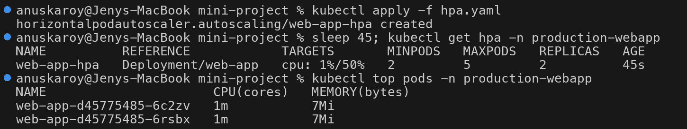

```text
$ kubectl describe hpa web-app-hpa -n production-webapp | sed -n '/^Metrics/,/^Max/p;/^Conditions/,/^Events/p'
Metrics:                                               ( current / target )
  resource cpu on pods  (as a percentage of request):  1% (1m) / 50%
Min replicas:                                          2
Max replicas:                                          5
Conditions:
  Type            Status  Reason               Message
  ----            ------  ------               -------
  AbleToScale     True    ScaleDownStabilized  recent recommendations were higher than current one, applying the highest recent recommendation
  ScalingActive   True    ValidMetricFound     the HPA was able to successfully calculate a replica count from cpu resource utilization (percentage of request)
  ScalingLimited  False   DesiredWithinRange   the desired count is within the acceptable range
Events:
```

- `cpu: 1%/50%`: the metric is valid (1m used / 100m request), not `<unknown>`.
- `ScalingActive True / ValidMetricFound`: metrics-server is feeding the HPA correctly.
- `AbleToScale True / ScaleDownStabilized`: at 1% the raw recommendation is 1 pod, but the HPA is holding
  the higher recent recommendation (2 = current) inside the 300s scale-down window. Since `minReplicas` is 2
  anyway, nothing would change; this condition is normal right after creation.

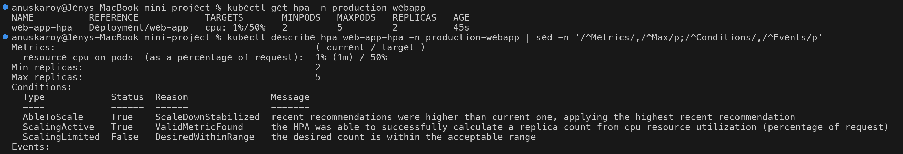

---

### Step 4: Storage persistence (guide Task 1)

```text
$ POD_NAME=$(kubectl get pods -n production-webapp -l app=web-app -o jsonpath='{.items[0].metadata.name}'); echo $POD_NAME
web-app-d45775485-6c2zv
$ kubectl exec -n production-webapp web-app-d45775485-6c2zv -- sh -c 'echo "Student: Anuska Roy" > /data/student.txt'
$ kubectl exec -n production-webapp web-app-d45775485-6c2zv -- cat /data/student.txt
Student: Anuska Roy
$ kubectl exec -n production-webapp web-app-d45775485-6rsbx -- cat /data/student.txt
Student: Anuska Roy
```

The file written from pod A (`6c2zv`) is immediately readable from pod B (`6rsbx`): both replicas mount the
**same** PVC. This works with `ReadWriteOnce` because RWO is enforced **per node**, not per pod, and both
pods run on the single node `session13`. (`ReadWriteOncePod` would forbid the second pod from mounting it.)

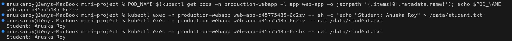

```text
$ kubectl delete pod -n production-webapp web-app-d45775485-6c2zv
pod "web-app-d45775485-6c2zv" deleted from production-webapp namespace
$ kubectl wait --for=condition=Ready pod -n production-webapp -l app=web-app --timeout=90s
pod/web-app-d45775485-6rsbx condition met
pod/web-app-d45775485-lzx4q condition met
$ kubectl get pods -n production-webapp -l app=web-app
NAME                      READY   STATUS    RESTARTS   AGE
web-app-d45775485-6rsbx   1/1     Running   0          108s
web-app-d45775485-lzx4q   1/1     Running   0          9s
$ NEW_POD=$(kubectl get pods -n production-webapp -l app=web-app --sort-by=.metadata.creationTimestamp -o jsonpath='{.items[-1].metadata.name}'); echo $NEW_POD; kubectl exec -n production-webapp $NEW_POD -- cat /data/student.txt
web-app-d45775485-lzx4q
Student: Anuska Roy
```

Pod A was deleted, the ReplicaSet created a replacement (`lzx4q`), and the replacement reads the same file:
the data lives on the PersistentVolume, not in the pod. (The `NEW_POD` selector was changed to pick the
newest pod by `creationTimestamp`, so the check is guaranteed to run in the replacement pod and not in the
surviving one.)

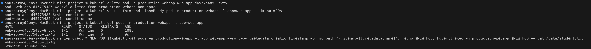

---

### Step 5: Service verification (guide Task 2)

```text
$ kubectl port-forward -n production-webapp svc/web-service 8080:80 &
Forwarding from 127.0.0.1:8080 -> 80
Forwarding from [::1]:8080 -> 80
Handling connection for 8080
Handling connection for 8080
$ curl -s http://localhost:8080 | head -6
<!DOCTYPE html>
<html>
<head>
<title>Welcome to nginx!</title>
<style>
html { color-scheme: light dark; }
$ curl -s -o /dev/null -w '%{http_code}\n' http://localhost:8080
200
```

The Service answers with the nginx welcome page and **HTTP 200**.

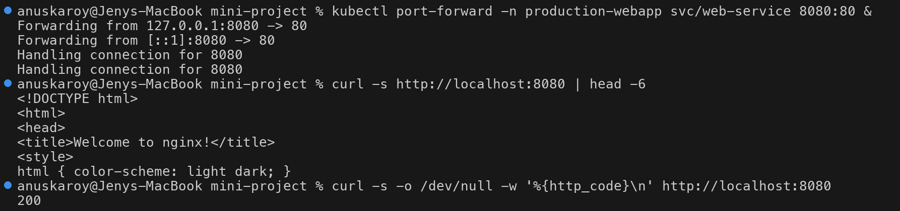

---

### Step 6: HPA load test (guide Task 3)

#### 6a. One load generator: below target, no scaling

```text
$ kubectl apply -f load-generator.yaml
deployment.apps/load-generator created
$ kubectl rollout status deployment/load-generator -n production-webapp
Waiting for deployment "load-generator" rollout to finish: 0 of 1 updated replicas are available...
deployment "load-generator" successfully rolled out
$ kubectl get pods -n production-webapp
NAME                            READY   STATUS    RESTARTS   AGE
load-generator-898555cf-kq7j2   1/1     Running   0          0s
web-app-d45775485-6rsbx         1/1     Running   0          119s
web-app-d45775485-lzx4q         1/1     Running   0          20s
```

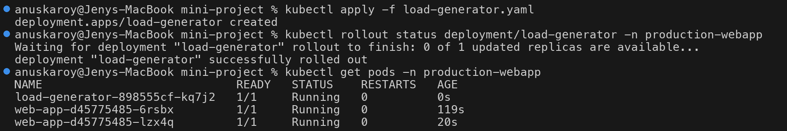

```text
$ kubectl get hpa -n production-webapp
NAME          REFERENCE            TARGETS        MINPODS   MAXPODS   REPLICAS   AGE
web-app-hpa   Deployment/web-app   cpu: 44%/50%   2         5         2          117s
$ kubectl top pods -n production-webapp
NAME                            CPU(cores)   MEMORY(bytes)
load-generator-898555cf-kq7j2   139m         5Mi
web-app-d45775485-6rsbx         44m          8Mi
web-app-d45775485-lzx4q         62m          9Mi
```

One generator pushed average utilization to **44%**, which is **below** the 50% target, so the HPA correctly
kept 2 replicas (`ceil(2 x 44/50) = ceil(1.76) = 2`).

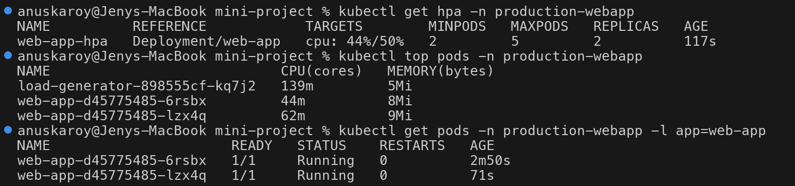

#### 6b. Three load generators: scale out 2 -> 4 -> 5

```text
$ kubectl scale deployment load-generator -n production-webapp --replicas=3
deployment.apps/load-generator scaled
$ kubectl rollout status deployment/load-generator -n production-webapp
...
deployment "load-generator" successfully rolled out
$ kubectl get pods -n production-webapp -l app=load-generator
NAME                            READY   STATUS    RESTARTS   AGE
load-generator-898555cf-j7sjk   1/1     Running   0          0s
load-generator-898555cf-jtt6w   1/1     Running   0          0s
load-generator-898555cf-kq7j2   1/1     Running   0          60s
```

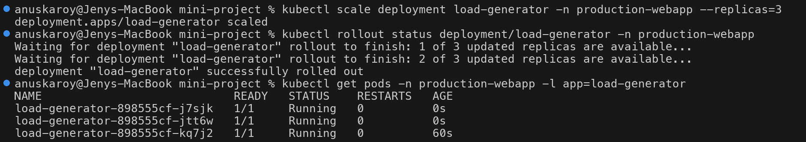

```text
$ kubectl get hpa -n production-webapp
NAME          REFERENCE            TARGETS         MINPODS   MAXPODS   REPLICAS   AGE
web-app-hpa   Deployment/web-app   cpu: 191%/50%   2         5         5          3m7s
$ kubectl top pods -n production-webapp
NAME                            CPU(cores)   MEMORY(bytes)
load-generator-898555cf-j7sjk   67m          3Mi
load-generator-898555cf-jtt6w   65m          3Mi
load-generator-898555cf-kq7j2   116m         17Mi
web-app-d45775485-6rsbx         183m         8Mi
web-app-d45775485-lzx4q         200m         8Mi
$ kubectl get pods -n production-webapp -l app=web-app
NAME                      READY   STATUS    RESTARTS   AGE
web-app-d45775485-6rsbx   1/1     Running   0          4m
web-app-d45775485-krxc4   1/1     Running   0          37s
web-app-d45775485-lzx4q   1/1     Running   0          2m21s
web-app-d45775485-npjmv   1/1     Running   0          22s
web-app-d45775485-wjhh7   1/1     Running   0          37s
```

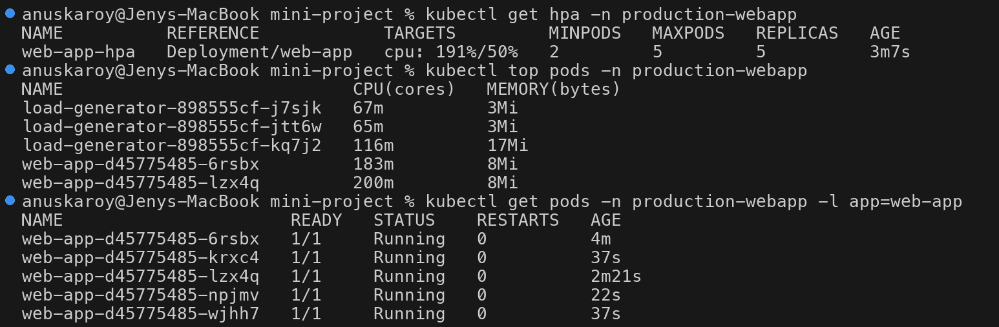

```text
$ kubectl get hpa -n production-webapp
NAME          REFERENCE            TARGETS         MINPODS   MAXPODS   REPLICAS   AGE
web-app-hpa   Deployment/web-app   cpu: 194%/50%   2         5         5          4m22s
$ kubectl top pods -n production-webapp
NAME                            CPU(cores)   MEMORY(bytes)
load-generator-898555cf-j7sjk   156m         31Mi
load-generator-898555cf-jtt6w   160m         29Mi
load-generator-898555cf-kq7j2   153m         40Mi
web-app-d45775485-6rsbx         185m         8Mi
web-app-d45775485-krxc4         199m         7Mi
web-app-d45775485-lzx4q         179m         7Mi
web-app-d45775485-npjmv         196m         7Mi
web-app-d45775485-wjhh7         200m         8Mi
...
$ kubectl describe hpa web-app-hpa -n production-webapp | sed -n '/^Events/,$p'
Events:
  Type     Reason                        Age                   From                       Message
  ----     ------                        ----                  ----                       -------
  Warning  FailedGetResourceMetric       4m8s (x2 over 4m23s)  horizontal-pod-autoscaler  failed to get cpu utilization: did not receive metrics for targeted pods (pods might be unready)
  Warning  FailedComputeMetricsReplicas  4m8s (x2 over 4m23s)  horizontal-pod-autoscaler  invalid metrics (1 invalid out of 1), first error is: ...
  Normal   SuccessfulRescale             113s                  horizontal-pod-autoscaler  New size: 4; reason: cpu resource utilization (percentage of request) above target
  Normal   SuccessfulRescale             98s                   horizontal-pod-autoscaler  New size: 5; reason: cpu resource utilization (percentage of request) above target
```

- The HPA scaled **2 -> 4**, then **4 -> 5** (`maxReplicas`) 15 seconds later (`113s` vs `98s`).
- Every nginx pod sits at about **200m, its CPU limit**. Because the limit is 2x the 100m request, utilization
  can never exceed ~200%; the reported 191-194% is the CPU throttling ceiling, so the HPA cannot see any demand
  beyond that. Even so, `ceil(2 x 191/50) = 8` is well above 5, so the HPA is pinned at `maxReplicas`.
- The two `Warning` events are from the first seconds after the HPA was created (age 4m8s-4m23s, before
  metrics-server had a sample for the pods), not from the load test.

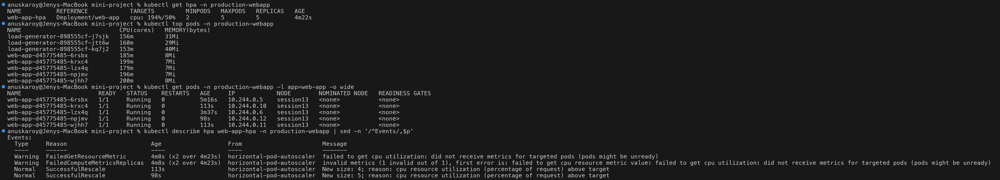

#### 6c. Stop the load: stabilization window, then 5 -> 2

```text
$ kubectl delete -f load-generator.yaml
deployment.apps "load-generator" deleted from production-webapp namespace
$ kubectl get pods -n production-webapp
NAME                            READY   STATUS        RESTARTS   AGE
load-generator-898555cf-j7sjk   1/1     Terminating   0          2m32s
load-generator-898555cf-jtt6w   1/1     Terminating   0          2m32s
load-generator-898555cf-kq7j2   1/1     Terminating   0          3m32s
web-app-d45775485-6rsbx         1/1     Running       0          5m31s
...
```

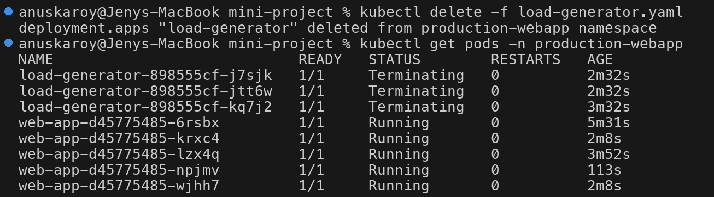

```text
$ kubectl get hpa -n production-webapp
NAME          REFERENCE            TARGETS         MINPODS   MAXPODS   REPLICAS   AGE
web-app-hpa   Deployment/web-app   cpu: 172%/50%   2         5         5          6m9s
$ kubectl describe hpa web-app-hpa -n production-webapp | grep -A4 '^Conditions'
Conditions:
  Type            Status  Reason               Message
  ----            ------  ------               -------
  AbleToScale     True    ScaleDownStabilized  recent recommendations were higher than current one, applying the highest recent recommendation
  ScalingActive   True    ValidMetricFound     the HPA was able to successfully calculate a replica count from cpu resource utilization (percentage of request)
```

Right after the generators were deleted the HPA still showed the last metrics sample (172%), and the
`ScaleDownStabilized` condition confirms it is holding the highest recommendation from the last 300s.

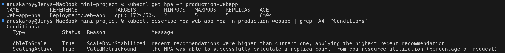

```text
$ kubectl get hpa -n production-webapp
NAME          REFERENCE            TARGETS       MINPODS   MAXPODS   REPLICAS   AGE
web-app-hpa   Deployment/web-app   cpu: 1%/50%   2         5         2          11m
$ kubectl top pods -n production-webapp
NAME                      CPU(cores)   MEMORY(bytes)
web-app-d45775485-6rsbx   1m           7Mi
web-app-d45775485-lzx4q   1m           7Mi
$ kubectl get pods -n production-webapp -l app=web-app
NAME                      READY   STATUS    RESTARTS   AGE
web-app-d45775485-6rsbx   1/1     Running   0          12m
web-app-d45775485-lzx4q   1/1     Running   0          11m
$ kubectl describe hpa web-app-hpa -n production-webapp | sed -n '/^Events/,$p'
Events:
  Type     Reason                        Age                From                       Message
  ----     ------                        ----               ----                       -------
  ...
  Normal   SuccessfulRescale             9m20s              horizontal-pod-autoscaler  New size: 4; reason: cpu resource utilization (percentage of request) above target
  Normal   SuccessfulRescale             9m5s               horizontal-pod-autoscaler  New size: 5; reason: cpu resource utilization (percentage of request) above target
  Normal   SuccessfulRescale             32s                horizontal-pod-autoscaler  New size: 2; reason: All metrics below target
```

The Deployment scaled **5 -> 2** in a single step ("All metrics below target"), stopping at `minReplicas: 2`.
The two original-generation pods (`6rsbx`, `lzx4q`) were kept; the three HPA-created pods were removed.

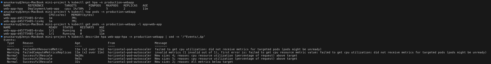

#### 6d. Full timeline (watch output)

`kubectl get hpa web-app-hpa -n production-webapp -w` was left running in a second terminal:

```text
$ kubectl get hpa web-app-hpa -n production-webapp -w
NAME          REFERENCE            TARGETS       MINPODS   MAXPODS   REPLICAS   AGE
web-app-hpa   Deployment/web-app   cpu: 1%/50%   2         5         2          66s
web-app-hpa   Deployment/web-app   cpu: 44%/50%   2         5         2          90s
web-app-hpa   Deployment/web-app   cpu: 191%/50%   2         5         2          2m30s
web-app-hpa   Deployment/web-app   cpu: 191%/50%   2         5         4          2m45s
web-app-hpa   Deployment/web-app   cpu: 191%/50%   2         5         5          3m
web-app-hpa   Deployment/web-app   cpu: 194%/50%   2         5         5          3m30s
web-app-hpa   Deployment/web-app   cpu: 191%/50%   2         5         5          4m30s
web-app-hpa   Deployment/web-app   cpu: 172%/50%   2         5         5          5m30s
web-app-hpa   Deployment/web-app   cpu: 3%/50%     2         5         5          6m31s
web-app-hpa   Deployment/web-app   cpu: 1%/50%     2         5         5          7m31s
web-app-hpa   Deployment/web-app   cpu: 2%/50%     2         5         5          9m33s
web-app-hpa   Deployment/web-app   cpu: 1%/50%     2         5         5          10m
web-app-hpa   Deployment/web-app   cpu: 1%/50%     2         5         5          11m
web-app-hpa   Deployment/web-app   cpu: 1%/50%     2         5         2          11m
```

| HPA age | CPU (avg / target) | Replicas | What happened |
| --- | --- | --- | --- |
| 66s | 1% / 50% | 2 | Idle, metric valid, `minReplicas` holds 2 pods |
| 90s | 44% / 50% | 2 | 1 load generator; below target, no scaling |
| 2m30s | 191% / 50% | 2 | Generator scaled to 3; nginx pods hit their 200m CPU limit |
| 2m45s | 191% / 50% | **4** | Scale-up event `New size: 4` |
| 3m | 191% / 50% | **5** | Scale-up event `New size: 5` (= maxReplicas), 15s later |
| 3m30s - 5m30s | 194% -> 191% -> 172% | 5 | Pinned at max; each pod still at its CPU limit |
| 6m31s | 3% / 50% | 5 | Load removed; CPU collapses but `ScaleDownStabilized` holds 5 |
| 7m31s - 11m | 1-2% / 50% | 5 | Default 300s scale-down stabilization window running |
| 11m | 1% / 50% | **2** | Scale-down 5 -> 2 (`minReplicas`), about 5 min after the last high recommendation |

Pod-level view (`kubectl get pods -n production-webapp -l app=web-app -w`, excerpt):

```text
$ kubectl get pods -n production-webapp -l app=web-app -w
NAME                      READY   STATUS    RESTARTS   AGE
web-app-d45775485-6rsbx   1/1     Running   0          119s
web-app-d45775485-lzx4q   1/1     Running   0          20s
web-app-d45775485-krxc4   0/1     Pending   0          0s
web-app-d45775485-wjhh7   0/1     Pending   0          0s
web-app-d45775485-krxc4   0/1     ContainerCreating   0          0s
web-app-d45775485-wjhh7   0/1     ContainerCreating   0          0s
web-app-d45775485-krxc4   0/1     Running             0          1s
web-app-d45775485-wjhh7   0/1     Running             0          1s
...
web-app-d45775485-krxc4   1/1     Running             0          9s
web-app-d45775485-wjhh7   1/1     Running             0          9s
web-app-d45775485-npjmv   0/1     Pending             0          0s
web-app-d45775485-npjmv   0/1     ContainerCreating   0          0s
web-app-d45775485-npjmv   0/1     Running             0          1s
...
web-app-d45775485-npjmv   1/1     Running             0          9s
web-app-d45775485-npjmv   1/1     Terminating         0          8m33s
web-app-d45775485-wjhh7   1/1     Terminating         0          8m48s
web-app-d45775485-krxc4   1/1     Terminating         0          8m48s
...
web-app-d45775485-krxc4   0/1     Completed           0          8m51s
web-app-d45775485-npjmv   0/1     Completed           0          8m36s
web-app-d45775485-wjhh7   0/1     Completed           0          8m51s
...
```

New pods are `Running` after ~1s but only become `1/1` Ready after ~9s: the readiness probe has
`initialDelaySeconds: 5` and `periodSeconds: 5`, so a pod is only added to the Service once nginx is actually
serving. On scale-down the three HPA-created pods go `Terminating -> Completed` together.

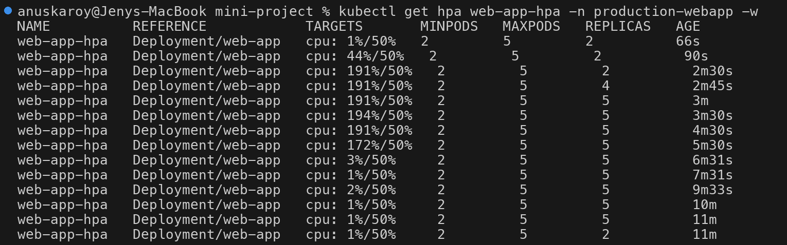
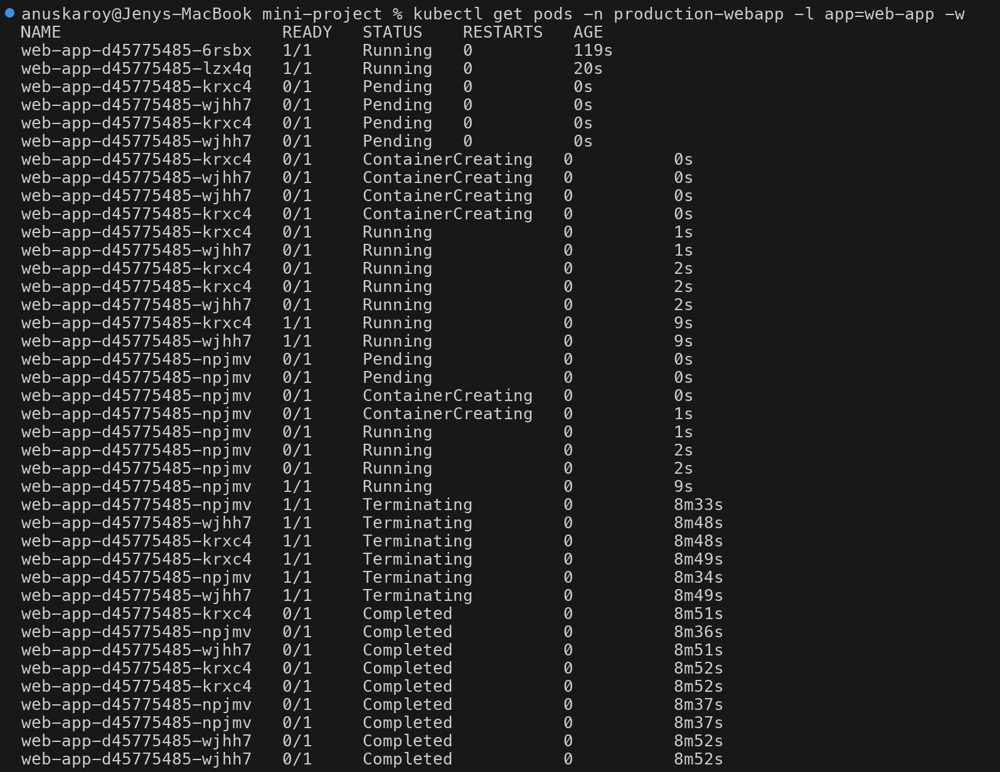

---

### Results vs expected

| Check | Guide expected | Observed |
| --- | --- | --- |
| PVC | `web-data Bound 500Mi RWO standard` | `Bound`, `pvc-b14b8306-...`, 500Mi, RWO, `standard` (dynamically provisioned) |
| App pods | 2 x `1/1 Running` | 2 x `1/1 Running`; both IPs in the EndpointSlice |
| HPA idle | `0%/50%`, 2 replicas | `cpu: 1%/50%`, 2 replicas, `ScalingActive / ValidMetricFound` |
| Storage persistence | `Student: Jane Doe` survives pod deletion | `Student: Anuska Roy` read from pod B, and from replacement pod `lzx4q` after deleting pod A |
| Service | nginx welcome page | `<title>Welcome to nginx!</title>`, HTTP 200 |
| Scale-out | 2 -> 4 -> 5 over 2-3 min | 1 generator: 44%, stays 2; 3 generators: 191%, 2 -> 4 -> 5 within ~30s |
| CPU at max | drops to ~45% at 5 replicas | stays ~191-194%: each pod pinned at its 200m limit, load exceeds 5 pods' capacity |
| Scale-down | back to 2 after 5-minute window | `ScaleDownStabilized` held 5 replicas at 1-3% CPU, then 5 -> 2 at HPA age 11m |

### Notes / deviations

- **Load generator:** ApacheBench (`load-generator.yaml`, `ab -k -c 20`) was used instead of the guide's
  busybox `while true; do wget ...; done` loop. `wget` forks a new process per request and, with one DNS lookup
  per request, saturated the small single node in an earlier attempt (API server TLS handshake timeouts and
  metrics-server restarts were observed). `ab` is one process holding 20 keep-alive connections, targets the
  Service ClusterIP via `$WEB_SERVICE_SERVICE_HOST` (no DNS per request), and is capped at 500m CPU per pod.
  It is a Deployment, so load was increased with `kubectl scale --replicas=3` and stopped with
  `kubectl delete -f load-generator.yaml`.
- **Student name** written to `/data/student.txt` is `Student: Anuska Roy` (the guide uses `Jane Doe`).
- **Storage check** also read the file from the second, untouched replica, and `NEW_POD` was selected as the
  newest pod by `creationTimestamp` (the guide's `.items[0]` could pick the surviving old pod).
- The optional bonus challenges (section 9) were not performed.

### Cleanup

```bash
kubectl delete namespace production-webapp
```

Deleting the namespace removes the Deployment, Service, HPA and PVC. The dynamically provisioned PV is
deleted as well because its reclaim policy is `Delete`.
