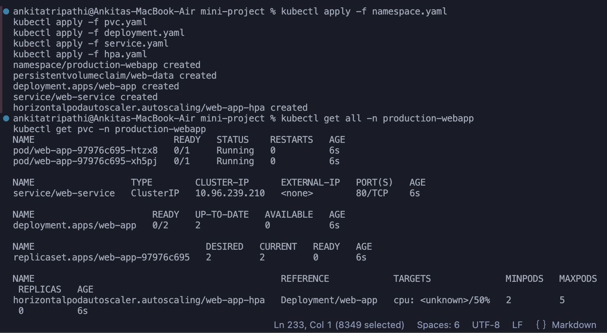
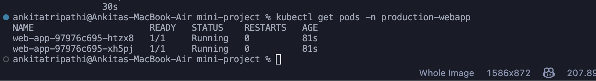
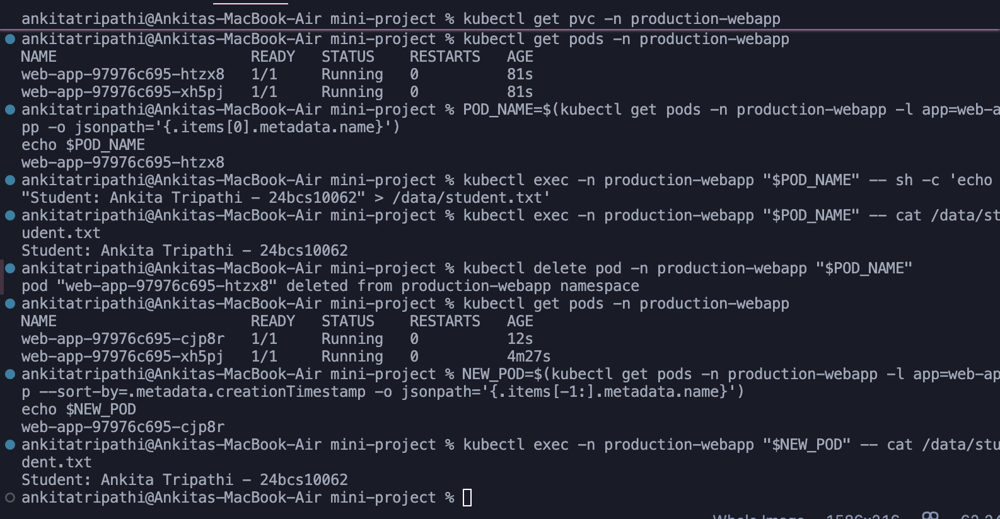
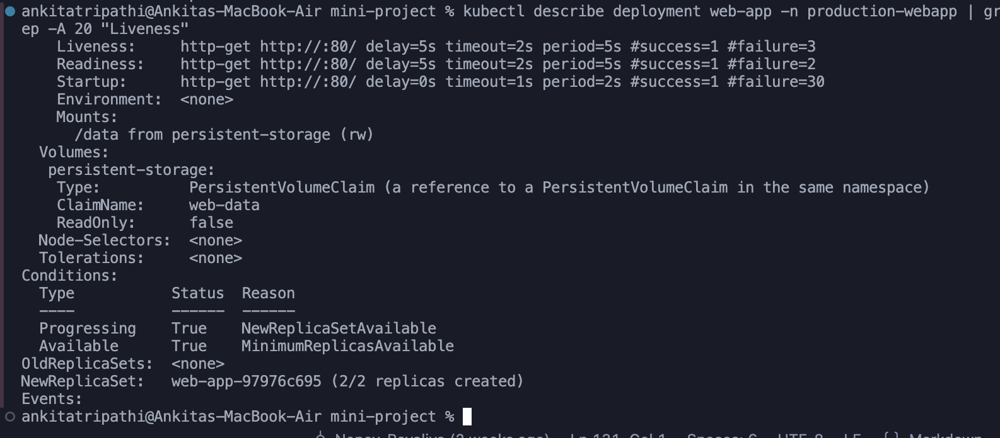
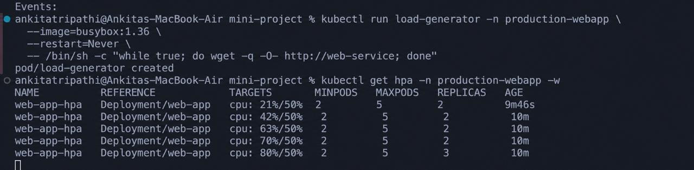

# Task 3: Mini Project: Production-Ready Kubernetes Web App

**Name:** Ankita Tripathi  
**Roll Number:** 24bcs10062

---

## 1. Project Overview

This mini project demonstrates a production-ready Kubernetes web application using persistent storage, health probes, resource management, and Horizontal Pod Autoscaling.

The project implements:

- Persistent storage using a PersistentVolumeClaim (PVC)
- Nginx web application deployed using Kubernetes Deployment
- ClusterIP Service for application communication
- Startup, Readiness, and Liveness probes
- CPU resource requests and limits
- Horizontal Pod Autoscaler (HPA)
- Load generation using BusyBox
- CPU monitoring using Metrics Server

---

## 2. Architecture

```text
                    Service: web-service
                           |
                         Port 80
                           |
               +-----------+-----------+
               |                       |
               v                       v
          Web App Pod             Web App Pod
             Nginx                   Nginx
               |                       |
               +----------+------------+
                          |
                     /data mount
                          |
                          v
                    PVC: web-data
                    500Mi / RWO


                Horizontal Pod Autoscaler
                         |
                  Target CPU: 50%
                  Min Replicas: 2
                  Max Replicas: 5
                         |
                         v
                    Deployment
```

---

## 3. Project Structure

```text
mini-project/
├── namespace.yaml
├── pvc.yaml
├── deployment.yaml
├── service.yaml
├── hpa.yaml
├── README.md
├── 4.png
├── 5.png
├── 6.png
├── 7.png
└── 8.png
```

---

## 4. Persistent Storage

A PersistentVolumeClaim named `web-data` was created to provide persistent storage to the application.

Configuration:

- Capacity requested: **500Mi**
- Access Mode: **ReadWriteOnce (RWO)**
- Storage Class: **standard**
- Container mount path: `/data`

Commands used:

```bash
kubectl apply -f pvc.yaml
kubectl get pvc -n production-webapp
```

The PVC successfully reached the `Bound` state.



---

## 5. Application Deployment

The Nginx web application was deployed using a Kubernetes Deployment with two initial replicas.

The application was exposed internally using a ClusterIP Service named `web-service`.

Commands used:

```bash
kubectl apply -f deployment.yaml
kubectl apply -f service.yaml

kubectl get deployment,pods,service -n production-webapp
```

Both application Pods successfully reached the `Running` and `Ready` states.



---

## 6. Storage Persistence Test

To test persistent storage, student information was written to `/data/student.txt`.

```bash
POD_NAME=$(kubectl get pods -n production-webapp \
-l app=web-app \
-o jsonpath='{.items[0].metadata.name}')
```

The file was created using:

```bash
kubectl exec -n production-webapp "$POD_NAME" -- \
sh -c 'echo "Student: Ankita Tripathi - 24bcs10062" > /data/student.txt'
```

The contents were verified:

```bash
kubectl exec -n production-webapp "$POD_NAME" -- \
cat /data/student.txt
```

Output:

```text
Student: Ankita Tripathi - 24bcs10062
```

The Pod was then deleted:

```bash
kubectl delete pod -n production-webapp "$POD_NAME"
```

Kubernetes automatically created a replacement Pod.

The file stored on the persistent volume remained available after Pod recreation.



### Result

The experiment demonstrates that data stored using the PersistentVolumeClaim is not tied to the lifecycle of an individual Pod.

---

## 7. Application Health Probes

Three Kubernetes health probes were configured.

### Startup Probe

The Startup Probe determines whether the application has successfully started.

### Readiness Probe

The Readiness Probe determines whether the Pod is ready to receive traffic from the Service.

### Liveness Probe

The Liveness Probe checks whether the application remains healthy and responsive.

The probes were verified using:

```bash
kubectl describe deployment web-app -n production-webapp
```

The deployment successfully showed:

```text
Liveness
Readiness
Startup
```

The same deployment also showed the persistent `/data` volume mount using the `web-data` PVC.



---

## 8. Horizontal Pod Autoscaler

The application uses a Horizontal Pod Autoscaler configured using `hpa.yaml`.

HPA configuration:

- Minimum replicas: **2**
- Maximum replicas: **5**
- Target CPU utilization: **50%**

The HPA was deployed and verified using:

```bash
kubectl apply -f hpa.yaml
kubectl get hpa -n production-webapp
```

The HPA continuously monitors average CPU utilization of the application Pods.

---

## 9. Load Generator and HPA Monitoring

A BusyBox Pod was deployed as a load generator.

```bash
kubectl run load-generator \
  -n production-webapp \
  --image=busybox:1.36 \
  --restart=Never \
  -- /bin/sh -c \
  "while true; do wget -q -O- http://web-service; done"
```

The HPA was monitored using:

```bash
kubectl get hpa -n production-webapp -w
```

During the experiment, CPU utilization increased as follows:

```text
1%  ->  21%  ->  42%  ->  43%  ->  45%
```

The configured HPA CPU target was **50%**.

The workload therefore demonstrated that Metrics Server and HPA were successfully monitoring the application's CPU utilization. During the captured observation period, utilization approached but did not exceed the configured target for long enough to trigger additional scaling, so the deployment remained at its minimum of **2 replicas**.



---

## 10. HPA and Kubernetes Commands

Useful commands used during the experiment:

```bash
kubectl get hpa -n production-webapp

kubectl get pods -n production-webapp

kubectl top pods -n production-webapp

kubectl describe hpa web-app-hpa -n production-webapp

kubectl get pvc -n production-webapp

kubectl describe deployment web-app -n production-webapp
```

---

## 11. Mini Project Components

The implementation consists of:

### `namespace.yaml`

Creates the dedicated:

```text
production-webapp
```

namespace.

### `pvc.yaml`

Creates the `web-data` PersistentVolumeClaim with 500Mi persistent storage.

### `deployment.yaml`

Defines:

- Nginx application
- 2 initial replicas
- CPU and memory resource configuration
- `/data` persistent volume mount
- Startup Probe
- Readiness Probe
- Liveness Probe

### `service.yaml`

Creates the `web-service` ClusterIP Service on port 80.

### `hpa.yaml`

Configures Horizontal Pod Autoscaling between 2 and 5 replicas with a target CPU utilization of 50%.

---

## 12. Results

The following features were successfully implemented and verified:

- PersistentVolumeClaim successfully reached `Bound` state.
- Nginx application Pods successfully reached `Running` state.
- Persistent data remained available after Pod deletion and recreation.
- Startup Probe was successfully configured.
- Readiness Probe was successfully configured.
- Liveness Probe was successfully configured.
- CPU requests and limits were configured.
- Metrics Server successfully reported application CPU utilization.
- Horizontal Pod Autoscaler successfully monitored CPU utilization.
- BusyBox load generator successfully generated application traffic.
- CPU utilization increased significantly during load generation.

---

## 13. Conclusion

The mini project demonstrates the integration of important Kubernetes production concepts in a single application.

PersistentVolumeClaim provides durable application storage, health probes allow Kubernetes to monitor application health, resource requests provide the information required for CPU-based autoscaling, and the Horizontal Pod Autoscaler dynamically evaluates application CPU utilization.

The project successfully demonstrates persistent storage, health monitoring, resource management, load generation, metrics collection, and Horizontal Pod Autoscaler configuration in Kubernetes.