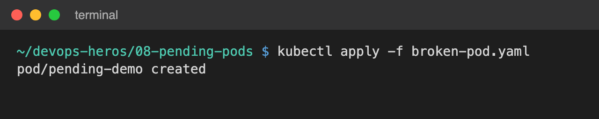
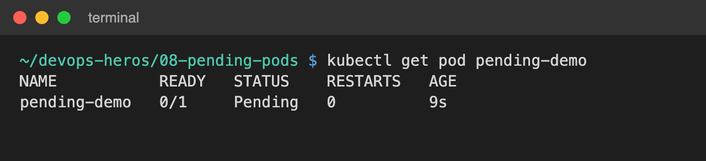
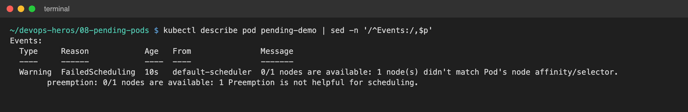
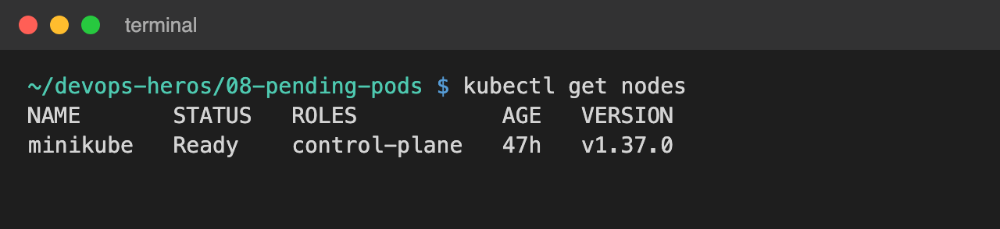
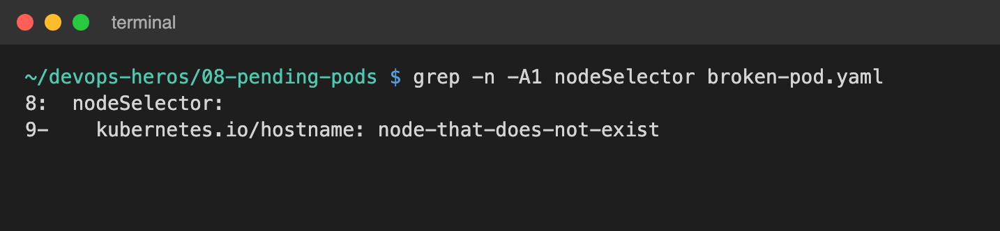
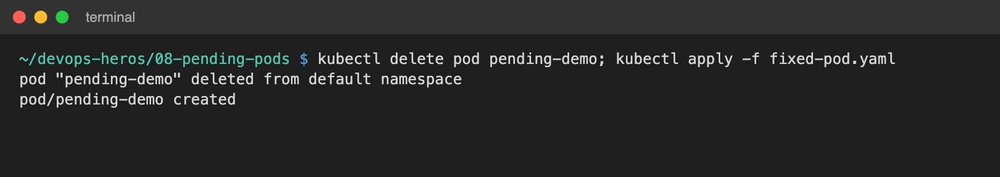

#  `Pending` Pods

The goal is to understand:

```text
Pod is Pending
     │
     ▼
   Why?
     │
     ▼
Find the reason
     │
     ▼
  Fix it
```

---

## 1. Create The Broken Pod

```bash
kubectl apply -f broken-pod.yaml
```

Check:

```bash
kubectl get pod pending-demo
```

Expected output:

```text
NAME           READY   STATUS    RESTARTS   AGE
pending-demo   0/1     Pending   0          10s
```

*(The Pod remains Pending.)*

---

## 2. Why Is It Pending?

Run:

```bash
kubectl describe pod pending-demo
```

Look at the **Events** section. You should see a scheduling-related message.

The Pod contains:

```yaml
nodeSelector:
  kubernetes.io/hostname: node-that-does-not-exist
```

Kubernetes cannot find a node matching this selector.

Therefore:

```text
Scheduler
    │
    ▼
Looks for matching node
    │
    ▼
No matching node
    │
    ▼
Pod remains Pending
```

---

## 3. Check Nodes

Run:

```bash
kubectl get nodes
```

Example output:

```text
NAME       STATUS   ROLES
minikube   Ready    control-plane
```

Our Pod asks for `node-that-does-not-exist`, but that node does not exist.

---

## 4. Fix The Pod

Delete:

```bash
kubectl delete pod pending-demo
```

Apply:

```bash
kubectl apply -f fixed-pod.yaml
```

Check:

```bash
kubectl get pod pending-demo
```

Expected output:

```text
NAME           READY   STATUS
pending-demo   1/1     Running
```

---

## 5. Other Reasons For Pending Pods

A Pod can remain Pending because of:
* Insufficient CPU
* Insufficient memory
* Node selector mismatch
* Affinity rules
* Taints and tolerations
* PVC not available
* Scheduling constraints

Do not assume every Pending Pod has the same problem.

---

## Troubleshooting Flow

```text
kubectl get pods
       │
       ▼
    Pending
       │
       ▼
kubectl describe pod
       │
       ▼
  Check Events
       │
       ▼
  Check nodes
       │
       ▼
 Check resources
       │
       ▼
Check selectors / affinity
       │
       ▼
Check PVC if used
       │
       ▼
      Fix
```

---

## Key Learning

Remember:

```text
Pending = Pod has not successfully been scheduled/started yet.
```

The first place to look is usually:

```bash
kubectl describe pod <pod-name>
```

and especially the **Events** section.

* A Pod in `Pending` with `NODE: <none>` is waiting on `kube-scheduler`.
* Look at `PodScheduled: False` in Conditions.
* Always check the message under `Warning FailedScheduling` in Events.
* The most frequent causes are CPU/RAM request over-allocation and invalid node selectors.

---

## Reference

* **Kubernetes Scheduling:**  
  https://kubernetes.io/docs/concepts/scheduling-eviction/kube-scheduler/

---

## Screenshots

Output captured from running the commands above on a local minikube cluster.

**1. Create the broken Pod**



**2. Pod status: `Pending`**



**3. `FailedScheduling` event from `kubectl describe pod pending-demo`**



**4. `kubectl get nodes`: only `minikube` exists**



**5. Root cause: `nodeSelector` points to a node that does not exist**



**6. Delete the broken Pod and apply `fixed-pod.yaml`**



**7. Verify: Pod is Running**


