# Task 1 — Kubernetes Troubleshooting Commands

The following Kubernetes commands were practiced:

1. `kubectl get`
2. `kubectl describe`
3. `kubectl logs`
4. `kubectl exec`
5. `kubectl events`
6. `kubectl explain`
7. `kubectl top`
8. `kubectl get -o wide`

---

# 1. kubectl get

## Objective

`kubectl get` is used to get a quick overview of the current state of Kubernetes resources.

The first question during troubleshooting should be:

> What is happening?

---

## Step 1 — Create the Pod

From:

```text
01-kubectl-get/
```

run:

```bash
kubectl apply -f pod.yaml
```

Expected output:

```text
pod/get-demo created
```

---

## Step 2 — Check the Pod

```bash
kubectl get pods
```

Example output:

```text
NAME       READY   STATUS    RESTARTS   AGE
get-demo   1/1     Running   0          10s
```

### Explanation

| Column | Meaning |
|---|---|
| NAME | Name of the Pod |
| READY | Number of ready containers |
| STATUS | Current Pod status |
| RESTARTS | Number of container restarts |
| AGE | Time since the Pod was created |

---

## Step 3 — Get Detailed Network Information

```bash
kubectl get pods -o wide
```

Example:

```text
NAME       READY   STATUS    RESTARTS   AGE   IP           NODE
get-demo   1/1     Running   0          20s   10.244.0.5   minikube
```

The exact Pod IP and AGE will depend on the Kubernetes cluster.

---

## Step 4 — Check Different Resources

```bash
kubectl get services
```

```bash
kubectl get deployments
```

```bash
kubectl get nodes
```

```bash
kubectl get all
```

---

## Step 5 — Watch Pod Changes

```bash
kubectl get pods -w
```

In another terminal:

```bash
kubectl delete pod get-demo
```

The `-w` option continuously watches the resource for changes.

---

# 2. kubectl describe

## Objective

`kubectl describe` provides detailed information about a Kubernetes resource.

If:

```text
kubectl get
```

answers:

> What is happening?

then:

```text
kubectl describe
```

helps answer:

> Why is it happening?

---

## Step 1 — Create the Pod

From:

```text
02-kubectl-describe/
```

run:

```bash
kubectl apply -f demo-pod.yaml
```

Expected:

```text
pod/describe-demo created
```

---

## Step 2 — Check the Pod

```bash
kubectl get pod describe-demo
```

Example:

```text
NAME            READY   STATUS    RESTARTS   AGE
describe-demo   1/1     Running   0          10s
```

---

## Step 3 — Describe the Pod

```bash
kubectl describe pod describe-demo
```

Important sections include:

```text
Name
Namespace
Labels
Status
IP
Containers
Conditions
Events
```

Example:

```text
Containers:
  nginx:
    Image:          nginx:1.27
    State:          Running
    Ready:          True
```

The bottom of the output contains the Events section.

Example:

```text
Events:
  Type    Reason     Age   From               Message
  ----    ------     ---   ----               -------
  Normal  Scheduled  ...   default-scheduler  Successfully assigned ...
  Normal  Pulling    ...   kubelet            Pulling image "nginx:1.27"
  Normal  Pulled     ...   kubelet            Successfully pulled image
  Normal  Created    ...   kubelet            Created container nginx
  Normal  Started    ...   kubelet            Started container nginx
```

The exact timestamps and messages may differ.

---

## Important Troubleshooting Use

For a Pending Pod:

```bash
kubectl describe pod <pod-name>
```

For an ImagePullBackOff:

```bash
kubectl describe pod <pod-name>
```

For a CrashLoopBackOff:

```bash
kubectl describe pod <pod-name>
```

The Events section is often one of the fastest ways to identify the root cause.

---

# 3. kubectl logs

## Objective

`kubectl logs` displays the output generated by a container.

The question answered is:

> What is the application saying?

---

## Step 1 — Create the Pod

From:

```text
03-kubectl-logs/
```

run:

```bash
kubectl apply -f pod.yaml
```

Expected:

```text
pod/logs-demo created
```

---

## Step 2 — Check the Pod

```bash
kubectl get pod logs-demo
```

Example:

```text
NAME        READY   STATUS    RESTARTS   AGE
logs-demo   1/1     Running   0          10s
```

---

## Step 3 — View Logs

```bash
kubectl logs logs-demo
```

Expected output:

```text
Application started
Connecting to database...
Database connection successful
Application is running
Application is healthy
Application is healthy
Application is healthy
```

The application continues printing:

```text
Application is healthy
```

every few seconds.

---

## Step 4 — Follow Logs

```bash
kubectl logs -f logs-demo
```

Press:

```text
Ctrl + C
```

to stop following the logs.

---

## Step 5 — Previous Container Logs

This command becomes particularly important when a container is repeatedly crashing:

```bash
kubectl logs logs-demo --previous
```

For a crashing application, `--previous` can show logs from the previous container instance.

---

# 4. kubectl exec

## Objective

`kubectl exec` allows commands to be executed inside a running container.

The question answered is:

> What can I see from inside the container?

---

## Step 1 — Create the Pod

From:

```text
04-kubectl-exec/
```

run:

```bash
kubectl apply -f pod.yaml
```

---

## Step 2 — Enter the Container

```bash
kubectl exec -it exec-demo -- bash
```

Inside the container:

```bash
ls
```

Check the Nginx HTML directory:

```bash
ls /usr/share/nginx/html
```

Test Nginx:

```bash
curl localhost
```

The Nginx container should return HTML.

For example:

```text
<!DOCTYPE html>
<html>
<head>
<title>Welcome to nginx!</title>
...
```

Exit:

```bash
exit
```

---

## Execute a Single Command

Instead of opening a shell:

```bash
kubectl exec exec-demo -- hostname
```

Another useful command:

```bash
kubectl exec exec-demo -- ls /usr/share/nginx/html
```

---

# 5. kubectl events

## Objective

Kubernetes Events show important actions performed by Kubernetes.

Run:

```bash
kubectl events
```

Events can also be sorted chronologically:

```bash
kubectl events --sort-by=.lastTimestamp
```

Example:

```text
LAST SEEN   TYPE     REASON     OBJECT              MESSAGE
...         Normal   Scheduled  pod/events-demo     Successfully assigned ...
...         Normal   Pulling    pod/events-demo     Pulling image "nginx:1.27"
...         Normal   Pulled     pod/events-demo     Successfully pulled image
...         Normal   Created    pod/events-demo     Created container nginx
...         Normal   Started    pod/events-demo     Started container nginx
```

The exact output depends on the cluster.

---

## Why Events Are Important

For a broken Pod, Events may show:

```text
FailedScheduling
ErrImagePull
ImagePullBackOff
BackOff
FailedMount
Failed
```

Therefore, Events are one of the most important troubleshooting sources.

---

# 6. kubectl explain

## Objective

`kubectl explain` provides built-in Kubernetes documentation for resource fields.

Run:

```bash
kubectl explain pod
```

Then:

```bash
kubectl explain pod.spec
```

Then:

```bash
kubectl explain pod.spec.containers
```

And:

```bash
kubectl explain pod.spec.containers.image
```

For Deployments:

```bash
kubectl explain deployment.spec
```

---

## Example

```bash
kubectl explain pod.spec.containers
```

The command displays information about the container specification, including fields such as:

```text
name
image
command
args
ports
resources
env
volumeMounts
```

This is useful when writing or troubleshooting Kubernetes YAML files.

---

# 7. kubectl top

## Objective

`kubectl top` displays resource usage of Kubernetes nodes and Pods.

First enable Metrics Server in Minikube:

```bash
minikube addons enable metrics-server
```

Check:

```bash
kubectl top nodes
```

Example:

```text
NAME       CPU(cores)   CPU%   MEMORY(bytes)   MEMORY%
minikube   200m         10%    1200Mi          30%
```

The values will vary depending on the machine.

---

## Check Pod Resource Usage

```bash
kubectl top pods
```

Example:

```text
NAME        CPU(cores)   MEMORY(bytes)
logs-demo   1m           2Mi
get-demo    0m           5Mi
```

Again, actual values vary.

---

## Why `kubectl top` Is Useful

It can help investigate:

- High CPU usage
- High memory usage
- OOMKilled
- HPA problems
- Resource pressure

---

# 8. kubectl get -o wide

The `-o wide` option provides additional information.

Run:

```bash
kubectl get pods -o wide
```

Example:

```text
NAME       READY   STATUS    RESTARTS   AGE   IP           NODE
get-demo   1/1     Running   0          ...   10.244.0.5   minikube
```

Compared with:

```bash
kubectl get pods
```

the wide output includes networking and node information.

This is particularly useful when investigating:

- Pod networking
- Pod IPs
- Node placement
- Service connectivity

---

# Screenshots

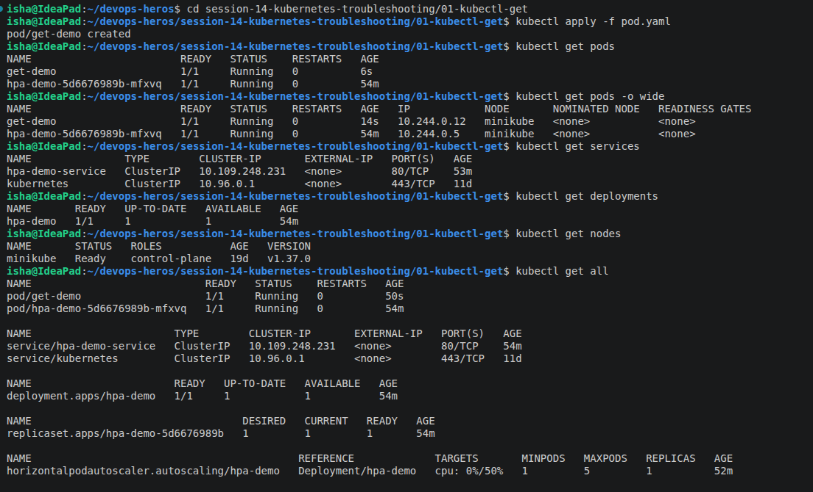
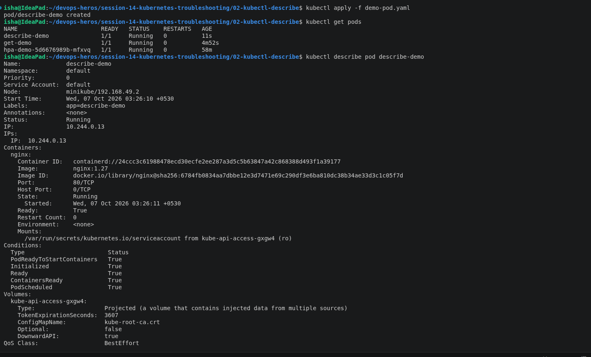
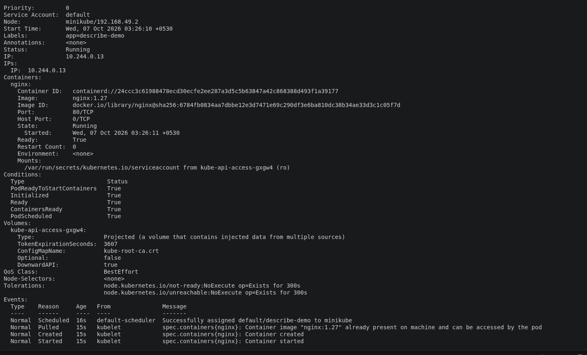
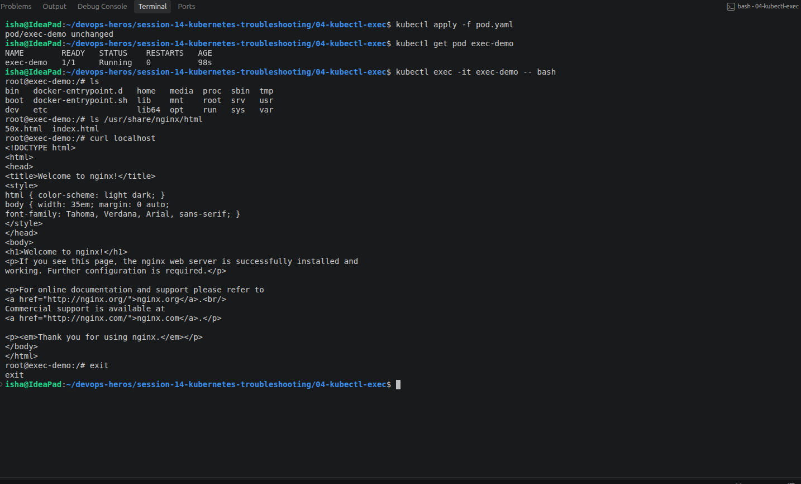
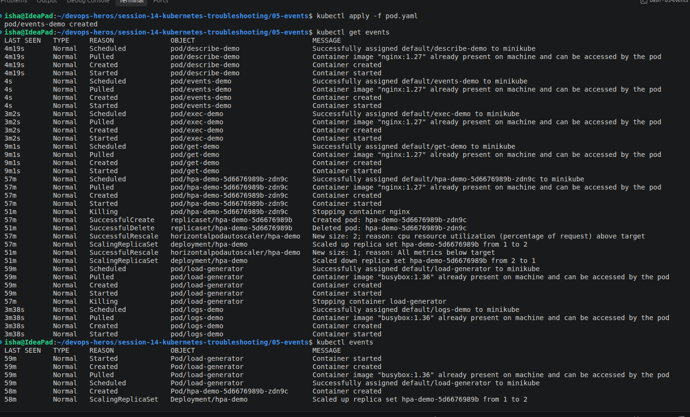
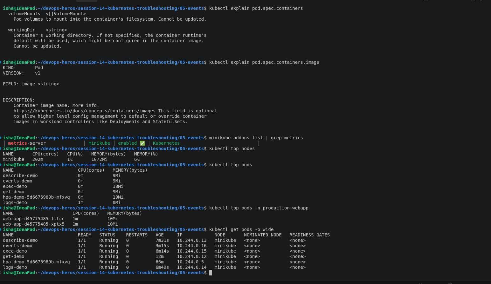

---

# Task 2 — Troubleshoot Common Issues

The troubleshooting process used for each problem was:

```text
1. Identify the problem
        ↓
2. Investigate
        ↓
3. Find root cause
        ↓
4. Fix
        ↓
5. Verify
        ↓
6. Document
```

---

# 2.1 CrashLoopBackOff

## Problem

The Pod:

```text
crash-demo
```

is intentionally configured to start an application and immediately terminate with an error.

---

## Step 1 — Deploy Broken Pod

From:

```text
06-crashloopbackoff/
```

run:

```bash
kubectl apply -f broken-pod.yaml
```

Expected:

```text
pod/crash-demo created
```

Check:

```bash
kubectl get pod crash-demo
```

Example:

```text
NAME         READY   STATUS             RESTARTS   AGE
crash-demo   0/1     CrashLoopBackOff   3          ...
```

The exact restart count depends on how long the Pod has been running.

---

## Step 2 — Investigate

Run:

```bash
kubectl describe pod crash-demo
```

Then:

```bash
kubectl logs crash-demo
```

Expected logs:

```text
Application starting...
Something went wrong!
```

The container exits with:

```text
exit 1
```

This causes Kubernetes to repeatedly restart the container.

---

## Root Cause

The application command inside the container explicitly exits with status `1`.

```text
Application starts
       ↓
Application prints error
       ↓
exit 1
       ↓
Container terminates
       ↓
Kubernetes restarts container
       ↓
Container crashes again
       ↓
CrashLoopBackOff
```

---

## Fix

The repository provides:

```text
fixed-pod.yaml
```

Apply it:

```bash
kubectl delete pod crash-demo
kubectl apply -f fixed-pod.yaml
```

Verify:

```bash
kubectl get pod crash-demo
```

Expected:

```text
NAME         READY   STATUS    RESTARTS   AGE
crash-demo   1/1     Running   0          ...
```

Check logs:

```bash
kubectl logs crash-demo
```

Expected:

```text
Application starting...
Application is healthy
```

---

## Before

```text
crash-demo   0/1   CrashLoopBackOff
```

---

## After

```text
crash-demo   1/1   Running
```

---

# 2.2 ImagePullBackOff / ErrImagePull

## Problem

The repository contains an invalid image:

```yaml
image: nginx:this-image-does-not-exist
```

---

## Step 1 — Deploy

From:

```text
07-imagepullbackoff/
```

run:

```bash
kubectl apply -f broken-pod.yaml
```

Check:

```bash
kubectl get pod image-demo
```

Example:

```text
NAME         READY   STATUS             RESTARTS   AGE
image-demo   0/1     ImagePullBackOff   0          ...
```

Depending on timing, it may initially show:

```text
ErrImagePull
```

and later:

```text
ImagePullBackOff
```

---

## Step 2 — Investigate

Run:

```bash
kubectl describe pod image-demo
```

Look at the Events section.

You should see an image-pull failure.

The image requested is:

```text
nginx:this-image-does-not-exist
```

---

## Root Cause

The requested image tag does not exist.

```text
Kubernetes
     ↓
Pull nginx:this-image-does-not-exist
     ↓
Image cannot be pulled
     ↓
ErrImagePull
     ↓
Repeated attempts
     ↓
ImagePullBackOff
```

---

## Fix

The repository provides:

```text
fixed-pod.yaml
```

which uses:

```yaml
image: nginx:1.27
```

Apply:

```bash
kubectl delete pod image-demo
kubectl apply -f fixed-pod.yaml
```

Verify:

```bash
kubectl get pod image-demo
```

Expected:

```text
NAME         READY   STATUS    RESTARTS   AGE
image-demo   1/1     Running   0          ...
```

---

# 2.3 Pending Pod

## Problem

The Pod contains a node selector for a node that does not exist:

```yaml
nodeSelector:
  kubernetes.io/hostname: node-that-does-not-exist
```

---

## Step 1 — Deploy

From:

```text
08-pending-pods/
```

run:

```bash
kubectl apply -f broken-pod.yaml
```

Check:

```bash
kubectl get pod pending-demo
```

Expected:

```text
NAME           READY   STATUS    RESTARTS   AGE
pending-demo   0/1     Pending   0          ...
```

---

## Step 2 — Investigate

Run:

```bash
kubectl describe pod pending-demo
```

Look at Events.

The scheduler cannot find a node satisfying the requested node selector.

Check available nodes:

```bash
kubectl get nodes
```

Example:

```text
NAME       STATUS   ROLES           AGE
minikube   Ready    control-plane   ...
```

There is no node named:

```text
node-that-does-not-exist
```

---

## Root Cause

The Pod requests a node that does not exist.

```text
Pod
 │
 │ nodeSelector = node-that-does-not-exist
 ▼
Scheduler
 │
 │ No matching node
 ▼
Pending
```

---

## Fix

The repository provides:

```text
fixed-pod.yaml
```

which removes the invalid node selector.

Run:

```bash
kubectl delete pod pending-demo
kubectl apply -f fixed-pod.yaml
```

Verify:

```bash
kubectl get pod pending-demo
```

Expected:

```text
NAME           READY   STATUS    RESTARTS   AGE
pending-demo   1/1     Running   0          ...
```

---

# 2.4 ContainerCreating

## Problem

A Pod can remain in:

```text
ContainerCreating
```

while Kubernetes is preparing the container.

---

## Investigation

Run:

```bash
kubectl get pods
```

Then:

```bash
kubectl describe pod <pod-name>
```

Then:

```bash
kubectl events --sort-by=.lastTimestamp
```

Look for:

```text
FailedMount
FailedAttachVolume
Failed to pull image
FailedCreatePodSandBox
Secret not found
ConfigMap not found
```

---

## Common Root Causes

ContainerCreating may be caused by:

- Image pulling
- Volume mounting
- Missing Secret
- Missing ConfigMap
- CNI/network setup
- Container runtime problems

---

## Verification

Continue monitoring:

```bash
kubectl get pods -w
```

Once the underlying issue is resolved:

```text
ContainerCreating
       ↓
Running
```

---

# 2.5 Service Connectivity Problem

A Kubernetes Service routes traffic to Pods using labels and selectors.

The relationship is:

```text
Pod Labels
     ↓
Service Selector
     ↓
Endpoints
     ↓
Service
```

---

## Deploy the Service Example

From:

```text
09-service-dns-troubleshooting/
```

the Deployment contains:

```yaml
labels:
  app: web
```

However, the provided `service.yaml` intentionally contains:

```yaml
selector:
  app: web-ahsgdf
```

This does NOT match:

```text
app=web
```

---

## Deploy

```bash
kubectl apply -f deployment.yaml
kubectl apply -f service.yaml
```

Check:

```bash
kubectl get pods
```

Example:

```text
NAME                   READY   STATUS    RESTARTS   AGE
web-xxxxxxxxxx-xxxxx   1/1     Running   0          ...
web-xxxxxxxxxx-yyyyy   1/1     Running   0          ...
```

The Pods are healthy.

Now check the Service:

```bash
kubectl get service
```

Then:

```bash
kubectl get endpoints web-service
```

Expected broken result:

```text
NAME          ENDPOINTS
web-service   <none>
```

---

## Investigate

Check Pod labels:

```bash
kubectl get pods --show-labels
```

Example:

```text
NAME                   LABELS
web-xxxxxxxxxx-xxxxx   app=web
web-xxxxxxxxxx-yyyyy   app=web
```

Now inspect the Service:

```bash
kubectl describe service web-service
```

The selector will show:

```text
Selector: app=web-ahsgdf
```

---

## Root Cause

The Pod label and Service selector do not match.

```text
Pod:
app=web

Service:
app=web-ahsgdf

        ↓

No matching Pods

        ↓

No endpoints
```

---

## Fix

Edit `service.yaml`:

```yaml
selector:
  app: web
```

Apply:

```bash
kubectl apply -f service.yaml
```

Check:

```bash
kubectl get endpoints web-service
```

Expected:

```text
NAME          ENDPOINTS
web-service   10.244.x.x:80,10.244.x.x:80
```

The exact IP addresses will vary.

---

## Before

```text
web-service   <none>
```
---

## After

```text
web-service   10.244.x.x:80,10.244.x.x:80
```

---

# 2.6 DNS Troubleshooting

## Objective

Kubernetes provides DNS names for Services.

A typical Service DNS name is:

```text
service-name.namespace.svc.cluster.local
```

---

## Create DNS Test Pod

From:

```text
09-service-dns-troubleshooting/
```

run:

```bash
kubectl apply -f dns-test-pod.yaml
```

Check:

```bash
kubectl get pod dns-test
```

Expected:

```text
NAME       READY   STATUS    RESTARTS   AGE
dns-test   1/1     Running   0          ...
```

---

## Test DNS

Run:

```bash
kubectl exec -it dns-test -- nslookup web-service
```

A successful response will contain an address for the Service.

Test the fully qualified name:

```bash
kubectl exec -it dns-test -- nslookup web-service.default.svc.cluster.local
```

---

## Test HTTP Connectivity

```bash
kubectl exec dns-test -- wget -qO- http://web-service
```

If DNS and the Service are working, Nginx HTML should be returned.

---

## Check CoreDNS

```bash
kubectl get pods -n kube-system
```

Look for CoreDNS.

Then:

```bash
kubectl logs -n kube-system -l k8s-app=kube-dns
```

---

## Check DNS Configuration

```bash
kubectl exec -it dns-test -- cat /etc/resolv.conf
```

The exact nameserver and search domains depend on the Kubernetes cluster.

---

## DNS Troubleshooting Flow

```text
DNS request
     │
     ▼
nslookup web-service
     │
     ├── FAIL
     │     │
     │     ▼
     │   Check CoreDNS
     │
     └── SUCCESS
           │
           ▼
     Check Service
           │
           ▼
     Check Endpoints
           │
           ▼
     Test HTTP
```

---

# 2.7 Pod Networking Issues

Pod networking problems can be investigated using:

```bash
kubectl get pods -o wide
```

This provides:

- Pod IP
- Node
- Pod status

Check the Pod IP:

```bash
kubectl get pods -o wide
```

Then enter a test container:

```bash
kubectl exec -it dns-test -- sh
```

Test connectivity using tools available in the image.

For example:

```bash
nslookup web-service
```

and:

```bash
wget -qO- http://web-service
```

---

## Investigation Checklist

```bash
kubectl get pods -o wide
kubectl get service
kubectl get endpoints
kubectl exec -it <test-pod> -- sh
```

If DNS fails:

```bash
kubectl get pods -n kube-system
kubectl logs -n kube-system -l k8s-app=kube-dns
```

---

# 2.8 Configuration Issues

Configuration problems can be caused by:

- Incorrect environment variables
- Missing ConfigMaps
- Missing Secrets
- Incorrect command/arguments
- Incorrect ports
- Incorrect volume configuration

Useful commands:

```bash
kubectl describe pod <pod-name>
```

```bash
kubectl logs <pod-name>
```

Check ConfigMaps:

```bash
kubectl get configmaps
```

Check Secrets:

```bash
kubectl get secrets
```

Inspect a ConfigMap:

```bash
kubectl describe configmap <name>
```

Inspect a Secret without exposing its contents in screenshots:

```bash
kubectl describe secret <name>
```

---

# 2.9 OOMKilled

The repository includes an additional troubleshooting scenario:

```text
scenarios/scenario-5-oomkilled/
```

The Pod intentionally allocates a large amount of memory while having a very small memory limit:

```yaml
limits:
  memory: "20Mi"
```

---

## Deploy

```bash
kubectl apply -f scenarios/scenario-5-oomkilled/broken.yaml
```

Check:

```bash
kubectl get pod fail-5-oomkilled-pod
```

Investigate:

```bash
kubectl describe pod fail-5-oomkilled-pod
```

Also:

```bash
kubectl logs fail-5-oomkilled-pod
```

The container may eventually show:

```text
OOMKilled
```

---

## Root Cause

The application attempts to allocate significantly more memory than the container's memory limit.

```text
Application
     ↓
Allocates memory
     ↓
Memory limit exceeded
     ↓
Container killed
     ↓
OOMKilled
```

---

## Verification

Use:

```bash
kubectl describe pod fail-5-oomkilled-pod
```

and inspect the container state and previous termination reason.

---

## Screenshot

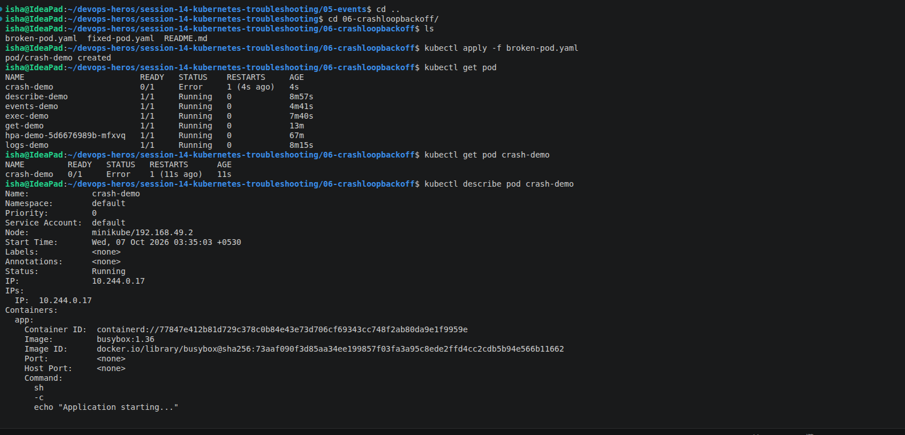
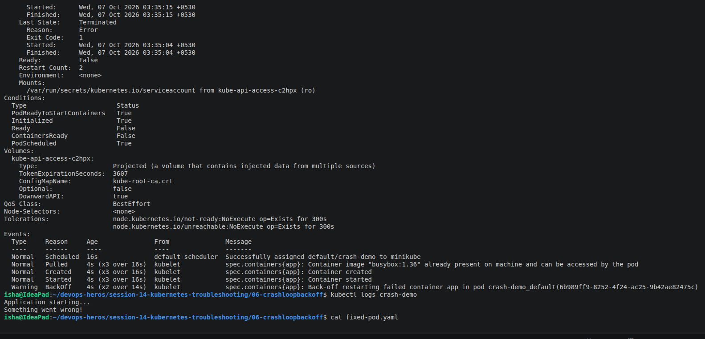
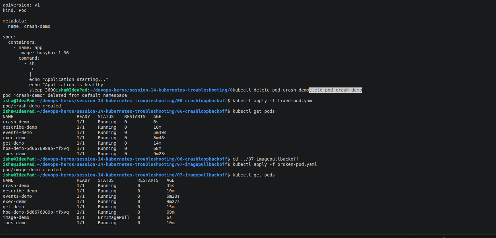
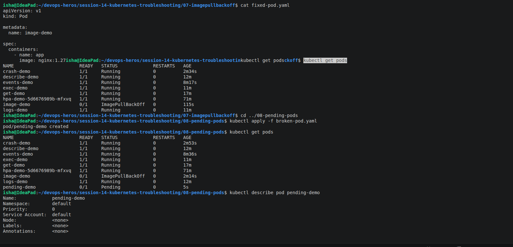
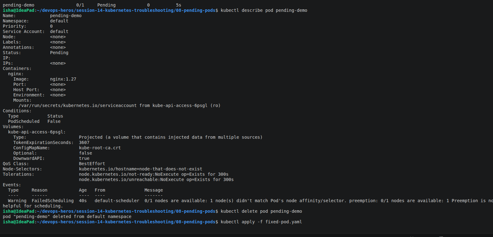
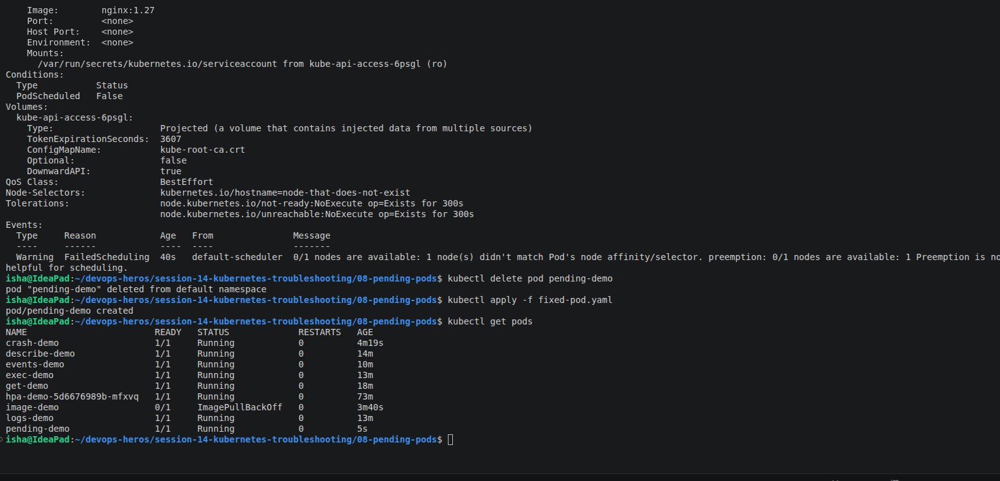
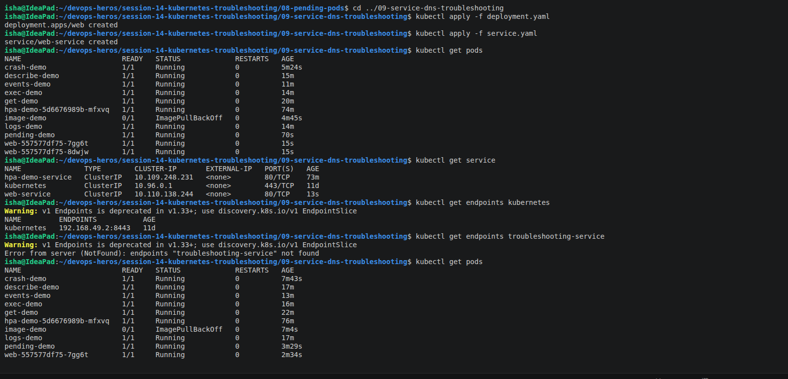
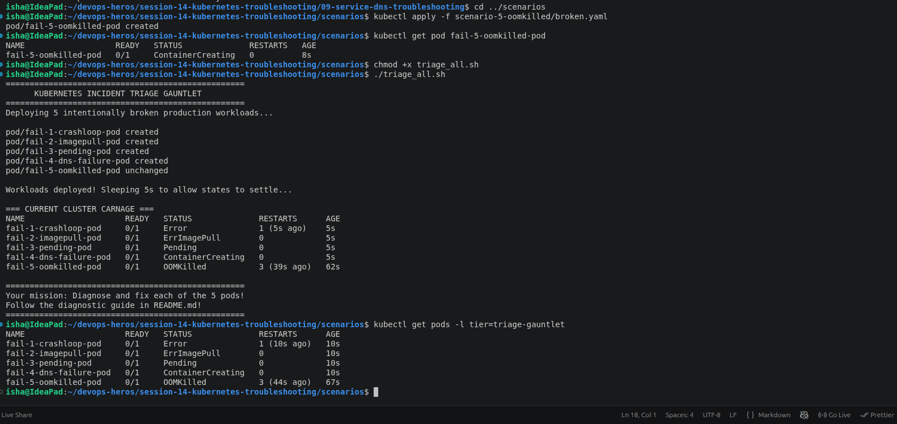
---

# Task 3 — Kubernetes Troubleshooting Mini Project

## Project Objective

The mini project contains:

```text
Deployment
Service
Pods
```

The objective is to:

```text
Deploy
   ↓
Observe
   ↓
Break
   ↓
Investigate
   ↓
Find Root Cause
   ↓
Fix
   ↓
Verify
```

---

# 3.1 Deploy the Application

Go to:

```text
mini-project/
```

Run:

```bash
kubectl apply -f deployment.yaml
```

Expected:

```text
deployment.apps/troubleshooting-app created
```

Apply the Service:

```bash
kubectl apply -f service.yaml
```

Expected:

```text
service/troubleshooting-service created
```

---

# 3.2 Verify Pods

```bash
kubectl get pods
```

Expected:

```text
NAME                                  READY   STATUS    RESTARTS   AGE
troubleshooting-app-xxxxxxxxxx-xxxxx  1/1     Running   0          ...
troubleshooting-app-xxxxxxxxxx-yyyyy  1/1     Running   0          ...
```

The exact Pod names are generated by Kubernetes and will differ.

---

# 3.3 Check Pods with Network Information

```bash
kubectl get pods -o wide
```

Example:

```text
NAME                                  READY   STATUS    RESTARTS   AGE   IP           NODE
troubleshooting-app-xxxxxxxxxx-xxxxx  1/1     Running   0          ...   10.244.0.6   minikube
troubleshooting-app-xxxxxxxxxx-yyyyy  1/1     Running   0          ...   10.244.0.7   minikube
```

---

# 3.4 Describe a Pod

First obtain the Pod name:

```bash
kubectl get pods
```

Then:

```bash
kubectl describe pod <pod-name>
```

Verify:

```text
Image: nginx:1.27
State: Running
Ready: True
```

---

# 3.5 Check Application Logs

```bash
kubectl logs <pod-name>
```

Nginx may not print application startup information to stdout in the same way as the BusyBox example, so the most important verification here is that the container is Running and responding.

---

# 3.6 Test Nginx From Inside the Container

```bash
kubectl exec -it <pod-name> -- bash
```

Inside:

```bash
curl localhost
```

Expected response contains Nginx HTML:

```text
<!DOCTYPE html>
<html>
<head>
<title>Welcome to nginx!</title>
...
```

Exit:

```bash
exit
```

---

# 3.7 Verify the Service

Run:

```bash
kubectl get service
```

Expected:

```text
NAME                     TYPE        CLUSTER-IP      EXTERNAL-IP   PORT(S)
troubleshooting-service  ClusterIP   10.x.x.x       <none>        80/TCP
```

The ClusterIP will vary.

Describe:

```bash
kubectl describe service troubleshooting-service
```

Verify:

```text
Selector: app=troubleshooting-app
Port:     80/TCP
TargetPort: 80/TCP
```

---

# 3.8 Verify Endpoints

Run:

```bash
kubectl get endpoints troubleshooting-service
```

Expected:

```text
NAME                     ENDPOINTS
troubleshooting-service  10.244.x.x:80,10.244.x.x:80
```

The IP addresses depend on the cluster.

This proves that the Service successfully found the application Pods.

---

# 3.9 Create the Broken Pod

The repository contains:

```text
broken-pod.yaml
```

Apply it:

```bash
kubectl apply -f broken-pod.yaml
```

Expected:

```text
pod/project-broken-pod created
```

---

# 3.10 Identify the Problem

Run:

```bash
kubectl get pod project-broken-pod
```

Expected:

```text
NAME                  READY   STATUS             RESTARTS   AGE
project-broken-pod    0/1     ImagePullBackOff   0          ...
```

Depending on timing, the status may first appear as:

```text
ErrImagePull
```

---

# 3.11 Investigate the Broken Pod

Run:

```bash
kubectl describe pod project-broken-pod
```

Look at the Events section.

The broken manifest contains:

```yaml
image: nginx:this-tag-does-not-exist
```

Therefore Kubernetes cannot pull the requested image.

---

# 3.12 Mini Project Questions

## Question 1 — What is the Pod status?

Answer:

```text
The Pod enters ErrImagePull/ImagePullBackOff because Kubernetes cannot pull the specified image.
```

---

## Question 2 — What is the actual error?

Answer:

```text
The specified nginx image tag does not exist.
```

---

## Question 3 — Which command helped identify the reason?

Answer:

```bash
kubectl describe pod project-broken-pod
```

The Events section clearly identifies the image-pull failure.

---

## Question 4 — What is wrong with the image?

The manifest contains:

```yaml
image: nginx:this-tag-does-not-exist
```

The tag does not exist.

---

## Question 5 — How would you fix it?

Use a valid image such as:

```yaml
image: nginx:1.27
```

---

# 3.13 Before Screenshot

```text
project-broken-pod   0/1   ImagePullBackOff
```

---

# 3.14 Fix the Broken Pod

Delete the broken Pod:

```bash
kubectl delete pod project-broken-pod
```

Then modify `broken-pod.yaml`:

```yaml
image: nginx:1.27
```

Apply it:

```bash
kubectl apply -f broken-pod.yaml
```

---

# 3.15 Verify the Fix

```bash
kubectl get pod project-broken-pod
```

Expected:

```text
NAME                  READY   STATUS    RESTARTS   AGE
project-broken-pod    1/1     Running   0          ...
```

---

# 3.16 Test the Fixed Pod

```bash
kubectl exec -it project-broken-pod -- bash
```

Then:

```bash
curl localhost
```

Expected:

```text
<!DOCTYPE html>
<html>
<head>
<title>Welcome to nginx!</title>
...
```

Exit:

```bash
exit
```

---

# 3.17 Service Troubleshooting Challenge

The Service initially contains the correct selector:

```yaml
selector:
  app: troubleshooting-app
```

Temporarily change it to:

```yaml
selector:
  app: wrong-app
```

Apply:

```bash
kubectl apply -f service.yaml
```

---

# 3.18 Check Service Endpoints

```bash
kubectl get endpoints troubleshooting-service
```

Expected:

```text
NAME                     ENDPOINTS
troubleshooting-service  <none>
```

This indicates that the Service cannot find any Pods matching its selector.

---

# 3.19 Investigate the Mismatch

Check Pod labels:

```bash
kubectl get pods --show-labels
```

Example:

```text
NAME                                  LABELS
troubleshooting-app-xxxxxxxxxx-xxxxx  app=troubleshooting-app
troubleshooting-app-xxxxxxxxxx-yyyyy  app=troubleshooting-app
```

Check the Service:

```bash
kubectl describe service troubleshooting-service
```

The Service selector will show:

```text
Selector: app=wrong-app
```

---

# 3.20 Root Cause

The labels do not match.

```text
Pod label:

app=troubleshooting-app


Service selector:

app=wrong-app
```

Therefore:

```text
Service
   │
   │ selector does not match
   ▼
No matching Pods
   │
   ▼
No endpoints
   │
   ▼
Service cannot route traffic
```

---

# 3.21 Fix the Service

Change the selector back to:

```yaml
selector:
  app: troubleshooting-app
```

Apply:

```bash
kubectl apply -f service.yaml
```

Check:

```bash
kubectl get endpoints troubleshooting-service
```

Expected:

```text
NAME                     ENDPOINTS
troubleshooting-service  10.244.x.x:80,10.244.x.x:80
```

---

# 3.22 Service Before/After

## Before Fix

```text
Selector: app=wrong-app

Endpoints:
<none>
```

## After Fix

```text
Selector: app=troubleshooting-app

Endpoints:
10.244.x.x:80,10.244.x.x:80
```
---

## Screenshots
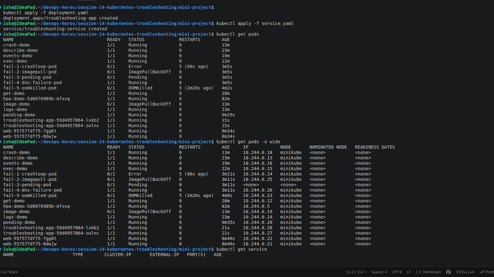
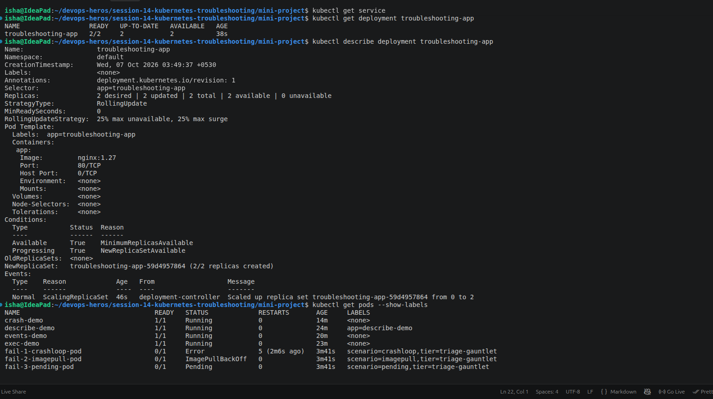
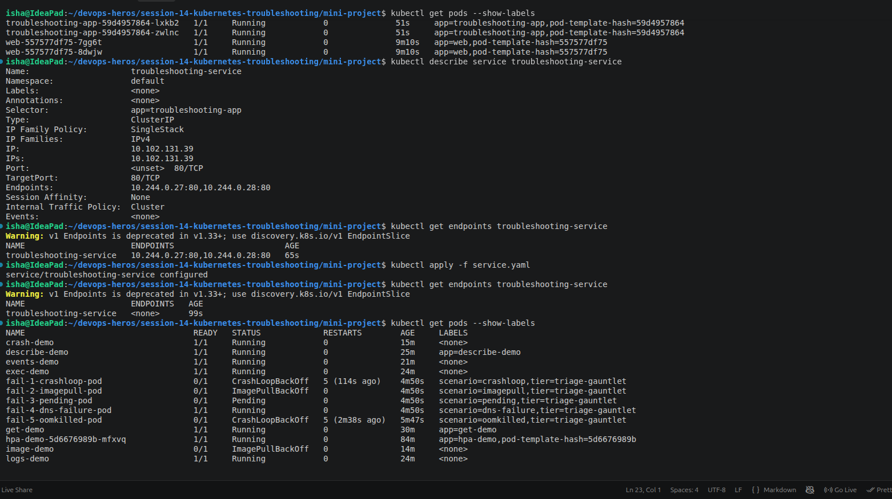
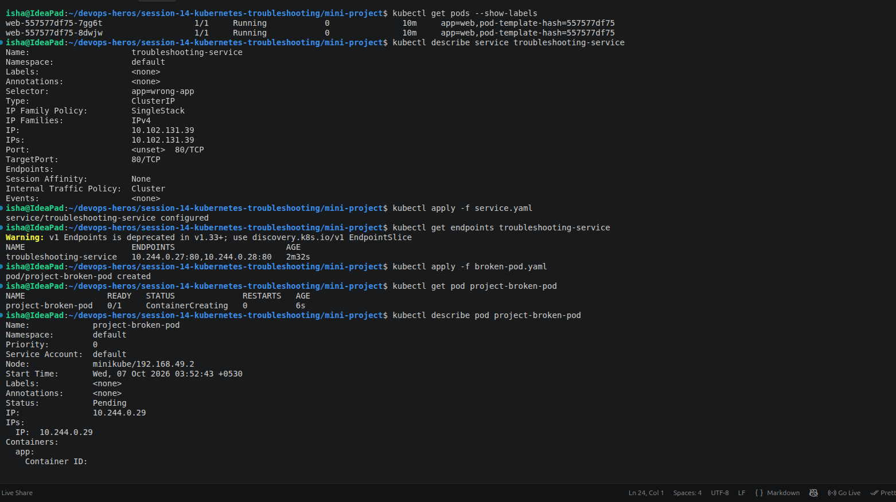
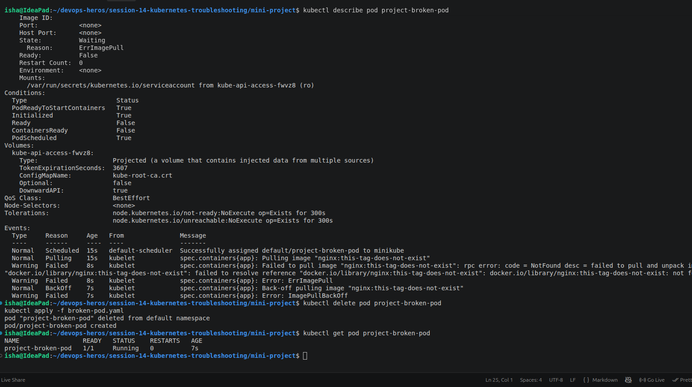
---

# Final Architecture

```text
                    Kubernetes Cluster
                           │
                           ▼
                ┌─────────────────────┐
                │       Service       │
                │ troubleshooting-    │
                │      service        │
                └──────────┬──────────┘
                           │
                    Selector:
              app=troubleshooting-app
                           │
              ┌────────────┴────────────┐
              │                         │
              ▼                         ▼
      ┌───────────────┐         ┌───────────────┐
      │     Pod 1     │         │     Pod 2     │
      │     Nginx     │         │     Nginx     │
      │ app=...       │         │ app=...       │
      └───────────────┘         └───────────────┘
              │                         │
              └────────────┬────────────┘
                           │
                           ▼
                    Nginx Application
```

---

# Troubleshooting Decision Tree

```text
                    Application Not Working
                              │
                              ▼
                       kubectl get pods
                              │
             ┌────────────────┼────────────────┐
             │                │                │
             ▼                ▼                ▼
          Running          Pending       Failed/Crash
             │                │                │
             │                ▼                ▼
             │          kubectl describe   kubectl logs
             │                │                │
             │                ▼                ▼
             │             Events          --previous
             │
             ▼
       Check Service
             │
             ▼
      kubectl get svc
             │
             ▼
   kubectl get endpoints
             │
       ┌─────┴─────┐
       │           │
       ▼           ▼
   Endpoints     <none>
      exist         │
       │            ▼
       │      Check selectors
       │            │
       │            ▼
       │       Check labels
       │
       ▼
   Test DNS
       │
       ▼
   nslookup
       │
       ▼
   Test HTTP
```

---

# Final Troubleshooting Table

| Problem | What I Observed | Investigation Command | Root Cause | Solution | Status |
|---|---|---|---|---|---|
| CrashLoopBackOff | Container repeatedly restarted | `kubectl logs`, `kubectl describe` | Application exited with error | Corrected application command | Fixed |
| ImagePullBackOff | Image could not be pulled | `kubectl describe` | Invalid image/tag | Changed to valid image | Fixed |
| ErrImagePull | Image pull failed | `kubectl describe` | Invalid image | Corrected image | Fixed |
| Pending | Pod could not be scheduled | `kubectl describe` | Invalid node selector | Removed invalid selector | Fixed |
| ContainerCreating | Container was not ready | `kubectl describe`, Events | Image/volume/config/network issue | Fixed underlying resource | Verified |
| Service Connectivity | No endpoints | `kubectl get endpoints` | Selector mismatch | Corrected Service selector | Fixed |
| DNS | Service name resolution failed | `nslookup` | Incorrect Service/DNS configuration | Corrected Service/DNS configuration | Fixed |
| Pod Networking | Pod connectivity problem | `kubectl get -o wide`, `exec` | Networking/connectivity issue | Corrected configuration | Verified |
| Configuration | Application configuration issue | `describe`, `logs` | Incorrect/missing configuration | Corrected configuration | Fixed |
| OOMKilled | Container terminated | `describe`, `top` | Memory limit exceeded | Adjusted resources/application | Identified |

---

# Questions and Answers

## 1. What does `kubectl get` tell us?

`kubectl get` provides a quick view of the current state of Kubernetes resources.

For example:

```bash
kubectl get pods
```

shows the Pod name, readiness, status, restart count, and age.

---

## 2. What is the difference between `get` and `describe`?

`kubectl get` provides a short summary.

`kubectl describe` provides detailed information including:

- Configuration
- Conditions
- Container state
- Events
- Scheduling information

---

## 3. Why do we use `kubectl logs`?

`kubectl logs` allows us to inspect application output from inside a container.

It is especially useful for application crashes and startup failures.

---

## 4. When would you use `kubectl exec`?

`kubectl exec` is used when we need to execute commands inside a running container.

It is useful for:

- Testing connectivity
- Checking files
- Inspecting configuration
- Running network commands
- Testing an application's local endpoint

---

## 5. What does CrashLoopBackOff mean?

CrashLoopBackOff means that a container is repeatedly starting and then terminating/crashing. Kubernetes keeps restarting it and applies an increasing delay between restart attempts.

---

## 6. What does ImagePullBackOff mean?

ImagePullBackOff means Kubernetes was unable to pull the required container image and is backing off before trying again.

Common causes include:

- Incorrect image name
- Incorrect image tag
- Private registry authentication
- Registry connectivity problems

---

## 7. Why can a Pod remain Pending?

A Pod can remain Pending when Kubernetes cannot schedule it onto a suitable node.

Possible reasons include:

- Insufficient CPU
- Insufficient memory
- Invalid node selector
- Taints and tolerations
- PersistentVolume problems
- Scheduling constraints

---

## 8. Why can a Service have no endpoints?

A Service can have no endpoints when its selector does not match any Pod labels.

For example:

```text
Pod:
app=backend

Service:
selector app=frontend
```

The Service will not find the Pod.

---

## 9. What is the relationship between a Service selector and Pod labels?

The Service selector identifies the Pods to which the Service should route traffic.

Therefore:

```text
Pod Label
    =
Service Selector
```

must match for the Pod to become a Service endpoint.

---

## 10. What is Kubernetes DNS?

Kubernetes DNS provides DNS-based service discovery inside the cluster.

A Service can generally be accessed using:

```text
service-name.namespace.svc.cluster.local
```

For example:

```text
web-service.default.svc.cluster.local
```

---

# Final Learning Outcome

After completing Session 14, I am able to:

- Check Kubernetes resource status
- Inspect detailed resource information
- Read container logs
- Execute commands inside containers
- Inspect Kubernetes Events
- Use Kubernetes built-in documentation
- Monitor CPU and memory usage
- Identify `CrashLoopBackOff`
- Identify `ImagePullBackOff`
- Identify `ErrImagePull`
- Troubleshoot Pending Pods
- Troubleshoot ContainerCreating
- Troubleshoot Service selector problems
- Troubleshoot Kubernetes DNS
- Investigate Pod networking
- Investigate configuration problems
- Identify OOMKilled containers
- Find the root cause before applying a fix
- Verify that a fix actually worked

---

# Final Troubleshooting Method

The most important lesson from this session is:

```text
             DON'T GUESS
                 │
                 ▼
          kubectl get
                 │
                 ▼
        kubectl describe
                 │
                 ▼
              Events
                 │
                 ▼
          kubectl logs
                 │
                 ▼
          kubectl exec
                 │
                 ▼
       Test connectivity
                 │
                 ▼
          Find Root Cause
                 │
                 ▼
                FIX
                 │
                 ▼
              VERIFY
```

The goal of Kubernetes troubleshooting is not simply to make the application work.

The goal is to understand:

> **What failed, why it failed, how it was fixed, and how the fix was verified.**

---