# Kubernetes Troubleshooting - Output Log

**Name:** Anushika Chauhan  
**Roll No.:** 10344  

---

## 1. `kubectl get`

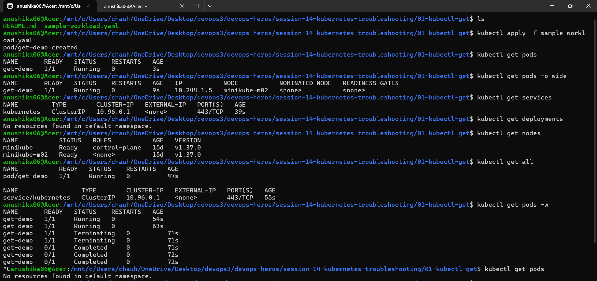

---

## 2. `kubectl describe`

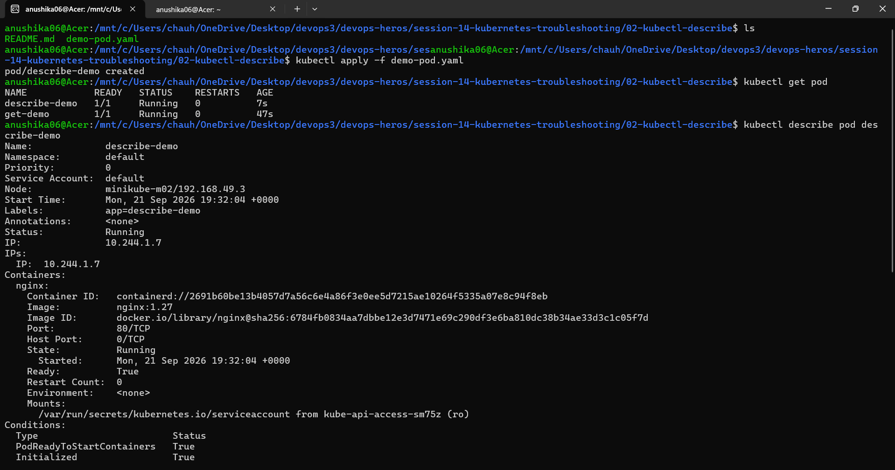

---

## 3. `kubectl logs`

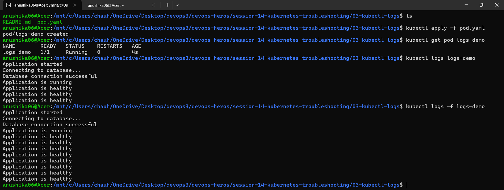

---

## 4. `kubectl exec`

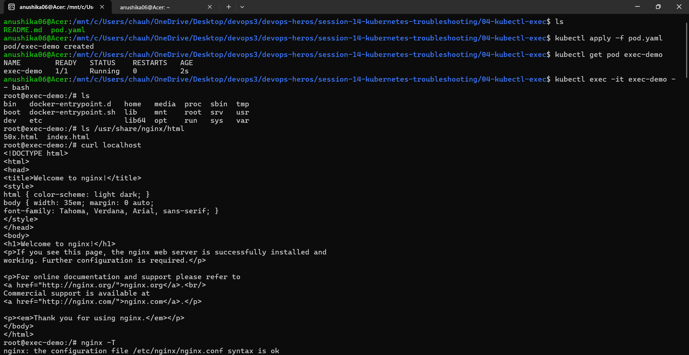
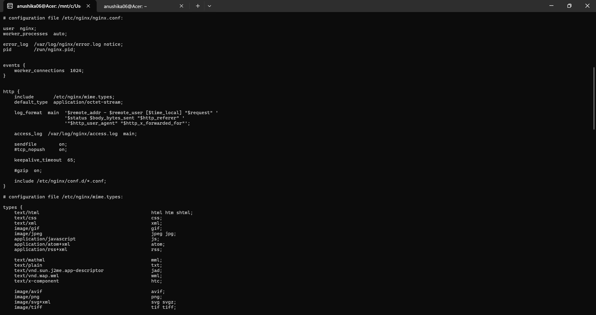
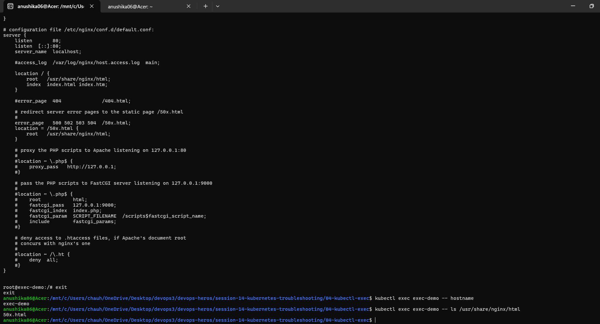
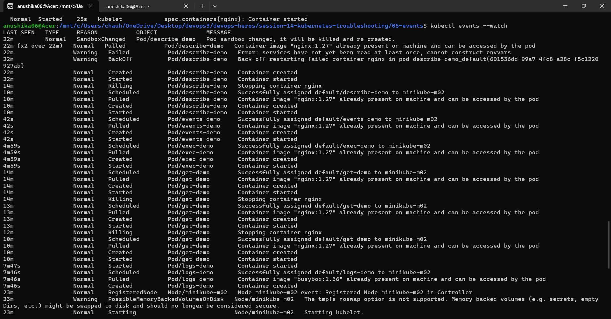
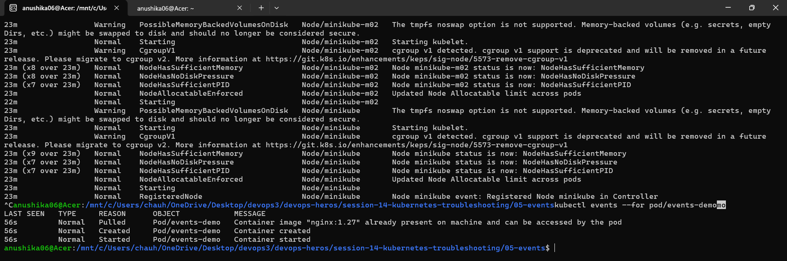
---

## 5. Kubernetes Events (`05-events`)

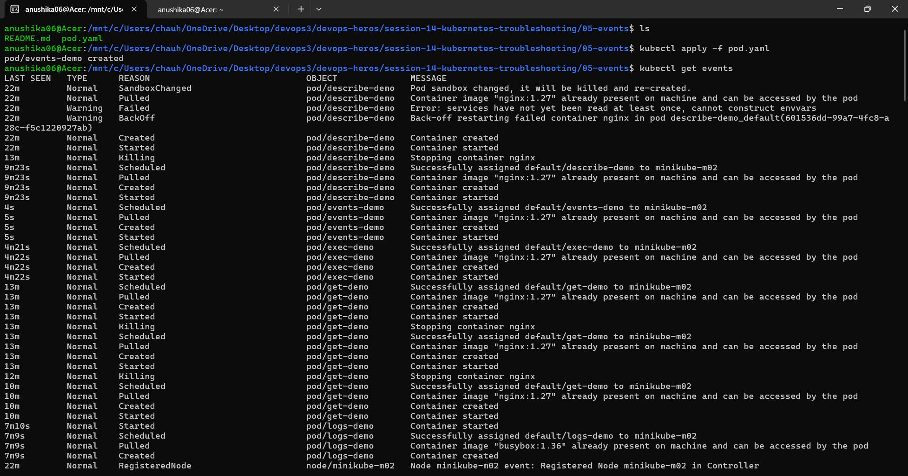
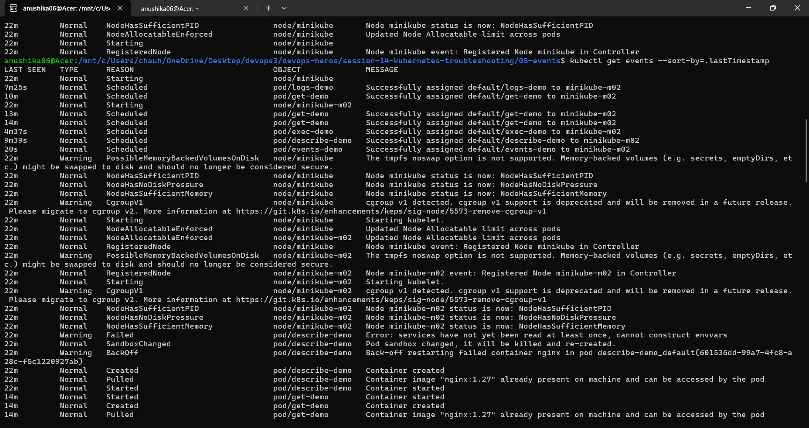
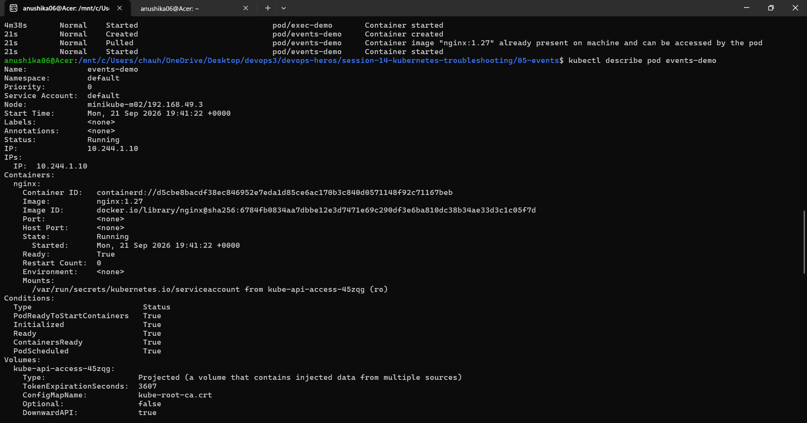
---

## 6. `CrashLoopBackOff`

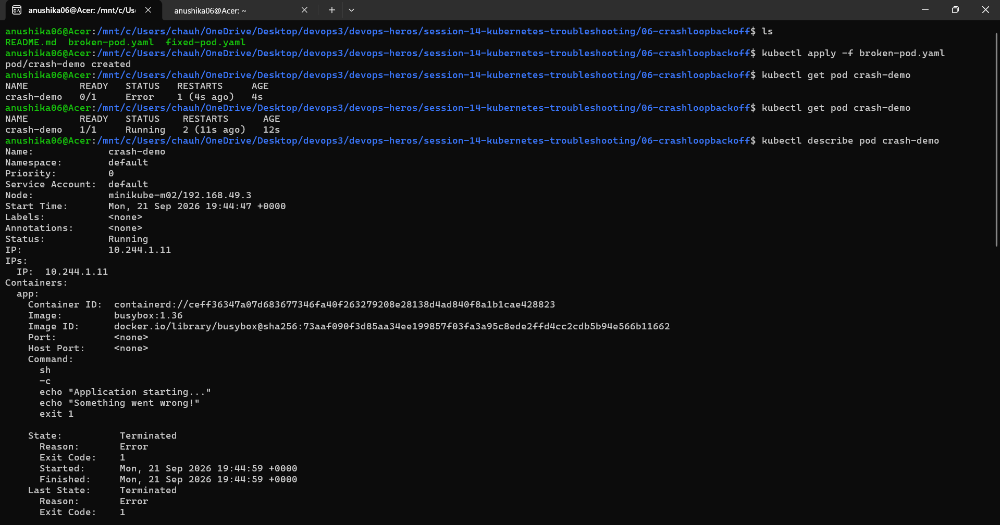
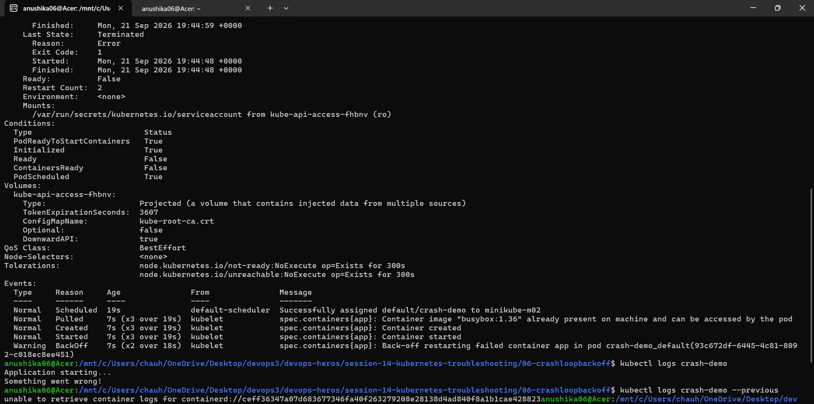
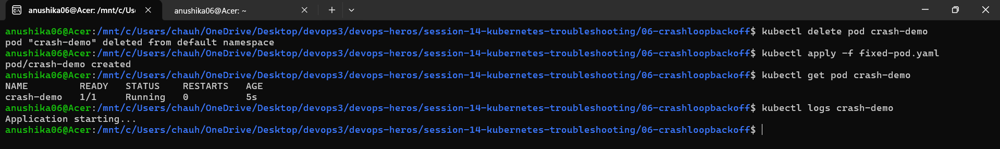
---

## 7. `ImagePullBackOff`

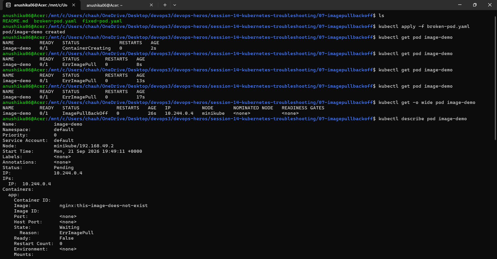
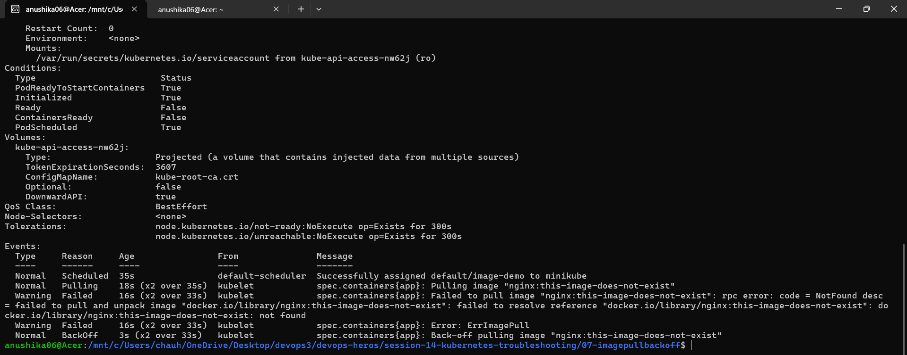
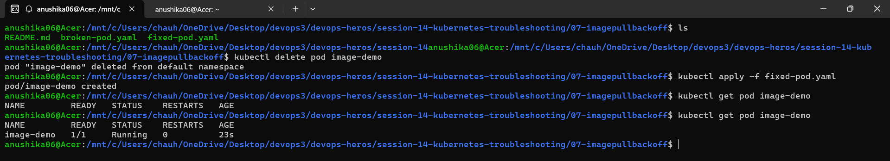

---

## 8. `Pending` Pods

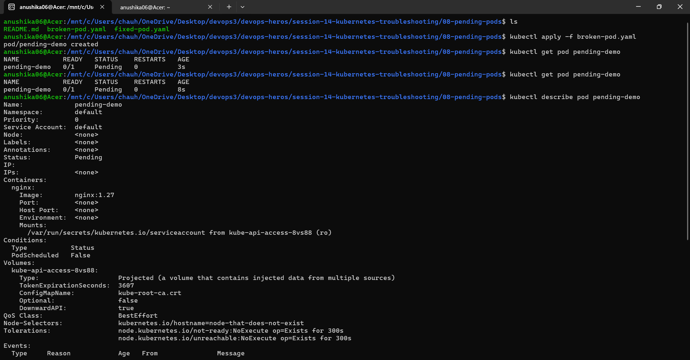
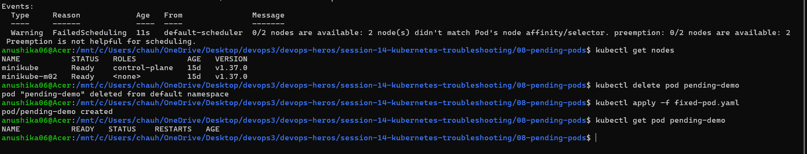

---

## Difference Between `kubectl logs` and `kubectl events`

| Feature | `kubectl logs` | `kubectl events` (or `kubectl get events`) |
| :--- | :--- | :--- |
| **Primary Scope** | Application & Container Level | Kubernetes Control Plane & Cluster Level |
| **What it Captures** | Output written to `stdout` and `stderr` **by the application running inside the container**. | System lifecycle events recorded **by Kubernetes components** (`kube-scheduler`, `kubelet`, `controller-manager`). |
| **Primary Purpose** | Debug application-internal errors (e.g., unhandled exceptions, database connection errors, runtime crashes). | Debug infrastructure, scheduling, and state transition failures (e.g., `FailedScheduling`, `ErrImagePull`, `OOMKilled`, node taints). |
| **Data Origin** | Generated directly inside the running/previous container process space. | Generated by cluster control plane daemons auditing resource state changes. |
| **Retention** | Available as long as container log files exist on the host node disk. | **Short retention**: Stored in `etcd` and automatically deleted after **1 hour** by default. |
| **Availability on Failure** | Available while container runs (or previous container via `--previous` if it crashed). Empty if container fails before writing stdout. | Available even if container fails to start, is never created, or cannot be pulled/scheduled. |

### Key Summary:
* **`kubectl events`** shows **what the Kubernetes control plane is doing** to your resources (e.g., Why is my pod pending? Why did image pull fail?).
* **`kubectl logs`** shows **what your application code is saying** inside the container (e.g., Why did my backend service throw a 500 error?).
