# Session 14 – Kubernetes Troubleshooting

## Overview

This session focuses on troubleshooting Kubernetes workloads using `kubectl` commands. The practical covers Pod status, logs, Events, container inspection, and common Kubernetes issues.

## Objectives

* Check Pod status and inspect resources.
* Analyze logs and Kubernetes Events.
* Investigate common Pod failures.
* Test Kubernetes Services and DNS.

## Environment

| Component          | Details    |
| ------------------ | ---------- |
| Operating System   | Windows    |
| Terminal           | PowerShell |
| Kubernetes Tool    | kubectl    |
| Kubernetes Cluster | Minikube   |
| Namespace          | default    |

---

# 1. kubectl get – Checking Pod Status

## Objective

To view Pods and identify their current status.

### Command 1

```powershell
kubectl apply -f 01-kubectl-get/sample-workload.yaml
```

**Screenshot:**

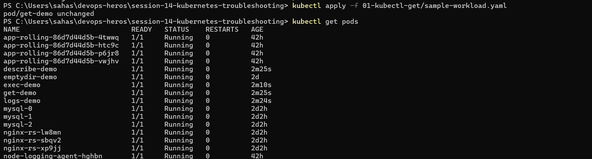

### Command 2

```powershell
kubectl get pods
```

### Command 3

```powershell
kubectl get pods -o wide
```

## Observation

Most Pods were Running. The `lifecycle-crashloop` Pod was in `CrashLoopBackOff` with 89 restarts, while both `troubleshooting-app` replicas were running and ready.

## Learning

`kubectl get` provides a quick overview of Pod status, readiness, restarts, and node information.

---

# 2. kubectl describe – Inspecting Pod Details

## Objective

To inspect a Pod's configuration, status, and Events.

### Command 1

```powershell
kubectl apply -f 02-kubectl-describe/demo-pod.yaml
```

**Screenshot:**

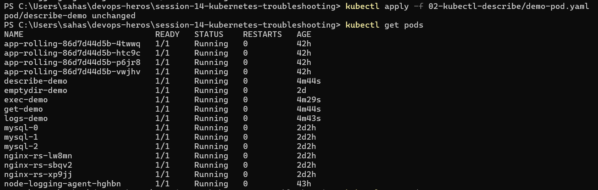

### Command 2

```powershell
kubectl get pod
```

### Command 3

```powershell
kubectl describe pod describe-demo
```

## Observation

The inspected `troubleshooting-app` Pod was Running and Ready, using `nginx:1.27`, with zero restarts. Events showed successful scheduling and container startup.

## Learning

`kubectl describe` provides detailed resource information and helps identify issues through Pod conditions and Events.

---

# 3. kubectl logs – Viewing Application Logs

## Objective

To view container logs and observe application output.

### Command 1

```powershell
kubectl apply -f 03-kubectl-logs/pod.yaml
```

### Command 2

```powershell
kubectl get pod logs-demo
```

**Screenshot:**

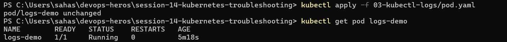

### Command 3

```powershell
kubectl logs logs-demo
```

**Screenshot:**

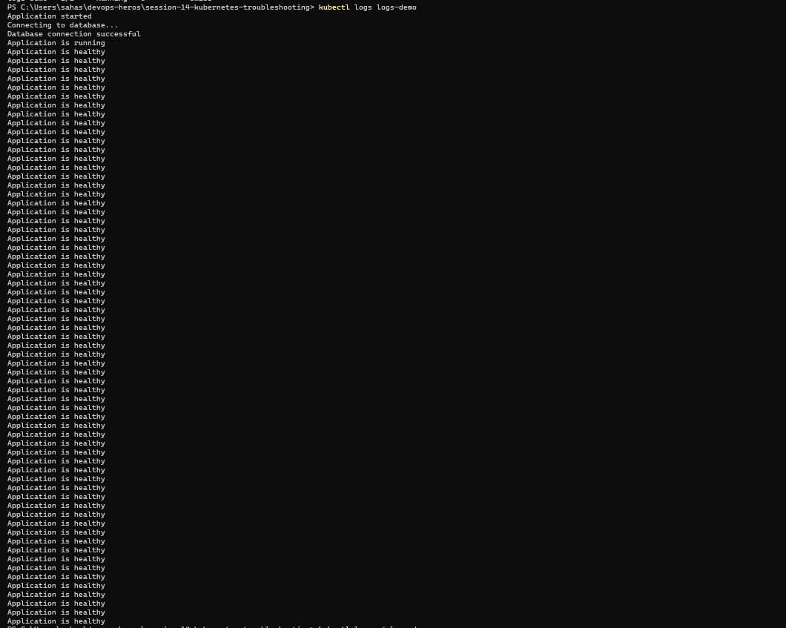

### Command 4

```powershell
kubectl logs -f logs-demo
```

Press `Ctrl + C` to stop following logs.

**Screenshot:**

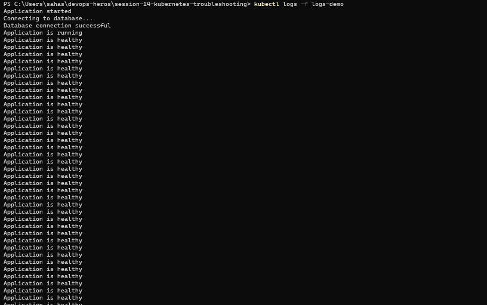

## Learning

`kubectl logs` displays container output, while `-f` continuously follows new logs. Logs help investigate application errors and behavior.

---

# 4. kubectl exec – Executing Commands Inside a Container

## Objective

To inspect a running container by executing commands inside it.

### Command 1

```powershell
kubectl apply -f 04-kubectl-exec/pod.yaml
```


### Command 2

```powershell
kubectl get pod exec-demo
```

### Command 3

```powershell
kubectl exec -it exec-demo -- sh
```

**Inside the container:**

```sh
ls
ls /usr/share/nginx/html
```

If available:

```sh
curl localhost
```

Then exit:

```sh
exit
```


### Command 4

```powershell
kubectl exec exec-demo -- hostname
```


## Learning

`kubectl exec` allows us to inspect files and execute commands inside a running container.

---

**Screenshot:**

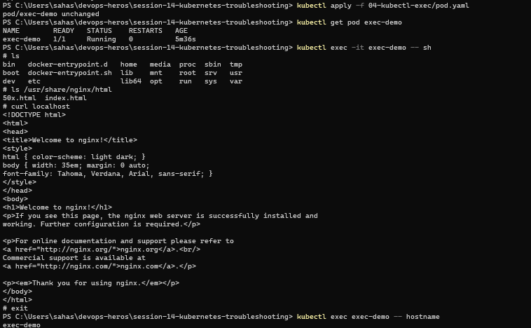


# 5. Kubernetes Events – Understanding Resource Activity

## Objective

To observe Kubernetes Events during Pod creation and execution.

### Command 1

```powershell
cd 05-events
```

### Command 2

```powershell
ls
```

### Command 3

```powershell
kubectl apply -f pod.yaml
```

### Command 4

```powershell
kubectl get pods
```

### Command 5

```powershell
kubectl events --for pod/events-demo -w
```

Press `Ctrl + C` after capturing the output.

**Screenshot:**

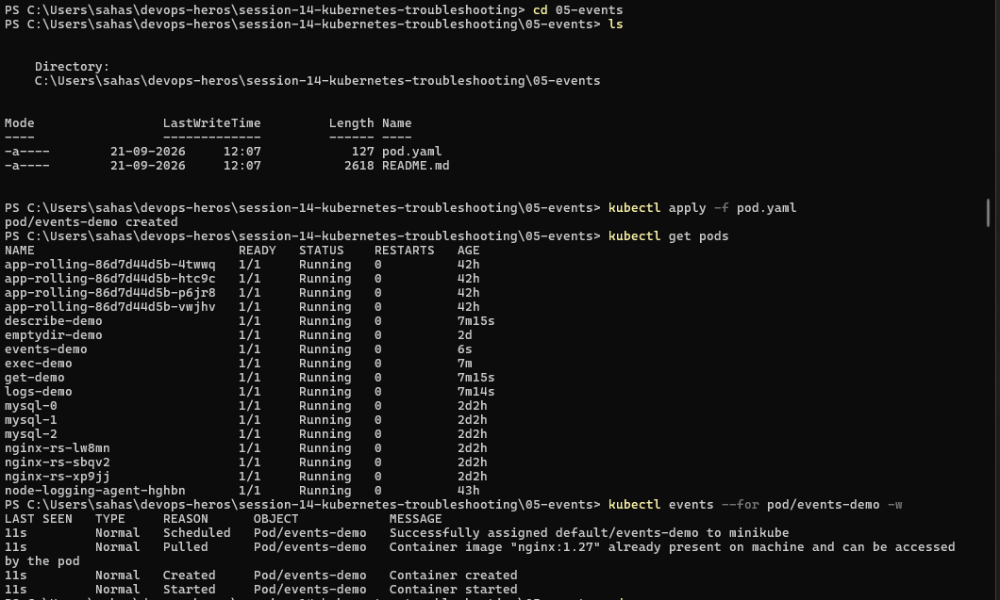


Return to the session directory:

```powershell
cd ..
```

## Learning

Events record Kubernetes actions such as scheduling, image pulling, container creation, and startup. They help identify where a problem occurred.

---

# 6. CrashLoopBackOff – Investigating a Crashing Pod

## Objective

To observe a crashing Pod and investigate its logs.

### Command 1

```powershell
cd 06-crashloopbackoff
```

### Command 2

```powershell
kubectl apply -f broken-pod.yaml
```

### Command 3

```powershell
kubectl get pods
```

### Command 4

```powershell
kubectl logs crash-demo
```

**Screenshot:**

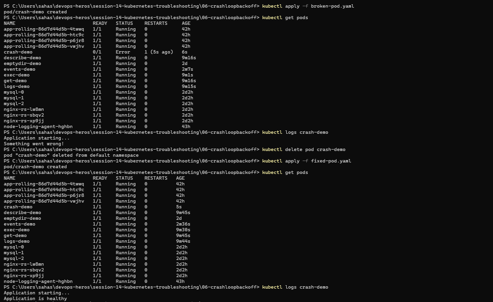

## Learning

`CrashLoopBackOff` occurs when a container repeatedly crashes and Kubernetes attempts to restart it. Logs help investigate the cause.

---

# 7. ImagePullBackOff – Investigating Image Pull Failures

## Objective

To observe a Pod that cannot pull its container image.

### Command 1

```powershell
cd ..\07-imagepullbackoff
```

### Command 2

```powershell
kubectl apply -f broken-pod.yaml
```

**Screenshot:**

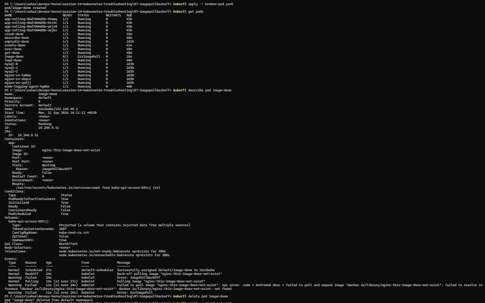

### Command 3

```powershell
kubectl get pods
```

### Command 4

```powershell
kubectl describe pod image-demo
```

**Screenshot:**

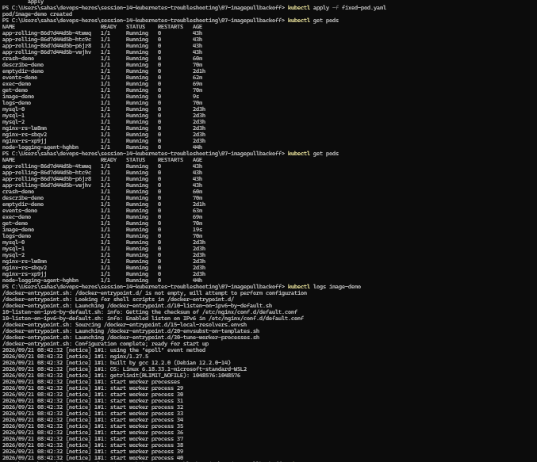

## Learning

`ImagePullBackOff` occurs when Kubernetes cannot pull the specified image. The Pod description and Events help identify the image-pull failure.

---

# 8. Pending Pods – Investigating Scheduling Issues

## Objective

To observe a Pending Pod and investigate its scheduling status.

### Command 1

```powershell
cd ..\08-pending-pods
```

### Command 2

```powershell
kubectl apply -f broken-pod.yaml
```


### Command 3

```powershell
kubectl get pods
```


### Command 4

```powershell
kubectl describe pod pending-demo
```


## Learning

A Pod may remain `Pending` when Kubernetes cannot schedule it or complete its setup. The `describe` command helps investigate Pod conditions and Events.

---

# 9. Service & DNS Troubleshooting

## Objective

To deploy a web application, inspect its Service, and test DNS resolution and connectivity.

### Command 1

```powershell
cd ..\09-service-dns-troubleshooting
```

### Command 2

```powershell
kubectl apply -f deployment.yaml
```


### Command 3

```powershell
kubectl apply -f service.yaml
```

### Command 4

```powershell
kubectl apply -f dns-test-pod.yaml
```


### Command 5

```powershell
kubectl get pods
```

### Command 6

```powershell
kubectl get all
```


### Command 7

```powershell
kubectl get svc
```

### Command 8

```powershell
kubectl get endpoints web-service
```

### Command 9

```powershell
kubectl get pod dns-test -w
```

Press `Ctrl + C` once the Pod is Running.


### Command 10

```powershell
kubectl exec -it dns-test -- nslookup web-service
```

### Command 11

```powershell
kubectl exec dns-test -- wget -qO- http://web-service
```

**Screenshot:**

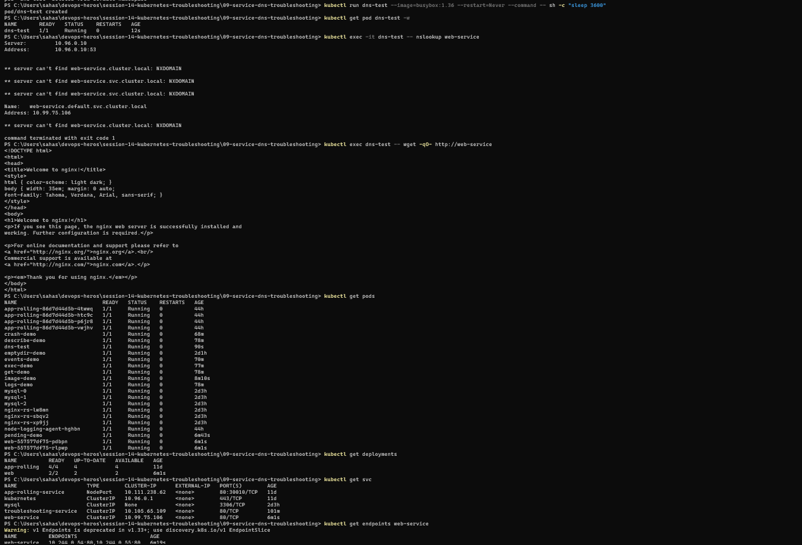

## Observation

The DNS lookup resolved `web-service.default.svc.cluster.local` to `10.99.75.106`. Some lookup attempts returned `NXDOMAIN`, but the Service name resolved successfully.

The original DNS test image could not be pulled. The DNS test was subsequently performed using a BusyBox Pod. The `wget` command returned the Nginx welcome page, confirming Service connectivity.

## Learning

Checking Pods, Services, endpoints, DNS, and HTTP connectivity helps investigate Kubernetes networking issues.

---

# Troubleshooting Commands Summary

| Command                                                      | Purpose                        |
| ------------------------------------------------------------ | ------------------------------ |
| `kubectl get pods`                                           | Check Pod status               |
| `kubectl describe pod <pod-name>`                            | Inspect Pod details and Events |
| `kubectl logs <pod-name>`                                    | View container logs            |
| `kubectl logs -f <pod-name>`                                 | Follow logs                    |
| `kubectl exec -it <pod-name> -- sh`                          | Open a container shell         |
| `kubectl events --for pod/<pod-name> -w`                     | Watch Pod Events               |
| `kubectl get svc`                                            | View Services                  |
| `kubectl get endpoints <service-name>`                       | View Service endpoints         |
| `kubectl exec <pod-name> -- nslookup <service-name>`         | Test DNS resolution            |
| `kubectl exec <pod-name> -- wget -qO- http://<service-name>` | Test Service connectivity      |

---

# Conclusion

This practical provided hands-on experience with Kubernetes troubleshooting. I learned to inspect Pod status, analyze logs and Events, investigate common Pod issues, and test Service and DNS connectivity using `kubectl`.
