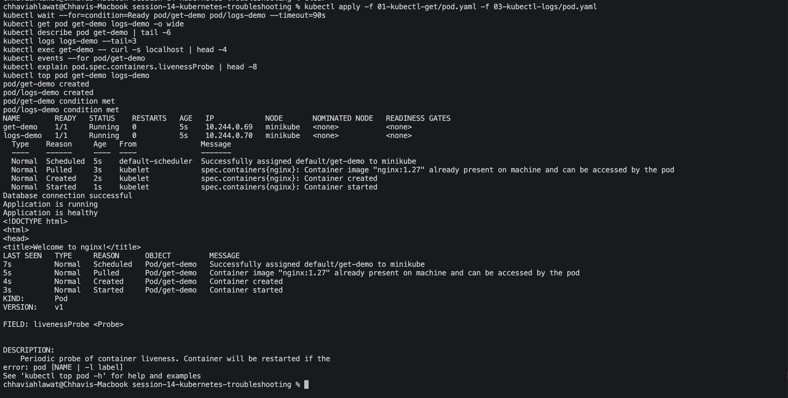
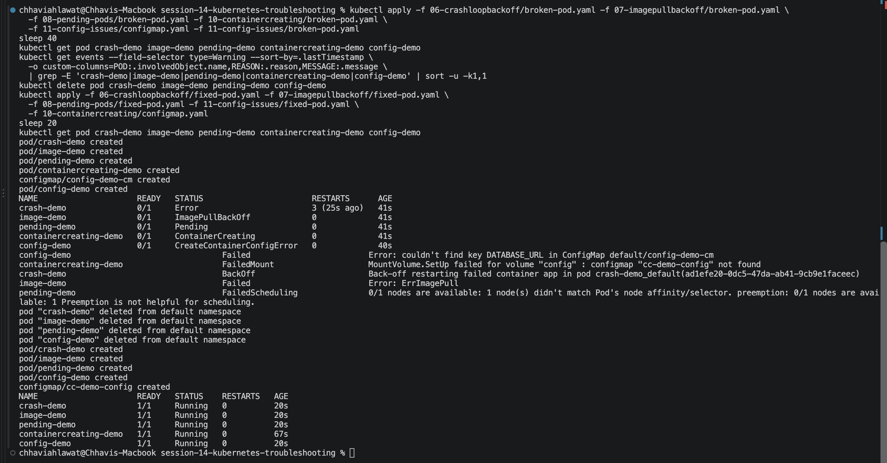
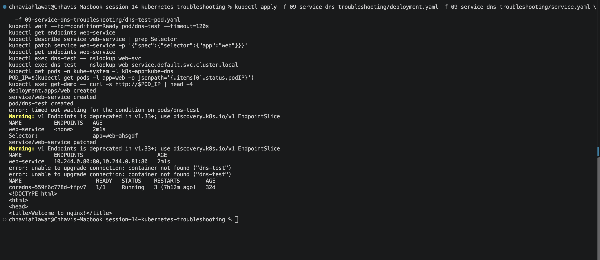
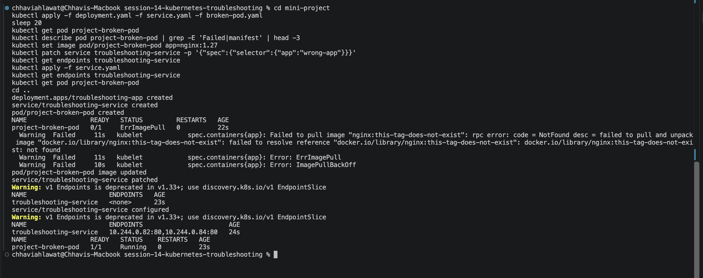

# Session 14 — Kubernetes Troubleshooting (Homework)

**Name:** Chhavi Ahlawat
**Enrollment Number:** 24BCS10201
**Email:** chhavi.24bcs10201@sst.scaler.com

---

## Homework Tasks

| Task | Description | Status |
|---|---|---|
| 1 | kubectl get / describe / logs / exec / events / explain / top / -o wide | ✅ |
| 2 | Debug CrashLoopBackOff, ImagePullBackOff/ErrImagePull, Pending, ContainerCreating, config, Service, DNS and networking issues | ✅ |
| 3 | Mini project: debug the broken pod and the Service selector | ✅ |

All commands are run from `session-14-kubernetes-troubleshooting/` on minikube:
```bash
minikube start
minikube addons enable metrics-server     # needed for kubectl top
```

---

## 1. Core kubectl Commands

```bash
kubectl apply -f 01-kubectl-get/pod.yaml -f 03-kubectl-logs/pod.yaml
kubectl wait --for=condition=Ready pod/get-demo pod/logs-demo --timeout=90s
kubectl get pod get-demo logs-demo -o wide
kubectl describe pod get-demo | tail -6
kubectl logs logs-demo --tail=3
kubectl exec get-demo -- curl -s localhost | head -4
kubectl events --for pod/get-demo
kubectl explain pod.spec.containers.livenessProbe | head -8
kubectl top pod get-demo logs-demo
```


---

## 2. Troubleshooting Pod Issues

Every issue follows the same steps: **get → describe / events → root cause → fix → verify**.

| Issue | Pod | Root cause | Fix |
|---|---|---|---|
| CrashLoopBackOff | `crash-demo` | Command runs `exit 1`, so the container dies on start | Long-running command (`sleep 3600`) |
| ErrImagePull → ImagePullBackOff | `image-demo` | Tag `nginx:this-image-does-not-exist` isn't in the registry | Valid tag `nginx:1.27` |
| Pending | `pending-demo` | `nodeSelector` matches no node (`FailedScheduling`) | Remove the nodeSelector |
| ContainerCreating | `containercreating-demo` (added) | Mounts ConfigMap `cc-demo-config`, which doesn't exist (`FailedMount`) | Create the ConfigMap |
| Config issue | `config-demo` (added) | Env var refers to key `DATABASE_URL`, but the ConfigMap only has `DB_URL` (`CreateContainerConfigError`) | Point `configMapKeyRef.key` at `DB_URL` |

```bash
# break: apply all broken pods
kubectl apply -f 06-crashloopbackoff/broken-pod.yaml -f 07-imagepullbackoff/broken-pod.yaml \
  -f 08-pending-pods/broken-pod.yaml -f 10-containercreating/broken-pod.yaml \
  -f 11-config-issues/configmap.yaml -f 11-config-issues/broken-pod.yaml
sleep 40
kubectl get pod crash-demo image-demo pending-demo containercreating-demo config-demo

# investigate: one warning event per pod shows the root cause
kubectl get events --field-selector type=Warning --sort-by=.lastTimestamp \
  -o custom-columns=POD:.involvedObject.name,REASON:.reason,MESSAGE:.message \
  | grep -E 'crash-demo|image-demo|pending-demo|containercreating-demo|config-demo' | sort -u -k1,1

# fix and verify
kubectl delete pod crash-demo image-demo pending-demo config-demo
kubectl apply -f 06-crashloopbackoff/fixed-pod.yaml -f 07-imagepullbackoff/fixed-pod.yaml \
  -f 08-pending-pods/fixed-pod.yaml -f 11-config-issues/fixed-pod.yaml \
  -f 10-containercreating/configmap.yaml
sleep 20
kubectl get pod crash-demo image-demo pending-demo containercreating-demo config-demo
```


---

## 3. Service, DNS and Pod Networking (`09-service-dns-troubleshooting/`)

| Issue | Root cause | Fix |
|---|---|---|
| Service has no endpoints | Selector `app: web-ahsgdf` ≠ pod label `app: web` | Patch the selector to `app: web` |
| DNS lookup fails (`NXDOMAIN`) | Wrong name `web-svc`; DNS format is `<svc>.<ns>.svc.cluster.local` | Use `web-service.default.svc.cluster.local` |

```bash
kubectl apply -f 09-service-dns-troubleshooting/deployment.yaml -f 09-service-dns-troubleshooting/service.yaml \
  -f 09-service-dns-troubleshooting/dns-test-pod.yaml
kubectl wait --for=condition=Ready pod/dns-test --timeout=120s
kubectl get endpoints web-service                                  # <none>
kubectl describe service web-service | grep Selector
kubectl patch service web-service -p '{"spec":{"selector":{"app":"web"}}}'
kubectl get endpoints web-service                                  # pod IPs now
kubectl exec dns-test -- nslookup web-svc                          # fails
kubectl exec dns-test -- nslookup web-service.default.svc.cluster.local
kubectl get pods -n kube-system -l k8s-app=kube-dns
POD_IP=$(kubectl get pods -l app=web -o jsonpath='{.items[0].status.podIP}')
kubectl exec get-demo -- curl -s http://$POD_IP | head -4          # pod-to-pod networking
```


---

## 4. Mini Project (`mini-project/`)

```bash
cd mini-project
kubectl apply -f deployment.yaml -f service.yaml -f broken-pod.yaml
sleep 20
kubectl get pod project-broken-pod
kubectl describe pod project-broken-pod | grep -E 'Failed|manifest' | head -3
kubectl set image pod/project-broken-pod app=nginx:1.27
kubectl patch service troubleshooting-service -p '{"spec":{"selector":{"app":"wrong-app"}}}'
kubectl get endpoints troubleshooting-service                     # <none>
kubectl apply -f service.yaml                                      # restore app: troubleshooting-app
kubectl get endpoints troubleshooting-service
kubectl get pod project-broken-pod
cd ..
```


| Q | Answer |
|---|---|
| 1. Pod status? | `ErrImagePull`, then `ImagePullBackOff` |
| 2. Actual error? | `manifest for nginx:this-tag-does-not-exist not found` |
| 3. Command that found it? | `kubectl describe pod project-broken-pod` (Events) |
| 4. What's wrong with the image? | The tag doesn't exist on Docker Hub |
| 5. Fix? | Use a valid tag (`nginx:1.27`) in the YAML, or `kubectl set image` |

### Troubleshooting table
| Problem | What I Saw | Command I Used | Root Cause | Fix |
| :--- | :--- | :--- | :--- | :--- |
| **Broken Pod** | `ImagePullBackOff` | `kubectl describe pod` | Image tag doesn't exist | Valid tag `nginx:1.27` |
| **Service Problem** | Endpoints `<none>` | `kubectl get endpoints`, `--show-labels` | Selector `wrong-app` ≠ label `troubleshooting-app` | Fix the selector |
| **Image Problem** | `ErrImagePull` | `kubectl describe pod` (Events) | Registry has no such manifest | Correct the image reference |

### Questions
1. **get:** a quick status overview of resources (READY, STATUS, RESTARTS).
2. **get vs describe:** `get` is a one-line summary. `describe` gives the full detail plus Events.
3. **logs:** to read the app's stdout/stderr (`--previous` shows the output of a crashed container).
4. **exec:** to run commands inside a running container, e.g. curl, env or checking files.
5. **CrashLoopBackOff:** the container keeps exiting and Kubernetes waits longer before each restart.
6. **ImagePullBackOff:** the image can't be pulled (wrong name or tag, or no auth), so Kubernetes waits longer before each retry.
7. **Pending:** the scheduler can't place the Pod (not enough CPU/memory, no node matches the selector or affinity, taints, PVC not bound).
8. **No endpoints:** the selector matches no pods, or the matching pods aren't Ready.
9. **Selector ↔ labels:** a Service sends traffic to the pods whose labels match its selector.
10. **Kubernetes DNS:** CoreDNS resolves `<svc>.<ns>.svc.cluster.local` to the Service's ClusterIP.

---

## Cleanup
```bash
kubectl delete -f mini-project/deployment.yaml -f mini-project/service.yaml -f mini-project/broken-pod.yaml
kubectl delete pod get-demo logs-demo crash-demo image-demo pending-demo containercreating-demo config-demo dns-test --ignore-not-found
kubectl delete configmap cc-demo-config config-demo-cm
kubectl delete -f 09-service-dns-troubleshooting/deployment.yaml -f 09-service-dns-troubleshooting/service.yaml
```

---

## Resources
- https://kubernetes.io/docs/tasks/debug/debug-application/
- https://kubernetes.io/docs/tasks/debug/debug-application/debug-service/
- https://kubernetes.io/docs/tasks/administer-cluster/dns-debugging-resolution/
