# Session 14 Homework: Kubernetes Troubleshooting

Everything here was run on minikube (Kubernetes v1.37, single node, Docker driver) in namespace `s14`. Every step has a real terminal screenshot in an `outputs/` folder.

| Task | Where |
|---|---|
| Task 1: Troubleshooting commands | [01-commands/](01-commands/) (this README, section 1) |
| Task 2: Troubleshoot common issues (9 types) | [02-issues/](02-issues/) (this README, section 2) |
| Task 3: Mini project | [../mini-project/README.md](../mini-project/README.md) (answers, table and evidence filled in) |

---

## 1. Task 1: Troubleshooting commands

Practised against the demo Pods in `01-kubectl-get/` … `05-events/`.

| Command | What it tells you | Output |
|---|---|---|
| `kubectl get pods`, `--show-labels`, `-l app=x`, `-o yaml`, `-o jsonpath`, `get all`, `-A` | Status summary; labels; filter by label; full object; single fields; everything in a namespace / all namespaces | [01-get](01-commands/outputs/01-get.png) |
| `kubectl get pods -o wide`, `get nodes -o wide` | Adds Pod IP, node, nominated node; node IPs, OS, kernel, runtime | [02-get-wide](01-commands/outputs/02-get-wide.png) |
| `kubectl describe pod` | Container state, exit code, restart count, mounts, conditions, QoS, **Events** | [03-describe](01-commands/outputs/03-describe.png) |
| `kubectl logs`, `--tail`, `--since`, `--timestamps`, `-l` across Pods, `--previous` | Application stdout/stderr | [04-logs](01-commands/outputs/04-logs.png) |
| `kubectl exec` | Run commands inside the container: version, files, `resolv.conf`, `curl localhost`, env vars | [05-exec](01-commands/outputs/05-exec.png) |
| `kubectl get events --sort-by=.lastTimestamp`, `kubectl events --for pod/x`, `--field-selector type=Warning` | Cluster timeline: scheduling, pulls, probe failures, back-offs | [06-events](01-commands/outputs/06-events.png) |
| `kubectl explain <resource.field>` | Built-in API docs for any field, e.g. `pod.spec.containers.livenessProbe`, `deployment.spec.strategy`, `svc.spec.type` | [07-explain](01-commands/outputs/07-explain.png) |
| `kubectl top nodes`, `top pods`, `--sort-by=memory`, `--containers` | Live CPU and memory from metrics-server | [08-top](01-commands/outputs/08-top.png) |

### Screenshots

#### 01-get

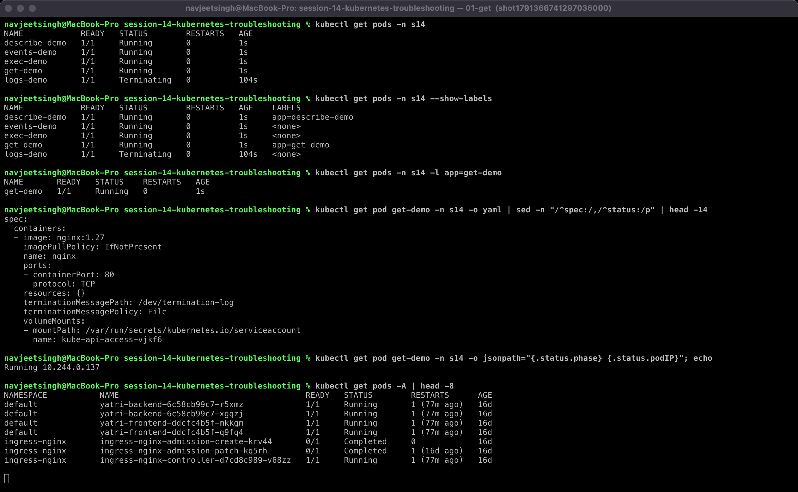

#### 02-get-wide

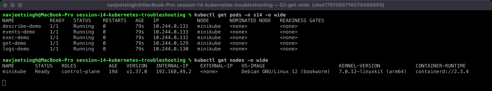

#### 03-describe

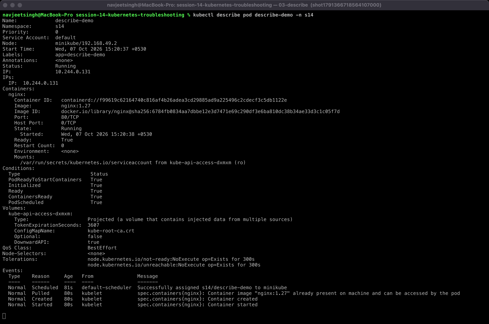

#### 04-logs

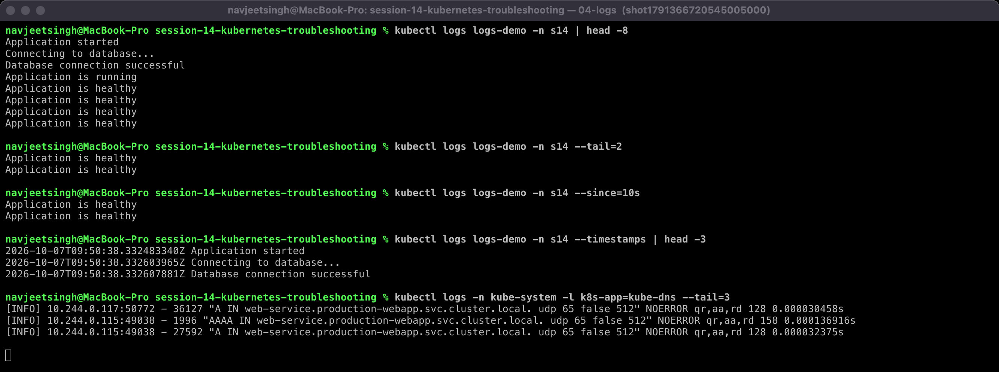

#### 05-exec

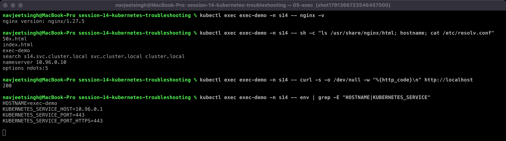

#### 06-events

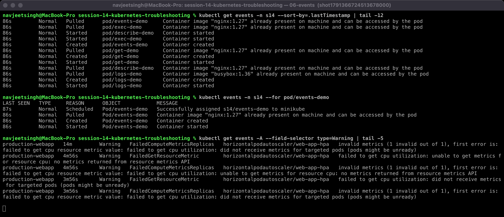

#### 07-explain

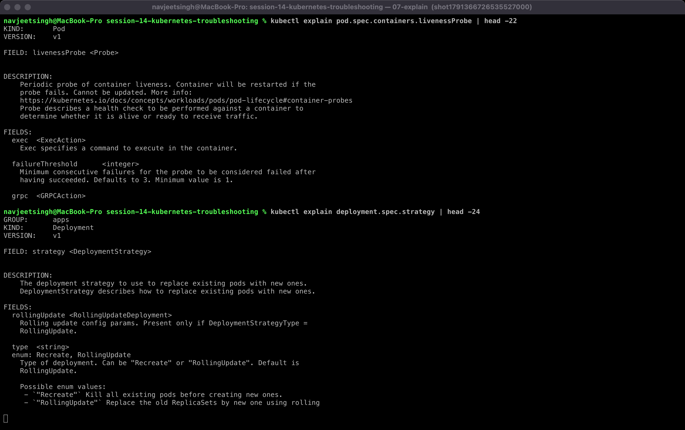

#### 08-top

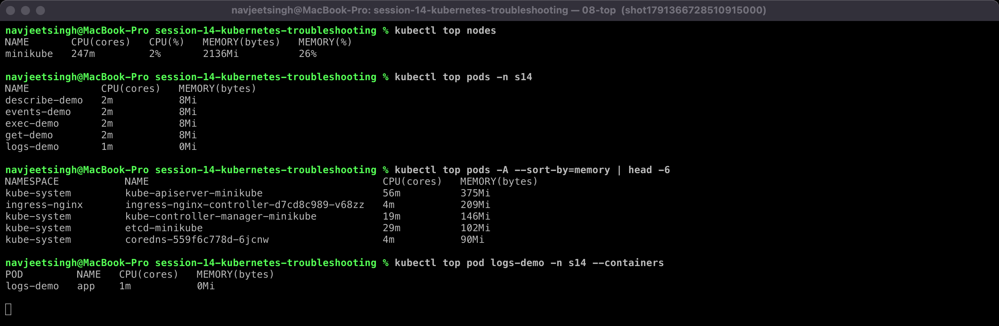

Useful things I noticed:
- `kubectl get pod -o jsonpath='{.status.phase} {.status.podIP}'` is handy in scripts.
- `kubectl exec ... cat /etc/resolv.conf` shows `search s14.svc.cluster.local svc.cluster.local cluster.local` and `ndots:5`. This explains why short Service names only work inside the same namespace (see issue 6).
- `kubectl top` returns `error: metrics not available yet` for ~60s after a Pod starts. metrics-server needs one scrape first.
- `kubectl logs -n kube-system -l k8s-app=kube-dns` shows every DNS query CoreDNS answers, including `NXDOMAIN`s, which is very useful for DNS debugging.

---

## 2. Task 2: Troubleshoot common issues

Every issue folder contains `broken.yaml`, a fix (`fixed.yaml` / `fixed-secret.yaml`), any supporting manifests, and `outputs/01-before` + `outputs/02-after`.

### Quick map: symptom → first command

| Symptom in `kubectl get pods` | Where the cause shows up |
|---|---|
| `CrashLoopBackOff` / `Error` | `kubectl logs` (+ `--previous`), exit code in `describe` |
| `ErrImagePull` / `ImagePullBackOff` | `describe` → Events (`Failed to pull image ...`) |
| `Pending` | `describe` → `FailedScheduling` event |
| `ContainerCreating` for a long time | `describe` → `FailedMount` / CNI / sandbox events |
| `CreateContainerConfigError` | `describe` → Events (missing ConfigMap/Secret or key) |
| `Running` but app unreachable | `get endpointslices`, `describe svc`, `exec` + `curl` / `netstat` / `nslookup` |

---

### 2.1 CrashLoopBackOff: [02-issues/01-crashloopbackoff](02-issues/01-crashloopbackoff/)

- **Problem:** `orders-api` Pod never becomes Ready: `0/1 Error`, `RESTARTS 3` within 45 seconds.
- **Investigation:**
  ```text
  $ kubectl describe pod orders-api
      State: Terminated  Reason: Error  Exit Code: 1   (Last State: same)   Restart Count: 3
  $ kubectl events --for pod/orders-api
      Warning  BackOff  Back-off restarting failed container app in pod orders-api
  $ kubectl logs orders-api
      [FATAL] DATABASE_URL environment variable is missing
  ```
- **Root cause:** the application requires `DATABASE_URL` and exits with code 1 when it is missing. The image and the cluster are fine; the Pod spec is missing config.
- **Fix:** add the env var ([fixed.yaml](02-issues/01-crashloopbackoff/fixed.yaml)) and re-create the Pod.
- **Verify:** `1/1 Running`, `RESTARTS 0`, logs show `orders-api started, db=postgres://orders-db:5432/orders`.
- **Before / after:**

  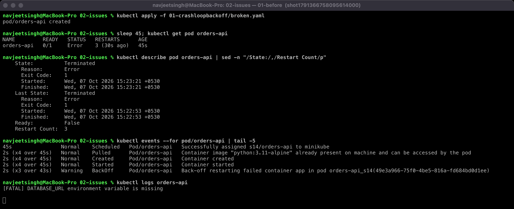

  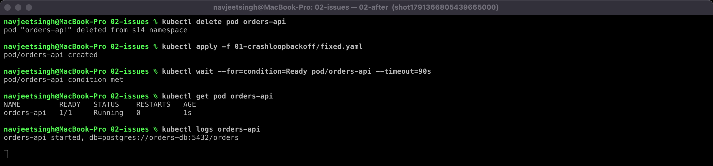

### 2.2 ErrImagePull → ImagePullBackOff: [02-issues/02-imagepullbackoff-errimagepull](02-issues/02-imagepullbackoff-errimagepull/)

- **Problem:** `web-frontend` stuck at `0/1`.
- **Investigation:** sampling `kubectl get pod` every 4s shows the progression `ContainerCreating → ErrImagePull (4s–12s) → ImagePullBackOff (16s–24s) → ErrImagePull again (28s, next retry)`. In other words, **ErrImagePull** is the failed attempt itself and **ImagePullBackOff** is the kubelet waiting before the next retry.
  ```text
  Warning Failed  Failed to pull image "nginx:1.27.99": rpc error: code = NotFound ...
                  docker.io/library/nginx:1.27.99: not found
  Normal  BackOff Back-off pulling image "nginx:1.27.99"
  ```
- **Root cause:** typo in the image tag. `nginx:1.27.99` doesn't exist (`NotFound`, not `unauthorized` or a timeout).
- **Fix:** `image: nginx:1.27` ([fixed.yaml](02-issues/02-imagepullbackoff-errimagepull/fixed.yaml)).
- **Verify:** `1/1 Running`; `describe` shows `Image: nginx:1.27`.
- **Before / after:**

  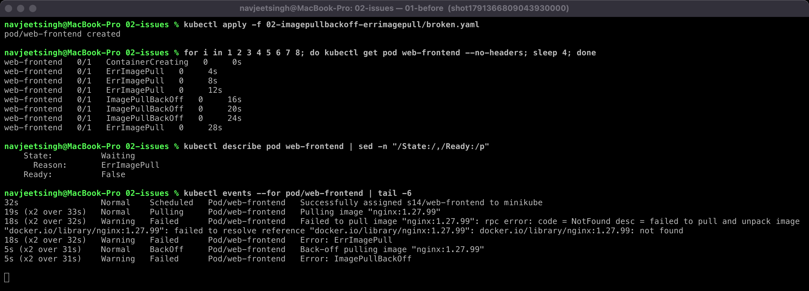

  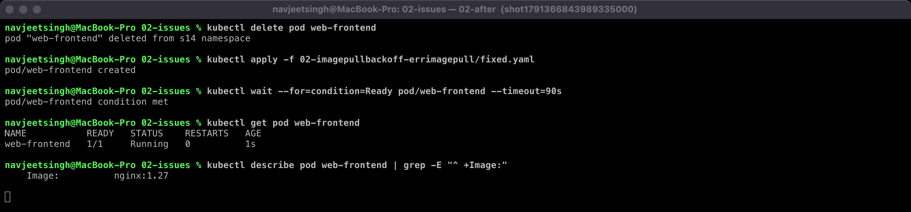

### 2.3 Pending: [02-issues/03-pending](02-issues/03-pending/)

- **Problem:** `report-worker` stays `Pending` with no IP and no node.
- **Investigation:**
  ```text
  Warning FailedScheduling  0/1 nodes are available: 1 Insufficient cpu, 1 Insufficient memory.
  $ kubectl get node minikube   ->  allocatable cpu=11 memory=8124384Ki (~7.7Gi); already requested 1450m / 894Mi
  ```
- **Root cause:** the Pod requests `cpu: "500"` (500 cores) and `memory: 1000Gi`. No node can satisfy this, so the scheduler never places it. Preemption can't help either.
- **Fix:** realistic requests `cpu: 100m`, `memory: 64Mi` ([fixed.yaml](02-issues/03-pending/fixed.yaml)).
- **Verify:** scheduled on `minikube`, `1/1 Running`.
- **Before / after:**

  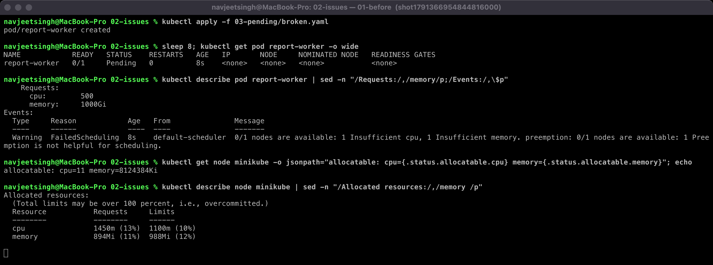

  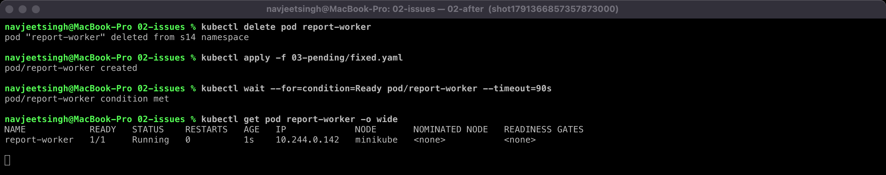

### 2.4 ContainerCreating (stuck): [02-issues/04-containercreating](02-issues/04-containercreating/)

- **Problem:** `payment-svc` shows `ContainerCreating` for 30s+ and never starts. It *was* scheduled, so this is not a scheduling issue.
- **Investigation:**
  ```text
  Warning FailedMount  MountVolume.SetUp failed for volume "tls" : secret "payment-tls" not found
  $ kubectl get secret payment-tls  ->  Error from server (NotFound)
  ```
- **Root cause:** the Pod mounts a Secret that was never created. The kubelet can't build the volume, so the container is never created and the kubelet keeps retrying.
- **Fix:** create the Secret ([fixed-secret.yaml](02-issues/04-containercreating/fixed-secret.yaml)). No Pod change is needed; the kubelet retries the mount automatically.
- **Verify:** Pod became `1/1 Running` on its own; `kubectl exec payment-svc -- ls /etc/payment/tls` → `api-key`.
- **Before / after:**

  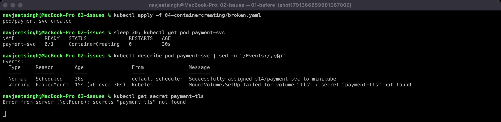

  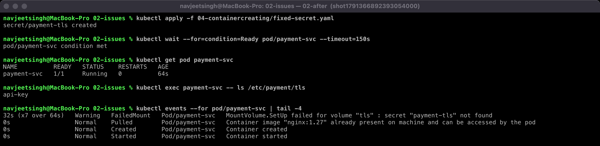
- Other common causes of a stuck `ContainerCreating`: a missing ConfigMap volume, a PVC that can't attach, CNI/IP allocation failures, or a very large image still pulling.

### 2.5 Service connectivity: [02-issues/05-service-connectivity](02-issues/05-service-connectivity/)

- **Problem:** both `catalog` Pods are `Running`, but `curl http://catalog` from a client Pod fails (curl exit 7, connection failed).
- **Investigation:** this one had **two** stacked bugs.
  ```text
  $ kubectl get endpointslices -l kubernetes.io/service-name=catalog   ->  ENDPOINTS <unset>
  $ kubectl get pods -l app=catalog --show-labels                      ->  app=catalog
  $ kubectl get svc catalog -o jsonpath=...                            ->  selector={"app":"catalogue"} targetPort=8080
  # fix #1 (selector) only:
  $ kubectl get endpointslices ...   ->  PORTS 8080  ENDPOINTS 10.244.0.144,10.244.0.146
  $ curl http://catalog               ->  still exit 7
  $ kubectl get pods ... .ports       ->  containerPort 80
  ```
- **Root cause:** (1) selector typo `catalogue` vs label `catalog` meant no endpoints at all. (2) `targetPort: 8080`, but nginx listens on 80, so once endpoints appeared, traffic hit a closed port.
- **Fix:** `selector: app: catalog`, `targetPort: 80` ([fixed.yaml](02-issues/05-service-connectivity/fixed.yaml)).
- **Verify:** EndpointSlice `PORTS 80`, `curl http://catalog` → `HTTP 200`; the FQDN `catalog.s14.svc.cluster.local` works too.
- **Lesson:** fixing the first bug and re-testing exposed the second one. Always verify after each change.
- **Before / after:**

  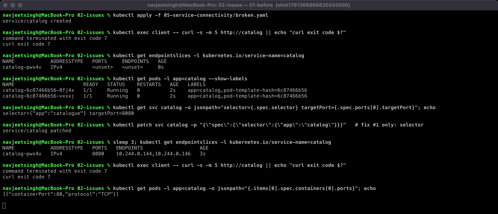

  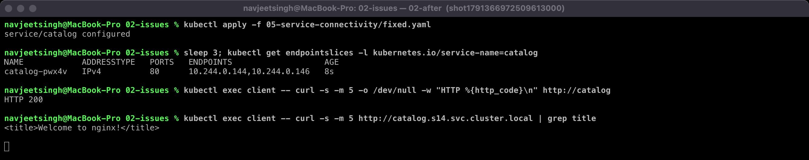

### 2.6 DNS: [02-issues/06-dns](02-issues/06-dns/)

- **Problem:** the `checkout` Pod logs `inventory -> FAILED (http://inventory)` every 5s.
- **Investigation:**
  ```text
  $ kubectl exec checkout -- cat /etc/resolv.conf   ->  search s14.svc.cluster.local svc.cluster.local cluster.local
  $ kubectl exec checkout -- nslookup inventory     ->  server can't find inventory.s14.svc.cluster.local: NXDOMAIN
  $ kubectl get svc -A | grep inventory             ->  s14-backend   inventory   ClusterIP 10.104.65.234
  $ nslookup inventory.s14-backend.svc.cluster.local ->  Address: 10.104.65.234
  $ kubectl logs -n kube-system -l k8s-app=kube-dns ->  "A IN inventory.s14.svc.cluster.local." NXDOMAIN
  ```
  CoreDNS itself is healthy (Running, and it resolves the FQDN), so DNS isn't broken; the *name* is wrong.
- **Root cause:** the `inventory` Service is in namespace `s14-backend`, but the client used the short name `inventory`. Short names are expanded with the client's own namespace first (`inventory.s14.svc.cluster.local`), which doesn't exist.
- **Fix:** `INVENTORY_URL=http://inventory.s14-backend.svc.cluster.local` ([fixed.yaml](02-issues/06-dns/fixed.yaml)).
- **Verify:** logs show `inventory -> HTTP 200`.
- **Before / after:**

  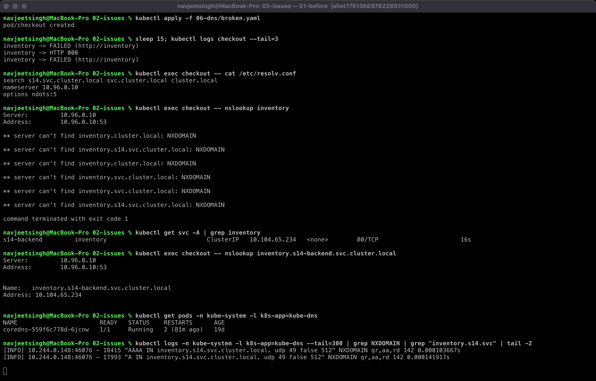

  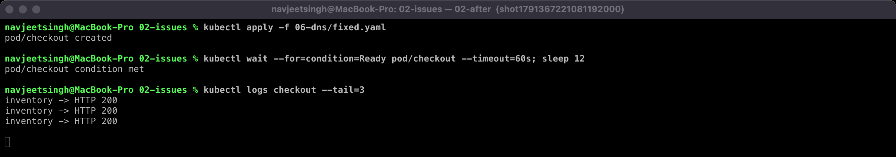

### 2.7 Pod networking: [02-issues/07-pod-networking](02-issues/07-pod-networking/)

- **Problem:** `metrics-api` is `1/1 Running` and the Service *has* an endpoint, yet both the Pod IP and the Service refuse connections from other Pods.
- **Investigation:**
  ```text
  $ curl http://10.244.0.150:8080 (from another Pod)  ->  exit 7 (connection refused)
  $ curl http://metrics-api                         ->  exit 7
  $ (inside the Pod) urlopen('http://127.0.0.1:8080') ->  200          <- app works locally
  $ kubectl exec metrics-api -- netstat -tln        ->  127.0.0.1:8080 LISTEN
  ```
- **Root cause:** the process binds to `127.0.0.1` (loopback) only. Traffic arriving on the Pod's network interface (`10.244.x.x`) has nothing listening. The Pod network, kube-proxy and Service are all fine.
- **Fix:** bind to `0.0.0.0` ([fixed.yaml](02-issues/07-pod-networking/fixed.yaml)).
- **Verify:** `netstat` shows `0.0.0.0:8080`; Pod IP → `HTTP 200`; Service → `HTTP 200`.
- **Before / after:**

  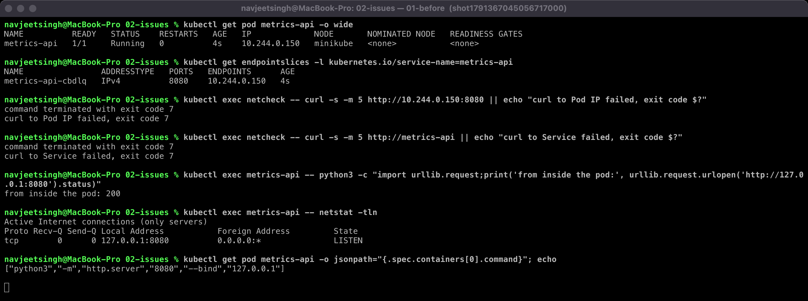

  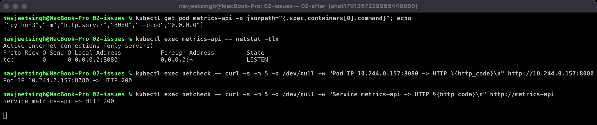
- Other Pod-networking causes to check: a NetworkPolicy denying traffic (needs a CNI that enforces it; minikube's default kindnet does not), `containerPort` vs actual port mismatch, or a CNI plugin failure (Pods stuck without IPs).

### 2.8 Configuration: [02-issues/08-configuration](02-issues/08-configuration/)

- **Problem:** `notify-svc` shows `CreateContainerConfigError`.
- **Investigation:**
  ```text
  Warning Failed  Error: couldn't find key SMTP_SERVER in ConfigMap s14/notify-config
  $ kubectl get configmap notify-config -o jsonpath='{.data}'  ->  {"SMTP_HOST":"smtp.example.com","SMTP_PORT":"587"}
  ```
- **Root cause:** `configMapKeyRef.key: SMTP_SERVER`, but the ConfigMap key is `SMTP_HOST`. The kubelet refuses to start a container whose env can't be resolved.
- **Fix:** `key: SMTP_HOST` ([fixed.yaml](02-issues/08-configuration/fixed.yaml)).
- **Verify:** `1/1 Running`, logs `SMTP=smtp.example.com:587`.
- **Before / after:**

  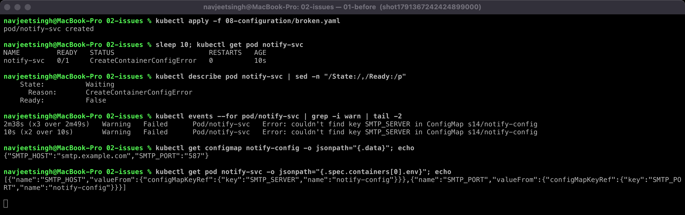

  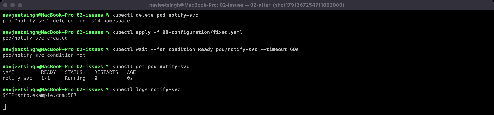

### 2.9 ImagePullBackOff, Service selector and DNS in the mini-project

The image-tag and Service-selector failures from the mini-project are documented with before/after output in [../mini-project/README.md](../mini-project/README.md#my-run--evidence).

---

## Reproduce

```bash
kubectl create ns s14 && kubectl config set-context --current --namespace=s14
cd 02-issues/<issue>
kubectl apply -f app.yaml        # if present
kubectl apply -f broken.yaml     # observe + investigate
kubectl delete -f broken.yaml && kubectl apply -f fixed.yaml   # (04: apply fixed-secret.yaml only)
kubectl delete ns s14            # cleanup
```
