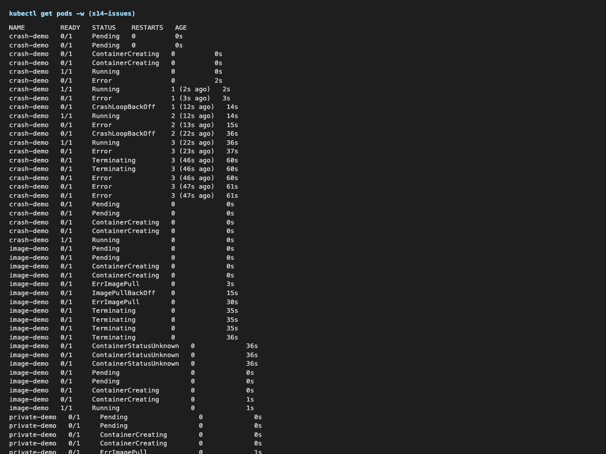
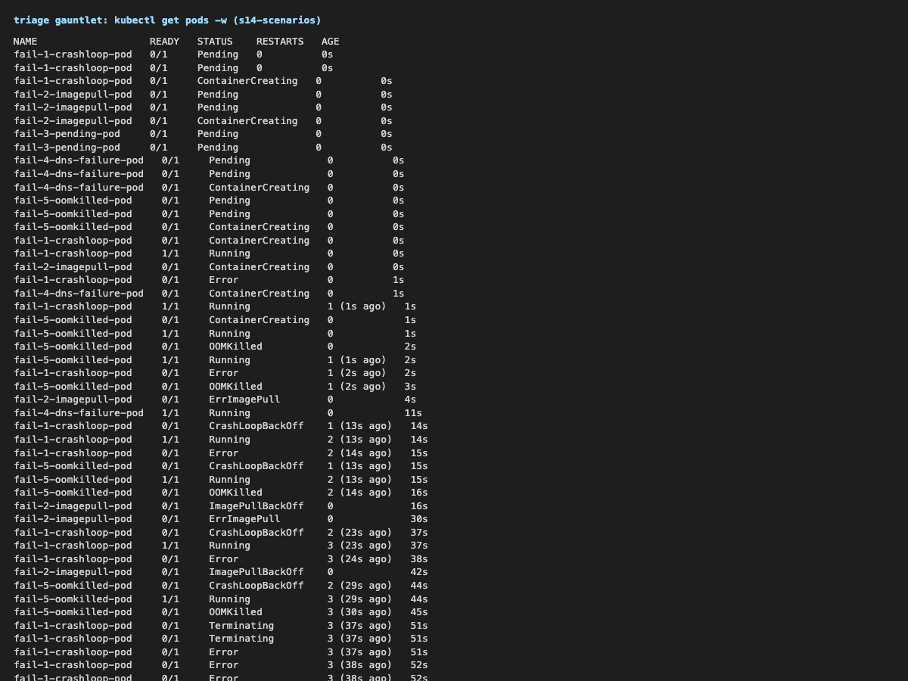
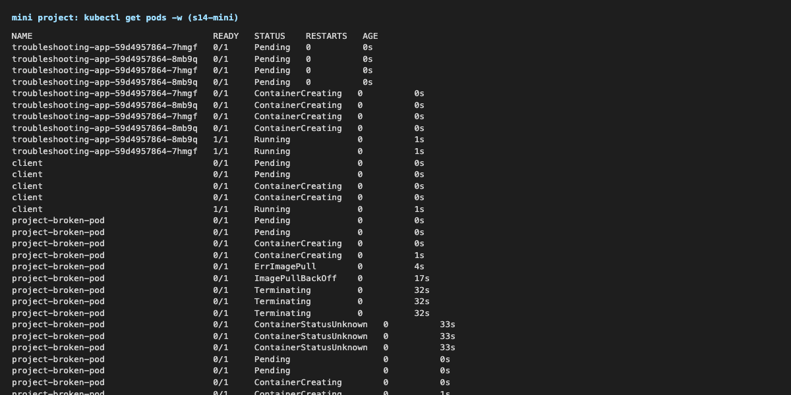

# Session 14 – Kubernetes Troubleshooting

**Name:** Kushal Talati  
**Enrollment No:** 24BCS10123  
**Environment:** kind v0.33.0 cluster `kushal-lab` (Kubernetes v1.37.0, 1 control-plane + 2 workers) on Docker Desktop 29.0.1, macOS / Apple Silicon – the same cluster as sessions 9–13. metrics-server is installed so `kubectl top` works. kubectl v1.34.1.

Everything below was run for real against this cluster with the professor's manifests from this session folder, **unmodified** (one exception is explained in section 2.E). Each lab runs in its own namespace (`s14-commands`, `s14-issues`, `s14-scenarios`, `s14-mini`), so the commands read `kubectl -n s14-… apply -f 06-crashloopbackoff/broken-pod.yaml`. The exact commands are in [`scripts/`](scripts), the raw, unedited output in [`logs/`](logs), the `kubectl get pods -w` streams rendered as PNGs in [`screenshots/`](screenshots). The two manifests I had to rewrite (not just re-tag) to fix a scenario are in [`fixes/`](fixes).

```text
kushal-24bcs10123/
├── README.md
├── scripts/
│   ├── 01-commands.sh         # Task 1: get / describe / logs / exec / events / explain / top
│   ├── 02-common-issues.sh    # Task 2: folders 06-09 + the states that have no folder
│   ├── 03-scenarios.sh        # scenarios/triage_all.sh gauntlet - 5 broken pods, 5 fixes
│   ├── 04-mini-project.sh     # Task 3: mini-project/ deploy -> break -> fix -> verify
│   └── lib.sh
├── fixes/
│   ├── scenario-1-crashloop-fixed.yaml
│   └── scenario-5-oomkilled-fixed.yaml
├── logs/                      # one .txt per script, plus *-watch.txt = `kubectl get pods -w` during the run
└── screenshots/
```

## The method I used for every problem

```text
kubectl get  ->  what is the STATUS / READY / RESTARTS?
kubectl describe  ->  Events, State, Last State, Exit Code
kubectl logs (--previous)  ->  what did the application say before it died?
kubectl exec / a client pod  ->  test from inside the cluster
root cause  ->  fix the manifest  ->  verify with the same get/curl that failed
```

---

## 1. Task 1 – the troubleshooting commands

Log: [logs/01-commands.txt](logs/01-commands.txt)

### `kubectl get` – "what is happening right now"

```text
$ kubectl -n s14-commands get pods
NAME       READY   STATUS    RESTARTS   AGE
get-demo   1/1     Running   0          0s

$ kubectl -n s14-commands get pods -o wide
NAME       READY   STATUS    RESTARTS   AGE   IP            NODE                NOMINATED NODE   READINESS GATES
get-demo   1/1     Running   0          0s    10.244.3.29   kushal-lab-worker   <none>           <none>

$ kubectl -n s14-commands get pods --show-labels
get-demo   1/1     Running   0          1s    app=get-demo

$ kubectl -n s14-commands get pod get-demo -o jsonpath='{.status.phase} {.status.podIP} {.spec.nodeName}'
Running 10.244.3.29 kushal-lab-worker

$ kubectl -n s14-commands get pod get-demo -o custom-columns='NAME:.metadata.name,IMAGE:.spec.containers[0].image,NODE:.spec.nodeName,IP:.status.podIP'
NAME       IMAGE        NODE                IP
get-demo   nginx:1.27   kushal-lab-worker   10.244.3.29

$ kubectl get pods -A --field-selector=status.phase!=Running      # every namespace, only the pods that are NOT Running
NAMESPACE       NAME                                       READY   STATUS         RESTARTS   AGE
ingress-nginx   ingress-nginx-admission-create-gmr2j       0/1     Completed      0          19d
...
```

* `READY 1/1` = ready containers / total containers. `STATUS` is a summary; `-o wide` adds pod IP and node, `-o yaml` shows the whole object (the `status:` block has `conditions` and `containerStatuses` with the real `state`/`lastState`), `-o jsonpath` / `custom-columns` pull single fields, `-A` is all namespaces, `--field-selector` filters server-side.

### `kubectl describe` – "what exactly happened"

```text
$ kubectl -n s14-commands describe pod describe-demo
Name:             describe-demo
Namespace:        s14-commands
Node:             kushal-lab-worker2/172.18.0.3
Status:           Running
IP:               10.244.1.20
Containers:
  nginx:
    Image:          nginx:1.27
    State:          Running
      Started:      Wed, 07 Oct 2026 23:14:51 +0530
    Ready:          True
    Restart Count:  0
Conditions:
  Type                        Status
  PodReadyToStartContainers   True
  Initialized                 True
  Ready                       True
  ContainersReady             True
  PodScheduled                True
QoS Class:                   BestEffort
Events:
  Type    Reason     Age   From               Message
  Normal  Scheduled  ...   default-scheduler  Successfully assigned ...
```

`describe` is `get -o yaml` made readable plus the Events for that object. The sections I always read first: `State` / `Last State` / `Exit Code` / `Restart Count` under the container, and `Events` at the bottom. `describe node` has the `Allocated resources` table that explains `Pending` pods.

### `kubectl logs` – "what is the application saying"

```text
$ kubectl -n s14-commands logs logs-demo
Application started
Connecting to database...
Database connection successful
Application is running
Application is healthy
Application is healthy

$ kubectl -n s14-commands logs -f logs-demo              # follow (stopped after 12 s)
$ kubectl -n s14-commands logs logs-demo --tail=2
$ kubectl -n s14-commands logs logs-demo --since=10s --timestamps
2026-10-07T17:45:07.650502586Z Application is healthy
2026-10-07T17:45:12.651534631Z Application is healthy
```

For a two-container pod (nginx + a sidecar that exits 1 on purpose):

```text
$ kubectl -n s14-commands logs two-containers
Defaulted container "web" out of: web, sidecar          <- without -c you get the first container
$ kubectl -n s14-commands logs two-containers -c sidecar
sidecar attempt 17:45:31
$ kubectl -n s14-commands logs two-containers -c sidecar --previous
unable to retrieve container logs for containerd://5bc9dec1...   <- containerd had already garbage-collected the dead container
$ kubectl -n s14-commands logs two-containers --all-containers --prefix | tail -2
[pod/two-containers/web] 2026/10/07 17:45:17 [notice] 1#1: start worker process 38
[pod/two-containers/sidecar] sidecar attempt 17:45:31
```

`--previous` is the command for CrashLoopBackOff, but on this cluster it only works in the window before containerd removes the exited container; when the back-off is long enough the previous container is already gone. `kubectl logs` only shows what the process wrote to stdout/stderr – an app that logs to a file shows nothing here.

### `kubectl exec` – "look from inside"

```text
$ kubectl -n s14-commands exec exec-demo -- hostname
exec-demo
$ kubectl -n s14-commands exec exec-demo -- ls /usr/share/nginx/html
50x.html
index.html
$ kubectl -n s14-commands exec exec-demo -- curl -s -o /dev/null -w 'HTTP %{http_code}\n' localhost
HTTP 200
$ kubectl -n s14-commands exec exec-demo -- nginx -T 2>/dev/null | grep -E 'listen|root' | head -3
    listen       80;
    listen  [::]:80;
        root   /usr/share/nginx/html;
$ kubectl -n s14-commands exec exec-demo -- sh -c 'cat /etc/resolv.conf; echo; env | grep KUBERNETES_SERVICE'
search s14-commands.svc.cluster.local svc.cluster.local cluster.local
nameserver 10.96.0.10
options ndots:5
KUBERNETES_SERVICE_PORT=443
KUBERNETES_SERVICE_HOST=10.96.0.1
```

`exec -it … -- bash` gives a shell; `exec … -- <cmd>` runs one command (what a script wants). Things only visible from inside: the DNS config kubelet injected, the env vars, whether the process really listens on the port, and whether the app's own files are there.

### Events – "what did Kubernetes try"

```text
$ kubectl -n s14-commands get events --sort-by=.lastTimestamp | tail -4
2s   Normal    Scheduled   pod/exec-demo    Successfully assigned s14-commands/exec-demo to kushal-lab-worker
2s   Normal    Pulled      pod/exec-demo    Container image "nginx:1.27" already present on machine
2s   Normal    Created     pod/exec-demo    Container created
2s   Normal    Started     pod/exec-demo    Container started

$ kubectl -n s14-commands events --for pod/events-demo          # the newer `kubectl events` sub-command
$ kubectl -n s14-commands events --types=Warning
LAST SEEN           TYPE      REASON    OBJECT               MESSAGE
12s (x2 over 25s)   Warning   BackOff   Pod/two-containers   Back-off restarting failed container sidecar in pod two-containers_s14-commands(...)
$ kubectl -n s14-commands events --watch                        # streams live
```

Events are the scheduler's and kubelet's diary. `--types=Warning` is the fastest way to find the problem in a busy namespace; events expire after about an hour, so they are for "now", not for history.

### `kubectl explain`, `kubectl top`

```text
$ kubectl explain pod.spec.containers.livenessProbe | head -8
FIELD: livenessProbe <Probe>
DESCRIPTION:
    Periodic probe of container liveness. Container will be restarted if the
    probe fails. Cannot be updated. ...
$ kubectl explain pod.spec.nodeSelector
    NodeSelector is a selector which must be true for the pod to fit on a node. ...

$ kubectl top nodes
NAME                       CPU(cores)   CPU(%)   MEMORY(bytes)   MEMORY(%)
kushal-lab-control-plane   206m         3%       1795Mi          11%
kushal-lab-worker          113m         1%       1657Mi          10%
kushal-lab-worker2         110m         1%       1425Mi          8%
$ kubectl -n s14-commands top pods --containers | head -4
POD              NAME    CPU(cores)   MEMORY(bytes)
describe-demo    nginx   0m           5Mi
get-demo         nginx   0m           5Mi
logs-demo        app     1m           0Mi
$ kubectl top pods -A --sort-by=cpu | head -3
kube-system   kube-apiserver-kushal-lab-control-plane   67m   662Mi
kube-system   etcd-kushal-lab-control-plane             28m   148Mi
```

`explain` is the offline API reference (which field, which type, default values). `top` needs metrics-server and is how I check OOM / CPU-throttling suspicions and HPA input.

---

## 2. Task 2 – common issues: identify → investigate → root cause → fix → verify

Log: [logs/02-common-issues.txt](logs/02-common-issues.txt), watch: [logs/02-common-issues-watch.txt](logs/02-common-issues-watch.txt), 

### A. CrashLoopBackOff (`06-crashloopbackoff/`)

```text
$ kubectl -n s14-issues apply -f 06-crashloopbackoff/broken-pod.yaml
$ sleep 60; kubectl -n s14-issues get pod crash-demo
NAME         READY   STATUS   RESTARTS      AGE
crash-demo   0/1     Error    3 (46s ago)   60s                      <- the watch log shows it flipping Running -> Error -> CrashLoopBackOff

$ kubectl -n s14-issues describe pod crash-demo | grep -E 'State|Reason|Exit Code|Restart Count|Back-off'
State:          Terminated   Reason: Error   Exit Code: 1
Last State:     Terminated   Reason: Error   Exit Code: 1
Restart Count:  3
Warning  BackOff  23s (x3 over 57s)  kubelet  Back-off restarting failed container app in pod crash-demo_s14-issues(...)

$ kubectl -n s14-issues logs crash-demo
Application starting...
Something went wrong!
$ kubectl -n s14-issues get pod crash-demo -o jsonpath='restartPolicy={.spec.restartPolicy} exitCode={...lastState.terminated.exitCode}'
restartPolicy=Always exitCode=1
```

* **Identify:** `Error` / `CrashLoopBackOff`, RESTARTS climbing. **Investigate:** describe shows exit code 1, logs show the app's own message. **Root cause:** the command ends with `exit 1`; `restartPolicy: Always` restarts it and kubelet doubles the wait each time (10 s, 20 s, 40 s … up to 5 min) – that wait is the "BackOff". **Fix:** `fixed-pod.yaml` replaces `exit 1` with `sleep 3600` (`diff` in the log). **Verify:** `1/1 Running`, logs say `Application is healthy`.

### B. ErrImagePull → ImagePullBackOff (`07-imagepullbackoff/`)

```text
$ kubectl -n s14-issues apply -f 07-imagepullbackoff/broken-pod.yaml
image-demo   0/1   ErrImagePull       0     5s
image-demo   0/1   ErrImagePull       0     15s
image-demo   0/1   ImagePullBackOff   0     20s
image-demo   0/1   ErrImagePull       0     30s          <- it retries, then backs off again

$ kubectl -n s14-issues describe pod image-demo | sed -n '/^Events/,$p'
  Normal   Pulling    15s (x2 over 30s)  kubelet  Pulling image "nginx:this-image-does-not-exist"
  Warning  Failed     14s (x2 over 28s)  kubelet  Failed to pull image "nginx:this-image-does-not-exist": rpc error: code = NotFound ...
  Warning  Failed     14s (x2 over 28s)  kubelet  Error: ErrImagePull
  Normal   BackOff    0s (x2 over 27s)   kubelet  Back-off pulling image "nginx:this-image-does-not-exist"
  Warning  Failed     0s (x2 over 27s)   kubelet  Error: ImagePullBackOff

$ docker manifest inspect nginx:this-image-does-not-exist          # checked from outside the cluster
no such manifest: docker.io/library/nginx:this-image-does-not-exist
```

* **Root cause:** the tag does not exist in the registry (`NotFound`). `ErrImagePull` is one failed attempt, `ImagePullBackOff` is the waiting state between attempts. **Fix:** `fixed-pod.yaml` with `nginx:1.27`. **Verify:** `Running`.
* Same symptom, different cause – a private registry without an `imagePullSecret` (`ghcr.io/kushaltalati/does-not-exist:1.0`): also `ImagePullBackOff`, but the describe message says `failed to authorize ... 403 Forbidden` instead of `NotFound`. The Events message is what tells the two apart.

### C. Pending (`08-pending-pods/` and `scenarios/scenario-3-pending/`)

```text
$ kubectl -n s14-issues apply -f 08-pending-pods/broken-pod.yaml; sleep 10; kubectl -n s14-issues get pod pending-demo
pending-demo   0/1     Pending   0          10s
$ kubectl -n s14-issues describe pod pending-demo | sed -n '/^Events/,$p'
  Warning  FailedScheduling  10s  default-scheduler  0/3 nodes are available: 1 node(s) had untolerated taint(s), 2 node(s) didn't match Pod's node affinity/selector.
$ kubectl get nodes --show-labels | tr ',' '\n' | grep hostname
kubernetes.io/hostname=kushal-lab-control-plane
kubernetes.io/hostname=kushal-lab-worker
kubernetes.io/hostname=kushal-lab-worker2
```

* **Root cause:** `nodeSelector: kubernetes.io/hostname: node-that-does-not-exist` – no node has that label, the control-plane is tainted, so 0 candidates. **Fix:** remove the selector (`fixed-pod.yaml`). **Verify:** scheduled on `kushal-lab-worker`.

```text
$ kubectl -n s14-issues apply -f scenarios/scenario-3-pending/broken.yaml
  Warning  FailedScheduling  ...  0/3 nodes are available: 1 node(s) had untolerated taint(s), 2 Insufficient cpu, 2 Insufficient memory.
$ kubectl get nodes -o custom-columns='NODE:.metadata.name,ALLOC_CPU:.status.allocatable.cpu,ALLOC_MEM:.status.allocatable.memory'
kushal-lab-worker          6           16356428Ki
```

* **Root cause:** requests of `cpu: "500"` and `memory: "1000Gi"` on 6-CPU / 15 Gi nodes. **Fix:** realistic requests. I first tried `kubectl apply` with the new requests on the live pod and got `Forbidden: pod updates may not change fields other than spec.containers[*].image ...` – pod resources are immutable, so the fix is delete + re-create (in a Deployment this would be a normal rollout).

### D. ContainerCreating (a volume that refers to a missing ConfigMap)

```text
creating-demo   0/1     ContainerCreating   0          15s
  Warning  FailedMount  8s (x5 over 15s)  kubelet  MountVolume.SetUp failed for volume "cfg" : configmap "app-config" not found
$ kubectl -n s14-issues create configmap app-config --from-literal=MODE=prod
$ kubectl -n s14-issues get pod creating-demo; kubectl -n s14-issues exec creating-demo -- cat /etc/app/MODE
creating-demo   1/1     Running   0          16s
prod
```

* **Root cause:** kubelet cannot set up the volume, so it never starts the container – no crash, no restart count, just stuck. **Fix:** create the ConfigMap; kubelet retries the mount on its own and the pod goes `Running` with no re-apply.

### E. Service connectivity (`09-service-dns-troubleshooting/`)

The course `dns-test-pod.yaml` uses `registry.k8s.io/e2e-test-images/dnsutils:1.3`, which no longer resolves (`no such manifest`, see log), so the test pod runs `busybox:1.36` instead (it has `nslookup` and `wget`). Everything else is the professor's YAML.

```text
$ kubectl -n s14-issues apply -f 09-service-dns-troubleshooting/deployment.yaml   # 2 x nginx, label app=web
$ kubectl -n s14-issues apply -f 09-service-dns-troubleshooting/service.yaml
$ kubectl -n s14-issues get endpoints web-service
web-service   <none>
$ kubectl -n s14-issues exec dns-test -- wget -qO- -T 3 http://web-service
wget: can't connect to remote host (10.96.147.86): Connection refused
$ kubectl -n s14-issues describe svc web-service | grep -E 'Selector|Endpoints'
Selector:                 app=web-ahsgdf
Endpoints:
$ kubectl -n s14-issues get pods -l app=web --show-labels
web-557577df75-4m8vr   1/1   Running   app=web,pod-template-hash=557577df75
```

* **Root cause:** selector `app=web-ahsgdf` vs pod label `app=web` → empty endpoints → the ClusterIP has nowhere to forward and kube-proxy answers "connection refused". **Fix:** `kubectl patch svc web-service -p '{"spec":{"selector":{"app":"web"}}}'`. **Verify:** `ENDPOINTS 10.244.1.49:80,10.244.3.71:80`, `wget` returns `<title>Welcome to nginx!</title>`.
* Second variant: endpoints exist but `targetPort: 8080` → endpoints list `10.244.1.49:8080,...`, same "connection refused", because nothing listens on 8080 in the pod. Fix = `targetPort: 80`.
* `broken-service.yaml` (`selector app=does-not-exist`) is the same disease: `ENDPOINTS <none>`.

### F. DNS

```text
$ kubectl -n s14-issues exec dns-test -- nslookup web-service
Server:    10.96.0.10
Name:   web-service.s14-issues.svc.cluster.local
Address: 10.96.147.86
$ kubectl -n s14-issues exec dns-test -- cat /etc/resolv.conf
search s14-issues.svc.cluster.local svc.cluster.local cluster.local
nameserver 10.96.0.10
options ndots:5
$ kubectl get svc -n kube-system kube-dns
kube-dns   ClusterIP   10.96.0.10   <none>   53/UDP,53/TCP,9153/TCP
$ kubectl get pods -n kube-system -l k8s-app=kube-dns
coredns-559f6c778d-5gr9q   1/1     Running
coredns-559f6c778d-rk8fg   1/1     Running

$ kubectl -n s14-issues exec fail-4-dns-failure-pod -- nslookup postgres-db-wrong-name.production.svc.cluster.local
** server can't find postgres-db-wrong-name.production.svc.cluster.local: NXDOMAIN
```

* `nameserver 10.96.0.10` is the `kube-dns` Service in front of the two CoreDNS pods; the `search` list is why the short name `web-service` works inside the same namespace (`<svc>.<ns>.svc.cluster.local` from another namespace).
* **Root cause of scenario 4:** the client asks for a service *and* a namespace that do not exist; CoreDNS answering `NXDOMAIN` is correct behaviour, DNS itself is healthy (`kubernetes.default.svc.cluster.local` resolves from the same pod). The fix is in section 3.
* busybox's `nslookup` also prints `NXDOMAIN` lines for the *other* search suffixes it tries (`web-service.svc.cluster.local`, `web-service.cluster.local`) – noise, not an error, the first answer is the one that matters.

### G. Pod networking

```text
$ kubectl -n s14-issues get pods -l app=web -o wide
web-557577df75-4m8vr 10.244.1.49 kushal-lab-worker2
web-557577df75-nkk5v 10.244.3.71 kushal-lab-worker
$ kubectl -n s14-issues exec dns-test -- wget -qO- -T 3 http://10.244.1.49 | grep title     # dns-test is on the other node
<title>Welcome to nginx!</title>
$ kubectl -n s14-issues exec dns-test -- wget -qO- -T 3 http://10.244.1.49:8080
wget: can't connect to remote host (10.244.1.49): Connection refused
$ kubectl get pods -n kube-system -l app=kindnet ...        3 x Running   (CNI, one per node)
$ kubectl get pods -n kube-system -l k8s-app=kube-proxy ... 3 x Running   (Service VIP -> pod iptables rules)
```

Hitting the pod IP directly bypasses the Service: if that works and the Service does not, the problem is in the Service (selector/ports); if the pod IP itself refuses, the problem is in the pod (wrong port, app not listening). Cross-node pod traffic worked, so the CNI (`kindnet`) was fine.

### H. Configuration issues

```text
config-demo   0/1     CreateContainerConfigError   0          15s
  Warning  Failed  0s (x3 over 15s)  kubelet  Error: couldn't find key GRETING in ConfigMap s14-issues/web-config
$ ... fixed GRETING -> GREETING ...
GREETING=hello

$ kubectl -n s14-issues run bad-cmd --image=nginx:1.27 --restart=Never --command -- /usr/bin/does-not-exist
bad-cmd   0/1     StartError   0          10s
Reason:       StartError    Message: ... exec: "/usr/bin/does-not-exist": stat /usr/bin/does-not-exist: no such file or directory    Exit Code: 128
```

`CreateContainerConfigError` = the container's config (env from ConfigMap/Secret) cannot be resolved; `StartError` = the runtime could not start the entrypoint. Both are found in `describe`, neither produces application logs.

---

## 3. The triage gauntlet (`scenarios/triage_all.sh`)

Log: [logs/03-scenarios.txt](logs/03-scenarios.txt), watch: [logs/03-scenarios-watch.txt](logs/03-scenarios-watch.txt), 

```text
$ bash scenarios/triage_all.sh
=== CURRENT CLUSTER CARNAGE ===
NAME                     READY   STATUS              RESTARTS     AGE
fail-1-crashloop-pod     0/1     Error               1 (5s ago)   5s
fail-2-imagepull-pod     0/1     ErrImagePull        0            5s
fail-3-pending-pod       0/1     Pending             0            5s
fail-4-dns-failure-pod   0/1     ContainerCreating   0            5s
fail-5-oomkilled-pod     0/1     OOMKilled           1 (4s ago)   5s

$ kubectl events --types=Warning                                  # one command, all five diagnoses
Failed            Pod/fail-2-imagepull-pod   Error: ImagePullBackOff
FailedScheduling  Pod/fail-3-pending-pod     0/3 nodes are available: 1 node(s) had untolerated taint(s), 2 Insufficient cpu, 2 Insufficient memory.
BackOff           Pod/fail-1-crashloop-pod   Back-off restarting failed container python-app ...
Failed            Pod/fail-2-imagepull-pod   Failed to pull image "yatri-api-service:v999-invalid-tag-does-not-exist" ...
BackOff           Pod/fail-5-oomkilled-pod   Back-off restarting failed container memory-leaker ...
```

| # | Pod | What I saw | Command that found it | Root cause | Fix | After |
|---|---|---|---|---|---|---|
| 1 | `fail-1-crashloop-pod` | `Error` → `CrashLoopBackOff`, exit code 1 | `describe` (Exit Code 1), the manifest (`DATABASE_URL` check) | app exits when `DATABASE_URL` is unset; manifest sets no env | Secret `db-credentials` + `env.valueFrom.secretKeyRef` ([fixes/scenario-1-crashloop-fixed.yaml](fixes/scenario-1-crashloop-fixed.yaml)) | `1/1 Running`, log `Application started successfully! DATABASE_URL host = postgres-db:5432/app` |
| 2 | `fail-2-imagepull-pod` | `ErrImagePull` / `ImagePullBackOff` | `describe` Events: `failed to pull ... docker.io/library/yatri-api-service ... not found` | repository does not exist on Docker Hub, tag is fake | real image (`nginx:1.27-alpine`) | `1/1 Running` |
| 3 | `fail-3-pending-pod` | `Pending` forever | `describe` Events: `2 Insufficient cpu, 2 Insufficient memory`, `describe node` Allocatable `cpu: 6`, `memory: 16356428Ki` | requests `cpu: "500"`, `memory: "1000Gi"` | `cpu: 50m`, `memory: 32Mi` | scheduled on `kushal-lab-worker2`, `Running` |
| 4 | `fail-4-dns-failure-pod` | pod `Running` but the app's curl fails silently | `logs` (only "Attempting connection...", no answer), `exec nslookup` → `NXDOMAIN`; `kubernetes.default` resolves, so DNS works | wrong hostname `postgres-db-wrong-name.production.svc.cluster.local` – no such service, no such namespace | created the real `postgres-db` Deployment + Service (port 5432 → 80) and pointed the client at `postgres-db.s14-scenarios.svc.cluster.local` | log shows `HTTP 200` |
| 5 | `fail-5-oomkilled-pod` | `OOMKilled`, RESTARTS 4, exit code 137 | `describe` (`Reason: OOMKilled`, `Limits memory: 20Mi`), jsonpath `lastState.terminated.reason` | allocates 100 × 10 MiB with a 20 Mi limit; kernel OOM killer → SIGKILL (137 = 128 + 9) | `requests 64Mi / limits 1200Mi` ([fixes/scenario-5-oomkilled-fixed.yaml](fixes/scenario-5-oomkilled-fixed.yaml)) | `1/1 Running`, log `allocated 1000 MiB, still alive` |

```text
$ kubectl get pods -l tier=triage-gauntlet -o wide
NAME                     READY   STATUS    RESTARTS   AGE   IP            NODE
fail-1-crashloop-pod     1/1     Running   0          60s   10.244.3.77   kushal-lab-worker
fail-2-imagepull-pod     1/1     Running   0          59s   10.244.3.78   kushal-lab-worker
fail-3-pending-pod       1/1     Running   0          58s   10.244.1.54   kushal-lab-worker2
fail-4-dns-failure-pod   1/1     Running   0          26s   10.244.1.56   kushal-lab-worker2
fail-5-oomkilled-pod     1/1     Running   0          21s   10.244.3.81   kushal-lab-worker
```

Side note: `kubectl logs --previous` returned `unable to retrieve container logs for containerd://…` for pods 1 and 5 – by the time I asked, containerd had already removed the crashed container. The exit code and reason in `describe` / `lastState` survived, so the diagnosis did not depend on the logs.

---

## 4. Task 3 – mini project (`mini-project/`)

Log: [logs/04-mini-project.txt](logs/04-mini-project.txt), watch: [logs/04-mini-project-watch.txt](logs/04-mini-project-watch.txt), 

### Deploy and observe (steps 1–4)

```text
$ kubectl -n s14-mini apply -f deployment.yaml && kubectl -n s14-mini apply -f service.yaml
$ kubectl -n s14-mini get pods -o wide
troubleshooting-app-59d4957864-7hmgf   1/1     Running   0     1s    10.244.3.95   kushal-lab-worker
troubleshooting-app-59d4957864-8mb9q   1/1     Running   0     1s    10.244.1.67   kushal-lab-worker2
$ kubectl -n s14-mini exec troubleshooting-app-59d4957864-7hmgf -- curl -s localhost | grep title
<title>Welcome to nginx!</title>
$ kubectl -n s14-mini describe service troubleshooting-service | grep -E 'Selector|TargetPort|Endpoints'
Selector:                 app=troubleshooting-app
TargetPort:               80/TCP
Endpoints:                10.244.1.67:80,10.244.3.95:80
$ kubectl -n s14-mini exec client -- wget -qO- -T 3 http://troubleshooting-service | grep title
<title>Welcome to nginx!</title>
```

### The broken pod (steps 5–7)

```text
$ kubectl -n s14-mini apply -f broken-pod.yaml
project-broken-pod   0/1   ErrImagePull       0     5s
project-broken-pod   0/1   ImagePullBackOff   0     21s
$ kubectl -n s14-mini describe pod project-broken-pod | sed -n '/^Events/,$p'
  Warning  Failed  12s (x2 over 28s)  kubelet  Failed to pull image "nginx:this-tag-does-not-exist": rpc error: code = NotFound ...
  Warning  Failed  12s (x2 over 28s)  kubelet  Error: ErrImagePull
$ curl -s 'https://hub.docker.com/v2/repositories/library/nginx/tags/this-tag-does-not-exist'
{"message":"httperror 404: tag 'this-tag-does-not-exist' not found", ...}
```

1. **Pod status?** `ErrImagePull`, then `ImagePullBackOff` (READY 0/1, RESTARTS 0 – nothing ever ran).
2. **Actual error?** `Failed to pull image "nginx:this-tag-does-not-exist": ... NotFound`.
3. **Which command?** `kubectl describe pod project-broken-pod` – the Events section. `kubectl get` only said *that* something was wrong.
4. **What is wrong with the image?** the repository `nginx` exists but the tag `this-tag-does-not-exist` does not (Docker Hub confirms 404).
5. **Fix?** use a tag that exists: `nginx:1.27` → `1/1 Running` within a second (image already cached on the node).

### Service selector challenge (steps 8–9)

```text
$ sed '/selector:/{n;s/app: troubleshooting-app/app: wrong-app/;}' service.yaml | kubectl -n s14-mini apply -f -
$ kubectl -n s14-mini get endpoints troubleshooting-service
troubleshooting-service   <none>
$ kubectl -n s14-mini exec client -- wget -qO- -T 3 http://troubleshooting-service
wget: can't connect to remote host (10.96.1.212): Connection refused
$ kubectl -n s14-mini get pods --show-labels -l app=troubleshooting-app
troubleshooting-app-59d4957864-7hmgf   1/1   Running   app=troubleshooting-app,pod-template-hash=59d4957864
$ kubectl -n s14-mini describe service troubleshooting-service | grep Selector
Selector:                 app=wrong-app
$ kubectl -n s14-mini apply -f service.yaml; kubectl -n s14-mini get endpoints troubleshooting-service
troubleshooting-service   10.244.1.67:80,10.244.3.95:80
```

The Service object itself looks perfectly healthy in `kubectl get service` (it has a ClusterIP and a port); only `get endpoints` shows it is pointing at nothing.

### Troubleshooting table (step 11)

| Problem | What I saw | Command I used | Root cause | Fix |
|---|---|---|---|---|
| **Broken Pod** | `ErrImagePull` → `ImagePullBackOff`, READY 0/1 | `kubectl get pod`, `kubectl describe pod` (Events) | tag `this-tag-does-not-exist` is not in the registry | delete the pod, re-create with `nginx:1.27` |
| **Service Problem** | `ENDPOINTS <none>`, client gets `Connection refused` | `kubectl get endpoints`, `kubectl describe service`, `kubectl get pods --show-labels` | selector `app=wrong-app` does not match label `app=troubleshooting-app` | re-apply `service.yaml` with the right selector |
| **Image Problem** | Events: `Failed to pull image ... NotFound` | `kubectl describe pod`, `docker manifest inspect` / Docker Hub API | image reference points at something that does not exist | correct repository/tag (or add an `imagePullSecret` when the message is `unauthorized`/`403`) |

### README questions (step 12)

1. **`kubectl get`** lists objects with their current summary state (READY, STATUS, RESTARTS, AGE, and with `-o wide` IP and node). It answers "is something wrong?".
2. **`get` vs `describe`:** `get` is one line per object; `describe` is the full object in readable form *plus* the Events for it – the container state/last state/exit code, conditions, volumes, tolerations. `get` finds the sick object, `describe` says why.
3. **`kubectl logs`** shows what the process wrote to stdout/stderr, i.e. the application's own explanation (stack trace, "cannot connect to database", missing env var). `--previous` reads the crashed instance, `-c` picks the container.
4. **`kubectl exec`** when the problem is only visible from inside: is the process listening on the port, what does DNS resolve to from this pod, which env vars did it get, are the config files mounted, can it reach another service.
5. **`CrashLoopBackOff`:** the container starts, exits with an error, kubelet restarts it (restartPolicy Always/OnFailure), it fails again, and kubelet waits longer between each attempt (10 s doubling up to 5 min). It is a container *waiting reason*; the pod phase is still Running.
6. **`ImagePullBackOff`:** the image could not be pulled (wrong name/tag, private registry without credentials, registry unreachable) and kubelet is backing off before trying again. `ErrImagePull` is the individual failure.
7. **Pending** means no node was chosen: insufficient CPU/memory for the requests, a nodeSelector/affinity nothing matches, a taint without a toleration, or a PVC that cannot be bound (`WaitForFirstConsumer` / no PV). `describe` → `FailedScheduling` says which.
8. **No endpoints** when the selector matches no *ready* pod: label mismatch, zero replicas, or pods failing their readiness probe (session 13). A Service with no endpoints accepts the connection on its ClusterIP and refuses it.
9. **Selector ↔ labels:** the Service continuously selects pods whose labels contain every key/value of its selector and writes their IP:targetPort into the EndpointSlice; kube-proxy turns that into the ClusterIP rules. Labels are the only link – names do not matter.
10. **Kubernetes DNS** is CoreDNS (pods in `kube-system`, exposed as the `kube-dns` Service at `10.96.0.10`) that kubelet writes into every pod's `/etc/resolv.conf`. Every Service gets `<svc>.<ns>.svc.cluster.local` (and pods in the same namespace can use just `<svc>`); headless Services resolve to pod IPs.

---

## Lab completion checklist

- [x] `kubectl get` with `-o wide`, `-o yaml`, `-o jsonpath`, `custom-columns`, `--show-labels`, `-A`, `--field-selector`
- [x] `kubectl describe` pod and node; `kubectl logs` with `-f`, `--tail`, `--since`, `--timestamps`, `-c`, `--previous`, `--all-containers`
- [x] `kubectl exec` one-shot commands; `kubectl get events --sort-by`, `kubectl events --for / --types=Warning / --watch`; `kubectl explain`; `kubectl top nodes/pods`
- [x] CrashLoopBackOff, ErrImagePull/ImagePullBackOff (two causes), Pending (selector and resources), ContainerCreating, Service connectivity (selector and targetPort), DNS, pod networking, configuration (`CreateContainerConfigError`, `StartError`) – each identified, investigated, root-caused, fixed and verified
- [x] `triage_all.sh`: all 5 scenarios diagnosed and brought to `1/1 Running`
- [x] Mini project: deployed, broken pod diagnosed without touching YAML first, selector mismatch found via endpoints + labels, table and questions answered

## What I understood

* `STATUS` in `kubectl get pods` is a hint, not a diagnosis. The diagnosis is in `describe` (Events, Exit Code, Reason) and in `logs`. I now read those two before I change anything.
* Every failure sits at one layer, and the layer tells you the tool: scheduler (Pending → Events/`describe node`), image (ErrImagePull → Events message: NotFound vs 403), container start (ContainerCreating / CreateContainerConfigError / StartError → Events), the process (CrashLoopBackOff / OOMKilled → logs, exit code), networking (Service → endpoints/labels, then pod IP, then DNS).
* A Service never "fails" visibly: it always has a ClusterIP. `kubectl get endpoints` is the one command that shows whether it points at anything, and label ↔ selector mismatch or a wrong `targetPort` are the two usual reasons.
* `Connection refused` from a ClusterIP means "no endpoints", not "network down"; `NXDOMAIN` means "that name is wrong", not "DNS is broken" – I proved both by resolving/curling something that *does* exist from the same pod.
* Exit codes carry meaning: 1 = the app chose to exit, 137 = SIGKILL (OOM killer), 128 = the runtime could not even exec the command.
* Pods are immutable in almost every field (`spec.containers[*].image` is the exception), so "fix the YAML and re-apply" on a bare pod means delete + create; that is one more reason to run things through a Deployment.
