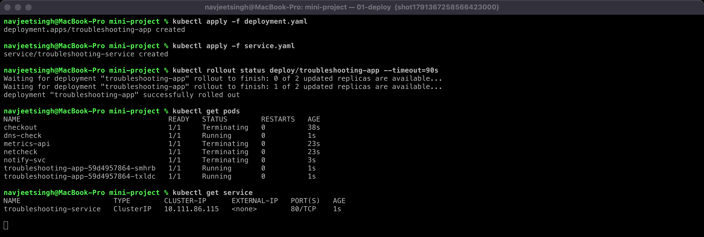
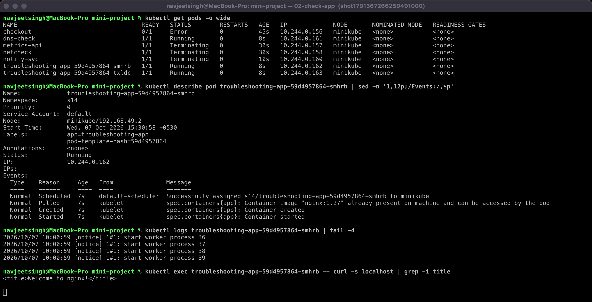
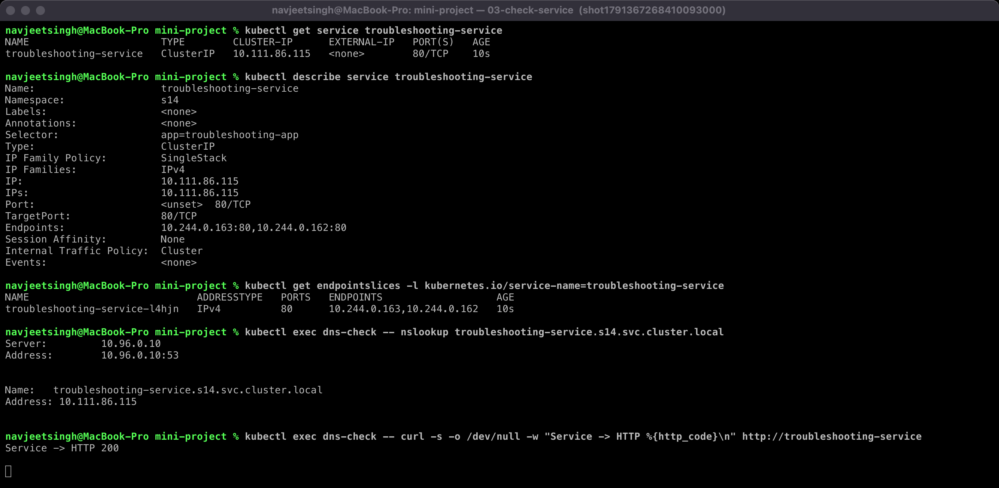
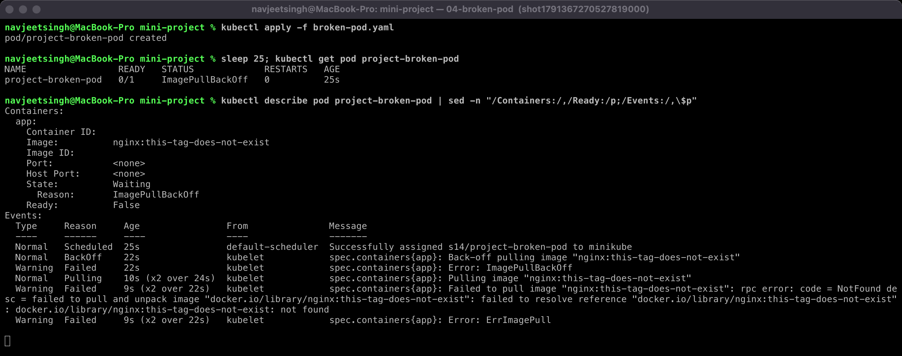
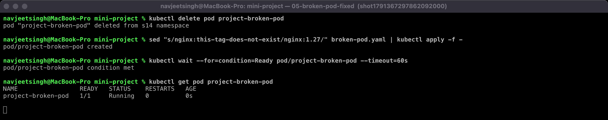
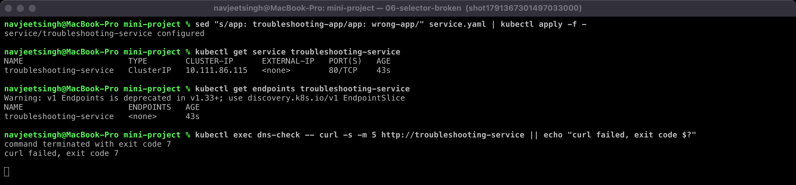
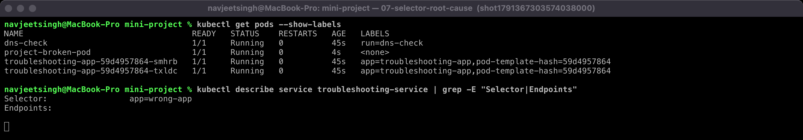
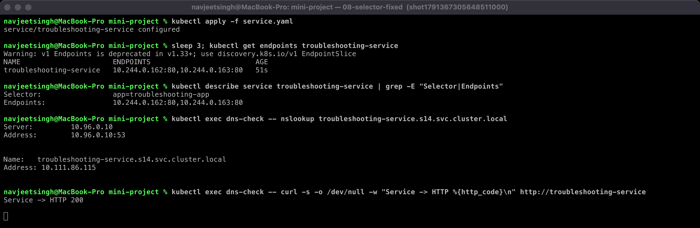

# Kubernetes Troubleshooting Challenge

Your job is to:

```text
Deploy
  │
  ▼
Observe
  │
  ▼
Break
  │
  ▼
Investigate
  │
  ▼
Find root cause
  │
  ▼
Fix
  │
  ▼
Verify
```

---

## Project Scenario

You have a simple Nginx application running inside Kubernetes.

You have:
* Deployment
* Service
* Pods

Your application should be accessible through the Service. But your team has reported that something is wrong.

Your job is to find and fix the problems.

---

## 1. Deploy The Application

Run:

```bash
kubectl apply -f deployment.yaml
kubectl apply -f service.yaml
```

Check:

```bash
kubectl get pods
kubectl get service
```

---

## 2. Check The Application

Run:

```bash
kubectl get pods -o wide
```

Then:

```bash
kubectl describe pod <pod-name>
```

Then:

```bash
kubectl logs <pod-name>
```

Then:

```bash
kubectl exec -it <pod-name> -- bash
```

Inside the container:

```bash
curl localhost
```

You should get the Nginx response.

---

## 3. Check The Service

Run:

```bash
kubectl get service
```

Then:

```bash
kubectl describe service troubleshooting-service
```

Check:
* **Selector**
* **TargetPort**
* **Endpoints**

---

## 4. Check Endpoints

Run:

```bash
kubectl get endpoints troubleshooting-service
```

You should see Pod IP addresses.

---

## 5. Create A Broken Pod

Run:

```bash
kubectl apply -f broken-pod.yaml
```

Check:

```bash
kubectl get pod project-broken-pod
```

You should see an image-related problem.

---

## 6. Troubleshoot It

You are **NOT** allowed to immediately change the YAML.

First run:

```bash
kubectl get pod project-broken-pod
```

Then:

```bash
kubectl describe pod project-broken-pod
```

Then look at **Events**. Find the root cause.

---

## 7. Your Task

For the broken Pod, answer:

**Question 1:** What is the Pod status?  
*Answer:* `ImagePullBackOff` (it showed `ErrImagePull` first, then `ImagePullBackOff`). `READY 0/1`, 0 restarts, because the container was never created. See [outputs/04-broken-pod.png](outputs/04-broken-pod.png).

**Question 2:** What is the actual error?  
*Answer:* `Failed to pull image "nginx:this-tag-does-not-exist": ... docker.io/library/nginx:this-tag-does-not-exist: not found`. The registry returned **NotFound** for that tag.

**Question 3:** Which command helped you find the reason?  
*Answer:* `kubectl describe pod project-broken-pod`, specifically the **Events** section at the bottom. `kubectl get` only shows the status; the Events say *why*.

**Question 4:** What is wrong with the image?  
*Answer:* The repository `nginx` exists on Docker Hub, but the **tag** `this-tag-does-not-exist` does not. It isn't an auth problem (that would say `unauthorized` / `pull access denied`) and it isn't a network problem (that would say `i/o timeout` / `no such host`).

**Question 5:** How would you fix it?  
*Answer:* Change the image to a tag that exists (`nginx:1.27`). For a bare Pod, `image` is one of the few fields you can change in place (`kubectl set image pod/project-broken-pod app=nginx:1.27`). I fixed the YAML and re-created the Pod so the file in Git matches what's running. With a Deployment you'd fix the YAML (or `kubectl set image deploy/...`) and let it roll out. Verified: the Pod went to `1/1 Running` ([outputs/05-broken-pod-fixed.png](outputs/05-broken-pod-fixed.png)).

---

## 8. Service Troubleshooting Challenge

Now intentionally create a Service selector problem.

Change the Service selector from:

```yaml
selector:
  app: troubleshooting-app
```

to:

```yaml
selector:
  app: wrong-app
```

Apply it. Then run:

```bash
kubectl get service
```

Then:

```bash
kubectl get endpoints troubleshooting-service
```

You should find: `<none>`.

---

## 9. Find The Root Cause

Run:

```bash
kubectl get pods --show-labels
```

Check the Pod label.

Then:

```bash
kubectl describe service troubleshooting-service
```

Compare **Pod label** with **Service selector**. Find the mismatch and fix it.

---

## 10. Final Troubleshooting Checklist

Before saying: *"It is not working."*

Always check:

```bash
kubectl get pods
kubectl describe pod <pod-name>
kubectl logs <pod-name>
kubectl exec -it <pod-name> -- sh
kubectl get events
```

For Service problems:

```bash
kubectl describe service <service-name>
kubectl get endpoints <service-name>
nslookup <service-name>
```

---

## 11. Troubleshooting Table

Fill this table in your submission:

| Problem | What I Saw | Command I Used | Root Cause | Fix |
| :--- | :--- | :--- | :--- | :--- |
| **Broken Pod** | `orders-api` Pod `0/1 Error`, restarts climbing, then `CrashLoopBackOff` | `kubectl get pod`, `kubectl describe pod` (Exit Code 1, BackOff event), `kubectl logs orders-api` | The app exits on startup: `[FATAL] DATABASE_URL environment variable is missing` | Add `DATABASE_URL` env var to the Pod spec, re-apply, check `logs` shows `orders-api started` ([../homework/02-issues/01-crashloopbackoff](../homework/02-issues/01-crashloopbackoff/)) |
| **Service Problem** | Service exists but `kubectl get endpoints troubleshooting-service` shows `<none>`; curl from a client Pod fails (exit 7, connection refused) | `kubectl get endpoints`, `kubectl get pods --show-labels`, `kubectl describe service` | Service selector `app=wrong-app` matches no Pod; Pods are labelled `app=troubleshooting-app` | Restore `selector: app: troubleshooting-app`, re-apply; endpoints show both Pod IPs, curl returns HTTP 200 |
| **Image Problem** | `project-broken-pod` stuck in `ErrImagePull` → `ImagePullBackOff`, 0/1 Ready | `kubectl describe pod project-broken-pod` → Events | Tag `nginx:this-tag-does-not-exist` not found in registry | Use `nginx:1.27`, delete and re-create the Pod; it becomes `1/1 Running` |

---

## 12. README Questions

Answer these in your own words:

1. What does `kubectl get` tell us?
   - **Answer:** A one-line summary per object: name, READY count, STATUS, RESTARTS and AGE (plus IP and node with `-o wide`). It answers *what* state something is in, not *why*.
2. What is the difference between `get` and `describe`?
   - **Answer:** `get` is a short table, or the raw object with `-o yaml`. `describe` is a human-readable report: container state and exit codes, probes, mounts, conditions, related objects and, most importantly, the recent **Events**. Use `get` to find what's broken and `describe` to find out why.
3. Why do we use `kubectl logs`?
   - **Answer:** To read the container's stdout/stderr, which is the application's own explanation of what went wrong (e.g. `DATABASE_URL is missing`). `--previous` shows the last crashed instance, `-f` follows, `--tail`/`--since` limit output, and `-c` picks a container.
4. When would you use `kubectl exec`?
   - **Answer:** When the Pod is running but behaving wrongly and you need to look from *inside* it: check files and config, env vars, what port the process listens on (`netstat -tln`), `curl localhost`, or test DNS and connectivity to other Services. It can't be used on a container that isn't running.
5. What does `CrashLoopBackOff` mean?
   - **Answer:** The container starts, then exits or is killed, again and again. The kubelet keeps restarting it with an exponential back-off delay (10s, 20s, 40s … up to 5 min). The cause is inside the container (bad command, missing config, failed liveness probe, OOMKilled), so check `logs --previous` and the exit code in `describe`.
6. What does `ImagePullBackOff` mean?
   - **Answer:** The kubelet could not pull the image (`ErrImagePull`) and is now backing off before retrying. Typical causes: wrong image name or tag, private registry without `imagePullSecrets`, registry rate limit, or no network to the registry. The Events show the exact pull error.
7. Why can a Pod remain `Pending`?
   - **Answer:** The scheduler can't find a node for it: not enough CPU or memory for its requests, a `nodeSelector`/affinity that matches no node, taints without matching tolerations, or a PVC that can't be bound. `describe pod` shows a `FailedScheduling` event with the reason. (A Pod already on a node but stuck in `ContainerCreating` is a different problem, e.g. a missing Secret or ConfigMap volume.)
8. Why can a Service have no endpoints?
   - **Answer:** Its selector doesn't match any Pod's labels, the matching Pods aren't Ready (failing readiness probe), the Pods are in a different namespace, or there simply are no Pods running.
9. What is the relationship between a Service selector and Pod labels?
   - **Answer:** The Service selector is a label query. The endpoints controller continuously finds every *Ready* Pod in the same namespace whose labels contain all the selector's key/value pairs, and puts their IPs into the Service's EndpointSlices. If one character differs, the Pod is not selected.
10. What is Kubernetes DNS?
   - **Answer:** CoreDNS running in `kube-system`. It gives every Service a name `<service>.<namespace>.svc.cluster.local` that resolves to its ClusterIP (or Pod IPs for headless Services). Pods' `/etc/resolv.conf` points at it and has search domains, so inside the same namespace the short name `<service>` works; across namespaces you need `<service>.<namespace>`.

---

## 13. Final Architecture

Your final application should look like:

```text
                    Kubernetes Cluster
                            │
                            ▼
                  ┌───────────────────┐
                  │      Service      │
                  └─────────┬─────────┘
                            │
                     Service Selector
                            │
              ┌─────────────┴─────────────┐
              │                           │
              ▼                           ▼
            Pod 1                       Pod 2
              │                           │
              └─────────────┬─────────────┘
                            │
                        Nginx App
```

---

## 14. What You Should Be Able To Do

After completing this project, you should be comfortable with:

```bash
kubectl get
kubectl describe
kubectl logs
kubectl exec
kubectl events
```

and troubleshooting:
* `CrashLoopBackOff`
* `ImagePullBackOff`
* `Pending`
* Service problems
* DNS problems

---

## Final Rule

When something breaks: **DON'T GUESS.**

```text
GET
 │
 ▼
DESCRIBE
 │
 ▼
EVENTS
 │
 ▼
LOGS
 │
 ▼
EXEC
 │
 ▼
TEST
 │
 ▼
FIX
 │
 ▼
VERIFY
```

That is the basic Kubernetes troubleshooting mindset.
---

## My Run — Evidence

All steps above were executed on minikube in namespace `s14`. Each screenshot is a real terminal capture.

### 1. Deploy



### 2. Check the application: `get -o wide`, `describe`, `logs`, `exec curl localhost`



### 3–4. Check the Service: selector, targetPort, endpoints, DNS, curl from a client Pod



### 5–6. Broken Pod and investigation (before)



### 7. Broken Pod fixed (after)



### 8. Service selector broken (before): endpoints `<none>`, curl fails



### 9. Root cause: Pod labels vs Service selector



### 9. Fixed (after): endpoints restored, DNS resolves, HTTP 200



The wider homework (every troubleshooting command and 8 more failure types) is in [`../homework/`](../homework/).
