# Session 14 - Task 1: Kubernetes Troubleshooting Commands

All commands were executed on a **single-node Minikube v1.39.0** cluster (profile `session14`, docker driver,
macOS arm64), Kubernetes **v1.37.0**, containerd 2.3.4, `metrics-server` v0.9.0 addon.
Every screenshot is the real terminal output of the commands shown.

**Goal:** practise the eight commands used in almost every Kubernetes investigation, on a small healthy workload,
so the output is familiar before anything breaks.

| File | What it creates |
| --- | --- |
| `namespace.yaml` | Namespace `task1` |
| `web-app.yaml` | Deployment `web` (2 x `nginx:1.27`, requests/limits, readiness probe, env `APP_ENV=lab`) + ClusterIP Service `web` |
| `multi-container-pod.yaml` | Pod `logger` with two containers sharing an `emptyDir`: `app` writes INFO/WARN/ERROR lines, `log-shipper` tails the file |

```text
 Which command answers which question?

  kubectl get            -> WHAT exists and what STATE is it in?
  kubectl get -o wide    -> WHERE is it running (node, Pod IP, selector, image)?
  kubectl describe       -> WHY is it in that state (conditions, config, events)?
  kubectl events         -> WHAT HAPPENED, in time order?
  kubectl logs           -> WHAT did the application say?
  kubectl exec           -> WHAT does it look like from INSIDE the container?
  kubectl top            -> HOW MUCH CPU / memory is it using right now?
  kubectl explain        -> WHAT does this field mean / which fields exist?
```

---

## Setup

```bash
kubectl apply -f namespace.yaml -f web-app.yaml -f multi-container-pod.yaml
kubectl rollout status deployment/web -n task1
kubectl wait --for=condition=Ready pod/logger -n task1 --timeout=60s
```

```text
namespace/task1 created
deployment.apps/web created
service/web created
pod/logger created
Waiting for deployment "web" rollout to finish: 0 of 2 updated replicas are available...
Waiting for deployment "web" rollout to finish: 1 of 2 updated replicas are available...
deployment "web" successfully rolled out
pod/logger condition met
```

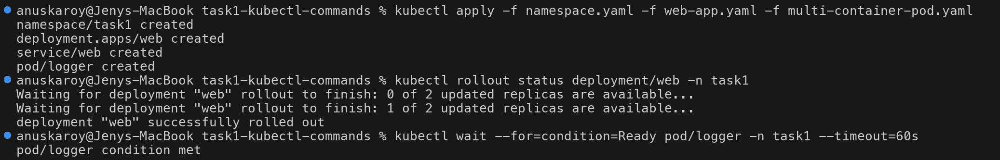

---

## 1. `kubectl get`: what exists and in what state

```bash
kubectl get nodes
kubectl get pods -n task1
kubectl get deploy,rs,svc,pods -n task1      # several kinds at once
kubectl get pods -n task1 --show-labels      # labels drive Service selectors
kubectl get pods -n task1 -l app=web         # filter by label
```

```text
$ kubectl get pods -n task1
NAME                   READY   STATUS    RESTARTS   AGE
logger                 2/2     Running   0          21s
web-6dc8cd996d-cdd7f   1/1     Running   0          21s
web-6dc8cd996d-m7chw   1/1     Running   0          21s
$ kubectl get pods -n task1 --show-labels
NAME                   READY   STATUS    RESTARTS   AGE   LABELS
logger                 2/2     Running   0          21s   app=logger
web-6dc8cd996d-cdd7f   1/1     Running   0          21s   app=web,pod-template-hash=6dc8cd996d,tier=frontend
web-6dc8cd996d-m7chw   1/1     Running   0          21s   app=web,pod-template-hash=6dc8cd996d,tier=frontend
```

How to read the columns:

| Column | Meaning | Troubleshooting hint |
| --- | --- | --- |
| `READY` | ready containers / total containers | `0/1` while `Running` means the readiness probe is failing |
| `STATUS` | phase or waiting/terminated reason | `CrashLoopBackOff`, `ImagePullBackOff`, `Pending`, `CreateContainerConfigError`... |
| `RESTARTS` | container restart count | growing number = the container keeps dying |
| `AGE` | time since creation | a very young Pod in a Deployment = it is being recreated |

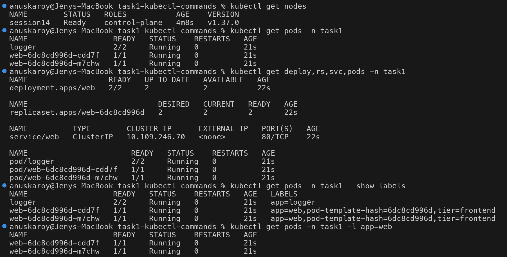

### Output formats: extract exactly the field you need

```bash
kubectl get pods -A --field-selector=status.phase!=Running   # everything NOT running, cluster-wide
kubectl get pod <pod> -n task1 -o jsonpath='{.status.phase}{"  "}{.status.podIP}{"  "}{.spec.nodeName}{"\n"}'
kubectl get pods -n task1 -o custom-columns=NAME:.metadata.name,IMAGE:.spec.containers[*].image,RESTARTS:.status.containerStatuses[*].restartCount
kubectl get pod <pod> -n task1 -o yaml | grep -E '^  (phase|podIP|hostIP|qosClass|startTime):'
```

```text
$ kubectl get pods -A --field-selector=status.phase!=Running
No resources found
$ kubectl get pod web-6dc8cd996d-cdd7f -n task1 -o jsonpath='{.status.phase}{"  "}{.status.podIP}{"  "}{.spec.nodeName}{"\n"}'
Running  10.244.0.7  session14
$ kubectl get pods -n task1 -o custom-columns=NAME:.metadata.name,IMAGE:.spec.containers[*].image,RESTARTS:.status.containerStatuses[*].restartCount
NAME                   IMAGE                       RESTARTS
logger                 busybox:1.36,busybox:1.36   0,0
web-6dc8cd996d-cdd7f   nginx:1.27                  0
web-6dc8cd996d-m7chw   nginx:1.27                  0
```

`--field-selector=status.phase!=Running` across all namespaces is a fast first sweep during an incident.

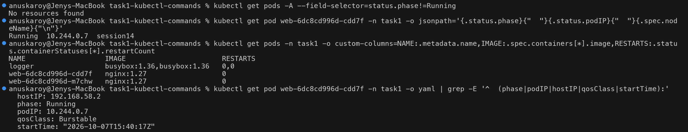

---

## 2. `kubectl get -o wide`: where is it running

```bash
kubectl get nodes -o wide
kubectl get pods -n task1 -o wide
kubectl get svc -n task1 -o wide
kubectl get endpointslices -n task1 -o wide
kubectl get rs -n task1 -o wide
```

```text
$ kubectl get pods -n task1 -o wide
NAME                   READY   STATUS    RESTARTS   AGE   IP           NODE        NOMINATED NODE   READINESS GATES
logger                 2/2     Running   0          30s   10.244.0.6   session14   <none>           <none>
web-6dc8cd996d-cdd7f   1/1     Running   0          30s   10.244.0.7   session14   <none>           <none>
web-6dc8cd996d-m7chw   1/1     Running   0          30s   10.244.0.5   session14   <none>           <none>
$ kubectl get svc -n task1 -o wide
NAME   TYPE        CLUSTER-IP      EXTERNAL-IP   PORT(S)   AGE   SELECTOR
web    ClusterIP   10.109.246.70   <none>        80/TCP    31s   app=web
$ kubectl get endpointslices -n task1 -o wide
NAME        ADDRESSTYPE   PORTS   ENDPOINTS               AGE
web-6sq7v   IPv4          80      10.244.0.5,10.244.0.7   30s
```

`-o wide` adds the columns that matter for networking. For Pods: **IP and NODE**. For Services: **SELECTOR**.
For nodes: internal IP, OS, kernel and container runtime. The Service's `SELECTOR` (`app=web`) is matched against the
Pod labels, and the matching Pod IPs show up in the EndpointSlice. That chain is the core of Service debugging
in Task 2.

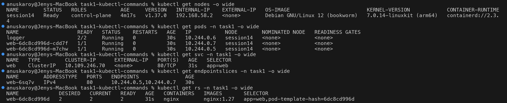

---

## 3. `kubectl describe`: why is it in this state

```bash
kubectl describe pod <pod> -n task1
```

Key sections of the output (full output in the screenshot):

```text
Status:           Running
IP:               10.244.0.7
Controlled By:  ReplicaSet/web-6dc8cd996d
Containers:
  nginx:
    State:          Running
    Ready:          True
    Restart Count:  0
    Limits:   cpu: 200m  memory: 128Mi
    Requests: cpu: 50m   memory: 32Mi
    Readiness:  http-get http://:80/ delay=0s timeout=1s period=5s successThreshold=1 failureThreshold=3
    Environment:
      APP_ENV:  lab
Conditions:
  PodReadyToStartContainers   True
  Initialized                 True
  Ready                       True
  ContainersReady             True
  PodScheduled                True
QoS Class:                   Burstable
Events:
  Normal   Scheduled  40s   default-scheduler  Successfully assigned task1/web-6dc8cd996d-cdd7f to session14
  Normal   Pulled     34s   kubelet            Container image "nginx:1.27" already present on machine ...
  Normal   Created    34s   kubelet            Container created
  Normal   Started    33s   kubelet            Container started
  Warning  Unhealthy  33s   kubelet            Readiness probe failed: Get "http://10.244.0.7:80/": dial tcp 10.244.0.7:80: connect: connection refused
```

> Even this healthy Pod has a `Warning Unhealthy` event. The first readiness probe fired a moment before nginx
> opened port 80. One early probe failure is normal. Failures that keep **repeating** are the problem.

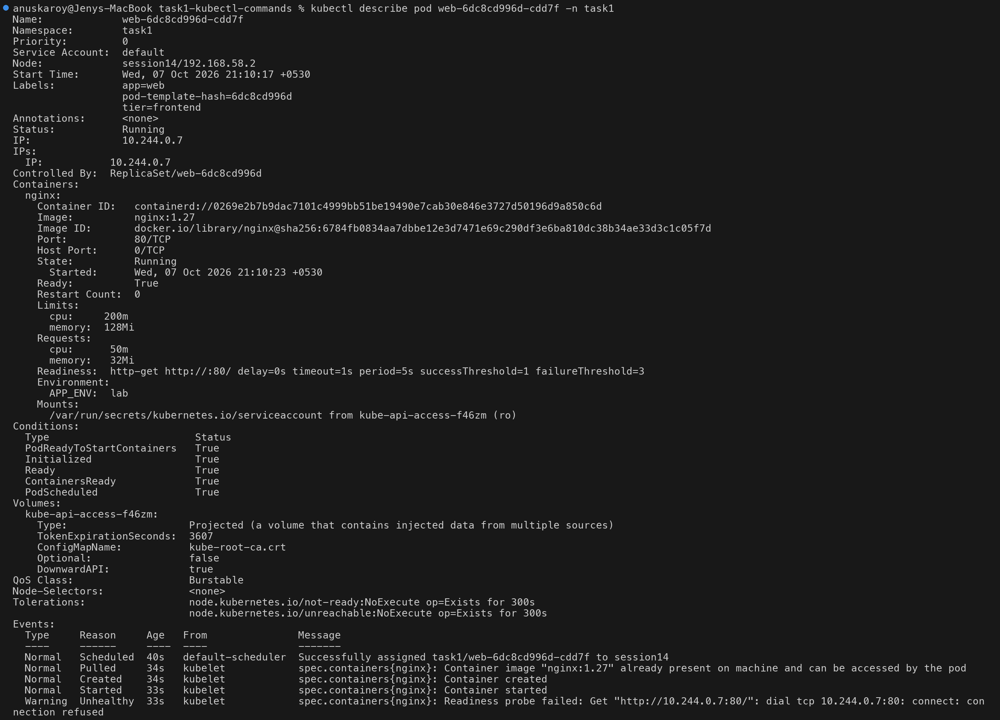

`describe` works on every kind. A Deployment shows its rollout conditions, a Service shows its resolved
`Endpoints`, and a node shows how much of its capacity is already **requested** (the scheduler's view, which is
the key to `Pending` Pods):

```bash
kubectl describe deployment web -n task1 | sed -n '1,12p;/Conditions:/,$p'
kubectl describe svc web -n task1
kubectl describe node session14 | sed -n '/Allocated resources:/,/Events:/p'
```

```text
Selector:                 app=web
TargetPort:               80/TCP
Endpoints:                10.244.0.5:80,10.244.0.7:80
...
  Resource           Requests     Limits
  cpu                1070m (13%)  500m (6%)
  memory             500Mi (12%)  476Mi (12%)
```

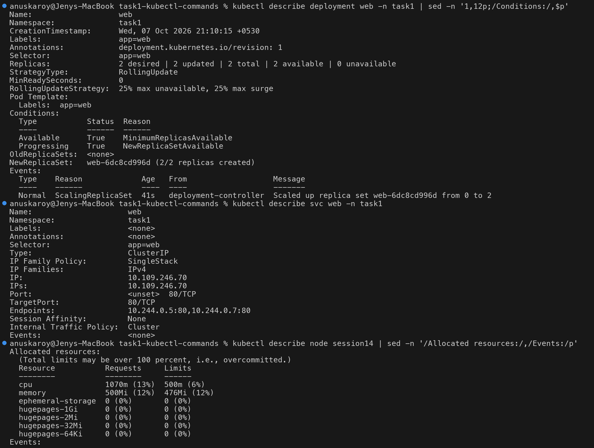

---

## 4. `kubectl logs`: what did the application say

```bash
kubectl logs logger -n task1                                  # multi-container: defaults to the first container
kubectl logs logger -n task1 -c app --tail=4                  # pick a container, last N lines
kubectl logs logger -n task1 -c log-shipper --tail=3          # the sidecar
kubectl logs logger -n task1 -c app --since=5s --timestamps   # time window + timestamps
kubectl logs logger -n task1 -c app | grep ERROR              # filter
```

```text
$ kubectl logs logger -n task1
Defaulted container "app" out of: app, log-shipper
15:41:47 INFO order-service processed request id=1
...
$ kubectl logs logger -n task1 -c log-shipper --tail=3
[shipped] 15:42:13 ERROR order-service processed request id=10
[shipped] 15:42:18 INFO order-service processed request id=11
[shipped] 15:42:21 WARN order-service processed request id=12
$ kubectl logs logger -n task1 -c app --since=5s --timestamps
2026-10-07T15:42:18.999739088Z 15:42:18 INFO order-service processed request id=11
2026-10-07T15:42:21.180457798Z 15:42:21 WARN order-service processed request id=12
$ kubectl logs logger -n task1 -c app | grep ERROR
15:41:57 ERROR order-service processed request id=5
15:42:13 ERROR order-service processed request id=10
```

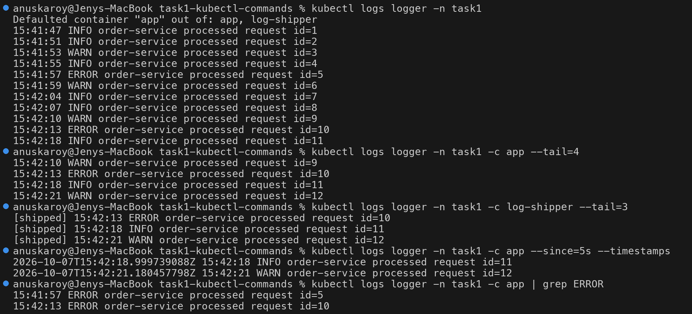

```bash
kubectl logs deployment/web -n task1 --tail=4                 # picks ONE pod of the deployment
kubectl logs -l app=web -n task1 --prefix --tail=2            # ALL pods matching a label, prefixed
kubectl logs logger -n task1 --all-containers --prefix --tail=2
kubectl logs -f logger -n task1 -c app --tail=1               # follow (stream), Ctrl-C to stop
```

```text
$ kubectl logs deployment/web -n task1 --tail=4
Found 2 pods, using pod/web-6dc8cd996d-m7chw
10.244.0.1 - - [07/Oct/2026:15:44:15 +0000] "GET / HTTP/1.1" 200 615 "-" "kube-probe/1.37" "-"
...
$ kubectl logs logger -n task1 --all-containers --prefix --tail=2
[pod/logger/app] 15:44:30 INFO order-service processed request id=76
[pod/logger/app] 15:44:32 INFO order-service processed request id=77
[pod/logger/log-shipper] [shipped] 15:44:30 INFO order-service processed request id=76
[pod/logger/log-shipper] [shipped] 15:44:32 INFO order-service processed request id=77
$ kubectl logs -f logger -n task1 -c app --tail=1
15:44:32 INFO order-service processed request id=77
15:44:34 WARN order-service processed request id=78
15:44:36 INFO order-service processed request id=79
15:44:38 ERROR order-service processed request id=80
15:44:40 WARN order-service processed request id=81
^C
```

> `deployment/web` silently picks **one** Pod ("Found 2 pods, using ..."). When only some replicas misbehave,
> use `-l app=web --prefix` so you see every replica.
>
> `--previous` (`-p`) shows the logs of the **previous** container instance after a restart. It is covered in
> Task 2 / CrashLoopBackOff.

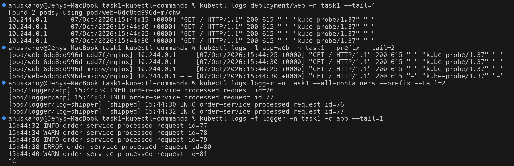

---

## 5. `kubectl exec`: look from inside the container

```bash
kubectl exec <pod> -n task1 -- nginx -v
kubectl exec <pod> -n task1 -- env | grep -E 'APP_ENV|WEB_SERVICE'    # env vars injected by k8s
kubectl exec <pod> -n task1 -- cat /etc/resolv.conf                  # DNS config of the Pod
kubectl exec <pod> -n task1 -- curl -s -o /dev/null -w '%{http_code}\n' http://localhost:80/
kubectl exec logger -n task1 -c log-shipper -- ls -l /var/log/app    # -c picks the container
kubectl exec logger -n task1 -c app -- ps -o pid,user,comm
```

```text
nginx version: nginx/1.27.5
APP_ENV=lab
WEB_SERVICE_HOST=10.109.246.70
WEB_SERVICE_PORT=80
search task1.svc.cluster.local svc.cluster.local cluster.local
nameserver 10.96.0.10
options ndots:5
200
-rw-r--r--    1 root     root          4741 Oct  7 15:45 app.log
PID   USER     COMMAND
    1 root     sh
  105 root     ps
```

The `log-shipper` container sees the file written by `app`, which proves the shared `emptyDir` works.
`/etc/resolv.conf` shows the DNS search path; that is the key fact in Task 2's DNS issue.

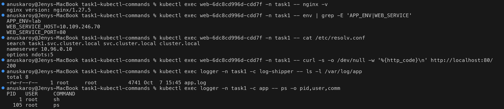

Running several commands in one shell, the default-container behaviour, and the error for a wrong container name:

```bash
kubectl exec <pod> -n task1 -- sh -c 'hostname; grep -E "^ +(listen|root)" /etc/nginx/conf.d/default.conf; getent hosts web.task1.svc.cluster.local; ls /usr/share/nginx/html'
kubectl exec logger -n task1 -- date
kubectl exec <pod> -n task1 -c wrong-name -- ls
```

```text
web-6dc8cd996d-cdd7f
    listen       80;
    listen  [::]:80;
        root   /usr/share/nginx/html;
10.109.246.70   web.task1.svc.cluster.local
50x.html
index.html
Defaulted container "app" out of: app, log-shipper
Wed Oct  7 15:45:01 UTC 2026
error: container wrong-name is not valid for pod web-6dc8cd996d-cdd7f out of: nginx
```

For an interactive shell use `kubectl exec -it <pod> -n task1 -- sh` (or `bash` if the image has it).

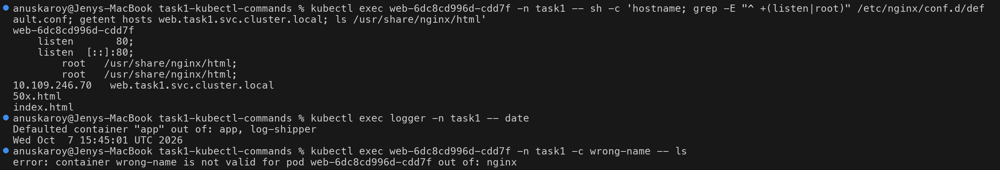

---

## 6. `kubectl events`: what happened, in order

To get some fresh events, scale the Deployment up and back down:

```bash
kubectl scale deployment web -n task1 --replicas=3
kubectl rollout status deployment/web -n task1
kubectl scale deployment web -n task1 --replicas=2
```

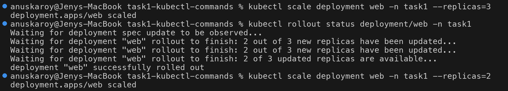

```bash
kubectl events -n task1 | tail -14
kubectl events -n task1 --for pod/<pod>
```

```text
17s   Normal    ScalingReplicaSet   Deployment/web              Scaled up replica set web-6dc8cd996d from 2 to 3
17s   Normal    SuccessfulCreate    ReplicaSet/web-6dc8cd996d   Created pod: web-6dc8cd996d-jkk7d
17s   Normal    Scheduled           Pod/web-6dc8cd996d-jkk7d    Successfully assigned task1/web-6dc8cd996d-jkk7d to session14
16s   Normal    Started             Pod/web-6dc8cd996d-jkk7d    Container started
15s   Normal    SuccessfulDelete    ReplicaSet/web-6dc8cd996d   Deleted pod: web-6dc8cd996d-jkk7d
15s   Normal    ScalingReplicaSet   Deployment/web              Scaled down replica set web-6dc8cd996d from 3 to 2
13s   Normal    Killing             Pod/web-6dc8cd996d-jkk7d    Stopping container nginx
```

This shows the whole control-plane chain: **Deployment controller → ReplicaSet controller → scheduler → kubelet**.

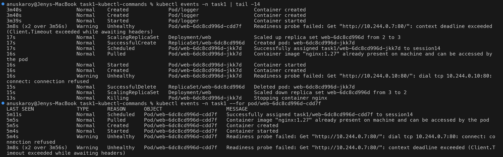

Filtering:

```bash
kubectl events -n task1 --types=Warning                         # only warnings
kubectl events -n task1 --for deployment/web                    # one object
kubectl get events -n task1 --sort-by=.lastTimestamp | tail -5  # older style, sorted
kubectl get events -n task1 --field-selector reason=Killing     # by reason
kubectl events -A --types=Warning | head -5                     # cluster-wide warnings
```

```text
$ kubectl events -n task1 --types=Warning
LAST SEEN               TYPE      REASON      OBJECT                     MESSAGE
4m53s                   Warning   Unhealthy   Pod/web-6dc8cd996d-cdd7f   Readiness probe failed: ... connect: connection refused
3m45s                   Warning   Unhealthy   Pod/web-6dc8cd996d-m7chw   Readiness probe failed: ... context deadline exceeded (Client.Timeout exceeded while awaiting headers)
...
$ kubectl events -n task1 --for deployment/web
LAST SEEN   TYPE     REASON              OBJECT           MESSAGE
5m1s        Normal   ScalingReplicaSet   Deployment/web   Scaled up replica set web-6dc8cd996d from 0 to 2
6s          Normal   ScalingReplicaSet   Deployment/web   Scaled up replica set web-6dc8cd996d from 2 to 3
4s          Normal   ScalingReplicaSet   Deployment/web   Scaled down replica set web-6dc8cd996d from 3 to 2
```

> **Real observation:** the `context deadline exceeded` readiness warnings came from a period when the Docker VM
> was overloaded (another minikube cluster was running alongside this one). The 1s probe timeout was exceeded
> even though nginx was fine. Events record transient problems like this that are already gone by the time you
> run `get`.
>
> Events are kept for only **1 hour** by default. Collect them early in an incident.

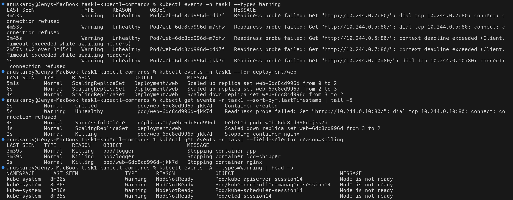

---

## 7. `kubectl explain`: built-in API documentation

```bash
kubectl explain pod.spec.containers.readinessProbe | head -24
kubectl explain deployment.spec.strategy.rollingUpdate.maxSurge
```

```text
KIND:       Pod
VERSION:    v1

FIELD: readinessProbe <Probe>

DESCRIPTION:
    Periodic probe of container service readiness. Container will be removed
    from service endpoints if the probe fails. ...
FIELDS:
  exec	<ExecAction>
  failureThreshold	<integer>
    Minimum consecutive failures for the probe to be considered failed after
    having succeeded. Defaults to 3. Minimum value is 1.
```

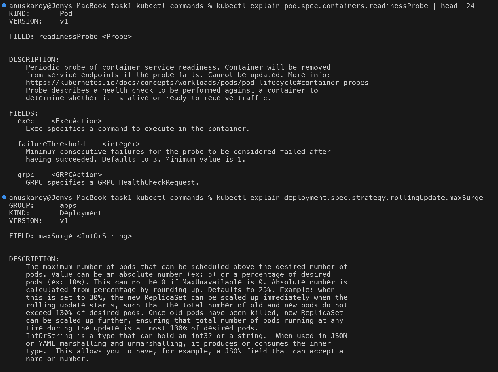

```bash
kubectl explain pod.spec.containers.resources --recursive        # whole field tree
kubectl explain svc.spec.type | sed -n '/^ENUM/,/^DESCRIPTION/p'  # allowed values
kubectl api-resources | grep -E '^(NAME|pods|services|deployments|configmaps|events) '   # short names / API groups
kubectl explain pod.spec.contaners                               # typo -> validation error
```

```text
FIELDS:
  claims	<[]ResourceClaim>
    name	<string> -required-
    request	<string>
  limits	<map[string]Quantity>
  requests	<map[string]Quantity>
ENUM:
    ClusterIP
    ExternalName
    LoadBalancer
    NodePort
error: field "contaners" does not exist
```

`explain` is how you catch YAML **configuration issues**: a misspelled or wrongly-nested field.

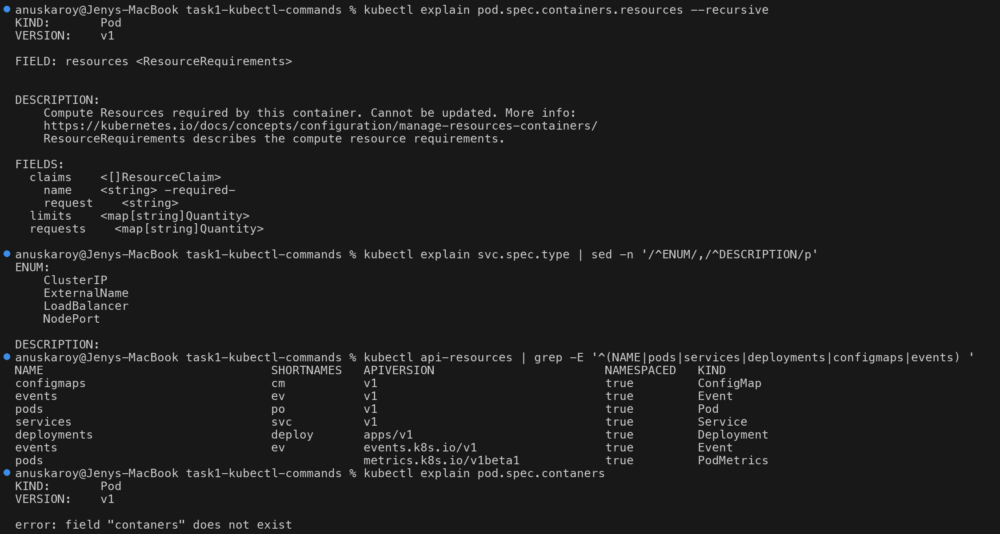

---

## 8. `kubectl top`: live resource usage (needs metrics-server)

```bash
kubectl top nodes
kubectl top pods -n task1
kubectl top pods -n task1 --containers
kubectl top pods -A --sort-by=memory | head -6
kubectl top pods -n task1 -l app=web --sort-by=cpu
```

```text
NAME        CPU(cores)   CPU(%)   MEMORY(bytes)   MEMORY(%)
session14   591m         7%       774Mi           19%
POD                    NAME          CPU(cores)   MEMORY(bytes)
logger                 app           8m           1Mi
logger                 log-shipper   2m           0Mi
web-6dc8cd996d-cdd7f   nginx         1m           7Mi
web-6dc8cd996d-m7chw   nginx         1m           7Mi
NAMESPACE     NAME                                CPU(cores)   MEMORY(bytes)
kube-system   kube-apiserver-session14            157m         259Mi
kube-system   kube-controller-manager-session14   40m          63Mi
```

Compare `top` (actual **usage**) with `describe node` → *Allocated resources* (**requests**). The scheduler only
looks at requests. That is why a Pod can be `Pending` on a node that `top` says is mostly idle.

> Right after the cluster starts, `kubectl top` returns `error: Metrics API not available` until metrics-server
> has scraped once (~60s). This happened in this lab too.

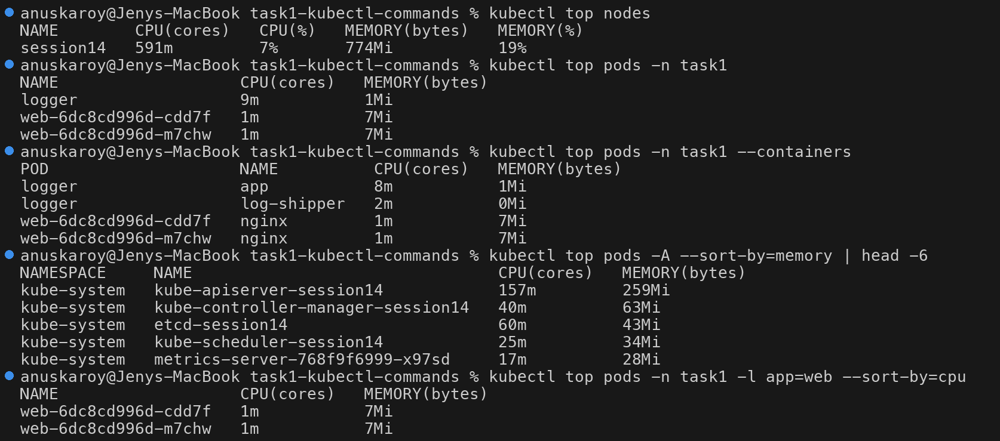

---

## Cheat sheet

| Command | Most useful flags |
| --- | --- |
| `kubectl get` | `-A`, `-l key=val`, `--show-labels`, `-o wide/yaml/json/jsonpath/custom-columns`, `--field-selector`, `-w` |
| `kubectl describe` | `pod/deploy/svc/node <name>`; read **State / Last State / Events** first |
| `kubectl logs` | `-c`, `--previous`, `-f`, `--tail`, `--since`, `--timestamps`, `-l ... --prefix`, `--all-containers` |
| `kubectl exec` | `-it ... -- sh`, `-c <container>`, `-- <cmd>` |
| `kubectl events` | `--for kind/name`, `--types=Warning`, `-A`, `-w` |
| `kubectl explain` | `<kind>.<field>.<field>`, `--recursive` |
| `kubectl top` | `nodes`, `pods --containers`, `--sort-by=cpu/memory`, `-A` |

## Cleanup

```bash
kubectl delete namespace task1
```
