# Session 14 - Task 2: Troubleshooting Common Kubernetes Issues

All scenarios were executed on a **single-node Minikube v1.39.0** cluster (profile `session14`, docker driver,
macOS arm64), Kubernetes **v1.37.0**, containerd 2.3.4. Every screenshot is real terminal output.

Each scenario folder contains a `broken` manifest that reproduces the issue and a `fixed` manifest. Each issue is
worked through the same five steps:

```text
 1. IDENTIFY      what is the symptom?            kubectl get / get -w
 2. INVESTIGATE   collect evidence                kubectl describe / events / logs / exec
 3. ROOT CAUSE    explain WHY, from the evidence
 4. FIX           smallest correct change         kubectl apply / replace --force / set image / patch
 5. VERIFY        prove it works, end to end      kubectl get / logs / curl from another Pod
```

| # | Issue | Folder | Root cause in this lab |
| --- | --- | --- | --- |
| 1 | CrashLoopBackOff | `01-crashloopbackoff/` | Required env var `DB_HOST` missing → app exits 1 |
| 2 | ImagePullBackOff | `02-imagepullbackoff/` | Tag typo `nginx:1.277` (tag does not exist) |
| 3 | ErrImagePull | `03-errimagepull/` | Repository does not exist / is private, no pull secret |
| 4 | Pending | `04-pending/` | Requests `cpu: 16`, `memory: 8Gi` > node allocatable |
| 5 | ContainerCreating | `05-containercreating/` | Pod mounts a ConfigMap that was never created |
| 6 | Service connectivity | `06-service-connectivity/` | Selector typo **and** wrong `targetPort` |
| 7 | DNS | `07-dns/` | Short name used across namespaces; also CoreDNS outage |
| 8 | Pod networking | `08-pod-networking/` | Server bound to `127.0.0.1` instead of `0.0.0.0` |
| 9 | Configuration | `09-configuration/` | ConfigMap key `smtp_host` ≠ referenced key `SMTP_HOST` |

Setup (namespaces `task2` and `task2-backend`):

```bash
kubectl apply -f namespace.yaml
```

```text
 Where each status comes from in the Pod lifecycle:

  kubectl apply
       │
       ▼
  ┌──────────────┐  no node fits (resources, nodeSelector, taints, PVC)
  │  Scheduler   │ ─────────────────────────────────────────────► Pending
  └──────┬───────┘
         ▼
  ┌──────────────┐  volume / secret / configmap can't be mounted ► ContainerCreating (stuck)
  │   kubelet    │  configMapKeyRef / secretKeyRef missing ──────► CreateContainerConfigError
  │  sets up Pod │
  └──────┬───────┘
         ▼
  ┌──────────────┐  pull fails ───────────────────────────────────► ErrImagePull
  │  Image pull  │  pull keeps failing, kubelet waits (backoff) ──► ImagePullBackOff
  └──────┬───────┘
         ▼
  ┌──────────────┐  process exits, restarts, exits again ─────────► CrashLoopBackOff
  │  Container   │  Running but readiness probe fails ────────────► READY 0/1, removed from Service
  │   running    │  Running + Ready, but traffic still fails ─────► Service / DNS / networking issue
  └──────────────┘
```

---

## 1. CrashLoopBackOff

Files: `01-crashloopbackoff/broken.yaml`, `fixed.yaml`. Pod `payment-api` refuses to start without `DB_HOST`.

### Identify

```bash
kubectl apply -f broken.yaml
kubectl get pod payment-api -n task2 -w
```

```text
NAME          READY   STATUS    RESTARTS   AGE
payment-api   0/1     Pending   0          0s
payment-api   0/1     ContainerCreating   0          0s
payment-api   1/1     Running             0          1s
payment-api   0/1     Error               0          2s
payment-api   1/1     Running             1 (1s ago)   2s
payment-api   0/1     Error               1 (2s ago)   3s
payment-api   0/1     CrashLoopBackOff    1 (2s ago)   4s
payment-api   1/1     Running             2 (11s ago)   13s
payment-api   0/1     Error               2 (12s ago)   14s
payment-api   0/1     CrashLoopBackOff    2 (23s ago)   36s
payment-api   1/1     Running             3 (23s ago)   36s
payment-api   0/1     Error               3 (24s ago)   37s
```

The cycle is **Running → Error → CrashLoopBackOff**, and the wait between restarts grows (10s, 20s, 40s ... up to 5 min).
`CrashLoopBackOff` is not the error itself. It means "the container keeps dying, so kubelet is waiting before
restarting it again".

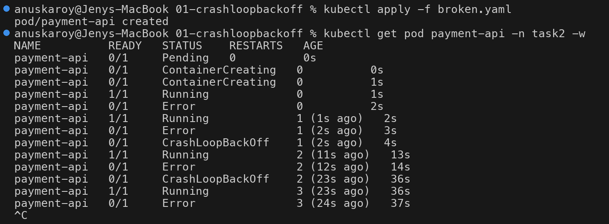

### Investigate

```bash
kubectl describe pod payment-api -n task2 | sed -n '/^    State:/,/Restart Count/p;/^Events:/,$p'
```

```text
    State:          Terminated
      Reason:       Error
      Exit Code:    1
    Last State:     Terminated
      Reason:       Error
      Exit Code:    1
    Ready:          False
    Restart Count:  3
Events:
  Warning  BackOff    15s (x4 over 49s)  kubelet  Back-off restarting failed container app in pod payment-api_task2(...)
```

`Exit Code: 1` means the **application** chose to exit (as opposed to `137` = killed / OOMKilled, `127` = command not found).
The image pulled fine and the container started, so this is an application problem and the logs come next.

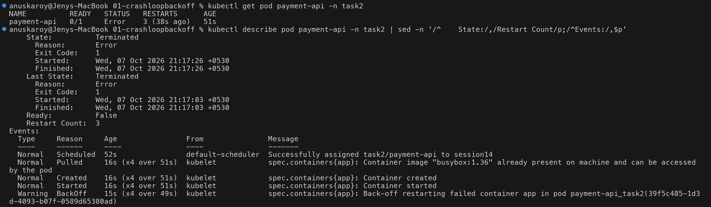

### Root cause

```bash
kubectl logs payment-api -n task2
kubectl logs payment-api -n task2 --previous
kubectl get pod payment-api -n task2 -o jsonpath='{.status.containerStatuses[0].lastState.terminated.exitCode}{"\n"}'
kubectl set env pod/payment-api -n task2 --list
```

```text
$ kubectl logs payment-api -n task2
FATAL: required environment variable DB_HOST is not set
payment-api v1.4.2 starting...
$ kubectl logs payment-api -n task2 --previous
unable to retrieve container logs for containerd://f08f840686e1...
$ kubectl get pod payment-api -n task2 -o jsonpath='{...lastState.terminated.exitCode}'
1
$ kubectl set env pod/payment-api -n task2 --list
# Pod payment-api, container app
```

**Root cause:** the app requires `DB_HOST`, and the Pod spec has **no env vars at all** (`--list` prints none).

> **About `--previous`:** while a Pod is in back-off, the "current" container is already the crashed one, so
> plain `kubectl logs` shows the crash output. `--previous` asks for the instance *before* that one, which kubelet
> has already garbage-collected (it keeps only the latest exited container). `--previous` is most useful when the
> container is **currently running** after a restart, e.g. a liveness-probe kill or OOMKill of a long-running process.

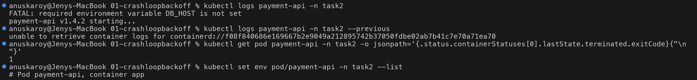

### Fix

```bash
diff broken.yaml fixed.yaml
kubectl apply -f fixed.yaml                  # fails - Pod spec is immutable
kubectl replace --force -f fixed.yaml        # delete + recreate
```

```text
24a24,27
>       # FIX: the app requires DB_HOST at startup; it was missing from the spec
>       env:
>         - name: DB_HOST
>           value: postgres.task2.svc.cluster.local
$ kubectl apply -f fixed.yaml
The Pod "payment-api" is invalid: spec: Forbidden: pod updates may not change fields other than `spec.containers[*].image`, ...
$ kubectl replace --force -f fixed.yaml
pod "payment-api" deleted from task2 namespace
pod/payment-api replaced
```

> Most fields of a bare **Pod** cannot be changed in place, so `apply` is rejected. For a Pod you must delete and
> recreate it (`replace --force`). This is one reason real workloads use Deployments: changing a Deployment's
> template triggers a rolling replacement automatically.

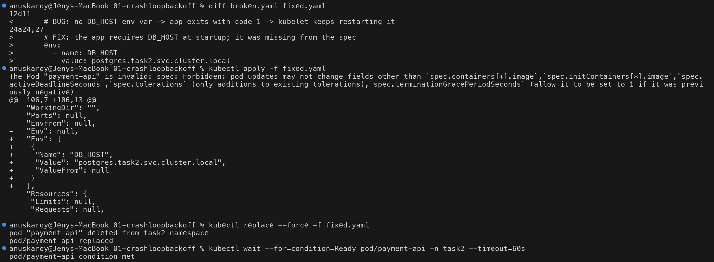

### Verify

```text
$ kubectl get pod payment-api -n task2
NAME          READY   STATUS    RESTARTS   AGE
payment-api   1/1     Running   0          16s
$ kubectl logs payment-api -n task2
payment-api v1.4.2 starting...
connecting to database at postgres.task2.svc.cluster.local:5432
payment-api ready, listening on :8080
$ kubectl set env pod/payment-api -n task2 --list
# Pod payment-api, container app
DB_HOST=postgres.task2.svc.cluster.local
```

`RESTARTS 0` after 16s and the "ready" log line confirm the fix.

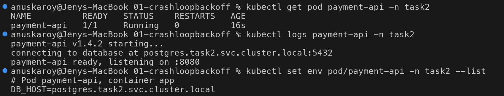

---

## 2. ImagePullBackOff

Files: `02-imagepullbackoff/broken.yaml` (`nginx:1.277`), `fixed.yaml` (`nginx:1.27`).

### Identify

```text
$ kubectl get pod frontend -n task2 -w
NAME       READY   STATUS    RESTARTS   AGE
frontend   0/1     Pending   0          0s
frontend   0/1     ContainerCreating   0          0s
frontend   0/1     ErrImagePull        0          3s
frontend   0/1     ImagePullBackOff    0          17s
```

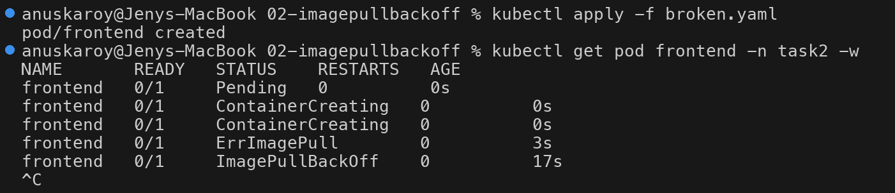

### Investigate

```bash
kubectl describe pod frontend -n task2 | sed -n '/^Containers:/,/Ready:/p;/^Events:/,$p'
```

```text
    Image:          nginx:1.277
    State:          Waiting
      Reason:       ErrImagePull
Events:
  Normal   Pulling    13s (x2 over 30s)  kubelet  Pulling image "nginx:1.277"
  Warning  Failed     12s (x2 over 28s)  kubelet  Failed to pull image "nginx:1.277": rpc error: code = NotFound desc = failed to pull
           and unpack image "docker.io/library/nginx:1.277": failed to resolve reference "docker.io/library/nginx:1.277":
           docker.io/library/nginx:1.277: not found
  Normal   BackOff    0s (x2 over 27s)   kubelet  Back-off pulling image "nginx:1.277"
  Warning  Failed     0s (x2 over 27s)   kubelet  Error: ImagePullBackOff
```

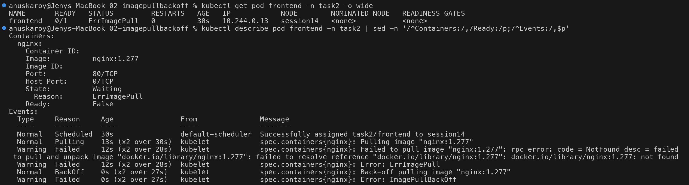

### Root cause

The registry answered **`NotFound`**. The repository `library/nginx` exists, but tag `1.277` does not. Confirmed
against the Docker Hub API:

```text
$ curl -s https://hub.docker.com/v2/repositories/library/nginx/tags/1.277; echo
{"message":"httperror 404: tag '1.277' not found","errinfo":{"namespace":"library","repository":"nginx","tag":"1.277"}}
$ curl -s https://hub.docker.com/v2/repositories/library/nginx/tags/1.27 | python3 -c '...'
tag: 1.27 | status: active | arm64 available: True
```

Checking `arm64 available` matters on Apple Silicon. An existing tag can still fail with
`no match for platform in manifest` if it is published only for amd64.

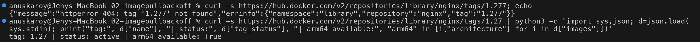

### Fix & verify

`image` is one of the few Pod fields that **can** be updated in place:

```bash
kubectl set image pod/frontend nginx=nginx:1.27 -n task2
```

```text
pod/frontend image updated
pod/frontend condition met
NAME       READY   STATUS    RESTARTS   AGE
frontend   1/1     Running   0          53s
9s (x3 over 51s)    Warning   Failed      Pod/frontend   Error: ErrImagePull
0s                  Normal    Pulled      Pod/frontend   Container image "nginx:1.27" already present on machine ...
0s                  Normal    Started     Pod/frontend   Container started
```

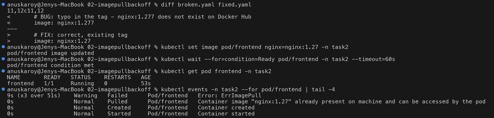

---

## 3. ErrImagePull

Files: `03-errimagepull/broken.yaml` (`devopsheros/inventory-service:2.0`), `fixed.yaml` (`hashicorp/http-echo:1.0`).

**ErrImagePull vs ImagePullBackOff:** `ErrImagePull` is the status right after a pull **attempt fails**.
`ImagePullBackOff` is the status while kubelet **waits** before the next attempt. A Pod with a bad image
alternates between the two. The useful question is *why* the pull fails, and the two common answers are
"tag not found" (scenario 2) and "access denied" (this scenario).

### Identify

```text
$ kubectl get pod inventory-service -n task2 -w
NAME                READY   STATUS              RESTARTS   AGE
inventory-service   0/1     ContainerCreating   0          0s
inventory-service   0/1     ErrImagePull        0          9s
inventory-service   0/1     ImagePullBackOff    0          19s
inventory-service   0/1     ErrImagePull        0          36s
```

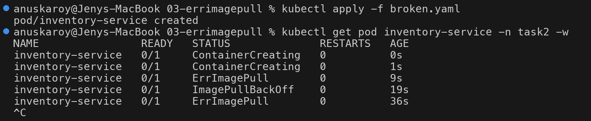

### Investigate

```text
    Image:         devopsheros/inventory-service:2.0
    State:          Waiting
      Reason:       ErrImagePull
  Warning  Failed  20s (x2 over 33s)  kubelet  Failed to pull image "devopsheros/inventory-service:2.0": failed to pull and unpack
           image "docker.io/devopsheros/inventory-service:2.0": failed to resolve reference "docker.io/devopsheros/inventory-service:2.0":
           pull access denied, repository does not exist or may require authorization: server message: insufficient_scope: authorization failed
```

The message is in `.status.containerStatuses[0].state.waiting.message` too, which is handy for scripts.

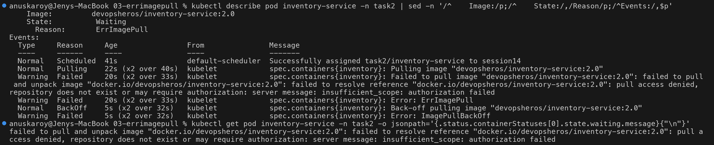

### Root cause

`pull access denied ... repository does not exist or may require authorization` means one of two things:
the repository doesn't exist, or it's private and the Pod has no `imagePullSecrets`. Check both:

```text
$ curl -s https://hub.docker.com/v2/repositories/devopsheros/inventory-service/; echo
{"message":"object not found","errinfo":{}}
$ kubectl get secrets -n task2 --field-selector type=kubernetes.io/dockerconfigjson
No resources found in task2 namespace.
$ minikube -p session14 ssh -- sudo crictl pull devopsheros/inventory-service:2.0 2>&1 | grep -o 'pull access denied[^:]*'
pull access denied, repository does not exist or may require authorization
```

Pulling directly on the node with `crictl` removes Kubernetes from the equation. It fails the same way, so the
problem is the image reference, not the Pod. **Root cause: the repository does not exist.** If it were private,
the fix would be `kubectl create secret docker-registry ...` + `imagePullSecrets` in the Pod spec.

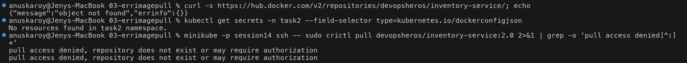

### Fix & verify

```text
$ kubectl set image pod/inventory-service inventory=hashicorp/http-echo:1.0 -n task2
pod/inventory-service image updated
$ kubectl get pod inventory-service -n task2 -o wide
NAME                READY   STATUS    RESTARTS   AGE   IP            NODE        ...
inventory-service   1/1     Running   0          63s   10.244.0.14   session14   ...
$ kubectl exec frontend -n task2 -- curl -s $(kubectl get pod inventory-service -n task2 -o jsonpath='{.status.podIP}'):5678
inventory-service OK
```

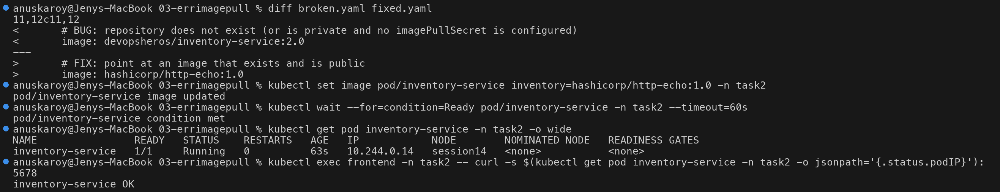

---

## 4. Pending

Files: `04-pending/broken.yaml`, `fixed.yaml`. Deployment `report-generator` requests `cpu: "16"`, `memory: 8Gi`.

### Identify

```text
$ kubectl get deploy report-generator -n task2
NAME               READY   UP-TO-DATE   AVAILABLE   AGE
report-generator   0/1     1            0           11s
$ kubectl get pods -n task2 -l app=report-generator -o wide
NAME                                READY   STATUS    RESTARTS   AGE   IP       NODE     ...
report-generator-568b5467f7-lwsn8   0/1     Pending   0          12s   <none>   <none>   ...
```

`NODE <none>` means the Pod was **never scheduled**. No image pull or container start has happened yet, so
`kubectl logs` has nothing to show. The scheduler's events are where to look.

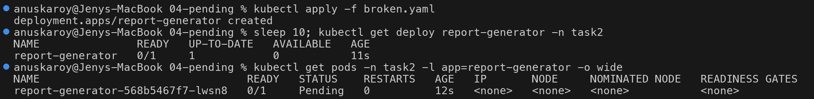

### Investigate

```text
$ kubectl describe pod report-generator-568b5467f7-lwsn8 -n task2 | sed -n '/Requests:/,/memory/p;/^Events:/,$p'
    Requests:
      cpu:        16
      memory:     8Gi
Events:
  Warning  FailedScheduling  12s  default-scheduler  0/1 nodes are available: 1 Insufficient cpu, 1 Insufficient memory.
           preemption: 0/1 nodes are available: 1 Preemption is not helpful for scheduling.
```

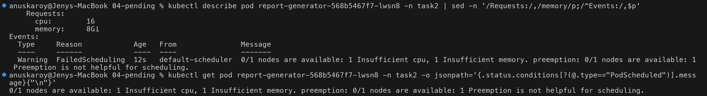

### Root cause

```text
$ kubectl get node session14 -o custom-columns=NODE:.metadata.name,CPU-ALLOCATABLE:.status.allocatable.cpu,MEM-ALLOCATABLE:.status.allocatable.memory
NODE        CPU-ALLOCATABLE   MEM-ALLOCATABLE
session14   8                 4010356Ki
$ kubectl describe node session14 | sed -n '/Allocated resources:/,/memory/p'
  cpu                1070m (13%)  500m (6%)
  memory             500Mi (12%)  476Mi (12%)
```

The node can offer at most `8 - 1.07 ≈ 6.9` CPUs and `~3.3 Gi` memory. The Pod asks for 16 CPUs and 8 Gi.
**No node can satisfy the request, so the scheduler leaves the Pod Pending forever.**

Other common reasons for `Pending`, all visible in the same `FailedScheduling` event:
`node(s) didn't match Pod's node affinity/selector`, `untolerated taint`, `unbound immediate PersistentVolumeClaims`.

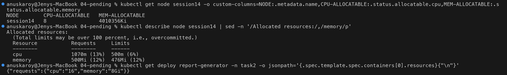

### Fix & verify

```text
$ kubectl apply -f fixed.yaml          # requests: cpu 100m, memory 64Mi (+ limits)
deployment.apps/report-generator configured
$ kubectl rollout status deployment/report-generator -n task2
deployment "report-generator" successfully rolled out
$ kubectl get pods -n task2 -l app=report-generator -o wide
NAME                                READY   STATUS    RESTARTS   AGE   IP            NODE        ...
report-generator-5b48c7b4bd-s6brk   1/1     Running   0          5s    10.244.0.15   session14   ...
$ kubectl events -n task2 --for deployment/report-generator
29s   Normal   ScalingReplicaSet   Deployment/report-generator   Scaled up replica set report-generator-568b5467f7 from 0 to 1
5s    Normal   ScalingReplicaSet   Deployment/report-generator   Scaled up replica set report-generator-5b48c7b4bd from 0 to 1
1s    Normal   ScalingReplicaSet   Deployment/report-generator   Scaled down replica set report-generator-568b5467f7 from 1 to 0
$ kubectl logs deploy/report-generator -n task2
report-generator started
```

Because this is a Deployment, `apply` worked directly: the new template created a new ReplicaSet and the
Pending Pod's ReplicaSet was scaled to 0.

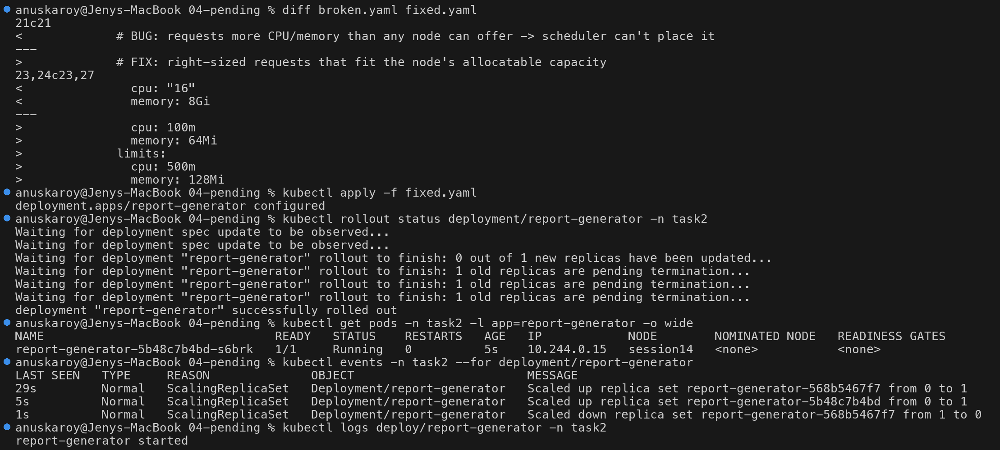

---

## 5. ContainerCreating (stuck)

Files: `05-containercreating/broken.yaml` (Pod `landing-page` mounts ConfigMap `landing-page-html`), `fixed.yaml` (the ConfigMap).

### Identify

```text
$ kubectl get pod landing-page -n task2
NAME           READY   STATUS              RESTARTS   AGE
landing-page   0/1     ContainerCreating   0          20s
```

`ContainerCreating` for a few seconds is normal. Stuck for 20s+ with a local image means kubelet cannot
finish setting up the Pod sandbox: volumes, secrets, network (CNI).

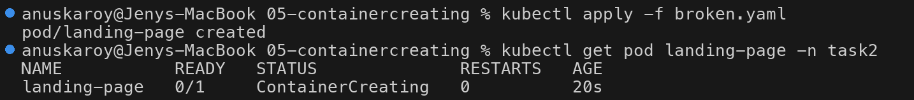

### Investigate & root cause

```text
$ kubectl describe pod landing-page -n task2 | sed -n '/^    State:/,/Reason/p;/^Volumes:/,/Optional/p;/^Events:/,$p'
    State:          Waiting
      Reason:       ContainerCreating
Volumes:
  site:
    Type:      ConfigMap (a volume populated by a ConfigMap)
    Name:      landing-page-html
    Optional:  false
Events:
  Normal   Scheduled    20s               default-scheduler  Successfully assigned task2/landing-page to session14
  Warning  FailedMount  4s (x6 over 20s)  kubelet            MountVolume.SetUp failed for volume "site" : configmap "landing-page-html" not found
$ kubectl get configmap -n task2
NAME               DATA   AGE
kube-root-ca.crt   1      7m47s
```

**Root cause:** the volume references ConfigMap `landing-page-html`, which does not exist (`Optional: false`).
kubelet retries the mount every few seconds (`x6 over 20s`) and won't start the container until it succeeds.

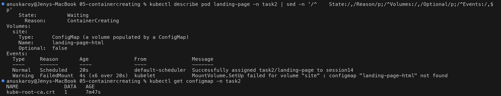

### Fix & verify

The Pod is not touched. We only create the missing object, and kubelet's next mount retry succeeds:

```text
$ kubectl apply -f fixed.yaml
configmap/landing-page-html created
$ kubectl wait --for=condition=Ready pod/landing-page -n task2 --timeout=90s
pod/landing-page condition met
$ kubectl get pod landing-page -n task2
NAME           READY   STATUS    RESTARTS   AGE
landing-page   1/1     Running   0          34s
$ kubectl events -n task2 --for pod/landing-page | tail -4
18s (x6 over 34s)   Warning   FailedMount   Pod/landing-page   MountVolume.SetUp failed for volume "site" : configmap "landing-page-html" not found
1s                  Normal    Pulled        Pod/landing-page   Container image "nginx:1.27" already present on machine ...
0s                  Normal    Started       Pod/landing-page   Container started
$ kubectl exec landing-page -n task2 -- curl -s localhost
<h1>Landing page served from ConfigMap</h1>
```

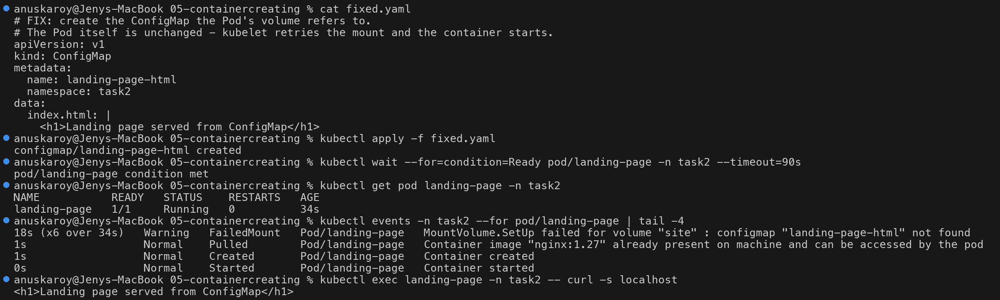

---

## 6. Service connectivity issues

Files: `06-service-connectivity/app.yaml` (Deployment `orders` on port **5678** + debug Pod `netshoot`),
`broken-service.yaml`, `fixed-service.yaml`. This scenario has **two** bugs on top of each other, which is common
in real incidents: fixing the first one only changes the symptom.

```text
 client ──► Service orders:80 ──selector──► EndpointSlice ──targetPort──► Pod IP:5678
                                  ▲ BUG 1: app=order                  ▲ BUG 2: targetPort 80
```

### Identify

```text
$ kubectl get deploy orders -n task2
NAME     READY   UP-TO-DATE   AVAILABLE   AGE
orders   2/2     2            2           15s
$ kubectl get svc orders -n task2
NAME     TYPE        CLUSTER-IP     EXTERNAL-IP   PORT(S)   AGE
orders   ClusterIP   10.111.83.78   <none>        80/TCP    0s
$ kubectl exec netshoot -n task2 -- curl -sS --max-time 5 http://orders
curl: (7) Failed to connect to orders port 80 after 1032 ms: Could not connect to server
```

Pods are healthy and the Service exists, but connections fail. Note that DNS **did** resolve (`curl: (7)` is a
connect error, not `(6) Could not resolve host`).

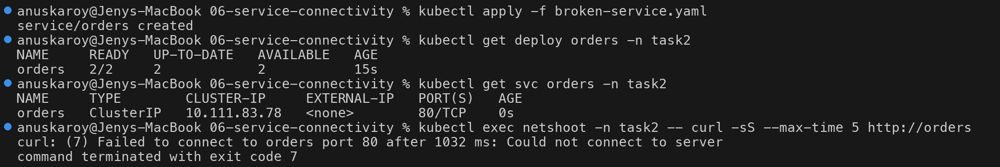

### Investigate: endpoints

```text
$ kubectl get endpointslices -n task2 -l kubernetes.io/service-name=orders
NAME           ADDRESSTYPE   PORTS     ENDPOINTS   AGE
orders-56fhl   IPv4          <unset>   <unset>     1s
$ kubectl describe svc orders -n task2 | grep -E 'Selector|TargetPort|Endpoints'
Selector:                 app=order
TargetPort:               80/TCP
Endpoints:
$ kubectl get pods -n task2 --show-labels -l app=orders
orders-76dc79b594-74wsr   1/1     Running   0          6s    app=orders,pod-template-hash=76dc79b594
orders-76dc79b594-h6cl8   1/1     Running   0          6s    app=orders,pod-template-hash=76dc79b594
$ kubectl get pods -n task2 -l app=order
No resources found in task2 namespace.
```

**Root cause 1:** empty endpoints. The selector `app=order` matches zero Pods, because they're labelled `app=orders`.

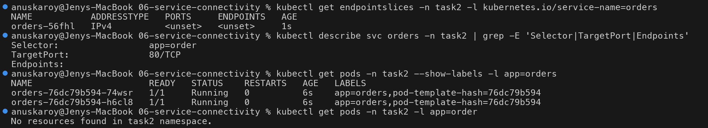

### Fix 1 → a new symptom

```text
$ kubectl patch svc orders -n task2 -p '{"spec":{"selector":{"app":"orders"}}}'
service/orders patched
$ kubectl get endpointslices -n task2 -l kubernetes.io/service-name=orders
NAME           ADDRESSTYPE   PORTS   ENDPOINTS                 AGE
orders-m4jq5   IPv4          80      10.244.0.19,10.244.0.18   13s
$ kubectl exec netshoot -n task2 -- curl -sS --max-time 5 http://orders
curl: (7) Failed to connect to orders port 80 after 6 ms: Could not connect to server
```

Endpoints now exist, but they point at **port 80**, and it still fails.

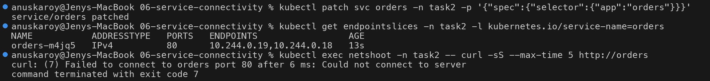

### Investigate: ports

```text
$ kubectl get svc orders -n task2 -o jsonpath='{.spec.ports[0].targetPort}{"\n"}'
80
$ kubectl get deploy orders -n task2 -o jsonpath='{.spec.template.spec.containers[0].ports}{"\n"}'
[{"containerPort":5678,"name":"http","protocol":"TCP"}]
$ kubectl exec netshoot -n task2 -- curl -sS --max-time 5 10.244.0.19:80
curl: (7) Failed to connect to 10.244.0.19 port 80 after 1 ms: Could not connect to server
$ kubectl exec netshoot -n task2 -- curl -sS --max-time 5 10.244.0.19:5678
orders-api: 42 open orders
```

Bypassing the Service and calling the Pod IP directly isolates the layer. Pod:5678 works and Pod:80 doesn't.
**Root cause 2:** `targetPort: 80`, but the container listens on 5678.

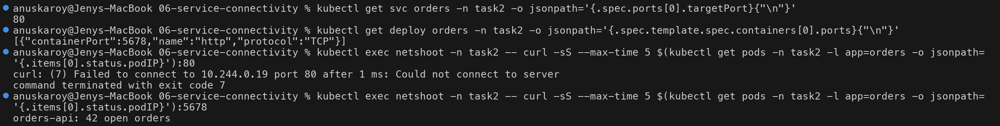

### Fix & verify

```text
$ diff broken-service.yaml fixed-service.yaml
<     app: order        # BUG 1: Pods are labelled app=orders
>     app: orders       # FIX 1: matches the Pod labels
<       targetPort: 80  # BUG 2: container listens on 5678, not 80
>       targetPort: 5678  # FIX 2: matches containerPort
$ kubectl apply -f fixed-service.yaml
service/orders configured
$ kubectl get endpointslices -n task2 -l kubernetes.io/service-name=orders
orders-m4jq5   IPv4          5678    10.244.0.19,10.244.0.18   23s
$ kubectl exec netshoot -n task2 -- sh -c 'for i in 1 2 3; do curl -sS --max-time 5 http://orders; done'
orders-api: 42 open orders
orders-api: 42 open orders
orders-api: 42 open orders
$ kubectl exec netshoot -n task2 -- curl -sS http://orders.task2.svc.cluster.local
orders-api: 42 open orders
```

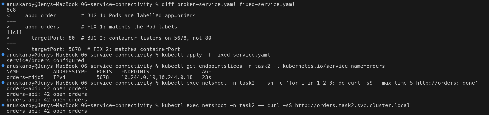

---

## 7. DNS issues

Files: `07-dns/catalog-backend.yaml` (Deployment + Service `catalog` in namespace **`task2-backend`**),
`broken-client.yaml` / `fixed-client.yaml` (Pod `storefront` in namespace **`task2`**, which curls `$CATALOG_URL` every 5s).

### Identify

```text
$ kubectl get pod storefront -n task2
NAME         READY   STATUS    RESTARTS   AGE
storefront   1/1     Running   0          18s
$ kubectl logs storefront -n task2 --tail=3
15:55:46 GET http://catalog -> curl: (6) Could not resolve host: catalog
15:55:52 GET http://catalog -> curl: (6) Could not resolve host: catalog
```

The Pod is "healthy" from Kubernetes' point of view, but the application can't reach its dependency.
`curl: (6)` = name resolution failed.

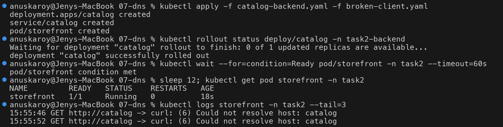

### Investigate

```text
$ kubectl exec storefront -n task2 -- nslookup catalog
Server:		10.96.0.10
Address:	10.96.0.10#53

** server can't find catalog: NXDOMAIN
$ kubectl exec storefront -n task2 -- cat /etc/resolv.conf
search task2.svc.cluster.local svc.cluster.local cluster.local
nameserver 10.96.0.10
options ndots:5
$ kubectl get svc -A --field-selector metadata.name=catalog
NAMESPACE       NAME      TYPE        CLUSTER-IP     EXTERNAL-IP   PORT(S)   AGE
task2-backend   catalog   ClusterIP   10.99.231.92   <none>        80/TCP    20s
```

The DNS server **answered** (`NXDOMAIN` is an answer, not a timeout). The resolver expands `catalog` using the
search list, which only tries `catalog.task2.svc.cluster.local`, but the Service lives in `task2-backend`.

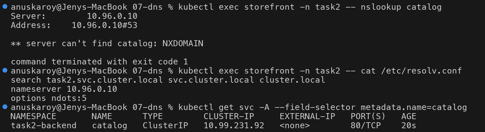

### Root cause: rule out CoreDNS itself

```text
$ kubectl get pods -n kube-system -l k8s-app=kube-dns
coredns-559f6c778d-k2q42   1/1     Running   0          19m
$ kubectl get endpointslices -n kube-system -l kubernetes.io/service-name=kube-dns
kube-dns-54gtf   IPv4          53,53,9153   10.244.0.3   19m
$ kubectl exec storefront -n task2 -- nslookup kubernetes.default | tail -3
Name:	kubernetes.default.svc.cluster.local
Address: 10.96.0.1
$ kubectl exec storefront -n task2 -- nslookup catalog.task2-backend | tail -3
Name:	catalog.task2-backend.svc.cluster.local
Address: 10.99.231.92
$ kubectl exec storefront -n task2 -- dig +short catalog.task2-backend.svc.cluster.local
10.99.231.92
```

CoreDNS is running and resolves other names. **Root cause:** the client uses a short name (`catalog`) for a
Service in another namespace. Short names only work inside the same namespace.

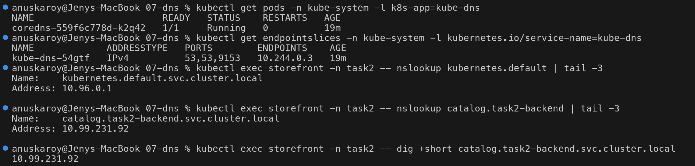

### Fix & verify

```text
$ diff broken-client.yaml fixed-client.yaml
<           value: "http://catalog"
>           value: "http://catalog.task2-backend.svc.cluster.local"
$ kubectl replace --force -f fixed-client.yaml
pod/storefront replaced
$ kubectl logs storefront -n task2 --tail=2
15:56:49 GET http://catalog.task2-backend.svc.cluster.local -> catalog-api: 120 products
15:56:54 GET http://catalog.task2-backend.svc.cluster.local -> catalog-api: 120 products
```

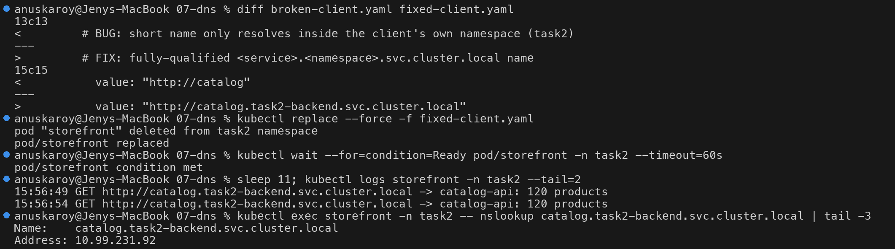

### Second DNS failure: the cluster DNS itself is down

What it looks like when the problem is **CoreDNS** and not the name:

```text
$ kubectl scale deployment coredns -n kube-system --replicas=0
$ kubectl wait --for=delete pod -n kube-system -l k8s-app=kube-dns --timeout=60s
$ kubectl get endpointslices -n kube-system -l kubernetes.io/service-name=kube-dns
NAME             ADDRESSTYPE   PORTS     ENDPOINTS   AGE
kube-dns-54gtf   IPv4          <unset>   <unset>     21m
$ kubectl exec storefront -n task2 -- nslookup -timeout=2 -retry=1 catalog.task2-backend.svc.cluster.local
;; communications error to 10.96.0.10#53: connection refused
;; no servers could be reached
$ kubectl exec storefront -n task2 -- curl -sS --max-time 5 http://catalog.task2-backend.svc.cluster.local
curl: (6) Could not resolve host: catalog.task2-backend.svc.cluster.local
$ kubectl exec storefront -n task2 -- curl -sS --max-time 5 http://10.99.231.92
catalog-api: 120 products
```

| Symptom | Meaning |
| --- | --- |
| `NXDOMAIN` | DNS works, **the name is wrong** (typo, wrong namespace, Service missing) |
| `no servers could be reached` / timeout | **DNS itself is broken** (CoreDNS down, kube-dns has no endpoints, network policy blocks port 53) |
| Name fails but ClusterIP works | the problem is DNS only, Service routing is fine |

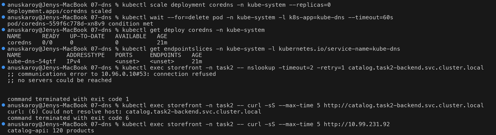

Restore:

```text
$ kubectl scale deployment coredns -n kube-system --replicas=1
$ kubectl rollout status deployment/coredns -n kube-system
deployment "coredns" successfully rolled out
$ kubectl get endpointslices -n kube-system -l kubernetes.io/service-name=kube-dns
kube-dns-54gtf   IPv4          53,53,9153   10.244.0.24   21m
$ kubectl exec storefront -n task2 -- curl -sS --max-time 5 http://catalog.task2-backend.svc.cluster.local
catalog-api: 120 products
```

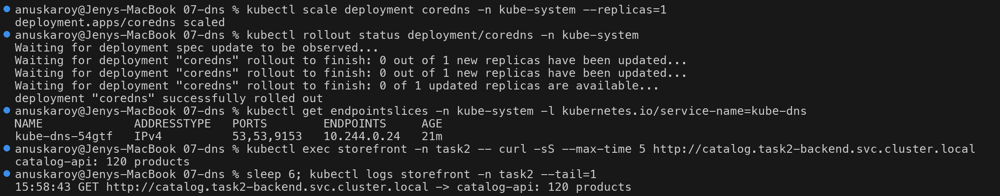

---

## 8. Pod networking issues

Files: `08-pod-networking/broken.yaml` / `fixed.yaml` (Pod `metrics-exporter`, busybox `httpd` on 8080), `service.yaml`.

### Identify

```text
$ kubectl get pod metrics-exporter -n task2 -o wide
NAME               READY   STATUS    RESTARTS   AGE   IP            NODE        ...
metrics-exporter   1/1     Running   0          10s   10.244.0.25   session14   ...
$ kubectl get endpointslices -n task2 -l kubernetes.io/service-name=metrics-exporter
metrics-exporter-qq7hw   IPv4          8080    10.244.0.25   8s
$ kubectl exec netshoot -n task2 -- curl -sS --max-time 5 http://metrics-exporter:8080/metrics
curl: (7) Failed to connect to metrics-exporter port 8080 after 7 ms: Could not connect to server
```

Unlike scenario 6, the Service **is** correct: the endpoint has the right IP and port. So the problem is
between the network and the process.

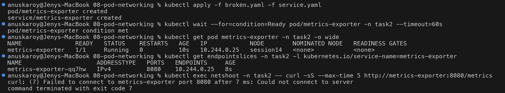

### Investigate: test layer by layer

```text
$ kubectl exec netshoot -n task2 -- ping -c 2 -W 2 10.244.0.25            # L3: is the Pod reachable?
2 packets transmitted, 2 packets received, 0% packet loss
$ kubectl exec netshoot -n task2 -- curl -sS --max-time 5 http://10.244.0.25:8080/metrics
curl: (7) Failed to connect to 10.244.0.25 port 8080 after 0 ms: Could not connect to server
$ kubectl exec netshoot -n task2 -- nc -zv -w 3 10.244.0.25 8080           # L4: is the port open?
nc: connect to 10.244.0.25 port 8080 (tcp) failed: Connection refused
$ kubectl exec metrics-exporter -n task2 -- wget -qO- http://127.0.0.1:8080/metrics   # from inside
requests_total 1337
```

- Ping works, so Pod-to-Pod routing (the CNI) is fine.
- TCP gets an immediate `Connection refused` (not a timeout), so nothing is listening on that IP:port.
- The same request from inside the Pod, to localhost, works.

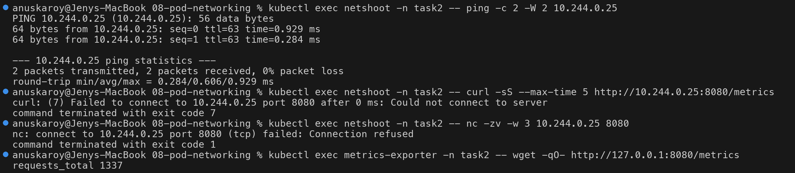

### Root cause

```text
$ kubectl exec metrics-exporter -n task2 -- netstat -tln
Proto Recv-Q Send-Q Local Address           Foreign Address         State
tcp        0      0 127.0.0.1:8080          0.0.0.0:*               LISTEN
$ kubectl exec metrics-exporter -n task2 -- ip -4 addr show eth0
    inet 10.244.0.25/24 brd 10.244.0.255 scope global eth0
$ kubectl get pod metrics-exporter -n task2 -o jsonpath='{.spec.containers[0].command[2]}'
httpd -f -v -p 127.0.0.1:8080 -h /www
```

**Root cause:** the server listens on `127.0.0.1` (loopback) only. Traffic from other Pods arrives on `eth0`
(`10.244.0.25`), where nothing is listening. Applications that default to `localhost` are a very common cause
of this, e.g. Flask/Node dev servers.

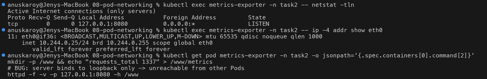

### Fix & verify

```text
$ diff broken.yaml fixed.yaml
<           httpd -f -v -p 127.0.0.1:8080 -h /www
>           httpd -f -v -p 0.0.0.0:8080 -h /www
$ kubectl replace --force -f fixed.yaml
$ kubectl exec metrics-exporter -n task2 -- netstat -tln | tail -1
tcp        0      0 0.0.0.0:8080            0.0.0.0:*               LISTEN
$ kubectl exec netshoot -n task2 -- curl -sS --max-time 5 http://10.244.0.26:8080/metrics
requests_total 1337
$ kubectl exec netshoot -n task2 -- curl -sS --max-time 5 http://metrics-exporter:8080/metrics
requests_total 1337
$ kubectl logs metrics-exporter -n task2
10.244.0.17:34426: response:200
10.244.0.17:42594: response:200
```

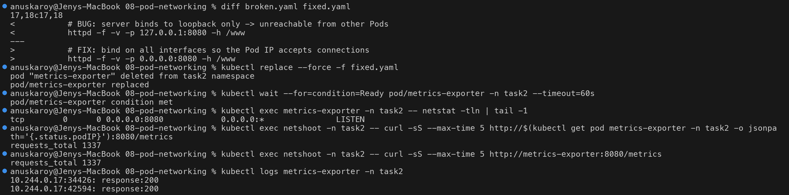

---

## 9. Configuration issues

Files: `09-configuration/deployment.yaml` (env from `configMapKeyRef` keys `SMTP_HOST`, `SMTP_PORT`),
`broken-configmap.yaml` (keys `smtp_host`, `smtp_port`), `fixed-configmap.yaml`.

### Identify

```text
$ kubectl get deploy notification-svc -n task2
NAME               READY   UP-TO-DATE   AVAILABLE   AGE
notification-svc   0/1     1            0           11s
$ kubectl get pods -n task2 -l app=notification-svc
NAME                                READY   STATUS                       RESTARTS   AGE
notification-svc-5d45df6f74-x7hr8   0/1     CreateContainerConfigError   0          11s
```

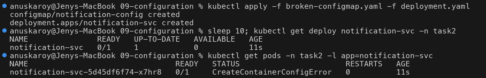

### Investigate

```text
$ kubectl describe pod notification-svc-5d45df6f74-x7hr8 -n task2 | ...
    State:          Waiting
      Reason:       CreateContainerConfigError
    Environment:
      SMTP_HOST:  <set to the key 'SMTP_HOST' of config map 'notification-config'>  Optional: false
      SMTP_PORT:  <set to the key 'SMTP_PORT' of config map 'notification-config'>  Optional: false
Events:
  Warning  Failed     11s (x2 over 11s)  kubelet   Error: couldn't find key SMTP_HOST in ConfigMap task2/notification-config
$ kubectl logs notification-svc-5d45df6f74-x7hr8 -n task2
Error from server (BadRequest): container "app" in pod "notification-svc-5d45df6f74-x7hr8" is waiting to start: CreateContainerConfigError
```

The container was never created, so there are no logs. The event names the exact problem.

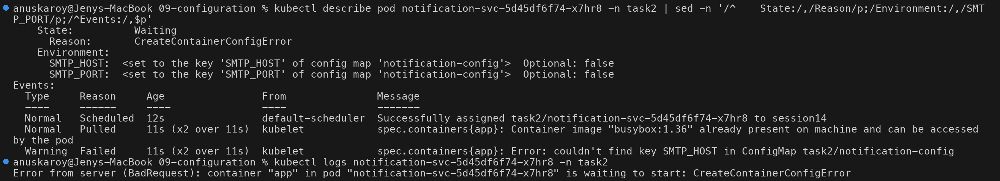

### Root cause

```text
$ kubectl get configmap notification-config -n task2 -o yaml | sed -n '/^data:/,/^kind/p'
data:
  smtp_host: smtp.mailtrap.io
  smtp_port: "2525"
$ kubectl get deploy notification-svc -n task2 -o jsonpath='{range ...env[*]}...{end}'
SMTP_HOST <- configmap notification-config key=SMTP_HOST
SMTP_PORT <- configmap notification-config key=SMTP_PORT
```

**Root cause:** ConfigMap keys are **case-sensitive**. The ConfigMap has `smtp_host`, the Deployment asks for
`SMTP_HOST`. The same error appears for a missing Secret key (`secretKeyRef`) or a missing ConfigMap/Secret.

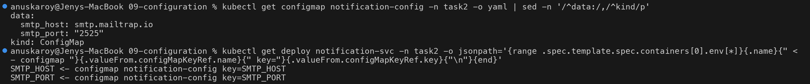

### Fix & verify

```text
$ diff broken-configmap.yaml fixed-configmap.yaml
<   smtp_host: smtp.mailtrap.io
<   smtp_port: "2525"
>   SMTP_HOST: smtp.mailtrap.io
>   SMTP_PORT: "2525"
$ kubectl apply -f fixed-configmap.yaml
configmap/notification-config configured
$ kubectl rollout status deployment/notification-svc -n task2 --timeout=90s
deployment "notification-svc" successfully rolled out
$ kubectl get pods -n task2 -l app=notification-svc
NAME                                READY   STATUS    RESTARTS   AGE
notification-svc-5d45df6f74-x7hr8   1/1     Running   0          27s
$ kubectl logs deploy/notification-svc -n task2
sending mail via smtp.mailtrap.io:2525
$ kubectl exec deploy/notification-svc -n task2 -- env | grep SMTP
SMTP_HOST=smtp.mailtrap.io
SMTP_PORT=2525
```

The Pod name (`...-x7hr8`) did not change. kubelet keeps retrying `CreateContainerConfigError`, so fixing the
ConfigMap was enough and no restart was needed.

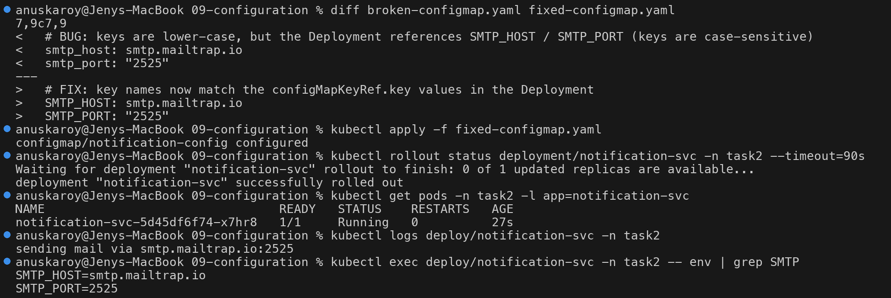

---

## Final state: everything fixed

```text
$ kubectl get pods -n task2 -o wide
NAME                                READY   STATUS    RESTARTS   AGE
frontend                            1/1     Running   0          9m51s
inventory-service                   1/1     Running   0          8m40s
landing-page                        1/1     Running   0          6m34s
metrics-exporter                    1/1     Running   0          47s
netshoot                            1/1     Running   0          5m45s
notification-svc-5d45df6f74-x7hr8   1/1     Running   0          35s
orders-76dc79b594-74wsr             1/1     Running   0          5m45s
orders-76dc79b594-h6cl8             1/1     Running   0          5m45s
payment-api                         1/1     Running   0          10m
report-generator-5b48c7b4bd-s6brk   1/1     Running   0          6m47s
storefront                          1/1     Running   0          3m58s
$ kubectl get pods -A --field-selector=status.phase!=Running
No resources found
```

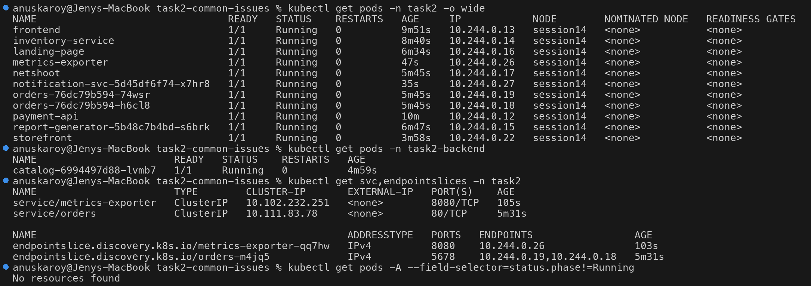

---

## Quick reference: status → first command → typical root cause

| Status / symptom | Look at first | Typical root causes |
| --- | --- | --- |
| `CrashLoopBackOff` | `logs` (+ `--previous`), `describe` → Exit Code | missing env/config, bad command, app bug, failing liveness probe, OOMKilled (137) |
| `ImagePullBackOff` / `ErrImagePull` | `describe` → Events | tag typo, repo doesn't exist, private repo without `imagePullSecrets`, wrong arch, registry/DNS down |
| `Pending` | `describe` → `FailedScheduling` | requests too large, nodeSelector/affinity, taints, unbound PVC |
| `ContainerCreating` (stuck) | `describe` → `FailedMount` / CNI errors | missing ConfigMap/Secret/PVC, volume attach errors, CNI problems |
| `CreateContainerConfigError` | `describe` → Events | missing ConfigMap/Secret **or key** |
| Running, `READY 0/1` | `describe` → `Unhealthy` events | readiness probe wrong path/port, dependency down |
| Service unreachable | `get endpointslices`, `describe svc` | selector mismatch, wrong `targetPort`, no ready Pods |
| `Could not resolve host` | `nslookup` from a Pod, `/etc/resolv.conf` | wrong name/namespace, CoreDNS down |
| `Connection refused` to Pod IP | `netstat -tln` inside the Pod | app bound to 127.0.0.1, wrong port, process not running |

## Notes from this run

- The upstream `09-service-dns-troubleshooting/dns-test-pod.yaml` uses `registry.k8s.io/e2e-test-images/dnsutils:1.3`,
  which **no longer exists** in the registry (`not found` when pulling). `registry.k8s.io/e2e-test-images/agnhost:2.53`
  ships `nslookup`, `dig`, `curl`, `wget` and `nc` (arm64 + amd64) and was used as the debug image here.
- The minikube node reports the full host CPU count (8) as allocatable even with `--cpus=2`, so the Pending
  scenario requests 16 CPUs to be certain no node fits.

## Cleanup

```bash
kubectl delete namespace task2 task2-backend
```
