# Session 14 - Task 3: Mini Project: "ShopEasy is down"

Executed on a **single-node Minikube v1.39.0** cluster (profile `session14`, docker driver, macOS arm64),
Kubernetes **v1.37.0**, containerd 2.3.4. Every screenshot is real terminal output.

## Problem statement

ShopEasy is a small two-tier shop running in namespace `shopeasy`:

```text
  user ──► Service storefront-web (NodePort 30080)
              │
              ▼
        storefront-web (nginx x2)          serves  /          (static page)
              │  location /api/  proxy_pass        /healthz   (probe)
              ▼                                    /api/...   (proxied)
        Service products-api :80
              │  targetPort
              ▼
        products-api (http-echo x2, :5678)  returns the product list as JSON
```

A new release was deployed (`broken/`) and **the shop is completely down**: users get no response at all.
The task is to find every fault, fix each one with the smallest correct change, and prove the shop works end
to end, without knowing in advance what is wrong.

| File | Purpose |
| --- | --- |
| `broken/namespace.yaml`, `broken/products-api.yaml`, `broken/storefront-web.yaml` | The faulty release (bugs are marked `# BUG n` in the YAML for review after the exercise) |
| `fixed/...` | The corrected release |
| `smoke-test.sh` | Calls `/`, `/healthz`, `/api/products` through the `storefront-web` Service from inside the cluster |
| `toolbox.yaml` | Long-lived debug Pod (`agnhost`: curl, nslookup, dig, nc) for the investigation |

## Summary of findings

| # | Layer | Symptom | Root cause | Fix |
| --- | --- | --- | --- | --- |
| 1 | web | `CrashLoopBackOff` | nginx `proxy_pass http://products-service`, but the Service is `products-api` → nginx refuses to start (`host not found in upstream`) | Correct the ConfigMap, recreate Pods (`subPath` mounts don't auto-update) |
| 2 | api | `ImagePullBackOff` | Image tag `hashicorp/http-echo:1.0.3` was never published | `kubectl set image ... :1.0` |
| 3 | api | `Running` but `READY 0/1`, rollout stuck | Readiness probe checks port **8080**; app listens on **5678** | Probe the named port `api` |
| 4 | api Service | `502 Bad Gateway`, EndpointSlice `PORTS <unset>` | Service `targetPort: http`, but the container port is named `api` | `targetPort: api` |

Each fix revealed the next problem. Fault 4 only became visible after faults 1–3 were fixed.

---

## Step 0: Deploy the broken release

```bash
kubectl apply -f broken/
sleep 45; kubectl get deploy,pods,svc -n shopeasy
```

```text
namespace/shopeasy created
deployment.apps/products-api created
service/products-api created
configmap/storefront-nginx created
deployment.apps/storefront-web created
service/storefront-web created

NAME                             READY   UP-TO-DATE   AVAILABLE   AGE
deployment.apps/products-api     0/2     2            0           50s
deployment.apps/storefront-web   0/2     2            0           50s

NAME                                  READY   STATUS             RESTARTS      AGE
pod/products-api-77f976db8c-gwkgh     0/1     ErrImagePull       0             51s
pod/products-api-77f976db8c-krdvc     0/1     ErrImagePull       0             51s
pod/storefront-web-6b9cc4f78b-fjlk7   0/1     CrashLoopBackOff   2 (31s ago)   51s
pod/storefront-web-6b9cc4f78b-h9hd6   0/1     Error              3 (33s ago)   50s
```

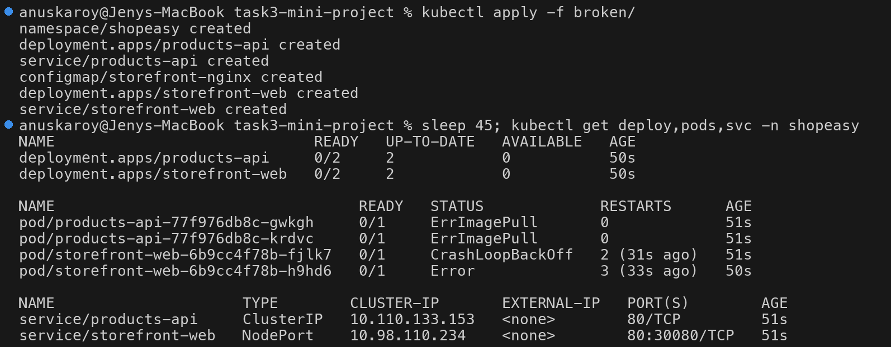

## Step 1: Confirm the user-facing symptom (BEFORE)

```bash
./smoke-test.sh
kubectl port-forward svc/storefront-web -n shopeasy 8080:80 & sleep 3; curl -sS --max-time 5 http://localhost:8080/api/products; kill %1
```

```text
GET /              -> HTTP 000
GET /healthz       -> HTTP 000
GET /api/products  -> HTTP 000
curl: (52) Empty reply from server
```

HTTP `000` = no HTTP response at all. Every path is down, including the static page, so the front door (web tier)
is broken, whatever else is.

> With the minikube **docker driver on macOS** the node IP (`192.168.58.2:30080`) is not reachable from the host
> (the curl timed out, exit code 28). Use `kubectl port-forward` or `minikube service storefront-web -n shopeasy`.

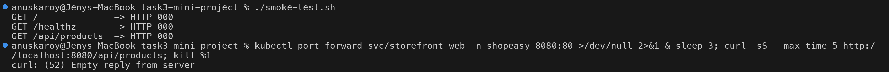

## Step 2: Triage: what is unhealthy and what do the events say?

```bash
kubectl get pods -n shopeasy
kubectl events -n shopeasy --types=Warning | tail -8
```

```text
NAME                              READY   STATUS             RESTARTS       AGE
products-api-77f976db8c-gwkgh     0/1     ImagePullBackOff   0              3m6s
products-api-77f976db8c-krdvc     0/1     ImagePullBackOff   0              3m6s
storefront-web-6b9cc4f78b-fjlk7   0/1     CrashLoopBackOff   4 (65s ago)    3m6s
storefront-web-6b9cc4f78b-h9hd6   0/1     CrashLoopBackOff   4 (101s ago)   3m5s

Warning   BackOff  Pod/storefront-web-...   Back-off restarting failed container nginx in pod ...
Warning   Failed   Pod/products-api-...     Failed to pull image "hashicorp/http-echo:1.0.3": rpc error: code = NotFound
                                            desc = ... docker.io/hashicorp/http-echo:1.0.3: not found
Warning   Failed   Pod/products-api-...     Error: ImagePullBackOff
```

Two independent failures. The web tier is what users hit first, so start there.

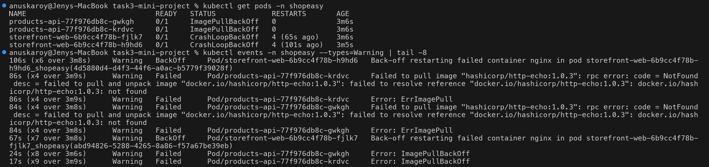

---

## Fault 1: web tier CrashLoopBackOff

### Investigation & root cause

```bash
kubectl logs deploy/storefront-web -n shopeasy --tail=2
kubectl get configmap storefront-nginx -n shopeasy -o jsonpath='{.data.default\.conf}' | grep -n proxy_pass
kubectl get svc -n shopeasy
kubectl exec toolbox -n shopeasy -- nslookup products-service | tail -2
kubectl exec toolbox -n shopeasy -- nslookup products-api | tail -3
```

```text
2026/10/07 16:18:14 [emerg] 1#1: host not found in upstream "products-service" in /etc/nginx/conf.d/default.conf:11
nginx: [emerg] host not found in upstream "products-service" in /etc/nginx/conf.d/default.conf:11
11:    proxy_pass http://products-service;   # BUG 3: Service is called "products-api"
NAME             TYPE        CLUSTER-IP       EXTERNAL-IP   PORT(S)        AGE
products-api     ClusterIP   10.110.133.153   <none>        80/TCP         15m
storefront-web   NodePort    10.98.110.234    <none>        80:30080/TCP   15m
** server can't find products-service: NXDOMAIN
Name:	products-api.shopeasy.svc.cluster.local
Address: 10.110.133.153
```

**Root cause:** nginx resolves every `proxy_pass` hostname **at startup**. `products-service` doesn't exist
(NXDOMAIN), so nginx exits with `[emerg]`, and kubelet restarts it in a loop. The real Service is `products-api`.

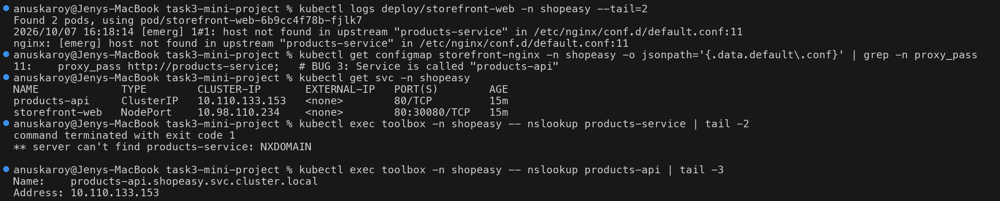

### Fix

```bash
diff broken/storefront-web.yaml fixed/storefront-web.yaml
kubectl apply -f fixed/storefront-web.yaml
kubectl delete pod -n shopeasy -l app=storefront-web --wait=false
```

```text
<         proxy_pass http://products-service;   # BUG 3: Service is called "products-api"
>         proxy_pass http://products-api;       # FIX 3: real Service name
configmap/storefront-nginx configured
deployment.apps/storefront-web unchanged
service/storefront-web unchanged
NAME                              READY   STATUS    RESTARTS   AGE
storefront-web-6b9cc4f78b-mhwzt   1/1     Running   0          24s
storefront-web-6b9cc4f78b-wcl9l   1/1     Running   0          27s
10.244.0.1 - - [07/Oct/2026:16:21:15 +0000] "GET /healthz HTTP/1.1" 200 3 "-" "kube-probe/1.37" "-"
```

> **Why the Pods had to be recreated:** the config file is mounted with `subPath`, and **`subPath` mounts never
> receive ConfigMap updates**. The Deployment template didn't change (`unchanged`), so nothing would roll out by
> itself. Deleting the Pods (or `kubectl rollout restart deployment/storefront-web`) makes them mount the new
> version.

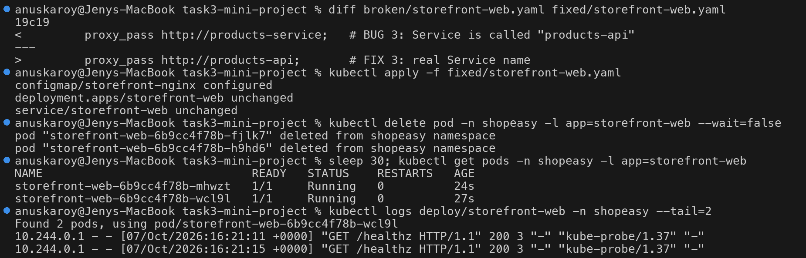

### Re-test: progress, and a new symptom

```text
$ ./smoke-test.sh
GET /              -> HTTP 200  <h1>ShopEasy</h1><p>Products are loaded from /api/products</p>
GET /healthz       -> HTTP 200  ok
GET /api/products  -> HTTP 502  <html><head><title>502 Bad Gateway</title>...
$ kubectl logs deploy/storefront-web -n shopeasy | grep -m2 'api/products'
[error] 30#30: *8 connect() failed (111: Connection refused) while connecting to upstream, client: 10.244.0.43,
        request: "GET /api/products HTTP/1.1", upstream: "http://10.110.133.153:80/api/products"
```

The page loads, but the API returns **502**: nginx reached the `products-api` ClusterIP and the connection was
refused, because the Service has no backend to send it to.

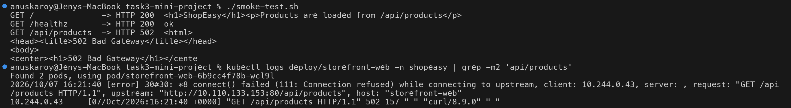

---

## Fault 2: API ImagePullBackOff

```text
$ kubectl describe pod products-api-77f976db8c-gwkgh -n shopeasy | grep -E '^    Image:|Failed to pull'
    Image:         hashicorp/http-echo:1.0.3
  Warning  Failed  10m (x6 over 17m)  kubelet  Failed to pull image "hashicorp/http-echo:1.0.3": rpc error: code = NotFound ...
$ curl -s 'https://hub.docker.com/v2/repositories/hashicorp/http-echo/tags?page_size=20' | python3 -c '...'
['latest', '1.0', '1.0.0', 'alpine', '0.2.3', '0.2.1', '0.2.0', '0.1.3', '0.1.2', '0.1.1', '0.1.0']
```

**Root cause:** tag `1.0.3` was never published (the registry lists only `1.0` / `1.0.0` in the 1.x line).

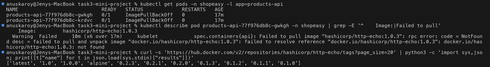

```text
$ kubectl set image deployment/products-api api=hashicorp/http-echo:1.0 -n shopeasy
deployment.apps/products-api image updated
$ sleep 30; kubectl get pods -n shopeasy -l app=products-api
NAME                            READY   STATUS             RESTARTS   AGE
products-api-7794958cf8-nrlqn   0/1     Running            0          31s
products-api-77f976db8c-gwkgh   0/1     ImagePullBackOff   0          18m
products-api-77f976db8c-krdvc   0/1     ImagePullBackOff   0          18m
$ kubectl rollout status deployment/products-api -n shopeasy --timeout=10s
Waiting for deployment "products-api" rollout to finish: 1 out of 2 new replicas have been updated...
error: timed out waiting for the condition
```

The image now pulls and the container is **Running, but `READY 0/1`**. The rolling update is **stuck**: the
Deployment won't replace more old Pods until the new one becomes Ready.

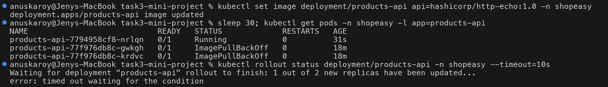

---

## Fault 3: API readiness probe on the wrong port

```text
$ kubectl describe pod products-api-7794958cf8-nrlqn -n shopeasy | grep -E 'Ports?:|Readiness:|Unhealthy'
    Port:          5678/TCP (api)
    Readiness:    tcp-socket :8080 delay=0s timeout=1s period=5s successThreshold=1 failureThreshold=2
  Warning  Unhealthy  5s (x8 over 36s)  kubelet  Readiness probe failed: dial tcp 10.244.0.44:8080: connect: connection refused
$ kubectl exec toolbox -n shopeasy -- nc -zv -w 2 10.244.0.44 8080
nc: connect to 10.244.0.44 port 8080 (tcp) failed: Connection refused
$ kubectl exec toolbox -n shopeasy -- nc -zv -w 2 10.244.0.44 5678
Connection to 10.244.0.44 5678 port [tcp/*] succeeded!
```

**Root cause:** the probe checks `:8080`, but the app listens on `:5678`. A Pod that never passes readiness
never gets traffic and blocks the rollout.

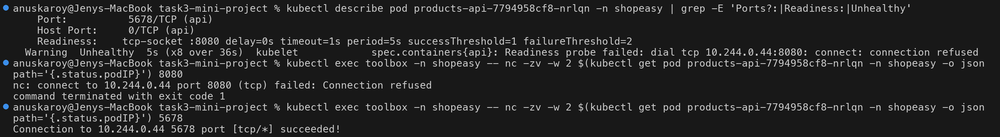

```bash
kubectl patch deployment products-api -n shopeasy --type=json \
  -p '[{"op":"replace","path":"/spec/template/spec/containers/0/readinessProbe/tcpSocket/port","value":"api"}]'
kubectl rollout status deployment/products-api -n shopeasy --timeout=120s
```

```text
deployment "products-api" successfully rolled out
NAME                            READY   STATUS        RESTARTS   AGE
products-api-67cf766d85-k7xm2   1/1     Running       0          10s
products-api-67cf766d85-sv9p2   1/1     Running       0          27s
products-api-7794958cf8-nrlqn   0/1     Terminating   0          91s
$ ./smoke-test.sh
GET /              -> HTTP 200  <h1>ShopEasy</h1>...
GET /healthz       -> HTTP 200  ok
GET /api/products  -> HTTP 502  <html><head><title>502 Bad Gateway</title>...
```

Both API Pods are `1/1 Ready`, yet the API **still returns 502**. Something is still wrong between the
Service and the Pods.

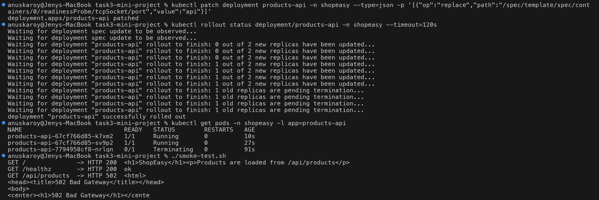

---

## Fault 4: Service `targetPort` refers to a port name that doesn't exist

```text
$ kubectl get endpointslices -n shopeasy -l kubernetes.io/service-name=products-api
NAME                 ADDRESSTYPE   PORTS     ENDPOINTS                 AGE
products-api-stz4l   IPv4          <unset>   10.244.0.45,10.244.0.46   19m
$ kubectl describe svc products-api -n shopeasy | grep -E 'Selector|TargetPort|Endpoints'
Selector:                 app=products-api
TargetPort:               http/TCP
Endpoints:                10.244.0.45,10.244.0.46
$ kubectl get deploy products-api -n shopeasy -o jsonpath='{.spec.template.spec.containers[0].ports}{"\n"}'
[{"containerPort":5678,"name":"api","protocol":"TCP"}]
```

The selector is right (both Pod IPs are listed), but **`PORTS` is `<unset>`**. The Service uses a **named**
`targetPort: http`, and kube-proxy resolves the name against each Pod's container ports. The container
port is named `api`, so there is no port to forward to.

> This is easy to miss: `kubectl get svc` looks fine, and `describe svc` shows endpoint IPs. Only the
> EndpointSlice's `PORTS` column (or `-o yaml`) reveals it.

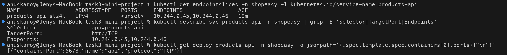

### Fix: converge on the corrected manifests

```bash
diff broken/products-api.yaml fixed/products-api.yaml
kubectl apply -f fixed/
kubectl diff -f fixed/ && echo 'no drift: cluster matches fixed/ manifests'
kubectl get endpointslices -n shopeasy -l kubernetes.io/service-name=products-api
```

```text
<           image: hashicorp/http-echo:1.0.3   # BUG 1: tag 1.0.3 was never published
>           image: hashicorp/http-echo:1.0     # FIX 1: published tag
<               port: 8080                  # BUG 2: app listens on 5678 -> probe always fails
>               port: api                   # FIX 2: probe the real port (named "api" = 5678)
<       targetPort: http                 # BUG 4: no container port is named "http" (it is "api")
>       targetPort: api                  # FIX 4: matches the container port name
namespace/shopeasy unchanged
deployment.apps/products-api configured
service/products-api configured
configmap/storefront-nginx unchanged
deployment.apps/storefront-web unchanged
service/storefront-web unchanged
no drift: cluster matches fixed/ manifests
NAME                 ADDRESSTYPE   PORTS   ENDPOINTS                 AGE
products-api-stz4l   IPv4          5678    10.244.0.46,10.244.0.45   19m
```

The image and probe were hot-fixed with `kubectl set image` / `kubectl patch` during the incident. Applying
`fixed/` puts those fixes into the manifests too, and `kubectl diff` returning nothing proves the live cluster
and the manifests match. Without that, the next `kubectl apply -f broken/` would bring the bugs back.

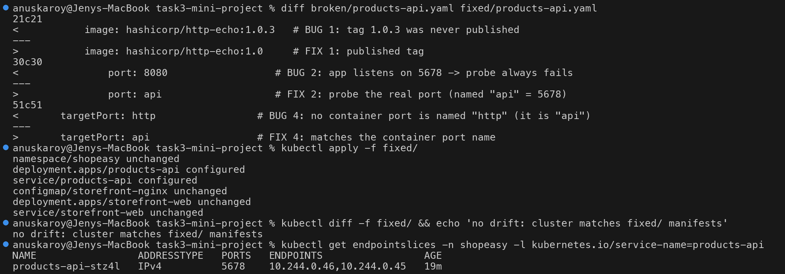

---

## Verification (AFTER)

```bash
kubectl get deploy,pods,svc -n shopeasy
./smoke-test.sh
kubectl port-forward svc/storefront-web -n shopeasy 8080:80 & sleep 3; curl -s http://localhost:8080/api/products; kill %1
kubectl events -n shopeasy --types=Warning --for deployment/products-api
```

```text
NAME                             READY   UP-TO-DATE   AVAILABLE
deployment.apps/products-api     2/2     2            2
deployment.apps/storefront-web   2/2     2            2

GET /              -> HTTP 200  <h1>ShopEasy</h1><p>Products are loaded from /api/products</p>
GET /healthz       -> HTTP 200  ok
GET /api/products  -> HTTP 200  {"products":["mechanical-keyboard","wireless-mouse","4k-monitor"],"served_by":"products-api"}
{"products":["mechanical-keyboard","wireless-mouse","4k-monitor"],"served_by":"products-api"}
No events found in shopeasy namespace.
```

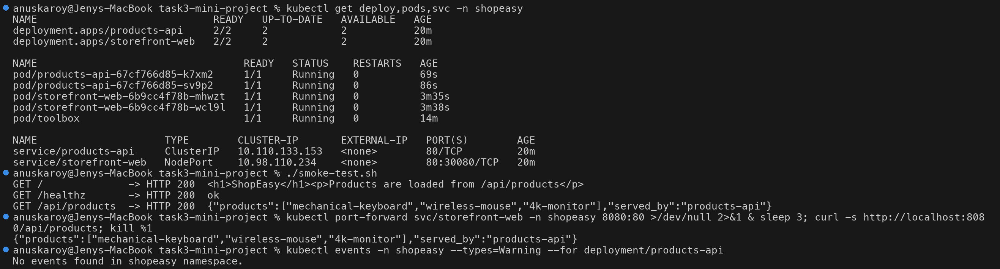

## Before / after

| Check | Before | After |
| --- | --- | --- |
| `storefront-web` Pods | `0/1 CrashLoopBackOff` | `1/1 Running`, 0 restarts |
| `products-api` Pods | `0/1 ImagePullBackOff` | `1/1 Running`, 0 restarts |
| `products-api` EndpointSlice ports | `<unset>` | `5678` |
| `GET /` | `000` (no response) | `200` |
| `GET /api/products` | `000` (no response) | `200` + JSON |

## Lessons learned

1. **Fix the layer users hit first, then re-test after every change.** Each fix here changed the symptom:
   `000` → `502` → still `502` → `200`.
2. **"Running" is not "working".** Fault 3 had Running Pods that never received traffic, and fault 4 had Ready
   Pods behind a Service that couldn't route to them.
3. **Look one level deeper than `get svc`.** EndpointSlices show both *which* Pods and *which port*.
4. **ConfigMaps mounted with `subPath` don't update.** Restart the Pods (or use `rollout restart`) after
   changing them.
5. **Commit the hot-fixes back to the manifests** and confirm with `kubectl diff`.

## Cleanup

```bash
kubectl delete namespace shopeasy
```
