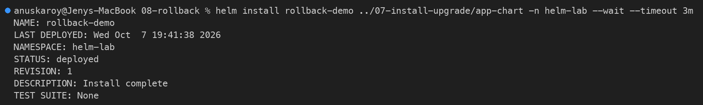
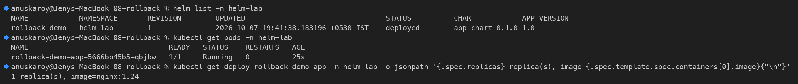
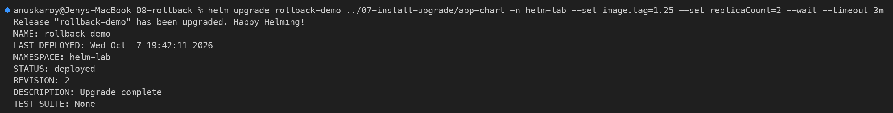
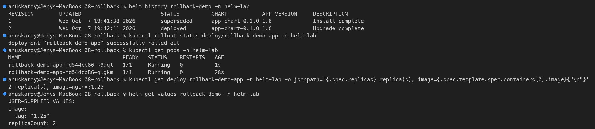
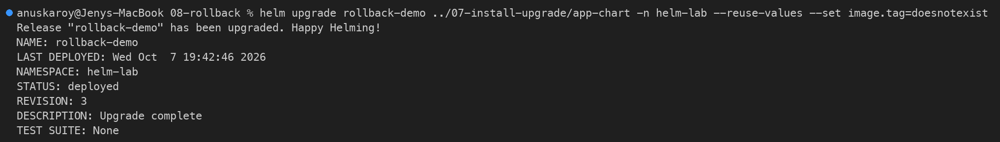
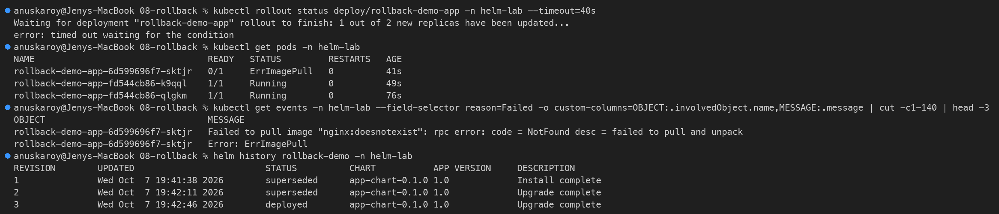
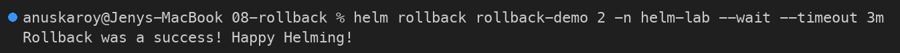
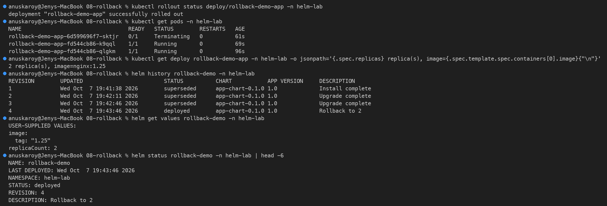
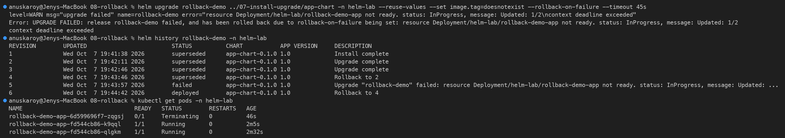
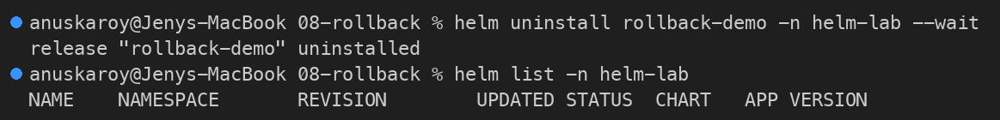

# Rollback

```bash
helm rollback my-app 1
```

If an upgrade breaks your application, rollback returns you to a previous working revision in seconds.

---

## 1. Why Rollback Matters

```text
Revision 1: Working (1 replica, nginx:1.24)
Revision 2: Broken  (bad image tag: nginx:doesnotexist)
```

Without Helm rollback, you must manually fix YAML and re-apply.  
With Helm rollback, you type one command.

---

## 2. Setup: Install the Chart

Use the `app-chart` from topic 07.

```bash
helm install rollback-demo ./app-chart
```

Expected output:

```text
NAME: rollback-demo
STATUS: deployed
REVISION: 1
```

---

## 3. Upgrade to a Broken Version

```bash
helm upgrade rollback-demo ./app-chart --set image.tag=doesnotexist
```

Check the pods:

```bash
kubectl get pods
```

Expected output:

```text
NAME                         READY   STATUS             RESTARTS
rollback-demo-app-xxxx       0/1     ImagePullBackOff   0
```

The pod fails because the image tag does not exist.

---

## 4. Check Release History

```bash
helm history rollback-demo
```

Expected output:

```text
REVISION   STATUS      DESCRIPTION
1          superseded  Install complete
2          deployed    Upgrade complete
```

*(Revision 2 is the broken one even though the pod is failing.)*

---

## 5. Rollback to Revision 1

```bash
helm rollback rollback-demo 1
```

Expected output:

```text
Rollback was a success! Happy Helming!
```

---

## 6. Check Pods After Rollback

```bash
kubectl get pods
```

Expected output:

```text
NAME                         READY   STATUS    RESTARTS
rollback-demo-app-yyyy       1/1     Running   0
```

The pod is healthy again. Helm re-deployed revision 1's configuration.

---

## 7. History After Rollback

```bash
helm history rollback-demo
```

Expected output:

```text
REVISION   STATUS      DESCRIPTION
1          superseded  Install complete
2          superseded  Upgrade complete
3          deployed    Rollback to 1
```

Rollback creates a new revision (3). It does not delete the history.

---

## 8. Use --atomic for Auto Rollback (Helm 3) / --rollback-on-failure (Helm 4)

During upgrade, use `--atomic` to auto-rollback on failure:

```bash
helm upgrade rollback-demo ./app-chart \
  --set image.tag=doesnotexist \
  --atomic \
  --timeout 60s
```

If pods do not become ready within 60 seconds, Helm automatically rolls back.

---

## Clean Up

```bash
helm uninstall rollback-demo
```

---

## Key Learning

```text
helm history <release>     = list all revisions
helm rollback <release> N  = go back to revision N
--atomic                   = auto rollback if upgrade fails
```

---

## Task 2: Complete Rollback Workflow (Hands-on)

These commands were run on a real cluster: Helm v4.3.0, minikube profile `session13`, namespace `helm-lab`. The chart is [`../07-install-upgrade/app-chart`](../07-install-upgrade/app-chart).

```text
Install (rev 1: nginx:1.24 x1)
   ↓
Upgrade (rev 2: nginx:1.25 x2)  →  Verify ✅
   ↓
Upgrade again (rev 3: nginx:doesnotexist)  →  Verify ❌ ErrImagePull
   ↓
Rollback to rev 2 (creates rev 4)  →  Verify ✅ nginx:1.25 x2
```

### Step 1: Install

```bash
helm install rollback-demo ../07-install-upgrade/app-chart -n helm-lab --wait --timeout 3m
```

```text
NAME: rollback-demo
LAST DEPLOYED: Wed Oct  7 19:41:38 2026
NAMESPACE: helm-lab
STATUS: deployed
REVISION: 1
DESCRIPTION: Install complete
TEST SUITE: None
```



**Verify:** 1 pod running `nginx:1.24`.

```bash
helm list -n helm-lab
kubectl get pods -n helm-lab
kubectl get deploy rollback-demo-app -n helm-lab -o jsonpath='{.spec.replicas} replica(s), image={.spec.template.spec.containers[0].image}{"\n"}'
```

```text
NAME            NAMESPACE       REVISION        UPDATED                                 STATUS          CHART           APP VERSION
rollback-demo   helm-lab        1               2026-10-07 19:41:38.183196 +0530 IST    deployed        app-chart-0.1.0 1.0
NAME                                 READY   STATUS    RESTARTS   AGE
rollback-demo-app-5666bb45b5-qbjbw   1/1     Running   0          25s
1 replica(s), image=nginx:1.24
```



### Step 2: Upgrade (to a good version)

```bash
helm upgrade rollback-demo ../07-install-upgrade/app-chart -n helm-lab --set image.tag=1.25 --set replicaCount=2 --wait --timeout 3m
```

```text
Release "rollback-demo" has been upgraded. Happy Helming!
NAME: rollback-demo
LAST DEPLOYED: Wed Oct  7 19:42:11 2026
NAMESPACE: helm-lab
STATUS: deployed
REVISION: 2
DESCRIPTION: Upgrade complete
TEST SUITE: None
```



### Step 3: Verify the upgrade

```bash
helm history rollback-demo -n helm-lab
kubectl rollout status deploy/rollback-demo-app -n helm-lab
kubectl get pods -n helm-lab
kubectl get deploy rollback-demo-app -n helm-lab -o jsonpath='...'
helm get values rollback-demo -n helm-lab
```

```text
REVISION        UPDATED                         STATUS          CHART           APP VERSION     DESCRIPTION
1               Wed Oct  7 19:41:38 2026        superseded      app-chart-0.1.0 1.0             Install complete
2               Wed Oct  7 19:42:11 2026        deployed        app-chart-0.1.0 1.0             Upgrade complete
deployment "rollback-demo-app" successfully rolled out
NAME                                READY   STATUS    RESTARTS   AGE
rollback-demo-app-fd544cb86-k9qql   1/1     Running   0          1s
rollback-demo-app-fd544cb86-qlgkm   1/1     Running   0          28s
2 replica(s), image=nginx:1.25
USER-SUPPLIED VALUES:
image:
  tag: "1.25"
replicaCount: 2
```

✅ Revision 2 is healthy: 2 replicas on `nginx:1.25`.



### Step 4: Upgrade again (a bad release)

`--reuse-values` keeps `replicaCount=2` from revision 2 and changes only the image tag, to one that does not exist.

```bash
helm upgrade rollback-demo ../07-install-upgrade/app-chart -n helm-lab --reuse-values --set image.tag=doesnotexist
```

```text
Release "rollback-demo" has been upgraded. Happy Helming!
NAME: rollback-demo
LAST DEPLOYED: Wed Oct  7 19:42:46 2026
NAMESPACE: helm-lab
STATUS: deployed
REVISION: 3
DESCRIPTION: Upgrade complete
TEST SUITE: None
```



Without `--wait`, Helm only applies the manifests and reports `deployed`, so it does **not** know the pods are broken. Always verify.

### Step 5: Verify the second upgrade (failure detected)

```bash
kubectl rollout status deploy/rollback-demo-app -n helm-lab --timeout=40s
kubectl get pods -n helm-lab
kubectl get events -n helm-lab --field-selector reason=Failed -o custom-columns=OBJECT:.involvedObject.name,MESSAGE:.message | cut -c1-140 | head -3
helm history rollback-demo -n helm-lab
```

```text
Waiting for deployment "rollback-demo-app" rollout to finish: 1 out of 2 new replicas have been updated...
error: timed out waiting for the condition
NAME                                 READY   STATUS         RESTARTS   AGE
rollback-demo-app-6d599696f7-sktjr   0/1     ErrImagePull   0          41s
rollback-demo-app-fd544cb86-k9qql    1/1     Running        0          49s
rollback-demo-app-fd544cb86-qlgkm    1/1     Running        0          76s
OBJECT                               MESSAGE
rollback-demo-app-6d599696f7-sktjr   Failed to pull image "nginx:doesnotexist": rpc error: code = NotFound desc = failed to pull and unpack
rollback-demo-app-6d599696f7-sktjr   Error: ErrImagePull
REVISION        UPDATED                         STATUS          CHART           APP VERSION     DESCRIPTION
1               Wed Oct  7 19:41:38 2026        superseded      app-chart-0.1.0 1.0             Install complete
2               Wed Oct  7 19:42:11 2026        superseded      app-chart-0.1.0 1.0             Upgrade complete
3               Wed Oct  7 19:42:46 2026        deployed        app-chart-0.1.0 1.0             Upgrade complete
```

❌ The new pod is stuck in `ErrImagePull`. The rolling-update strategy keeps the 2 old (revision 2) pods serving traffic, so the rollout never finishes.



### Step 6: Rollback to revision 2

```bash
helm rollback rollback-demo 2 -n helm-lab --wait --timeout 3m
```

```text
Rollback was a success! Happy Helming!
```



### Step 7: Verify the rollback

```bash
kubectl rollout status deploy/rollback-demo-app -n helm-lab
kubectl get pods -n helm-lab
kubectl get deploy rollback-demo-app -n helm-lab -o jsonpath='...'
helm history rollback-demo -n helm-lab
helm get values rollback-demo -n helm-lab
helm status rollback-demo -n helm-lab | head -6
```

```text
deployment "rollback-demo-app" successfully rolled out
NAME                                 READY   STATUS        RESTARTS   AGE
rollback-demo-app-6d599696f7-sktjr   0/1     Terminating   0          61s
rollback-demo-app-fd544cb86-k9qql    1/1     Running       0          69s
rollback-demo-app-fd544cb86-qlgkm    1/1     Running       0          96s
2 replica(s), image=nginx:1.25
REVISION        UPDATED                         STATUS          CHART           APP VERSION     DESCRIPTION
1               Wed Oct  7 19:41:38 2026        superseded      app-chart-0.1.0 1.0             Install complete
2               Wed Oct  7 19:42:11 2026        superseded      app-chart-0.1.0 1.0             Upgrade complete
3               Wed Oct  7 19:42:46 2026        superseded      app-chart-0.1.0 1.0             Upgrade complete
4               Wed Oct  7 19:43:46 2026        deployed        app-chart-0.1.0 1.0             Rollback to 2
USER-SUPPLIED VALUES:
image:
  tag: "1.25"
replicaCount: 2
NAME: rollback-demo
LAST DEPLOYED: Wed Oct  7 19:43:46 2026
NAMESPACE: helm-lab
STATUS: deployed
REVISION: 4
DESCRIPTION: Rollback to 2
```

✅ The broken pod is terminating and the revision 2 pods (same ReplicaSet `fd544cb86`) are serving. The rollback did not overwrite history: it was recorded as revision 4 ("Rollback to 2").



### Bonus: Automatic rollback with `--rollback-on-failure`

In Helm 4, `--atomic` is renamed to `--rollback-on-failure`. It implies `--wait`. If the resources are not ready before `--timeout`, Helm marks the upgrade `failed` and rolls back automatically.

```bash
helm upgrade rollback-demo ../07-install-upgrade/app-chart -n helm-lab --reuse-values --set image.tag=doesnotexist --rollback-on-failure --timeout 45s
helm history rollback-demo -n helm-lab
```

```text
level=WARN msg="upgrade failed" name=rollback-demo error="resource Deployment/helm-lab/rollback-demo-app not ready. status: InProgress, message: Updated: 1/2\ncontext deadline exceeded"
Error: UPGRADE FAILED: release rollback-demo failed, and has been rolled back due to rollback-on-failure being set: resource Deployment/helm-lab/rollback-demo-app not ready. status: InProgress, message: Updated: 1/2
context deadline exceeded
REVISION  ...  STATUS          DESCRIPTION
...
4         ...  superseded      Rollback to 2
5         ...  failed          Upgrade "rollback-demo" failed: resource Deployment/helm-lab/rollback-demo-app not ready. ...
6         ...  deployed        Rollback to 4
```



### Clean up

```bash
helm uninstall rollback-demo -n helm-lab --wait
helm list -n helm-lab
```

```text
release "rollback-demo" uninstalled
NAME    NAMESPACE       REVISION        UPDATED STATUS  CHART   APP VERSION
```



### Observations

```text
1. helm upgrade without --wait reports "deployed" even when pods are failing.
   Verify with kubectl rollout status, or use --wait / --rollback-on-failure.
2. A rollback re-applies the stored manifest of the target revision and is
   recorded as a NEW revision (4 = "Rollback to 2"). History is never rewritten.
3. Rolling updates kept the old healthy pods alive during the bad upgrade, so
   the app stayed available the whole time.
4. --reuse-values carries over earlier --set values. Without it, an upgrade
   starts again from the chart's values.yaml.
```

---

## Reference

* **Helm rollback:** https://helm.sh/docs/helm/helm_rollback/
