# Task 1: Helm Commands (Hands-on)

Every command below was run against a real cluster. The output and screenshot for each one come from that run.

```text
Helm version : v4.3.0 (installed with `brew install helm`)
Cluster      : minikube profile "session13" (Kubernetes v1.37.0, 1 node)
Namespace    : helm-lab (dedicated namespace for these labs)
Chart        : ./web-chart (generated with `helm create`)
Release      : web
```

> **Helm 4 note:** Helm 4 removes `helm status --show-resources`, because `helm status` now always lists resources. It also renames `--atomic` to `--rollback-on-failure` (see [08-rollback](../08-rollback/README.md)).

| # | Command | Purpose |
|---|---------|---------|
| 1 | [`helm repo`](#1-helm-repo) | Manage chart repositories |
| 2 | [`helm search`](#2-helm-search) | Find charts in repos / Artifact Hub |
| 3 | [`helm create`](#3-helm-create) | Scaffold a new chart |
| 4 | [`helm install`](#4-helm-install) | Deploy a chart as a release |
| 5 | [`helm list`](#5-helm-list) | List releases |
| 6 | [`helm status`](#6-helm-status) | Show the state of a release |
| 7 | [`helm get`](#7-helm-get) | Get the details stored for a release |
| 8 | [`helm upgrade`](#8-helm-upgrade) | Change a release (new revision) |
| 9 | [`helm history`](#9-helm-history) | List revisions of a release |
| 10 | [`helm rollback`](#10-helm-rollback) | Go back to an earlier revision |
| 11 | [`helm uninstall`](#11-helm-uninstall) | Delete a release |

---

## 0. helm version

```bash
helm version
```

```text
version.BuildInfo{Version:"v4.3.0", GitCommit:"bec5b06ed841fe5269972d864d5177944fd5970f", GitTreeState:"clean", GoVersion:"go1.27.1", KubeClientVersion:"v1.37"}
```

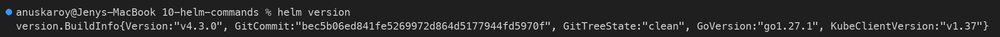

---

## 1. helm repo

**What it does:** A Helm repository is an HTTP server that hosts an `index.yaml` and packaged charts (`.tgz`).
- `helm repo add` saves a name and URL in your local config.
- `helm repo update` downloads the latest index from each repo.
- `helm repo list` shows the configured repos.
- `helm repo remove` deletes one.

```bash
helm repo add bitnami https://charts.bitnami.com/bitnami
helm repo add ingress-nginx https://kubernetes.github.io/ingress-nginx
helm repo update
helm repo list
```

```text
"bitnami" has been added to your repositories
"ingress-nginx" has been added to your repositories
Hang tight while we grab the latest from your chart repositories...
...Successfully got an update from the "ingress-nginx" chart repository
...Successfully got an update from the "bitnami" chart repository
Update Complete. ⎈Happy Helming!⎈
NAME            URL
bitnami         https://charts.bitnami.com/bitnami
ingress-nginx   https://kubernetes.github.io/ingress-nginx
```

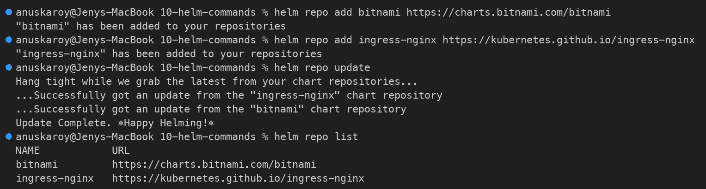

---

## 2. helm search

**What it does:**
- `helm search repo <keyword>` searches the repos you have added, using the local cached index (so run `helm repo update` first).
- `--versions` lists every chart version, not only the latest.
- `helm search hub <keyword>` searches the public **Artifact Hub**, which covers thousands of repos you have not added.

**CHART VERSION vs APP VERSION:** the chart version is the version of the packaging. The app version is the version of the software inside it.

```bash
helm search repo nginx
helm search repo bitnami/nginx --versions | head -6
```

```text
NAME                                    CHART VERSION   APP VERSION     DESCRIPTION
bitnami/nginx                           25.2.1          1.31.6          NGINX Open Source is a web server that can be a...
bitnami/nginx-ingress-controller        12.0.7          1.13.1          NGINX Ingress Controller is an Ingress controll...
bitnami/nginx-intel                     2.1.15          0.4.9           DEPRECATED NGINX Open Source for Intel is a lig...
ingress-nginx/ingress-nginx             4.15.1          1.15.1          Ingress controller for Kubernetes using NGINX a...

NAME                                    CHART VERSION   APP VERSION     DESCRIPTION
bitnami/nginx                           25.2.1          1.31.6          NGINX Open Source is a web server that can be a...
bitnami/nginx                           25.2.0          1.31.6          NGINX Open Source is a web server that can be a...
bitnami/nginx                           25.1.15         1.31.6          NGINX Open Source is a web server that can be a...
bitnami/nginx                           25.1.14         1.31.6          NGINX Open Source is a web server that can be a...
bitnami/nginx                           25.1.13         1.31.6          NGINX Open Source is a web server that can be a...
```

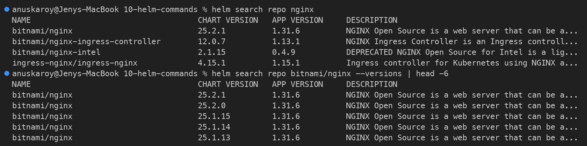

```bash
helm search hub prometheus --max-col-width 60 | head -8
```

```text
URL                                                             CHART VERSION   APP VERSION   DESCRIPTION
https://artifacthub.io/packages/helm/prometheus-community...    29.35.0         v3.15.0       Prometheus is a monitoring system and time series database.
https://artifacthub.io/packages/helm/quench-prometheus/pr...    0.0.20          3.15.0        Metrics collection, storage, and alerting system that scr...
...
```

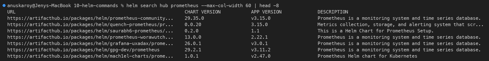

---

## 3. helm create

**What it does:** Generates a complete starter chart. It includes:
- a Deployment, Service, ServiceAccount, Ingress, HTTPRoute and HPA
- `_helpers.tpl`
- `NOTES.txt`
- a test pod

The default image is `nginx`, and its tag comes from `appVersion`. The generated chart is kept in [`web-chart/`](web-chart/).

```bash
helm create web-chart
find web-chart -type f | sort
grep -E '^(name|version|appVersion)' web-chart/Chart.yaml
```

```text
Creating web-chart
web-chart/.helmignore
web-chart/Chart.yaml
web-chart/templates/NOTES.txt
web-chart/templates/_helpers.tpl
web-chart/templates/deployment.yaml
web-chart/templates/hpa.yaml
web-chart/templates/httproute.yaml
web-chart/templates/ingress.yaml
web-chart/templates/service.yaml
web-chart/templates/serviceaccount.yaml
web-chart/templates/tests/test-connection.yaml
web-chart/values.yaml
name: web-chart
version: 0.1.0
appVersion: "1.16.0"
```

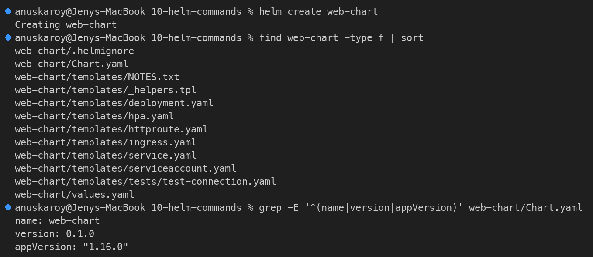

Before installing, it is good practice to validate the chart (`helm lint`) and render it locally (`helm template`). Neither command touches the cluster.

```bash
helm lint web-chart
helm template demo web-chart --set replicaCount=2 | grep -E '^(kind|  name|  replicas)'
```

```text
==> Linting web-chart
[INFO] Chart.yaml: icon is recommended

1 chart(s) linted, 0 chart(s) failed
kind: ServiceAccount
  name: demo-web-chart
kind: Service
  name: demo-web-chart
kind: Deployment
  name: demo-web-chart
  replicas: 2
kind: Pod
  name: "demo-web-chart-test-connection"
```

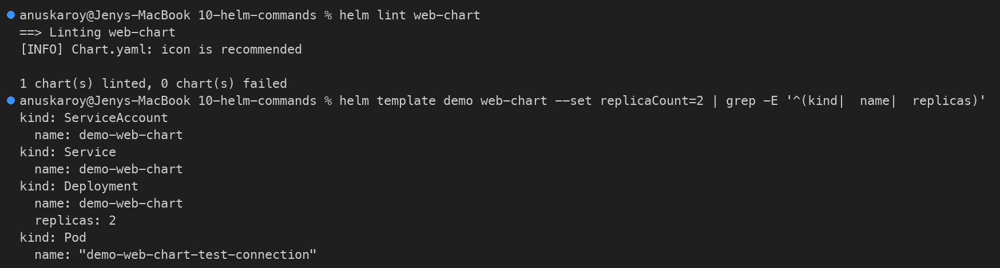

---

## 4. helm install

**What it does:** Renders the templates with the values, applies the result to the cluster, and records it as **revision 1** of a named release.
- Helm stores the release in a Secret named `sh.helm.release.v1.<release>.v<revision>`.
- `--wait` blocks until the resources are ready.
- `NOTES.txt` is printed at the end.

```bash
helm install web web-chart -n helm-lab --wait --timeout 3m
kubectl get all -n helm-lab
```

```text
NAME: web
LAST DEPLOYED: Wed Oct  7 19:40:12 2026
NAMESPACE: helm-lab
STATUS: deployed
REVISION: 1
DESCRIPTION: Install complete
NOTES:
1. Get the application URL by running these commands:
  export POD_NAME=$(kubectl get pods --namespace helm-lab -l "app.kubernetes.io/name=web-chart,app.kubernetes.io/instance=web" -o jsonpath="{.items[0].metadata.name}")
  ...
NAME                                 READY   STATUS    RESTARTS   AGE
pod/web-web-chart-5f57d5d67b-slwj8   1/1     Running   0          13s

NAME                    TYPE        CLUSTER-IP      EXTERNAL-IP   PORT(S)   AGE
service/web-web-chart   ClusterIP   10.107.128.28   <none>        80/TCP    13s

NAME                            READY   UP-TO-DATE   AVAILABLE   AGE
deployment.apps/web-web-chart   1/1     1            1           13s

NAME                                       DESIRED   CURRENT   READY   AGE
replicaset.apps/web-web-chart-5f57d5d67b   1         1         1       13s
```

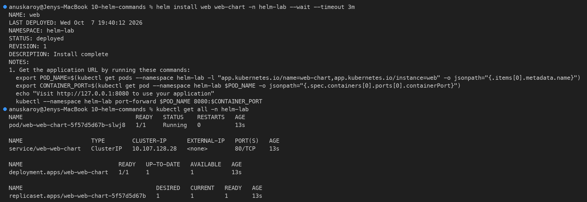

---

## 5. helm list

**What it does:** Lists the releases in the current namespace (`-n`), or in all namespaces with `-A`. It shows each release's revision, status, chart version and app version.

```bash
helm list -n helm-lab
helm list -A
```

```text
NAME    NAMESPACE       REVISION        UPDATED                                 STATUS          CHART           APP VERSION
web     helm-lab        1               2026-10-07 19:40:12.977879 +0530 IST    deployed        web-chart-0.1.0 1.16.0
```

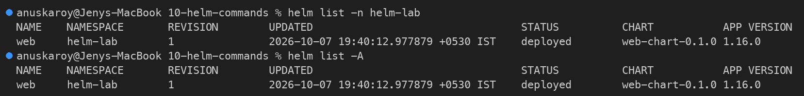

---

## 6. helm status

**What it does:** Shows the state of one release: last deploy time, namespace, status, revision, the Kubernetes resources it owns (with live pod status), and the NOTES. Add `--revision N` to see an older revision, or `-o yaml|json` for machine-readable output.

```bash
helm status web -n helm-lab
```

```text
NAME: web
LAST DEPLOYED: Wed Oct  7 19:40:12 2026
NAMESPACE: helm-lab
STATUS: deployed
REVISION: 1
DESCRIPTION: Install complete
RESOURCES:
==> v1/ServiceAccount
NAME            AGE
web-web-chart   29s

==> v1/Service
NAME            TYPE        CLUSTER-IP      EXTERNAL-IP   PORT(S)   AGE
web-web-chart   ClusterIP   10.107.128.28   <none>        80/TCP    29s

==> v1/Deployment
NAME            READY   UP-TO-DATE   AVAILABLE   AGE
web-web-chart   1/1     1            1           29s

==> v1/Pod(related)
NAME                             READY   STATUS    RESTARTS   AGE
web-web-chart-5f57d5d67b-slwj8   1/1     Running   0          29s

NOTES:
...
```

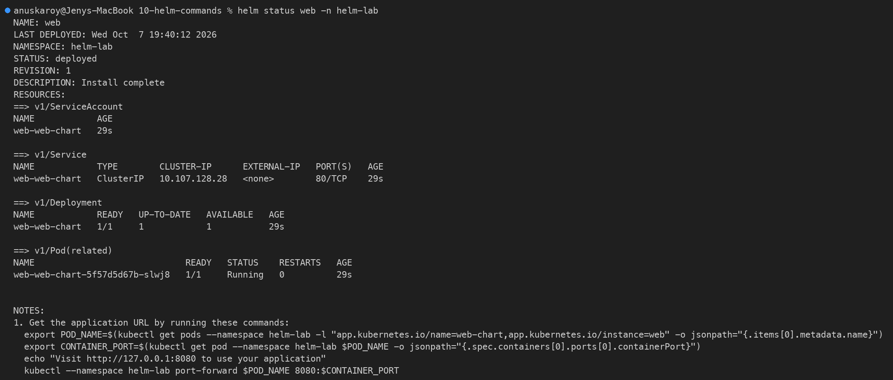

---

## 7. helm get

**What it does:** Reads back what Helm stored for a release.

| Subcommand | Returns |
|------------|---------|
| `helm get values` | Only the values the user supplied (`--all` gives the computed values: defaults + overrides) |
| `helm get manifest` | The rendered Kubernetes YAML that was applied |
| `helm get notes` | The rendered NOTES.txt |
| `helm get hooks` | Hook resources (here, the `helm test` pod) |
| `helm get metadata` | Chart, version, revision, status, deploy time |
| `helm get all` | Everything above together |

```bash
helm get values web -n helm-lab
helm get values web -n helm-lab --all | head -20
```

```text
USER-SUPPLIED VALUES:
null
COMPUTED VALUES:
affinity: {}
autoscaling:
  enabled: false
  maxReplicas: 100
  minReplicas: 1
  targetCPUUtilizationPercentage: 80
fullnameOverride: ""
...
```

`USER-SUPPLIED VALUES: null` means the release was installed with chart defaults only.

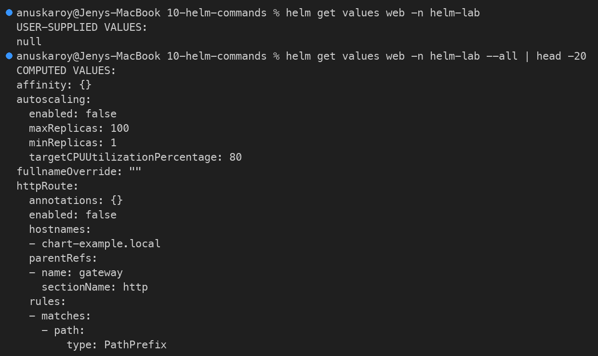

```bash
helm get manifest web -n helm-lab | head -40
```

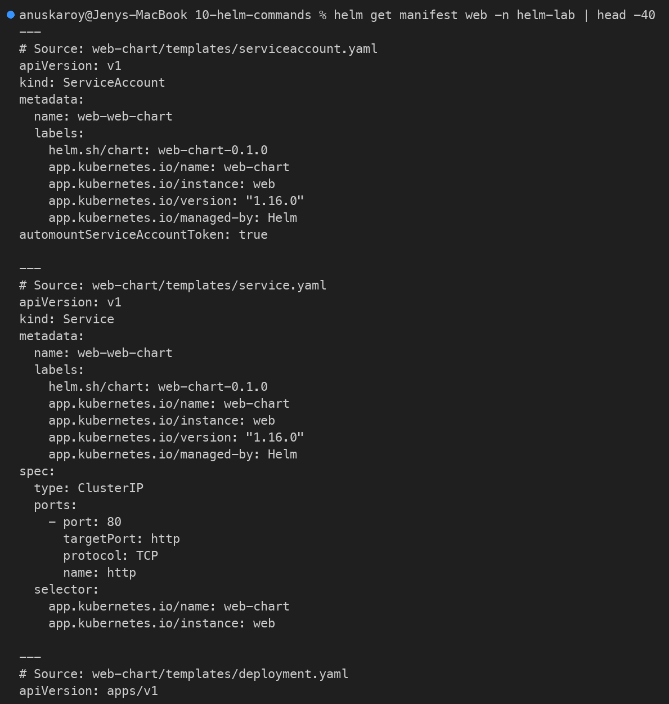

```bash
helm get metadata web -n helm-lab
helm get notes web -n helm-lab
helm get hooks web -n helm-lab | head -12
```

```text
NAME: web
CHART: web-chart
VERSION: 0.1.0
APP_VERSION: 1.16.0
ANNOTATIONS:
LABELS: modifiedAt=1791382226,name=web,owner=helm,status=deployed,version=1
DEPENDENCIES:
NAMESPACE: helm-lab
REVISION: 1
STATUS: deployed
DEPLOYED_AT: 2026-10-07T19:40:12+05:30
APPLY_METHOD: server-side apply
```

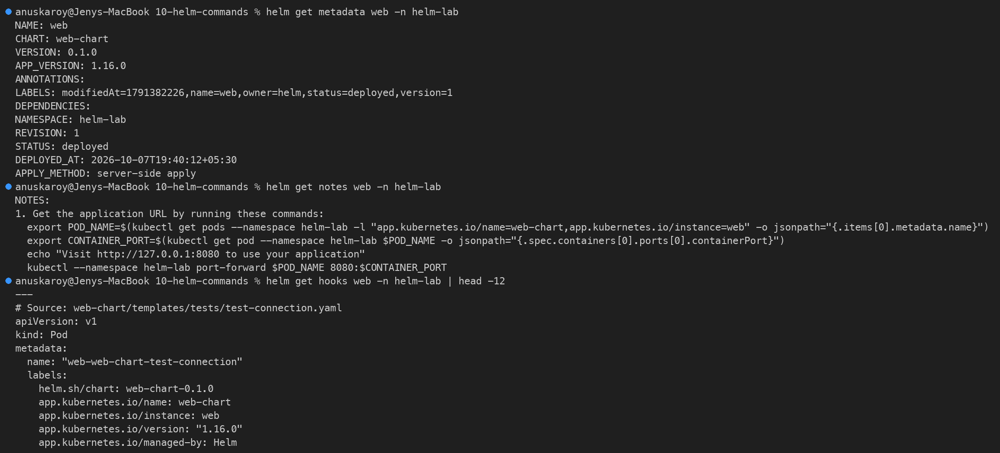

---

## 8. helm upgrade

**What it does:** Re-renders the chart with new values or a new chart version, applies only the differences, and creates a **new revision**.
- `--set` and `-f` supply new values.
- `--reuse-values` keeps the previous release's values and merges the new `--set` values on top. Without it, Helm starts again from the chart's `values.yaml`.

**Upgrade 1 (revision 2):** scale to 3 replicas and change the image to nginx 1.27.

```bash
helm upgrade web web-chart -n helm-lab --set replicaCount=3 --set image.tag=1.27 --wait --timeout 3m | head -7
kubectl get deploy,pods -n helm-lab -o wide | cut -c1-120
kubectl get deploy web-web-chart -n helm-lab -o jsonpath='{.spec.template.spec.containers[0].image}{"\n"}'
helm get values web -n helm-lab
```

```text
Release "web" has been upgraded. Happy Helming!
NAME: web
LAST DEPLOYED: Wed Oct  7 19:40:43 2026
NAMESPACE: helm-lab
STATUS: deployed
REVISION: 2
DESCRIPTION: Upgrade complete
NAME                            READY   UP-TO-DATE   AVAILABLE   AGE   CONTAINERS   IMAGES       SELECTOR
deployment.apps/web-web-chart   3/3     3            3           45s   web-chart    nginx:1.27   app.kubernetes.io/insta

NAME                                 READY   STATUS      RESTARTS   AGE   ...
pod/web-web-chart-5f57d5d67b-slwj8   0/1     Completed   0          45s   <- old pod (rev 1) shutting down
pod/web-web-chart-78874484f8-7dzbj   1/1     Running     0          2s
pod/web-web-chart-78874484f8-m2dfm   1/1     Running     0          4s
pod/web-web-chart-78874484f8-rws7l   1/1     Running     0          15s
nginx:1.27
USER-SUPPLIED VALUES:
image:
  tag: "1.27"
replicaCount: 3
```

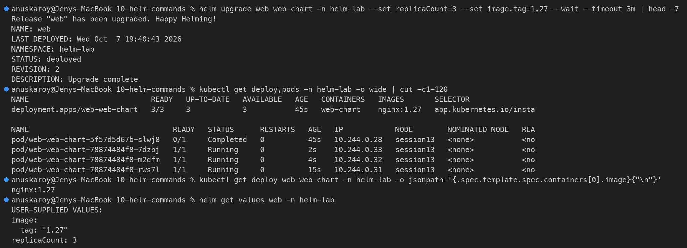

**Upgrade 2 (revision 3):** with `--reuse-values`, change only the Service type and keep 3 replicas and nginx 1.27.

```bash
helm upgrade web web-chart -n helm-lab --reuse-values --set service.type=NodePort --wait --timeout 3m | head -7
kubectl get svc -n helm-lab
```

```text
Release "web" has been upgraded. Happy Helming!
...
REVISION: 3
DESCRIPTION: Upgrade complete
NAME            TYPE       CLUSTER-IP      EXTERNAL-IP   PORT(S)        AGE
web-web-chart   NodePort   10.107.128.28   <none>        80:30536/TCP   68s
```

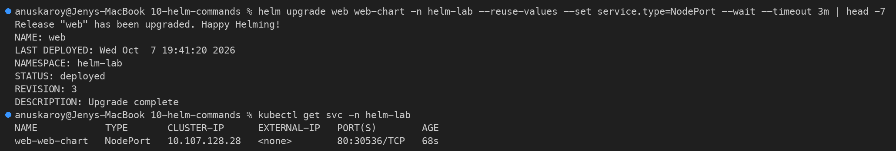

---

## 9. helm history

**What it does:** Lists every revision of a release with its status and description. Only one revision is `deployed`; earlier ones are `superseded`, and a failed upgrade shows as `failed`. You need these revision numbers for a rollback.

```bash
helm history web -n helm-lab
```

```text
REVISION        UPDATED                         STATUS          CHART           APP VERSION     DESCRIPTION
1               Wed Oct  7 19:40:12 2026        superseded      web-chart-0.1.0 1.16.0          Install complete
2               Wed Oct  7 19:40:43 2026        superseded      web-chart-0.1.0 1.16.0          Upgrade complete
3               Wed Oct  7 19:41:20 2026        deployed        web-chart-0.1.0 1.16.0          Upgrade complete
```

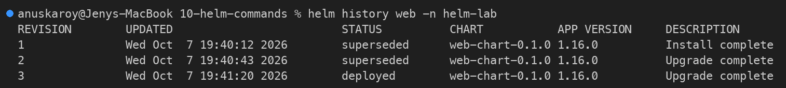

---

## 10. helm rollback

**What it does:** Re-applies the manifest stored for an earlier revision. The rollback is recorded as a **new** revision; history is never rewritten. If you leave out the revision number, Helm rolls back to the previous one.

```bash
helm rollback web 1 -n helm-lab --wait --timeout 3m
helm history web -n helm-lab
kubectl get deploy,svc -n helm-lab
```

```text
Rollback was a success! Happy Helming!
REVISION        UPDATED                         STATUS          CHART           APP VERSION     DESCRIPTION
1               Wed Oct  7 19:40:12 2026        superseded      web-chart-0.1.0 1.16.0          Install complete
2               Wed Oct  7 19:40:43 2026        superseded      web-chart-0.1.0 1.16.0          Upgrade complete
3               Wed Oct  7 19:41:20 2026        superseded      web-chart-0.1.0 1.16.0          Upgrade complete
4               Wed Oct  7 19:41:22 2026        deployed        web-chart-0.1.0 1.16.0          Rollback to 1
NAME                            READY   UP-TO-DATE   AVAILABLE   AGE
deployment.apps/web-web-chart   1/1     1            1           71s

NAME                    TYPE        CLUSTER-IP      EXTERNAL-IP   PORT(S)   AGE
service/web-web-chart   ClusterIP   10.107.128.28   <none>        80/TCP    71s
```

Revision 1's configuration is back: 1 replica and a ClusterIP Service. The rollback is recorded as revision 4.

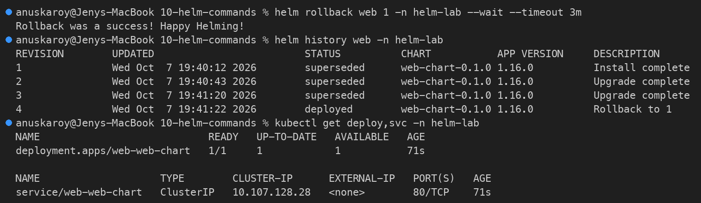

For the full Install → Upgrade → Upgrade → Rollback workflow with verification at each step, see **[08-rollback/README.md](../08-rollback/README.md)** (Task 2).

---

## 11. helm uninstall

**What it does:** Deletes every Kubernetes resource the release created, and its release history (the `sh.helm.release.v1.*` Secrets). Use `--keep-history` to keep the history, so `helm history` still works and the release can be rolled back.

```bash
helm uninstall web -n helm-lab --wait
helm list -n helm-lab
kubectl get all -n helm-lab
kubectl get secrets -n helm-lab -l owner=helm
```

```text
release "web" uninstalled
NAME    NAMESPACE       REVISION        UPDATED STATUS  CHART   APP VERSION
NAME                                 READY   STATUS        RESTARTS   AGE
pod/web-web-chart-5f57d5d67b-p7x8v   1/1     Terminating   0          2s
pod/web-web-chart-78874484f8-rws7l   0/1     Completed     0          41s
No resources found in helm-lab namespace.
```

The Deployment, Service and ServiceAccount are gone, and the last pods are terminating. No Helm release Secrets are left.

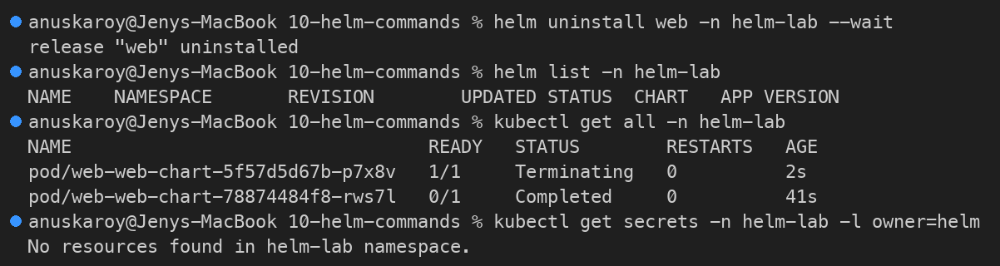

---

## Command Cheat Sheet

```text
helm repo add|update|list|remove     manage chart repositories
helm search repo|hub <kw>            find charts
helm create <name>                   scaffold a chart
helm lint / helm template            validate / render locally
helm install <rel> <chart>           deploy  -> revision 1
helm list [-A]                       list releases
helm status <rel>                    release state + resources
helm get values|manifest|notes|all   what Helm stored for a release
helm upgrade <rel> <chart>           change  -> revision N+1
helm history <rel>                   all revisions
helm rollback <rel> [N]              re-apply revision N -> new revision
helm uninstall <rel>                 delete release + resources
```
