# 01 — Helm Commands

**Submitted by:** Piyush Bansal
**Cluster:** Docker Desktop Kubernetes v1.36.1 (single node `desktop-control-plane`, arm64)
**Helm:** v4.3.0
**Namespace used:** `p15-cmds`

All output below was captured from a live run. Long outputs are trimmed with `| head` or
`grep` as part of the command shown.

Chart used: [`web-chart/`](web-chart/), created with `helm create` and not edited. I only
passed small resource requests with `--set` because the cluster is shared.

## Command summary

| Command | What it does |
|---|---|
| `helm create` | Generates a new chart skeleton (Chart.yaml, values.yaml, templates/) |
| `helm install` | Renders the chart with values and creates a new release (revision 1) in the cluster |
| `helm list` | Lists releases in a namespace (`-A` for all namespaces) |
| `helm status` | Shows the state of one release: revision, status, resources, NOTES |
| `helm get` | Downloads what is stored for a release: `values`, `manifest`, `notes`, `metadata`, `hooks`, `all` |
| `helm upgrade` | Applies a new chart version or new values to an existing release, creating a new revision |
| `helm history` | Lists every revision of a release with its status and description |
| `helm rollback` | Re-applies an older revision's manifest as a new revision |
| `helm uninstall` | Deletes all resources of a release (and its history unless `--keep-history`) |
| `helm repo` | Manages chart repositories: `add`, `list`, `update`, `remove`, `index` |
| `helm search` | Searches charts in added repos (`search repo`) or on Artifact Hub (`search hub`) |

## helm version

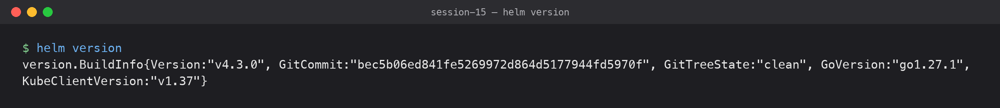

```text
$ helm version
version.BuildInfo{Version:"v4.3.0", GitCommit:"bec5b06ed841fe5269972d864d5177944fd5970f", GitTreeState:"clean", GoVersion:"go1.27.1", KubeClientVersion:"v1.37"}
```

## helm create

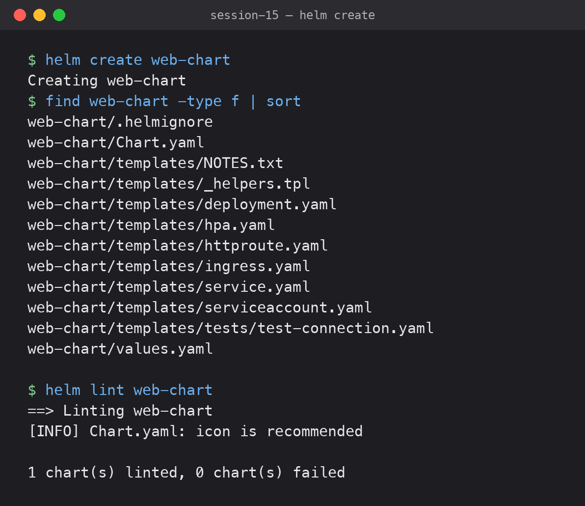

Creates the standard chart layout with an nginx Deployment, Service, ServiceAccount,
optional Ingress / HTTPRoute / HPA, a test pod and `_helpers.tpl`.

```text
$ helm create web-chart
Creating web-chart
$ find web-chart -type f | sort
web-chart/.helmignore
web-chart/Chart.yaml
web-chart/templates/NOTES.txt
web-chart/templates/_helpers.tpl
web-chart/templates/deployment.yaml
web-chart/templates/hpa.yaml
web-chart/templates/httproute.yaml
web-chart/templates/ingress.yaml
web-chart/templates/service.yaml
web-chart/templates/serviceaccount.yaml
web-chart/templates/tests/test-connection.yaml
web-chart/values.yaml
```

Before installing I checked the chart with `helm lint`:

```text
$ helm lint web-chart
==> Linting web-chart
[INFO] Chart.yaml: icon is recommended

1 chart(s) linted, 0 chart(s) failed
```

## helm install

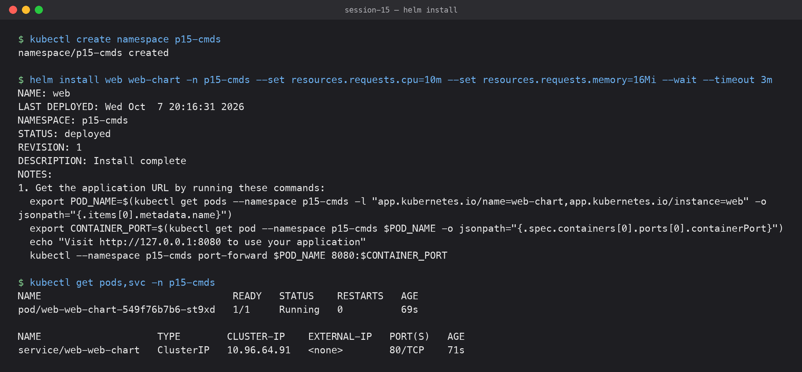

Installs the chart as release `web`. `--wait` makes Helm wait until the pods are ready.

```text
$ kubectl create namespace p15-cmds
namespace/p15-cmds created

$ helm install web web-chart -n p15-cmds --set resources.requests.cpu=10m --set resources.requests.memory=16Mi --wait --timeout 3m
NAME: web
LAST DEPLOYED: Wed Oct  7 20:16:31 2026
NAMESPACE: p15-cmds
STATUS: deployed
REVISION: 1
DESCRIPTION: Install complete
NOTES:
1. Get the application URL by running these commands:
  export POD_NAME=$(kubectl get pods --namespace p15-cmds -l "app.kubernetes.io/name=web-chart,app.kubernetes.io/instance=web" -o jsonpath="{.items[0].metadata.name}")
  export CONTAINER_PORT=$(kubectl get pod --namespace p15-cmds $POD_NAME -o jsonpath="{.spec.containers[0].ports[0].containerPort}")
  echo "Visit http://127.0.0.1:8080 to use your application"
  kubectl --namespace p15-cmds port-forward $POD_NAME 8080:$CONTAINER_PORT

$ kubectl get pods,svc -n p15-cmds
NAME                                 READY   STATUS    RESTARTS   AGE
pod/web-web-chart-549f76b7b6-st9xd   1/1     Running   0          69s

NAME                    TYPE        CLUSTER-IP    EXTERNAL-IP   PORT(S)   AGE
service/web-web-chart   ClusterIP   10.96.64.91   <none>        80/TCP    71s
```

## helm list

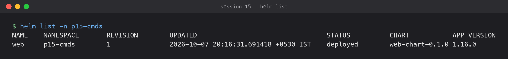

Shows the releases in the namespace, their current revision, chart and app version.

```text
$ helm list -n p15-cmds
NAME	NAMESPACE	REVISION	UPDATED                             	STATUS  	CHART          	APP VERSION
web 	p15-cmds 	1       	2026-10-07 20:16:31.691418 +0530 IST	deployed	web-chart-0.1.0	1.16.0     
```

## helm status

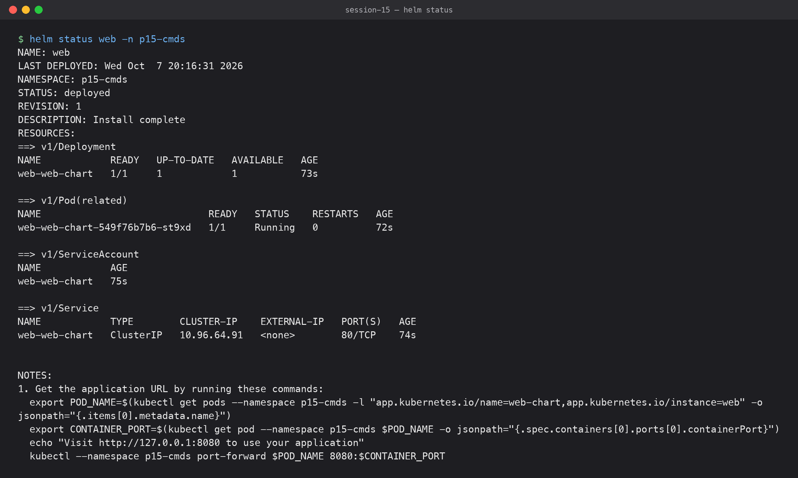

Shows the release state. In Helm v4 it also lists the live resources by default.

```text
$ helm status web -n p15-cmds
NAME: web
LAST DEPLOYED: Wed Oct  7 20:16:31 2026
NAMESPACE: p15-cmds
STATUS: deployed
REVISION: 1
DESCRIPTION: Install complete
RESOURCES:
==> v1/Deployment
NAME            READY   UP-TO-DATE   AVAILABLE   AGE
web-web-chart   1/1     1            1           73s

==> v1/Pod(related)
NAME                             READY   STATUS    RESTARTS   AGE
web-web-chart-549f76b7b6-st9xd   1/1     Running   0          72s

==> v1/ServiceAccount
NAME            AGE
web-web-chart   75s

==> v1/Service
NAME            TYPE        CLUSTER-IP    EXTERNAL-IP   PORT(S)   AGE
web-web-chart   ClusterIP   10.96.64.91   <none>        80/TCP    74s


NOTES:
1. Get the application URL by running these commands:
  export POD_NAME=$(kubectl get pods --namespace p15-cmds -l "app.kubernetes.io/name=web-chart,app.kubernetes.io/instance=web" -o jsonpath="{.items[0].metadata.name}")
  export CONTAINER_PORT=$(kubectl get pod --namespace p15-cmds $POD_NAME -o jsonpath="{.spec.containers[0].ports[0].containerPort}")
  echo "Visit http://127.0.0.1:8080 to use your application"
  kubectl --namespace p15-cmds port-forward $POD_NAME 8080:$CONTAINER_PORT
```

## helm get

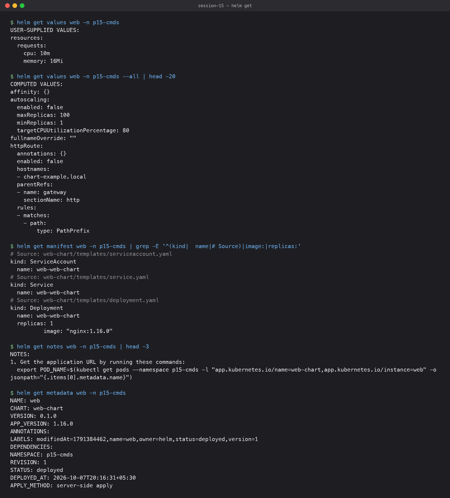

`helm get` reads what Helm stored for the release (it lives in a Secret in the namespace).

`get values` shows only what I supplied; `--all` shows the merged values:

```text
$ helm get values web -n p15-cmds
USER-SUPPLIED VALUES:
resources:
  requests:
    cpu: 10m
    memory: 16Mi

$ helm get values web -n p15-cmds --all | head -20
COMPUTED VALUES:
affinity: {}
autoscaling:
  enabled: false
  maxReplicas: 100
  minReplicas: 1
  targetCPUUtilizationPercentage: 80
fullnameOverride: ""
httpRoute:
  annotations: {}
  enabled: false
  hostnames:
  - chart-example.local
  parentRefs:
  - name: gateway
    sectionName: http
  rules:
  - matches:
    - path:
        type: PathPrefix
```

`get manifest` shows the rendered YAML that was applied (filtered here):

```text
$ helm get manifest web -n p15-cmds | grep -E '^(kind|  name|# Source)|image:|replicas:'
# Source: web-chart/templates/serviceaccount.yaml
kind: ServiceAccount
  name: web-web-chart
# Source: web-chart/templates/service.yaml
kind: Service
  name: web-web-chart
# Source: web-chart/templates/deployment.yaml
kind: Deployment
  name: web-web-chart
  replicas: 1
          image: "nginx:1.16.0"
```

`get notes` and `get metadata`:

```text
$ helm get notes web -n p15-cmds | head -3
NOTES:
1. Get the application URL by running these commands:
  export POD_NAME=$(kubectl get pods --namespace p15-cmds -l "app.kubernetes.io/name=web-chart,app.kubernetes.io/instance=web" -o jsonpath="{.items[0].metadata.name}")

$ helm get metadata web -n p15-cmds
NAME: web
CHART: web-chart
VERSION: 0.1.0
APP_VERSION: 1.16.0
ANNOTATIONS: 
LABELS: modifiedAt=1791384462,name=web,owner=helm,status=deployed,version=1
DEPENDENCIES: 
NAMESPACE: p15-cmds
REVISION: 1
STATUS: deployed
DEPLOYED_AT: 2026-10-07T20:16:31+05:30
APPLY_METHOD: server-side apply
```

## helm upgrade

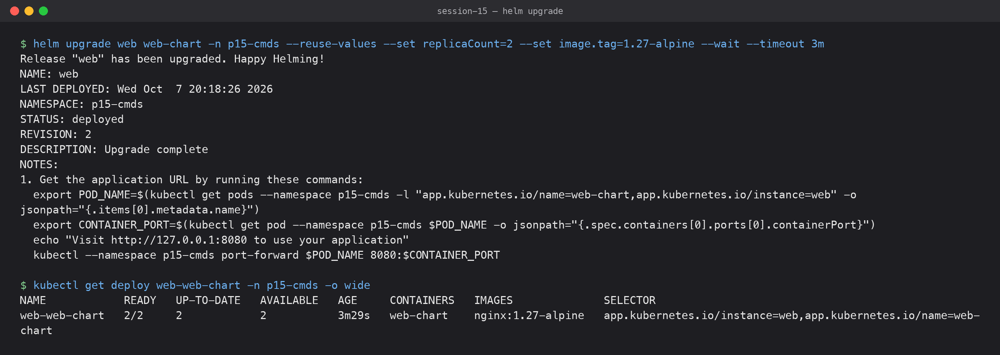

Changes the release. Here I scaled to 2 replicas and moved to `nginx:1.27-alpine`.
`--reuse-values` keeps the values from the previous revision (my resource requests) and adds the new `--set` values.

```text
$ helm upgrade web web-chart -n p15-cmds --reuse-values --set replicaCount=2 --set image.tag=1.27-alpine --wait --timeout 3m
Release "web" has been upgraded. Happy Helming!
NAME: web
LAST DEPLOYED: Wed Oct  7 20:18:26 2026
NAMESPACE: p15-cmds
STATUS: deployed
REVISION: 2
DESCRIPTION: Upgrade complete
NOTES:
1. Get the application URL by running these commands:
  export POD_NAME=$(kubectl get pods --namespace p15-cmds -l "app.kubernetes.io/name=web-chart,app.kubernetes.io/instance=web" -o jsonpath="{.items[0].metadata.name}")
  export CONTAINER_PORT=$(kubectl get pod --namespace p15-cmds $POD_NAME -o jsonpath="{.spec.containers[0].ports[0].containerPort}")
  echo "Visit http://127.0.0.1:8080 to use your application"
  kubectl --namespace p15-cmds port-forward $POD_NAME 8080:$CONTAINER_PORT

$ kubectl get deploy web-web-chart -n p15-cmds -o wide
NAME            READY   UP-TO-DATE   AVAILABLE   AGE     CONTAINERS   IMAGES              SELECTOR
web-web-chart   2/2     2            2           3m29s   web-chart    nginx:1.27-alpine   app.kubernetes.io/instance=web,app.kubernetes.io/name=web-chart
```

## helm history

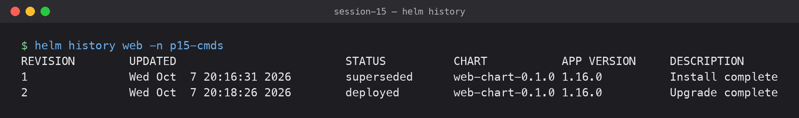

Every install/upgrade/rollback is a numbered revision.

```text
$ helm history web -n p15-cmds
REVISION	UPDATED                 	STATUS    	CHART          	APP VERSION	DESCRIPTION     
1       	Wed Oct  7 20:16:31 2026	superseded	web-chart-0.1.0	1.16.0     	Install complete
2       	Wed Oct  7 20:18:26 2026	deployed  	web-chart-0.1.0	1.16.0     	Upgrade complete
```

## helm rollback

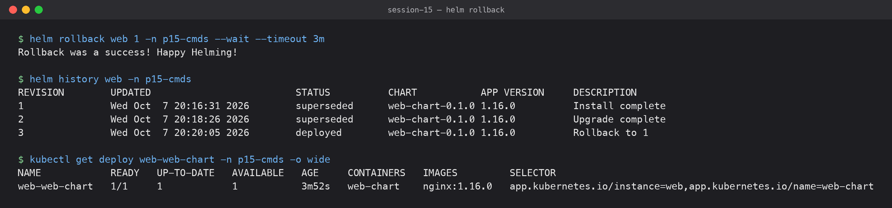

Goes back to revision 1. Helm does not delete revision 2; it creates revision 3 with revision 1's manifest.

```text
$ helm rollback web 1 -n p15-cmds --wait --timeout 3m
Rollback was a success! Happy Helming!

$ helm history web -n p15-cmds
REVISION	UPDATED                 	STATUS    	CHART          	APP VERSION	DESCRIPTION     
1       	Wed Oct  7 20:16:31 2026	superseded	web-chart-0.1.0	1.16.0     	Install complete
2       	Wed Oct  7 20:18:26 2026	superseded	web-chart-0.1.0	1.16.0     	Upgrade complete
3       	Wed Oct  7 20:20:05 2026	deployed  	web-chart-0.1.0	1.16.0     	Rollback to 1   

$ kubectl get deploy web-web-chart -n p15-cmds -o wide
NAME            READY   UP-TO-DATE   AVAILABLE   AGE     CONTAINERS   IMAGES         SELECTOR
web-web-chart   1/1     1            1           3m52s   web-chart    nginx:1.16.0   app.kubernetes.io/instance=web,app.kubernetes.io/name=web-chart
```

Back to 1 replica and `nginx:1.16.0`.

## helm uninstall

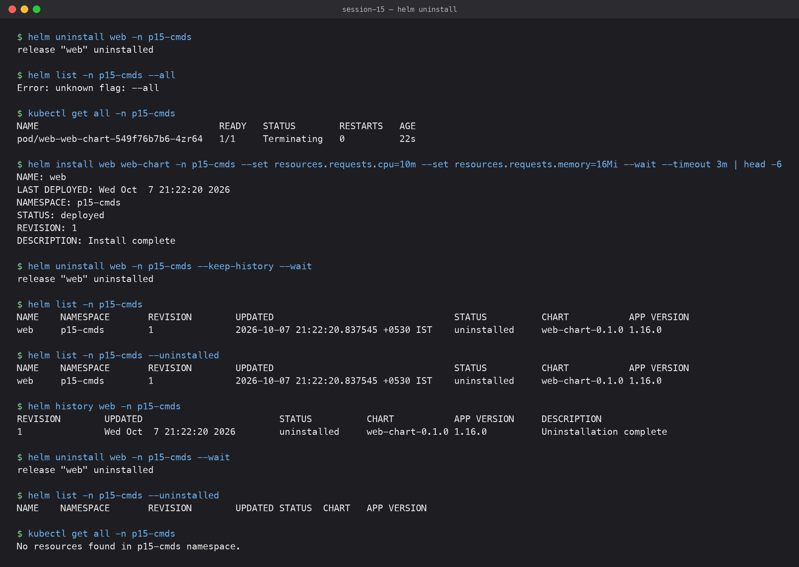

Removes every resource of the release and its history.

```text
$ helm uninstall web -n p15-cmds
release "web" uninstalled

$ helm list -n p15-cmds --all
Error: unknown flag: --all

$ kubectl get all -n p15-cmds
NAME                                 READY   STATUS        RESTARTS   AGE
pod/web-web-chart-549f76b7b6-4zr64   1/1     Terminating   0          22s
```

`helm list --all` from the v3 notes does not exist in v4 (see the v4 section below). The last pod
was still terminating; a later check showed the namespace empty.

With `--keep-history` the resources are deleted but the release record stays, so it can
still be seen (and rolled back):

```text
$ helm install web web-chart -n p15-cmds --set resources.requests.cpu=10m --set resources.requests.memory=16Mi --wait --timeout 3m | head -6
NAME: web
LAST DEPLOYED: Wed Oct  7 21:22:20 2026
NAMESPACE: p15-cmds
STATUS: deployed
REVISION: 1
DESCRIPTION: Install complete

$ helm uninstall web -n p15-cmds --keep-history --wait
release "web" uninstalled

$ helm list -n p15-cmds
NAME	NAMESPACE	REVISION	UPDATED                             	STATUS     	CHART          	APP VERSION
web 	p15-cmds 	1       	2026-10-07 21:22:20.837545 +0530 IST	uninstalled	web-chart-0.1.0	1.16.0     

$ helm list -n p15-cmds --uninstalled
NAME	NAMESPACE	REVISION	UPDATED                             	STATUS     	CHART          	APP VERSION
web 	p15-cmds 	1       	2026-10-07 21:22:20.837545 +0530 IST	uninstalled	web-chart-0.1.0	1.16.0     

$ helm history web -n p15-cmds
REVISION	UPDATED                 	STATUS     	CHART          	APP VERSION	DESCRIPTION            
1       	Wed Oct  7 21:22:20 2026	uninstalled	web-chart-0.1.0	1.16.0     	Uninstallation complete

$ helm uninstall web -n p15-cmds --wait
release "web" uninstalled

$ helm list -n p15-cmds --uninstalled
NAME	NAMESPACE	REVISION	UPDATED	STATUS	CHART	APP VERSION

$ kubectl get all -n p15-cmds
No resources found in p15-cmds namespace.
```

## helm repo

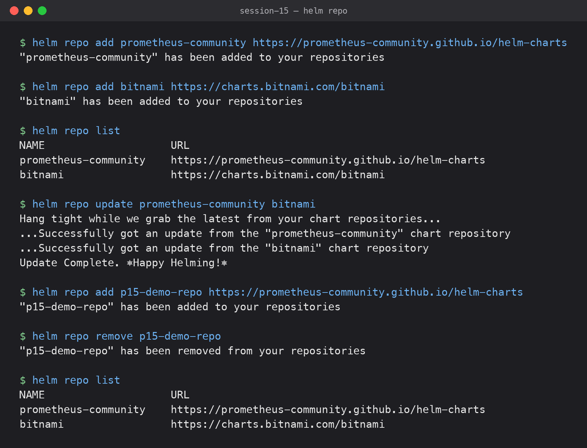

Adds public chart repositories, lists them, refreshes their index, and removes one.

```text
$ helm repo add prometheus-community https://prometheus-community.github.io/helm-charts
"prometheus-community" has been added to your repositories

$ helm repo add bitnami https://charts.bitnami.com/bitnami
"bitnami" has been added to your repositories

$ helm repo list
NAME                	URL                                               
prometheus-community	https://prometheus-community.github.io/helm-charts
bitnami             	https://charts.bitnami.com/bitnami                

$ helm repo update prometheus-community bitnami
Hang tight while we grab the latest from your chart repositories...
...Successfully got an update from the "prometheus-community" chart repository
...Successfully got an update from the "bitnami" chart repository
Update Complete. ⎈Happy Helming!⎈

$ helm repo add p15-demo-repo https://prometheus-community.github.io/helm-charts
"p15-demo-repo" has been added to your repositories

$ helm repo remove p15-demo-repo
"p15-demo-repo" has been removed from your repositories

$ helm repo list
NAME                	URL                                               
prometheus-community	https://prometheus-community.github.io/helm-charts
bitnami             	https://charts.bitnami.com/bitnami                
```

(I tested `repo remove` on a throwaway repo name so I did not remove a repo someone else on
the machine might be using.)

## helm search

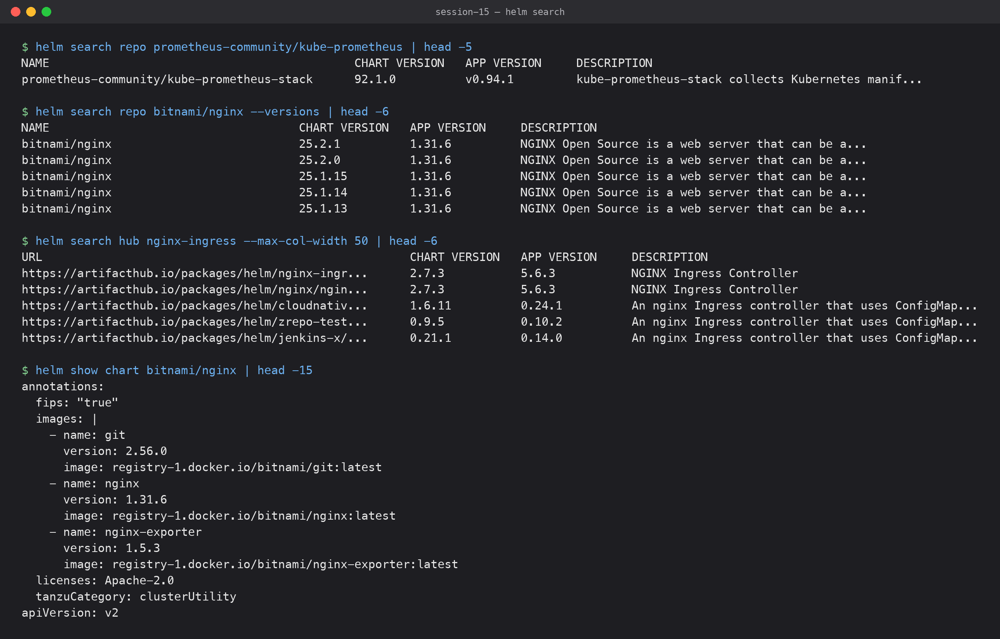

`search repo` searches the repos I added locally. `--versions` lists every chart version.
`search hub` searches Artifact Hub online.

```text
$ helm search repo prometheus-community/kube-prometheus | head -5
NAME                                      	CHART VERSION	APP VERSION	DESCRIPTION                                       
prometheus-community/kube-prometheus-stack	92.1.0       	v0.94.1    	kube-prometheus-stack collects Kubernetes manif...

$ helm search repo bitnami/nginx --versions | head -6
NAME                            	CHART VERSION	APP VERSION	DESCRIPTION                                       
bitnami/nginx                   	25.2.1       	1.31.6     	NGINX Open Source is a web server that can be a...
bitnami/nginx                   	25.2.0       	1.31.6     	NGINX Open Source is a web server that can be a...
bitnami/nginx                   	25.1.15      	1.31.6     	NGINX Open Source is a web server that can be a...
bitnami/nginx                   	25.1.14      	1.31.6     	NGINX Open Source is a web server that can be a...
bitnami/nginx                   	25.1.13      	1.31.6     	NGINX Open Source is a web server that can be a...

$ helm search hub nginx-ingress --max-col-width 50 | head -6
URL                                               	CHART VERSION	APP VERSION	DESCRIPTION                                       
https://artifacthub.io/packages/helm/nginx-ingr...	2.7.3        	5.6.3      	NGINX Ingress Controller                          
https://artifacthub.io/packages/helm/nginx/ngin...	2.7.3        	5.6.3      	NGINX Ingress Controller                          
https://artifacthub.io/packages/helm/cloudnativ...	1.6.11       	0.24.1     	An nginx Ingress controller that uses ConfigMap...
https://artifacthub.io/packages/helm/zrepo-test...	0.9.5        	0.10.2     	An nginx Ingress controller that uses ConfigMap...
https://artifacthub.io/packages/helm/jenkins-x/...	0.21.1       	0.14.0     	An nginx Ingress controller that uses ConfigMap...
```

Before installing a chart from a repo, `helm show chart` / `helm show values` tell you what it contains:

```text
$ helm show chart bitnami/nginx | head -15
annotations:
  fips: "true"
  images: |
    - name: git
      version: 2.56.0
      image: registry-1.docker.io/bitnami/git:latest
    - name: nginx
      version: 1.31.6
      image: registry-1.docker.io/bitnami/nginx:latest
    - name: nginx-exporter
      version: 1.5.3
      image: registry-1.docker.io/bitnami/nginx-exporter:latest
  licenses: Apache-2.0
  tanzuCategory: clusterUtility
apiVersion: v2
```

## Differences I hit between Helm v4 and the course's v3 notes

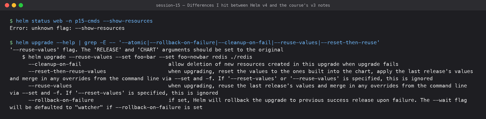

| v3 (course notes) | v4.3.0 (what I saw) |
|---|---|
| `helm list --all` shows every release | `Error: unknown flag: --all`. Use the state filters (`--uninstalled`, `--failed`, `--pending`, ...). Plain `helm list` also showed my `--keep-history` uninstalled release |
| `helm status --show-resources` to see resources | Resources are printed by default; `--show-resources` gives `Error: unknown flag: --show-resources` |
| `--atomic` on install/upgrade | Renamed to `--rollback-on-failure` (`--atomic` is no longer in `helm upgrade --help`) |
| `--wait` is a true/false flag | `--wait` takes a strategy: `watcher` (when given alone), `legacy`, or `hookOnly` (the default when the flag is omitted) |
| Client-side 3-way merge apply | `--server-side` is on by default; `helm get metadata` shows `APPLY_METHOD: server-side apply` |

```text
$ helm status web -n p15-cmds --show-resources
Error: unknown flag: --show-resources

$ helm upgrade --help | grep -E -- '--atomic|--rollback-on-failure|--cleanup-on-fail|--reuse-values|--reset-then-reuse'
'--reuse-values' flag. The 'RELEASE' and 'CHART' arguments should be set to the original
    $ helm upgrade --reuse-values --set foo=bar --set foo=newbar redis ./redis
      --cleanup-on-fail                            allow deletion of new resources created in this upgrade when upgrade fails
      --reset-then-reuse-values                    when upgrading, reset the values to the ones built into the chart, apply the last release's values and merge in any overrides from the command line via --set and -f. If '--reset-values' or '--reuse-values' is specified, this is ignored
      --reuse-values                               when upgrading, reuse the last release's values and merge in any overrides from the command line via --set and -f. If '--reset-values' is specified, this is ignored
      --rollback-on-failure                        if set, Helm will rollback the upgrade to previous success release upon failure. The --wait flag will be defaulted to "watcher" if --rollback-on-failure is set
```

All other commands (`create`, `install`, `upgrade`, `history`, `rollback`, `uninstall`,
`repo`, `search`, `get`) worked the same way as in the course material.

## What I learned

- A release is a named install of a chart, and every change to it is a numbered revision stored in the cluster.
- `helm get values` shows only what I passed. `--all` shows the full merged values.
- `rollback` never rewrites history. It adds a new revision that copies an old one.
- Helm v4 changed some flags (`--all`, `--show-resources`, `--atomic`, `--wait`), so I check `--help` before copying v3 commands.
