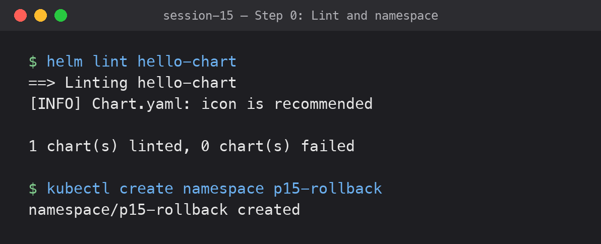
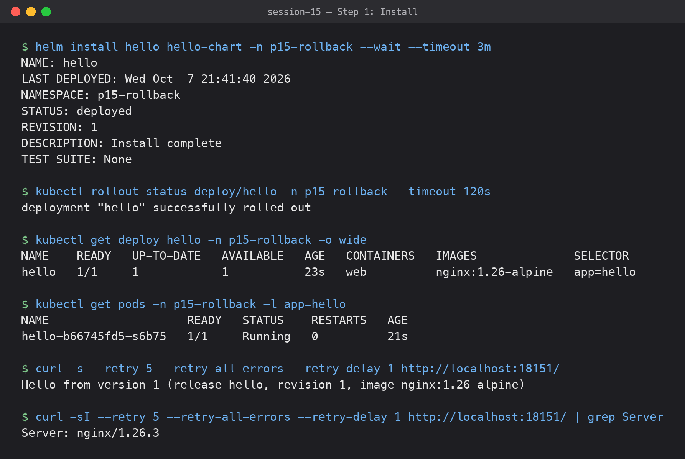
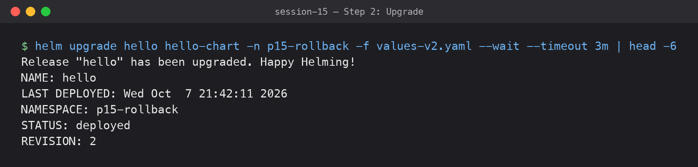
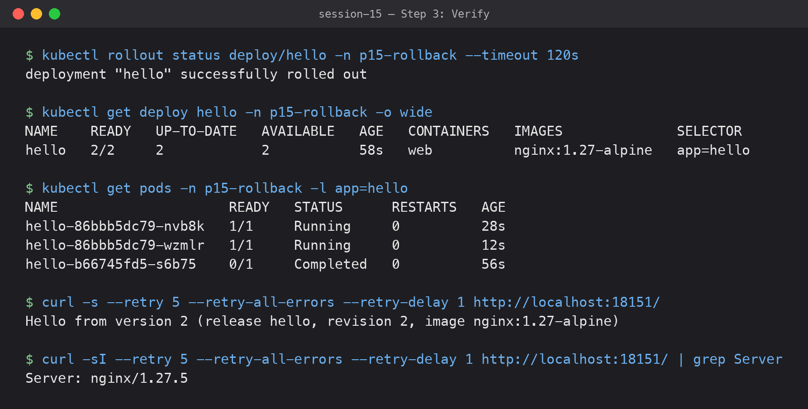
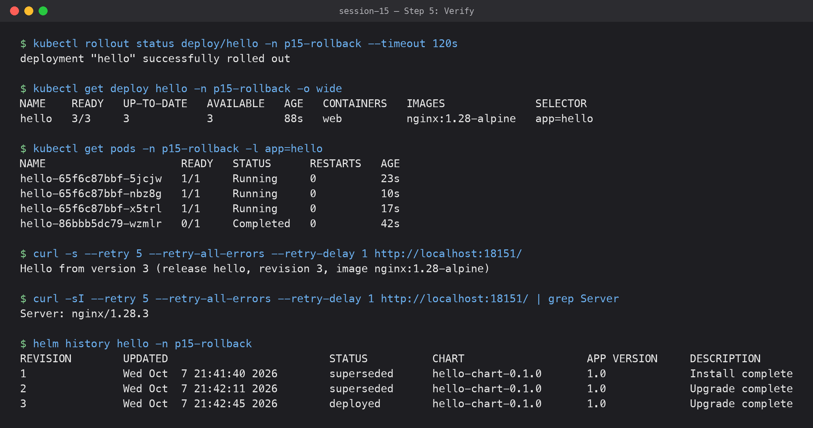
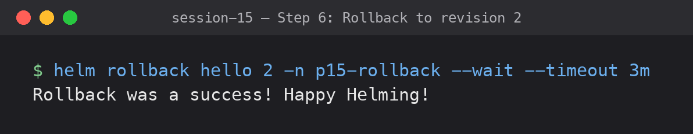
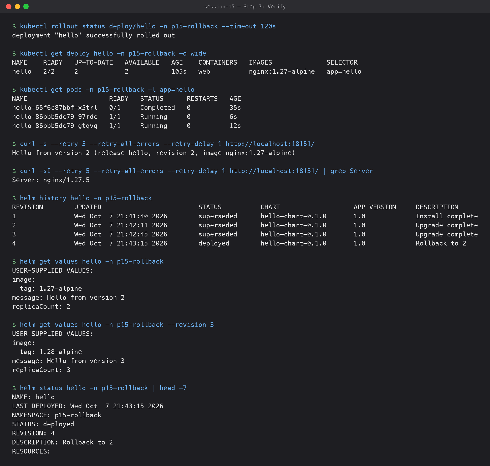

# 02 — Helm Rollback Workflow

**Submitted by:** Piyush Bansal
**Cluster:** Docker Desktop Kubernetes v1.36.1 (single node, arm64)
**Helm:** v4.3.0
**Namespace used:** `p15-rollback`

All output below was captured from a live run.

```text
Install (rev 1) → Upgrade (rev 2) → Verify → Upgrade again (rev 3) → Verify → Rollback to rev 2 (rev 4) → Verify
```

## The chart

[`hello-chart/`](hello-chart/) is a small nginx app I wrote so each version is easy to tell
apart. A ConfigMap holds an `index.html` with a message, and nginx serves it. The
Deployment has a `checksum/html` annotation so pods restart when the message changes.

```text
hello-chart/
  Chart.yaml
  values.yaml            # revision 1 defaults
  templates/
    configmap.yaml       # index.html built from .Values.message, .Release.Revision, image tag
    deployment.yaml
    service.yaml
values-v2.yaml           # upgrade 1
values-v3.yaml           # upgrade 2
```

| Revision | How | Replicas | Image | Message |
|---|---|---|---|---|
| 1 | `helm install` (values.yaml) | 1 | `nginx:1.26-alpine` | Hello from version 1 |
| 2 | `helm upgrade -f values-v2.yaml` | 2 | `nginx:1.27-alpine` | Hello from version 2 |
| 3 | `helm upgrade -f values-v3.yaml` | 3 | `nginx:1.28-alpine` | Hello from version 3 |
| 4 | `helm rollback hello 2` | 2 | `nginx:1.27-alpine` | Hello from version 2 |

For each **Verify** step I ran `kubectl rollout status`, `kubectl get deploy/pods`, and
then `kubectl port-forward -n p15-rollback svc/hello 18151:80` in the background and
`curl`ed the page plus the `Server` header (it shows the real nginx version running).

## Step 0: Lint and namespace



```text
$ helm lint hello-chart
==> Linting hello-chart
[INFO] Chart.yaml: icon is recommended

1 chart(s) linted, 0 chart(s) failed

$ kubectl create namespace p15-rollback
namespace/p15-rollback created
```

## Step 1: Install



```text
$ helm install hello hello-chart -n p15-rollback --wait --timeout 3m
NAME: hello
LAST DEPLOYED: Wed Oct  7 21:41:40 2026
NAMESPACE: p15-rollback
STATUS: deployed
REVISION: 1
DESCRIPTION: Install complete
TEST SUITE: None
```

Verify:

```text
$ kubectl rollout status deploy/hello -n p15-rollback --timeout 120s
deployment "hello" successfully rolled out

$ kubectl get deploy hello -n p15-rollback -o wide
NAME    READY   UP-TO-DATE   AVAILABLE   AGE   CONTAINERS   IMAGES              SELECTOR
hello   1/1     1            1           23s   web          nginx:1.26-alpine   app=hello

$ kubectl get pods -n p15-rollback -l app=hello
NAME                    READY   STATUS    RESTARTS   AGE
hello-b66745fd5-s6b75   1/1     Running   0          21s

$ curl -s --retry 5 --retry-all-errors --retry-delay 1 http://localhost:18151/
Hello from version 1 (release hello, revision 1, image nginx:1.26-alpine)

$ curl -sI --retry 5 --retry-all-errors --retry-delay 1 http://localhost:18151/ | grep Server
Server: nginx/1.26.3
```

## Step 2: Upgrade



```text
$ helm upgrade hello hello-chart -n p15-rollback -f values-v2.yaml --wait --timeout 3m | head -6
Release "hello" has been upgraded. Happy Helming!
NAME: hello
LAST DEPLOYED: Wed Oct  7 21:42:11 2026
NAMESPACE: p15-rollback
STATUS: deployed
REVISION: 2
```

## Step 3: Verify



```text
$ kubectl rollout status deploy/hello -n p15-rollback --timeout 120s
deployment "hello" successfully rolled out

$ kubectl get deploy hello -n p15-rollback -o wide
NAME    READY   UP-TO-DATE   AVAILABLE   AGE   CONTAINERS   IMAGES              SELECTOR
hello   2/2     2            2           58s   web          nginx:1.27-alpine   app=hello

$ kubectl get pods -n p15-rollback -l app=hello
NAME                     READY   STATUS      RESTARTS   AGE
hello-86bbb5dc79-nvb8k   1/1     Running     0          28s
hello-86bbb5dc79-wzmlr   1/1     Running     0          12s
hello-b66745fd5-s6b75    0/1     Completed   0          56s

$ curl -s --retry 5 --retry-all-errors --retry-delay 1 http://localhost:18151/
Hello from version 2 (release hello, revision 2, image nginx:1.27-alpine)

$ curl -sI --retry 5 --retry-all-errors --retry-delay 1 http://localhost:18151/ | grep Server
Server: nginx/1.27.5
```

2 replicas, new image, new message. The old revision-1 pod is on its way out.

## Step 4: Upgrade again


```text
$ helm upgrade hello hello-chart -n p15-rollback -f values-v3.yaml --wait --timeout 3m | head -6
Release "hello" has been upgraded. Happy Helming!
NAME: hello
LAST DEPLOYED: Wed Oct  7 21:42:45 2026
NAMESPACE: p15-rollback
STATUS: deployed
REVISION: 3
```

## Step 5: Verify



```text
$ kubectl rollout status deploy/hello -n p15-rollback --timeout 120s
deployment "hello" successfully rolled out

$ kubectl get deploy hello -n p15-rollback -o wide
NAME    READY   UP-TO-DATE   AVAILABLE   AGE   CONTAINERS   IMAGES              SELECTOR
hello   3/3     3            3           88s   web          nginx:1.28-alpine   app=hello

$ kubectl get pods -n p15-rollback -l app=hello
NAME                     READY   STATUS      RESTARTS   AGE
hello-65f6c87bbf-5jcjw   1/1     Running     0          23s
hello-65f6c87bbf-nbz8g   1/1     Running     0          10s
hello-65f6c87bbf-x5trl   1/1     Running     0          17s
hello-86bbb5dc79-wzmlr   0/1     Completed   0          42s

$ curl -s --retry 5 --retry-all-errors --retry-delay 1 http://localhost:18151/
Hello from version 3 (release hello, revision 3, image nginx:1.28-alpine)

$ curl -sI --retry 5 --retry-all-errors --retry-delay 1 http://localhost:18151/ | grep Server
Server: nginx/1.28.3

$ helm history hello -n p15-rollback
REVISION	UPDATED                 	STATUS    	CHART            	APP VERSION	DESCRIPTION     
1       	Wed Oct  7 21:41:40 2026	superseded	hello-chart-0.1.0	1.0        	Install complete
2       	Wed Oct  7 21:42:11 2026	superseded	hello-chart-0.1.0	1.0        	Upgrade complete
3       	Wed Oct  7 21:42:45 2026	deployed  	hello-chart-0.1.0	1.0        	Upgrade complete
```

## Step 6: Rollback to revision 2



```text
$ helm rollback hello 2 -n p15-rollback --wait --timeout 3m
Rollback was a success! Happy Helming!
```

## Step 7: Verify



```text
$ kubectl rollout status deploy/hello -n p15-rollback --timeout 120s
deployment "hello" successfully rolled out

$ kubectl get deploy hello -n p15-rollback -o wide
NAME    READY   UP-TO-DATE   AVAILABLE   AGE    CONTAINERS   IMAGES              SELECTOR
hello   2/2     2            2           105s   web          nginx:1.27-alpine   app=hello

$ kubectl get pods -n p15-rollback -l app=hello
NAME                     READY   STATUS      RESTARTS   AGE
hello-65f6c87bbf-x5trl   0/1     Completed   0          35s
hello-86bbb5dc79-97rdc   1/1     Running     0          6s
hello-86bbb5dc79-gtqvq   1/1     Running     0          12s

$ curl -s --retry 5 --retry-all-errors --retry-delay 1 http://localhost:18151/
Hello from version 2 (release hello, revision 2, image nginx:1.27-alpine)

$ curl -sI --retry 5 --retry-all-errors --retry-delay 1 http://localhost:18151/ | grep Server
Server: nginx/1.27.5

$ helm history hello -n p15-rollback
REVISION	UPDATED                 	STATUS    	CHART            	APP VERSION	DESCRIPTION     
1       	Wed Oct  7 21:41:40 2026	superseded	hello-chart-0.1.0	1.0        	Install complete
2       	Wed Oct  7 21:42:11 2026	superseded	hello-chart-0.1.0	1.0        	Upgrade complete
3       	Wed Oct  7 21:42:45 2026	superseded	hello-chart-0.1.0	1.0        	Upgrade complete
4       	Wed Oct  7 21:43:15 2026	deployed  	hello-chart-0.1.0	1.0        	Rollback to 2   
```

Everything is back to version 2: 2 replicas, `nginx:1.27.5`, "Hello from version 2". The new
pods use the same ReplicaSet hash as revision 2 (`hello-86bbb5dc79-*`), because the pod
template is the same one again.

The page still says `revision 2` even though the release is now at revision 4. Rollback
re-applies the manifest that was rendered for revision 2. It does not render the templates
again, so `.Release.Revision` keeps the old value.

The values stored for the release also went back. Revision 3's values are still kept in history:

```text
$ helm get values hello -n p15-rollback
USER-SUPPLIED VALUES:
image:
  tag: 1.27-alpine
message: Hello from version 2
replicaCount: 2

$ helm get values hello -n p15-rollback --revision 3
USER-SUPPLIED VALUES:
image:
  tag: 1.28-alpine
message: Hello from version 3
replicaCount: 3

$ helm status hello -n p15-rollback | head -7
NAME: hello
LAST DEPLOYED: Wed Oct  7 21:43:15 2026
NAMESPACE: p15-rollback
STATUS: deployed
REVISION: 4
DESCRIPTION: Rollback to 2
RESOURCES:
```

## Notes from the run

- The run above was my third. On the first try the install failed. The shared cluster's API
  connection dropped (`http2: client connection lost`) and the pod was not ready within
  `--timeout 3m`, so revision 1 was recorded as failed. On the second try every Helm step
  worked, but the `curl` after the second upgrade came back empty. I had started the
  port-forward while old pods were still terminating. Both times I uninstalled and deleted the
  namespace. Then I added `kubectl rollout status` and `curl --retry` to the verify step and
  ran it all again.
- Cleanup: `helm uninstall hello -n p15-rollback --wait` and `kubectl delete namespace p15-rollback`.

## What I learned

- Rollback is one command and quick. It creates a new revision (4) and never deletes 3, so I could roll forward again later.
- To check a rollback, I look at the app itself (the HTTP response and the nginx version), not only at `helm status`.
- `--wait` is important. Without it, Helm reports success before the pods are ready.
- Rollback re-applies the stored manifest and does not render the templates again.
