# Session 15 — Helm

## Overview

This session focuses on Helm, the package manager for Kubernetes.

The following concepts and hands-on activities were completed:

- Helm charts
- Chart structure
- `Chart.yaml`
- `values.yaml`
- Helm templates
- Helm installation
- Helm upgrades
- Helm release history
- Helm rollback
- Helm repositories
- Helm search
- Complete rollback workflow
- Helm-based application deployment
- Notes App Helm mini project

---

# Environment

Tools used:

- Kubernetes
- Minikube
- kubectl
- Helm 3
- Docker

Check Helm:

```bash
helm version
```

Example output:

```text
version.BuildInfo{
    Version:"v3.x.x",
    GitCommit:"...",
    GitTreeState:"clean",
    GoVersion:"go1.x",
    Compiler:"gc",
    Platform:"linux/amd64"
}
```

Check Kubernetes:

```bash
kubectl get nodes
```

Expected:

```text
NAME       STATUS   ROLES           AGE   VERSION
minikube   Ready    control-plane   ...   v...
```

Check Minikube:

```bash
minikube status
```

Expected:

```text
host: Running
kubelet: Running
apiserver: Running
kubeconfig: Configured
```

---

# Task 1 — Helm Commands

The following Helm commands were practiced:

```text
helm create
helm install
helm list
helm status
helm get
helm upgrade
helm history
helm rollback
helm uninstall
helm repo
helm search
```

---

# 1. helm create

## Purpose

`helm create` generates the standard directory structure for a new Helm chart.

Command:

```bash
helm create demo-chart
```

Expected output:

```text
Creating demo-chart
```

The command creates:

```text
demo-chart/
├── Chart.yaml
├── values.yaml
├── charts/
├── templates/
│   ├── NOTES.txt
│   ├── _helpers.tpl
│   ├── deployment.yaml
│   ├── service.yaml
│   ├── serviceaccount.yaml
│   ├── ingress.yaml
│   ├── hpa.yaml
│   └── tests/
└── .helmignore
```

---

## Explanation

A Helm chart contains:

### `Chart.yaml`

Contains chart metadata.

Example:

```yaml
apiVersion: v2
name: demo-chart
description: A Helm chart for Kubernetes
type: application
version: 0.1.0
appVersion: "1.0"
```

### `values.yaml`

Contains default configuration values.

### `templates/`

Contains Kubernetes YAML templates using Helm expressions.

For example:

```yaml
replicas: {{ .Values.replicaCount }}
```

---

## Screenshot

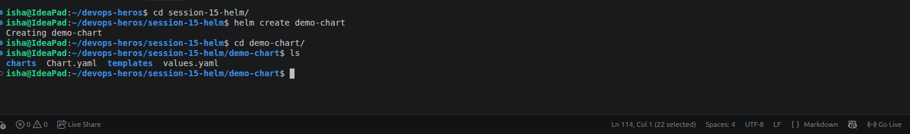

---

# 2. helm install

## Purpose

`helm install` creates a new Helm Release from a chart.

Using the repository's `app-chart`:

```bash
cd 07-install-upgrade
```

Install:

```bash
helm install web-app ./app-chart
```

Expected output:

```text
NAME: web-app
LAST DEPLOYED: ...
NAMESPACE: default
STATUS: deployed
REVISION: 1
```

---

## Verify Kubernetes Resources

```bash
kubectl get pods
```

Expected:

```text
NAME                   READY   STATUS    RESTARTS   AGE
web-app-app-xxxxx      1/1     Running   0          ...
```

Check Deployment:

```bash
kubectl get deployments
```

---

## Screenshot

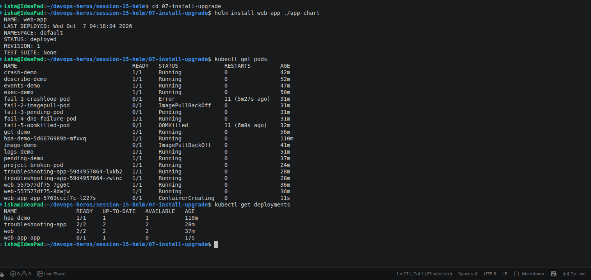

---

# 3. helm list

## Purpose

`helm list` displays Helm releases installed in the current namespace.

Command:

```bash
helm list
```

Expected:

```text
NAME      NAMESPACE   REVISION   UPDATED   STATUS     CHART
web-app   default     1          ...       deployed   app-chart-0.1.0
```

---

## Explanation

Important columns:

| Column | Meaning |
|---|---|
| NAME | Helm release name |
| NAMESPACE | Kubernetes namespace |
| REVISION | Current release revision |
| STATUS | Release state |
| CHART | Chart used by the release |

---

## Screenshot

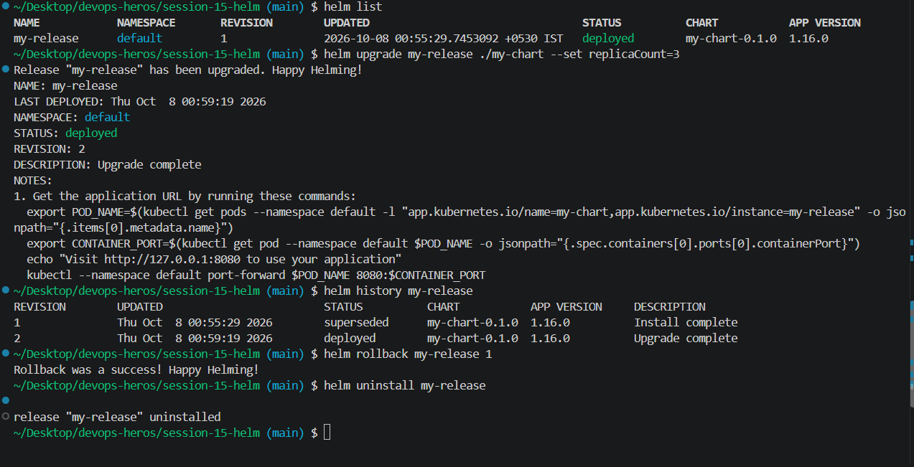

---

# 4. helm status

## Purpose

`helm status` shows the current state of a particular release.

Command:

```bash
helm status web-app
```

Expected:

```text
NAME: web-app
LAST DEPLOYED: ...
NAMESPACE: default
STATUS: deployed
REVISION: 1
```

Depending on the chart, Helm may also display additional information from `NOTES.txt`.

---

## Screenshot

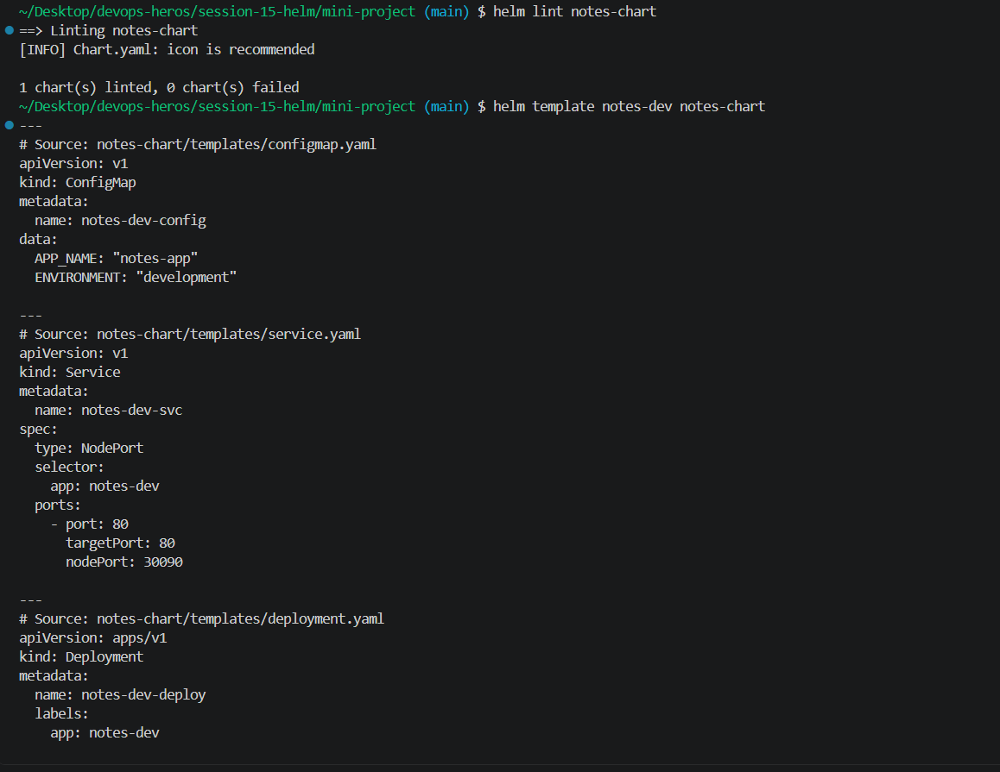

---

# 5. helm get

Helm provides multiple `helm get` subcommands.

The most useful ones are:

```bash
helm get values
helm get manifest
helm get all
helm get notes
```

---

## 5.1 helm get values

Command:

```bash
helm get values web-app
```

This shows values explicitly supplied to the release.

To display all values, including defaults:

```bash
helm get values web-app --all
```

Example:

```text
USER-SUPPLIED VALUES:
null
```

or:

```text
replicaCount: 3
```

depending on how the release was installed.

---

## 5.2 helm get manifest

```bash
helm get manifest web-app
```

This displays the Kubernetes manifests generated from the Helm templates.

Example:

```yaml
apiVersion: apps/v1
kind: Deployment
metadata:
  name: web-app-app
spec:
  replicas: 1
```

---

## 5.3 helm get all

```bash
helm get all web-app
```

This combines release information including values, hooks, manifests, and notes.

---

## 5.4 helm get notes

```bash
helm get notes web-app
```

Displays the notes generated by the chart.

---

## Screenshot

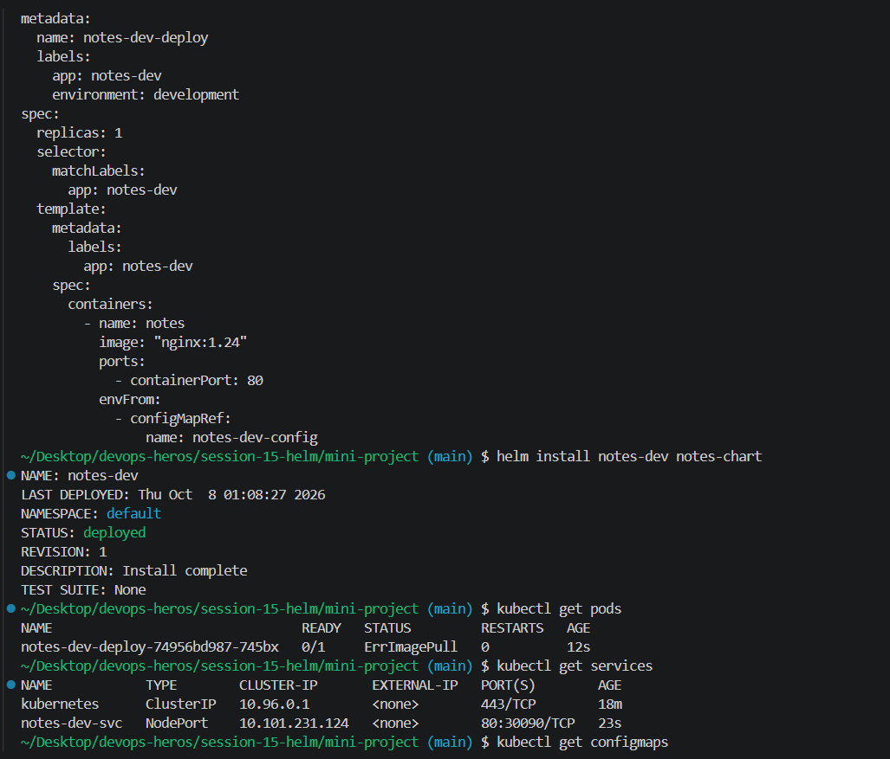
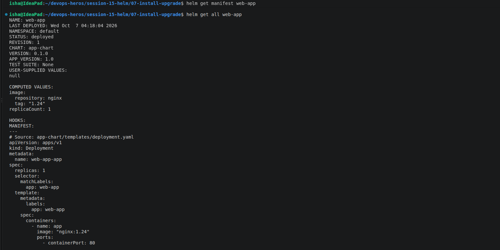

---

# 6. helm upgrade

## Purpose

`helm upgrade` updates an existing Helm release using a new chart configuration.

Initial installation:

```bash
helm install web-app ./app-chart
```

Now upgrade the replica count:

```bash
helm upgrade web-app ./app-chart --set replicaCount=3
```

Expected:

```text
Release "web-app" has been upgraded. Happy Helming!
NAME: web-app
LAST DEPLOYED: ...
NAMESPACE: default
STATUS: deployed
REVISION: 2
```

---

## Verify

```bash
kubectl get pods
```

Expected:

```text
NAME                   READY   STATUS    RESTARTS   AGE
web-app-app-xxxxx      1/1     Running   0          ...
web-app-app-yyyyy      1/1     Running   0          ...
web-app-app-zzzzz      1/1     Running   0          ...
```

The three Pod names will be different in the actual cluster.

---

## Important Concept

```text
helm install
      ↓
Revision 1

helm upgrade
      ↓
Revision 2
```

Every successful upgrade creates a new revision.

---

## Screenshot

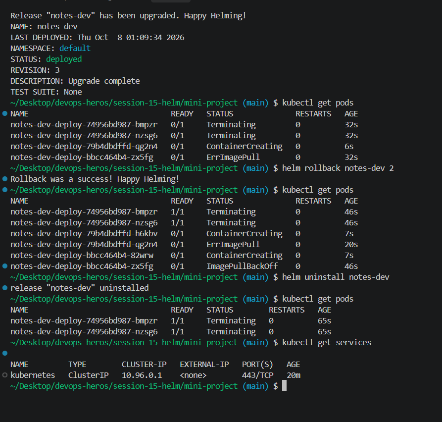

---

# 7. helm history

## Purpose

`helm history` displays all revisions of a Helm release.

Command:

```bash
helm history web-app
```

Example:

```text
REVISION   UPDATED                  STATUS      CHART           DESCRIPTION
1          ...                      superseded  app-chart-0.1.0  Install complete
2          ...                      deployed    app-chart-0.1.0  Upgrade complete
```

---

## Why History Matters

Helm keeps release revisions so that previous configurations can be restored.

For example:

```text
Revision 1 → 1 replica
Revision 2 → 3 replicas
Revision 3 → broken image
Revision 4 → rollback to revision 2
```

---

## Screenshot

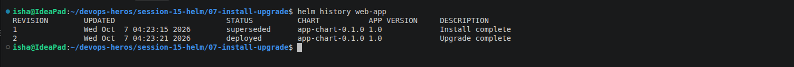

---

# 8. helm rollback

## Purpose

`helm rollback` restores a previous release configuration.

For example:

```bash
helm rollback web-app 1
```

Expected:

```text
Rollback was a success! Happy Helming!
```

Check:

```bash
helm history web-app
```

The history will contain a new revision.

Example:

```text
REVISION   STATUS
1          superseded
2          superseded
3          deployed
```

The important point is:

> Rollback does not delete the old history. It creates a new revision based on the selected previous revision.

---

## Verify

```bash
kubectl get pods
```

If revision 1 had one replica:

```text
NAME                   READY   STATUS    RESTARTS   AGE
web-app-app-xxxxx      1/1     Running   0          ...
```

---

## Screenshot

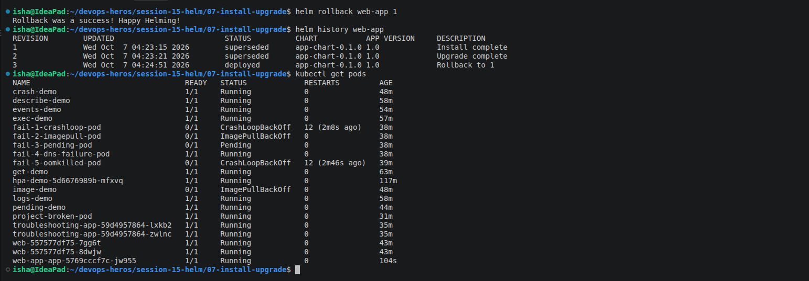

---

# 9. helm uninstall

## Purpose

`helm uninstall` removes a Helm release and the Kubernetes resources managed by that release.

Command:

```bash
helm uninstall web-app
```

Expected:

```text
release "web-app" uninstalled
```

Check:

```bash
helm list
```

The release should no longer appear.

Check:

```bash
kubectl get pods
```

The Pods created by the release should also be removed.

---

## Screenshot

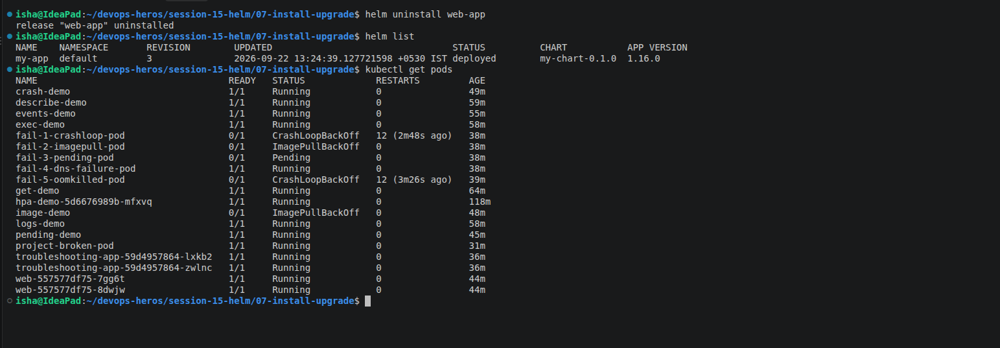

---

# 10. helm repo

Helm repositories contain packaged Helm charts.

---

## Add a Repository

Example:

```bash
helm repo add bitnami https://charts.bitnami.com/bitnami
```

Expected:

```text
"bitnami" has been added to your repositories
```

If the repository already exists, Helm may report that it already exists.

---

## Update Repositories

```bash
helm repo update
```

Example:

```text
Hang tight while we grab the latest from your chart repositories...
...Successfully got an update from the "bitnami" chart repository
Update Complete. ⎈Happy Helming!⎈
```

---

## List Repositories

```bash
helm repo list
```

Example:

```text
NAME      URL
bitnami   https://charts.bitnami.com/bitnami
```

---

## Remove a Repository

```bash
helm repo remove bitnami
```

Expected:

```text
"bitnami" has been removed from your repositories
```

---

## Screenshot

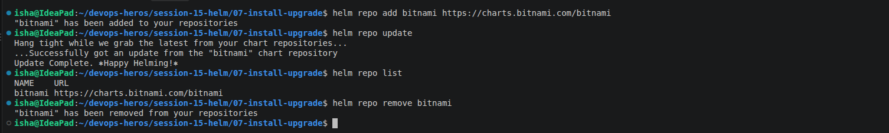

---

# 11. helm search

## Purpose

`helm search` is used to find charts available in repositories.

Search repositories:

```bash
helm search repo nginx
```

Example:

```text
NAME                         CHART VERSION   APP VERSION   DESCRIPTION
bitnami/nginx                ...             ...           NGINX Open Source web server
```

Search Hub:

```bash
helm search hub nginx
```

This searches the Artifact Hub ecosystem.

---

## Difference

```text
helm search repo
        ↓
Search configured local repositories

helm search hub
        ↓
Search Artifact Hub
```

---

---

# Task 1 — Command Summary

| Command | Purpose |
|---|---|
| `helm create` | Create a new Helm chart |
| `helm install` | Install a chart as a release |
| `helm list` | List Helm releases |
| `helm status` | Show release status |
| `helm get` | Inspect release information |
| `helm upgrade` | Upgrade an existing release |
| `helm history` | View release revisions |
| `helm rollback` | Restore a previous revision |
| `helm uninstall` | Remove a release |
| `helm repo` | Manage chart repositories |
| `helm search` | Search for charts |

---

# Task 2 — Complete Helm Rollback Workflow

The rollback workflow performed was:

```text
Install
   ↓
Upgrade
   ↓
Verify
   ↓
Upgrade Again
   ↓
Verify
   ↓
Rollback
   ↓
Verify
```

---

# Step 1 — Install

Use:

```text
07-install-upgrade/app-chart/
```

Install:

```bash
helm install rollback-demo ./07-install-upgrade/app-chart
```

Expected:

```text
NAME: rollback-demo
STATUS: deployed
REVISION: 1
```

Verify:

```bash
helm status rollback-demo
```

Check Pods:

```bash
kubectl get pods
```

Expected:

```text
NAME                          READY   STATUS    RESTARTS
rollback-demo-app-xxxxx      1/1     Running   0
```

---

## Screenshot

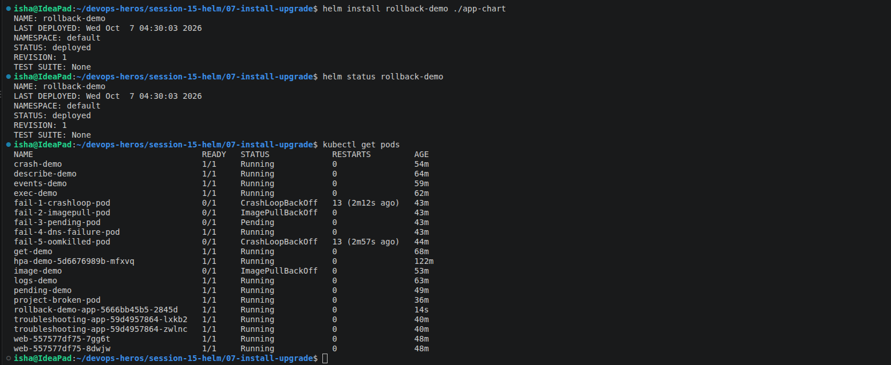

---

# Step 2 — First Upgrade

Upgrade the number of replicas:

```bash
helm upgrade rollback-demo ./07-install-upgrade/app-chart \
  --set replicaCount=3
```

Expected:

```text
Release "rollback-demo" has been upgraded. Happy Helming!
STATUS: deployed
REVISION: 2
```

Verify:

```bash
kubectl get pods
```

Expected:

```text
NAME                          READY   STATUS
rollback-demo-app-aaaa        1/1     Running
rollback-demo-app-bbbb        1/1     Running
rollback-demo-app-cccc        1/1     Running
```

---

## Screenshot

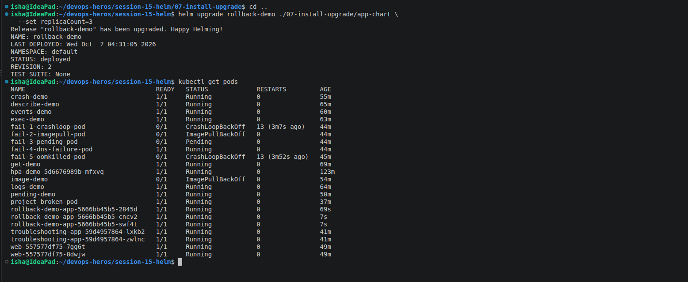

---

# Step 3 — Verify Revision

```bash
helm history rollback-demo
```

Expected:

```text
REVISION   STATUS      DESCRIPTION
1          superseded  Install complete
2          deployed    Upgrade complete
```

Also:

```bash
helm get values rollback-demo
```

and:

```bash
kubectl get deployment
```

The Deployment should have:

```text
READY   UP-TO-DATE   AVAILABLE
3/3     3             3
```

---

# Step 4 — Upgrade Again

Now intentionally introduce a bad image.

Run:

```bash
helm upgrade rollback-demo ./07-install-upgrade/app-chart \
  --set image.tag=doesnotexist
```

Expected:

```text
Release "rollback-demo" has been upgraded. Happy Helming!
STATUS: deployed
REVISION: 3
```

Important:

**Helm can consider the upgrade successful even though the application Pods subsequently fail to become healthy**, unless readiness/atomic behavior causes the command to fail.

Check:

```bash
kubectl get pods
```

Expected:

```text
NAME                          READY   STATUS             RESTARTS
rollback-demo-app-xxxxx      0/1     ImagePullBackOff   0
```

---

## Investigate

```bash
kubectl describe pod <pod-name>
```

Look at Events.

You should find an image pull failure caused by:

```text
nginx:doesnotexist
```

---

## Screenshot

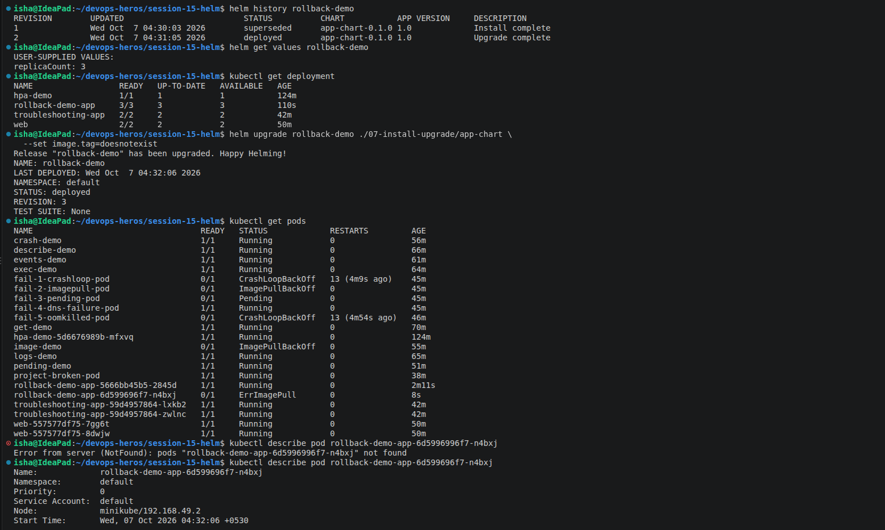
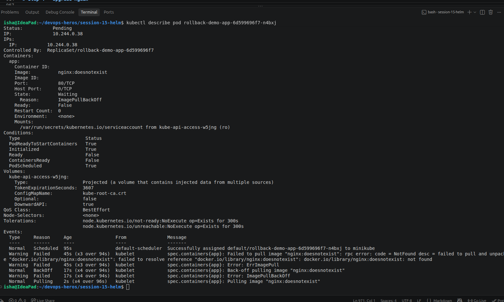

---

# Step 5 — Verify Release History

```bash
helm history rollback-demo
```

Expected:

```text
REVISION   STATUS      DESCRIPTION
1          superseded  Install complete
2          superseded  Upgrade complete
3          deployed    Upgrade complete
```

The exact status can vary depending on how the upgrade behaves, but revision 3 represents the bad configuration.

---

# Step 6 — Rollback

We know revision 2 was healthy.

Rollback:

```bash
helm rollback rollback-demo 2
```

Expected:

```text
Rollback was a success! Happy Helming!
```

---

# Step 7 — Verify After Rollback

Check history:

```bash
helm history rollback-demo
```

Expected:

```text
REVISION   STATUS      DESCRIPTION
1          superseded  Install complete
2          superseded  Upgrade complete
3          superseded  Upgrade complete
4          deployed    Rollback to 2
```

Notice:

> Rollback creates revision 4.

It does not make revision 2 active again directly.

---

## Check Pods

```bash
kubectl get pods
```

Expected:

```text
NAME                          READY   STATUS
rollback-demo-app-aaaa        1/1     Running
rollback-demo-app-bbbb        1/1     Running
rollback-demo-app-cccc        1/1     Running
```

The exact Pod names will vary.

---

## Verify Deployment

```bash
kubectl get deployment
```

Expected:

```text
NAME                 READY   UP-TO-DATE   AVAILABLE
rollback-demo-app    3/3     3            3
```

---

## Screenshot

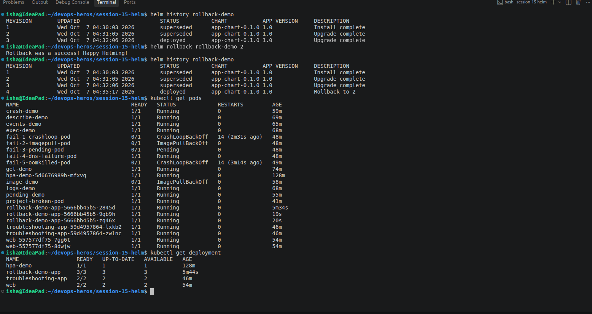

---

# Complete Rollback Workflow

```text
REVISION 1
Install
1 replica
nginx:1.24
Healthy
   │
   ▼
REVISION 2
Upgrade
3 replicas
nginx:1.24
Healthy
   │
   ▼
REVISION 3
Upgrade
nginx:doesnotexist
Broken
   │
   ▼
ROLLBACK TO REVISION 2
   │
   ▼
REVISION 4
Rollback
3 replicas
nginx:1.24
Healthy
```

---

# Task 2 — Rollback Evidence


# Optional — Atomic Upgrade

Helm supports automatic rollback using:

```bash
helm upgrade rollback-demo ./07-install-upgrade/app-chart \
  --set image.tag=doesnotexist \
  --atomic \
  --timeout 60s
```

With `--atomic`, Helm waits for the upgrade to become healthy.

If the upgrade fails within the timeout:

```text
Bad Upgrade
     ↓
Readiness Failure
     ↓
Helm detects failure
     ↓
Automatic Rollback
     ↓
Previous healthy state
```

This is useful in CI/CD pipelines.

---

# Task 3 — Helm Mini Project

# Notes Application

The mini project is located at:

```text
mini-project/
└── notes-chart/
    ├── Chart.yaml
    ├── values.yaml
    ├── values-prod.yaml
    └── templates/
        ├── configmap.yaml
        ├── deployment.yaml
        └── service.yaml
```

---

# Mini Project Architecture

```text
                    Helm
                     │
                     ▼
              notes-chart
                     │
          ┌──────────┼──────────┐
          │          │          │
          ▼          ▼          ▼
      Deployment   Service   ConfigMap
          │          │
          ▼          │
       Nginx Pods ◄──┘
```

---

# 3.1 Chart.yaml

The chart contains:

```yaml
apiVersion: v2
name: notes-chart
description: A simple Notes application Helm chart
type: application
version: 0.1.0
appVersion: "1.0"
```

### Explanation

| Field | Meaning |
|---|---|
| `apiVersion` | Helm chart API version |
| `name` | Chart name |
| `description` | Description |
| `type` | Application chart |
| `version` | Chart version |
| `appVersion` | Application version |

---

# 3.2 values.yaml

Development configuration:

```yaml
replicaCount: 1

image:
  repository: nginx
  tag: "1.24"

service:
  port: 80
  nodePort: 30090

app:
  name: notes-app
  environment: development
```

This provides the default values used by the templates.

---

# 3.3 values-prod.yaml

Production configuration:

```yaml
replicaCount: 3

image:
  repository: nginx
  tag: "1.25"

service:
  port: 80
  nodePort: 30090

app:
  name: notes-app
  environment: production
```

The production values:

- Increase replicas from 1 → 3
- Change the image from `nginx:1.24` → `nginx:1.25`
- Change environment from `development` → `production`

---

# 3.4 ConfigMap Template

The chart uses:

```yaml
apiVersion: v1
kind: ConfigMap
metadata:
  name: {{ .Release.Name }}-config
data:
  APP_NAME: {{ .Values.app.name | quote }}
  ENVIRONMENT: {{ .Values.app.environment | quote }}
```

Helm replaces:

```text
{{ .Release.Name }}
```

and:

```text
{{ .Values.app.environment }}
```

with actual values.

---

# 3.5 Deployment Template

The Deployment uses:

```yaml
replicas: {{ .Values.replicaCount }}
```

and:

```yaml
image: "{{ .Values.image.repository }}:{{ .Values.image.tag }}"
```

Therefore:

Development:

```text
replicaCount = 1
image = nginx:1.24
```

Production:

```text
replicaCount = 3
image = nginx:1.25
```

---

# 3.6 Service Template

The Service uses:

```yaml
type: NodePort
```

with:

```yaml
nodePort: 30090
```

This makes the application accessible through a NodePort.

---

# 3.7 Helm Lint

Go into:

```bash
cd mini-project
```

Run:

```bash
helm lint notes-chart
```

Expected:

```text
==> Linting notes-chart
1 chart(s) linted, 0 chart(s) failed
```

---

## Screenshot

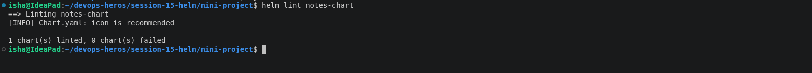

---

# 3.8 Render Templates

Before installing anything, render the chart:

```bash
helm template notes-dev notes-chart
```

This renders the Helm templates into standard Kubernetes YAML.

The output should contain:

```yaml
kind: ConfigMap
```

```yaml
kind: Deployment
```

```yaml
kind: Service
```

And all Helm expressions such as:

```text
{{ .Values.replicaCount }}
```

should have been replaced by actual values.

---

## Screenshot

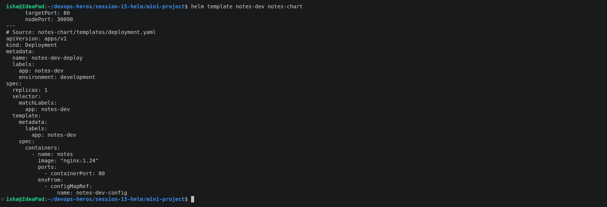

---

# 3.9 Install Development Release

Install:

```bash
helm install notes-dev notes-chart
```

Expected:

```text
NAME: notes-dev
LAST DEPLOYED: ...
NAMESPACE: default
STATUS: deployed
REVISION: 1
```

---

# 3.10 Verify Helm Release

```bash
helm list
```

Expected:

```text
NAME        NAMESPACE   REVISION   STATUS      CHART
notes-dev   default     1          deployed    notes-chart-0.1.0
```

---

# 3.11 Verify Kubernetes Resources

Check Pods:

```bash
kubectl get pods
```

Expected:

```text
NAME                         READY   STATUS    RESTARTS
notes-dev-deploy-xxxxx       1/1     Running   0
```

Check Deployment:

```bash
kubectl get deployment
```

Check Service:

```bash
kubectl get service
```

Check ConfigMap:

```bash
kubectl get configmap
```

---

## Screenshot

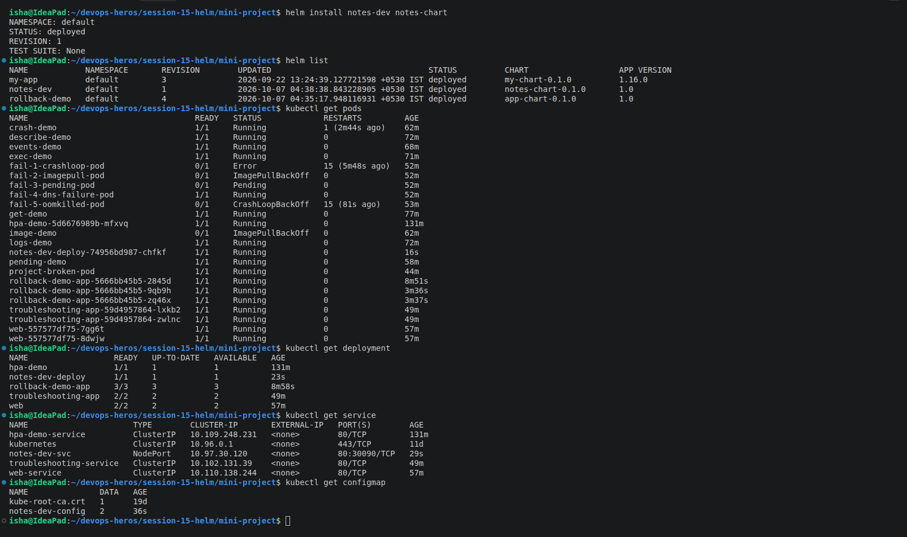

---

# 3.12 Check ConfigMap

```bash
kubectl get configmap notes-dev-config -o yaml
```

Expected:

```yaml
data:
  APP_NAME: notes-app
  ENVIRONMENT: development
```

This verifies that the default `values.yaml` was used.

---

# 3.13 Upgrade to Production

Use:

```bash
helm upgrade notes-dev notes-chart \
  -f notes-chart/values-prod.yaml
```

Expected:

```text
Release "notes-dev" has been upgraded. Happy Helming!
NAME: notes-dev
STATUS: deployed
REVISION: 2
```

---

# 3.14 Verify Production Replicas

Run:

```bash
kubectl get pods
```

Expected:

```text
NAME                         READY   STATUS    RESTARTS
notes-dev-deploy-aaaa       1/1     Running   0
notes-dev-deploy-bbbb       1/1     Running   0
notes-dev-deploy-cccc       1/1     Running   0
```

Three Pods should now be running.

---

# 3.15 Verify Production Configuration

Run:

```bash
kubectl get configmap notes-dev-config -o yaml
```

Expected:

```yaml
data:
  APP_NAME: notes-app
  ENVIRONMENT: production
```

The environment changed from:

```text
development
```

to:

```text
production
```

---

# 3.16 Verify Image

Run:

```bash
kubectl get pods -o jsonpath='{.items[0].spec.containers[0].image}'
```

Expected:

```text
busybox:1.36
```

---

# 3.17 Verify Release History

```bash
helm history notes-dev
```

Expected:

```text
REVISION   STATUS      DESCRIPTION
1          superseded  Install complete
2          deployed    Upgrade complete
```

---

## Screenshot


---

# 3.18 Simulate a Bad Upgrade

Now intentionally deploy an invalid image:

```bash
helm upgrade notes-dev notes-chart \
  --set image.tag=broken-tag-does-not-exist
```

Check:

```bash
kubectl get pods
```

Expected:

```text
NAME                         READY   STATUS             RESTARTS
notes-dev-deploy-xxxxx       0/1     ImagePullBackOff   0
```

Some existing Pods may remain healthy temporarily while the Deployment creates replacement Pods.

Investigate:

```bash
kubectl describe pod <broken-pod-name>
```

The Events section should show an image-pull error.

---

## Screenshot

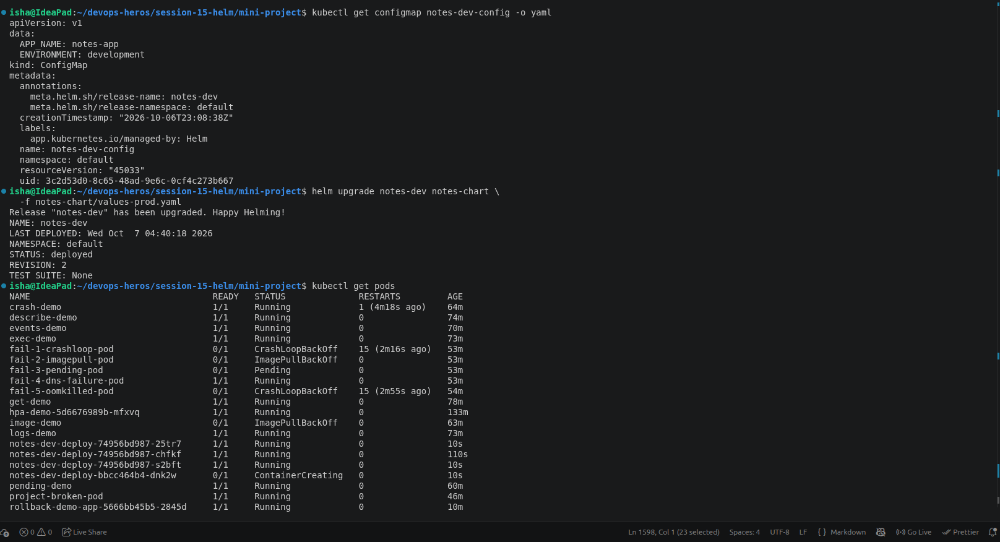
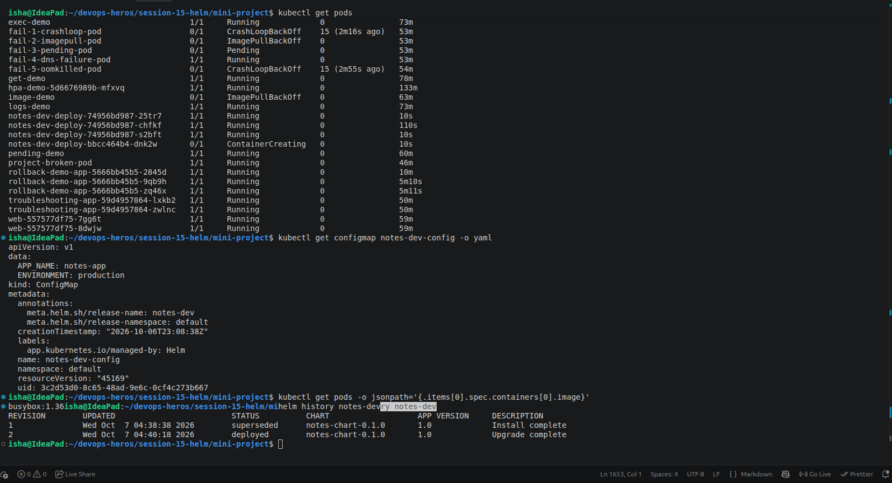

---

# 3.19 Check Helm History

```bash
helm history notes-dev
```

Example:

```text
REVISION   STATUS      DESCRIPTION
1          superseded  Install complete
2          superseded  Upgrade complete
3          deployed    Upgrade complete
```

Revision 2 was the last known healthy production configuration.

---

# 3.20 Rollback

Rollback:

```bash
helm rollback notes-dev 2
```

Expected:

```text
Rollback was a success! Happy Helming!
```

---

# 3.21 Verify Rollback

Check history:

```bash
helm history notes-dev
```

Expected:

```text
REVISION   STATUS      DESCRIPTION
1          superseded  Install complete
2          superseded  Upgrade complete
3          superseded  Upgrade complete
4          deployed    Rollback to 2
```

Check Pods:

```bash
kubectl get pods
```

Expected:

```text
NAME                         READY   STATUS
notes-dev-deploy-aaaa       1/1     Running
notes-dev-deploy-bbbb       1/1     Running
notes-dev-deploy-cccc       1/1     Running
```

Check image:

```bash
kubectl get pods -o jsonpath='{.items[0].spec.containers[0].image}'
```

Expected:

```text
busybox:1.36
```

Check ConfigMap:

```bash
kubectl get configmap notes-dev-config -o yaml
```

Expected:

```yaml
data:
  APP_NAME: notes-app
  ENVIRONMENT: production
```

---

## Screenshot

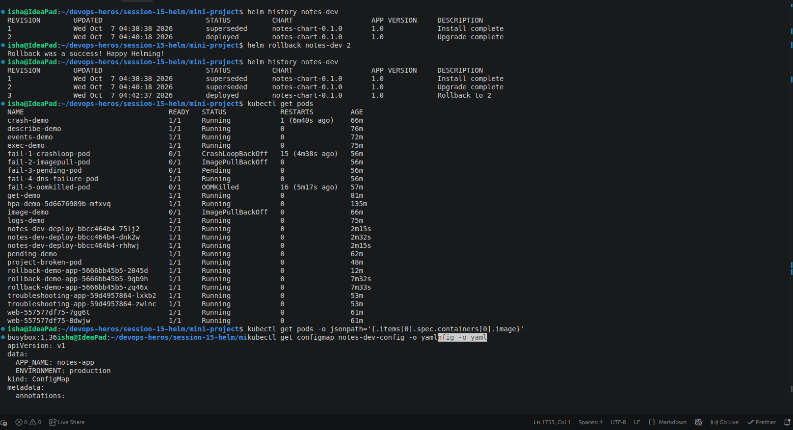
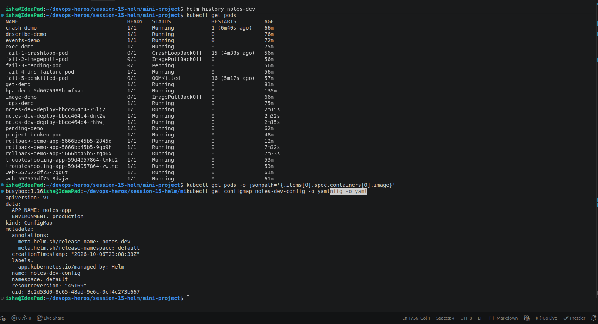


---

# 3.22 Verify Service

```bash
kubectl get service notes-dev-svc
```

Expected:

```text
NAME           TYPE       CLUSTER-IP      EXTERNAL-IP   PORT(S)
notes-dev-svc  NodePort   10.x.x.x        <none>        80:30090/TCP
```

The ClusterIP can vary.

With Minikube:

```bash
minikube service notes-dev-svc --url
```

Example:

```text
http://192.168.49.2:30090
```

The exact URL depends on the Minikube environment.

Test:

```bash
curl <URL>
```

Expected response contains Nginx HTML:

```html
<!DOCTYPE html>
<html>
<head>
<title>Welcome to nginx!</title>
...
```

---

# 3.23 Mini Project Final State

```text
Helm Release: notes-dev
       │
       ▼
Revision 4
       │
       ▼
Production configuration
       │
       ├── replicas: 3
       ├── image: nginx:1.25
       ├── environment: production
       │
       ▼
Deployment
       │
       ├──────────────┬──────────────┐
       ▼              ▼              ▼
     Pod 1          Pod 2          Pod 3
       │              │              │
       └──────────────┼──────────────┘
                      ▼
                 NodePort Service
                      │
                      ▼
                 Port 30090
```

---

# Helm Values Flow

One of the most important concepts demonstrated in this project is how values flow through Helm.

```text
values.yaml
     │
     ▼
Helm Template
     │
     ▼
Rendered Kubernetes YAML
     │
     ▼
Kubernetes Resources
```

For example:

```yaml
replicaCount: 1
```

becomes:

```yaml
replicas: 1
```

After using:

```bash
helm upgrade notes-dev notes-chart \
  -f notes-chart/values-prod.yaml
```

the value becomes:

```yaml
replicaCount: 3
```

and the Deployment becomes:

```yaml
replicas: 3
```

---

# Helm Release Lifecycle

```text
                    Chart
                      │
                      ▼
               helm install
                      │
                      ▼
                 Revision 1
                      │
                      ▼
               helm upgrade
                      │
                      ▼
                 Revision 2
                      │
                      ▼
               helm upgrade
                      │
                      ▼
                 Revision 3
                      │
                      ▼
              Problem Detected
                      │
                      ▼
              helm rollback
                      │
                      ▼
                 Revision 4
                      │
                      ▼
             Healthy Application
```

---

# `values.yaml` vs `--set` vs `-f`

## values.yaml

Default values:

```yaml
replicaCount: 1
```

---

## --set

Override an individual value:

```bash
helm upgrade notes-dev notes-chart \
  --set replicaCount=5
```

---

## -f

Use a complete values file:

```bash
helm upgrade notes-dev notes-chart \
  -f notes-chart/values-prod.yaml
```

For production environments, a version-controlled values file is usually easier to audit and reproduce.

---

# Helm vs Kubernetes YAML

Without Helm:

```text
deployment-dev.yaml
deployment-prod.yaml
deployment-test.yaml
```

With Helm:

```text
Chart
  │
  ├── templates/
  ├── values.yaml
  ├── values-prod.yaml
  └── values-test.yaml
```

The same templates can be reused with different configuration.

---