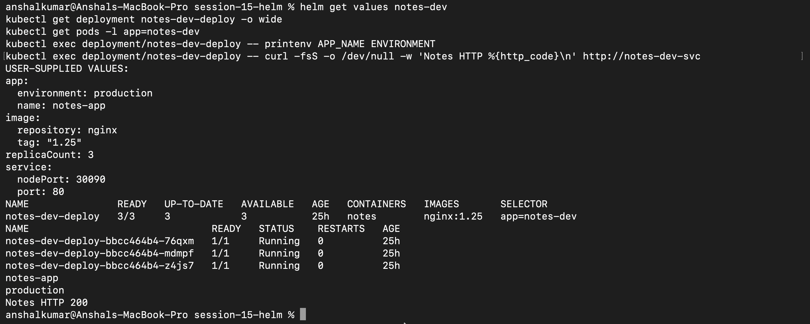
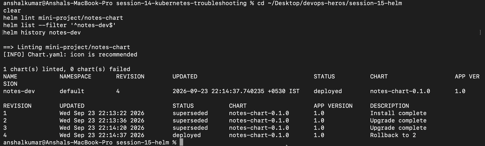

# Session 15 - Helm

I used Helm to package and deploy the Notes application instead of managing each Kubernetes YAML file separately. The chart I completed is in [`mini-project/notes-chart/`](mini-project/notes-chart/).

## Commands I practiced

```bash
helm create notes-chart
helm lint notes-chart
helm template notes-dev notes-chart
helm install notes-dev notes-chart
helm list
helm status notes-dev
helm get values notes-dev
helm get manifest notes-dev
helm upgrade notes-dev notes-chart -f values-prod.yaml
helm history notes-dev
helm rollback notes-dev 2
helm uninstall notes-dev
helm repo add bitnami https://charts.bitnami.com/bitnami
helm repo update
helm search repo nginx
```

The smaller lesson folders contain my notes for each group of commands:

| Folder | Work covered |
|---|---|
| [`01-what-is-helm/`](01-what-is-helm/) | Installation and first commands |
| [`02-helm-charts/`](02-helm-charts/) | Creating and installing a chart |
| [`03-chart-structure/`](03-chart-structure/) | Chart files and directories |
| [`04-chart-yaml/`](04-chart-yaml/) | Chart metadata and versions |
| [`05-values-yaml/`](05-values-yaml/) | Default values and overrides |
| [`06-templates/`](06-templates/) | Helm template syntax |
| [`07-install-upgrade/`](07-install-upgrade/) | Install, upgrade, and history |
| [`08-rollback/`](08-rollback/) | Manual and atomic rollback |
| [`09-deploying-application/`](09-deploying-application/) | Full deployment practice |

## Mini project

I installed the chart as the `notes-dev` release. For the production-style run I changed the application name and environment, used three replicas, and set the Nginx image tag through Helm values. The Deployment reached `3/3`, the Pods were Running, and the Service returned HTTP 200.



## Upgrade and rollback

I performed an install, two upgrades, and then rolled the release back to revision 2. `helm history` showed revisions 1-3 as superseded and revision 4 as the deployed rollback.



This made the difference between a chart and a release clearer to me: the chart is the reusable package in Git, while `notes-dev` is one installed history of that chart in the cluster.

`helm lint` finished with zero failed charts. After checking the final state, I removed the release with `helm uninstall notes-dev`.

The complete values, templates, commands, and expected output are documented in [`mini-project/README.md`](mini-project/README.md).
