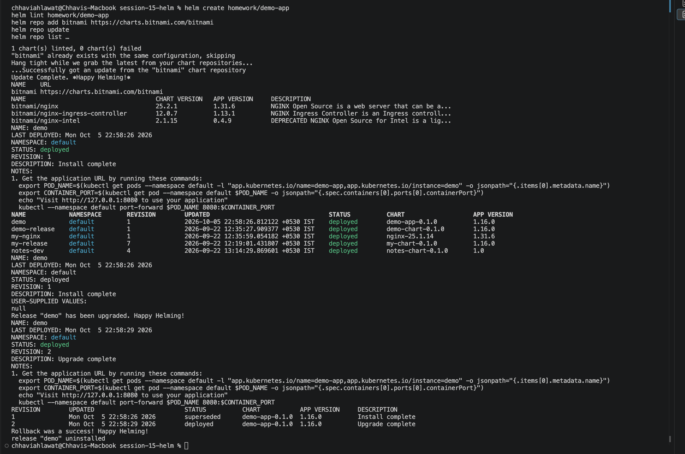
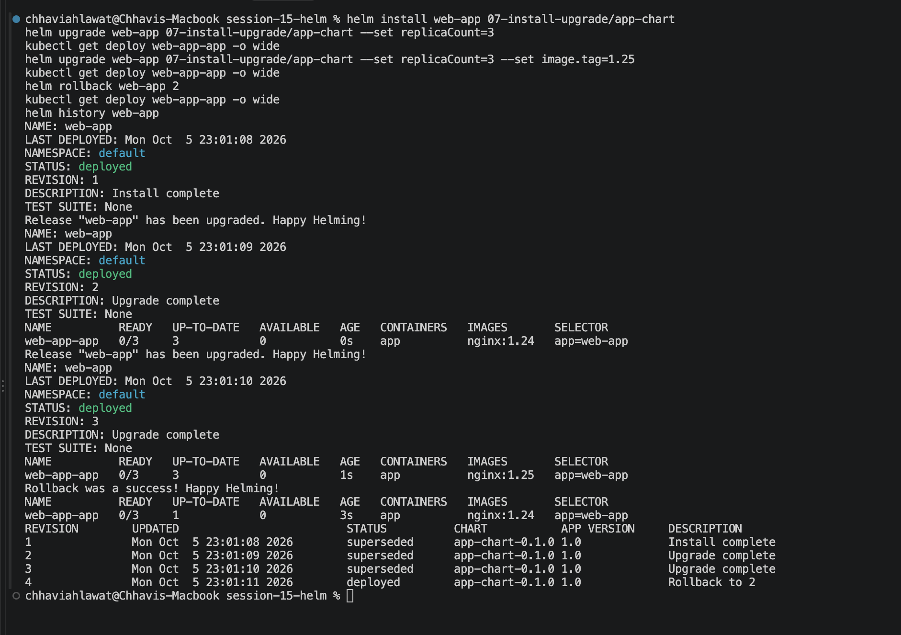
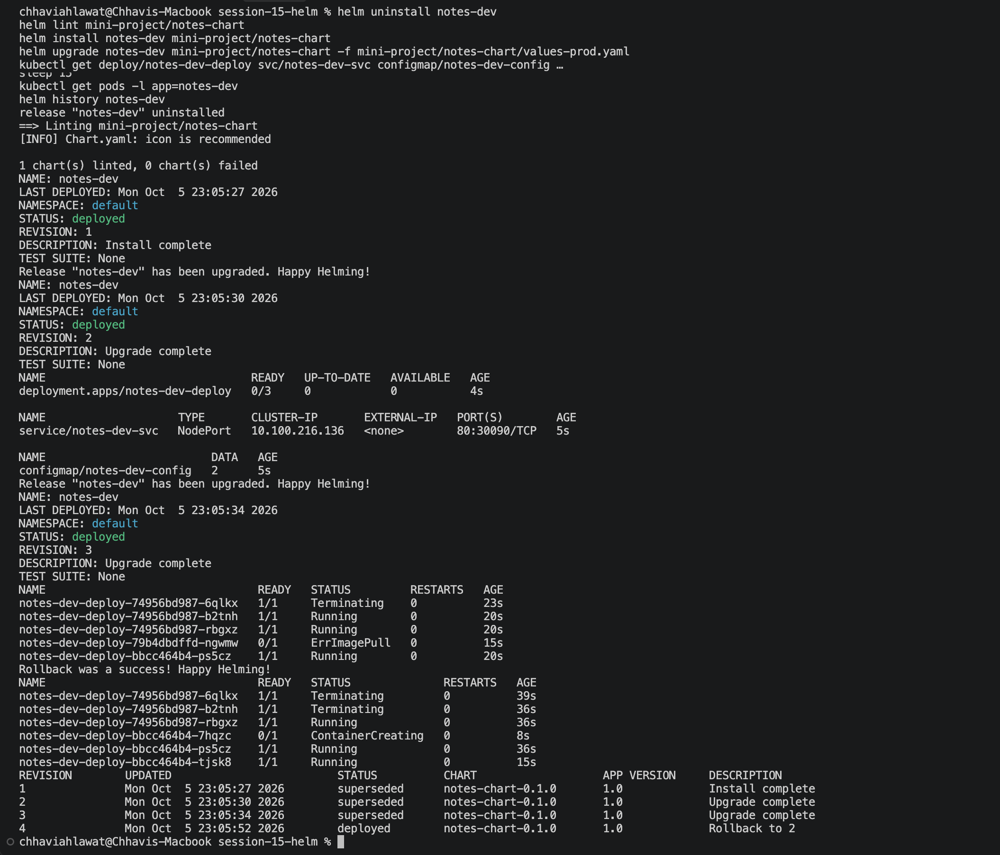

# Session 15 — Helm (Homework)

**Name:** Chhavi Ahlawat
**Enrollment Number:** 24BCS10201
**Email:** chhavi.24bcs10201@sst.scaler.com

---

## Homework Tasks

| Task | Description | Status |
|---|---|---|
| 1 | Helm commands — create, install, list, status, get, upgrade, history, rollback, uninstall, repo, search | ✅ |
| 2 | Rollback workflow — Install → Upgrade → Verify → Upgrade → Verify → Rollback → Verify | ✅ |
| 3 | Mini project — Notes App with `notes-chart` | ✅ |

All commands are run from the `session-15-helm/` folder.

## 1. Helm Commands

```bash
helm create homework/demo-app                    # scaffolds Chart.yaml, values.yaml, templates/
helm lint homework/demo-app
helm repo add bitnami https://charts.bitnami.com/bitnami
helm repo update
helm repo list
helm search repo bitnami/nginx
helm install demo homework/demo-app
helm list
helm status demo | head -6
helm get values demo
helm upgrade demo homework/demo-app --set replicaCount=2
helm history demo
helm rollback demo 1
helm uninstall demo
```


## 2. Rollback Workflow

Chart: `07-install-upgrade/app-chart` (defaults: 1 replica, `nginx:1.24`).

```bash
helm install web-app 07-install-upgrade/app-chart                                         # rev 1
helm upgrade web-app 07-install-upgrade/app-chart --set replicaCount=3                    # rev 2
kubectl get deploy web-app-app -o wide                                                    # verify: 3 x nginx:1.24
helm upgrade web-app 07-install-upgrade/app-chart --set replicaCount=3 --set image.tag=1.25   # rev 3
kubectl get deploy web-app-app -o wide                                                    # verify: nginx:1.25
helm rollback web-app 2                                                                   # rev 4
kubectl get deploy web-app-app -o wide                                                    # verify: back to nginx:1.24
helm history web-app
```
Rollback creates a new revision 4 ("Rollback to 2"). The history is kept, not deleted.



## 3. Mini Project: Notes App

Chart: `mini-project/notes-chart` (ConfigMap + Deployment + NodePort Service). `values-prod.yaml` sets 3 replicas, `nginx:1.25`, environment `production`.

```bash
helm lint mini-project/notes-chart
helm install notes-dev mini-project/notes-chart                                           # rev 1: dev
helm upgrade notes-dev mini-project/notes-chart -f mini-project/notes-chart/values-prod.yaml   # rev 2: prod
kubectl get deploy/notes-dev-deploy svc/notes-dev-svc configmap/notes-dev-config
helm upgrade notes-dev mini-project/notes-chart -f mini-project/notes-chart/values-prod.yaml \
  --set image.tag=broken-tag-does-not-exist                                               # rev 3: bad image
sleep 15
kubectl get pods -l app=notes-dev                                                         # ImagePullBackOff
helm rollback notes-dev 2                                                                 # rev 4
sleep 15
kubectl get pods -l app=notes-dev
helm history notes-dev
```


## Cleanup
```bash
helm uninstall web-app notes-dev
helm list
```
