# Session 15 Homework: Helm

Run on minikube with **Helm v4.3.0**, namespace `helm-hw`. Every command has a real terminal screenshot in `outputs/`; they're also embedded below.

| Task | Where |
|---|---|
| Task 1: Helm commands | [01-commands/](01-commands/) (chart created with `helm create webapp`) |
| Task 2: Rollback workflow | [02-rollback/](02-rollback/) |
| Task 3: Mini project (notes-chart) | [../mini-project/README.md](../mini-project/README.md#my-run--evidence) |

---

## Task 1: Helm commands

| # | Command | What it does | What I saw | Output |
|---|---|---|---|---|
| 1 | `helm create webapp` | Scaffolds a chart: `Chart.yaml`, `values.yaml`, `templates/` (deployment, service, ingress, hpa, httproute, serviceaccount, `_helpers.tpl`, `NOTES.txt`, `tests/`) and `.helmignore` | 12 files created; default image `nginx`, tag empty → falls back to `appVersion` `1.16.0` | [01-helm-create](01-commands/outputs/01-helm-create.png) |
| 2 | `helm repo add / update / list` | Registers chart repositories (like apt sources) and refreshes their indexes | Added `bitnami` and `prometheus-community` | [02-helm-repo](01-commands/outputs/02-helm-repo.png) |
| 3 | `helm search repo nginx`, `search repo --versions`, `search hub grafana`, `show chart` | Searches added repos, or Artifact Hub (`hub`); `--versions` lists every chart version; `show chart` prints a chart's metadata | `bitnami/nginx 25.2.1` (app 1.31.6) | [03-helm-search](01-commands/outputs/03-helm-search.png) |
| 4 | `helm lint`, `helm template`, `helm install web webapp --set replicaCount=2 --wait` | `lint` validates the chart; `template` renders YAML locally without a cluster; `install` renders and creates a *release* (revision 1). `--wait` blocks until resources are Ready | Release `web`, `STATUS: deployed`, `REVISION: 1`, 2 Pods Running | [04-helm-install](01-commands/outputs/04-helm-install.png) |
| 5 | `helm list`, `list -A`, `list -o yaml` | Lists releases in a namespace / all namespaces | `web  helm-hw  1  deployed  webapp-0.1.0  1.16.0` | [05-helm-list](01-commands/outputs/05-helm-list.png) |
| 6 | `helm status web` | Release state, revision, the live resources it owns, and the rendered NOTES | Deployment 2/2, Service, ServiceAccount, Pods | [06-helm-status](01-commands/outputs/06-helm-status.png) |
| 7 | `helm get values` (`--all`), `get manifest`, `get notes`, `get metadata`, `get hooks` | Reads what is *stored* in the release (`kubectl get secrets -l owner=helm` shows the `sh.helm.release.v1.web.v1` Secret that holds it): user-supplied values, all computed values, the exact rendered YAML applied, notes, metadata (incl. `APPLY_METHOD: server-side apply` in Helm 4), and hook resources (the `helm test` Pod) | `USER-SUPPLIED VALUES: replicaCount: 2` | [07a-values](01-commands/outputs/07a-helm-get-values.png), [07b-manifest](01-commands/outputs/07b-helm-get-manifest.png) |
| 8 | `helm upgrade web webapp --reuse-values --set image.tag=1.27`, then `--set replicaCount=3`; `upgrade --install --dry-run` | Creates a new revision with changed values. `--reuse-values` keeps earlier `--set`s. `upgrade --install` is idempotent (install if missing), which is what CI pipelines use. `--dry-run=client` renders without applying | Revisions 2 and 3; live Deployment = `3 replicas, image nginx:1.27`. (Helm 4 deprecates bare `--dry-run` in favour of `--dry-run=client`.) | [08-helm-upgrade](01-commands/outputs/08-helm-upgrade.png) |
| 9 | `helm history web` | Every revision with status and description | 1 superseded, 2 superseded, 3 deployed | [09-helm-history](01-commands/outputs/09-helm-history.png) |
| 10 | `helm rollback web 1` | Re-applies revision 1's manifest **as a new revision** (4, "Rollback to 1"). History is never rewritten | Live Deployment back to `2 replicas, image nginx:1.16.0` | [10-helm-rollback](01-commands/outputs/10-helm-rollback.png) |
| 11 | `helm uninstall web` | Deletes all resources of the release and its history (unless `--keep-history`) | `helm list` empty; Pods terminating; `helm history web` → `release: not found` | [11-helm-uninstall](01-commands/outputs/11-helm-uninstall.png) |

### Screenshots

#### 01-helm-create

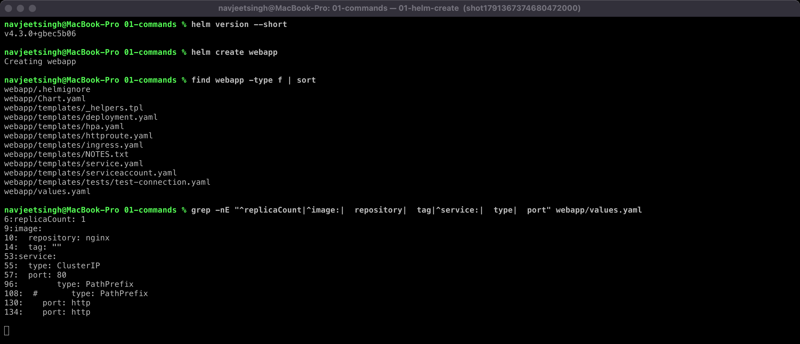

#### 02-helm-repo

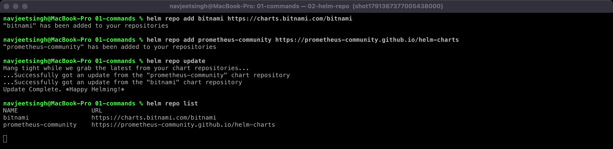

#### 03-helm-search

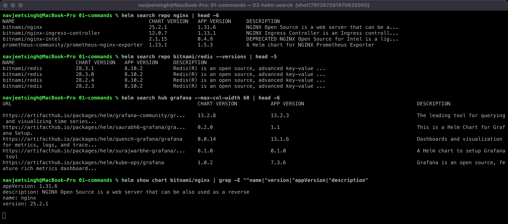

#### 04-helm-install

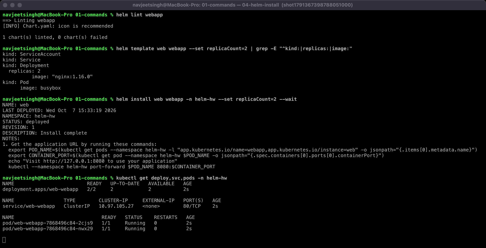

#### 05-helm-list

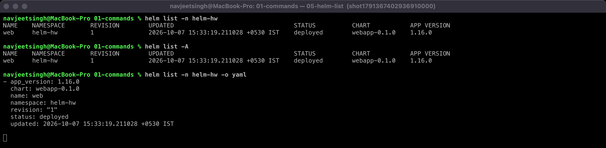

#### 06-helm-status

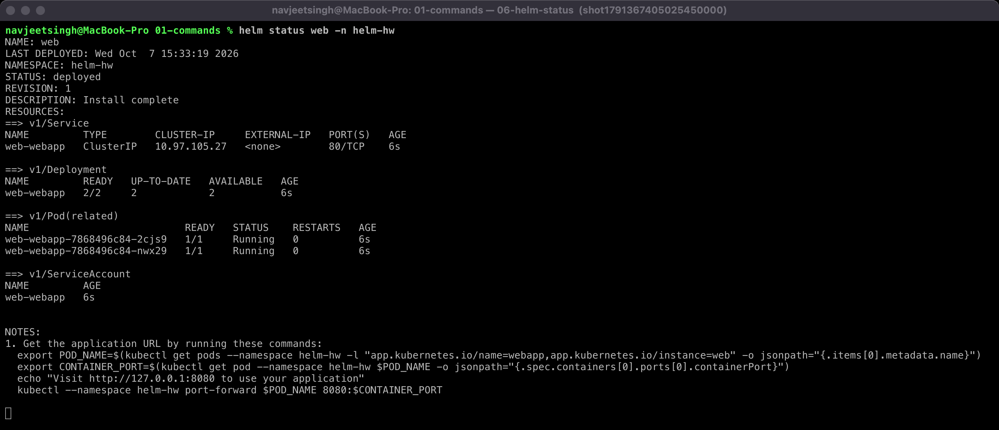

#### 07a-helm-get-values

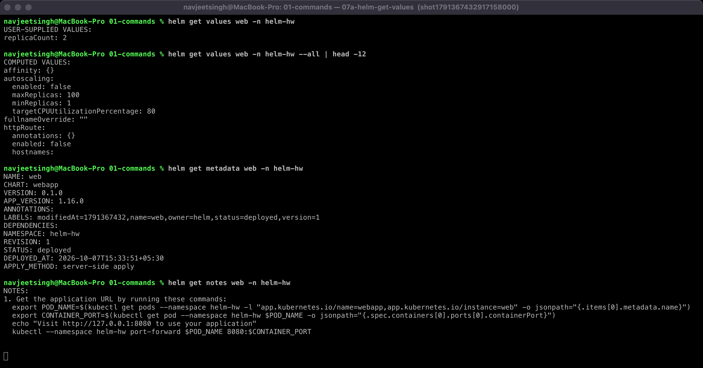

#### 07b-helm-get-manifest

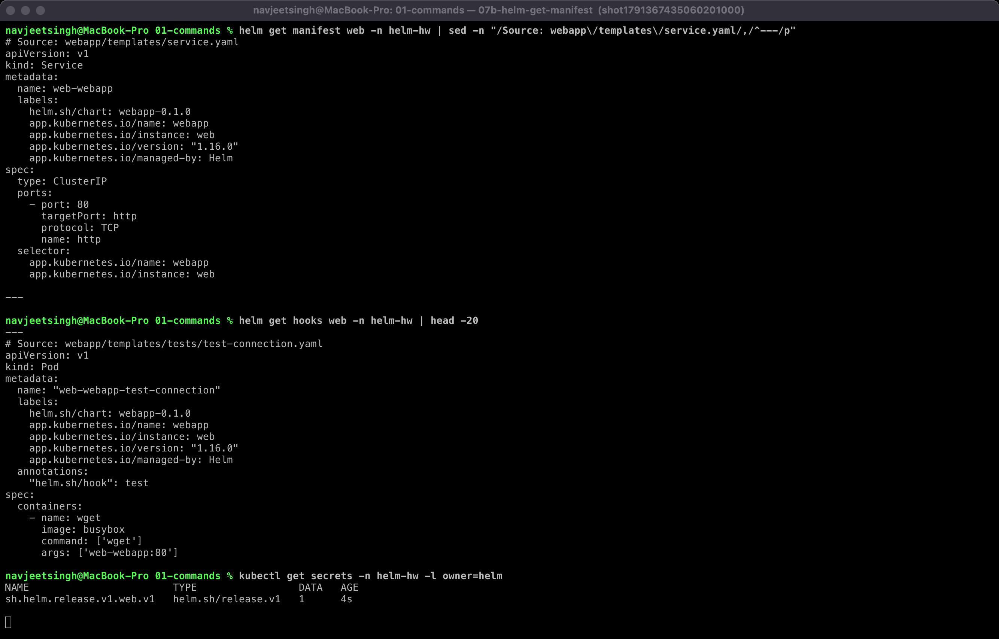

#### 08-helm-upgrade

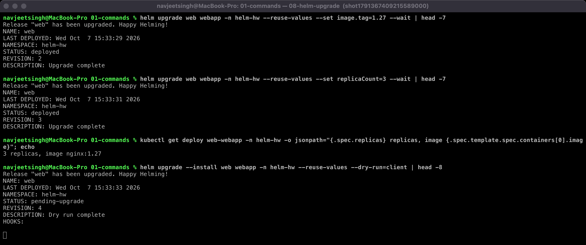

#### 09-helm-history

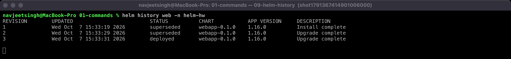

#### 10-helm-rollback

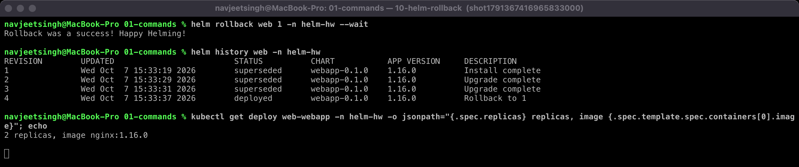

#### 11-helm-uninstall

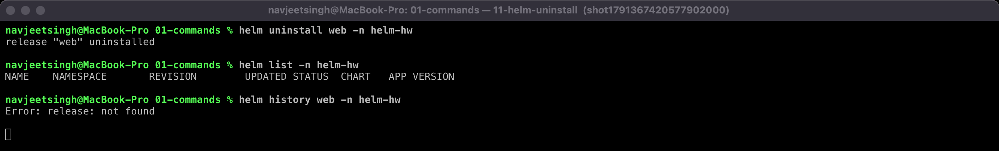

### Notes from doing it
- A **chart** is the package, a **release** is one installed instance of it (`web`, `shop` and `notes-dev` were all separate releases), and a **revision** is one version of a release.
- Helm stores each revision as a Secret (`sh.helm.release.v1.<name>.v<N>`) in the release namespace. That is what `helm get`, `history` and `rollback` read.
- `helm template` + `helm lint` should run before every install. Both work offline.

---

## Task 2: Rollback workflow

Release `shop` from the `webapp` chart. Flow: **Install → Upgrade → Verify → Upgrade again (bad) → Verify → Rollback → Verify**.

| Step | Command | Verify (live state) | Helm history |
|---|---|---|---|
| Install | `helm install shop webapp --set image.tag=1.26 --wait` | `replicas=1 image=nginx:1.26`, 1 Pod Running | 1 deployed |
| Upgrade | `helm upgrade shop webapp --reuse-values --set image.tag=1.27 --set replicaCount=2 --wait` | `replicas=2 image=nginx:1.27`, old Pods terminating, 2 new Running | 1 superseded, 2 deployed |
| Upgrade again (broken tag) | `helm upgrade shop webapp --reuse-values --set image.tag=9.99-broken --wait --timeout 60s` | `Error: UPGRADE FAILED: ... not ready ... Updated: 1/2`. New Pod `ErrImagePull`; the **2 old Pods keep running** (RollingUpdate never removes them until the new one is Ready) | 3 **failed** |
| Rollback | `helm rollback shop 2 --wait` | `replicas=2 image=nginx:1.27`, broken Pod terminating, `curl http://shop-webapp` → **HTTP 200** | 4 deployed "Rollback to 2" |

#### 01-install

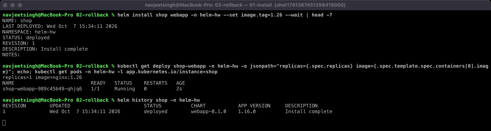

#### 02-upgrade1

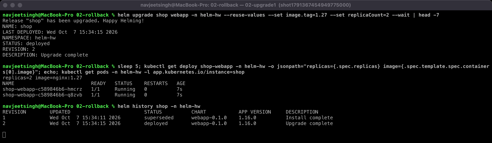

#### 03-upgrade2-bad

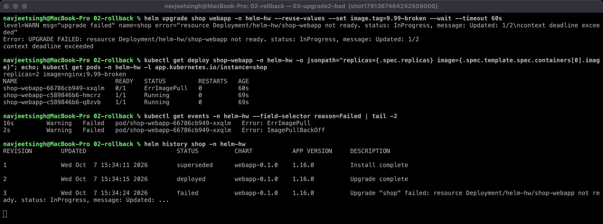

#### 04-rollback

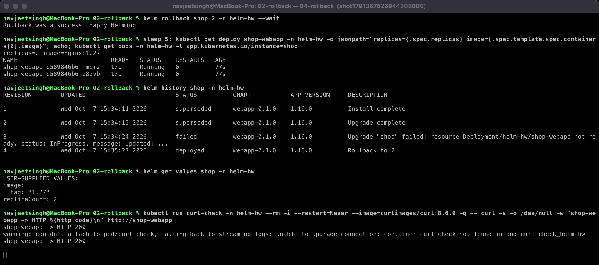

### What I learned
- `--wait` (with `--timeout`) is what turns a bad image into a **failed** release. Without it Helm would report `deployed` as soon as the API accepted the YAML.
- Rollback targets a revision number. I rolled back to **2** (the last good one), not 1.
- After the rollback, `helm get values shop` shows `image.tag: 1.27, replicaCount: 2`, which is exactly revision 2's values.
- `kubectl rollout history` only tracks Pod-template changes of one Deployment. `helm history` tracks the whole release (every object + values), so it is the right tool for Helm-managed apps.
- In Helm 4 you can use `helm upgrade --rollback-on-failure` (the old `--atomic`) to roll back automatically when an upgrade fails.
