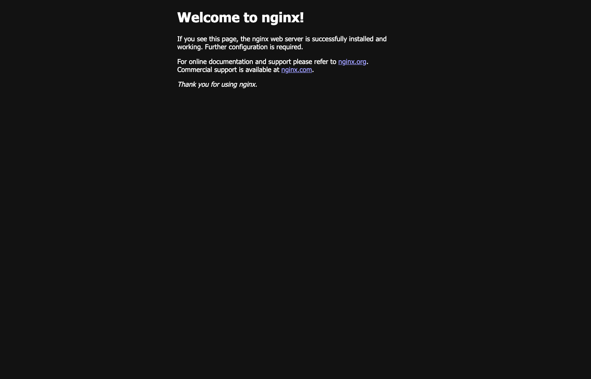

# Task 3 – Mini project: the Notes app packaged with Helm

**Name:** Kushal Talati · **Enrollment No:** 24BCS10123 · chart written from scratch in [`notes-chart/`](notes-chart) · namespace `s15-helm`

Script: [`../scripts/03-mini-project.sh`](../scripts/03-mini-project.sh) · Raw log: [`../logs/03-mini-project.txt`](../logs/03-mini-project.txt) · Screenshots: [`../screenshots/`](../screenshots)

I followed `session-15-helm/mini-project/README.md` step by step. Steps 1–7 are the files, steps 8–15 are the commands.

## Steps 1–7: the chart

```text
notes-chart/
├── Chart.yaml              # name notes-chart, version 0.1.0, appVersion "1.0"
├── values.yaml             # replicaCount 1, nginx:1.24, nodePort 30090, environment: development
├── values-prod.yaml        # replicaCount 3, nginx:1.25, environment: production
└── templates/
    ├── configmap.yaml      # {{ .Release.Name }}-config with APP_NAME and ENVIRONMENT
    ├── deployment.yaml     # {{ .Release.Name }}-deploy, envFrom the ConfigMap, label environment
    └── service.yaml        # {{ .Release.Name }}-svc, NodePort {{ .Values.service.nodePort }}
```

The three things the templates do with values:

```yaml
# templates/deployment.yaml (excerpt)
  replicas: {{ .Values.replicaCount }}
          image: "{{ .Values.image.repository }}:{{ .Values.image.tag }}"
          envFrom:
            - configMapRef:
                name: {{ .Release.Name }}-config
# templates/configmap.yaml
  APP_NAME: {{ .Values.app.name | quote }}
  ENVIRONMENT: {{ .Values.app.environment | quote }}
```

## Step 8–9: lint and render

```text
$ helm lint notes-chart
==> Linting notes-chart
[INFO] Chart.yaml: icon is recommended
1 chart(s) linted, 0 chart(s) failed

$ helm template notes-dev notes-chart            # full render in the log; every {{ }} is replaced:
  name: notes-dev-config        APP_NAME: "notes-app"   ENVIRONMENT: "development"
  name: notes-dev-svc           type: NodePort   port: 80   nodePort: 30090
  name: notes-dev-deploy        replicas: 1      image: "nginx:1.24"

$ helm template notes-prod notes-chart -f notes-chart/values-prod.yaml | grep -E 'replicas|image:|ENVIRONMENT|environment:'
  ENVIRONMENT: "production"
    environment: production
  replicas: 3
          image: "nginx:1.25"
```

## Step 10: install (development)

```text
$ helm install notes-dev notes-chart
NAME: notes-dev
LAST DEPLOYED: Wed Oct  7 23:17:37 2026
NAMESPACE: s15-helm
STATUS: deployed
REVISION: 1

$ kubectl -n s15-helm get pods -l app=notes-dev
NAME                                READY   STATUS    RESTARTS   AGE
notes-dev-deploy-74956bd987-vslwf   1/1     Running   0          0s

$ kubectl -n s15-helm get configmap notes-dev-config -o yaml | sed -n '/^data/,/^kind/p'
data:
  APP_NAME: notes-app
  ENVIRONMENT: development

$ kubectl -n s15-helm exec deploy/notes-dev-deploy -- env | grep -E 'APP_NAME|ENVIRONMENT'
APP_NAME=notes-app
ENVIRONMENT=development
```

`nodePort: 30090` is not one of the ports my kind cluster publishes to the Mac (only 30010–30040, 30080, 80/443 are), so I checked the NodePort from a container on the docker `kind` network and used `kubectl port-forward` for the browser:

```text
$ docker run --rm --network kind curlimages/curl:8.5.0 -s -o /dev/null -w 'NodePort 30090 on node 172.18.0.2: HTTP %{http_code}\n' http://172.18.0.2:30090
NodePort 30090 on node 172.18.0.2: HTTP 200

$ kubectl -n s15-helm port-forward svc/notes-dev-svc 19095:80 &
$ curl -s http://localhost:19095 | grep -o '<title>.*</title>'
<title>Welcome to nginx!</title>
$ curl -s -I http://localhost:19095 | grep -i '^Server'
Server: nginx/1.24.0
```


## Step 11–12: upgrade to production values, history

```text
$ helm upgrade notes-dev notes-chart -f notes-chart/values-prod.yaml
Release "notes-dev" has been upgraded. Happy Helming!
STATUS: deployed
REVISION: 2

$ pods notes-dev                                # rolling from 1 x 1.24 to 3 x 1.25
NAME                                IMAGE        STATUS    READY
notes-dev-deploy-bbcc464b4-ddnfj    nginx:1.25   Running   true
notes-dev-deploy-bbcc464b4-gvrx7    nginx:1.25   Running   true
notes-dev-deploy-bbcc464b4-rjsks    nginx:1.25   Running   true
(+ the 1.24 pods on their way out)

$ kubectl -n s15-helm get deploy notes-dev-deploy -o jsonpath='labels: {.metadata.labels}'
labels: {"app":"notes-dev","app.kubernetes.io/managed-by":"Helm","environment":"production"}

$ kubectl -n s15-helm exec deploy/notes-dev-deploy -- env | grep -E 'APP_NAME|ENVIRONMENT'
APP_NAME=notes-app
ENVIRONMENT=production

$ curl -s -I http://localhost:19095 | grep -i '^Server'
Server: nginx/1.25.5

$ helm history notes-dev
REVISION	STATUS    	CHART            	DESCRIPTION
1       	superseded	notes-chart-0.1.0	Install complete
2       	deployed  	notes-chart-0.1.0	Upgrade complete
```



## Step 13: simulate a bad upgrade

```text
$ helm upgrade notes-dev notes-chart --set image.tag=broken-tag-does-not-exist
Release "notes-dev" has been upgraded. Happy Helming!
STATUS: deployed                                  <- Helm is happy, Kubernetes is not:
REVISION: 3

$ pods notes-dev
NAME                                IMAGE                             STATUS    READY
notes-dev-deploy-79b4dbdffd-6pjcb   nginx:broken-tag-does-not-exist   Pending   false
notes-dev-deploy-bbcc464b4-ddnfj    nginx:1.25                        Running   true

$ kubectl -n s15-helm get pods ... -o custom-columns=NAME,STATE,MSG
notes-dev-deploy-79b4dbdffd-6pjcb   ImagePullBackOff   Back-off pulling image "nginx:broken-tag-does-not-exist": ErrImagePull: rpc error: code = NotFound
```

The Deployment's rolling update keeps the old `1.25` pods serving because the new ReplicaSet never becomes ready – `maxUnavailable` protects the app, but the release is stuck half-way.

## Step 14: rollback to revision 2

```text
$ helm rollback notes-dev 2
Rollback was a success! Happy Helming!

$ pods notes-dev
notes-dev-deploy-bbcc464b4-ckpck    nginx:1.25   Running   true
notes-dev-deploy-bbcc464b4-ddnfj    nginx:1.25   Running   true
notes-dev-deploy-bbcc464b4-sbdh4    nginx:1.25   Running   true
(+ the two broken-tag pods terminating)

$ helm history notes-dev
1	superseded	Install complete
2	superseded	Upgrade complete
3	superseded	Upgrade complete
4	deployed  	Rollback to 2
```

## Step 15: clean up

```text
$ helm uninstall notes-dev
release "notes-dev" uninstalled

$ kubectl -n s15-helm get pods,svc,configmap
pod/notes-dev-deploy-...   Terminating
configmap/kube-root-ca.crt   1      4m20s          <- the only thing left is Kubernetes' own ConfigMap
```

## What I practiced

- [x] Created a Helm chart from scratch (Chart.yaml, values.yaml, three templates)
- [x] Used `values.yaml` and `values-prod.yaml` for two environments from one chart
- [x] `helm lint` + `helm template` before touching the cluster
- [x] `helm install` (dev) → `helm upgrade -f values-prod.yaml` (3 replicas, nginx 1.25, `ENVIRONMENT=production` really inside the pods)
- [x] Simulated a bad upgrade (`ImagePullBackOff`) and saw that Helm still reports `deployed`
- [x] `helm rollback notes-dev 2` → healthy again, history kept
- [x] `helm uninstall` removed Deployment, Service and ConfigMap together
