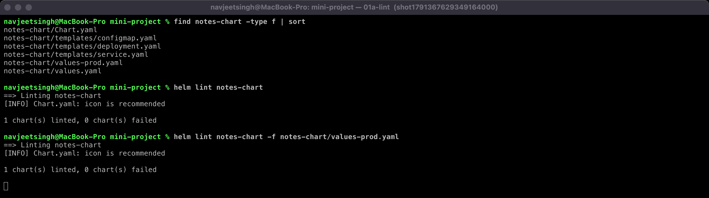
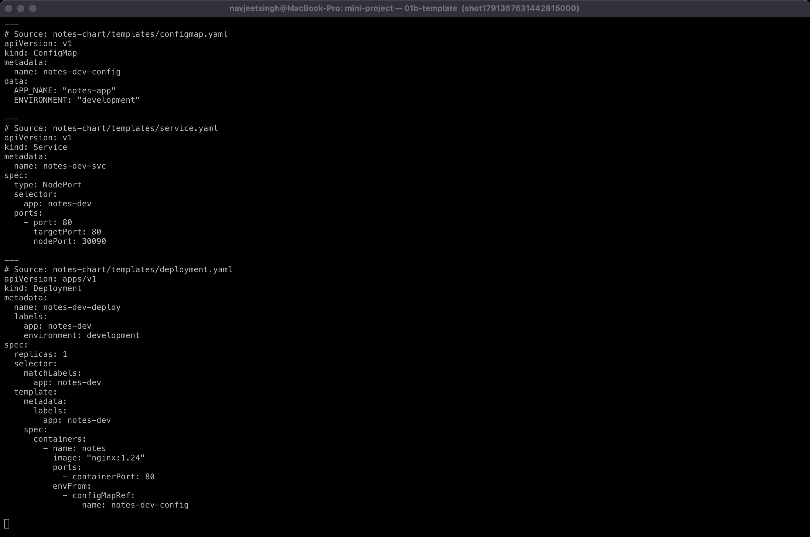
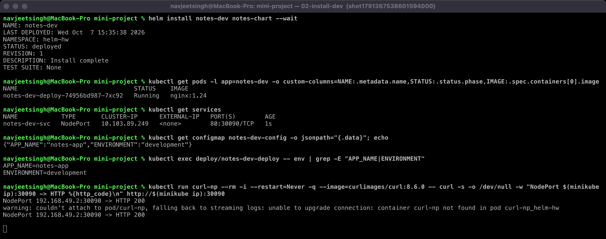
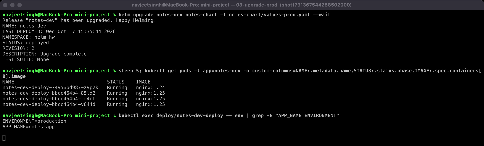
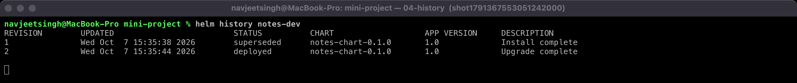
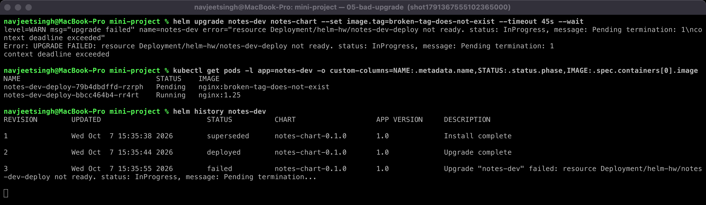
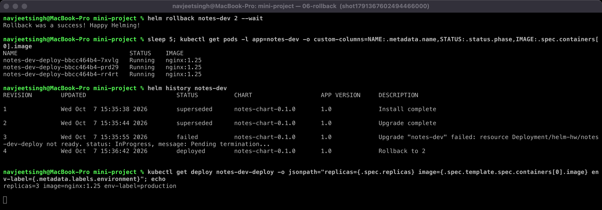
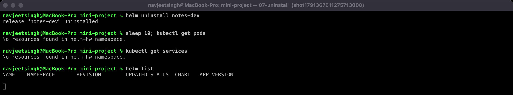

# Mini Project: Package and Deploy the Notes App with Helm

---

## What You Are Building

```text
notes-chart/
  Chart.yaml
  values.yaml
  values-prod.yaml
  templates/
    deployment.yaml
    service.yaml
    configmap.yaml
```

The application is a simple nginx pod that we use to represent a Notes web app.

---

## Step 1: Create the Chart Directory

```bash
mkdir -p notes-chart/templates
```

---

## Step 2: Chart.yaml

`notes-chart/Chart.yaml`:

```yaml
apiVersion: v2
name: notes-chart
description: A simple Notes application Helm chart
type: application
version: 0.1.0
appVersion: "1.0"
```

---

## Step 3: values.yaml

`notes-chart/values.yaml`:

```yaml
replicaCount: 1

image:
  repository: nginx
  tag: "1.24"

service:
  port: 80
  nodePort: 30090

app:
  name: notes-app
  environment: development
```

---

## Step 4: values-prod.yaml

`notes-chart/values-prod.yaml`:

```yaml
replicaCount: 3

image:
  repository: nginx
  tag: "1.25"

service:
  port: 80
  nodePort: 30090

app:
  name: notes-app
  environment: production
```

---

## Step 5: templates/configmap.yaml

`notes-chart/templates/configmap.yaml`:

```yaml
apiVersion: v1
kind: ConfigMap
metadata:
  name: {{ .Release.Name }}-config
data:
  APP_NAME: {{ .Values.app.name | quote }}
  ENVIRONMENT: {{ .Values.app.environment | quote }}
```

---

## Step 6: templates/deployment.yaml

`notes-chart/templates/deployment.yaml`:

```yaml
apiVersion: apps/v1
kind: Deployment
metadata:
  name: {{ .Release.Name }}-deploy
  labels:
    app: {{ .Release.Name }}
    environment: {{ .Values.app.environment }}
spec:
  replicas: {{ .Values.replicaCount }}
  selector:
    matchLabels:
      app: {{ .Release.Name }}
  template:
    metadata:
      labels:
        app: {{ .Release.Name }}
    spec:
      containers:
        - name: notes
          image: "{{ .Values.image.repository }}:{{ .Values.image.tag }}"
          ports:
            - containerPort: {{ .Values.service.port }}
          envFrom:
            - configMapRef:
                name: {{ .Release.Name }}-config
```

---

## Step 7: templates/service.yaml

`notes-chart/templates/service.yaml`:

```yaml
apiVersion: v1
kind: Service
metadata:
  name: {{ .Release.Name }}-svc
spec:
  type: NodePort
  selector:
    app: {{ .Release.Name }}
  ports:
    - port: {{ .Values.service.port }}
      targetPort: {{ .Values.service.port }}
      nodePort: {{ .Values.service.nodePort }}
```

---

## Step 8: Lint

```bash
helm lint notes-chart
```

Expected output:

```text
==> Linting notes-chart
1 chart(s) linted, 0 chart(s) failed
```

---

## Step 9: Render Locally

```bash
helm template notes-dev notes-chart
```

Check that all `{{ }}` are replaced properly.

---

## Step 10: Install (Development)

```bash
helm install notes-dev notes-chart
```

Expected output:

```text
NAME: notes-dev
STATUS: deployed
REVISION: 1
```

Verify:

```bash
kubectl get pods
kubectl get services
kubectl get configmaps
```

Expected pods:

```text
NAME                            READY   STATUS    RESTARTS
notes-dev-deploy-xxxx           1/1     Running   0
```

---

## Step 11: Upgrade to Production Values

```bash
helm upgrade notes-dev notes-chart -f notes-chart/values-prod.yaml
```

Expected output:

```text
Release "notes-dev" has been upgraded.
STATUS: deployed
REVISION: 2
```

Verify 3 pods are running:

```bash
kubectl get pods
```

Expected output:

```text
NAME                            READY   STATUS    RESTARTS
notes-dev-deploy-aaaa           1/1     Running   0
notes-dev-deploy-bbbb           1/1     Running   0
notes-dev-deploy-cccc           1/1     Running   0
```

---

## Step 12: Check Release History

```bash
helm history notes-dev
```

Expected output:

```text
REVISION   STATUS      DESCRIPTION
1          superseded  Install complete
2          deployed    Upgrade complete
```

---

## Step 13: Simulate a Bad Upgrade

```bash
helm upgrade notes-dev notes-chart --set image.tag=broken-tag-does-not-exist
```

Check pods:

```bash
kubectl get pods
```

Expected output:

```text
NAME                            READY   STATUS             RESTARTS
notes-dev-deploy-xxxx           0/1     ImagePullBackOff   0
```

---

## Step 14: Rollback to Revision 2

```bash
helm rollback notes-dev 2
```

Expected output:

```text
Rollback was a success! Happy Helming!
```

Pods are healthy again:

```bash
kubectl get pods
```

```text
NAME                            READY   STATUS    RESTARTS
notes-dev-deploy-aaaa           1/1     Running   0
notes-dev-deploy-bbbb           1/1     Running   0
notes-dev-deploy-cccc           1/1     Running   0
```

---

## Step 15: Clean Up

```bash
helm uninstall notes-dev
kubectl get pods
kubectl get services
```

All resources are gone.

---

## What You Practiced

```text
[PASS] Created a Helm chart from scratch
[PASS] Used values.yaml and values-prod.yaml
[PASS] Deployed to Kubernetes with helm install
[PASS] Upgraded the release with different values
[PASS] Simulated a bad upgrade (broken image tag)
[PASS] Rolled back to a healthy revision
[PASS] Cleaned up with helm uninstall
```

---

## Reference

* **Helm best practices:** https://helm.sh/docs/chart_best_practices/
* **Helm CLI reference:** https://helm.sh/docs/helm/

---

## My Run — Evidence

Executed on minikube with Helm v4.3.0 in namespace `helm-hw`. Every step has a real terminal screenshot (embedded below the table).

| Step | Result | Output |
|---|---|---|
| Lint + render (Steps 8–9) | `1 chart(s) linted, 0 chart(s) failed` for both `values.yaml` and `values-prod.yaml`; `helm template` fully rendered every `{{ }}` (ConfigMap `notes-dev-config`, NodePort Service `30090`, Deployment `nginx:1.24`) | [01a-lint](outputs/01a-lint.png), [01b-template](outputs/01b-template.png) |
| Install dev (Step 10) | `REVISION: 1`, 1 Pod `nginx:1.24`, Service `80:30090/TCP`, env `APP_NAME=notes-app ENVIRONMENT=development` from the ConfigMap; `http://<minikube-ip>:30090` → **HTTP 200** | [02-install-dev](outputs/02-install-dev.png) |
| Upgrade to prod (Step 11) | `REVISION: 2`, 3 Pods `nginx:1.25`, env now `ENVIRONMENT=production` | [03-upgrade-prod](outputs/03-upgrade-prod.png) |
| History (Step 12) | 1 superseded, 2 deployed | [04-history](outputs/04-history.png) |
| Bad upgrade (Step 13) | `UPGRADE FAILED ... context deadline exceeded`; new Pod stuck pulling `nginx:broken-tag-does-not-exist`; revision 3 = **failed** | [05-bad-upgrade](outputs/05-bad-upgrade.png) |
| Rollback (Step 14) | `helm rollback notes-dev 2` → revision 4 "Rollback to 2"; Deployment back to `replicas=3 image=nginx:1.25 environment=production` | [06-rollback](outputs/06-rollback.png) |
| Clean up (Step 15) | `helm uninstall` → no Pods, no Services, `helm list` empty | [07-uninstall](outputs/07-uninstall.png) |

### Screenshots

#### 01a-lint



#### 01b-template



#### 02-install-dev



#### 03-upgrade-prod



#### 04-history



#### 05-bad-upgrade



#### 06-rollback



#### 07-uninstall



### Things I noticed

1. **The bad upgrade also silently reverted to dev settings.** Step 13 runs `helm upgrade notes-dev notes-chart --set image.tag=...` *without* `-f values-prod.yaml`. A plain `helm upgrade` starts again from the chart's `values.yaml`, so revision 3 also meant `replicaCount: 1` and `environment: development`. That is why only **one** old Pod stayed running during the failed upgrade, instead of three. In real life: always pass the same `-f` files on every upgrade, or use `--reuse-values` / `--reset-then-reuse-values`.
2. ConfigMap changes don't restart Pods by themselves. Here the image tag changed at the same time, so Pods were replaced. A common chart trick is a `checksum/config` annotation on the Pod template, so that a config change triggers a rollout.
3. `nodePort: 30090` is hard-coded in both values files. Two releases of this chart in one cluster would conflict, so it's better to leave nodePort empty and let Kubernetes assign one.
