# Mini Project: Package and Deploy the Notes App with Helm

Package a simple "Notes" web app as a Helm chart, then use it to:
- deploy to a **development** environment
- upgrade to **production** values
- simulate a bad release
- **roll back**

Everything below was run on a real cluster. The outputs and screenshots come from that run.

```text
Helm version : v4.3.0
Cluster      : minikube profile "session13" (Kubernetes v1.37.0)
Namespace    : helm-lab
Release      : notes-dev
```

---

## What You Are Building

```text
notes-chart/
  Chart.yaml            chart metadata (name, chart version, appVersion)
  values.yaml           default (development) configuration
  values-prod.yaml      production overrides
  templates/
    _helpers.tpl        shared label templates
    configmap.yaml      app settings + the index.html page served by nginx
    deployment.yaml     nginx pods, env from ConfigMap, readiness probe, resources
    service.yaml        NodePort service
    NOTES.txt           message printed after install/upgrade
```

The app is nginx serving an HTML page generated from Helm values. The page shows which **environment** and **image** are live, so each install, upgrade and rollback can be checked with `curl`.

```text
             values.yaml / values-prod.yaml / --set
                              │
                              ▼
   ┌──────────────┐    ┌──────────────┐    ┌──────────────┐
   │  ConfigMap   │──▶ │  Deployment  │◀── │   Service    │
   │ APP_NAME     │env │ nginx:<tag>  │    │ NodePort     │
   │ ENVIRONMENT  │+vol│ x replicas   │    │ 80:30090     │
   │ index.html   │    │ readiness /  │    └──────────────┘
   └──────────────┘    └──────────────┘
```

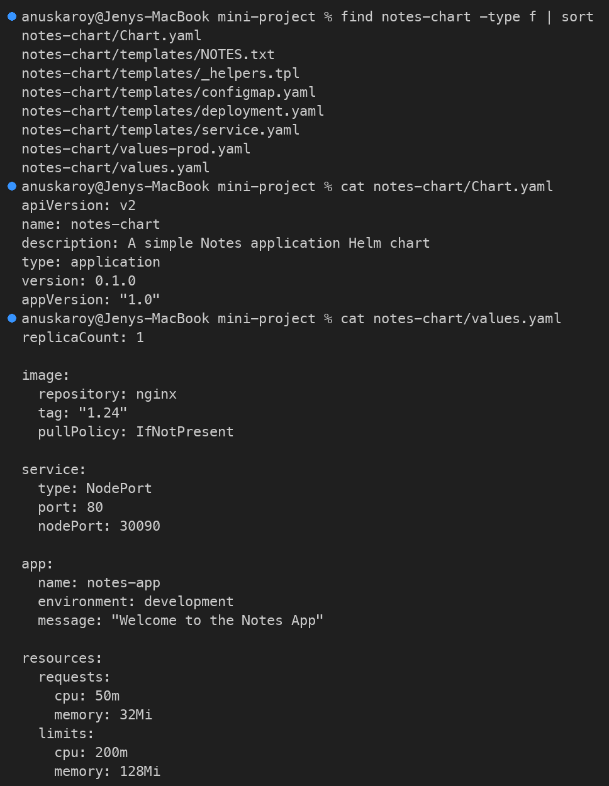

---

## Step 1: Chart.yaml

[`notes-chart/Chart.yaml`](notes-chart/Chart.yaml)

```yaml
apiVersion: v2
name: notes-chart
description: A simple Notes application Helm chart
type: application
version: 0.1.0      # version of the chart (packaging)
appVersion: "1.0"   # version of the application
```

---

## Step 2: values.yaml (development defaults)

[`notes-chart/values.yaml`](notes-chart/values.yaml)

```yaml
replicaCount: 1

image:
  repository: nginx
  tag: "1.24"
  pullPolicy: IfNotPresent

service:
  type: NodePort
  port: 80
  nodePort: 30090

app:
  name: notes-app
  environment: development
  message: "Welcome to the Notes App"

resources:
  requests:
    cpu: 50m
    memory: 32Mi
  limits:
    cpu: 200m
    memory: 128Mi
```

## Step 3: values-prod.yaml (production overrides)

[`notes-chart/values-prod.yaml`](notes-chart/values-prod.yaml)

```yaml
replicaCount: 3

image:
  repository: nginx
  tag: "1.25"

service:
  type: NodePort
  port: 80
  nodePort: 30090

app:
  name: notes-app
  environment: production
  message: "Notes App - Production"

resources:
  requests:
    cpu: 100m
    memory: 64Mi
  limits:
    cpu: 500m
    memory: 256Mi
```

---

## Step 4: Templates

### templates/_helpers.tpl

Named templates, so labels are defined once and reused (`include`).

```yaml
{{/* Common labels applied to every resource */}}
{{- define "notes-chart.labels" -}}
app: {{ .Release.Name }}
environment: {{ .Values.app.environment }}
helm.sh/chart: {{ .Chart.Name }}-{{ .Chart.Version }}
app.kubernetes.io/managed-by: {{ .Release.Service }}
{{- end }}

{{/* Selector labels (must never change between upgrades) */}}
{{- define "notes-chart.selectorLabels" -}}
app: {{ .Release.Name }}
{{- end }}
```

### templates/configmap.yaml

```yaml
apiVersion: v1
kind: ConfigMap
metadata:
  name: {{ .Release.Name }}-config
  labels:
    {{- include "notes-chart.labels" . | nindent 4 }}
data:
  APP_NAME: {{ .Values.app.name | quote }}
  ENVIRONMENT: {{ .Values.app.environment | quote }}
  index.html: |
    <h1>{{ .Values.app.message }}</h1>
    <p>app={{ .Values.app.name }} env={{ .Values.app.environment }} image={{ .Values.image.repository }}:{{ .Values.image.tag }} release={{ .Release.Name }}</p>
```

### templates/deployment.yaml

```yaml
apiVersion: apps/v1
kind: Deployment
metadata:
  name: {{ .Release.Name }}-deploy
  labels:
    {{- include "notes-chart.labels" . | nindent 4 }}
spec:
  replicas: {{ .Values.replicaCount }}
  selector:
    matchLabels:
      {{- include "notes-chart.selectorLabels" . | nindent 6 }}
  template:
    metadata:
      labels:
        {{- include "notes-chart.selectorLabels" . | nindent 8 }}
      annotations:
        # Changing the ConfigMap changes this hash, which forces a rolling restart
        checksum/config: {{ include (print $.Template.BasePath "/configmap.yaml") . | sha256sum }}
    spec:
      containers:
        - name: notes
          image: "{{ .Values.image.repository }}:{{ .Values.image.tag }}"
          imagePullPolicy: {{ .Values.image.pullPolicy | default "IfNotPresent" }}
          ports:
            - containerPort: {{ .Values.service.port }}
          envFrom:
            - configMapRef:
                name: {{ .Release.Name }}-config
          readinessProbe:
            httpGet:
              path: /
              port: {{ .Values.service.port }}
            initialDelaySeconds: 2
            periodSeconds: 5
          resources:
            {{- toYaml .Values.resources | nindent 12 }}
          volumeMounts:
            - name: html
              mountPath: /usr/share/nginx/html/index.html
              subPath: index.html
      volumes:
        - name: html
          configMap:
            name: {{ .Release.Name }}-config
```

Template features used:

| Feature | Where |
|---------|-------|
| `.Values`, `.Release`, `.Chart` built-in objects | everywhere |
| `include` + `nindent` | labels from `_helpers.tpl` |
| `quote`, `default` | ConfigMap values, `pullPolicy` |
| `toYaml` | `resources` block |
| `sha256sum` checksum annotation | restarts pods when the ConfigMap changes (a ConfigMap change alone does not restart pods) |
| `if eq` conditional | `nodePort` only when `type: NodePort` |

### templates/service.yaml

```yaml
apiVersion: v1
kind: Service
metadata:
  name: {{ .Release.Name }}-svc
  labels:
    {{- include "notes-chart.labels" . | nindent 4 }}
spec:
  type: {{ .Values.service.type | default "NodePort" }}
  selector:
    {{- include "notes-chart.selectorLabels" . | nindent 4 }}
  ports:
    - port: {{ .Values.service.port }}
      targetPort: {{ .Values.service.port }}
      {{- if eq (.Values.service.type | default "NodePort") "NodePort" }}
      nodePort: {{ .Values.service.nodePort }}
      {{- end }}
```

### templates/NOTES.txt

```text
Notes App deployed!

  Release:     {{ .Release.Name }} (revision {{ .Release.Revision }})
  Environment: {{ .Values.app.environment }}
  Image:       {{ .Values.image.repository }}:{{ .Values.image.tag }}
  Replicas:    {{ .Values.replicaCount }}

Access the app:
  kubectl port-forward -n {{ .Release.Namespace }} svc/{{ .Release.Name }}-svc 8080:{{ .Values.service.port }}
  curl http://localhost:8080
```

---

## Step 5: Lint

```bash
helm lint notes-chart
helm lint notes-chart -f notes-chart/values-prod.yaml
```

```text
==> Linting notes-chart
[INFO] Chart.yaml: icon is recommended

1 chart(s) linted, 0 chart(s) failed
==> Linting notes-chart
[INFO] Chart.yaml: icon is recommended

1 chart(s) linted, 0 chart(s) failed
```

The chart lints cleanly with both values files. The `[INFO]` line is only a recommendation.

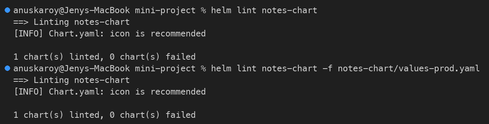

## Step 6: Render Locally

```bash
helm template notes-dev notes-chart -n helm-lab
```

Every `{{ }}` is replaced. For example, the ConfigMap renders as:

```yaml
apiVersion: v1
kind: ConfigMap
metadata:
  name: notes-dev-config
  labels:
    app: notes-dev
    environment: development
    helm.sh/chart: notes-chart-0.1.0
    app.kubernetes.io/managed-by: Helm
data:
  APP_NAME: "notes-app"
  ENVIRONMENT: "development"
  index.html: |
    <h1>Welcome to the Notes App</h1>
    <p>app=notes-app env=development image=nginx:1.24 release=notes-dev</p>
```

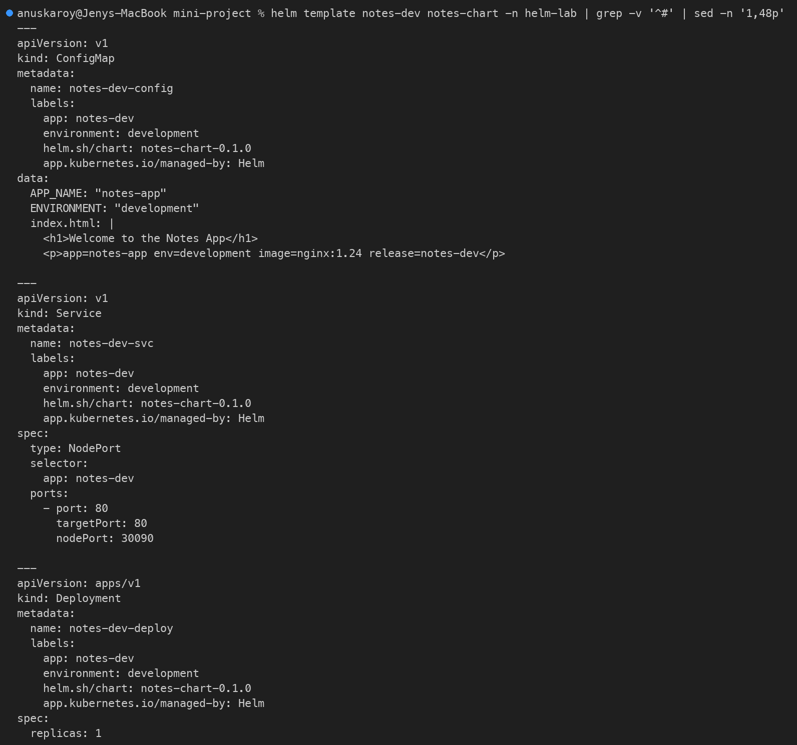

---

## Step 7: Installation (Development)

```bash
helm install notes-dev notes-chart -n helm-lab --wait --timeout 3m
```

```text
NAME: notes-dev
LAST DEPLOYED: Wed Oct  7 19:45:49 2026
NAMESPACE: helm-lab
STATUS: deployed
REVISION: 1
DESCRIPTION: Install complete
TEST SUITE: None
NOTES:
Notes App deployed!

  Release:     notes-dev (revision 1)
  Environment: development
  Image:       nginx:1.24
  Replicas:    1

Access the app:
  kubectl port-forward -n helm-lab svc/notes-dev-svc 8080:80
  curl http://localhost:8080
```

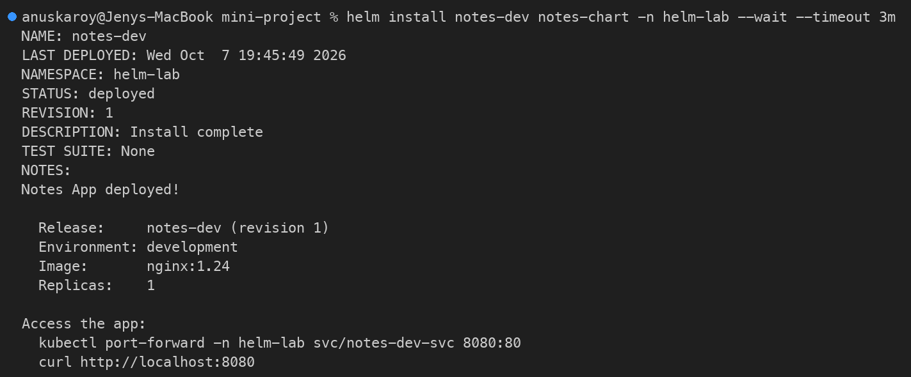

**Verify:**

```bash
helm list -n helm-lab
kubectl get pods,svc,configmap -n helm-lab -l app=notes-dev
kubectl exec -n helm-lab deploy/notes-dev-deploy -- curl -s localhost
kubectl exec -n helm-lab deploy/notes-dev-deploy -- printenv APP_NAME ENVIRONMENT
```

```text
NAME            NAMESPACE       REVISION        UPDATED                                 STATUS          CHART                   APP VERSION
notes-dev       helm-lab        1               2026-10-07 19:45:49.54944 +0530 IST     deployed        notes-chart-0.1.0       1.0
NAME                                    READY   STATUS    RESTARTS   AGE
pod/notes-dev-deploy-7576d6cbd6-7smqd   1/1     Running   0          35s

NAME                    TYPE       CLUSTER-IP       EXTERNAL-IP   PORT(S)        AGE
service/notes-dev-svc   NodePort   10.100.135.192   <none>        80:30090/TCP   36s

NAME                         DATA   AGE
configmap/notes-dev-config   3      37s
<h1>Welcome to the Notes App</h1>
<p>app=notes-app env=development image=nginx:1.24 release=notes-dev</p>
notes-app
development
```

✅ 1 pod is running and the NodePort is 30090. The page and the environment variables both show the **development** values.

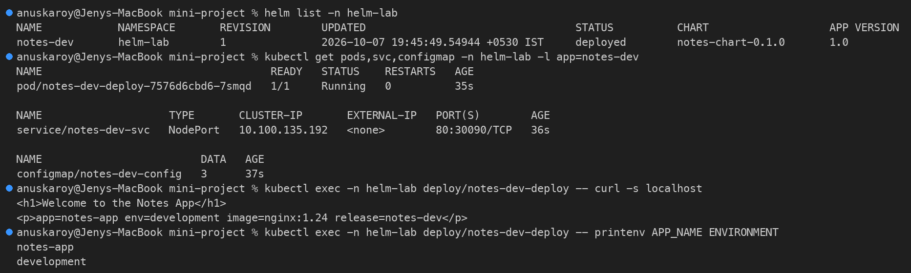

---

## Step 8: Upgrade (to Production Values)

```bash
helm upgrade notes-dev notes-chart -n helm-lab -f notes-chart/values-prod.yaml --wait --timeout 3m
```

```text
Release "notes-dev" has been upgraded. Happy Helming!
NAME: notes-dev
LAST DEPLOYED: Wed Oct  7 19:46:44 2026
NAMESPACE: helm-lab
STATUS: deployed
REVISION: 2
DESCRIPTION: Upgrade complete
TEST SUITE: None
NOTES:
Notes App deployed!

  Release:     notes-dev (revision 2)
  Environment: production
  Image:       nginx:1.25
  Replicas:    3
...
```

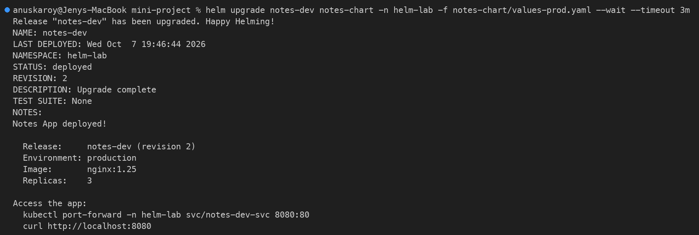

**Verify:**

```bash
kubectl get pods -n helm-lab -l app=notes-dev
kubectl get deploy notes-dev-deploy -n helm-lab -o jsonpath='{.spec.replicas} replicas, image={.spec.template.spec.containers[0].image}, env={.metadata.labels.environment}{"\n"}'
kubectl exec -n helm-lab deploy/notes-dev-deploy -- curl -s localhost
helm history notes-dev -n helm-lab
```

```text
NAME                                READY   STATUS        RESTARTS   AGE
notes-dev-deploy-7576d6cbd6-7smqd   1/1     Terminating   0          76s
notes-dev-deploy-7f4b5d6877-jrkwg   1/1     Running       0          13s
notes-dev-deploy-7f4b5d6877-pgznd   1/1     Running       0          21s
notes-dev-deploy-7f4b5d6877-vtz89   1/1     Running       0          9s
3 replicas, image=nginx:1.25, env=production
<h1>Notes App - Production</h1>
<p>app=notes-app env=production image=nginx:1.25 release=notes-dev</p>
REVISION        UPDATED                         STATUS          CHART                   APP VERSION     DESCRIPTION
1               Wed Oct  7 19:45:49 2026        superseded      notes-chart-0.1.0       1.0             Install complete
2               Wed Oct  7 19:46:44 2026        deployed        notes-chart-0.1.0       1.0             Upgrade complete
```

✅ 3 replicas are running on `nginx:1.25`, and the page shows **production**. The old dev pod is terminating.

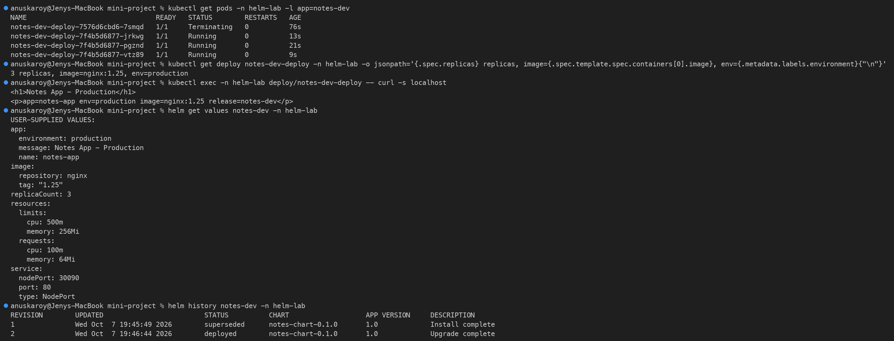

---

## Step 9: Simulate a Bad Upgrade

```bash
helm upgrade notes-dev notes-chart -n helm-lab --reuse-values --set image.tag=broken-tag-does-not-exist
```

> `--reuse-values` is required here. Without it, Helm starts again from `values.yaml` (development, 1 replica), so this "image-only" change would also quietly reset the production settings.

```text
Release "notes-dev" has been upgraded. Happy Helming!
NAME: notes-dev
LAST DEPLOYED: Wed Oct  7 19:47:21 2026
NAMESPACE: helm-lab
STATUS: deployed
REVISION: 3
DESCRIPTION: Upgrade complete
TEST SUITE: None
```

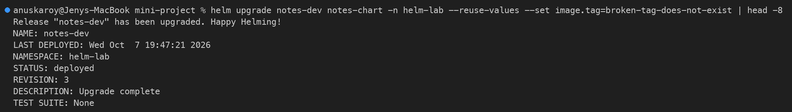

**Verify:**

```bash
kubectl rollout status deploy/notes-dev-deploy -n helm-lab --timeout=20s
kubectl get pods -n helm-lab -l app=notes-dev
kubectl get events -n helm-lab --field-selector reason=Failed -o custom-columns=OBJECT:.involvedObject.name,MESSAGE:.message | grep notes-dev | cut -c1-140 | head -2
helm history notes-dev -n helm-lab
```

```text
Waiting for deployment "notes-dev-deploy" rollout to finish: 1 out of 3 new replicas have been updated...
error: timed out waiting for the condition
NAME                                READY   STATUS         RESTARTS   AGE
notes-dev-deploy-7cddc9bc74-qzbh2   0/1     ErrImagePull   0          2m3s
notes-dev-deploy-7f4b5d6877-jrkwg   1/1     Running        0          2m31s
notes-dev-deploy-7f4b5d6877-pgznd   1/1     Running        0          2m39s
notes-dev-deploy-7f4b5d6877-vtz89   1/1     Running        0          2m27s
notes-dev-deploy-7cddc9bc74-qzbh2    Failed to pull image "nginx:broken-tag-does-not-exist": rpc error: code = NotFound desc = failed to pul
notes-dev-deploy-7cddc9bc74-qzbh2    Error: ErrImagePull
REVISION        UPDATED                         STATUS          CHART                   APP VERSION     DESCRIPTION
1               Wed Oct  7 19:45:49 2026        superseded      notes-chart-0.1.0       1.0             Install complete
2               Wed Oct  7 19:46:44 2026        superseded      notes-chart-0.1.0       1.0             Upgrade complete
3               Wed Oct  7 19:47:21 2026        deployed        notes-chart-0.1.0       1.0             Upgrade complete
```

❌ The new pod cannot pull its image. Helm still says revision 3 is `deployed`, because without `--wait` it does not check pod health. The readiness probe and rolling update keep the 3 production pods serving.

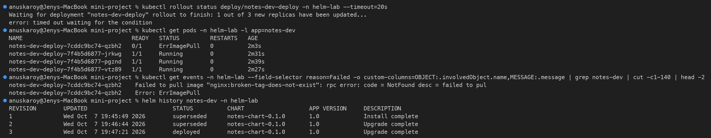

---

## Step 10: Rollback to Revision 2

```bash
helm rollback notes-dev 2 -n helm-lab --wait --timeout 3m
```

```text
Rollback was a success! Happy Helming!
```

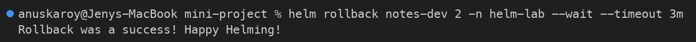

**Verify:**

```bash
kubectl rollout status deploy/notes-dev-deploy -n helm-lab
kubectl get pods -n helm-lab -l app=notes-dev
kubectl exec -n helm-lab deploy/notes-dev-deploy -- curl -s localhost
helm history notes-dev -n helm-lab
helm status notes-dev -n helm-lab | head -6
```

```text
deployment "notes-dev-deploy" successfully rolled out
NAME                                READY   STATUS        RESTARTS   AGE
notes-dev-deploy-7cddc9bc74-qzbh2   0/1     Terminating   0          3m48s
notes-dev-deploy-7f4b5d6877-jrkwg   1/1     Running       0          4m16s
notes-dev-deploy-7f4b5d6877-pgznd   1/1     Running       0          4m24s
notes-dev-deploy-7f4b5d6877-vtz89   1/1     Running       0          4m12s
<h1>Notes App - Production</h1>
<p>app=notes-app env=production image=nginx:1.25 release=notes-dev</p>
REVISION        UPDATED                         STATUS          CHART                   APP VERSION     DESCRIPTION
1               Wed Oct  7 19:45:49 2026        superseded      notes-chart-0.1.0       1.0             Install complete
2               Wed Oct  7 19:46:44 2026        superseded      notes-chart-0.1.0       1.0             Upgrade complete
3               Wed Oct  7 19:47:21 2026        superseded      notes-chart-0.1.0       1.0             Upgrade complete
4               Wed Oct  7 19:50:34 2026        deployed        notes-chart-0.1.0       1.0             Rollback to 2
NAME: notes-dev
LAST DEPLOYED: Wed Oct  7 19:50:34 2026
NAMESPACE: helm-lab
STATUS: deployed
REVISION: 4
DESCRIPTION: Rollback to 2
```

✅ The broken pod is removed and the production page (`nginx:1.25`, 3 replicas) is back. The rollback is recorded as revision 4, "Rollback to 2".

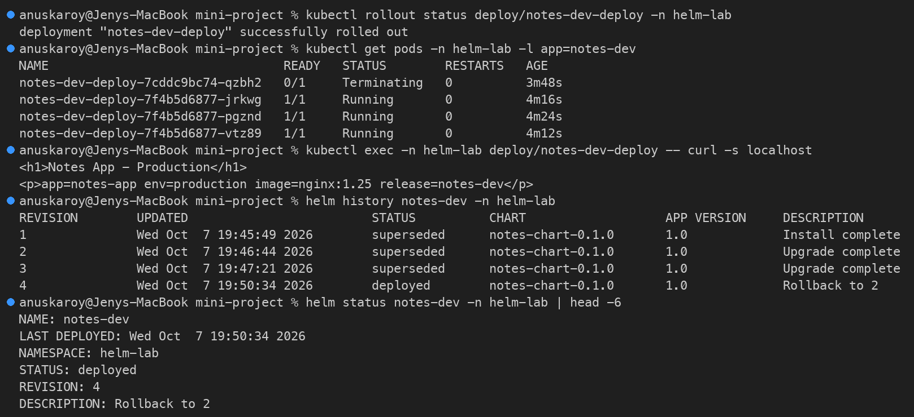

---

## Step 11: Clean Up

```bash
helm uninstall notes-dev -n helm-lab --wait
helm list -A
kubectl get all,configmap -n helm-lab -l app=notes-dev
```

```text
release "notes-dev" uninstalled
NAME    NAMESPACE       REVISION        UPDATED STATUS  CHART   APP VERSION
NAME                                    READY   STATUS        RESTARTS   AGE
pod/notes-dev-deploy-7f4b5d6877-jrkwg   1/1     Terminating   0          6m1s
pod/notes-dev-deploy-7f4b5d6877-pgznd   1/1     Terminating   0          6m9s
pod/notes-dev-deploy-7f4b5d6877-vtz89   1/1     Terminating   0          5m57s
```

The Deployment, Service and ConfigMap are deleted, and the last pods are terminating.

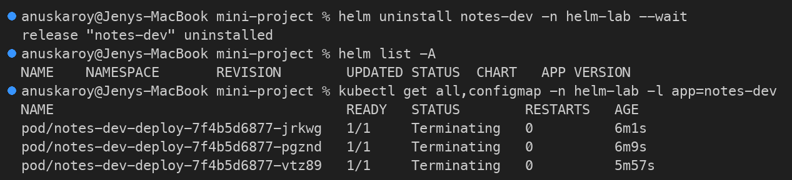

---

## Release Timeline

```text
REV  ACTION                                   RESULT
1    helm install (values.yaml)               dev, nginx:1.24, 1 replica      ✅
2    helm upgrade -f values-prod.yaml         prod, nginx:1.25, 3 replicas    ✅
3    helm upgrade --set image.tag=broken...   ErrImagePull on new pod         ❌
4    helm rollback notes-dev 2                prod, nginx:1.25, 3 replicas    ✅
```

## What You Practiced

```text
[PASS] Created a Helm chart: Chart.yaml, values.yaml, values-prod.yaml, templates
[PASS] Used helpers, include/nindent, toYaml, quote/default, conditionals, checksum annotation
[PASS] Validated with helm lint and helm template
[PASS] Installed to Kubernetes with helm install
[PASS] Upgraded with production values (-f values-prod.yaml)
[PASS] Simulated a bad upgrade (broken image tag) and detected it
[PASS] Rolled back to a healthy revision with helm rollback
[PASS] Cleaned up with helm uninstall
```

---

## Reference

* **Helm best practices:** https://helm.sh/docs/chart_best_practices/
* **Helm CLI reference:** https://helm.sh/docs/helm/
