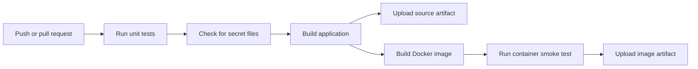
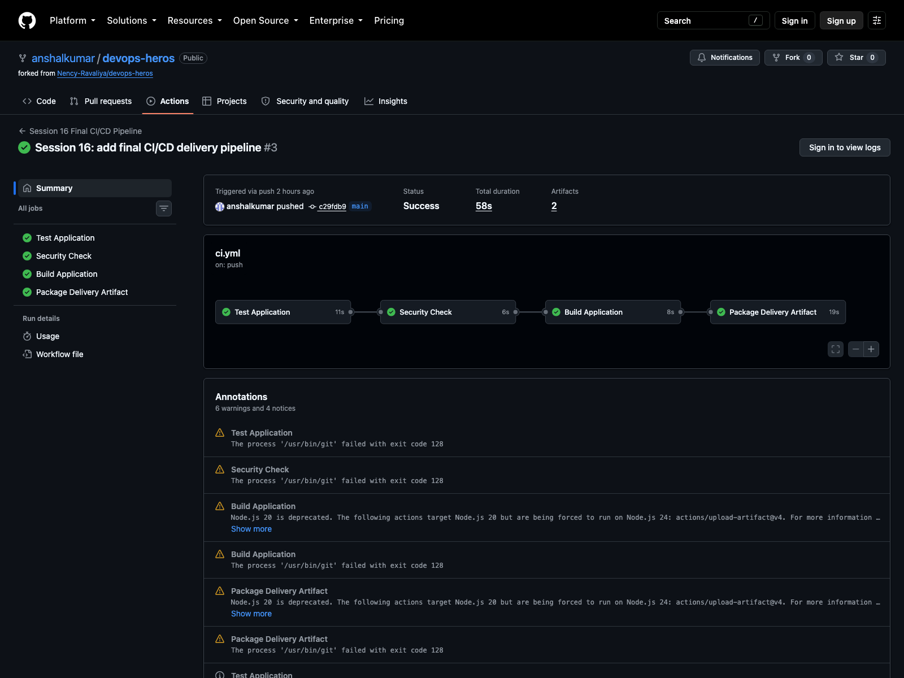

# Session 16 - Final CI/CD Pipeline

I used the calculator project for this assignment and added the Docker and delivery parts needed for the final workflow. The active workflow is [`.github/workflows/ci.yml`](../../.github/workflows/ci.yml).

## What happens on a push



The workflow has four jobs:

1. **Test Application** installs the Python requirements and runs the five pytest tests.
2. **Security Check** looks for files such as `.env`, private keys, and certificate keys in the project.
3. **Build Application** runs [`build.sh`](build.sh) and uploads the calculator build artifact.
4. **Package Delivery Artifact** builds the Docker image, runs a calculation inside the container, and uploads the saved image.

I linked the jobs with `needs`, so the Docker packaging job does not run if an earlier test or check fails.

## CI and CD in this project

The test, security, and build jobs are the CI part. They check that the application is safe to package after a change.

The final job is continuous delivery: it produces a tested Docker image artifact that can be downloaded and loaded with `docker load`. I did not call it automatic deployment because the assignment does not provide a registry, Kubernetes target, or deployment credentials.

## Running the same checks locally

```bash
cd session-16-github-actions/10-final-cicd-pipeline
python3 -m pip install -r requirements.txt
python3 -m pytest -v
chmod +x build.sh
./build.sh
docker build -t session16-calculator .
printf '2 + 3\nquit\n' | docker run --rm -i session16-calculator
```

The tests returned `5 passed`, and the container printed `Result: 5.0` for the smoke test.

## Secrets and artifacts

This version does not need credentials because it uploads artifacts to the workflow run. If I later push to a registry, I would store the username or token in **Settings → Secrets and variables → Actions** and use `${{ secrets.SECRET_NAME }}` in the workflow rather than committing it.

The successful run completed all four jobs in 58 seconds and produced two artifacts: [GitHub Actions run 36698690536](https://github.com/anshalkumar/devops-heros/actions/runs/36698690536).


