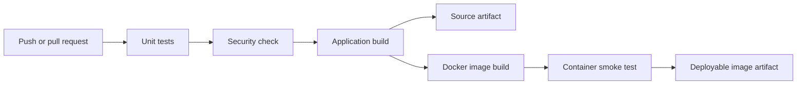

# Session 16 Final CI/CD Pipeline

This is the assignment's `10-final-cicd-pipeline` project. It starts with the instructor's calculator application and adds the Docker packaging and continuous-delivery stage required by the assignment list.

## Pipeline architecture



The active workflow is [`.github/workflows/ci.yml`](../../.github/workflows/ci.yml). GitHub only executes workflow files from the repository-level `.github/workflows` directory, so the instructor workflow preserved inside this project is reference material.

## CI and CD

**Continuous Integration** runs the five unit tests, checks for common secret file types, and builds the application after every relevant push or pull request.

**Continuous Delivery** builds the Docker image, verifies it by running a calculation inside the container, and publishes a compressed image as the `calculator-container-image` workflow artifact. The artifact is ready to load with `docker load`; no production target or registry credentials are required for this classroom project.

This is delivery rather than automatic production deployment. A real deployment stage would authenticate with a secret, push the image to a registry, and update a target such as Kubernetes.

## Project files

```text
10-final-cicd-pipeline/
├── app/calculator.py
├── tests/test_calculator.py
├── build.sh
├── Dockerfile
├── requirements.txt
└── README.md
```

## Workflow jobs

1. **Test Application** checks out the repository, installs Python dependencies, and runs pytest.
2. **Security Check** rejects `.env`, private-key, and certificate-key files in this project.
3. **Build Application** runs `build.sh` and uploads `calculator-build`.
4. **Package Delivery Artifact** builds and smoke-tests the Docker image, then uploads `calculator-container-image`.

All jobs use GitHub-hosted `ubuntu-latest` runners. `needs` creates the dependency chain, so packaging cannot run when an earlier gate fails.

## Secrets

This artifact-only delivery does not need credentials. For registry or deployment access, store credentials under **Settings → Secrets and variables → Actions** and reference them as `${{ secrets.SECRET_NAME }}`. Never put the value directly in workflow YAML or application source.

## Run locally

```bash
cd session-16-github-actions/10-final-cicd-pipeline
python3 -m pip install -r requirements.txt
python3 -m pytest -v
chmod +x build.sh
./build.sh
docker build -t session16-calculator .
printf '2 + 3\nquit\n' | docker run --rm -i session16-calculator
```

Expected test result: `5 passed`. The container output must include `Result: 5.0`.

## Successful execution evidence

The final four-job workflow succeeded on the first run in 58 seconds and published two artifacts. View [GitHub Actions run 36698690536](https://github.com/anshalkumar/devops-heros/actions/runs/36698690536).


