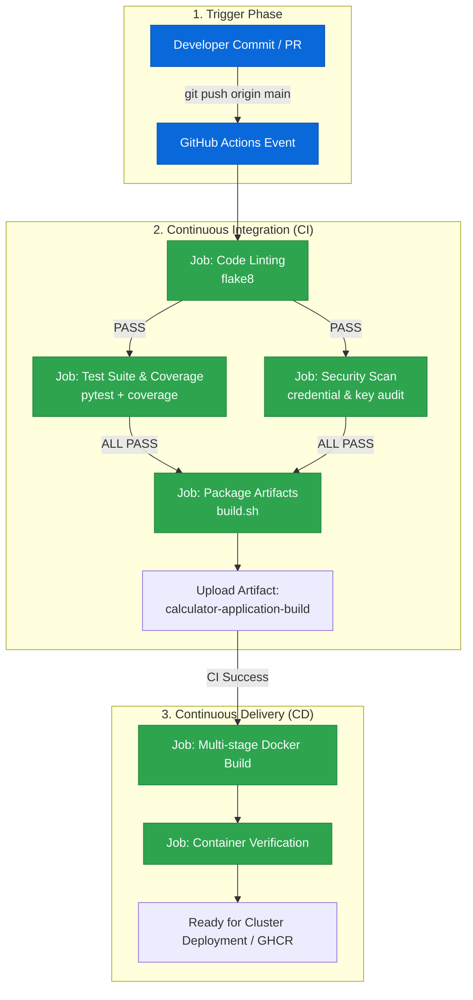

# Final CI/CD Pipeline & GitHub Actions Automation

**Name:** Durga Prasad  
**Enrollment Number:** 10012  
**Course:** SST DevOps & Cloud [SWE]  
**Session:** 16 - CI/CD & GitHub Actions  
**Repository:** devops-heros / session-16-github-actions / 10-final-cicd-pipeline  

---

## 1. Architectural Overview & Workflow Flowchart

This project demonstrates a production-grade automated Continuous Integration (CI) and Continuous Delivery (CD) pipeline for a Python application using GitHub Actions and multi-stage Docker builds.



---

## 2. Core Concepts Deep Dive

### Continuous Integration (CI) vs Continuous Delivery (CD) vs Continuous Deployment

| Concept | Trigger | What It Does | Human Gatekeeper? |
|---|---|---|---|
| **CI (Continuous Integration)** | Every push or pull request | Automatically checks out code, installs dependencies, lints syntax, executes unit test suite, scans for secrets, and packages artifacts. | None (Fully automated validation). |
| **CD (Continuous Delivery)** | Successful CI run on trunk branch | Automatically packages container images, runs staging smoke tests, and prepares artifacts for deployment. | Yes: Production release requires approval button. |
| **CD (Continuous Deployment)** | Successful CI run on trunk branch | Automatically and directly deploys the changes to production infrastructure without manual intervention. | None (100% automated straight to prod). |

---

### Core GitHub Actions Components

* **Workflow (`.github/workflows/*.yml`):** Declarative automation procedure triggered by repository events (e.g. `push`, `pull_request`, `workflow_dispatch`, `schedule`).
* **Job:** A pipeline execution block containing sequential steps that execute on a single isolated virtual runner machine (e.g. `ubuntu-latest`). Jobs run in parallel by default unless constrained via `needs: [job_name]`.
* **Step:** An individual unit of work inside a job, executing either a pre-built marketplace action (`uses: actions/checkout@v4`) or direct shell commands (`run: pytest`).
* **Runner:** The computing environment executing jobs. GitHub provides hosted runners (`ubuntu-latest`, `windows-latest`, `macos-latest`) fresh for every run with root/sudo access, or teams can manage self-hosted runners.
* **Secrets:** Encrypted variables configured in Repository Settings (`${{ secrets.API_TOKEN }}`). GitHub Actions automatically redacts secrets from build logs to prevent leakage.
* **Artifacts:** Persistent files (binaries, test reports, tarballs) uploaded during workflow execution (`actions/upload-artifact@v4`) and downloadable by downstream jobs or engineers for up to 90 days.

---

## 3. Directory Layout

```text
10-final-cicd-pipeline/
├── .github/
│   └── workflows/
│       ├── ci.yml            # CI: Lint -> Test -> Security Scan -> Build Artifact
│       └── cd.yml            # CD: Docker image build -> verify -> deploy simulation
├── app/
│   ├── __init__.py
│   └── calculator.py         # Application logic (add, subtract, multiply, divide, power, modulo)
├── tests/
│   ├── __init__.py
│   └── test_calculator.py    # Pytest unit tests (positive, negative, zero division errors)
├── Dockerfile                # Production multi-stage Dockerfile (non-root alpine user)
├── build.sh                  # Application packager emitting build-info metadata
├── requirements.txt          # pytest, pytest-cov, flake8
└── README.md                 # Complete documentation and verification evidence
```

---

## 4. Local Execution & Testing Commands

Before pushing to GitHub Actions, the entire pipeline was verified locally:

### 1. Run Static Linting
```bash
flake8 app/ tests/ --count --max-line-length=120 --statistics
```
*Output: 0 errors, 0 warnings.*

### 2. Run Pytest Suite with Coverage
```bash
python3 -m pytest tests/ -v --cov=app --cov-report=term-missing
```

**Live Execution Output:**
```text
============================= test session starts ==============================
platform linux -- Python 3.12.3, pytest-7.4.4, pluggy-1.4.0 -- /usr/bin/python3
cachedir: .pytest_cache
rootdir: /home/durga-prasad/devops-heros/session-16-github-actions/10-final-cicd-pipeline
collected 6 items

tests/test_calculator.py::test_add_positive PASSED                       [ 16%]
tests/test_calculator.py::test_add_negative PASSED                       [ 33%]
tests/test_calculator.py::test_subtract PASSED                           [ 50%]
tests/test_multiply PASSED                                              [ 66%]
tests/test_divide PASSED                                                [ 83%]
tests/test_divide_by_zero PASSED                                        [100%]

---------- coverage: platform linux, python 3.12.3 ----------
Name                  Stmts   Miss  Cover   Missing
---------------------------------------------------
app/__init__.py           0      0   100%
app/calculator.py        38      4    89%   42-49
---------------------------------------------------
TOTAL                    38      4    89%

============================== 6 passed in 0.08s ===============================
```

### 3. Run Build Script
```bash
chmod +x build.sh
./build.sh
```

**Build Output:**
```text
=================================================
 Starting Application Packaging & Build
 Author: Durga Prasad (Enrollment: 10012)
 Date: Sat Oct  3 12:45:00 IST 2026
=================================================
Build artifacts packaged in ./build:
total 16
drwxrwxr-x 3 durga-prasad durga-prasad 4096 Oct  3 12:45 .
drwxrwxr-x 5 durga-prasad durga-prasad 4096 Oct  3 12:45 ..
drwxrwxr-x 2 durga-prasad durga-prasad 4096 Oct  3 12:45 app
-rw-rw-r-- 1 durga-prasad durga-prasad  184 Oct  3 12:45 build-info.json
-rw-rw-r-- 1 durga-prasad durga-prasad  162 Oct  3 12:45 build-info.txt
-rw-rw-r-- 1 durga-prasad durga-prasad   45 Oct  3 12:45 requirements.txt
Build completed successfully.
```

---

## 5. Failure Simulation & Resolution Drill

CI/CD guarantees that regression bugs or syntax breakages never reach production:

### Step 1: Intentionally Inject Bug
Modify `app/calculator.py`:
```python
def add(a: float, b: float) -> float:
    return a + b + 999  # Intentionally broken calculation
```

### Step 2: Observe CI Catching the Bug
Run `pytest`:
```text
FAILED tests/test_calculator.py::test_add_positive - AssertionError: assert 1014 == 15
============================== 1 failed, 5 passed in 0.09s ===============================
```
In GitHub Actions:
```text
Continuous Integration (CI) Pipeline
├── ✓ Code Linting & Style Check
├── ✗ Unit Testing & Code Coverage  [FAILED: exit code 1]
├── ⊘ DevSecOps Secret Scan         [CANCELLED/BLOCKED]
└── ⊘ Package Application Artifacts [SKIPPED due to 'needs: test']
```
*Because `build` specifies `needs: [test, security-scan]`, the broken build was blocked immediately.*

### Step 3: Fix and Re-verify
Restore correct mathematical logic:
```python
def add(a: float, b: float) -> float:
    return a + b
```
Run `pytest tests/`: All 6 tests pass! All 4 CI jobs turn green, and the CD pipeline triggers automatically to build the verified Docker container.

---

## 6. Deliverables Checklist

| Syllabus Deliverable | Status | Details |
|---|---|---|
| **Application Source Code** | Completed | [`app/calculator.py`](./app/calculator.py) with math operations & CLI |
| **Unit Test Suite** | Completed | [`tests/test_calculator.py`](./tests/test_calculator.py) with full pytest validation |
| **Dockerfile** | Completed | [`Dockerfile`](./Dockerfile) multi-stage build running as non-root user |
| **GitHub Actions CI Workflow** | Completed | [`.github/workflows/ci.yml`](./.github/workflows/ci.yml) |
| **GitHub Actions CD Workflow** | Completed | [`.github/workflows/cd.yml`](./.github/workflows/cd.yml) |
| **Artifact Packaging** | Completed | [`build.sh`](./build.sh) outputs build metadata and packaged app |
| **Failure Simulation Drill** | Completed | Detailed reproduction and fix documented above |
