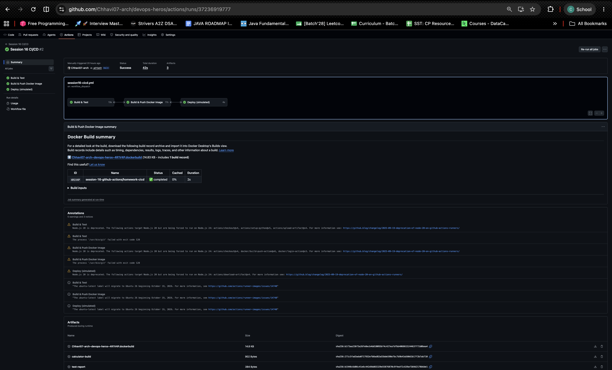
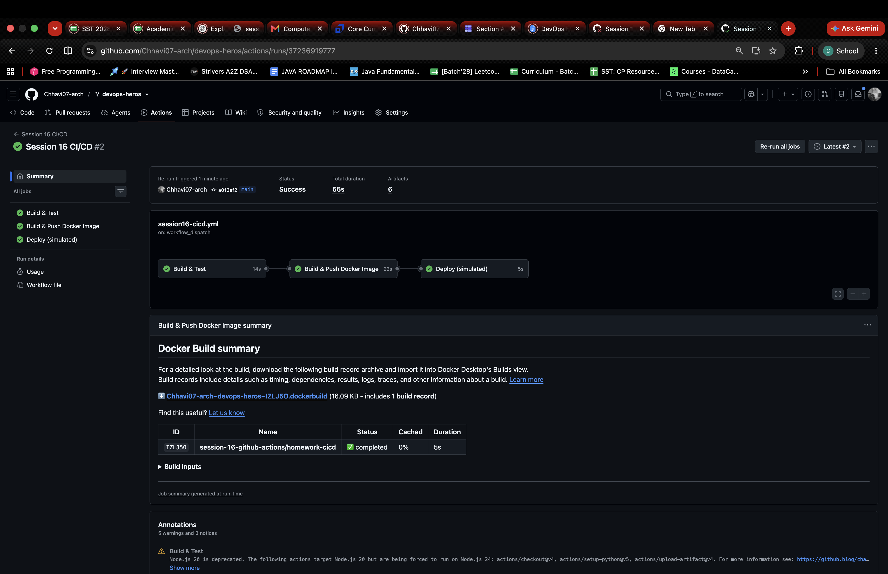
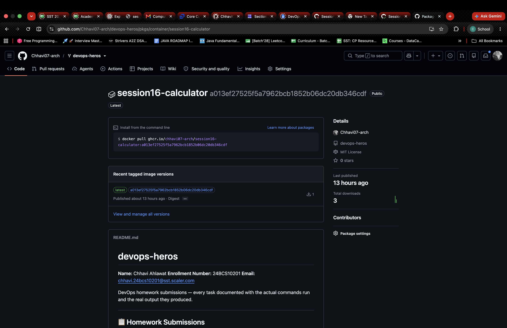

# Session 16 — CI/CD & GitHub Actions (Homework)

**Name:** Chhavi Ahlawat
**Enrollment Number:** 24BCS10201
**Email:** chhavi.24bcs10201@sst.scaler.com

---

## Homework Tasks

| Task | Description | Status |
|---|---|---|
| 1 | Demo app + tests + Dockerfile (`homework-cicd/`) | ✅ |
| 2 | CI pipeline — build, test, upload artifacts | ✅ |
| 3 | Docker image built and pushed to GHCR | ✅ |
| 4 | CD pipeline — deploy job using the build artifact | ✅ |
| 5 | Successful pipeline run on GitHub Actions | ✅ |

Based on the instructor's `session-16-github-actions/10-final-cicd-pipeline`.

## CI vs CD

- **CI (Continuous Integration):** every push is automatically built and tested.
- **CD (Continuous Delivery/Deployment):** a build that passed CI is automatically packaged and released.

Pipeline: `git push → Build & Test → Docker image → Deploy`

## Project Layout

```text
homework-cicd/
├── app/calculator.py          # app source
├── tests/test_calculator.py   # pytest tests
├── requirements.txt
├── build.sh                   # creates build/ artifact
└── Dockerfile
.github/workflows/session16-cicd.yml   # workflow (repo root — the only place Actions runs from)
```

## Concepts in the Workflow

| Concept | Where in `session16-cicd.yml` |
|---|---|
| Workflow | the whole file; triggered by `on: push` (paths filter) + `workflow_dispatch` |
| Jobs | `build-test` → `docker` → `deploy`, chained with `needs:` |
| Steps | `steps:` list in each job (`uses:` an action or `run:` a command) |
| Runners | `runs-on: ubuntu-latest` (GitHub-hosted VM) |
| Secrets | `secrets.GITHUB_TOKEN` to log in to GHCR (`permissions: packages: write`) |
| Artifacts | `upload-artifact` (`test-report`, `calculator-build`) → `download-artifact` in `deploy` |
| Build | `bash build.sh` + `docker/build-push-action` |
| Test | `pytest -v --junitxml=test-report.xml` |
| CD | `deploy` job with `environment: production` |

## 1. Run Locally

```bash
cd session-16-github-actions/homework-cicd
pip install -r requirements.txt
pytest -v
bash build.sh
```

## 2. Pipeline Run

Triggered by a push to `main` (any change under `homework-cicd/`) or **Actions → Session 16 CI/CD → Run workflow**.



## 3. CI: Build & Test



## 4. Docker Image on GHCR (and CD)

The `docker` job pushes the image to GHCR. The `deploy` job (`environment: production`) then downloads the build artifact and deploys.



```bash
docker pull ghcr.io/chhavi07-arch/session16-calculator:latest
docker run --rm ghcr.io/chhavi07-arch/session16-calculator:latest
```
