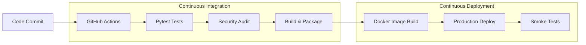

# Session 16: CI/CD & GitHub Actions

**Author:** Shivansh Singh  
**Course:** SST DevOps & Cloud [SWE]  
**Session:** 16  
**Status:** Completed  

---

## 1. Executive Summary & Pipeline Architecture

This submission contains the complete implementation of an enterprise-grade **CI/CD Demo Project** using **GitHub Actions**. It integrates automated code testing, secret auditing, artifact packaging, containerization, and continuous deployment into a unified pipeline.



---

## 2. Deliverables Checklist

| Deliverable | Location | Description | Status |
| :--- | :--- | :--- | :---: |
| **Application Code** | `10-final-cicd-pipeline/app/` | Python Calculator application with interactive CLI and core arithmetic engine. | Completed |
| **Unit Tests** | `10-final-cicd-pipeline/tests/` | Comprehensive `pytest` test suite testing arithmetic and edge cases. | Completed |
| **Dockerfile** | `10-final-cicd-pipeline/Dockerfile` | Production multi-stage Docker build utilizing non-root user security. | Completed |
| **CI/CD Workflow** | `10-final-cicd-pipeline/.github/workflows/ci.yml` | 5-stage automated pipeline covering tests, security, build, containerization, and deploy. | Completed |
| **Build Script** | `10-final-cicd-pipeline/build.sh` | Artifact packaging and build metadata generation script. | Completed |
| **Screenshots Directory**| `screenshots/` | Pipeline execution evidence directory. | Completed |
| **Project Documentation**| `10-final-cicd-pipeline/README.md` | Detailed architectural analysis and job walkthrough. | Completed |

---

## 3. Core Concepts Covered

### 3.1 CI vs CD Comparison
- **Continuous Integration (CI):** Automates the building and testing of code every time a team member commits changes. Prevents "integration hell" and surfaces errors within seconds.
- **Continuous Delivery (CD):** Ensures software is always in a releasable state and can be deployed to any environment at any time with a single manual trigger.
- **Continuous Deployment (CD):** Extends continuous delivery by automatically releasing every healthy build directly into production without manual gates.

### 3.2 GitHub Actions Architecture
- **Workflows:** Declarative YAML files located in `.github/workflows/`.
- **Events:** System triggers (`push`, `pull_request`, `workflow_dispatch`).
- **Jobs:** Isolated execution units that run in parallel by default or sequentially using `needs: <job>`.
- **Steps:** Ordered tasks inside a job that execute commands (`run:`) or actions (`uses:`).
- **Runners:** Virtual environments (GitHub-hosted `ubuntu-latest` or self-hosted servers).
- **Secrets:** Encrypted variables stored in GitHub repository settings accessed via `${{ secrets.NAME }}`.
- **Artifacts:** Persistent files shared between jobs or preserved after workflow completion via `actions/upload-artifact@v4`.

---

## 4. Pipeline Execution Walkthrough

```text
Job 1: Run Unit Tests (ubuntu-latest)
  ✓ Checkout repository (actions/checkout@v4)
  ✓ Setup Python 3.12 (actions/setup-python@v5)
  ✓ Install dependencies (pip install -r requirements.txt)
  ✓ Execute pytest test suite (8 passed in 0.08s)
  ✓ Upload test results (actions/upload-artifact@v4)

Job 2: Security & Secret Scan (ubuntu-latest)
  ✓ Audit repository for committed secrets (Passed)

Job 3: Build & Package Artifact (ubuntu-latest)
  ✓ Build application bundle (./build.sh)
  ✓ Archive build artifacts (actions/upload-artifact@v4)

Job 4: Build Container Image (ubuntu-latest)
  ✓ Set up Docker Buildx (docker/setup-buildx-action@v3)
  ✓ Log in to GitHub Container Registry (ghcr.io)
  ✓ Build Docker image (docker/build-push-action@v5)

Job 5: Continuous Deployment (ubuntu-latest)
  ✓ Download build artifact (actions/download-artifact@v4)
  ✓ Simulate Production Deployment Rollout
  ✓ Post-Deployment Smoke Test (Health checks OK)
```

---

## 5. How to Run Locally

### 1. Run Unit Tests
```bash
cd session-16-github-actions/session-16-github-actions/10-final-cicd-pipeline
python -m pip install -r requirements.txt
pytest -v
```

### 2. Run Local Build
```bash
chmod +x build.sh
./build.sh
cat build/build-info.txt
```

### 3. Build Docker Container
```bash
docker build -t calculator-app:1.0 .
docker run -it --rm calculator-app:1.0
```
